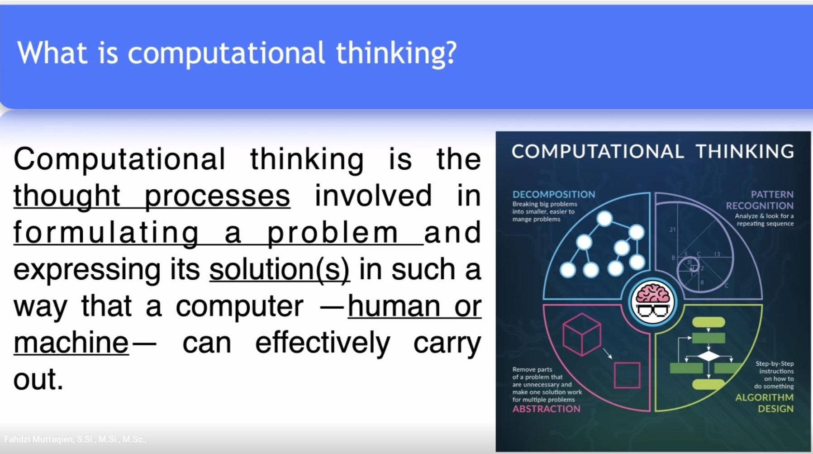

```{r setup, include=FALSE}
knitr::opts_chunk$set(echo = TRUE)
setwd("~/S2 Sains Komputasi ITB/Kuliah/Semester I/Algorithm and Software Design")
library(dplyr)
library(ggplot2)
```

\newpage
\tableofcontents
\newpage
\listoffigures
\newpage

# SILABUS 

## Keterangan Umum 

### Silabus Ringkas	

Pada mata kuliah ini, mahasiswa akan mempelajari dan membahas tentang teknik-teknik pengembangan algoritma yang banyak digunakan, optimasi dan perancangan program berbasis data.

### Silabus Lengkap 

#### Pendahuluan 

Ruang lingkup perkuliahan: 

- Topik-topik terkait dengan perkuliahan, pengantar algoritma; 
- Algoritma pemrograman: 
    - Pengembangan pola berpikir, 
    - Kinerja program, 
    - Algoritma dasar, 
    - _Flow-chart_, 
    - Fungsi, 
    - Pola pemrograman algoritma rekursif. 
- Optimasi Algoritma: 
    - _Bellman Algorithm_, 
    - Pencarian jalan terdekat, pengukuran efisiensi, Djikstra Algorithm. 
- Aplikasi _Djikstra_, _Genetic algorithm_, _Holland theory_, aplikasi GA; 
- Perancangan program terstruktur: 
    - Program _design_, _water fall_, _quick_, _proto typing_, pengertian _system_ dan aliran data.
- Rancangan _context diagram_
- Data _Flow_ diagram, basis data, _ERD_.
- Perancangan berbasis object _Unified Model Language_ (UML), aktor, diagram _use-case_, pendefinisian masalah, _activation diagram_ dalam UML, _break down_ problem dalam _use-case_ dan _activity diagram_, _interaction diagram_, _class diagram_, _swim lane_, _collaboration diagram_.

### _Outcomes_ 

1. Mahasiswa akan memahami dan menguasa teknik-teknik pengembangan algoritma dan perancangang program yang banyak digunakan.
1. Mahasiswa akan dapat mengembangkan dan menulis algoritma suatu karya progam dengan baik dan benar menggunakan metoda yang beragam.
1. Mahasiswa akan memiliki pengalaman perancangan suatu system dan program.

### Panduan Penilaian 

```{r,echo=FALSE,fig.retina=10,fig.align='center',message=FALSE,warning=FALSE,fig.cap="Bobot Penilaian"}
data.frame(
  ket = c("Exam","Tugas"),
  persen = c(30,70)
) %>% 
  mutate(label = paste0(ket,"\n",persen,"%")) %>% 
  ggplot(aes(x = reorder(ket,-persen),
             y = persen)) +
  geom_col(aes(fill = label),
           color = "black") +
  geom_label(aes(label = label)) +
  labs(title = "Porsi Penliaian Awal Mata Kuliah",
       subtitle = "Pemrograman dalam Sains",
       caption = "Dibuat dengan R\nikanx101.com") +
  theme_minimal() +
  theme(axis.title = element_blank(),
        axis.text = element_blank(),
        legend.position = "none") +
  coord_polar()
```

\newpage

## Satuan Acara Perkuliahan

```{r out.width="100%",echo=FALSE,fig.retina=10,fig.align='center',message=FALSE,warning=FALSE,fig.cap="Satuan Acara Perkuliahan"}

```


## Info Lainnya

UTS akan dilaksanakan kira-kira pada minggu ke-8. Setelah itu baru masuk ke topik perancangan perangkat lunak (baru di sini akan ada kerja kelompok). _Ending_-nya presentasi per kelompok.

Semua dikumpulkan via ___Ms. Teams___.

\newpage

# PERTEMUAN MINGGU I 

26 Agustus 2021

## _Computational Thinking_

Ada empat pilar:

1. Dekomposisi.
    - Memecah masalah besar ke masalah-masalah yang lebih kecil sehingga lebih bisa di-_manage_.
1. _Pattern recognition_.
    - Menganalisa dan melihat apakah ada pola atau pengulangan.
1. _Algorithm design_
    - Menuliskan langkah-langkah dalam bentuk formal.
1. _Abstraction_
    - Memisahkan mana yang _important_, mana yang _less important_.


```{r out.width="100%",echo=FALSE,fig.retina=10,fig.align='center',message=FALSE,warning=FALSE,fig.cap="Computational Thinking"}

```


## _Algorithm_

> ___A set of procedure (step by step) to solve a (sub)problem.___

Bentuknya bisa:

- _Pseudocode_
- _Flowchart_

```{r out.width="100%",echo=FALSE,fig.retina=10,fig.align='center',message=FALSE,warning=FALSE,fig.cap="Flowchart"}

```

Algoritma biasanya memiliki minimal `3` _control structure_, yakni:

1. _Sequence_
1. _Conditional_
1. _Repetition / loop_

### Contoh {-}

Bagaimana cara mengurutkan bilangan berikut ini:

$$5,8,6,1,3$$

\newpage

#### _Pseudocode_ {-}

Jawaban standarnya seperti ini:

```{r out.width="40%",echo=FALSE,fig.retina=10,fig.align='center',message=FALSE,warning=FALSE,fig.cap="Contoh Pseudo Code"}
knitr::include_graphics("jawab.jpg")
```

#### _Flowchart_ {-}

Berikut adalah bentuk _flowchart_-nya:

```{r out.width="40%",echo=FALSE,fig.retina=10,fig.align='center',message=FALSE,warning=FALSE,fig.cap="Contoh Flowchart"}
knitr::include_graphics("x2.jpg")
```

\newpage

#### Jawaban Sendiri Versi 1^[https://ikanx101.com/blog/sort-number/] {-}

Kalau dengan jawaban sendiri, _pseudocode_-nya adalah sebagai berikut:

- __Step 1__: _INPUT_ _vector_ berupa numerik yang tidak berurut, misal dinotasikan sebagai $a$ dengan $n$ buah elemen.
- __Step 2__: Akan saya buat _vector_ $b$ dengan panjang $n$ elemen.
- __Step 3__: $b_1$ akan saya isi dengan angka terendah dari $a$. Setelah dipindahkan, $a$ kini memiliki elemen sebanyak $n-1$.
- __Step 4__: Ulang __step 3__ hingga semua elemen $a$ dipindahkan ke $b$.

```{r}
rm(list=ls())

soal = c(5,8,6,1,3,1,2,-5,2,2,-4)

urut_donk = function(input){
  # set initial condition
  a = input
  n = length(input)
  
  # siapkan vector kosong
  b = c()
  
  # repetition dengan syarat a masih ada
    # dilihat dari panjang n yang masih > 0
  while(n > 0){
    # mengambil elemen terkecil dari a
    min = min(input)
    n_min = length(which(input == min))
    # memindahkan elemen tersebut ke dalam b
    b = c(b,
          rep(min,n_min)
          )
    # menghapus elemen a yang sudah dipindahkan
    input = input[!input %in% b]
    n = length(input)
  }
  
  output = list(`Data asli` = a,
                `Hasil terurut` = b)
  return(output)
}

urut_donk(soal)
```

#### Jawaban Sendiri Versi 2^[https://ikanx101.com/blog/sort-number/] {-}

Bagaimana jika kita tidak boleh menggunakan fungsi lain selain _looping_, _conditional_, dan `length()`?

Caranya hampir mirip dengan _flowchart_ di atas, yakni:

1. _Input_ _vector_ yang hendak diurutkan, misal notasi $a$. 
    - Hitung ada berapa _elemen_ yang ada, misal notasi $n$.
1. Bandingkan $a_1$ dengan elemen di sebelahnya.
    - Jika $a_1 > a_2$ maka tukar posisi.
    - Lanjutkan perbandingan $a_1$ dengan elemen selanjutnya hingga elemen ke-$n$.
1. Lanjutkan perbandingan untuk elemen kedua dan seterusnya.

```{r}
rm(list=ls())

urut_lagi_donk = function(a){
  # set initial condition
  input = a
  n = length(a)

  # looping
  for(i in 1:(n-1)){
    for(j in (i+1):n){
      temp1 = a[i] # temporary
      temp2 = a[j]  # temporary
      if(temp1 > temp2){
        # proses penukaran
        a[i] = temp2
        a[j] = temp1
        }
      }
    }
  # menulis hasilnya
  hasil = list(
    `Data asli` = input,
    `Hasil terurut` = a
  )
  # print output
  return(hasil)
}

soal = c(9,8,6,1,3,1,-10)

urut_lagi_donk(soal)
```

\newpage

# PERTEMUAN MINGGU II
2 September 2021

## _Algorithm Design_

Algoritma disusun setidaknya memiliki tiga _control structure_, yakni:

1. _Sequence_,
1. _Conditional_,
1. _Repetition_ atau _loop_.

Algoritma dibuat sesuai dengan kreativitas masing-masing. Bisa jadi jalan seseorang berbeda dengan orang lainnya. Untuk membandingkan algoritma mana yang terbaik, kita bisa cek dua parameter ini:

1. _Running time_ terkecil.
1. _Memory used_ (__RAM__) terkecil.

## Algoritma Sederhana

### _Case Study_ I

Buatlah algoritma yang bisa mengecek suatu bilangan adalah bilangan prima atau bukan!

```{r}
rm(list=ls())

is_prime = function(n){
  hasil = NA
  temp_1 = 0
  if(n > 1){
    for(i in 2:n){
      temp_2 = n %% i == 0
      temp_2 = temp_1 + temp_2
      hasil = ifelse(temp_2 == 0,
                     "Prime",
                     "Not Prime")
    } 
  } else{
      hasil = "Bilangan < 1"
    }
  return(hasil)
}

is_prime(4)
```


\newpage

## Quiz

### Soal 1 {-}

> _Construct Pascal's triangle!_

```{r}
rm(list=ls())

# ide dasarnya adalah hanya dengan menggeser baris atas ke bawah
  # lalu geser ke kiri
  # lalu geser ke kanan

pascal = function(n){
  # initial
  x = 1
  print(x)
  for(i in 2:n){
    x = c(0,x) + c(x,0)
    print(x)
  }
}

# kita uji coba ya
pascal(15)
```

\newpage

### Soal 2 {-}

> _Find n-th Fibonacci number_: $F_n = F_{n-1} + F_{n-2}, F_0 = 0, F_1 = 1$ 

```{r}
rm(list=ls())

# set initial condition
f = c(0,1)

# karena basis di R dimulai dari 1 sedangkan Fibonacci dimulai dari 0
  # maka nanti indexing akan dibuat kurang 1
  # proses deduksi
n = 10
for(i in 2:n){
  f[i+1] = f[i] + f[i-1]
}

# berikut adalah hasilnya:
f
```

Atas dasar ini kita akan buat _function_-nya sebagai berikut:

```{r}
fibo = function(n){
  f = c(0,1)
  for(i in 2:n){
  f[i+1] = f[i] + f[i-1]
  }
  return(list(`Fibonacci Seq` = f,
              `nth Fibo Number` = max(f))
         )
}

# saatnya uji coba
fibo(10)
```

\newpage
### Soal 3 {-}

> _Bikin algoritma faktorial!_

Untuk memudahkan pembuatan algoritma, kita akan melihat kembali definisi dari faktorial^[https://id.wikipedia.org/wiki/Faktorial] sebagai berikut:

$$n! = (n)(n-1)(n-2)..(1)$$

Dengan syarat $n \geq 0$ dan $n$ berupa _integer_. Namun perlu diperhatikan bahwa $0! = 1$.

Oleh karena itu, kita bisa menggunakan prinsip rekursif dengan algoritma dalam _pseudocode_ berikut ini:

#### Algoritma dalam _Pseudocode_ {-}

```
INPUT n

IF n NOT INTEGER OR n < 0 STOP

IF n = 0 OR n = 1 RETURN 1

ELSE 

DEFINE a = 1

FOR i 2:n
  a = a*i
RETURN a
```

Bentuk _flowchart_ dari _pseudocode_ di atas adalah sebagai berikut:

\newpage

#### Algoritma dalam _Flowchart_ {-}

```{r out.width="50%",echo=FALSE,fig.align='center',fig.cap = "Flowchart Faktorial"}
nomnoml::nomnoml("#direction: down,
                 [<start> start] -> [<choice> Integer?\nAND\nn>0]
                 [<choice> Integer?\nAND\nn>0] -> NO[<usecase> STOP]
                 [<choice> Integer?\nAND\nn>0] -> YES[<choice> n<=1]
                 [<choice> n<=1] -> YES[Return 1]
                 [<choice> n<=1] -> NO[a = 1\ni = 2]
                 [a = 1\ni = 2] -> [<choice> i <= n]
                 
                 [<choice> i <= n] -> YES [a = a * i]
                 [a = a * i] -> [i = i + 1]
                 [<choice> i <= n] <- [i = i + 1]
                 
                 [<choice> i <= n] -> NO [Return a]
                 
                 [Return a] -> [<end> stop]
")
```

\newpage

#### __R__ _function_ {-}

Sekarang algoritma di atas jika dibuat __R__ _function_-nya adalah sebagai berikut:

```{r}
f_torial = function(n){
  # initial definition
  hasil = 1
  
  # conditional
  if(n < 0){hasil = "n yang dimasukkan < 0"}
    else if(n %in% c(0,1)){hasil = 1}
      else{
        for(i in 2:n){
          hasil = hasil*i
          }
      }
  
  # return output perhitungan
  output = list(
    `Input angka` = n,
    `n!` = hasil
  )
  
  # print output
  return(output)
}
```

Mari kita cek hasilnya dalam berbagai kondisi berikut:

```{r}
f_torial(-2)
f_torial(0)
f_torial(1)
f_torial(4)
f_torial(7)
f_torial(10)
```

\newpage

# PERTEMUAN MINGGU III
9 September 2021

## _Numerical Method_


### Mencari Akar Persamaan

#### _Bisection Method_ {-}

Ini mirip dengan mata kuliah __Analisis Numerik Lanjut__ SK5001. Dari mata kuliah sebelumnya, saya modifikasi penentuan _error_ menjadi $(b-a) < tol_{max}$ sehingga _function_-nya menjadi:

```{r}
rm(list=ls())

bagi_dua = function(a,b,f,iter_max,tol_max){
  # fungsi untuk grafik
    # set nilai x
      baris = seq(a,b,by = .05)
    # nilai y
      y = f(baris)
    # bikin plotnya
      plot = 
        data.frame(x = baris,y) %>% 
        ggplot(aes(x,y)) +
        geom_line(group = 1,
                  color = "darkblue") +
        coord_equal() +
        geom_hline(yintercept = 0)
  
  # fungsi hitung bisection
    # initial condition
    i = 1
    hasil = data.frame(n_iter = NA,
                       a = NA,
                       b = NA,
                       c = NA)

    while(i<= iter_max && (b-a) > tol_max){
      # cari titik tengahnya
      p = a + ((b-a)/2)
      # hitung fungsi di titik tengah
      FP = f(p)
      # hitung fungsi di titik awal
      FA = f(a)
      # hitung fungsi di titik akhir
      FB = f(b)
      # tulis hasil dalam data frame
      hasil[i,] = list(i,a,b,p)
      
      # tukar nilai a atau b dengan nilai p 
      if(FA*FP < 0){b = p} else{a = p}
      # untuk iterasi berikutnya
      i  = i + 1
      
      # mencatat akar persamaan
      akar = p
      # tambahin dulu checking apakah f(a), f(b),atau f(c) ada yang nol?
      if(FP == 0){
        akar = p
        break} else if(FA == 0){
          akar = a
          break} else if(FB == 0){
            akar = b
            break}
      
    }
  
  # mencatat iterasi terbesar
  iterasi = i-1 # dikurang satu karena pada i+1 
                # sebenarnya tidak ada proses jika pada while TRUE
  
  # membuat ouput
  hasil = list(
    `plot f(x) di selang [a,b]` = plot,
    `iterasi max` = iterasi,
    `akar persamaan` = akar,
    `hasil perhitungan` = hasil
    )
  
  # print output
  return(hasil)
}
```

\newpage

Pada metode ini, pemilihan selang menjadi krusial. Contohnya adalah $f(x) = x^2 - 1$ di selang $[0.5,3]$.

```{r}
a = 0
b = 2
f = function(x){x^2-1}
iter_max = 50
tol_max = 10^(-7)

bagi_dua(a,b,f,iter_max,tol_max)
```

#### Contoh Lainnya {-}

$f(x) = x^2 - 3 x + 2$ di selang $[1.8,2.2]$.

### Luas Area di Bawah Kurva

Ide dasarnya adalah $L = alas.tinggi$, dimana:

1. $alas$ bisa didefinisikan sebagai $\Delta x = x_2 - x_1$.
1. Sedangkan definisi $tinggi$ tergantung bidang yang dipilih.
    - Jika kita menggunakan _square_ di titik tengah $\Delta x$, maka $tinggi = f(\frac{x_1+x_2}{2})$.
    - Jika kita menggunakan _trapezoid_, maka $tinggi = \frac{f(x_1) + f(x_2)}{2}$.
    
Algoritmanya:

```{r}
rm(list=ls())

persegi = function(x0,xn,n){
  h = (xn - x0) / n
  integration = f(x0)
  for(i in 1:n){
    k = x0 + i*h
    integration = integration + f(k)
  }
  integration = integration * h
  return(integration)
}

# bikin sendiri
trapezoid = function(x0,xn,n){
  h = (xn - x0) / n
  f0 = f(x0)
  # selang pertama
  i = 1
  k = x0 + i*h
  fn = f(k)
  integration = (f0+fn)/2
  for(i in 2:n){
    f0 = fn
    k = x0 + i*h
    fn = f(k)
    temp = (f0+fn)/2
    integration = integration + temp
  }
  integration = integration * h
  return(integration)
}

# dari dosen
trapezoidal = function(x0,xn,n){
  h = (xn - x0) / n
  integration = f(x0) + f(xn)
  
  for(i in 1:n){
    k = x0 + i*h
    integration = integration + 2*f(k)
  }
  integration = integration * h/2
  return(integration)
}

f = function(x){1/(1 + x^2)}
a = 2
b = 5

data.frame(x = seq(a,b,by = .01)) %>% 
  mutate(y = f(x)) %>% 
  ggplot(aes(x,y)) +
  geom_line()

persegi(2,5,90000)
trapezoid(2,5,90000)
trapezoidal(2,5,90000)
```

### Solusi Persamaan Diferensial

$$\frac{dy}{dt} = f(t,y)$$

Harus diketahui minimal `1` _initial condition_, misal: $y(t_0) = y_0$.

Kita akan selesaikan dengan metode __Runge-Kutta__ order 4. Bentuk umumnya adalah sebagai berikut:

$$y_{n+1} = y_n + h \sum_{i=1}^n b_i k_i$$

dimana $k_i$ adalah konstanta yang harus dicari.

```{r}
rk_4order = function(f, x0, y0, h, n){
  # initial condition
  x = x0
  y = y0
  # proses iterasi
  for(i in 1:n){
    k1 = f(x0,y0)
    k2 = f(x0 + 0.5*h,y0 + 0.5*k1*h)
    k3 = f(x0 + 0.5*h,y0 + 0.5*k2*h)
    k4 = f(x0 + h,y0 + k3*h)
    y0 = y0 + (1/6)*(k1 + 2*k2 + 2*k3 + k4) * h
    x0 = x0 + h
    x = c(x, x0)
    y = c(y, y0)
  }
  # output
  output = data.frame(x = x,
                      y = y)
  return(output)
}
```

#### Contoh Soal

_Based on the following differential equation:_

$$\frac{d}{dt}y(t) = t \sqrt{y(t)}; y(0)=1$$

_Define_ $y(t)$ _for t = 0,1,2,..,10 by using 4th order Runge-Kutta!_ _Use h=0.1_.

_Compare the result with the following exact solution:_

$$y(t) = \frac{1}{16}(t^2+4)^2$$

Sekarang kita akan hitung bagaimana hasilnya:

```{r}
dydt = function(t,y){t * sqrt(y)}
y0 = 1
t0 = 0
h = 0.1
n = 100

hampiran = 
  rk_4order(f = dydt, 
            x0 = t0, 
            y0 = y0, 
            h = h, 
            n = n)
```

Lalu akan saya bandingkan hasilnya dari perhitungan _exact_ dan menghitung $\Delta = numerik - exact$ berikut:

```{r,echo=TRUE,message=FALSE,warning=FALSE}
y = function(t){(1/16)*(t^2 + 4)^2}
exact = 
  data.frame(t = seq(0,10,by = h)) %>% 
  mutate(y = y(t)) 
```

```{r,include=FALSE}
hampiran = 
  hampiran %>%  
  rename(t = x,
         y_numerik = y) 

exact = 
  exact %>%  
  rename(y_exact = y) 

final = 
  hampiran %>% 
  mutate(y_exact = exact$y_exact,
         t = as.numeric(t),
         delta = y_numerik - y_exact) 
```

```{r,echo=FALSE,message=FALSE,warning=FALSE}
final %>% 
  knitr::kable("simple",
               caption = "Hasil Perhitungan Exact vs Numerik (RK4)")
```


\newpage

# PERTEMUAN MINGGU IV
16 September 2021

## _Algorithm Design: Randomness_

### Simulasi Monte Carlo

Menggunakan Simulasi _Monte Carlo_ untuk menghitung luas integral. Cara kerjanya simpel, analoginya adalah melempar _darts_. Luas area di bawah kurva dihitung dengan cara:

$$L = \frac{darts_{ \text{on target} }} {darts_{ \text{All} }}$$

Metode ini merupakan metode _brute force_.

### _Flowchart_ Simulasi Monte Carlo

Berikut adalah flowchartnya:

```{r out.width="40%",echo=FALSE,message=FALSE,warning=FALSE,fig.align = "center",fig.cap="Flowchart Brute Force"}
nomnoml::nomnoml("#direction: down,
                 [<start> start] -> [<input> f(x), a, b, N]
                 [<input> f(x), a, b, N] -> [PENENTUAN BATAS|sb x: dari a - b|sb y: dari 0 - max(f(x)) di selang a - b|on_target = 0|i = 0]
                 [PENENTUAN BATAS] -> [<choice> i <= N]
                 
                 [<choice> i <= N] -> N [return (on_target/N)]
                 [return (on_target/N)] -> [<end> end]
                 
                 [<choice> i <= N] -> Y [GENERATE RANDOM|xi,yi di batas sb x dan sb y]
                 [GENERATE RANDOM] -> [<choice> yi <= f(xi)]
                 [<choice> yi <= f(xi)] -> Y [on_target = on_target + 1]
                 [<choice> yi <= f(xi)] -> N [i = i+1]
                 [on_target = on_target + 1] -> [i = i+1]
                 [i = i+1] -> [<choice> i <= N]
                 ")
```

\newpage


### Modifikasi Simulasi Monte Carlo

Kalau pakai simulasi Monte Carlo yang sebelumnya, kita terlalu _brute force_ sehingga secara komputasi akan butuh waktu lebih lama dan _generate random_ titik lebih lama. Oleh karena itu kita bisa memodifikasi menjadi sebagai berikut:

Idenya:

$$I = \int_z^b f(x)dx$$

dihitung sebagai:

$$<F^N> = \frac{b-a}{N+1} \sum_{i=0}^N f(a + (b-a) \xi_i)$$

dengan

$$\xi_i \text{ adalah random number antara 0 dan 1}$$

### _Flowchart_ Modifikasi Simulasi Monte Carlo

```{r out.width="40%",echo=FALSE,message=FALSE,warning=FALSE,fig.align = "center",fig.cap="Flowchart Modifikasi Monte Carlo"}
nomnoml::nomnoml("#direction: down,
                 [<start> start] -> [<input> f(x), a, b, N]
                 [<input> f(x), a, b, N] -> [DEFINE|sum = 0|i = 0]
                 [DEFINE] -> [<choice> i <= N]
                 
                 [<choice> i <= N] -> N [return (sum * (b-a) / N)]
                 [return (sum * (b-a) / N)] -> [<end> end]
                 
                 [<choice> i <= N] -> Y [GENERATE RANDOM|xi di selang a - b]
                 [GENERATE RANDOM] -> [sum = sum + (b-a)*f(xi)]
                 [sum = sum + (b-a)*f(xi)] -> [i = i + 1]
                 [i = i + 1] -> [<choice> i <= N]
                 ")
```

\newpage

# PERTEMUAN MINGGU V

## _Shortest Path Problems_

> Menggunakan energi seminimum mungkin untuk menyusui _path_ tertentu.

### _Breadth-First Search_

Algoritma sederhana untuk mencari rute di graf. Misalkan:

Graf $G = (V,E)$

Dengan $V$ adalah _vertex_.

Cara kerjanya adalah ___systematically explores___ semua kemungkinan _vertexes_ yang bisa dilalui lalu mencari _smallest number_ yang ada. Rute terpendek kemudian akan dicari.

Nanti setiap _vertexes_ yang terlewati akan diberikan bobot. Rute terpendek akan ditemukan dari sana.

### _Bellman-Ford_

Perbedaan algoritma ini dengan algoritma sebelumnya adalah __dimungkinkan ada bobot yang negatif__. Namun tidak boleh ada ___negative cycle___.

#### Soal Contoh {-}

```{r,include=FALSE}
rm(list=ls())
data = data.frame(
  label = c("s","t","x","y","z"),
  x = c(0,2,4,2,4),
  y = c(0,5,5,-5,-5)
)

graf = 
  ggplot() +
  # s-t
  geom_segment(aes(x=0,xend=2-.1,
                   y=0,yend=5),
               arrow = arrow(length = unit(.2,"cm"))) +
  # s-y
  geom_segment(aes(x=0,xend=2-.1,
                   y=0,yend=-5),
               arrow = arrow(length = unit(.2,"cm"))) +
  # t-x
  geom_curve(aes(x=2,xend=4-.1,
                 y=5,yend=5-.1),
             arrow = arrow(length = unit(.2,"cm"))) +
  # x-t
  geom_segment(aes(x=4,xend=2+.1,
                   y=5,yend=5),
               arrow = arrow(length = unit(.2,"cm"))) +
  # t-z
  geom_segment(aes(x=2,xend=4-.1,
                   y=5,yend=-5+.5),
               arrow = arrow(length = unit(.2,"cm"))) +
  # t-y
  geom_segment(aes(x=2,xend=2,
                   y=5,yend=-5+.5),
               arrow = arrow(length = unit(.2,"cm"))) +
  # y-z
  geom_segment(aes(x=2,xend=4-.1,
                   y=-5,yend=-5),
               arrow = arrow(length = unit(.2,"cm"))) +
  # y-x
  geom_segment(aes(x=2,xend=4-.1,
                   y=-5,yend=5-.5),
               arrow = arrow(length = unit(.2,"cm"))) +
  # z-x
  geom_segment(aes(x=4,xend=4,
                   y=-5,yend=5-.5),
               arrow = arrow(length = unit(.2,"cm"))) +
  # z-s
  geom_segment(aes(x=4,xend=0+.1,
                   y=-5,yend=0+.1),
               arrow = arrow(length = unit(.2,"cm"))) +
  geom_label(data = data,
             aes(x = x, 
                 y = y,
                 label = label),
             size = 7) +
  theme_void()
```

Jalankan _Bellman-Ford Algorithm_ dengan titik $z$ sebagai titik awal!

```{r out.width="60%",echo=FALSE,warning=FALSE,message=FALSE,fig.retina=10,fig.align='center',fig.cap="Graf Soal I"}
graf_soal = 
  graf +
  # s-t = 6
  annotate("text",x = 1,y=3,label = "6") +
  # s-y = 7
  annotate("text",x = 1,y=-3,label = "7") +
  # t-x = 5
  annotate("text",x = 3,y=3.4,label = "5") +
  # x-t = -2
  annotate("text",x = 3,y=4.6,label = "-2") +
  # z-x = 7 
  annotate("text",x = 3.9,y=0,label = "7") +
  # y-z = 9
  annotate("text",x = 3,y=-4.8,label = "9") +
  # t-y = 8
  annotate("text",x = 2.1,y=1,label = "8") +
  # z-s = 2 
  annotate("text",x = 1,y=-0.5,label = "2") +
  # y-x = -3
  annotate("text",x = 2.6,y=-1.5,label = "-3") +
  # t-z = -4
  annotate("text",x = 3.5,y=-3,label = "-4")

graf_soal
```

\newpage

#### Jawab {-}

Kita akan bikin dulu algoritmanya. _Feeding_-nya kita buat sebagai `data.frame()` saja. Prinsipnya sederhana, yakni melakukan _relaxation_ semua kemungkinan _edges_ dari graf yang ada.

```{r,echo=FALSE}
graf_df = data.frame(from  = c('s','s','t','t','t','y','y','x','z','z'),
                     to    = c('y','t','x','y','z','x','z','t','x','s'),
                     bobot = c(7,6,5,8,-4,-3,9,-2,7,2))
graf_df

d_titik = data.frame(titik = c("z","t","y","x","s"),
                     bobot = c(0,Inf,Inf,Inf,Inf)
                     )
d_titik
```

Berikut adalah algoritmanya^[https://www.youtube.com/watch?v=FtN3BYH2Zes]:

```
if d[u] + c(u,v) < d[v]
  d[v] = d[u] + c(u,v)
```

Sederhana kan?

Berikut dalam __R__-nya:

```{r,echo=TRUE}
# fungsi yang dbutuhkan
# ambil bobot edges dari u ke v
c = function(u,v){
  temp = 
    graf_df %>% 
    filter(from == u) %>% 
    filter(to == v)
  temp$bobot
}

# nilai node u
d = function(u){
  temp = 
    d_titik %>% 
    filter(titik == u)
  temp$bobot
}

# update node v
upd = function(v,value){
  d_titik$bobot[d_titik$titik == v] <<- value
}

# proses iterasi
for(ikanx in 1:10){ # diulang berkali-kali
for(init in d_titik$titik){
  temp = graf_df %>% filter(from == init)
  for(u in temp$from){
    for(v in temp$to){
      if(d(u) + c(u,v) < d(v)){
            val = d(u) + c(u,v)
            upd(v,val)
        }
    }
  }
}
}

d_titik
```

\newpage

Lihat kembali grafnya:

```{r out.width="60%",echo=FALSE,warning=FALSE,message=FALSE,fig.retina=10,fig.align='center',fig.cap="Graf Soal I"}
graf_soal = 
  graf +
  # s-t = 6
  annotate("text",x = 1,y=3,label = "6") +
  # s-y = 7
  annotate("text",x = 1,y=-3,label = "7") +
  # t-x = 5
  annotate("text",x = 3,y=3.4,label = "5") +
  # x-t = -2
  annotate("text",x = 3,y=4.6,label = "-2") +
  # z-x = 7 
  annotate("text",x = 3.9,y=0,label = "7") +
  # y-z = 9
  annotate("text",x = 3,y=-4.8,label = "9") +
  # t-y = 8
  annotate("text",x = 2.1,y=1,label = "8") +
  # z-s = 2 
  annotate("text",x = 1,y=-0.5,label = "2") +
  # y-x = -3
  annotate("text",x = 2.6,y=-1.5,label = "-3") +
  # t-z = -4
  annotate("text",x = 3.5,y=-3,label = "-4")

graf_soal
```

#### Kesimpulan {-}

Rutenya adalah __z-s-y-x-t__.

\newpage

### Djikstra

Kalau __Djikstra__ mirip dengan __Bellman-Ford__ tapi nilai bobotnya selalu __positif__.

### _A-star_ $A^*$ Algorithm

Menggunakan _heuristic function_ untuk menentukan _path_ mana yang harus dipilih.

_Heuristic functions_ yang bisa dipilih:

1. __Euclidean distance__: $h = \sqrt{(x - x')^2 + (y - y')^2}$.
1. __Manhattan distance__: $h = |x - x'| + |y - y'|$.
1. __Diagonal distance__: $h = \max{ \{ |x-x'|,|y-y'|\} }$.

\newpage

# PERTEMUAN MINGGU VI

## _Genetic Algorithm_

Algoritma yang didasarkan dari _natural selection_. Karena ini _heuristic_, maka tidak ada jaminan bahwa solusi yang ada sudah paling optimal karena bergantung dari pemilihan _parent solution_. Perhatikan istilahnya bernama _parent_, karena ini mengikuti biologi. Dari _parent_ bermutasi sampai jadi solusi. Kalau di analisa numerik kan disebutnya _initial solution_.

### _Advantages vs Disadvantages_

### _Basic Terminology_

- ___Population___ adalah semua kemungkinan solusi yang ada dari permasalahan.
- ___Chromosomes___ adalah __satu solusi__ dari permasalahan kita.
- ___Gene___ adalah __satu elemen__ dari suatu solusi yang ada.
- ___Allele___ adalah __isi__ dari suatu elemen solusi.
- ___Genotype___ adalah populasi dari _computation space_.
- ___Phenotype___ adalah populasi dari solusi real.
- ___Decoding___ adalah proses dari _Genotype_ ke _Phenotype_.
- ___Encoding___ adalah proses dari _Phenotype_ ke _Genotype_.
- ___Fitness Function___ adalah fungsi yang mengukur seberapa __cocok__ suatu solusi.
- ___Genetic Operators___ adalah proses alterasi dari kromosom. Bisa berupa _crossover_, mutasi, seleksi, dan lainnya.


```{r out.width="30%",echo=FALSE,fig.retina=10,fig.align='center',message=FALSE,warning=FALSE,fig.cap="Basic Terminology"}
knitr::include_graphics("Screenshot from 2021-10-07 07-38-10.png")
```

\newpage

### _Basic Structure_

Berikut adalah _flow_ dari _genetic algorithm_:

```{r out.width="35%",echo=FALSE,fig.align='center',fig.retina=10,fig.cap="GA Flow"}
nomnoml::nomnoml("#direction: down,
                 [Population|initialization] -> [Fitness|Function Calculations]
                 [Fitness] -> [Crossover]
                 [Crossover] -> [Mutation]
                 [Mutation] -> [Survivor|Selection]
                 [Survivor] -> [Terminate|Return the best]
                 
                 [Survivor] --> iteration [Fitness]
                 ")
```

Salah satu tantangan dalam _GA_ adalah menentukan populasi awalnya.

### Contoh Soal^[https://towardsdatascience.com/genetic-algorithm-explained-step-by-step-65358abe2bf]

Diberikan $2a^2 + b = 57$. Tentukan nilai $a,b$ dengan _GA_ yang meminimumkan:

$$f(a,b) = 2a^2 + b - 57$$

#### Jawab {-}

__STEP I__ kita akan buat suatu populasi. Kita bisa _set_ misalkan ada 6 kromosom secara _random_.

```{r,echo=FALSE}
rm(list=ls())
set.seed(101042)
intial_popu <- NULL
x <- 1
repeat {
  crm <- runif(2,1,10)
  crm <- as.integer(crm)
  intial_popu <- rbind(intial_popu,crm)
  x = x+1
  if (x == 7){
    break
  }
}
rownames(intial_popu) <- c('Cromosome1','Cromosome2','Cromosome3','Cromosome4','Cromosome5','Cromosome6')
print(intial_popu)
```


__STEP II__ proses _selection_, yakni memilih _fittest_ kromosom. Caranya adalah dengan menghitung _fitness value_. Kromosom yang menghasilkan _low values_ akan dipilih untuk generasi berikutnya.

Kita akan gunakan metode _roulette wheel_, yakni dengan menghitung:

$$FP = \frac{F_i}{\sum_{i=1}^n F_i}$$

Di mana $FP$ menandakan _fitness probability_ dan $F_i$ menandakan _fitness value_.

Untuk memilih _fittest_ kromosom, kita akan generate __6 random probabilities__.


```{r,echo=FALSE}
## Function to compute fitness
fit <- function(A){
  a <- A[1]
  b <- A[2]
  return(((2*a^2 + b) - 57))
}
fitness <- apply(intial_popu, 1, FUN = 'fit')
fitting <- 1/(fitness)
probfitting <- fitting/sum(fitting)
#generate random values of fitness prob. from 0 to 1
prob_gen <- runif(6,0,1)
newpopulation <- NULL
for(rr in prob_gen){
  sum <- 0
  for(prob in probfitting){
    sum <- sum + prob
    if(rr < sum){
      bin <- prob
      cromosomeS <- which(probfitting == bin, arr.ind = T)
      if(length(cromosomeS)>1){
        cromosomeS <- cromosomeS[1]
      } else{
        cromosomeS <- cromosomeS
      }
      cromname <- paste0('Cromosome',cromosomeS[1])
      newcromosome <- intial_popu[which(rownames(intial_popu) == cromname),]
      break
    }
  }
  newpopulation <- rbind(newpopulation,newcromosome,deparse.level = 2)
}
rownames(newpopulation) <- rownames(intial_popu) 
print(newpopulation)
```

Kita akan memilih kromosom yang jatuh di titik `ran_prob` sebagai _parents_ di generasi berikutnya.

__STEP III__ Berikutnya kita akan ubah nilai $a$ dan $b$ menjadi _binary_ lalu menggabungkannya. Saya akan gunakan sistem 4 _bits_, sehingga akan didapatkan 8 _bits_.

Kemudian kita akan lakukan _crossover_ atau perkawinan silang. Kita _set_ terlebih dahulu _crossover rate_. Misalkan `0.5`, artinya dari `6` kromosom, hanya `3` yang boleh __kawin__.

```{r,echo=FALSE}
##Function to convert integer to binary
binary <- function(x) {
  i <- 0
  string <- numeric(32)
  while(x > 0) {
    string[32 - i] <- x %% 2
    x <- x %/% 2
    i <- i + 1 
  }
  first <- match(1, string)
  string[first:32] 
}
##create binary matrix of 8 cols and 6 rows
binary_popu <- matrix(NA,nrow = 6,ncol = 8)
for(i in 1:nrow(newpopulation)){
 x <- binary(newpopulation[i,1])
binary_popu[i,1:length(x)] <- x
y <- binary(newpopulation[i,2])
binary_popu[i,5:(4+length(y))] <- y
  }
rownames(binary_popu) <- rownames(newpopulation)
cross_paramter <- 0.5
i = 1
crom_cross <- NULL
while(length(crom_cross) < 3){
  cross.crossover.prob <- runif(6,0,1)
  crom_cross <- which(cross.crossover.prob < cross_paramter,arr.ind = T)
  i = i + 1
}
parents <- binary_popu[crom_cross,]
position = 2 ##crossover position
cross_parent <- parents
cross_parent[1,1:position] <- parents[2,1:position]
cross_parent[2,1:position] <- parents[3,1:position]
cross_parent[3,1:position] <- parents[1,1:position]

listofindex <- which(row.names(binary_popu) %in% row.names(cross_parent))
offSpring <- binary_popu
offSpring[listofindex,] <- cross_parent
print(offSpring) ##offspring after crossover
```

__STEP IV__ Kita akan lakukan _mutation_. _Mutation rate_ juga harus kita definisikan terlebih dahulu.

```{r,echo=FALSE}
mutation_paramter <- 0.09
no.of.mutations <- 4  ## Calculated as nrow(offSpring)*ncol(offSpring)*mutation_paramter

randrow <- round(runif(no.of.mutations,1,nrow(offSpring)))
rancol <-  round(runif(no.of.mutations,1,ncol(offSpring)))

## Now get the offsprings by mutating at above position
for(r in 1:length(randrow)){
  if(is.na(offSpring[randrow[r],rancol[r]])){
    offSpring[randrow[r],rancol[r]] <- NA
  }else{
    if(offSpring[randrow[r],rancol[r]] == 0){
      offSpring[randrow[r],rancol[r]] <- 1
    }else{
      offSpring[randrow[r],rancol[r]] <- 0
    }
  }
}

print(offSpring) ## Chromosomes after mutation

## Now convert binary back to integer
binary_decimal = function(base_number, base = 2) {
  split_base = strsplit(as.character(base_number), split = "")
  return(sapply(split_base, function(x) sum(as.numeric(x) * base^(rev(seq_along(x) - 1)))))
}
offSpring_inter <- matrix(NA,6,2)
for(i in 1:nrow(offSpring)){
  a <- offSpring[i,1:4]
  a <- na.omit(a)
  a <- as.numeric(paste(a, collapse = ""))
  a <- binary_decimal(a)
  b <- offSpring[i,5:8]
  b <- na.omit(b)
  b <- as.numeric(paste(b, collapse = ""))
  b <- binary_decimal(b)
  offSpring_inter[i,1] <- a
  offSpring_inter[i,2] <- b
}
rownames(offSpring_inter) <- rownames(offSpring)
## Chromosomes converted back to integer after end of 1st of generation
print(offSpring_inter)
```

Proses di atas kita lakukan berulang-uang hingga mendapatkan hasil paling optimal.

\newpage

# EPILOG {-}

_Alhamdulillah_.