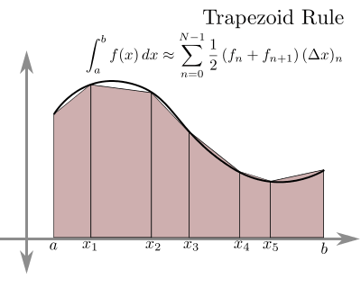

```{r setup, include=FALSE}
knitr::opts_chunk$set(echo = TRUE)
setwd("~/209_ITB/Semester I/Algorithm and Software Design/UTS")
options(digits = 9)

rm(list=ls())
library(dplyr)
library(ggplot2)
```

\newpage
\tableofcontents
\newpage
\listoffigures
\newpage

# PENDAHULUAN

## Bahasa Pemrograman yang Dipakai

Bahasa pemrograman yang digunakan pada tugas ini adalah __R__ versi `4.1.1`. Format tugas ini ditulis menggunakan _LaTex_ __R Markdown__ di _software_ __R Studio__. 

## _Libraries_ __R__ yang Digunakan

Berikut adalah beberapa _libraries_ yang digunakan dalam mengerjakan dan menuliskan tugas ini:

1. `dplyr`: untuk _data carpentry_.
1. `ggplot2`: sebagai visualisasi data (grafik).

## Program

Program yang digunakan untuk menjawab soal akan di kirimkan sebagai lampiran dan ditunjukkan dalam format `code` _markdown_. Agar bisa dieksekusi dengan baik, pastikan _libraries_ yang terlibat sudah ter-_install_ terlebih dahulu.

## Pembulatan

Seluruh jawaban numerik akan ditampilkan menggunakan __delapan angka berarti__.

## Program untuk Menggambar Fungsi

Berikut adalah program yang saya buat untuk menggambar fungsi:

```{r}
gambar_grafik = function(x_lower,x_upper, # selang x
                         y_lower,y_upper, # selang y
                         delta, # selang gambar
                         f){ # fungsi f(x,y)
  # generate selang
  selang_x = seq(x_lower,x_upper,by = delta)
  selang_y = seq(y_lower,y_upper,by = delta)
  
  # menghitung (x,y) yang memenuhi f(x,y) = 1
  df = 
    # mengeluarkan semua kombinasi yang mungkin dari selang
    expand.grid(selang_x,selang_y) %>% 
    as.data.frame() %>% 
    # mengubah nama variabel menjadi x,y
    rename(x = Var1,
           y = Var2) %>%  
    # menghitung nilai f(x,y)
    mutate(f = f(x,y)) %>%
    # hanya mengambil (x,y) yang memenuhi f(x,y) = 1
    filter(round(f,2) == 1)
  # membuat grafik
  df %>% 
    ggplot(aes(x,y)) +
    geom_point(size = .1,
               color = "steelblue") +
    theme_minimal() +
    geom_vline(xintercept = 0,color = "black") +
    geom_hline(yintercept = 0,color = "black") +
    labs(title = "Grafik f(x,y)",
         caption = "Digambar dengan R\n20921004@mahasiswa.itb.ac.id")
}
```

\newpage

# SOAL 1

# Algoritma Komputasi Numerik {-}

## Soal Utama

Diketahui sebuah fungsi:

$$\frac{(x+1)^2}{16} + \frac{(y-1)^2}{8} = 1$$

### Sub Soal I

Gambarlah fungsi tersebut. Hitunglah luas area di bawah kurva pada kuadran pertama untuk nilai $x \in [0, \sqrt{14}-1]$ dengan metode partisi trapesium.

### Jawaban Sub Soal I

__Gambar Fungsi__ Berikut adalah gambar fungsi yang saya buat dengan __R__.

```{r out.width="90%",echo=FALSE,warning=FALSE,message=FALSE,fig.retina=10, fig.cap="Grafik f(x,y)"}
# fungsi f(x,y) dari soal
f = function(x,y){
  p1 = ((x+1)^2)/16;p2 = ((y-1)^2)/8;return(p1+p2)
}

# gambar grafik
gambar_grafik(-10,4,-10,10,.005,f) + 
  coord_equal() +
  annotate("label",x = 1,y = 1,label = "Kuadran I")

```

\newpage

Sekarang kita akan menghitung luas area pada kuadran I di selang $x \in [0, \sqrt(14)-1]$. Saya akan gambarkan selang tersebut dengan garis merah sebagai berikut:

```{r,echo=FALSE,warning=FALSE,message=FALSE,fig.retina=10, fig.cap="Area Luas"}
soal = 
  gambar_grafik(-10,4,-10,10,.005,f) + 
  coord_equal() +
  geom_vline(xintercept = 0,
             color = "red") +
  geom_vline(xintercept = sqrt(14)-1,
             color = "red") +
  geom_hline(yintercept = 0,
             color = "red")

soal +
  annotate("label",
           x = 1.25,y = 1.5,size = 2.5,
           label = "Area yang dicari\nluasnya")
```

__Mengubah Fungsi__ Untuk memudahkan, kita perlu memodifikasi fungsi $f(x,y)$ ke dalam bentuk $y = g(x)$ yang lebih sederhana.

$$y = 1+ \sqrt{8 - \frac{(x+1)^2}{2}}$$

Karena kita akan menghitung luas area di kuadran I, maka nilai akar yang dihasilkan kita akan ambil hanya yang bernilai __positif__ saja.

```{r,include=FALSE}
g = function(x){
  isi = 8 - (((x+1)^2)/2)
  1 + sqrt(isi)
}

```

\newpage

__Luas Area di Bawah Kurva__ Ide dasar untuk menghitung luas area di bawah kurva adalah:

$$L = alas \times tinggi$$

Pada partisi trapesium, tinggi yang akan digunakan adalah: $tinggi = \frac{f(x_1) + f(x_2)}{2}$

```{r out.width="60%",echo=FALSE,warning=FALSE,message=FALSE,fig.retina=10, fig.cap="sumber: bragitoff.com"}

```

Pada metode trapesium ini, penentuan berapa banyak selang akan mempengaruhi seberapa akurat hasilnya.

Barikut adalah program __luastrap__ yang saya buat di __R__:

```{r}
luas_trap = function(x0, # titik awal
                     xn, # titik akhir
                     n,  # banyak selang
                     f){ # fungsi y = f(x)
  # menghitung delta x
  h = (xn - x0) / n
  # menghitung f di x0
  f0 = f(x0)
  # selang pertama
  i = 1
  k = x0 + i*h
  fn = f(k)
  integration = (f0+fn)/2
  # iterasi untuk selang berikutnya hingga selesai
  for(i in 2:n){
    f0 = fn
    k = x0 + i*h
    fn = f(k)
    temp = (f0+fn)/2
    integration = integration + temp
  }
  # menghitung hampiran luas
  integration = integration * h
  return(integration)
}
```

Sekarang kita akan bandingkan hasilnya untuk berbagai banyak selang.

```{r,echo=FALSE}
N = c(10,50,100,200,1000,2500,5000,100000,250000,500000,750000,1000000)
Luas = c()
for(i in 1:length(N)){
  Luas[i] = luas_trap(0,
                      sqrt(14)-1,
                      N[i],
                      g)
}

data.frame(N,Luas) %>% 
  rename("n banyak selang" = N,
         "Luas aproksimasi" = Luas) %>% 
  knitr::kable("simple",caption = "Hasil Perhitungan Luas",align = "c")
```

Terlihat bahwa semakin banyak selangnya, hasilnya konvergen ke suatu nilai yang sama yakni: __8.65536904__.

### Sub Soal II

Buatlah algoritma dan _flowchart_ untuk menghitung luas soal sebelumnya dengan metode Monte Carlo. Lakukan analisa hasil yang diperoleh dengan jumlah sampling yang diberikan. Anggaplah perhitungan analitis adalah yang benar sehingga merupakan rujukan nilai.

### Jawaban Sub Soal II

__Perhitungan Analitis__ Kita bisa menghitung secara analitis luas area di bawah kurva dengan cara melakukan integral tentu berikut ini:

$$\int_0^{\sqrt{14}-1} 1+ \sqrt{8 - \frac{(x+1)^2}{2}} \text{ dx}$$


