```{r setup, include=FALSE}
knitr::opts_chunk$set(echo = TRUE)

library(dplyr)
library(ggplot2)

options(scipen = 999)

rm(list=ls())
```

\newpage
\tableofcontents
\newpage
\listoffigures
\newpage

# MUKADIMAH {-}
# SILABUS 

## Keterangan Umum

### Silabus Ringkas

Materi kuliah meliputi metode numerik untuk sistem persamaan linear dan tak linear, optimasi numerik, serta persamaan diferensial biasa dan parsial.

### Silabus Lengkap 

Materi meliputi metode numerik untuk sistem persamaan linear dan tak linear, optimasi numerik, serta persamaan diferensial biasa dan parsial. Akan dibahas metode langsung untuk sistem persamaan linear (SPL), metode iteratif untuk SPL, hampiran nilai eigen, dan sistem persamaan tak linear. Topik optimasi numerik meliputi optimasi untuk satu dan banyak peubah tanpa kendala serta masalah kuadrat terkecil tak linear. Topik terakhir adalah metode numerik untuk persamaan diferensial biasa (PDB) dan persamaan diferensial parsial (PDP): masalah nilai awal dan nilai batas untuk PDB, metode beda hingga untuk PD linear dan tak linear, metode numerik untuk PDP, serta pengantar metode elemen hingga.

### _Outcomes_ 

1. Mahasiswa memiliki wawasan dan pengetahuan mengenai berbagai metode numerik untuk menyelesaikan berbagai permasalahan penting dalam sains
1. Mahasiswa menguasai dasar-dasar mengenai metode numerik untuk menyelesaikan persamaan linear dan tak linear, optimasi numerik, serta persamaan diferensial biasa dan parsial
1. Mahasiswa memiliki gambaran mengenai berbagai teknik numerik untuk menyelesaikan persamaan linear dan tak linear, optimasi numerik, serta persamaan diferensial biasa dan parsial

\pagebreak

### Panduan Penilaian 

```{r,echo=FALSE,message=FALSE,warning=FALSE,fig.align='center',fig.cap="Panduan Penilaian"}
data.frame(
  ket = c("UTS","UAS","Tugas"),
  persen = c(40,40,20)
) %>% 
  mutate(label = paste0(ket,"\n",persen,"%")) %>% 
  ggplot(aes(x = reorder(ket,-persen),
             y = persen)) +
  geom_col(fill = "steelblue",
           color = "black") +
  geom_label(aes(label = label)) +
  labs(title = "Porsi Penliaian Awal Mata Kuliah",
       subtitle = "Analisa Numerik Lanjut",
       caption = "Dibuat dengan R\nikanx101.com") +
  theme_minimal() +
  theme(axis.title = element_blank(),
        axis.text = element_blank()) +
  coord_polar()
```

\pagebreak

## Satuan Acara Perkuliahan

```{r out.width="100%",fig.align='center',echo=FALSE,fig.cap="Satuan Acara Perkuliahan"}
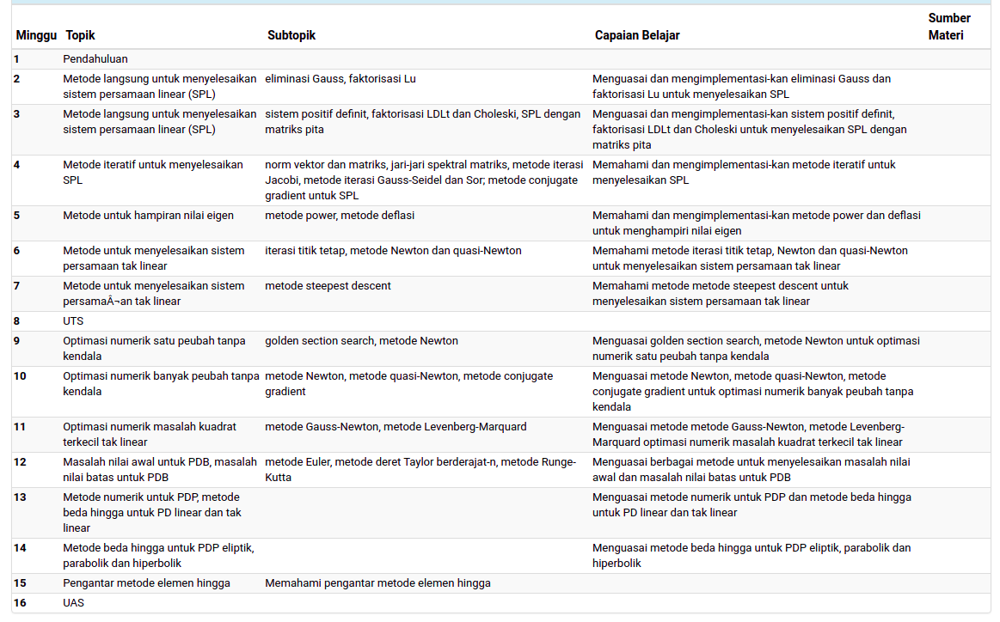
```

\pagebreak

## Buku

Hanya pakai satu buku karena sudah lengkap. Tapi nanti Pak Kuntjoro akan kirim artikel dan jurnal sebagai tambahan lainnya.

## Tugas dan Koding

- Akan banyak koding katanya. 
- Tugas dan presentasi bisa saja nanti dilakukan.
- Mungkin ada kuis.
- Ujian jadi 3 kali, materi akan diberikan pas dekat-dekat ujian. 
    - PR akan dijadikan bonus nilai.
    
\pagebreak

# CHAPTER I {-}

# MATERI PERKULIAHAN DETAIL

## Materi Perkuliahan SK5001 Analisis Numerik

- Solusi Numerik Persamaan Tak Linear
    - Metode Bisection: metode iterasi titik tetap, metode Newton-Raphson
    - Metode Newton untuk Sistem Persamaan Tak Linear
- Metode Iteratif Untuk Sistem Persamaan Linear
    - Metode Jacobi 
    - Gauss-Seidel 
    - SOR Gauss-Seidel
- Pencocokan Kurva    
    - Metode Kuadrat Terkecil, interpolasi dengan fungsi spline
- Optimisasi Numerik
- Metode Beda Hingga untuk PDP   

\pagebreak

# AKAR PERSAMAAN NON LINEAR

## Pendahuluan

_Solution of Nonlinear Equations_ : $f(x) = 0$

Definisi: Akar dari persamaan adalah nilai saat fungsi bernilai nol.

> Misalkan $f(x)$ adalah fungsi kontinu. Setiap nilai $r$ yang memenuhi $f(r)=0$ disebut __akar persamaan__.

### _Intermediate Value Theorem_ (Teorema Nilai Antara)

> Misalkan $f \in C[a,b]$ dan $L$ adalah suatu nilai di atara $f(a)$ dan $f(b)$. Maka __ada__ suatu nilai $c \in (a,b)$ yang memenuhi $f(c) = L$.

Berbekal teorema tersebut, secara numerik kita bisa mencari akar persamaannya. 

Misalkan fungsi $f$ kontinu di $[a,b]$ dengan $f(a)$ dan $f(b)$ memiliki tanda berlawanan. Berdasarkan teorema nilai antara, maka ada suatu nilai $c$ di $[a,b]$ yang memenuhi $f(c)=0$.

Apa kegunaan dari Teorema Nilai Antara?

## Metode _Bisection_

Untuk mencari solusi $f(x)=0$ dari fungsi kontinu $f$ di interval $[a,b]$ di mana $f(a)$ dan $f(b)$ memiliki tanda berlawanan.

Metode ini hanya bisa untuk mencari __satu akar__ dan mudah di-_plot_ jika dimensinya hanya satu. Kalau dimensinya banyak, akan rumit.

Pilih $c = \frac{a+b}{2}$ merupakan titik tengan di $[a,b]$.

- Jika $f(a).f(c) < 0$, maka nol berada di $[a,c]$.
- Jika $f(c).f(b) < 0$, maka nol berada di $[c,b]$.
- Jika $f(c) = 0$, maka $c$ adalah akar yang dicari.

### _Bisection Theorem_

Misalkan $f \in C[a,b]$ dan $f(a).f(b)<0$. Metode _bisection_ akan men-_generate_ baris $\{c_n\}_{n=0}^\infty$ untuk mendekati akar $r \in [a,b]$ dari fungsi $f$ yang memenuhi:

$$|r - c_n| \leq \frac{b-a}{2^{n+1}}, \text{untuk } n=0,1,2,3,...$$

Sehingga:

$$\displaystyle \lim_{ n \to \infty} c_n = r$$

### Algoritma _Bisection_

- __Step 1__: Find $a$ and $b$ with $a < b$ such that $f(a).f(b) < 0$.
- __Step 2__: Set $c = \frac{a+b}{2}$ and evaluate $f(c)$. If $f(c) = 0$  then $r = c$ and stop. Otherwise continue to Step 3.
- __Step 3__: If $f(a).f(c) < 0$ then reset $b = c$. Otherwise reset $a = c$.
- __Step 4__: If $b–a < \delta$ then stop. Use $\frac{a+b}{2}$  as the approximation to $r$. Otherwise return to Step 2.

Ilustrasi:

```{r out.width="100%",echo=FALSE,fig.align='center',fig.cap="Ilustrasi Bisection"}
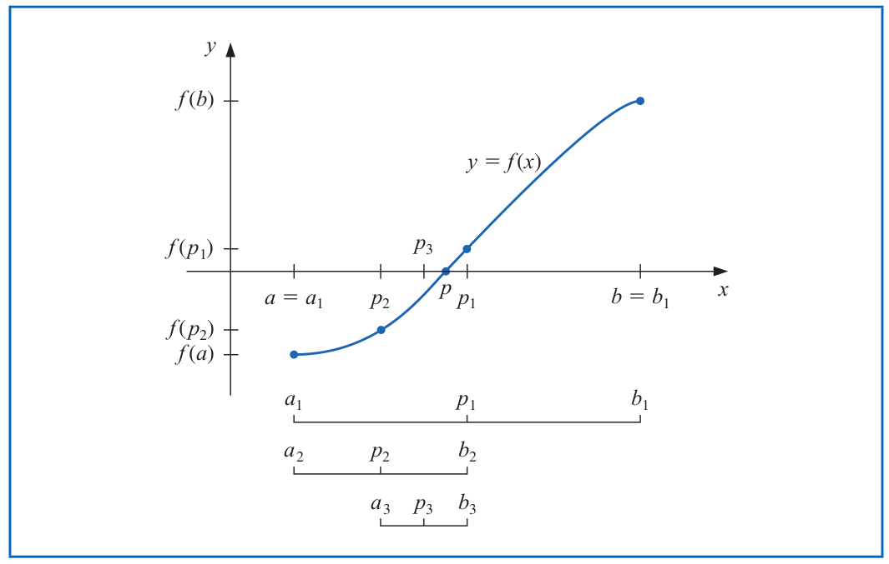
```

Untuk menemukan akar dari $f(x)$, kita perlu _set_ terlebih dahulu nilai $a$ dab $b$ yang dibutuhkan.

\pagebreak

### Algoritma Formal _Bisection_

Berikut adalah algoritma formalnya:

```{r out.width="100%",echo=FALSE,fig.align='center',fig.cap="Algoritma Bisection"}
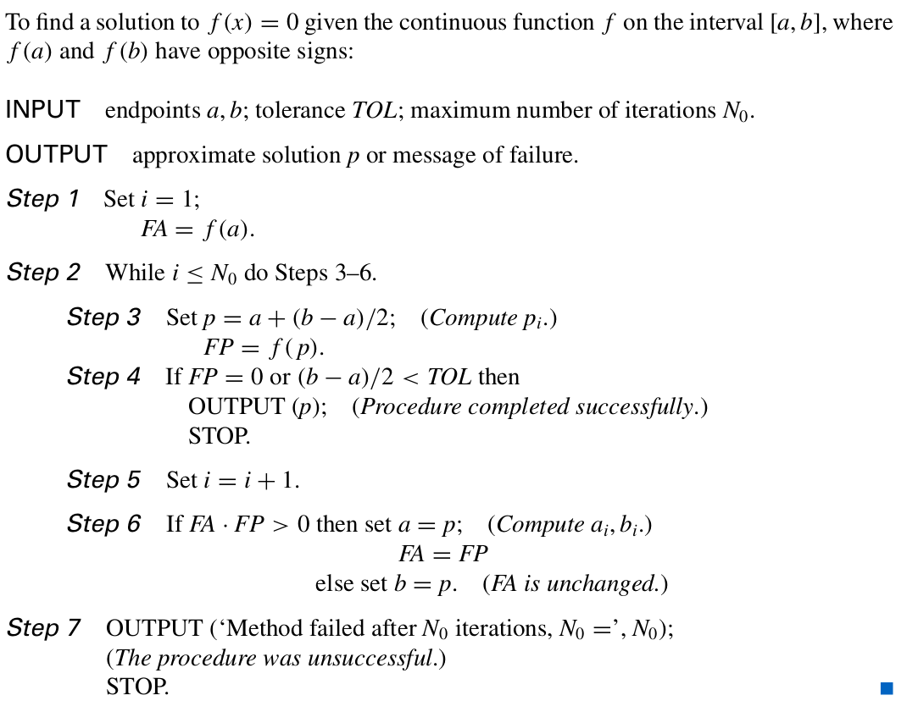
```

\pagebreak

### Contoh Soal

### Soal I {-}

> Cari nilai $x$ di selang $[0,2]$ yang memenuhi persamaan $x.sin(x) = 1$.

Masalah di atas sama dengan mencari nilai $x \in [0,2]$ sehingga $x.sin(x)-1=0$.

Sekarang kita akan gunakan metode _bisection_.

```{r,echo = FALSE,fig.align = "center",message=FALSE,warning=FALSE, fig.cap="Grafik fungsi f(x)"}
# set nilai x
baris = seq(0,2,by = .05)
# fungsi dari soal
f = function(x){x*sin(x)-1}
# nilai y
y = f(baris)
# bikin plotnya
data.frame(x = baris,y) %>% 
  ggplot(aes(x,y)) +
  geom_line(group = 1,
            color = "darkblue") +
  coord_equal() +
  geom_hline(yintercept = 0)
```

Terlihat ada tepat satu titik $c \in [0,2]$ di mana nilai $f(x)=0$.

Sekarang kita lakukan algoritma di __R__ nya:

```{r,echo=FALSE,message=FALSE,warning=FALSE}
rm(list=ls())
# informasi yang dibutuhkan
a = 0
b = 2
f = function(x){x*sin(x)-1}
iter_max = 50
tol_max = 0.00000005

# initial condition
i = 1
hasil = data.frame(n_iter = NA,
                   a = NA,
                   b = NA,
                   c = NA)

while(i<= iter_max && (b-a)/2 > tol_max){
  p = a + ((b-a)/2)
  FP = f(p)
  FA = f(a)
  FB = f(b)
  hasil[i,] = list(i,a,b,p)
  if(FA*FP < 0){b = p} else{a = p}
  i  = i + 1
}

hasil %>%
  rename("akar persamaan" = c) %>% 
  knitr::kable(align = "c")
```

Kita dapatkan nilai $f(c)=$ `r f(p)` pada $c=$ `r p` dengan toleransi $\delta =$ `r tol_max` pada iterasi ke `r i-1` kali

\pagebreak

### Soal II {-}

> Tunjukkan bahwa $f(x) = x^3 + 4x^2 - 10$ memiliki akar di selang $[1,2]$! Gunakan metode _bisection_ untuk menemukan akarnya!

Untuk menunjukkannya, cukup gunakan teorema nilai antara.

```{r,echo=FALSE,message=FALSE,warning=FALSE}
rm(list=ls())
f = function(x){x^3 + (4*x^2) - 10}
```

Perhatikan bahwa $f(1) =$ `r f(1)` dan $f(2) =$ `r f(2)`. Karena $f$ kontinu dan keduanya berbeda tanda, maka __ada__ $c \in [1,2]$ sehingga $f(c) = 0$.

Sekarang dengan algoritmanya:

```{r,echo=FALSE,message=FALSE,warning=FALSE}
rm(list=ls())
# informasi yang dibutuhkan
a = 1
b = 2
f = function(x){x^3 + (4*x^2) - 10}
iter_max = 50
tol_max = 10^-4

# initial condition
i = 1
hasil = data.frame(n_iter = NA,
                   a = NA,
                   b = NA,
                   c = NA)

while(i<= iter_max && (b-a)/2 > tol_max){
  p = a + ((b-a)/2)
  FP = f(p)
  FA = f(a)
  FB = f(b)
  hasil[i,] = list(i,a,b,p)
  if(FA*FP < 0){b = p} else{a = p}
  i  = i + 1
}
hasil %>%
  rename("akar persamaan" = c) %>% 
  knitr::kable(align = "c")
```

Kita dapatkan nilai $f(c)=$ `r f(p)` pada $c=$ `r p` dengan toleransi $\delta =$ `r tol_max` pada iterasi ke `r i-1` kali

\pagebreak

### Soal III {-}

> Gunakan metode _bisection_ untuk mencari akar persamaan $x-2^{-x} = 0, x \in [0,1]$, dengan akurasi $10^{-5}$!

Coba perhatikan grafik sebagai berikut:

```{r out.width="60%",echo = FALSE,fig.align = "center",message=FALSE,warning=FALSE, fig.cap="Grafik fungsi f(x)"}
# set nilai x
baris = seq(0,1,by = .05)
# fungsi dari soal
f = function(x){x - 2^(-x)}
# nilai y
y = f(baris)
# bikin plotnya
data.frame(x = baris,y) %>% 
  ggplot(aes(x,y)) +
  geom_line(group = 1,
            color = "darkblue") +
  coord_equal() +
  geom_hline(yintercept = 0)
```


Penyelesaiannya dengan _Bisection_ adalah sebagai berikut:

```{r,echo=FALSE,message=FALSE,warning=FALSE}
rm(list=ls())
# informasi yang dibutuhkan
a = 0
b = 1
f = function(x){x - 2^(-x)}
iter_max = 50
tol_max = 10^-5

# initial condition
i = 1
hasil = data.frame(n_iter = NA,
                   a = NA,
                   b = NA,
                   c = NA)

while(i<= iter_max && (b-a)/2 > tol_max){
  p = a + ((b-a)/2)
  FP = f(p)
  FA = f(a)
  FB = f(b)
  hasil[i,] = list(i,a,b,p)
  if(FA*FP < 0){b = p} else{a = p}
  i  = i + 1
}
hasil %>%
  rename("akar persamaan" = c) %>% 
  knitr::kable(align = "c")
```

Kita dapatkan nilai $f(c)=$ `r f(p)` pada $c=$ `r p` dengan toleransi $\delta =$ `r tol_max` pada iterasi ke `r i-1` kali.

\pagebreak

### __R__ _Function_ Metode _Bisection_

Berikut adalah _function_ metode _bisection_ yang saya buat di __R__:

```{r}
bagi_dua = function(a,b,f,iter_max,tol_max){
   # fungsi hitung bisection
    # initial condition
    i = 1
    hasil = data.frame(n_iter = NA,
                       a = NA,
                       b = NA,
                       c = NA)

    while(i<= iter_max && (b-a) > tol_max){
      # cari titik tengahnya
      p = a + ((b-a)/2)
      # hitung fungsi di titik tengah
      FP = f(p)
      # hitung fungsi di titik awal
      FA = f(a)
      # hitung fungsi di titik akhir
      FB = f(b)
      # tulis hasil dalam data frame
      hasil[i,] = list(i,a,b,p)
      
      # tukar nilai a atau b dengan nilai p 
      if(FA*FP < 0){b = p} else{a = p}
      # untuk iterasi berikutnya
      i  = i + 1
      
      # mencatat akar persamaan
      akar = p
      # tambahin dulu checking apakah f(a), f(b),atau f(c) ada yang nol?
      if(FP == 0){
        akar = p
        break} else if(FA == 0){
          akar = a
          break} else if(FB == 0){
            akar = b
            break}
      
    }
  
  # mencatat iterasi terbesar
  iterasi = i-1 # dikurang satu karena pada i+1 
                # sebenarnya tidak ada proses jika pada while TRUE
  
  # membuat ouput
  hasil = list(
    `iterasi max` = iterasi,
    `akar persamaan` = akar,
    `hasil perhitungan` = hasil
    )
  
  # print output
  return(hasil)
}
```

\pagebreak

### Tugas Kuliah Algoritma Minggu II

_By using bisection method, find the root of the following functions:_

1. $f(x) = x^2 - 3x - 2$
1. $f(x) = x^3 + x^2 - 3x - 2$

#### Jawab {-}

Pada metode _bisection_, pemilihan selang iterasi menjadi penting. Berdasarkan teorema nilai antara:

> Misalkan $f \in C[a,b]$ dan $L$ adalah suatu nilai di antara $f(a)$ dan $f(b)$. Maka __ada__ suatu nilai $c \in (a,b)$ yang memenuhi $f(c) = L$.
 
Oleh karena itu, kita perlu menemukan selang awal iterasi $[a,b]$ yang memenuhi $f(a).f(b)<0$.

Iterasi akan dihentikan saat _error_ memenuhi nilai yang diinginkan. Saya menggunakan kriteria pemberhentian iterasi sebagai berikut:

$$b_n-a_n < 10^{-5},n=1,2,..,I$$

### Persamaan I {-}

Pertama-tama, mari kita buat grafik dari $f(x) = x^2 - 3x - 2$ sebagai berikut:

```{r,echo=FALSE,warning=FALSE,message=FALSE,fig.align='center',fig.cap="Grafik fungsi f(x)"}
f = function(x){x^2 - 3*x - 2}

data.frame(x = seq(-5,5,by = .1)) %>% 
  mutate(y = f(x)) %>% 
  ggplot(aes(x,y)) +
  geom_line(color = "steelblue") +
  geom_hline(yintercept = 0) +
  geom_vline(xintercept = 0) +
  labs(title = "Grafik Fungsi f(x) di [-5,5]",
       subtitle = "Akar persamaan ada pada saat f(x) = 0",
       caption = "Digambar oleh 20921004") +
  theme(plot.title = element_text(hjust = .5, size = 15),
        plot.caption = element_text(hjust = .5, size = 10),
        plot.subtitle = element_text(hjust = .5, size = 12)) +
  scale_x_continuous(breaks = (-5:5))
```


Dari grafik di atas, terlihat bahwa $f(x)$ memiliki dua akar sebagai berikut:

1. Satu akar $f(x)$ berada di selang $[-1,0]$.
1. Satu akar $f(x)$ lainnya berada di selang $[3,4]$.

Berdasarkan informasi di atas, kita akan lakukan metode _bisection_ di kedua selang tersebut.

\newpage

#### _Bisection_ pada selang $[-1,0]$ {-}

Berikut adalah hasil proses _bisection_ di selang tersebut:

```{r,message=FALSE,warning=FALSE}
bagi_dua(a = -1,
         b = 0,
         f,
         iter_max = 50,
         tol_max = 10^(-5))
```

\newpage

#### _Bisection_ pada selang $[3,4]$ {-}

Berikut adalah hasil proses _bisection_ di selang tersebut:

```{r,message=FALSE,warning=FALSE}
bagi_dua(a = 3,
         b = 4,
         f,
         iter_max = 50,
         tol_max = 10^(-5))
```

#### Kesimpulan {-}

$f(x)$ memiliki akar pada $x = -0.5615463$ dan $x = 3.561546$

\pagebreak

### Persamaan II {-}

Pertama-tama, mari kita buat grafik dari $f(x) = x^3 + x^2 - 3x - 2$ sebagai berikut:

```{r,echo=FALSE,warning=FALSE,message=FALSE,fig.align='center',fig.cap="Grafik fungsi f(x)"}
f = function(x){x^3 + x^2 - 3*x - 2}

data.frame(x = seq(-3,2,by = .1)) %>% 
  mutate(y = f(x)) %>% 
  ggplot(aes(x,y)) +
  geom_line(color = "steelblue") +
  geom_hline(yintercept = 0) +
  geom_vline(xintercept = 0) +
  labs(title = "Grafik Fungsi f(x) di [-3,2]",
       subtitle = "Akar persamaan ada pada saat f(x) = 0",
       caption = "Digambar oleh 20921004") +
  theme(plot.title = element_text(hjust = .5, size = 15),
        plot.caption = element_text(hjust = .5, size = 10),
        plot.subtitle = element_text(hjust = .5, size = 12)) +
  scale_x_continuous(breaks = (-5:5))
```


Dari grafik di atas, terlihat ada tiga akar persamaan di selang:

1. $[-3,-1]$
1. $[-1,0]$
1. $[1,2]$

Berdasarkan informasi di atas, kita akan lakukan metode _bisection_ di ketiga selang tersebut.

\newpage

#### _Bisection_ pada selang $[-3,-1]$ {-}

Berikut adalah hasil proses _bisection_ di selang tersebut:

```{r,message=FALSE,warning=FALSE}
bagi_dua(a = -3,
         b = -1,
         f,
         iter_max = 50,
         tol_max = 10^(-5))
```

\newpage

#### _Bisection_ pada selang $[-1,0]$ {-}

Berikut adalah hasil proses _bisection_ di selang tersebut:

```{r,message=FALSE,warning=FALSE}
bagi_dua(a = -1,
         b = 0,
         f,
         iter_max = 50,
         tol_max = 10^(-5))
```

\newpage

#### _Bisection_ pada selang $[1,2]$ {-}

Berikut adalah hasil proses _bisection_ di selang tersebut:

```{r,message=FALSE,warning=FALSE}
bagi_dua(a = 1,
         b = 2,
         f,
         iter_max = 50,
         tol_max = 10^(-5))
```

#### Kesimpulan {-}

$f(x)$ memiliki akar pada $x = -2$,  $x = -0.6180344$, dan $x = 1.618034$.

## Hal Penting Terkait Metode Bisection

### Jaminan Keberadaan Akar Persamaan

Perhatikan baik-baik, jaminan bahwa $f(x)$ punya akar di $[a,b]$ adalah:

> $f(a)$ dan $f(b)$ berbeda tanda!

Pada algoritma yang dibuat di bagian sebelumnya, perhatikan bahwa sebagai _input_ syarat yang diperlukan adalah $a<b$.

> Pada bagian ini, saya akan gunakan notasi $p$ sebagai akar dari $f(x)$ dan penulisan deret hasil _bisection_ yang digunakan untuk mengakproksimasi akar sebenarnya. Menggantikan notasi $c$ pada kuliah sebelumnya.

### Kriteria STOP Iterasi

Pada bagian sebelumnya, kita menghentikan iterasi pada saat $\frac{a+b}{2} < \delta$.

Namun, pada bagian berikutnya kita akan menggunakan kriteria _error relatif_ yakni:

$$\frac{|p_n - p_{n-1}|}{|p_n|} < \epsilon$$

Di sini mulai ada $\epsilon$ sebagai pengganti $\delta$.

Beberapa kriteria lainnya penghentian iterasi antara lain:

$$|p_n - p_{n-1}| < \epsilon$$

dan

$$|f(p_n)| < \epsilon$$

Namun kita _error relatif_ adalah yang terbaik karena bisa jadi:

1. $\{p_n\}_{n=0}^\infty$ barisnya divergen tapi $p_n - p_{n-1}$ konvergen ke __nol__.
1. $f(p_n)$ dekat ke nol tapi $p_n$ jauh ke $p$.

## Masalah Pada _Bisection_ yang Ditemukan

1. Iterasi akan lebih lambat karena harus _bisect_ selang yang ada.
1. Bisa jadi akar persamaan dalam suatu selang lebih dari satu.
    - Akibatnya kita perlu melihat grafik lalu memecah selangnya terlebih dahulu.

### Teorema Penting^[_Theorem 2.1 hal 48_]

Misalkan $f \in C[a,b]$ dan $f(a) . f(b) < 0$. Metode _bisection_ akan menghasilkan deret $\{p_n\}_{n=1}^\infty$ yang mendekati $p$ yang merupakan akar dari $f$ dengan:

$$|p_n-p| \leq \frac{b-a}{2^n}, \text{ untuk } n \geq 1$$

Kegunaan dari teorema di atas adalah untuk menentukan berapa banyak iterasi yang dibutuhkan untuk mencapai suatu _error_ tertentu.

### Contoh Soal 

> Hitung berapa iterasi yang diperlukan untuk mencari akar persamaan $f(x) = x^3 + 4 x^2 - 10 = 0$ dengan akurasi $10^{-3}$ menggunakan $a_1 = 1$ dan $b_1 = 2$ !

Untuk menjawabnya, saya akan gunakan langsung teorema yang ada, yakni:

$$|p_n - p| \leq \frac{b-a}{2^n}$$

Kita menginginkan bahwa iterasi terakhir dari metode _bisection_ menghasilkan akurasi sebesar $10^{-3}$. Artinya pada $|p_N - p| < 10^{-3}$ sehingga:

$$|p_N - p| \leq 2^{-N} (b-a) = 2^{-N} (2-1) < 10^{-3} \\
2^{-N} < 10^{-3}$$

Kita akan gunakan $log_{10}$ untuk memudahkan perhitungan.

$$log_{10} 2^{-N} < log_{10} 10^{-3} \\ -N log_{10} 2 < -3 \\ N > \frac{3}{log_{10} 2} \simeq 9.965784$$

Maka didapatkan setidaknya harus ada `10` kali iterasi agar mencapai akurasi yang diinginkan.

\pagebreak

## Metode Newton

Merupakan metode yang cepat (konvergen ke dalam solusi) dan mudah diapikasikan. Metode ini mengandalkan turunan atau gradien fungsi. Oleh karena itu __syarat perlu__ agar metode ini bisa dipakai adalah:

$$f(x) \text{ kontinu dan diferensiabel di selang } [x,y] \in R$$

Ilustrasi:

```{r out.width="100%",fig.align='center',fig.cap="Ilustrasi Newton's Method",echo=FALSE}
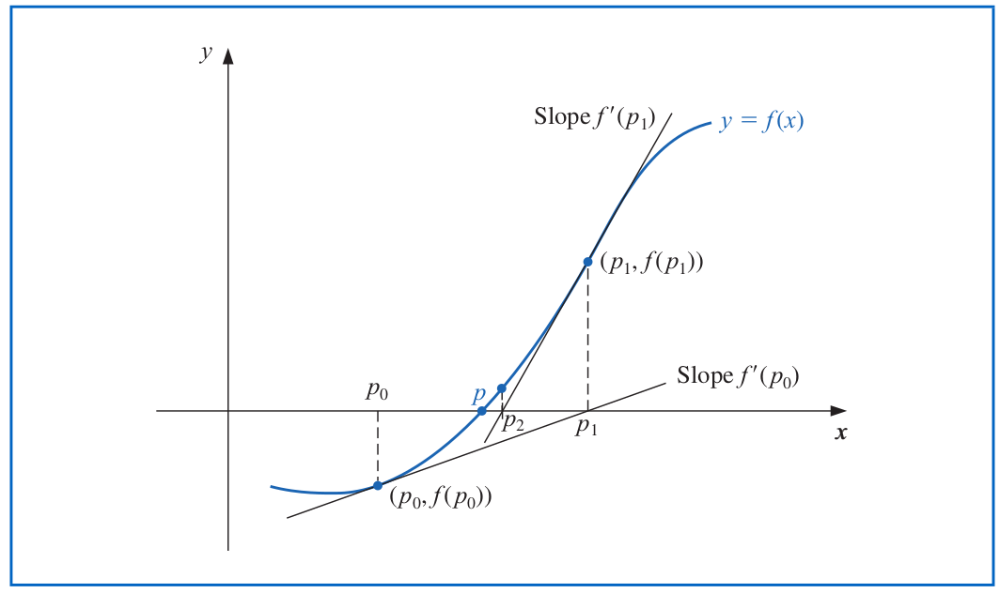
```

Prosesnya adalah menggunakan prinsip Deret Taylor.

Misalkan saya ingin menghitung suatu barisan $x_0,x_1,x_2,...$ yang akan konvergen ke suatu solusi $x^*$, untuk suatu nilai $\delta$ yang kecil:

$$f(x_n + \delta) = f(x_n) + \delta f'(x_n) + O (\delta^2)$$
Dengan:

1. Mengabaikan $O(\delta^2)$ (karena si $\delta$ sudah kecil sehingga saat dikuadratkan juga akan lebih kecil lagi).
1. $f(x_n)=0$ karena kita ingin mencari akar persamaan.

Maka kita bisa dapatkan:

$$f(x_n) + \delta f'(x_n) = 0$$

Sehingga menghasilkan:

$$\delta = - \frac{f(x_n)}{f'(x_n)}$$

> Ingat kembali bahwa kita ingin $x_n$ __sangat dekat sekali dengan akar persamaan__ $x^*$.

Sehingga:


$$x_{n+1} - x_n = \delta \\ x_{n+1} = x_n + \delta \\ x_{n+1} = x_n - \frac{f(x_n)}{f'(x_n)}$$

Ini menjadi dasar bagi algoritma pengerjaan metode _Newton_, yakni:

### Algoritma Metode Newton

Algoritma berdasarkan skema iteratif berikut:

$$x_{n+1} = x_n - \frac{f(x_n)}{f'(x_n)}$$

\pagebreak

### Algoritma Formal Metode Newton

Berikut adalah alforitma formal dari metode ini:

```{r out.width="100%",fig.align='center',fig.cap="Algoritma Newton",echo=FALSE}
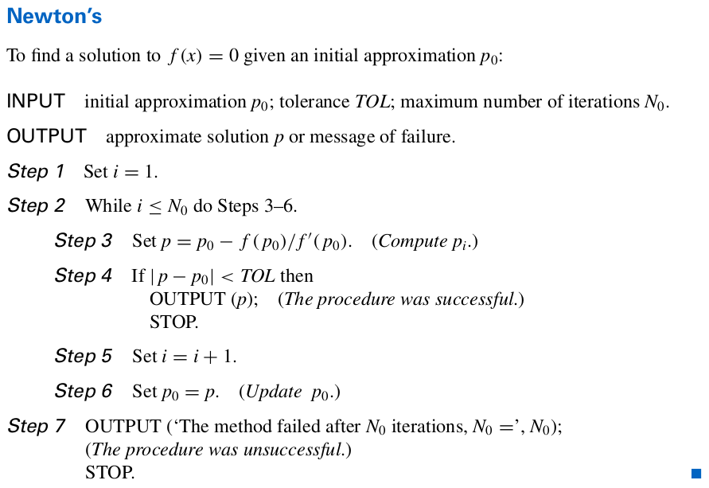
```

\pagebreak

### Kriteria Penghentian Iterasi

Untuk menghentikan iterasi, kita pilih dulu _error_ yang hendak ditoleransi, misalkan $\epsilon$. Lalu saat kita membuat barisan $p_1,p_2,...,p_N$, berisan ini baru akan berhenti saat:

### Kriteria I {-}

$$|p_N - p_{N-1}| < \epsilon$$

### Kriteria II {-}

$$\frac{|p_N - p_{N-1}|}{p_N} < \epsilon$$

### Kriteria III {-}

$$|f(p_n)| < \epsilon$$


### Contoh Soal

### Soal I {-}

> Misalkan diketahui fungsi $f(x) = cos(x) - x = 0$. Cari akar persamaannya!

Mari kita lihat dulu grafiknya:

```{r,echo=FALSE,fig.align = "center",message=FALSE,warning=FALSE}
# set nilai x
baris = seq(0,pi/2,by = .05)
# fungsi dari soal
f = function(x){cos(x) - x}
# nilai y
y = f(baris)
# bikin plotnya
data.frame(x = baris,y) %>% 
  ggplot(aes(x,y)) +
  geom_line(group = 1,
            color = "darkblue") +
  coord_equal() +
  geom_hline(yintercept = 0)
```

Tapi coba kita _set back_ dulu. Sebenarnya $f(x)$ bisa dipecah menjadi dua fungsi, misal $g(x)$ dan $h(x)$ sehingga akar dari $f(x)$ adalah perpotongan dua grafik tersebut.

```{r,echo=FALSE,fig.align = "center",message=FALSE,warning=FALSE}
# set nilai x
baris = seq(0,pi/2,by = .05)
# fungsi dari soal
f = function(x){cos(x)}
g = function(x){x}
# nilai y
y1 = f(baris)
y2 = g(baris)
# bikin plotnya
data.frame(x = baris,y1,y2) %>% 
  ggplot() +
  geom_line(aes(x,y1),
            group = 1,
            color = "darkblue") +
  geom_line(aes(x,y2),
            group = 1,
            color = "darkred") +
  coord_equal() +
  labs(x = "x",
       y = "y") 
```

Oke sekarang kita mulai iterasi dengan metode Newton. 

Langkah pertama adalah mencari $f'(x)$. Saya akan menggunakan `library(Ryacas)` seperti yang pernah dijelaskan di sini^[Ryacas. https://ikanx101.com/blog/math-r/].

```{r,message=FALSE,warning=FALSE}
library(Ryacas)
# persamaan awal
eq = "Cos(x) - x"
# turunan pertama
eq %>% y_fn("D(x)") %>% yac_str()
```

Didapatkan $f'(x) = -(sin(x)+1)$.

Kita akan pilih $p_0 = \frac{\pi}{4}$. Berikut adalah iterasinya:

```{r,echo=FALSE,warning=FALSE,message=FALSE}
rm(list=ls())
# informasi yang dibutuhkan
p_0 = pi/4
f = function(x){cos(x) - x}
df = function(x){-(sin(x)+1)}
iter_max = 50
tol_max = 10^-9

# initial condition
i = 1
hasil = data.frame(n_iter = 0,
                   p = p_0)

while(i <= iter_max){
  p = p_0 - (f(p_0) / df(p_0))
  hasil[i+1,] = list(i,p)
  if(abs(p-p_0) < tol_max){break}
  p_0 = p;
  i  = i + 1
}

hasil %>% knitr::kable(align = "c")
```

### Soal II {-}

> Misalkan $f(x) = x^2 -6$ dan $p_0 = 1$, cari akar persamaannya dengan metode _Newton_!

Pertama-tama kita cari dulu $f'(x)$, yakni:

```{r,echo=FALSE,warning=FALSE,message=FALSE}
# persamaan awal
eq = "x^2 -6"
# turunan pertama
eq %>% y_fn("D(x)") %>% yac_str()
```

Sehingga berikut adalah hasilnya:

```{r,echo=FALSE,warning=FALSE,message=FALSE}
rm(list=ls())
# informasi yang dibutuhkan
p_0 = 1
f = function(x){x^2 -6}
df = function(x){2*x}
iter_max = 50
tol_max = 10^-9

# initial condition
i = 1
hasil = data.frame(n_iter = 0,
                   p = p_0)

while(i <= iter_max){
  p = p_0 - (f(p_0) / df(p_0))
  hasil[i+1,] = list(i,p)
  if(abs(p-p_0) < tol_max){break}
  p_0 = p;
  i  = i + 1
}

hasil %>% knitr::kable(align = "c")
```

### __R__ _Function Newton Method_

Sekarang dari hasil di atas, saya akan buat _function_ khusus _Newton Method_ di __R__.

```{r}
rm(list=ls())

newton_ikanx = function(p_0,f,df,iter_max,tol_max){
  # fungsi untuk grafik
    # set nilai x
      baris = seq(p_0-2*p_0,p_0+2*p_0,by = .05)
    # nilai y
      y = f(baris)
    # bikin plotnya
      plot = 
        data.frame(x = baris,y) %>% 
        ggplot(aes(x,y)) +
        geom_line(group = 1,
                  color = "darkblue") +
        coord_equal() +
        geom_hline(yintercept = 0)
  
  # fungsi hitung newton
    # initial condition
    i = 1
    hasil = data.frame(n_iter = 0,
                   p = p_0)

    while(i <= iter_max){
      p = p_0 - (f(p_0) / df(p_0))
      hasil[i+1,] = list(i,p)
      if(abs(p-p_0) < tol_max){break}
      p_0 = p;
      i  = i + 1
      }
  
  # mencatat iterasi terbesar
  iterasi = i # tidak perlu dikurang satu karena saya sudah pake BREAK
  
  # mencatat akar persamaan
  akar = p
  
  # membuat ouput
  hasil = list(
    `plot f(x) di selang [p_0-p_0,p_0+p_0]` = plot,
    `iterasi max` = iterasi,
    `akar persamaan` = akar,
    `hasil perhitungan` = hasil
    )
  
  # print output
  return(hasil)
}
```

Sekarang kita lihat contoh penggunaan _function_ nya:

```{r}
p_0 = 1
f = function(x){x^2 -6}
df = function(x){2*x}
iter_max = 50
tol_max = 10^-9

newton_ikanx(p_0,f,df,iter_max,tol_max)
```

```{r,include=FALSE}
rm(list=ls())
detach("package:Ryacas", unload = TRUE)
```

## _Refreshment_ Newton

Kita masih ingat bahwa konvergensi metode _bisection_ itu linear (cenderung lambat) dan konvergensi metode _Newton_ lebih cepat. Namun kita perlu tahu bahwa metode _Newton_ memiliki syarat perlu berupa $f(x)$ yang diferensiabel.

> Bagaimana jika $f(x)$ tidak punya turunan? 

Maka metode _Newton_ tidak bisa digunakan. 

> Apakah ada metode yang _derivative-free_ ? 

## Metode _Golden Section Search_

### Definisi Formal

> Misalkan $f(x)$ disebut _unimodal_^[Fungsi yang hanya memiliki __satu puncak__ saja. https://id.wikipedia.org/wiki/Modus_(statistika)] pada selang $I = [a,b]$, jika terdapat sebuah titik $p \in I$ sehingga $i$ monoton turun murni pada $[a,p]$ dan monoton naik murni pada $[p,b]$.

Dari definisi diatas dimungkinkan suatu cara untuk mengidentifikasi bahwa fungsi $f$ memiliki __minimum global tunggal__ di titik $p$, dengan tidak secara ___eksplisit___ melibatkan turunan fungsi. 

Jadi walaupun di sini kita menggunakan istilah __kemonotonan__ tapi tidak secara eksplisit disebutkan turunan fungsi.

Jika diperhatikan dengan baik, jadi si $p$ adalah __titik terendah dari grafik fungsinya__ sehingga masalah ini menjadi __masalah minimisasi__. Selanjutnya saat membahas __GSS__, kita akan mencari __titik terendah__.

> Jadi ini adalah metode modifikasi. Bagaimana proses optimisasi digunakan untuk menghitung akar persamaan.

Jika dalam $[a,b]$ ada banyak titik minimum, kita akan buat sekat-sekat agar selang baru yang ada menjadi _unimodal_! Miriplah dengan si _bisection_. Jadi kita bisa buat agar jarak $[a,b]$ sekecil mungkin agar hanya ada satu __minimum global tunggal__.

### Algoritma _Golden Section Search_

Metode __GSS__ ini bisa digunakan untuk mengidentifikasi titik $p$. Pada metode ini selang $[a,b]$ yang memuat $p$ digantikan dengan suatu subselangnya yang masih memuat titik $p$ dengan menambahkan sepasang __titik dalam__ $c$ dan $d$ yang memenuhi:

$$c = b - \frac{b-a}{r} \\ d = a + \frac{b-a}{r}$$

$r$ adalah bilangan _real_ yang nilainya masih harus ditentukan melalui suatu cara tertentu.

Perhatikan bahwa $a < d < c < b$.

Kita perlu cek nilai $f(a), f(c), f(d), f(b)$.

Perhatikan bahwa karena $f$ _unimodal_ maka $f(c)$ dan $f(d)$ masing-masing bernilai lebih kecil dari $max \{ f(a) , f(b) \}$. Perhatikan dua kondisi berikut ini:

1. Jika $f(c) \leq f(d)$ maka dari sifat _unimodal_, $f$ monoton naik di selang $[d,b]$ dan dengan demikian maka $p \in [a,d]$.
1. Jika $f(c) > f(d)$ maka dari sifat _unimodal_, $f$ monoton turun di selang $[a,c]$ dan dengan demikian maka $p \in [c,b]$.

Situasi di atas memungkinkan kita untuk __melakukan reduksi lebar selang pencarian__^[mengecilkan lebar selang pencarian] untuk titik $p$. Misalkan: 

1. $a<c<d<b$ dengan $c = a + r (b-a)$ dan $d = a + (1-r)(b-a)$ maka berikut adalah algoritma perhitungannya:
1. Saya tuliskan $f(a) = fa, f(b) = fb, f(c) = fc, f(d)=fd$.

```
if f(c) <= f(d)
  b = d
  fb = fd
else
  a = c
  fa = fc
end
  c = a + r * (b-a) 
  fc = f(c) 
  d = a + (1-r)*(b-a) 
  fd = f(d)
```

Setelah melakukan langkah di atas maka lebar selang pencarian menjadi berkurang  dengan faktor sebesar $(1-r)$.

> Pemilihan nilai $r$ menjadi faktor krusial agar konvergensi menjadi semakin cepat!

### Penentuan Nilai $r$ 

$r$ yang paling optimal adalah _golden ratio_.

$$r = \frac{1 + \sqrt5}{2} \simeq 0.618$$

### Mencari Akar Persamaan $f(x)$

Terdapat hubungan antara masalah optimisasi ini dengan akar persamaan. Persamaan $f(x) = 0$ memiliki solusi $x$ jika fungsi objektif $F$ dari masalah optimisasi yang didefinisikan sebagai berikut:

- $F(x) = (f(x))^2$ memiliki nilai minimum global sebesar $0$.
- $F(x) = |f(x)|$ memiliki nilai minimum global sebesar $0$.
- $F(x) = - \frac{1}{a+ |f(x)|}$ memiliki nilai minimum global sebesar $-1$.

### _Function_ di __R__

Berdasarkan algoritma di atas dan hubungannya dengan __masalah minimisasi__, maka berikut adalah _function_ di __R__-nya:

```{r}
golden_ss = function(a,b,f){
  # definisikan r sebagai golden ratio
  r = (1 + sqrt(5))/2
  # toleransi kesalahan yang bisa diterima
  tol_max = 10^(-10)
  
  while(abs(b - a) > tol_max){
    c = b - (b - a) / r
    d = a + (b - a) / r
  
    if(f(c) < f(d)){
      b = d
      } else{
      a = c
      }
  }

  hasil = ( a + b ) / 2
  return(hasil)
  }
```

### Contoh Soal

### Soal I {-}

Untuk fungsi $f(x) = x^3 - 10x^2 + 29x -20$ di $0 \leq x \leq 6$, tentukan semua akarnya dengan metode _Golden Section Search_ !

#### Jawab {-}

Mari kita buat dulu grafik fungsinya di selang tersebut:

```{r,echo = FALSE,fig.align = "center",message=FALSE,warning=FALSE}
# set nilai x
baris = seq(0,6,by = .05)
# fungsi dari soal
f = function(x){x^3 - 10*x^2 + 29*x -20}
g = function(x){abs(x^3 - 10*x^2 + 29*x -20)}
# nilai y
y = f(baris)
y_2 = g(baris)
# bikin plotnya
data.frame(x = baris,y) %>% 
  ggplot(aes(x,y)) +
  geom_line(group = 1,
            color = "darkblue") +
  geom_hline(yintercept = 0)
```

Kalau kita perhatikan, akar persamaan tersebut ada di selang $[0,2],[3.5,4.5].[4.5,6]$.

> Perlu saya ingatkan kembali, tujuan dari __GSS__ adalah mencari titik minimum global di selang tertentu.

Oleh karena itu, jika kita ingin mencari akar, maka kita harus ubah terlebih dahulu fungsinya mejadi $f'(x) = |f(x)|$. Berikut adalah grafiknya:

```{r,echo = FALSE,fig.align = "center",message=FALSE,warning=FALSE}
# bikin plotnya
data.frame(x = baris,y_2) %>% 
  ggplot(aes(x,y_2)) +
  geom_line(group = 1,
            color = "darkblue") +
  geom_hline(yintercept = 0)
```

Sekarang kita bisa mencari akarnya di selang $[0,2]$, yakni:

```{r}
# fungsi dari soal
f_awal = function(x){x^3 - 10*x^2 + 29*x -20}
# fungsi modifikasi
f = function(x){abs(x^3 - 10*x^2 + 29*x -20)}

# initial
a = 0
b = 2

hasil = golden_ss(a,b,f)
```

Akar pada selang tersebut adalah di $x =$ `r hasil`.

Kita akan coba pada selang $[3.5,4.5]$ sebagai berikut:

```{r}
golden_ss(3.5,4.5,f)
```

Selanjutnya pada selang $[4.5,6]$ sebagai berikut:

```{r}
golden_ss(4.5,6,f)
```

\pagebreak

# CHAPTER II {-}
# NUMERICAL INTEGRATION

Selain menggunakan pendekatan analitik, kita bisa menggunakan pendekatan numerik untuk mencari nilai hampiran untuk suatu __integral tentu__ satu peubah.

Integral tentu memiliki bentuk seperti ini:

$$\int_a^b {f(x)} dx = F(b) - F(a)$$

Integral tentu juga bisa dituliskan dalam bentuk __penjumlahan Riemann__ berikut:

$$\int_a^b {f(x)} dx = \lim_{n \rightarrow \infty} \sum_{i = 1}^n f(x_i^*) \Delta_ix$$

Dengan cara memperbanyak partisi $n$ dan memperkecil selang $\Delta x$ kita bisa menghampiri nilai luas di bawah kurva.

## Hampiran _Square_ dan _Trapezoid_

Kita bisa menggunakan hampiran berupa _square_ atau _trapezoid_ untuk menghitung luas di bawah kurva.

Ide dasarnya adalah $L = alas.tinggi$, dimana:

1. $alas$ bisa didefinisikan sebagai $\Delta x = x_2 - x_1$.
1. Sedangkan definisi $tinggi$ tergantung bidang yang dipilih.
    - Jika kita menggunakan _square_ di titik tengah $\Delta x$, maka $tinggi = f(\frac{x_1+x_2}{2})$.
    - Jika kita menggunakan _trapezoid_, maka $tinggi = \frac{f(x_1) + f(x_2)}{2}$.
    
### __R__ _Function_ Hampiran _Square_ dan _Trapezoid_

Berikut adalah algoritmanya:

```{r}
hampiri = function(x0,xn,n,f){
  # save initial dulu
  initial_1 = x0
  initial_2 = xn
  
  # ================================
  # metode square
  h = (xn - x0) / n
  integration = f(x0)
  for(i in 1:n){
    k = x0 + i*h
    integration = integration + f(k)
  }
  square = integration * h
  
  # =================================
  # metode trapezoid
  x0 = initial_1
  xn = initial_2
  h = (xn - x0) / n
  integration = f(x0) + f(xn)
  for(i in 1:n){
    k = x0 + i*h
    integration = integration + 2*f(k)
  }
  trapezoid = integration * h/2

  # =================================
  # bikin output
  selang = n
  luas_persegi = square
  luas_trapezoid = trapezoid
  
  output = list(selang,luas_persegi,luas_trapezoid)
}
```

\pagebreak

### Contoh Soal

Hitung luas area di bawah kurva berikut:

```{r,echo=FALSE,warning=FALSE,message=FALSE,fig.align='center',fig.cap="Seperempat Lingkaran"}
f = function(x){sqrt(-x^2 + 6^2)}

data.frame(x = seq(0,6,by = .05)) %>% 
  mutate(y = f(x)) %>% 
  ggplot(aes(x,y)) +
  geom_line(color = "steelblue") +
  coord_equal() +
  geom_vline(xintercept = 0) +
  geom_hline(yintercept = 0) +
  labs(title = "Grafik Fungsi Lingkaran Berjari-jari 6",
       subtitle = "Cari luas dibawah kurva!",
       caption = "Digambar oleh 20921004") +
  theme(plot.title = element_text(hjust = .5, size = 15),
        plot.caption = element_text(hjust = .5, size = 10),
        plot.subtitle = element_text(hjust = .5, size = 12))

```

Perhatikan bahwa kita bisa membentuk kurva tersebut dengan fungsi $f(x) = \sqrt{6^2 - x^2} \text{, untuk x } \in [0,6]$.

Untuk menghitung luas $f(x)$ di $[0,6]$ secara _exact_, setidaknya kita bisa melakukan dua hal, yakni:

1. Menghitung $\int_0^6{f(x)} dx$. 
1. Menghitung dari rumus luas lingkaran: $\frac{1}{4} \pi.r^2 = \frac{1}{4} \pi.6^2 =$ `r 1/4 * pi * 6^2`. 

Untuk menghampirinya secara numerik, kita akan hitung penjumlahan luas dari _square_ atau _trapezoid_ yang dibangun di bawah kurva.

Sekarang kita akan hitung luas $f(x)$ untuk berbagai macam nilai $n$ kemudian akan kita bandingkan hasilnya dengan hitungan _exact_ sebelumnya.

Saya definisikan:

$$\Delta = \text{exact} - \text{hampiran}$$

\pagebreak

```{r,echo=FALSE,message=FALSE,warning=FALSE}
hitung = data.frame(n = NA,
                    luas_persegi = NA,
                    luas_trapezoid = NA)

hit_n = c(5,10,25,50,100,200,500,1000,3000,5000,10000,20000,50000)

for(i in 1:length(hit_n)){
  hitung[i,] = hampiri(0,6,hit_n[i],f)
}

hitung %>% 
  mutate(delta_persegi_exact = (1/4 * pi * 6^2) - luas_persegi,
         delta_trapezoid_exact = (1/4 * pi * 6^2) - luas_trapezoid) %>% 
  knitr::kable("simple",
               align = "c",
               caption = "Hasil Perhitungan Hampiran vs Exact Lingkaran I")
```

Silakan baca tulisan saya terkait hampiran nilai $\pi$ dengan cara ini di sini^[https://ikanx101.com/blog/pi-trapezoid/].

## Brute Force

Salah satu metode lain untuk menghitung integral (luas daerah di bawah kurva) adalah dengan melakukan _brute force_ dengan analogi pelemparan _darts_. Luas area di bawah kurva dihitung dengan cara:

$$L = alas \times tinggi \times \frac{darts_{ \text{on target} }} {darts_{ \text{All} }}$$

\pagebreak

### _Flowchart Brute Force_

Berikut adalah flowchartnya:

```{r out.width="50%",echo=FALSE,message=FALSE,warning=FALSE,fig.align = "center",fig.cap="Flowchart Brute Force"}
nomnoml::nomnoml("#direction: down,
                 [<start> start] -> [<input> f(x), a, b, N]
                 [<input> f(x), a, b, N] -> [PENENTUAN BATAS|sb x: dari a - b|sb y: dari 0 - max(f(x)) di selang a - b|on_target = 0|i = 0]
                 [PENENTUAN BATAS] -> [<choice> i <= N]
                 
                 [<choice> i <= N] -> N [return (on_target/N)]
                 [return (on_target/N)] -> [<end> end]
                 
                 [<choice> i <= N] -> Y [GENERATE RANDOM|xi,yi di batas sb x dan sb y]
                 [GENERATE RANDOM] -> [<choice> yi <= f(xi)]
                 [<choice> yi <= f(xi)] -> Y [on_target = on_target + 1]
                 [<choice> yi <= f(xi)] -> N [i = i+1]
                 [on_target = on_target + 1] -> [i = i+1]
                 [i = i+1] -> [<choice> i <= N]
                 ")
```

\pagebreak

### __R__ _Function Brute Force_

Berikut adalah algoritmanya dalam __R__:

```{r,warning=FALSE,message=FALSE}
set.seed(2021)

brute_force = function(f,x1,x2,y1,y2,N){
  # generating random number
  x = runif(N,x1,x2)
  y = runif(N,y1,y2)
  
  # pengecekan y <= f(x)
  rekap = 
    data.frame(x,y) %>% 
    mutate(f_x = f(x),
           on_target = ifelse(y <= f_x,1,0))
  
  # hitung rasio on target vs all dots
  rasio = sum(rekap$on_target) / N
  # hitung luas
  luas = (x2-x1)*(y2-y1)*rasio
  
  # output plot
  plot_sim = 
    plot +
    geom_point(data = rekap,aes(x,y,color = on_target)) +
    theme(legend.position = "none") +
    labs(title = paste0("Hasil Simulasi dengan ",N," titik"),
         subtitle = paste0("Didapat nilai rasio sebesar ",rasio))
  
  # output
  output = list(
    "Plot Brute Force" = plot_sim,
    "Luas area di bawah kurva" = luas
    )
  
  return(output)
}

```

\pagebreak

### Contoh Soal

Buatlah algoritma sederhana dengan metode Monte Carlo untuk mencari solusi dari integral berikut:

$$f(x) = \int_1^5 x^2 dx$$

Bandingkan dengan solusi analitiknya!

#### Jawab {-}

Berikut adalah langkah kerja yang dilakukan untuk menjawab soal ini:

```{r out.width="60%",echo=FALSE,warning=FALSE,message=FALSE,fig.align='center',fig.cap="Alur Kerja"}
nomnoml::nomnoml("
                 [Langkah Kerja] -> [Analitik]
                 [Analitik] -> [Eksak|Mengintegralkan langsung]
                 [Langkah Kerja] -> [Numerik]
                 [Numerik] -> [Brute force]
                 [Numerik] -> [Modifikasi Monte Carlo]
                 ")
```

Kelak akan kita bandingkan metode numerik dengan hasil eksaknya.

#### Analitik {-}

Perhatikan bahwa pada integral tentu berlaku:

$$\int_a^b f(x) dx = F(b) - F(a)$$

Oleh karena itu, jika kita memiliki $f(x) = x^2$, maka $F(x) = \int f(x) dx = \frac{x^3}{3}$ dari soal:

$$\int_1^5 x^2 dx = \frac{5^3}{3} - \frac{1^3}{3} \approx 41.33333$$

#### _Brute Force_ {-}

Analogi dari metode numerik ini adalah seperti melempar _darts_. Luas area di bawah kurva bisa didefinisikan sebagai:

$$L = \frac{N darts_{ \text{on target} }} {N darts_{ \text{All} }}$$


Hal terpenting dalam metode ini adalah __mendefinisikan batas titik__ $x,y$ untuk di-_random_. Kenapa?

> Kita tidak ingin _darts_ yang kita lempar jatuh ke area sembarang! Kita harus definisikan di mana __area bermain__ _darts_.

\pagebreak

Perhatikan grafik $f(x)$ berikut:

```{r out.width="70%",echo=FALSE,message=FALSE,warning=FALSE,fig.cap="Grafik f(x)",fig.align='center'}
f = function(x)x^2

plot = 
  data.frame(x = seq(0,6,by = .05)) %>% 
  mutate(y = f(x)) %>% 
  ggplot(aes(x,y)) +
  geom_line(group=1,
            color = "steelblue") +
  geom_vline(xintercept = 0,
             color = "black") +
  geom_hline(yintercept = 0,
             color = "black") +
  scale_x_continuous(breaks = (0:6))

plot +
  geom_vline(xintercept = 1, color = "red") +
  geom_vline(xintercept = 5, color = "red") +
  theme_minimal() +
  labs(title = "Grafik fungsi f(x) di selang 1 dan 5",
       caption = "Digambar oleh 20921004") +
  annotate("label", x = 4, y = 5, label = "Area Integral")
```

Untuk sumbu $x$, batas titik yang akan di-_random_ sudah jelas, yakni: $[1,5]$.

Lantas bagaimana dengan sumbu $y$?

\pagebreak

```{r out.width="70%",echo=FALSE,message=FALSE,warning=FALSE,fig.cap="Penentuan Batas Titik Random",fig.align='center'}
plot = 
  plot +
  annotate("segment",x = 1,xend = 1,y = 0 , yend = 25, color = "darkred") +
  annotate("segment",x = 5,xend = 5,y = 0 , yend = 25, color = "darkred") +
  annotate("segment",x = 1,xend = 5,y = 25 , yend = 25, color = "darkred") +
  annotate("segment",x = 1,xend = 5,y = 0 , yend = 0, color = "darkred") +
  theme_minimal() +
  labs(caption = "Digambar oleh 20921004 dengan R")

plot +
  labs(title = "Grafik fungsi f(x) di selang 1 dan 5",
       subtitle = "Batas titik random pada sb x: 1 - 5\nBatas titik random pada sb y: 0 - 25") +
  annotate("label", x = 4, y = 5, label = "Area Integral:\nON TARGET") +
  annotate("label", x = 2, y = 20, label = "Di Luar Area Integral:\nOFF TARGET")
```

Kita akan membuat sejumlah _random_ di dalam area kotak merah dari grafik di atas. Kelak luas akan dihitung dari rasio titik di dalam area __on target__ dengan __total semua titik yang ada__ dikalikan dengan luas dari kotak merah.

$$L = 4 \times 25 \times \frac{N darts_{ \text{on target} }} {N darts_{ \text{All} }}$$

\pagebreak

Dari _function_ di atas, kita akan coba hitung dengan berbagai nilai $N$ sebagai berikut:

$N=10$ 

```{r}
brute_force(f,x1 = 1,x2 = 5,y1 = 0,y2 = 25,N = 10)
```

\pagebreak

$N=500$ 

```{r}
brute_force(f,x1 = 1,x2 = 5,y1 = 0,y2 = 25,N = 500)
```


\pagebreak

## Modifikasi Monte Carlo

Ide dari algoritma ini adalah men-_generate_ titik _random_ di selang integral, kemudian dihitung luas _square_ yang ada.

$$I = \int_z^b f(x)dx$$

dihitung sebagai:

$$<F^N> = \frac{b-a}{N+1} \sum_{i=0}^N f(a + (b-a) \xi_i)$$

dengan

$$\xi_i \text{ adalah random number antara 0 dan 1}$$

### _Flowchart_ Modifikasi Monte Carlo

Berikut adalah _flowchart_-nya:

```{r out.width="50%",echo=FALSE,message=FALSE,warning=FALSE,fig.align = "center",fig.cap="Flowchart Modifikasi Monte Carlo"}
nomnoml::nomnoml("#direction: down,
                 [<start> start] -> [<input> f(x), a, b, N]
                 [<input> f(x), a, b, N] -> [DEFINE|sum = 0|i = 0]
                 [DEFINE] -> [<choice> i <= N]
                 
                 [<choice> i <= N] -> N [return (sum * (b-a) / N)]
                 [return (sum * (b-a) / N)] -> [<end> end]
                 
                 [<choice> i <= N] -> Y [GENERATE RANDOM|xi di selang a - b]
                 [GENERATE RANDOM] -> [sum = sum + (b-a)*f(xi)]
                 [sum = sum + (b-a)*f(xi)] -> [i = i + 1]
                 [i = i + 1] -> [<choice> i <= N]
                 ")

rm(list=ls())
```

\pagebreak

### __R__ _Function_ Modifikasi Monte Carlo

Berdasarkan _flowchart_ di atas, berikut adalah _function_ di __R__ -nya:

```{r}
modif_monte = function(f,x1,x2,N){
  # generating random number
  x = runif(N,x1,x2)
  # hitung f(x)
  f_x = f(x)
  # hitung luas
  luas = (x2-x1) * f_x
  # mean luas
  mean_luas = mean(luas)
  # output
  return(mean_luas)
  }
```

### Contoh Soal

Dari soal pada bagian sebelumnya, saya akan hitung hasilnya sebagai berikut:

```{r,echo=FALSE,warning=FALSE,message=FALSE}
f = function(x)x^2
N = (sample(1:10000,30) * 100) %>% sort()

hasil = 
  data.frame(N = N) %>% 
  rowwise() %>% 
  mutate(selang_full = modif_monte(f,1,5,N)) %>% 
  ungroup() %>% 
  mutate(selisih_full_eksak = abs(selang_full - (124/3))) 

hasil %>% 
  rename("Selang 1-5" = selang_full,
         "Delta 1-5" = selisih_full_eksak) %>% 
  knitr::kable("simple",align = "c",caption = "Hasil Perbandingan Solusi Numerik dan Eksak")
```

\pagebreak
# CHAPTER III {-}
# METODE ITERATIF UNTUK SPL

Suatu sistem persamaan linear bisa dituliskan dalam bentuk aljabar berupa matriks dan vektor sebagai berikut:

$$Ax = b$$

__SPL__ tersebut akan memiliki solusi saat $A$ memiliki invers, yakni $A^{-1}$.

> Bagaimana caranya menghitung $A^{-1}$ dari $A$?

Pada aljabar linear elementer, kita bisa melakukan __operasi baris elementer__ (__OBE__) sebagai berikut:

$$[A | I] \rightarrow [I|A^{-1}]$$

## _Refreshment_ Aljabar Linear 

### Teorema __SPL__

> Jika $A$ adalah matriks $n \times n$ _inversible_, maka untuk setiap vektor $b$ $1 \times n$ pada sistem persamaan linear $Ax = b$ memiliki tepat satu solusi. Yaitu:

$$x = A^{-1}b$$

Berikut ini kita coba _review_ kembali secara singkat beberapa konsep dalam aljabar yang kelak akan membantu kita memahami bagaimana cara penyelesaian __SPL__ secara numerik.

### Matriks Singular dan Tak Singular

Dari penjelasan sebelumnya kita telah mengenal apa itu matriks invers. Kita akan mengingat kembali suatu konsep bernama determinan matriks. Di __R__ kita bisa menghitung determinan dari suatu matriks dengan perintah `det(matriks)`.

> Jika suatu matriks persegi memiliki determinan = 0, maka matriks tersebut tidak memiliki invers. Matriks yang tidak memiliki invers disebut __matriks singular__.

Kebalikannya:

> Jika suatu matriks memiliki determinan $\neq 0$, maka matriks memiliki invers. Matriks berinvers disebut __matriks tak singular__.

### Determinan Matriks

Untuk matriks berukuran $2 \times 2$, cara menghitung determinan matriksnya adalah sebagai berikut:

$$A = \begin{bmatrix}
a & b \\
c & d \\
\end{bmatrix}$$

$$|A| = ad - bc$$

Bagaimana dengan matriks berukuran $3 \times 3$? Berikut caranya:

Kita perlu memperlebar kolom dari matriks tersebut agar semua elemen terkena.

$$A = \begin{bmatrix}
a & b & c\\
d & e & f \\
g & h & i \\
\end{bmatrix}$$

$$|A| = (aei + bfg + cdh) - (ceg + afh + bdi)$$

Menghitung determinan bisa juga dengan mengalikan semua nilai _eigen_ yang ada d matriks tersebut.

$$|A| = \lambda_1 \lambda_2 \lambda_3 .. \lambda_i$$

### Sifat-Sifat Determinan Matriks

Misalkan $A$ adalah matriks yang memiliki determinan, maka:

1. $|A^T| = |A|$
1. $|A . B| = |A| . |B|$
1. $|A^n| = |A|^n$
1. $|A^{-1}| = \frac{1}{|A|}$
1. $|k \times A_{m \times m}| = k^m \times |A|$

\pagebreak

### Nilai Eigen dan Vektor Eigen

#### Definisi {-}

Jika $A$ adalah matriks $n \times n$, maka vektor tak nol $x \in \mathbb{R}^n$ dinamakan __vektor eigen__ dari $A$ jika $Ax$ adalah kelipatan skalar dari $x$. Yakni:

$$Ax = \lambda x$$

untuk suatu skalar $\lambda$ tertentu. $\lambda$ disebut sebagai __nilai eigen__ yang bersesuaian dengan __vektor eigen__.


#### Teorema {-}

Jika $A$ adalah matriks berukuran $n \times n$, maka $\lambda$ adalah nilai eigen dari $A$ jika dan hanya jika ia memenuhi persamaan:

$$det(\lambda I - A) = 0$$

Persamaan di atas disebut dengan __persamaan karakterisktik__.

Vektor dan nilai eigen bisa dihitung di __R__ menggunakan _function_ `eigen(matriks)`.

### Norm Vektor

Norm vektor merupakan fungsi pemetaan dari vektor-vektor di $x \in \mathbb{R}^n$ ke bilangan _real_ $||x||$ sehingga memenuhi:

```{r out.width="100%",fig.align='center',echo=FALSE,fig.cap="Sifat Norm Vektor"}
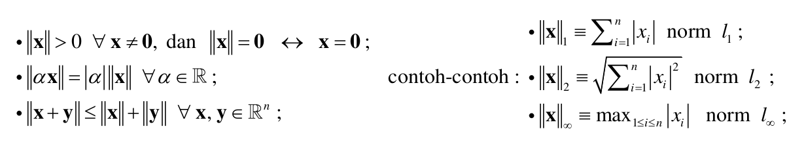
```

\pagebreak
### Norm Matriks

Norm matriks merupakan fungsi pemetaan dari matriks-matriks bujur sangkar di $\mathbb{R}^{n \times n}$ ke $\mathbb{R}$ sehingga memenuhi:

```{r out.width="60%",fig.align='center',echo=FALSE,fig.cap="Sifat Norm Matriks"}
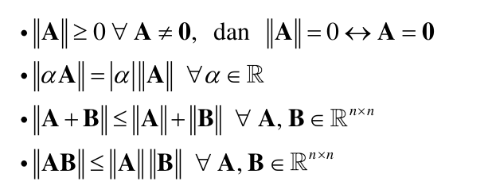
```

$$\forall z \neq 0 \text{ dan natural matrix norm } ||.|| \text{ diperoleh } ||Az|| \leq ||A|| . ||z||$$

#### Cara menghitung norm matriks {-}

Beberapa teorema dan definisi yang berguna:

```{r out.width="100%",fig.align='center',echo=FALSE,fig.cap="Norm Matriks dan Jari-jari Spektral"}
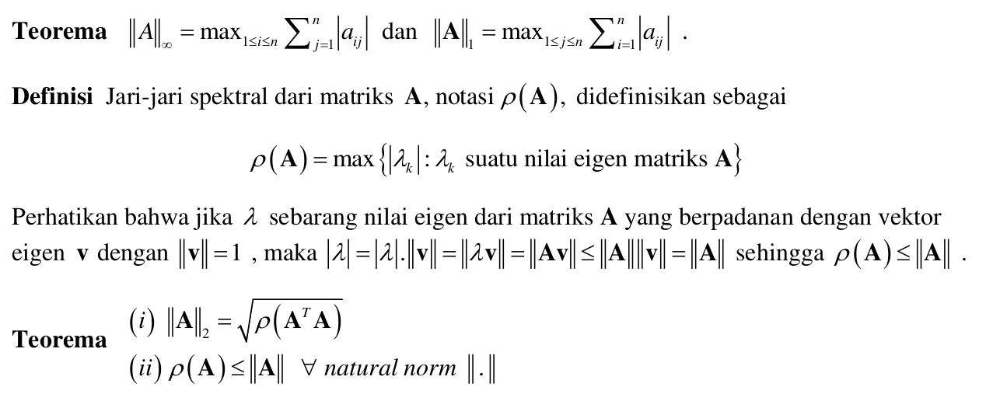
```

_Summaries_:

1. Norm $\infty$ adalah nilai max sum harga mutlak baris.
1. Norm $1$ adalah nilai max sum harga mutlak kolom.

#### Teorema Kekonvergenan {-}

Suatu matriks $A$ dikatakan __konvergen ke 0__ jika $\lim_{k \rightarrow \infty} (A^k)_{ij} = 0$.

Pernyataan berikut ini ekivalen:

1. $A$ matriks yang __konvergen__.
1. $\lim_{k \rightarrow \infty} ||A^k|| = 0$, untuk suatu _natural norm_.
1. $\lim_{k \rightarrow \infty} ||A^k|| = 0$, untuk setiap _natural norm_.
1. $\rho(A) < 1$.
1. $\lim_{k \rightarrow \infty} A^kx = 0, \forall x$.

Perhatikan baik-baik teorema di atas. Terutama pada poin `4` dimana menjadi __kunci__ kekonvergenan dari suatu skema iterasi kelak.

```{r,include=FALSE}
rm(list=ls())
```

### Matriks Diagonal, _Upper_, dan _Lower_

Matriks diagonal adalah matriks yang hanya berisi elemen di diagonalnya saja. Matriks _upper triangle_ adalah matriks yang hanya berisi segitiga di atas. Matriks _lower triangle_ adalah matriks yang hanya berisi segitiga di bawah.

### Matriks Diagonal Dominan Kuat

Matriks __diagonal dominan kuat__ adalah matriks yang memiliki elemen harga mutlak diagonal terbesar.

Misalkan:

```{r,echo=FALSE}
A = matrix(c("a11","a12","a13","a21","a22","a23","a31","a32","a33"),byrow = T, nrow = 3)
A
```

Definisi __diagonal dominan kuat__ adalah:

$$|a_{ii}| > \sum_{i=1,j \neq i}^n |a_{ij}|$$

Contoh:

```{r,echo=FALSE}
A = matrix(c(7,2,0,3,5,-1,0,5,-6),byrow = T, nrow = 3)
A
```

$A$ merupakan matriks __diagonal dominan kuat__ karena:

$$|7| > |2| + |0|$$ 

$$|5| > |3| + |-1|$$

$$|-6| > |0| + |-5|$$

Matriks __diagonal dominan kuat__ adalah _non singular_.

> Bagaimana jika $A$ kita bukan matriks __diagonal dominan kuat__?

Kita harus lakukan _pre-processing_ sehingga menjadi matriks __diagonal dominan kuat__ dengan cara:

1. Tukar baris, atau
1. Tukar kolom.


### Aljabar di __R__

Dari semua konsep aljabar yang telah dijelaskan pada bagian sebelumnya, mari kita lihat beberapa function di __R__-nya:

Misalkan saya definisikan $v$ suatu vektor sebagai berikut:

```{r}
v = c(2,4,-1,3)
# menghitung norm 1 dari vektor v
norm_vec_1 = function(x)sum(abs(x))
norm_vec_1(v)
# menghitung norm 2 dari vektor v
norm_vec_2 = function(x)sqrt(sum(abs(x)^2))
norm_vec_2(v)
# menghitung norm infinity dari vektor v
norm_vec_inf = function(x)max(abs(x))
norm_vec_inf(v)
```

Misalkan saya definisikan matriks $A$ sebagai berikut:

```{r}
A = matrix(c(2,4,-1,3,1,5,-2,3,-1),ncol = 3)
A
# transpose matriks
t(A)
# inverse matriks
matlib::inv(A)
# menghitung nilai dan vektor eigen
eigen(A)
# perkalian matriks
A %*% matlib::inv(A) %>% round()
# menghitung norm 1 dari matriks A
norm(A,"1")
# menghitung norm 2 dari matriks A
norm(A,"2")
# menghitung norm infinity dari matriks A
norm(A,"i")
# menghitung rho
rho = function(matriks){
  ei = eigen(matriks)
  ei = max(abs(ei$values))
  return(ei)
}
rho(A)
# norm 2 juga bisa dihitung dengan cara
rho(t(A) %*% A) %>% sqrt()
```

### _Key Take Points_ Materi Aljabar Linear

Perhatikan betul teorema kekonvergenan matriks dan bagaimana cara menghitung $\rho$.

\newpage

## Visualisasi Aljabar Linear

Materi ini berasal dari _paper_ Prof. Kuntjoro berjudul ___Linear Transformation on the Points of the Unit Circle in the Plane and Its Visualization___.

Kita mulai dari lingkaran satuan, misal didefinisikan:

$$A = \begin{bmatrix}
a & b \\ c & d
\end{bmatrix}$$

adalah matriks bilangan _real_ yang _non singular_.

Jika kita hendak menggambar lingkaran satuan, maka:

$$\begin{bmatrix}
x \\ y
\end{bmatrix}
=
\begin{bmatrix}
a & b \\ c & d
\end{bmatrix}
\begin{bmatrix}
\cos{t} \\ \sin{t}
\end{bmatrix}, 0 \leq t \leq 2 \pi$$

dengan $A = I$. 

Berikut adalah gambarnya:

```{r out.width="60%",fig.align = "center",fig.retina=10,fig.cap="Menggambar Lingkaran Satuan"}
rm(list=ls())
satuan = 
  data.frame(t = seq(0,2*pi,by = 0.01)) %>% 
  mutate(x = cos(t),
         y = sin(t))

satuan %>% 
  ggplot(aes(x,y)) +
  geom_point() +
  coord_equal()
```

Kita bisa mentransformasi lingkaran satuan di atas dengan mengubah matriks $A$. Kita akan coba satu-persatu:

### Contoh Matriks $A_1$

Contoh pertama adalah sebagai berikut:

$$\begin{bmatrix}
x \\ y
\end{bmatrix}
=
\begin{bmatrix}
2 & 0 \\ 2 & 2
\end{bmatrix}
\begin{bmatrix}
\cos{t} \\ \sin{t}
\end{bmatrix}, 0 \leq t \leq 2 \pi$$

```{r,warning=FALSE,fig.align = "center",message=FALSE,fig.retina=10,fig.cap="Transformasi Matriks A1"}
# definisi matriks
A = matrix(c(2,0,2,2),ncol = 2,byrow = T)

# buat rumah untuk hasil transformasi linear
satuan = 
  satuan %>% 
  mutate(x_new = NA,
         y_new = NA)

# looping untuk menghitung transformasi linear
for(i in 1:nrow(satuan)){
  temp = A %*% c(satuan$x[i],
                 satuan$y[i])
  satuan$x_new[i] = temp[1]
  satuan$y_new[i] = temp[2]
}

# buat grafik baru
satuan %>% 
  ggplot() +
  geom_point(aes(x,y),color = "blue",size = .1) +
  geom_point(aes(x_new,y_new),color = "red",size = .1) +
  coord_equal()
```

\newpage

Lantas apa kegunaan visualisasi ini?

> Ingatkah apa definisi dari vektor dan nilai eigen?

Dari sini kita bisa mempelajari di mana letak vektor eigen dan berapa nilai eigennya. Kita bisa cek pada $t$ berapa nilai $(x',y')$ merupakan kelipatan dari $(x,y)$.

Akan saya perlihatkan di $t$ berapa:

```{r,warning=FALSE,fig.align = "center",message=FALSE,fig.retina=10,fig.cap="Letak Vektor Eigen Matriks A1"}
eigen = 
  satuan %>% 
  mutate(eigen_x = x_new / x,
         eigen_y = y_new / y,
         sama = round(eigen_x,2) == round(eigen_y,2)) %>% 
  filter(sama == T)

# buat grafik baru
satuan %>% 
  ggplot() +
  geom_point(aes(x,y),color = "blue",size = .1) +
  geom_point(aes(x_new,y_new),color = "red",size = .1) +
  # nilai eigen pertama
  geom_segment(x = 0, xend = eigen$x_new[1],
               y = 0, yend = eigen$y_new[1],
               color = "brown") +
  geom_segment(x = 0, xend = eigen$x[1],
               y = 0, yend = eigen$y[1],
               color = "darkgreen") +
  # nilai eigen kedua
  geom_segment(x = 0, xend = eigen$x_new[2],
               y = 0, yend = eigen$y_new[2],
               color = "brown") +
  geom_segment(x = 0, xend = eigen$x[2],
               y = 0, yend = eigen$y[2],
               color = "darkgreen") +
  coord_equal()


```

\newpage

### Contoh Matriks $A_2$

Contoh berikut adalah sebagai berikut:

$$\begin{bmatrix}
x \\ y
\end{bmatrix}
=
\begin{bmatrix}
1 & 0 \\ -1 & 1
\end{bmatrix}
\begin{bmatrix}
\cos{t} \\ \sin{t}
\end{bmatrix}, 0 \leq t \leq 2 \pi$$

```{r,warning=FALSE,fig.align = "center",message=FALSE,fig.retina=10,fig.cap="Transformasi Matriks A2",echo=FALSE}
rm(list=ls())
satuan = 
  data.frame(t = seq(0,2*pi,by = 0.01)) %>% 
  mutate(x = cos(t),
         y = sin(t))

# definisi matriks
A = matrix(c(1,0,-1,1),ncol = 2,byrow = T)

# buat rumah untuk hasil transformasi linear
satuan = 
  satuan %>% 
  mutate(x_new = NA,
         y_new = NA)

# looping untuk menghitung transformasi linear
for(i in 1:nrow(satuan)){
  temp = A %*% c(satuan$x[i],
                 satuan$y[i])
  satuan$x_new[i] = temp[1]
  satuan$y_new[i] = temp[2]
}

# buat grafik baru
satuan %>% 
  ggplot() +
  geom_point(aes(x,y),color = "blue",size = .1) +
  geom_point(aes(x_new,y_new),color = "red",size = .1) +
  coord_equal()
```

Kita akan lihat, ada di $t$ berapa nilai eigennya:

\newpage

```{r,warning=FALSE,fig.align = "center",message=FALSE,fig.retina=10,fig.cap="Letak Vektor Eigen Matriks A2",echo=FALSE}
eigen = 
  satuan %>% 
  mutate(eigen_x = x_new / x,
         eigen_y = y_new / y,
         sama = round(eigen_x,2) == round(eigen_y,2)) %>% 
  filter(sama == T)

# buat grafik baru
satuan %>% 
  ggplot() +
  geom_point(aes(x,y),color = "blue",size = .1) +
  geom_point(aes(x_new,y_new),color = "red",size = .1) +
  # nilai eigen pertama
  geom_segment(x = 0, xend = eigen$x_new[1],
               y = 0, yend = eigen$y_new[1],
               color = "brown") +
  geom_segment(x = 0, xend = eigen$x[1],
               y = 0, yend = eigen$y[1],
               color = "darkgreen") +
  # nilai eigen kedua
  geom_segment(x = 0, xend = eigen$x_new[2],
               y = 0, yend = eigen$y_new[2],
               color = "brown") +
  geom_segment(x = 0, xend = eigen$x[2],
               y = 0, yend = eigen$y[2],
               color = "darkgreen") +
  coord_equal()


```

___Obviously___ terlihat ya.

\newpage

### Contoh Matriks $A_3$

Contoh berikut adalah sebagai berikut:

$$\begin{bmatrix}
x \\ y
\end{bmatrix}
=
\begin{bmatrix}
1 & 1 \\ 1 & 1
\end{bmatrix}
\begin{bmatrix}
\cos{t} \\ \sin{t}
\end{bmatrix}, 0 \leq t \leq 2 \pi$$

```{r,warning=FALSE,fig.align = "center",message=FALSE,fig.retina=10,fig.cap="Transformasi Matriks A2",echo=FALSE}
rm(list=ls())
satuan = 
  data.frame(t = seq(0,2*pi,by = 0.01)) %>% 
  mutate(x = cos(t),
         y = sin(t))

# definisi matriks
A = matrix(c(1,1,1,1),ncol = 2,byrow = T)

# buat rumah untuk hasil transformasi linear
satuan = 
  satuan %>% 
  mutate(x_new = NA,
         y_new = NA)

# looping untuk menghitung transformasi linear
for(i in 1:nrow(satuan)){
  temp = A %*% c(satuan$x[i],
                 satuan$y[i])
  satuan$x_new[i] = temp[1]
  satuan$y_new[i] = temp[2]
}

# buat grafik baru
satuan %>% 
  ggplot() +
  geom_point(aes(x,y),color = "blue",size = .1) +
  geom_point(aes(x_new,y_new),color = "red",size = .1) +
  coord_equal()
```

Sudah bisa menebak di mana letak $t$ tempat vektor eigen berada?

### Contoh Matriks dengan Eigen Bilangan Kompleks

Bagaimana jika kita tidak bisa menemukan letak $t$ secara grafik? Bisa jadi karena $A$ memiliki nilai eigen berupa bilangan kompleks.

\newpage

## Pengantar Iterasi __SPL__

### Penulisan dalam Bentuk Matriks

Misalkan di suatu sistem persamaan linear berikut:

$$Ax = b$$

di $\mathbb{R}^n$ dapat dituliskan sebagai:

$$Mx = (M-A)x + b$$

untuk suatu matriks $M$ yang sesuai dan __tidak singular__ (punya invers), diperoleh:

$$x = (I-M^{-1}A)x + M^{-1}b$$

yang memberikan skema iterasi:

$$x^{k+1} = (I-M^{-1}A) x^{k} + M^{-1}b$$

Perhatikan baik-baik skema iterasi ini. Karena skema ini kelak akan menjadi __kunci saat membuat algoritma iterasi__.

Komponen $(I-M^{-1}A)$ disebut sebagai $B$.

Kekonvergenan iterasi akan diperoleh __jika dan hanya jika__ $\rho(B)<1$. Ini merupakan __syarat perlu__. 

Oleh karena kita mengetahui bahwa $\rho(B) \leq ||B||$, maka __syarat cukup__ kekonvergenan iterasi yaitu $||B||<1$.

> Pada bagian selanjutnya, kita bisa menuliskan $A = L + D + U$, dengan: $L$ _lower_, $U$ _upper_, dan $D$ matriks diagonal.

### Kriteria Penghentian Iterasi

Kita bisa menggunakan kriteria penghentian iterasi sebagai berikut:

$$\frac{||x^{(k)} - x^{(k-1)}|| _\infty}{||x^{(k)}|| _\infty} < \epsilon$$

Perhatikan bahwa __norm yang dipakai adalah norm vector!__

\pagebreak

## Iterasi Jacobi

### Pendahuluan

Misalkan saya memiliki SPL seperti ini:

$$4x - y + z = 7$$

$$4x - 8y + z = -21$$

$$-2x + y + 5z = 15$$


Cara pengerjaannya adalah membuat formula solusi untuk masing-masing $x,y,z$ sebagai berikut:

$$x = \frac{7+y-z}{4}$$ 

$$y = \frac{21 + 4x + z}{8}$$

$$z = \frac{15 + 2x - y}{5}$$

Dari sini kita akan buat iterasi Jacobi sebagai berikut:

$$x^{k+1} = \frac{7+y^k-z^k}{4}$$ 

$$y^{k+1} = \frac{21 + 4x^k + z^k}{8}$$

$$z^{k+1} = \frac{15 + 2x^k - y^k}{5}$$

Dengan _initial value_ $x,y,z$ sembarang, kita harap akan menghasilkan iterasi yang konvergen.

$$x_0 = 1, y_0 = 2, z_0 = 2$$

```{r,echo=FALSE,warning=FALSE,message=FALSE}
x = c(10)
y = c(20)
z = c(20)
iter = 20

for(k in 1:iter){
  x[k+1] = (7 + y[k] - z[k]) / 4 
  y[k+1] = (21 + 4 * x[k] + z[k])/8 
  z[k+1] = (15 + 2 * x[k] - y[k])/5
}

data.frame(i = 0:iter,
           x,
           y,
           z) %>% knitr::kable("simple")
```

Agar konvergen menuju solusi, perhatikan bahwa $A$ harus __diagonal dominan kuat__

### Matriks Iterasi $B$

Pada metode Jacobi:

$$B_j = -D^{-1}C = -D^{-1}(L+U)$$

Jadi, untuk mengecek apakah $A$ akan konvergen atau tidak, kita akan mengecek $\rho(B) < 1$ sebagai __syarat perlu__. Sedangkan __syarat cukup__ kekonvergenan adalah $A$ harus dominan diagonal kuat.

### Skema Interasi dalam Bentuk Matriks

Pilih $M = D$ sehingga $M - A = -L - U$ yang memberikan skema iterasi:

$$Dx^{k+1} = -(L+U)x^k + b$$

$$\rightarrow x^{k+1} = -D^{-1}(L+U)x^k + D^{-1}b$$

### __R__ _Function_ Jacobi

Berikut adalah _function_ iterasi Jacobi:

```{r}
jacobi_ikanx = function(A,b,x_awal,iter_max,tol_max){
  # A adalah matriks
  # b adalah vector
  # x_awal adalah vektor utk initial iteration
  # tol_max toleransi error
  # iter_max iterasi maksimum
  
  # ambil diagonalnya
  da = diag(A)
  # bikin matriks diagonal  
  D = diag(da)
  # bikin matriks C, yakni A yang sudah dihapus diagonalnya
  C = A - D
  # cari D inverse
  Dinv = matlib::inv(D)
  # cari Jacobian matriks B
  B = - Dinv %*% C
  # hitung b1
  b1 = Dinv %*% b
  # iterasi
  for(i in 1:iter_max){
    x = B %*% x_awal + b1
    if(norm(x-x_awal,"2") < tol_max * norm(x_awal,"2")) {break}
    x_awal = x
  }
  # output
  output = list("iterasi yang dilakukan: " = i,
                "Solusi: " = x_awal)
  return(output)
}
```

Perhatikan baik-baik bahwa $A$ harus dominan diagonal! Sekarang kita coba untuk kasus berikut:

```{r}
A = matrix(c(3,1,1,0,1,5,0,1,1,-1,3,1,0,2,1,4),ncol = 4)
b = c(1,4,-2,1)
iter_max = 100
tol_max = 10^(-5)
x_awal = c(1,1,1,1)

jacobi_ikanx(A,b,x_awal,iter_max,tol_max)
```


\pagebreak

## Metode Gauss Seidel

### Matriks Iterasi $B$
Pada metode Gauss Seidel:

$$B_{GS} = -(D+L)^{-1} U$$

Jadi, untuk mengecek apakah $A$ akan konvergen atau tidak, kita akan mengecek $\rho(B) < 1$ sebagai __syarat perlu__. Sedangkan __syarat cukup__ kekonvergenan adalah $A$ harus dominan diagonal kuat.

### Skema Interasi dalam Bentuk Matriks

Pilih $M = D + L$ sehingga $M - A = -U$ yang memberikan skema iterasi:

$$(D+L)x^{k+1} = -U x^{k} + b$$

$$\rightarrow x^{k+1} = -(D+L)^{-1} U x^{k} + (D+L)^{-1}b$$

### __R__ _Function_ Gauss Seidel

```{r}
jacobi_seigel_ikanx = function(A,b,x_awal,iter_max,tol_max){
  # A adalah matriks
  # b adalah vector
  # x_awal adalah vektor utk initial iteration
  # tol_max toleransi error
  # iter_max iterasi maksimum
  
  # ambil diagonalnya
  da = diag(A)
  # bikin matriks diagonal  
  D = diag(da)
  # bikin matriks C, yakni A yang sudah dihapus diagonalnya
  C = A - D
  # lower diagonal matrix
  U = C
  U[lower.tri(U)] = 0
  # lower diagonal matrix
  L = C
  L[upper.tri(L)] = 0
  # cari D inverse
  Dinv = matlib::inv(D + L)
  # cari Jacobian matriks B
  B = - Dinv %*% U
  # hitung b1
  b1 = Dinv %*% b
  # bikin vector iterasi
  vector_iter = vector("list")
  vector_iter[[1]] = x_awal
  # iterasi
  for(i in 1:iter_max){
    x = B %*% x_awal + b1
    if(norm(x-x_awal,"2") < tol_max * norm(x_awal,"2")) {break}
    x_awal = x
    vector_iter[[i+1]] = x_awal
  }
  # output
  output = list("iterasi yang dilakukan: " = i,
                "Solusi akhir: " = x_awal,
                "Iterasi ke- " = vector_iter)
  return(output)
}
```


Berikut adalah contoh penggunaannya:

```{r}
A = matrix(c(3,1,1,0,1,5,0,1,1,-1,3,1,0,2,1,4),ncol = 4)
b = c(1,4,-2,1)
iter_max = 100
tol_max = 10^(-5)
x_awal = c(1,1,1,1)

jacobi_seigel_ikanx(A,b,x_awal,iter_max,tol_max)
```

\pagebreak

## Metode SOR Gauss Seidel

### Matriks Iterasi $B$

Dari metode yang ada di atas, kita bisa percepat kembali konvergensi dengan menambah komponen $\omega$ sehingga penentuan matriks iterasinya menjadi:

$$B_{\omega} = (D + \omega L)^{-1} [(1-\omega)D - \omega U]$$

Perhatikan bahwa saat $\omega = 1$ didapat $B_{GS} = B_{\omega}$.

Bagaimana menentukan $\omega$?

$$\omega = \frac{2}{1 + \sqrt{1 - [\rho (B_J)]^2}}$$

Pembuktian $\omega$ bisa dicek di sini:

```{r out.width="70%",fig.align='center',echo=FALSE,fig.cap="Pembuktian SOR"}
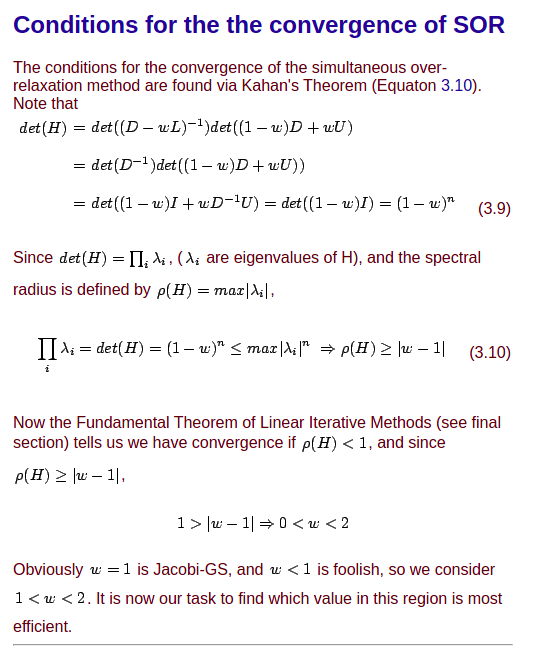
```

### Skema Interasi dalam Bentuk Matriks

Perhatikan bahwa:

$$(D+ \omega L)x^{k+1} = ((1-\omega)D - \omega U) x^{k} + \omega b$$

$$\rightarrow x^{k+1} = (D+ \omega L)^{-1}((1-\omega)D - \omega U) x^{k} + \omega (D+ \omega L)^{-1}b$$

### __R__ _Function_ SOR Gauss Seidel

Berikut ini adalah _function_-nya:

```{r}
sor_jacobi_seigel_ikanx = function(A,b,x_awal,iter_max,tol_max,omega){
  # A adalah matriks
  # b adalah vector
  # x_awal adalah vektor utk initial iteration
  # tol_max toleransi error
  # iter_max iterasi maksimum
  
  # ambil diagonalnya
  da = diag(A)
  # bikin matriks diagonal  
  D = diag(da)
  # bikin matriks C, yakni A yang sudah dihapus diagonalnya
  C = A - D
  # lower diagonal matrix
  U = C
  U[lower.tri(U)] = 0
  # lower diagonal matrix
  L = C
  L[upper.tri(L)] = 0
  # cari D inverse
  Dinv = matlib::inv(D + omega * L)
  # cari Jacobian matriks B
  B = Dinv %*% ((1-omega) * D - omega * U)
  # hitung b1
  b1 = omega * Dinv %*% b
  # iterasi
  for(i in 1:iter_max){
    x = B %*% x_awal + b1
    if(norm(x-x_awal,"2") < tol_max * norm(x_awal,"2")) {break}
    x_awal = x
  }
  # output
  output = list("iterasi yang dilakukan: " = i,
                "Solusi: " = x_awal)
  return(output)
}
```

Berikut adalah contoh penggunaannya:

```{r}
A = matrix(c(3,1,1,0,1,5,0,1,1,-1,3,1,0,2,1,4),ncol = 4)
b = c(1,4,-2,1)
iter_max = 100
tol_max = 10^(-5)
x_awal = c(1,1,1,1)
omega = 1.1

sor_jacobi_seigel_ikanx(A,b,x_awal,iter_max,tol_max,omega)
```

Dengan $\omega$ __tertentu__ didapatkan iterasi yang lebih sedikit.

\newpage

# CHAPTER IV {-}

# SISTEM PERSAMAAN NON LINEAR

## Definisi SPNL

Misalkan suatu sistem persamaan non linear memiliki bentuk sebagai berikut:

$$\begin{matrix}
f_1(x_1,x_2,..,x_n,K) = 0 \\ 
f_2(x_1,x_2,..,x_n,K) = 0 \\
... \\
f_n(x_1,x_2,..,x_n,K) = 0
\end{matrix}$$

dengan $f_i, i=1,2,..,n$ merupakan persamaan non linear.

## Metode Newton

Untuk memudahkan perhitungan, mari kita lihat 2 fungsi sederhana berikut ini:

$$\begin{matrix}
f_1(x_1,x_2) = 0 \\
f_2(x_1,x_2) = 0
\end{matrix}$$

Misalkan diberikan _initial approximation_ berupa $x_1^{(0)}$ dan $x_2^{(0)}$. Kita bisa menghitung aproksimasi untuk iterasi berikutnya berupa:

$$\begin{matrix}
x_1^{(1)} = x_1^{(0)} + D x_1^{(0)} \\
x_2^{(1)} = x_2^{(0)} + D x_2^{(0)}
\end{matrix}$$

Secara umum, bentuknya adalah sebagai berikut:

$$\begin{matrix}
x_1^{(k+1)} = x_1^{(k)} + D x_1^{(k)} \\
x_2^{(k+1)} = x_2^{(k)} + D x_2^{(k)}
\end{matrix}$$

Oleh karena kita mengharapkan $x_1^{(k+1)}, x_2^{(k+1)}$ merupakan solusi dari __SPNL__, maka:

$$\begin{matrix}
f(x^{(k+1)}) \approx 0\\
f(x^{(k)} + D x^{(k)}) \approx 0
\end{matrix}$$

Dengan menggunakan __deret Taylor__, kita bisa _expand_ bentuk di atas menjadi:

$$\begin{matrix}
f(x^{(k)} + D x^{(k)}) = f(x^{(k)}) + J^{(k)} D x^{(k)} + K 
\end{matrix}$$

\pagebreak

Dengan $J^{(k)}$ adalah _Jacobian matrix_ yang berisi:

```{r out.width="80%",fig.align='center',echo=FALSE,fig.cap="Matriks Jacobi Newton SPNL"}
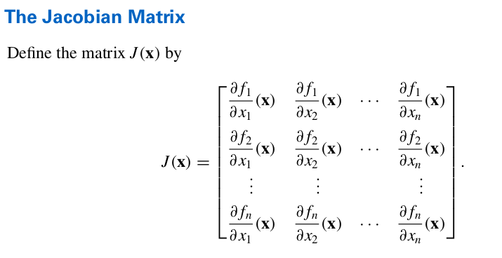
```

### Skema Iterasi Metode Newton

Skema iterasinya menjadi berikut:

$$x^{(k+1)} = x^{(k)} - J(x^{(k)})^{-1} F(x^{(k)})$$ 


### __R__ _Function_ Metode Newton SPNL

Kelak _function_ yang ditulis akan memanfaatkan skema iterasi tersebut. Oleh karena __R__ bisa melakukan operasi matriks, kita akan memanfaatkan operasi tersebut dalam membuat programnya.

> Langkah yang kritis pada metode ini adalah penentuan titik _initial_ iterasi. Sebisa mungkin kita akan pilih titik _initial_ yang dekat dengan solusi berdasarkan grafik yang ada.

Selain itu, kita perlu pertimbangkan juga persamaan yang ada di matriks Jacobi-nya. Jangan sampai ada pembagian dengan `nol` akibat kita salah memilih titik _initial_.


\newpage

### Contoh Soal

### Soal I {-}

Cari akar dari SPNL:

$$\begin{matrix}
f_1(x_1,x_2) = x_1^2 + x_2^2 - 4 = 0 \\
f_1(x_1,x_2) = x_1 x_2 - 1 = 0 \\
\end{matrix}$$


#### Jawab {-}

Mari kita buat grafiknya terlebih dahulu:

```{r,fig.align='center',echo=FALSE,fig.cap="Contoh Soal SPNL I"}
rm(list=ls())
f1 = function(x){sqrt(4 - x^2)}
f2 = function(x){1/x}

df1 = 
  data.frame(x = seq(-2,2,by = 0.05)) %>% 
  mutate(y = f1(x))

df2 = 
  data.frame(x = c(seq(-3,-0.3,by = 0.05),
                   seq(0.3,3,by = 0.05))) %>% 
  mutate(y = f2(x))

df2_1 = df2 %>% filter(x<0)
df2_2 = df2 %>% filter(x>0)

plot_soal_1 = 
  ggplot() +
  geom_line(data = df1,aes(x, y)) +
  geom_line(data = df1,aes(x , -y)) +
  geom_line(data = df2_1,aes(x, y)) +
  geom_line(data = df2_2,aes(x, y)) +
  coord_equal() +
  labs(caption = "Digambar dengan R\nikanx101.com") 
plot_soal_1
```

Terlihat ada `4` buah akar dari SPNL tersebut. Kita akan selesaikan satu persatu dengan cara memilih titik _initial_ terdekat.

Sebelumnya, kita buat dulu matriks Jacobi nya:

$$J(x) = \begin{bmatrix}
2x_1 & 2x_2 \\
x_2 & x_1 \\
\end{bmatrix}$$


Berdasarkan informasi di atas, kita akan selesaikan secara iteratif dengan __R__:

```{r}
# menghitung norm untuk kriteria penghentian
# menghitung norm infinity dari vektor v
norm_vec_inf = function(x)max(abs(x))

# initial
x0 = c(0,3)

# bikin fungsi F(x1,x2)
F_x_k = function(x){
  f1 = x[1]^2 + x[2]^2 - 4
  f2 = x[1]*x[2] - 1
  xk = c(f1,f2)
  return(xk)
}

# bikin matriks jacobi
jax = function(x){
  a11 = 2*x[1]
  a12 = 2*x[2]
  a21 = x[2]
  a22 = x[1]
  J = matrix(c(a11,a12,a21,a22),ncol = 2,byrow = T)
  J_inv = matlib::inv(J)
  return(J_inv)
}

# set toleransi max yang diinginkan
tol_max = 0.000005

# set max iterasi yang diperbolehkan
iter_max = 40

# kita mulai iterasinya
iter = 0
while(norm_vec_inf(F_x_k(x0)) > tol_max && iter <= iter_max){
  xk_new = x0 - jax(x0) %*% F_x_k(x0)
  x0 = xk_new
  iter = iter + 1
}

list("Solusi Final: " = x0,
     "Banyak iterasi: " = iter)
```


Mari kita plot kembali ke grafiknya:

```{r,echo=FALSE}
plot_soal_1 = 
  plot_soal_1 +
  geom_point(aes(x = 0.517638,
                 y = 1.931852),
             color = "red",
             size = 2)
plot_soal_1
```

Kita lakukan kembali untuk titik berikutnya, misal saya akan dekati dari titik initial $(2,0)$ berikut:

```{r,echo=FALSE}
# initial
x0 = c(2,0)
# kita mulai
while(norm_vec_inf(F_x_k(x0)) > tol_max){
  xk_new = x0 - jax(x0) %*% F_x_k(x0)
  x0 = xk_new
  iter = iter + 1
}

list("Solusi yang dihasilkan: " = x0,
     "Banyak iterasi: " = iter)
```


Mari kita plot kembali ke grafiknya:

```{r,echo=FALSE}
plot_soal_1 = 
  plot_soal_1 +
  geom_point(aes(x = 1.9318527,
                 y = 0.5176371),
             color = "red",
             size = 2)
plot_soal_1
```

Kita bisa ulangi hingga semua titik solusi terpenuhi.

Solusi ketiga:

```{r,echo=FALSE}
# initial
x0 = c(0,-2)
# kita mulai
while(norm_vec_inf(F_x_k(x0)) > tol_max){
  xk_new = x0 - jax(x0) %*% F_x_k(x0)
  x0 = xk_new
  iter = iter + 1
}

list("Solusi yang dihasilkan: " = x0,
     "Banyak iterasi: " = iter)
```

```{r,echo=FALSE}
plot_soal_1 = 
  plot_soal_1 +
  geom_point(aes(x = -0.5176371,
                 y = -1.9318527),
             color = "red",
             size = 2)
plot_soal_1
```

Solusi keempat:

```{r,echo=FALSE}
# initial
x0 = c(-2,0)
# kita mulai
while(norm_vec_inf(F_x_k(x0)) > tol_max){
  xk_new = x0 - jax(x0) %*% F_x_k(x0)
  x0 = xk_new
  iter = iter + 1
}

list("Solusi yang dihasilkan: " = x0,
     "Banyak iterasi: " = iter)
```

```{r,echo=FALSE}
plot_soal_1 = 
  plot_soal_1 +
  geom_point(aes(x = -1.9318527,
                 y = -0.5176371),
             color = "red",
             size = 2)
plot_soal_1
```

\newpage

### Soal II {-}

Cari aproksimasi solusi dari sistem persamaan non linear berikut:

$$4x_1^2 - 20x_1 + \frac{1}{4} x_2^2 + 8 = 0$$

$$\frac{1}{2}x_1 x_2^2 + 2x_1 - 5x_2 + 8 = 0$$


#### Jawab {-}

Untuk membantu kita menjawab soal tersebut, pertama-tama kita perlu membuat grafik fungsi dari SPNL tersebut:

```{r,message=FALSE,warning=FALSE,fig.retina=10,fig.align='center',fig.cap="Grafik Contoh Soal",echo=FALSE}
data_ke_grafik = function(a,b,delta,f){
  # generate selang
  selang = seq(a,b,by = delta)
  # menghitung (x,y) yang memenuhi f(x,y) = 0
  df = 
    # mengeluarkan semua kombinasi yang mungkin dari selang
    expand.grid(selang,selang) %>% 
    as.data.frame() %>% 
    # mengubah nama variabel menjadi x,y
    rename(x = Var1,
           y = Var2) %>%  
    # menghitung nilai f(x,y)
    mutate(f = f(x,y)) %>%
    # hanya mengambil (x,y) yang memenuhi f(x,y) = 0
    filter(round(f,1) == 0) 
  # output berupa data frame yang siap diplot
  return(df)
}

# initial condition yang dibutuhkan untuk menggambar
a = -10
b = 10
delta = 0.005
# fungsi dari soal
f1 = function(x1,x2){4 * x1^2 - 20* x1 + (1/4) * x2^2 + 8}
f2 = function(x1,x2){(1/2) * x1 * x2^2 + 2 * x1 - 5 * x2 + 8}
# proses generator data ke grafik
# menggunakan program yang dibuat di bagian 2.1.1
df1 = data_ke_grafik(a,b,delta,f1)
df2 = data_ke_grafik(a,b,delta,f2)

# proses menggambar plot
# membuat canvas
plot_soal_3a =
  ggplot() +
  # memplot f1
  geom_point(data = df1,
             aes(x,y),
             size = .1,
             color = "steelblue") +
  # memplot f2
  geom_point(data = df2,
             aes(x,y),
             size = .1,
             color = "darkred") +
  # menampilkan label
  labs(subtitle = "Grafik f1(x1,x2) dan f2(x1,x2)",
       title = "Soal Contoh",
       caption = "Dibuat dengan R\nikanx101.com")

# menampilkan grafik
plot_soal_3a
```

Jika kita lihat grafik di atas, ada dua titik solusi yang akan kita cari. Oleh karena kita akan gunakan metode Newton, maka diperlukan dua sembarang _initial points_. Diharapkan iterasi dari dua _initial points_ tersebut akan konvergen ke dua titik solusi yang dicari.


Kita akan mengambil dua titik _initial_ berikut: $(0,0)$ dan $(2,10)$ secara sembarang. __Perlu diperhatikan bahwa perbedaan initial points yang diambil akan mempengaruhi seberapa banyak iterasi yang diperlukan menuju konvergen ke titik solusi__. 

Berikut adalah grafiknya:

```{r,echo=FALSE,message=FALSE,warning=FALSE,fig.retina=10,fig.align='center',fig.cap="Initial Points Soal Contoh"}
# menampilkan grafik
plot_soal_3a +
  geom_point(aes(x = 0,
                 y = 0),
             color = "darkgreen",
             size = 2) +
  geom_point(aes(x = 2,
                 y = 10),
             color = "darkgreen",
             size = 2)
```


Titik hijau adalah _initial points_ yang kita pilih.

Untuk menyelesaikan dengan metode Newton, kita perlu mencari persamaan di matriks Jacobi terlebih dahulu. Untuk membantu kita mencari turunan parsial dari kedua fungsi soal, kita akan gunakan `library(Ryacas)` di __R__ berikut:

Berikut adalah matriks Jacobi yang sudah kita dapatkan:

$$J(x) = \begin{bmatrix}
8x_1-20 & \frac{x_2}{2} \\
\frac{x_2^2}{2}+2 & x_2 x_1-5 \\
\end{bmatrix}$$

Sekarang kita tinggal melakukan iterasi dengan skema berikut:

$$x^{(k+1)} = x^{(k)} - J(x^{(k)})^{-1} F(x^{(k)})$$ 

Mari kita coba selesaikan titik pertama terlebih dahulu. 

```{r,echo=TRUE}
# initial
x0 = c(0,0)

# bikin fungsi F(x1,x2)
F_x_k = function(x){
  f1 = 4 * x[1]^2 - 20* x[1] + (1/4) * x[2]^2 + 8
  f2 = (1/2) * x[1] * x[2]^2 + 2 * x[1] - 5 * x[2] + 8
  xk = c(f1,f2)
  return(xk)
}

# bikin matriks jacobi
jax = function(x){
  a11 = 8*x[1]-20
  a12 = x[2]/2
  a21 = x[2]^2/2+2
  a22 = x[2]*x[1]-5
  J = matrix(c(a11,a12,a21,a22),ncol = 2,byrow = T)
  J_inv = matlib::inv(J)
  return(J_inv)
}

# set toleransi max yang diinginkan
tol_max = 0.000001

# set max iterasi yang diperbolehkan
iter_max = 40

# kita mulai iterasinya
iter = 0
while(norm_vec_inf(F_x_k(x0)) > tol_max && iter <= iter_max){
  xk_new = x0 - jax(x0) %*% F_x_k(x0)
  x0 = xk_new
  iter = iter + 1
#  pesan = paste0("Iterasi ke-",iter,
#                 " menghasilkan: x1 = ",x0[1],
#                 " dan x2 = ",x0[2])
#  print(pesan)
}

list("Solusi Final: " = x0,
     "Banyak iterasi: " = iter)

```

Mari kita selesaikan titik berikutnya. 

```{r,echo=FALSE}
# initial
x0 = c(2,10)

# kita mulai iterasinya
iter = 0
while(norm_vec_inf(F_x_k(x0)) > tol_max && iter <= iter_max){
  xk_new = x0 - jax(x0) %*% F_x_k(x0)
  x0 = xk_new
  iter = iter + 1
#  pesan = paste0("Iterasi ke-",iter,
#                 " menghasilkan: x1 = ",x0[1],
#                 " dan x2 = ",x0[2])
#  print(pesan)
}

list("Solusi Final: " = x0,
     "Banyak iterasi: " = iter)

```

Kita dapatkan ada dua solusi dari SPNL ini, yakni:

1. `(0.5,2)`
1. `(1.096720,6.040933)`

\newpage

Berikut adalah grafiknya:

```{r,echo=FALSE,message=FALSE,warning=FALSE,fig.retina=10,fig.align='center',fig.cap="Solusi Pertama dan Kedua dari Soal"}
# menampilkan grafik
plot_soal_3a +
  geom_point(aes(x = 0.5,
                 y = 2.0),
             color = "orange",
             size = 3) +
  geom_point(aes(x = 1.096720,
                 y = 6.040933),
             color = "orange",
             size = 3) +
  annotate("label",
           x = 0.5, y = -0.5,
           label = "Solusi I\n(0.5,2)") +
  annotate("label",
           x = 1.1, y = 9,
           label = "Solusi II\n(1.096720,6.040934)")
```

\newpage

## Metode Broyden

Metode Broyden merupakan metode modifikasi dari metode Newton. Perbedaan mendasar dari metode ini adalah kita menggunakan hampiran matriks Jacobi. 

### Algoritma Metode Broyden

Berikut adalah algoritma 10.2 dari buku:

```{r out.width="90%",echo=FALSE,fig.align='center',fig.cap="Algoritma Metode Broyden"}
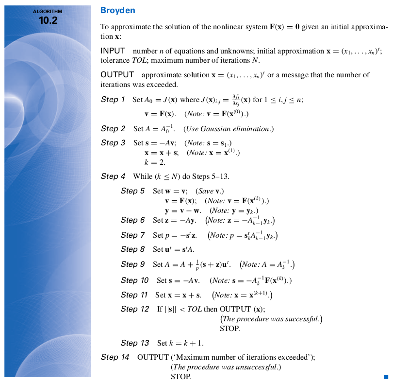
```

### Contoh Soal

### Soal I {-}

Aproksimasi solusi dari SPNL berikut ini:

$$x_1^2 + x_2 - 37 = 0$$

$$x_1 - x_2^2 - 5 = 0$$

$$x_1 + x_2 + x_3 - 3 = 0$$

$$-4 \leq x_1 \leq 8$$

$$-2 \leq x_2 \leq 2$$

$$-6 \leq x_3 \leq 0$$

#### Jawab {-}

Berikut adalah matriks Jacobi yang sudah kita dapatkan:

$$J(x) = \begin{bmatrix}
2 x_1 & 1 & 0\\
1 & -2x_2 & 0 \\
1 & 1 & 1
\end{bmatrix}$$

Sekarang kita akan buat program iterasi metode Broyden berdasarkan __algoritma 10.2__.

Kita akan _generate random_ titik di domain $x_1,x_2,x_3$ sebagai berikut:

```{r,include=FALSE}
x0 = c(runif(1,3,8),
       runif(1,-2,2),
       runif(1,-6,0)) %>% round(1)
```

Sebagai percobaan, saya akan coba dekati dengan _initial point_ `r paste0("(",paste(x0,collapse = ","),")")`. Berikut adalah programnya:

```{r}
# bikin fungsi F(x1,x2,x3)
F_x_k = function(x){
  f1 = x[1]^2 + x[2] - 37
  f2 = x[1] - x[2]^2 - 5 
  f3 = x[1] + x[2] + x[3] - 3
  xk = c(f1,f2,f3)
  return(xk)
}

# set toleransi max yang diinginkan
tol_max = 0.00001

# set max iterasi yang diperbolehkan
iter_max = 70

# kita mulai metode Broyden-nya sesuai dengan algoritma 10.2
# step 1
v = F_x_k(x0)

# step 2
# bikin matriks jacobi
jax = function(x){
  a11 = 2*x[1]
  a12 = 1
  a13 = 0
  a21 = 1
  a22 = -2*x[2]
  a23 = 0
  a31 = 1
  a32 = 1
  a33 = 1
  J = matrix(c(a11,a12,a13,a21,a22,a23,a31,a32,a33),ncol = 3,byrow = T)
  J_inv = matlib::inv(J)
  return(J_inv)
}
A = jax(x0)

# step 3
s = -A %*% v
x = x0 + s
iter = 2

# step 4  
while(norm_vec_inf(F_x_k(x)) > tol_max && iter <= iter_max){
  # step 5
  w = v
  v = F_x_k(x)
  y = v - w
  # step 6
  z = -A %*% y
  # step 7
  p = t(-s) %*% z
  p = as.numeric(p)
  # step 8
  ut = t(s) %*% A
  # step 9
  A = A + ((s+z)/p) %*% ut
  # step 10
  s = -A %*% v
  # step 11
  x = x + s
  iter = iter + 1
  # output
#  pesan = paste(x,collapse = ",")
#  pesan = paste0("Iterasi ke- ",iter,": (",pesan,")")
#  print(pesan)
}

if(iter <= iter_max){
  list("Titik initial: " = x0,
       "Solusi Final: " = x,
     "Banyak iterasi: " = iter)
} else if(iter > iter_max){
  list("Titik initial: " = x0,
       "Solusi Final: " = "Tidak Konvergen atau melebihi batas iterasi")
}


```

Kita bisa mengulang prosedur di atas dengan cara men-generate _random number_ di domain $x_1,x_2,x_3$ sebagai berikut:

```{r,echo=FALSE}
x0 = c(runif(1,3,8),
       runif(1,-2,2),
       runif(1,-6,0)) %>% round(1)

# kita mulai metode Broyden-nya sesuai dengan algoritma 10.2
# step 1
v = F_x_k(x0)

# step 2
A = jax(x0)

# step 3
s = -A %*% v
x = x0 + s
iter = 2

# step 4  
while(norm_vec_inf(F_x_k(x)) > tol_max && iter <= iter_max){
  # step 5
  w = v
  v = F_x_k(x)
  y = v - w
  # step 6
  z = -A %*% y
  # step 7
  p = t(-s) %*% z
  p = as.numeric(p)
  # step 8
  ut = t(s) %*% A
  # step 9
  A = A + ((s+z)/p) %*% ut
  # step 10
  s = -A %*% v
  # step 11
  x = x + s
  iter = iter + 1
  }

if(iter <= iter_max){
  list("Titik initial: " = x0,
       "Solusi Final: " = x,
     "Banyak iterasi: " = iter)
} else if(iter > iter_max){
  list("Titik initial: " = x0,
       "Solusi Final: " = "Tidak Konvergen atau melebihi batas iterasi")
}


```

```{r,echo=FALSE}
x0 = c(runif(1,3,8),
       runif(1,-2,2),
       runif(1,-6,0)) %>% round(1)

# kita mulai metode Broyden-nya sesuai dengan algoritma 10.2
# step 1
v = F_x_k(x0)

# step 2
A = jax(x0)

# step 3
s = -A %*% v
x = x0 + s
iter = 2

# step 4  
while(norm_vec_inf(F_x_k(x)) > tol_max && iter <= iter_max){
  # step 5
  w = v
  v = F_x_k(x)
  y = v - w
  # step 6
  z = -A %*% y
  # step 7
  p = t(-s) %*% z
  p = as.numeric(p)
  # step 8
  ut = t(s) %*% A
  # step 9
  A = A + ((s+z)/p) %*% ut
  # step 10
  s = -A %*% v
  # step 11
  x = x + s
  iter = iter + 1
  }

if(iter <= iter_max){
  list("Titik initial: " = x0,
       "Solusi Final: " = x,
     "Banyak iterasi: " = iter)
} else if(iter > iter_max){
  list("Titik initial: " = x0,
       "Solusi Final: " = "Tidak Konvergen atau melebihi batas iterasi")
}


```

```{r,echo=FALSE}
x0 = c(runif(1,3,8),
       runif(1,-2,2),
       runif(1,-6,0)) %>% round(1)

# kita mulai metode Broyden-nya sesuai dengan algoritma 10.2
# step 1
v = F_x_k(x0)

# step 2
A = jax(x0)

# step 3
s = -A %*% v
x = x0 + s
iter = 2

# step 4  
while(norm_vec_inf(F_x_k(x)) > tol_max && iter <= iter_max){
  # step 5
  w = v
  v = F_x_k(x)
  y = v - w
  # step 6
  z = -A %*% y
  # step 7
  p = t(-s) %*% z
  p = as.numeric(p)
  # step 8
  ut = t(s) %*% A
  # step 9
  A = A + ((s+z)/p) %*% ut
  # step 10
  s = -A %*% v
  # step 11
  x = x + s
  iter = iter + 1
  }

if(iter <= iter_max){
  list("Titik initial: " = x0,
       "Solusi Final: " = x,
     "Banyak iterasi: " = iter)
} else if(iter > iter_max){
  list("Titik initial: " = x0,
       "Solusi Final: " = "Tidak Konvergen atau melebihi batas iterasi")
}


```

```{r,echo=FALSE}
x0 = c(runif(1,3,8),
       runif(1,-2,2),
       runif(1,-6,0)) %>% round(1)

# kita mulai metode Broyden-nya sesuai dengan algoritma 10.2
# step 1
v = F_x_k(x0)

# step 2
A = jax(x0)

# step 3
s = -A %*% v
x = x0 + s
iter = 2

# step 4  
while(norm_vec_inf(F_x_k(x)) > tol_max && iter <= iter_max){
  # step 5
  w = v
  v = F_x_k(x)
  y = v - w
  # step 6
  z = -A %*% y
  # step 7
  p = t(-s) %*% z
  p = as.numeric(p)
  # step 8
  ut = t(s) %*% A
  # step 9
  A = A + ((s+z)/p) %*% ut
  # step 10
  s = -A %*% v
  # step 11
  x = x + s
  iter = iter + 1
  }

if(iter <= iter_max){
  list("Titik initial: " = x0,
       "Solusi Final: " = x,
     "Banyak iterasi: " = iter)
} else if(iter > iter_max){
  list("Titik initial: " = x0,
       "Solusi Final: " = "Tidak Konvergen atau melebihi batas iterasi")
}


```

```{r,echo=FALSE}
x0 = c(runif(1,3,8),
       runif(1,-2,2),
       runif(1,-6,0)) %>% round(1)

# kita mulai metode Broyden-nya sesuai dengan algoritma 10.2
# step 1
v = F_x_k(x0)

# step 2
A = jax(x0)

# step 3
s = -A %*% v
x = x0 + s
iter = 2

# step 4  
while(norm_vec_inf(F_x_k(x)) > tol_max && iter <= iter_max){
  # step 5
  w = v
  v = F_x_k(x)
  y = v - w
  # step 6
  z = -A %*% y
  # step 7
  p = t(-s) %*% z
  p = as.numeric(p)
  # step 8
  ut = t(s) %*% A
  # step 9
  A = A + ((s+z)/p) %*% ut
  # step 10
  s = -A %*% v
  # step 11
  x = x + s
  iter = iter + 1
  }

if(iter <= iter_max){
  list("Titik initial: " = x0,
       "Solusi Final: " = x,
     "Banyak iterasi: " = iter)
} else if(iter > iter_max){
  list("Titik initial: " = x0,
       "Solusi Final: " = "Tidak Konvergen atau melebihi batas iterasi")
}


```

```{r,echo=FALSE}
x0 = c(runif(1,3,8),
       runif(1,-2,2),
       runif(1,-6,0)) %>% round(1)

# kita mulai metode Broyden-nya sesuai dengan algoritma 10.2
# step 1
v = F_x_k(x0)

# step 2
A = jax(x0)

# step 3
s = -A %*% v
x = x0 + s
iter = 2

# step 4  
while(norm_vec_inf(F_x_k(x)) > tol_max && iter <= iter_max){
  # step 5
  w = v
  v = F_x_k(x)
  y = v - w
  # step 6
  z = -A %*% y
  # step 7
  p = t(-s) %*% z
  p = as.numeric(p)
  # step 8
  ut = t(s) %*% A
  # step 9
  A = A + ((s+z)/p) %*% ut
  # step 10
  s = -A %*% v
  # step 11
  x = x + s
  iter = iter + 1
  }

if(iter <= iter_max){
  list("Titik initial: " = x0,
       "Solusi Final: " = x,
     "Banyak iterasi: " = iter)
} else if(iter > iter_max){
  list("Titik initial: " = x0,
       "Solusi Final: " = "Tidak Konvergen atau melebihi batas iterasi")
}


```

Dari berbagai titik _random_ di atas, hanya ada dua titik solusi pada SPNL ini, yakni:

1. `(6,1,-4)`
1. `(6,-1,-2)`

\newpage

```{r,include=FALSE}
rm(list=ls())
```

# CHAPTER V {-}

# NUMERICAL OPTIMIZATION

Domain optimisasi akan selalu ada di berbagai bidang kehidupan. Kali ini kita akan mencoba mencari solusi optimal secara numeric. Ada beberapa metode _metaheuristic_ yang akan kita bahas di bagian-bagian selanjutnya.

## _Steepest Descent_ (Metode Gradien)

Salah satu metode yang populer dipakai dalam _numerical optimization_ adalah metode gradien. Bentuk gradien yang ditulis di sini adalah gradien dari fungsi multi peubah (agar berlaku umum). Jikalau masalah yang dihadapi hanya fungsi satu peubah, tidak menjadi masalah.

### Definisi

Misalkan kita memiliki masalah optimisasi:

Minimasi $f(x)$ dimana $x = (x_1,x_2,x_3,..,x_n)^T \in \mathbb{R}$.

Gradien dari $f(x)$ didefinisikan sebagai:

$$\text{grad } f(x) = (\frac{\partial f(x)}{\partial x_1}, \frac{\partial f(x)}{\partial x_2},..,\frac{\partial f(x)}{\partial x_n})^T$$

Vektor gradien $f(x)$ dari suatu titik, __secara lokal__ (tidak berlaku global di domain fungsi hanya spesifik dalam rentang titik tersebut) menandai __arah laju kenaikan tercepat__ dari $f(x)$. Kebalikannya vektor gradien $-f(x)$ menandai __arah laju penurunan tercepat__.

#### Catatan {-}

Perlu diperhatikan bahwa masalah __minimisasi__ bisa diganti ke __maksimisasi__ dengan cara mengubah $f(x)$ menjadi $-f(x)$.

### Langkah Kerja

Berangkat dari titik $P_0$, kita akan cari garis yang melalui $P_0$, dinotasikan sebagai $S_0$. 

$$S_0 = \frac{-G_0}{|| G_0 ||}$$

Dimana $G_0 = \text{grad } f(P_0)$.

Setelah bergerak dari _initial_, kita akan dapatkan $P_1$. Titik minimum lokal akan berada pada titik $x$ yang berada pada garis $X = P_0 + t S_0$.

Selanjutnya kita akan hitung $G_1$ dengan cara sama dengan sebelumnya: 

$$S_1 = \frac{-G_1}{|| G_1 ||}$$

Sehingga kita akan mendapatkan nilai $P_2$ di mana titik minimum lokal akan berada pada titik $x$ yang berada pada garis $X = P_1 + t S_1$. Perhatikan bahwa ini adalah bentuk dari persamaan garis linear^[Contoh persamaan garis linear y = ax + b].

Hasil iterasi terus menerus akan mendapatkan barisan:

$$\{ P_0,P_1,P_2,... \}$$

dengan sifat:

$$f(P_0) > f(P_1) > .. > f(P_k) > ..$$

Kenapa berlaku demikian?

> Karena kita sudah tentukan bahwa masalah minimsasi, sehingga nilai iterasi selanjutnya pasti akan lebih rendah dari nilai iterasi selanjutnya.

Iterasi akan berhenti saat gradien bernilai __nol__.

### Algoritma Formal

Misal diketahui nilai $P_k$.

- __STEP 1__ Hitung vektor gradien $G_k = \text{grad } f(P_k)$.
- __STEP 2__ Cari vektor satuannya $S_k = \frac{-G_k}{|| G_k ||}$.
- __STEP 3__ Lakukan _single parameter minimization)_ untuk $\varphi(t) = f(P_k + t S_k)$ di interval $[0,b]$ dimana $b$ adalah suatu bilangan __besar__. Ini akan menghasilkan suatu nilai $t = h_{min}$ di mana titik minimum lokal di $\varphi (t)$ terjadi. Hubungan $\varphi(h_{min}) = f(P_k + h_{min} S_k)$ menunjukkan ini adalah minimum fungsi $f(x)$ di garis $X = P_k + h_{min} S$
- __STEP 4__ Hitung $P_{k+1} = P_k + h_{min} S$.
- __STEP 5__ Lakukan iterasi hingga $|| P_{k+1} - P_k ||$ __sangat kecil__.

### Catatan Lain

$\bigtriangledown$ menandakan turunan parsial. Dalam kasus ini, gradien dari fungsi multi peubah.

Hasil iterasi _gradient descent_ pasti menghasilkan nilai yang lebih kecil dibandingkan iterasi sebelumnya.

\newpage

## Metode _Neighborhood Search_

Metode ini mirip dengan metode simplex yang dijelaskan secara geometrik.

### Definisi

Jika $i$ adalah suatu _feasible solution_, kita definisikan $N(i)$ adalah himpunan solusi yang dekat jaraknya dengan $i$ (tetanggaan).

### Algoritma Formal

- __STEP 1__ Pilih _initial feasible solution_ $i$.
- __STEP 2__ Pilih titik $j \in N(i)$ sehingga terpenuhi $f(j) \leq f(k), \forall k \in N(i)$.
- __STEP 3__ Jika:
  - $f(j) \geq f(i)$ __STOP__.
  - $f(j) < f(i)$ definisikan $i = j$ lalu ulangi __STEP 2__.
  
### Catatan Lain

Metode ini termasuk ke dalam metode yang _derivative-free_. Namun bisa jadi kita terjebak di titik minimum lokal padahal kita sedang mencari __minimum global__.
  
## Metode _Simulated Annealing_

Metode gradien memiliki dua masalah karena:

1. Gradien harus dihitung berulang kali setiap algoritma dijalankan.
1. Bisa jadi kita terjebak di minimum lokal saat mendapatkan $\bigtriangledown f(x) = 0$.

Metode _neighborhood search_ juga bisa terjebak dalam titik minimum lokal. Maka kita bisa menmodifikasi metode _neighborhood search_ pada __STEP 3__ sebagai berikut:

> Boleh menerima $j$ yang nilainya __tidak harus paling rendah__ untuk dijadikan $N(j)$.

Metode ini bersifat _derivation-free_.

### Masalah Fisis

Metode ini terinspirasi oleh proses fisis yang terjadi saat __peleburan metal__. Bagaimana metal dilebur, lalu melihat proses penurunan temperatus hingga metal mengeras kembali (molekul metal menjadi setimbang).

### Algoritma Formal

Misalkan:

- $T$ adalah _temperature_ $(T > 0)$. _State_ ini adalah analogi dari _feasible solution_.
- $E$ adalah _epoch_ menandai iterasi.
- $r$ adalah _cooling rate_ $(0 < r < 1)$. _Ratio_ penurunan temperatur antar _epoch_.

Berikut adalah _pseudo-code_-nya:

```
# STEP 1
Generate state i (initial state)
T = T0

# STEP 2
Repeat
  Repeat
    k = 0
    generate state j (suatu neighbor state)
    delta = f(j) - f(i)
    if delta < 0
      i = j
      else if rand() < exp(-delta / T)
        i = j
    k = k + 1
  Until k = E
  T = r * T
Until N_max iteration
```

### Catatan Penting

Metode ini adalah __killer method__ yang bisa kita gunakan untuk menyelesaikan masalah optimisasi kontinu __atau__ menyelesaikan masalah SPNL pada bagian sebelumnya. Caranya adalah dengan memodifikasi $F(X)$ menjadi masalah minimisasi.

### Contoh Soal

### Soal I {-}

Cari minimum fungsi dari $f(x) = x^4-8 x^3+20 x^2-16.5 x+3$ di $0<x<4$

#### Jawab {-}

Kita buat grafiknya terlebih dahulu:

```{r,echo=FALSE,fig.align='center',fig.retina=10,fig.cap="Grafik f(x)"}
rm(list=ls())
f = function(x)x^4-8*x^3+20*x^2-16.5*x+3

data.frame(x = seq(0,4,by = 0.001)) %>% 
  mutate(y = f(x)) %>% 
  ggplot(aes(x,y)) +
  geom_line() +
  theme_minimal() +
  labs(title = "Grafik f(x) = x^4-8 x^3+20 x^2-16.5 x+3",
       caption = "Digambar dengan R\nikanx101.com")
```

Terlihat bahwa titik minimum global terletak di antara $[3,4]$. Bagaimana penyelesaian dengan metode __AS__?

Pertama-tama saya akan buat _initial point_ di $x = i = 1$. Prinsipnya adalah melakukan iterasi di sebanyak _epoch_ untuk mencari _neighborhood_ di sekitar $i$.

Berikut adalah _function_ dalam __R__-nya:

```{r,message=FALSE,warning=FALSE}
# soal
f = function(x)x^4-8*x^3+20*x^2-16.5*x+3

# buat function untuk generate j
gen_j = function(x,selang){runif(1,0,1) - 0.5 * 2*selang + x} 

# definisi kondisi awal
T = 10 # state
iter_max = 200 # batas max iterasi
epoch = 5
r = 0.7 # ratio penurunan suhu
lebar_selang = .2

# initial
i = 1.7
y = f(i) # nilai f dari tebakan awal

# indeks iterasi
m = 0 # untuk keperluan iterasi full

# template
min_global = c(i)

# kita mulai ya
while(m < iter_max){
  k = 0 # untuk keperluan epoch
  while(k < epoch){
    j = gen_j(i,lebar_selang)
    delta = f(j) - f(i)
    if(delta < 0){i = j}
    else if(runif(1,0,1) < exp((-delta)/T)) {i = j}
    y = ifelse(f(i) < y,
               f(i),
               y)
    k = k + 1
    }
  T = r * T
  m = m + 1
  min_global = c(min_global,i)
  }
  
min_global %>% tail(1)
  
```

\newpage

### Soal II {-}

Cari akar dari fungsi $f(x) = x^4-8 x^3+20 x^2-16.5 x+3$ di $0<x<4$

#### Jawab {-}

Kita buat grafiknya terlebih dahulu:

```{r,echo=FALSE,fig.align='center',fig.retina=10,fig.cap="Grafik f(x)"}
rm(list=ls())
f = function(x)x^4-8*x^3+20*x^2-16.5*x+3

data.frame(x = seq(0,4,by = 0.001)) %>% 
  mutate(y = f(x)) %>% 
  ggplot(aes(x,y)) +
  geom_line() +
  theme_minimal() +
  labs(title = "Grafik f(x) = x^4-8 x^3+20 x^2-16.5 x+3",
       caption = "Digambar dengan R\nikanx101.com")
```

Terlihat ada `4` buah akar. Coba lihat lagi bagian `3.7.4`. Kita bisa mengganti masalah optimisasi (minimisasi) menjadi masalah pencarian akar dengan memodifikasi $f(x)$.

Misal saya akan buat $g(x) = - \frac{1}{|f(x)|}$.

\newpage

```{r,echo=FALSE,fig.align='center',fig.retina=10,fig.cap="Grafik f(x)"}
g = function(x) abs(f(x))

data.frame(x = seq(0,4,by = 0.001)) %>% 
  mutate(y = g(x)) %>% 
  ggplot(aes(x,y)) +
  geom_line() +
  theme_minimal() +
  labs(title = "Grafik g(x) = |f(x)|",
       caption = "Digambar dengan R\nikanx101.com")
```

Berikut adalah _function_ dalam __R__-nya:

```{r,message=FALSE,warning=FALSE}
# buat function untuk generate j
gen_j = function(x,selang){runif(1,0,1) - 0.5 * 2*selang + x} 

# template all
hasil = c()

for(ikanx in 1:100){
  
# definisi kondisi awal
T = 10 # state
iter_max = 100 # batas max iterasi
epoch = 10
r = 0.8 # ratio penurunan suhu
lebar_selang = .5

# initial
i = 0
y = g(i) # nilai f dari tebakan awal

# indeks iterasi
m = 0 # untuk keperluan iterasi full

# template
min_global = c(i)

# kita mulai ya
while(m < iter_max){
  k = 0 # untuk keperluan epoch
  while(k < epoch){
    j = gen_j(i,lebar_selang)
    delta = g(j) - g(i)
    if(delta < 0){i = j}
    if(runif(1,0,1) < exp((-delta)/T)) {i = j}
    y = ifelse(g(i) < y,
               g(i),
               y)
    k = k + 1
    }
  T = r * T
  m = m + 1
  min_global = c(min_global,i)
  }
  
temp = min_global %>% tail(1) %>% as.numeric
hasil = c(hasil,temp)
}

unique(sort(round(hasil,1)))
```

Perhatikan bahwa saya melakukan looping hingga `100` kali agar hasilnya konvergen ke beberapa solusi saja.


\newpage

### Soal III {-}

Cari minimum fungsi dari $f(x,y) = 0.5(x^4-16 x^2 +5x) + 0.5(y^4-16y^2+5y)$ di $-4<x,y<4$

#### Jawab {-}

Kita buat grafiknya terlebih dahulu:

```{r,echo=FALSE,fig.align='center',fig.retina=10,fig.cap="Grafik f(x,y)",warning=FALSE,message=FALSE}
rm(list=ls())

f = function(x,y){0.5*(x^4-16*x^2+5*x) + 0.5*(y^4-16*y^2+5*y)}
x = seq(-4,4,by = 0.1)
y = seq(-4,4,by = 0.1)

data = 
  expand.grid(x,y) %>% 
  as.data.frame() %>% 
  rename(x = Var1,
         y = Var2) %>% 
  mutate(z = f(x,y))

plot3D::scatter3D(x = data$x,
                  y = data$y,
                  z = data$z,
                  theta = 60, phi = -20)
```

Dengan _initial point_ di $(1,2)$ kita akan buat __R__ _function_-nya:

```{r,message=FALSE,warning=FALSE}
# soal
f = function(v){0.5*(v[1]^4-16*v[1]^2+5*v[1]) + 0.5*(v[2]^4-16*v[2]^2+5*v[2])}

# buat function untuk generate j
gen_j = function(x,selang){runif(1,x-selang,x+selang)} 

# definisi kondisi awal
T = 100 # state
iter_max = 500 # batas max iterasi
epoch = 100
r = 0.9 # ratio percepatan iterasi
lebar_selang = 0.9

# initial
i = c(0,0)
y = f(i) # nilai f dari tebakan awal

# indeks iterasi
m = 0 # untuk keperluan iterasi full

# kita mulai ya
while(m < iter_max){
  k = 0 # untuk keperluan epoch
  while(k < epoch){
    j = c(gen_j(i[1],lebar_selang),
          gen_j(i[2],lebar_selang))
    delta = f(j) - f(i)
    if(delta < 0){i = j}
    else if(runif(1,0,1) < exp((-delta)/T)) {i = j}
    y = ifelse(f(i) < y,
               f(i),
               y)
    k = k + 1
    }
  T = r * T
  m = m + 1
  }
  
list("Titik minimum global" = i,
     "nilai f(x,y)" = f(i))


```


Sebagai catatan, karena ini adalah metode _meta heuristic_ maka __tidak ada jaminan bahwa solusi yang didapatkan adalah yang paling optimal__.

> Kita bisa menyiasatinya dengan cara melakukan percobaan berkali-kali agar hasil yang kita dapatkan konvergen ke suatu solusi tertentu.

\newpage

## _Spiral Optimization Algorithm_

_Spiral Optimization Algorithm_ adalah salah satu metode _meta heuristic_ yang digunakan untuk mencari minimum global dari suatu sistem persamaan. 

Algoritmanya mudah dipahami dan intuitif tanpa harus memiliki latar keilmuan tertentu. Proses kerjanya adalah dengan melakukan _random number generating_ pada suatu selang dan melakukan rotasi sekaligus kontraksi dengan titik paling minimum pada setiap iterasi sebagai pusatnya.

Berikut adalah algoritmanya:

```
INPUT
  m >= 2 # jumlah titik
  theta  # sudut rotasi (0 <= theta <= 2pi)
  r      # konstraksi
  k_max  # iterasi maksimum
PROCESS
  1 generate m buah titik secara acak
      x_i
  2 initial condition
      k = 0 # untuk keperluan iterasi
  3 cari x_* yang memenuhi
      min(f(x_*))
  
  4 lakukan rotasi dan konstraksi semua x_i
      x_* sebagai pusat rotasi
      k = k + 1
  5 ulangi proses 3 dan 4
  6 hentikan proses saat k = k_max
      output x_*
```

Berdasarkan algoritma di atas, salah satu proses yang penting adalah melakukan __rotasi__ dan __konstraksi__ terhadap semua titik yang telah di-_generate_.

Agar memudahkan penjeasan, saya akan memberikan ilustrasi geometri beserta operasi matriks aljabar terkait kedua hal tersebut.

Berikut adalah langkah-langkah yang ditempuh:

1. __Pertama__ saya akan membuat program yang bisa merotasi suatu titik berdasarkan suatu $\theta$ tertentu.
1. __Kedua__ saya akan memodifikasi program tersebut untuk melakukan rotasi sekaligus konstraksi dengan rasio $r$ tertentu.
1. __Ketiga__ saya akan memodifikasi program tersebut untuk melakukan rotasi sekaligus konstraksi dengan __titik pusat rotasi tertentu__.

### Ilustrasi Geometris

#### Operasi Matriks Rotasi

Misalkan saya memiliki titik $x \in \mathbb{R}^2$. Untuk melakukan rotasi sebesar $\theta$, saya bisa menggunakan suatu matriks $A_{2 \times 2}$ berisi fungsi-fungsi trigonometri sebagai berikut:

$$\begin{bmatrix} x_1 (k+1) \\ x_2 (k+1) \end{bmatrix} = \begin{bmatrix} \cos{\theta} & -\sin{\theta} \\ \sin{\theta} & \cos{\theta} \end{bmatrix} \begin{bmatrix} x_1 (k) \\ x_2 (k) \end{bmatrix}$$

Berdasarkan operasi matriks di atas, saya membuat __program__ di __R__ dengan beberapa modifikasi. Sebagai contoh, saya akan membuat program yang bertujuan untuk melakukan rotasi suatu titik $x \in \mathbb{R}$ sebanyak $n$ kali:

```{r,include = FALSE}
rm(list=ls())

# function untuk random titik
rand_titik = function(a,b){
  runif(2,a,b)
}
```

```{r}
# mendefinisikan program
rotasi_kan = function(x0,rot){
  # menghitung theta
  theta = 2*pi/rot
  # definisi matriks rotasi
  A = matrix(c(cos(theta),-sin(theta),
             sin(theta),cos(theta)),
           ncol = 2,byrow = T)
  
  # membuat template
  temp = vector("list")
  temp[[1]] = x0
  # proses rotasi
  for(i in 2:rot){
    xk = A %*% x0
    temp[[i]] = xk
    x0 = xk
  }
  
  # membuat template data frame
  final = data.frame(x = rep(NA,rot),
                     y = rep(NA,rot))
  
  # gabung data dari list
  for(i in 1:rot){
    tempura = temp[[i]]
    final$x[i] = tempura[1]
    final$y[i] = tempura[2]
  }
  # membuat plot
  plot = 
    ggplot() +
    geom_point(aes(x,y),data = final) +
    geom_point(aes(x[1],y[1]),
               data = final,
               color = "red") +
    coord_equal() +
    labs(title = "titik merah adalah titik initial") 
  
  # enrich dengan garis panah
  panah = data.frame(
    x_start = final$x[1:(rot-1)],
    x_end = final$x[2:rot],
    y_start = final$y[1:(rot-1)],
    y_end = final$y[2:rot]
  )
  # menambahkan garis panah ke plot
  plot = 
    plot + 
    geom_segment(aes(x = x_start,
                 xend = x_end,
                 y = y_start,
                 yend = y_end),
                 data = panah,
                 arrow = arrow(length = unit(.3,"cm"))
                 )
  
  # menyiapkan output
  list("Grafik rotasi" = plot,
       "Titik-titik rotasi" = final)
  }
```

\newpage

Berikut adalah uji coba dengan titik sembarang berikut ini:

```{r,fig.align="center",fig.retina = 10,fig.caption = "Uji Coba Rotasi I"}
# uji coba
rot = 12 # berapa banyak rotasi
x0 = rand_titik(0,10) # generate random titik
rotasi_kan(x0,rot)
```

\newpage

Uji coba kembali dengan titik sembarang lainnya berikut ini:

```{r,fig.align="center",fig.retina = 10,fig.caption = "Uji Coba Rotasi II"}
# uji coba
rot = 7 # berapa banyak rotasi
x0 = rand_titik(0,10) # generate random titik
rotasi_kan(x0,rot)
```

\newpage

#### Operasi Matriks Rotasi dan Kontraksi

Jika pada sebelumnya saya __hanya melakukan rotasi__, kali ini saya akan memodifikasi operasi matriks agar melakukan rotasi dan konstraksi secara bersamaan. Untuk melakukan hal tersebut, saya akan definisikan $r,0<r<1$ dan melakukan operasi matriks sebagai berikut:

$$\begin{bmatrix} x_1 (k+1) \\ x_2 (k+1) \end{bmatrix} = \begin{bmatrix} r \\ r \end{bmatrix} \begin{bmatrix} \cos{\theta} & -\sin{\theta} \\ \sin{\theta} & \cos{\theta} \end{bmatrix} \begin{bmatrix} x_1 (k) \\ x_2 (k) \end{bmatrix}$$

Oleh karena itu saya akan modifikasi program __R__ sebelumnya menjadi sebagai berikut:

```{r}
# mendefinisikan program
rotasi_konstraksi_kan = function(x0,rot,r){
  # menghitung theta
  theta = 2*pi/rot
  # definisi matriks rotasi
  A = matrix(c(cos(theta),-sin(theta),
             sin(theta),cos(theta)),
           ncol = 2,byrow = T)
  
  # membuat template
  temp = vector("list")
  temp[[1]] = x0
  # proses rotasi dan konstraksi
  for(i in 2:rot){
    xk = A %*% x0
    xk = r * xk
    temp[[i]] = xk
    x0 = xk
  }
  
  # membuat template data frame
  final = data.frame(x = rep(NA,rot),
                     y = rep(NA,rot))
  
  # gabung data dari list
  for(i in 1:rot){
    tempura = temp[[i]]
    final$x[i] = tempura[1]
    final$y[i] = tempura[2]
  }
  # membuat plot
  plot = 
    ggplot() +
    geom_point(aes(x,y),data = final) +
    geom_point(aes(x[1],y[1]),
               data = final,
               color = "red") +
    coord_equal() +
    labs(title = "titik merah adalah titik initial") 
  
  # enrich dengan garis panah
  panah = data.frame(
    x_start = final$x[1:(rot-1)],
    x_end = final$x[2:rot],
    y_start = final$y[1:(rot-1)],
    y_end = final$y[2:rot]
  )
  # menambahkan garis panah ke plot
  plot = 
    plot + 
    geom_segment(aes(x = x_start,
                 xend = x_end,
                 y = y_start,
                 yend = y_end),
                 data = panah,
                 arrow = arrow(length = unit(.3,"cm"))
                 )
  
  # menyiapkan output
  list("Grafik rotasi" = plot,
       "Titik-titik rotasi" = final)
  }
```

Berikutnya saya akan tunjukkan ilustrasi dari program ini.

\newpage

Saya akan uji coba untuk sembarang titik berikut ini:

```{r,fig.align="center",fig.retina = 10,fig.caption = "Uji Coba Rotasi-Konstraksi I"}
# uji coba
rot = 40 # berapa banyak rotasi
x0 = rand_titik(0,4) # generate random titik
r = .9
rotasi_konstraksi_kan(x0,rot,r)
```

\newpage

Saya akan uji coba kembali untuk sembarang titik lainnya berikut ini:

```{r,fig.align="center",fig.retina = 10,fig.caption = "Uji Coba Rotasi-Konstraksi II"}
# uji coba
rot = 6 # berapa banyak rotasi
x0 = rand_titik(0,4) # generate random titik
r = .7
rotasi_konstraksi_kan(x0,rot,r)
```

__Catatan penting:__

Terlihat bahwa semakin banyak rotasi dan konstraksi yang dilakukan akan membuat titik _initial_ __menuju pusat__ $(0,0)$.

\newpage

#### Operasi Matriks Rotasi dan Kontraksi dengan Titik $x^*$ Sebagai Pusatnya

Salah satu prinsip utama dari _spiral optimization algorithm_ adalah menjadikan titik $x^*$ sebagai pusat rotasi di setiap iterasinya. Operasi matriksnya adalah sebagai berikut:

$$\begin{bmatrix} x_1 (k+1) \\ x_2 (k+1) \end{bmatrix} = \begin{bmatrix} x_1^* \\ x_2^* \end{bmatrix} + \begin{bmatrix} r \\ r \end{bmatrix} \begin{bmatrix} \cos{\theta} & -\sin{\theta} \\ \sin{\theta} & \cos{\theta} \end{bmatrix} ( \begin{bmatrix} x_1 (k) \\ x_2 (k) \end{bmatrix} - \begin{bmatrix} x_1^* \\ x_2^* \end{bmatrix} )$$


Oleh karena itu kita akan modifikasi program bagian sebelumnya menjadi seperti ini:

```{r}
# mendefinisikan program
rotasi_konstraksi_pusat_kan = function(x0,rot,r,x_bin){
  # pusat rotasi
  pusat = x_bin
  # menghitung theta
  theta = 2*pi/rot
  # definisi matriks rotasi
  A = matrix(c(cos(theta),-sin(theta),
             sin(theta),cos(theta)),
           ncol = 2,byrow = T)
  
  # membuat template
  temp = vector("list")
  temp[[1]] = x0
  # proses rotasi dan konstraksi
  for(i in 2:rot){
    xk = A %*% (x0-pusat) # diputar dengan x_bin sebagai pusat
    xk = pusat + (r * xk)
    temp[[i]] = xk
    x0 = xk
  }
  
  # membuat template data frame
  final = data.frame(x = rep(NA,rot),
                     y = rep(NA,rot))
  
  # gabung data dari list
  for(i in 1:rot){
    tempura = temp[[i]]
    final$x[i] = tempura[1]
    final$y[i] = tempura[2]
  }
  # membuat plot
  plot = 
    ggplot() +
    geom_point(aes(x,y),data = final) +
    geom_point(aes(x[1],y[1]),
               data = final,
               color = "red") +
    geom_point(aes(x = pusat[1],
		   y = pusat[2]),
	       color = "blue") +
    labs(title = "titik merah adalah titik initial\ntitik biru adalah pusat rotasi") 
  
  # enrich dengan garis panah
  panah = data.frame(
    x_start = final$x[1:(rot-1)],
    x_end = final$x[2:rot],
    y_start = final$y[1:(rot-1)],
    y_end = final$y[2:rot]
  )
  # menambahkan garis panah ke plot
  plot = 
    plot + 
    geom_segment(aes(x = x_start,
                 xend = x_end,
                 y = y_start,
                 yend = y_end),
                 data = panah,
                 arrow = arrow(length = unit(.3,"cm"))
                 )
  
  # menyiapkan output
  list("Grafik rotasi" = plot,
       "Titik-titik rotasi" = final)
  }
```

Berikutnya saya akan tunjukkan ilustrasi dari program ini.


\newpage

Saya akan coba dengan sembarang titik berikut:

```{r,fig.align="center",fig.retina = 10,fig.caption = "Uji Coba Rotasi-Konstraksi Terhadap x* I"}
# uji coba
rot = 10 # berapa banyak rotasi
x0 = rand_titik(0,4) # generate random titik
x_bintang = c(0,1) # contoh pusat rotasi
r = .6
rotasi_konstraksi_pusat_kan(x0,rot,r,x_bintang)
```

\newpage

Saya akan coba kembali dengan sembarang titik lainnya:

```{r,fig.align="center",fig.retina = 10,fig.caption = "Uji Coba Rotasi-Konstraksi Terhadap x* II"}
# uji coba
rot = 45 # berapa banyak rotasi
x0 = rand_titik(0,10) # generate random titik
x_bintang = c(2,3) # contoh pusat rotasi
r = .87
rotasi_konstraksi_pusat_kan(x0,rot,r,x_bintang)
```

\newpage

### Program _Spiral Optimization Algorithm_

Berbekal program yang telah dituliskan di bagian sebelumnya, kita akan sempurnakan program untuk melakukan _spiral optimization_ sebagai berikut:

```{r}
soa_mrf = function(N,	  # banyak titik
		   x1_d,  # batas bawah x1
		   x1_u,  # batas atas x1
		   x2_d,  # batas bawah x2
		   x2_u,  # batas atas x2
		   rot,	  # berapa banyak rotasi
		   k_max, # iterasi maks
		   r){	  # berapa rate konstraksi
		   
# N pasang titik random di selang [a,b] di R2
x1 = runif(N,x1_d,x1_u)
x2 = runif(N,x2_d,x2_u)
# hitung theta
theta = 2*pi / rot
# definisi matriks rotasi
A = matrix(c(cos(theta),-sin(theta),
             sin(theta),cos(theta)),
           ncol = 2,byrow = T)
# bikin data frame
temp = data.frame(x1,x2) %>% mutate(f = f(x1,x2))
# proses iterasi
for(i in 1:k_max){
  # mencari titik x* dengan min(f)
  f_min = 
	temp %>% 
	filter(f == min(f))
  pusat = c(f_min$x1,f_min$x2)
  for(j in 1:N){
	# kita akan ambil titiknya satu persatu
	x0 = c(temp$x1[j],temp$x2[j])
	
	# proses rotasi dan konstraksi terhadap pusat x*
	xk = A %*% (x0-pusat) # diputar dengan x_bin sebagai pusat
        xk = pusat + (r * xk)
	
	# proses mengembalikan nilai ke temp
	temp$x1[j] = xk[1]
	temp$x2[j] = xk[2]
	}
    
    # hitung kembali nilai f(x1,x2)
    temp = temp %>% mutate(f = f(x1,x2))
    }
# proses output hasil
output = temp %>% filter(f == min(f))
return(output)
}
```


#### Contoh Penggunaan Program

Kita akan coba performa program tersebut untuk menyelesaikan fungsi berikut:

$$f(x_1,x_2) = \frac{x_1^4 - 16 x_1^2 + 5 x_1}{2} + \frac{x_2^4 - 16 x_2^2 + 5 x_2}{2}$$

$$-4 \leq x_1,x_2 \leq 4$$

Dengan $r = 0.8, N = 50, rot = 20, k_{max} = 60$.

```{r}
# definisi
N = 50
a = -4 # x1 dan x2 punya batas bawah yang sama
b = 4  # x1 dan x2 punya batas atas yang sama
k_max = 70
r = .75
rot = 30
f = function(x1,x2){
	((x1^4 - 16 * x1^2 + 5 * x1)/2) + ((x2^4 - 16 * x2^2 + 5* x2)/2)
	}
# solving
soa_mrf(N,a,b,a,b,rot,k_max,r)
```

__Catatan__

Pada algoritma ini, penentuan $\theta, r, x$ menjadi penentu hasil perhitungan.

\newpage

### Mengubah Optimisasi Menjadi Pencarian Akar

_Spiral optimization algorithm_ adalah suatu metode untuk mencari solusi minimum global. Jika kita hendak memakainya untuk mencari suatu akar persamaan (atau sistem persamaan), kita bisa melakukan modifikasi pada fungsi-fungsi yang terlibat (membuat fungsi _merit_).

Misalkan suatu sistem persamaan non linear:

$$g_1 (x_1,x_2,..,x_n) = 0$$

$$g_2 (x_1,x_2,..,x_n) = 0$$

$$g_n (x_1,x_2,..,x_n) = 0$$

dengan $(x_1,x_2,..,x_n)^T \in D$

$$D = a_1,b_1 \times a_2,b_2 \times .. \times a_n,b_n \subset \mathbb{R}^n$$


#### Pencarian Akar

Sistem di atas memiliki solusi $x = (x_1,x_2,..,x_n)^T$ jika $F(x)$ yang kita definisikan sebagai:

$$F(x) = \frac{1}{1+ \sum_{i=1}^n |g_i(x)|}$$


memiliki nilai maksimum sama dengan 1. __Akibatnya algoritma yang sebelumnya adalah mencari $\min{F(x)}$ diubah menjadi__ $\max{F(x)}$. Kenapa demikian?

> Karena jika $F(x) = 1$ artinya $\sum_{i=1}^n |g_i(x)| = 0$ yang merupakan akar dari $g_i,i = 1,2,..,n$.

```{r,include = FALSE}
soa_mrf_2 = function(N,	  # banyak titik
		     x1_d,  # batas bawah x1
		     x1_u,  # batas atas x1
		     x2_d,  # batas bawah x2
		     x2_u,  # batas atas x2
		     rot,   # berapa banyak rotasi
		     k_max, # iterasi maks
		     r){    # berapa rate konstraksi
		   
# N pasang titik random di selang [a,b] di R2
x1 = runif(N,x1_d,x1_u)
x2 = runif(N,x2_d,x2_u)
# hitung theta
theta = 2*pi / rot
# definisi matriks rotasi
A = matrix(c(cos(theta),-sin(theta),
             sin(theta),cos(theta)),
           ncol = 2,byrow = T)
# bikin data frame
temp = data.frame(x1,x2) %>% mutate(f = f(x1,x2))
# proses iterasi
for(i in 1:k_max){
  # mencari titik x* dengan max(f)
  f_min = 
	temp %>% 
	filter(f == max(f))
  pusat = c(f_min$x1,f_min$x2)
  for(j in 1:N){
	# kita akan ambil titiknya satu persatu
	x0 = c(temp$x1[j],temp$x2[j])
	
	# proses rotasi dan konstraksi terhadap pusat x*
	xk = A %*% (x0-pusat) # diputar dengan x_bin sebagai pusat
        xk = pusat + (r * xk)
	
	# proses mengembalikan nilai ke temp
	temp$x1[j] = xk[1]
	temp$x2[j] = xk[2]
	}
    
    # hitung kembali nilai f(x1,x2)
    temp = temp %>% mutate(f = f(x1,x2))
    }
# proses output hasil
output = temp %>% filter(f == min(f))
return(output)
}
```


\newpage

```{r,include=FALSE}
# fungsi plot
# untuk contour plot
ikanx = function(f,a,b){
  x = seq(a,b,by = .25)
  temp_plot =
    expand.grid(x,x) %>%
    rename(x = Var1,
           y = Var2) %>%
    mutate(z = f(x,y))
  temp_plot %>%
     ggplot(aes(x = x,y = y,z = z)) +
     geom_contour() +
     theme_minimal() +
     labs(x = "x1",y = "x2",
	  caption = "Digambar dengan R\n20921004@mahasiswa.itb.ac.id")
}
# untuk sistem persamaan
ikanx_2 = function(f,a,b){
  x = seq(a,b,by = .025)
  temp_plot =
    expand.grid(x,x) %>%
    rename(x = Var1,
           y = Var2) %>%
    mutate(z = f(x,y)) %>%
    filter(round(z,1) == 0)
  return(temp_plot)
}
```

### Soal Latihan

Tentukanlah akar-akar sistem persamaan berikut dengan __SOA__. Buatlah terlebih dahulu _contour plot_-nya:

$$f_1 (x_1,x_2) = \cos{(2 x_1)} - \cos{(2 x_2)} - 0.4 = 0$$

$$f_2 (x_1,x_2) = 2 (x_2 - x_1) + \sin{ (x_2) } - \sin{(x_1)} - 1.2 = 0$$

dengan $-10 \leq x_1,x_2 \leq 10$

### Jawaban {-}

#### _Contour Plot_

Pertama-tama, saya akan buat _contour plot_ dari $f_1 (x_1,x_2)$ sebagai berikut:

```{r out.width = "75%",echo=FALSE,fig.retina=10,fig.cap = "Contour Plot Soal 1: f1"}
f1 = function(x1,x2){cos(2* x1) - cos(2*x2) - 0.4}
ikanx(f1,-10,10) + labs(title = "Contour Plot f1(x1,x2)")
```

\newpage

Selanjutnya, saya akan buat _contour plot_ dari $f_2 (x_1,x_2)$ sebagai berikut:

```{r out.width = "75%",echo=FALSE,fig.retina=10,fig.cap = "Contour Plot Soal 1: f2"}
f2 = function(x1,x2){2*(x2 - x1) + sin(x2) - sin(x1) - 1.2}
ikanx(f2,-10,10) + labs(title = "Contour Plot f2(x1,x2)")
```

\newpage

#### Grafik Sistem Persamaan

Kita akan mencari akar-akar sistem persamaan saat $f_1 = 0$ dan $f_2=0$ dengan bantuan grafik sebagai berikut:

```{r out.width = "75%",echo=FALSE,fig.retina=10,fig.cap = "Plot Soal 1: f1 dan f2"}
df1 = ikanx_2(f1,-10,10)
df2 = ikanx_2(f2,-10,10)
ggplot() +
  geom_point(data = df1, aes(x,y),color = "steelblue",size = .25) +
  geom_point(data = df2, aes(x,y),color = "darkgreen",size = .25) +
  theme_minimal() +
  labs(x = "x1",y = "x2",
       title = "Plot f1 dan f2",
       caption = "Digambar dengan R\n20921004@mahasiswa.itb.ac.id")
```

Terlihat bahwa ada beberapa titik solusi (persinggungan antara $f_1(x_1,x_2)$ dengan $f_2(x_1,x_2)$.

\newpage

#### Mencari Akar Sistem Persamaan

Untuk mencari akarnya kita perlu membentuk $F(x)$ sebagaimana yang telah dijelaskan pada bagian sebelumnya.

```{r}
# fungsi f1 dan f2 dari soal
f1 = function(x1,x2){cos(2* x1) - cos(2*x2) - 0.4}
f2 = function(x1,x2){2*(x2 - x1) + sin(x2) - sin(x1) - 1.2}
# membuat F(x)
# saya notasikan sebagai f kecil
f = function(x1,x2){
  sum = abs(f1(x1,x2)) + abs(f2(x1,x2))
  bawah = 1 + sum
  hasil = 1/bawah
  return(hasil)
}
```

Oleh karena solusi dari grafik ada banyak, maka kita akan _run_ program yang telah dibuat sebelumnya berulang kali:

```{r}
# solving
N = 50
a = -10  # x1 dan x2 punya batas yang sama
b = 10   # x1 dan x2 punya batas yang sama
rot = 20
k_max = 60
r = .65
# run I
soa_mrf_2(N,a,b,a,b,rot,k_max,r)
# run II
soa_mrf_2(N,a,b,a,b,rot,k_max,r)
# run III
soa_mrf_2(N,a,b,a,b,rot,k_max,r)
```

\newpage

Berikutnya saya coba _run_ sebanyak __100 kali__, berikut adalah rekap semua akar yang saya dapatkan:

```{r,echo=FALSE,warning=FALSE,message=FALSE}
ceisya = data.frame()
for(i in 1:100){
  ahnaf = soa_mrf_2(N,a,b,a,b,rot,k_max,r)
  ceisya = rbind(ahnaf,ceisya)
}
ceisya %>% 
  mutate(x1 = round(x1,3),
         x2 = round(x2,3),
	 f = round(f,2)) %>% 
  distinct() %>%
  arrange(x1,x2)
```

\newpage

# CHAPTER VI {-}

# _CURVE FITTING_

_Curve fitting_ alias pencocokan kurva adalah suatu metode yang lazim digunakan untuk mendekati suatu data _real_ dengan fungsi dengan _error_ terkecil. Ada banyak metode untuk melakukannya, seperti pendekatan linear, polinomial, dan _spline cubic_.

## Linear _Curve Fitting_ untuk Dua Peubah

Biasa kita kenal dengan regresi linear. Menggunakan `base` dari __R__ kita bisa dengan mudah menghitungnya. Sebagai contoh:

```{r,include=FALSE}
rm(list=ls())
```

```{r}
# ini data contoh
x = c(32,64,96,118,126,144,152.5,158)
y = c(99.5,104.8,108.5,100,86,64,35.3,15)
# Plotnya
plot(x,y,pch=19)
```

Untuk membuat model linear, kita bisa gunakan `base` __R__ via `lm()`. Berikut adalah caranya:

```{r}
# linear regression
model1 = lm(y~x)
summary(model1)
```

Lantas bagaimana caranya jika kita hendak membuat algoritmanya sendiri? 

Misalkan suatu vektor $X$ dan $Y$ hendak dibuat persamaan linear sebagai berikut $f(x) = ax + b$.

```{r out.width="70%",echo=FALSE,fig.retina=10,fig.cap="Dasar Regresi Linear"}
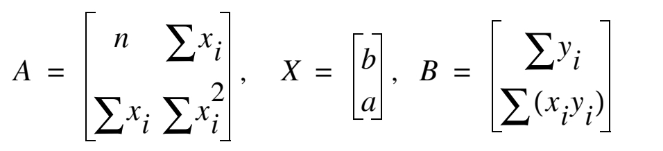
```

Dari mana operasi matriks tersebut berasal?

Perhatikan bahwa kita menginginkan $y$ dapat ditulis sebagai fungsi dari $x$.

$$y = f(x) = ax + b$$

Dengan memodifikasi 2 hal berikut ini:

1. Mengalikan $f(x)$ dengan $x$ mengakibatkan $yx = a x^2 + bx$ lalu menjumlahkan semua data yang ada $\sum_i y_i x_i = a \sum_i x_i^2 + b \sum_i x_i$.
1. Menjumlahkan $f(x)$ menjadi $\sum_i y = a \sum_i x_i + n b$, dengan $n$ adalah banyaknya data (panjang vektor $x$ atau $y$).

Akibatnya kita bisa menuliskannya dalam bentuk operasi matriks berikut ini:

$$\begin{bmatrix} n & \sum x_i \\ \sum x_i & \sum x_i^2 \end{bmatrix} \begin{bmatrix} b \\ a \end{bmatrix} = \begin{bmatrix} \sum y_i \\ \sum x_i y_i \end{bmatrix}$$

Karena kita telah memiliki data $X$ dan $Y$, artinya untuk mencari $(b,a)^T$ kita cukup melakukan operasi matriks sederhana:

$$A^{-1} b = x$$

Cukup cari invers matriks dan kalikan dengan vektor yang ada.

Pada contoh soal ini, kita bisa menghitung:

```{r}
n = length(x)
sum_xi = sum(x)
sum_xi_xi = sum(x^2)
sum_xi_yi = sum(x*y)
sum_yi = sum(y)

A = matrix(c(n,sum_xi,sum_xi,sum_xi_xi),nrow = 2,byrow = T)
A
A_inv = solve(A)
A_inv
b = c(sum_yi,sum_xi_yi)

A_inv %*% b
```

Terlihat bahwa hasilnya sama dengan _output_ `base` __R__.

### _Function_ di __R__ Dua Peubah

Oke, berbekal algoritma di atas, kita akan buat _function_-nya di __R__ dengan _input_ berupa dua _vectors_ sebagai berikut:

```{r}
tolong_dibantu_linear_fit = function(x,y){
  # hitung elemen-elemen yang dibutuhkan:
  n = length(x)
  sum_xi = sum(x)
  sum_xi_xi = sum(x^2)
  sum_xi_yi = sum(x*y)
  sum_yi = sum(y)
  # bikin persamaan reg linearnya
  A = matrix(c(n,sum_xi,sum_xi,sum_xi_xi),nrow = 2,byrow = T)
  A_inv = solve(A)
  b = c(sum_yi,sum_xi_yi)
  koef = A_inv %*% b
  koef_ = round(koef,3)
  a = koef_[2]
  b = koef_[1]
  # bikin persamaan
  temuan_1 = ifelse(b <= 0,
                    paste0("y = ",a,"x ",b),
                    paste0("y = ",a,"x + ",b))
  
  # hitung fungsi
  f_y = koef[2]*x + koef[1]
  error = mean(abs(y - f_y))
  
  # bikin grafik perbandingan
  plot = 
    data.frame(x,y,f_y) %>% 
    ggplot() +
    geom_point(aes(x,y),
               size = 1,
               color = "darkred") +
    geom_line(aes(x,f_y),
              color = "steelblue",
              alpha = .5) +
    theme_minimal() +
    labs(title = "Perbandingan Antara Titik Data dengan Hasil Curve Fitting",
         subtitle = "Linear Curve Fitting untuk Dua Peubah",
         caption = "Digambar dengan R\nikanx101.com")
  
  # tulis output
  output = list("Persamaan regresi linear" = temuan_1,
                "Mean Absolut Error" = error,
                "Grafik" = plot)
  return(output)
  }
```

Berikut adalah penggunaannya:

```{r,echo=TRUE,fig.retina=10,fig.align='center',fig.cap="Function Regresi Linear 2 Peubah"}
# contoh penggunaan
tolong_dibantu_linear_fit(x,y)
```

```{r,echo = FALSE}
rm(list=ls())
```

## Linear _Curve Fitting_ untuk Banyak Peubah

Lantas bagaimana caranya melakukan _linear curve fitting_ jika masalah yang kita hadapi memiliki banyak peubah? Untuk menjelaskannya saya akan berikan sebuah contoh sederhana:

Misalkan kita hendak membuat model sebagai berikut:

$$y = a_0 + a_1 x_1 + a_2 x_2 + a_3 x_3$$

dari data:

```{r}
data = mtcars[c(1,3,4,5)]
data = data %>% rename(y = mpg,x1 = disp,x2 = hp,x3 = drat)
row.names(data) = NULL
data
```


Jika kita selesaikan dengan _function_ `base` di __R__, kita bisa melakukannya dengan `lm()` yang sama dengan kasus linear dua peubah.

```{r}
model = lm(y ~ ., data = data)
summary(model)
```

Bagaimana caranya jika kita hendak mengerjakannya sendiri?

Misalkan kita memiliki $n$ buah data dan $m$ buah peubah.

$$X_{m \times n} \beta_{m \times 1} = Y_{m \times 1}$$

Maksudnya bagaimana?

Perhatikan:

$$X = \begin{bmatrix} 1 & x_1 & x_2 & x_3 \\ 1 & x_1 & x_2 & x_3 \\ 1 & x_1 & x_2 & x_3\\ .. \\ 1 & x_1 & x_2 & x_3 \end{bmatrix}$$

$$\beta = \begin{bmatrix} a_0 \\ a_1 \\ a_2 \\ a_3 \end{bmatrix}$$

Sudah _clear_ kan?

Banyaknya baris $X$ adalah sebanyak $n$ buah data.

Untuk mencari $\beta$ kita tinggal mencari inverse $X^{-1}$ lalu dikalikan dengan $Y$.

$$\beta = X^{-1} Y$$

Tapi karena $X$ bukanlah _square matrix_ kita perlu me-_rework_ menjadi berikut ini:

$$X^T X \beta = X^T Y$$

Perlu diperhatikan bahwa bentuk di atas disebut dengan __Normal Equations__.

Akibatnya:

$$\beta = (X^T X)^{-1} X^T Y$$

Maka untuk menyelesaikannya di __R__:

```{r}
# hitung semua elemen
X = 
  data %>% 
  mutate(x0 = 1) %>% 
  relocate(x0,.before = x1) %>% 
  select(contains("x")) %>% 
  as.matrix()
X_T = t(X)
Y = data %>% select("y") %>% as.matrix()

# solve
beta = solve(X_T %*% X) %*% X_T %*% Y
beta 
```

Bagaimana hasilnya? Sama kan dengan hasil dari `base` __R__?

### _Function_ di __R__ Banyak Peubah

Dari proses di atas, kita akan buat _function_ nya. _Input_-nya akan saya definisikan sebagai _data frame_ saja dengan nama-nama variabel adalah $Y,Xi$ dengan $i \in \{0,1,..,m\}$.

```{r}
tolong_dibantu_linear_fit_banyak = function(dataframe){
  # bikin variabel x0
  dataframe = 
    dataframe %>% 
    mutate(x0 = 1) %>% 
    relocate(x0,.before = x1)
  
  # hitung semua elemen
  X = 
    dataframe %>% 
    mutate(x0 = 1) %>% 
    relocate(x0,.before = x1) %>% 
    select(contains("x")) %>% 
    as.matrix()
  X_T = t(X)
  Y = dataframe %>% select("y") %>% as.matrix()
  
  # solve
  beta = solve(X_T %*% X) %*% X_T %*% Y
  beta = beta %>% as.numeric()
  m = ncol(X)
  a = paste0("a",0:(m-1))
  power_x = paste0("x^",0:(m-1))
  temp = data.frame(a,
                    koef = beta %>% round(3),
                    x = power_x)

  # output
  output = list("Persamaan linearnya: " = temp)
  return(output)
}
```

\newpage

Sekarang kita akan coba untuk contoh data sebelumnya:

```{r}
tolong_dibantu_linear_fit_banyak(data)
```


```{r,include=FALSE}
rm(list=ls())
```

## Polinomial _Curve Fitting_ Dua Peubah

Kita kembali ke contoh awal sebagai berikut:

```{r}
# ini data contoh
x = c(2,4,8,10,12,15,17.5,19)
y = c(99.5,104.8,108.5,100,86,64,35.3,15)
# Plotnya
plot(x,y,pch=19)
```

Selain _linear curve fitting_, kita bisa melakukan pendekatan polinom. Misal saya tuliskan sebagai berikut:

$$y = f(x) = c_0 + c_1 x + c_2 x^2 + .. + c_n x^n$$

Proses pengerjaannya mirip dengan kasus ___curve fitting___ __banyak peubah__. Perbedaannya adalah kita mau pakai berapa derajat polinomialnya? Karena itu akan mendefinisikan berapa banyak kolom matriks yang hendak dibuat.

Misalkan saya hendak membuat polinom order 5, dengan `base` __R__ kita cukup melakukan:

```{r}
banyak_order = 5

model = lm(y ~ poly(x,banyak_order))

summary(model)
```

```{r,echo=FALSE,fig.retina=10,fig.align='center',fig.cap="Evaluasi Polinom Base R"}
data.frame(x,y,f = model$fitted.values) %>% 
  ggplot() +
  geom_point(aes(x,y),
             color = "blue") +
  geom_point(aes(x,f),
             color = "red") +
  theme_minimal() +
  labs(title = "Hasil Regresi Polinom",
       subtitle = "Biru = Real values\nMerah = Fitted values")

```

Bagaimana jika kita hendak menyelesaikannya sendiri? Kita akan buat operasi matriksnya terlebih dahulu. Misalkan saya definisikan:

$$A = \begin{bmatrix} 1 & x & x^2 \\ 1 & x & x^2 \\ 1 & x & x^2 \\ .. \\ 1 & x & x^2 \end{bmatrix}$$

Dengan banyaknya baris adalah banyaknya data yang kita miliki.

Lalu saya definisikan $C$ sebagai vektor berikut:

$$C = \begin{bmatrix} c_0 \\ c_1 \\ c_2 \end{bmatrix}$$

Tapi karena $A$ belum tentu berupa _square matrix_ kita perlu me-_rework_ menjadi berikut ini:

$$C = (A^T A)^{-1} A^T Y$$

Berikut penyelesaiannya di __R__:

```{r}
# definisi matriks
A = matrix(ncol = banyak_order+1,
           nrow = length(x))

# untuk isi c0 hingga cn
for(i in 1:(banyak_order+1)){
  A[,i] = x^(i-1)
}

# hitung transpose A
A_T = t(A)

# solve
C = solve(A_T %*% A) %*% A_T %*% y
C 
```

Terlihat beda dengan hasil dari `base` __R__ tapi kita coba cek perbandingan grafisnya:


```{r,echo=FALSE,fig.retina=10,fig.align='center',fig.cap="Evaluasi Polinom Operasi Matriks"}
f_diy = C[1] + C[2] * x + C[3] * x^2 + C[4] * x^3 + C[5] * x^4 + C[6] * x^5

data.frame(x,y,f_diy) %>% 
  ggplot() +
  geom_point(aes(x,y),
             color = "blue") +
  geom_point(aes(x,f_diy),
             color = "red") +
  theme_minimal() +
  labs(title = "Hasil Regresi Polinom",
       subtitle = "Biru = Real values\nMerah = Fitted values")
```

Hasilnya juga sangat bagus _yah_.

### _Function_ di __R__ Polinomial

Oke, sekarang saatnya kita membuat _function_ di __R__. Kita akan buat _input_-nya berupa dua buah _vectors_ sama dengan regresi linear sebelumnya:

```{r}
tolong_dibantu_poli_fit = function(x,y,banyak_order){
  # definisi matriks
  A = matrix(ncol = banyak_order+1,
             nrow = length(x))

  # untuk isi c0 hingga cn
  for(i in 1:(banyak_order+1)){
    A[,i] = x^(i-1)
  }

  # hitung transpose A
  A_T = t(A)

  # solve
  C = solve(A_T %*% A) %*% A_T %*% y
  Values = as.numeric(C) %>% round(4)
  
  # output data
  hasil = data.frame(C = paste0("C",0:(banyak_order)),
                     Values)
  
  # bikin plot
  # dimulai dari vektor nol
  f = rep(0,nrow(hasil))
  # iterasi
  for(i in 1:(banyak_order + 1)){
    temp = x^(i-1) * C[i]
    f = f + temp
  }
  
  plot = 
    data.frame(x,y,f) %>% 
    ggplot() +
    geom_point(aes(x,y),color = "blue") +
    geom_point(aes(x,f), color = "red") +
    theme_minimal() +
    labs(title = "Hasil Regresi Polinom",
         subtitle = "Biru = Real values\nMerah = Fitted values")
  
  # menghitung MAE
  error = mean(abs(f - y))
  
  # membuat output
  output = list("Konstanta" = hasil,
                "MAE" = error,
                "Grafik" = plot)
  return(output)
}
```

Sekarang kita akan coba untuk kasus ini:

```{r,message=FALSE,warning=FALSE}
tolong_dibantu_poli_fit(x,y,5)
```


Sekarang kita akan coba untuk kasus lain:

```{r,message=FALSE,warning=FALSE}
x = c(0,1,2,3)
y = c(0,.5,2,1.5)
tolong_dibantu_poli_fit(x,y,2)
tolong_dibantu_poli_fit(x,y,3)
```

### Modifikasi Polinom Banyak Peubah

Kita bisa memodifikasi _function_ di atas untuk menyelesaikan permasalahan _curve fitting_ polinomial untuk banyak peubah dengan cara mengubah matriks yang berkaitan dengan order polinomnya.

\newpage

## _Cubic Spline Curve Fitting_

Definisi:

```{r out.width="70%",echo=FALSE,fig.align='center',fig.cap="Definisi Cubic Spline"}
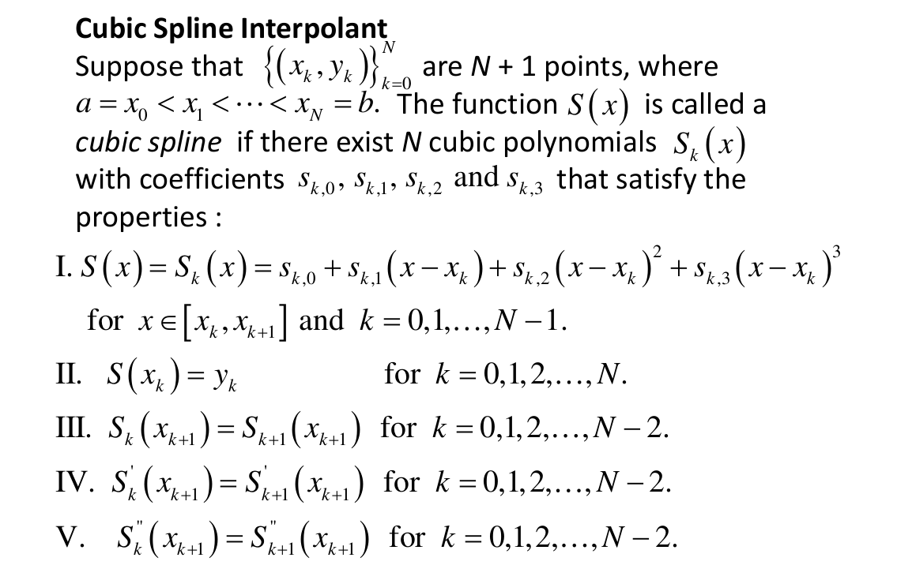
rm(list=ls())
```

Berikut adalah contohnya dengan `base` di __R__:

```{r}
X = c(0,1,2,3)
Y = c(0,0.5,2.0,1.5)
f_x = spline(X,Y)
```

\newpage

Ini adalah grafiknya:

```{r,echo=FALSE,fig.align='center',fig.cap="Hasil Spline Base R"}
d1 = data.frame(x = X, y = Y)
d2 = data.frame(x = f_x$x, y = f_x$y)
  
ggplot() +
  geom_point(data = d2,aes(x,y),color = "red") +
  geom_point(data = d1,aes(x,y),color = "blue") +
  theme_minimal() +
    labs(title = "Hasil Regresi Polinom",
         subtitle = "Biru = Real values\nMerah = Fitted values")
```


\newpage

### _Natural Cubic Spline_

Teorema:

```{r out.width="80%",fig.align='center',echo=FALSE,fig.cap="Teorema Natural Cubic Spline"}
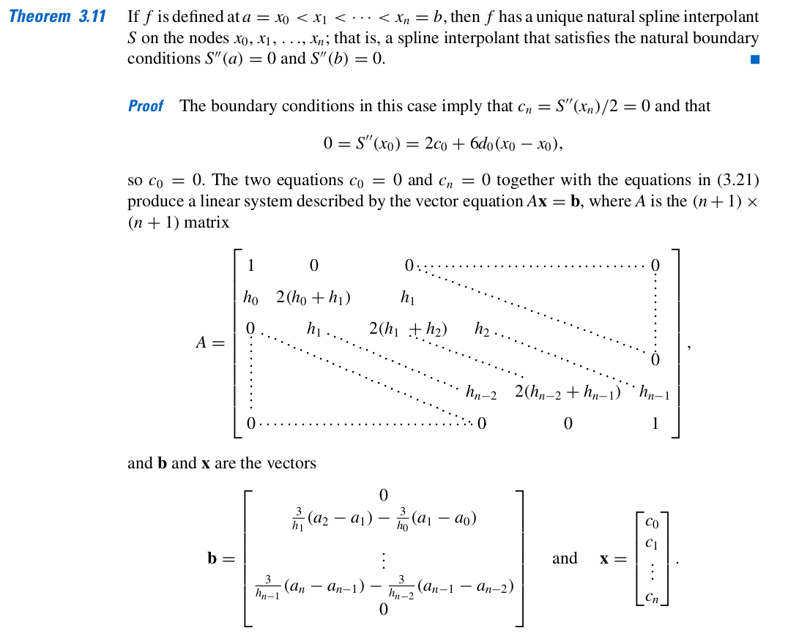
```

\newpage

#### Contoh Soal

_Use data points_ $(0,1),(1,e),(2,e^2),(3,e^3)$ _to form natural spline_ $S(x)$ _that approximate_ $f(x) = e^x$.

##### Jawab

Saya akan bentuk tabel data sebagai berikut:

```{r,echo=FALSE}
rm(list=ls())
options(digits = 5)
i = 0:3
x = 0:3
fx = c(1,exp(1),exp(2),exp(3))

data.frame(i,x,fx) %>% knitr::kable()
```

Dari sini kita dapatkan:

$$n = 3, a_0 = 1,a_1 = e,a_2 = e^2, a_3 = e^3$$

> Kenapa $n=3$?

Jawabannya ada di `algoritma 3.4`^[halaman 149].

$$h_0 = h_1 = h_2 = 1$$

```{r}
# banyak selang
n = length(x)-1

# notasi di buku
a = fx
a = setNames(a,c(0:n))
a

# hitung h (selang)
h = diff(x)
h = setNames(h,c(0:(n-1)))
h

# cari matriks A
A = matrix(0,
           nrow = n+1,
           ncol = n+1)
A[1,1] = 1
A[n+1,n+1] = 1

A[2,1] = h[1]
A[2,2] = 2*(h[1] + h[2])
A[2,3] = h[2]

A[3,2] = h[2]
A[3,3] = 2*(h[2] + h[3])
A[3,4] = h[3]

A

# hitung B
b = c()
b[1] = 0
b[n+1] = 0
b[2] = (3/h[2])*(a[3]-a[2]) - (3/h[1])*(a[2]-a[1])
b[3] = (3/h[3])*(a[4]-a[3]) - (3/h[2])*(a[3]-a[2])
b

# hitung C
c = solve(A) %*% b
c
```

Sisanya bisa dilihat di halaman tersebut.

\newpage

# SPECIAL CHAPTER {-}

# PEMBAHASAN SOAL TAHUN LALU 

Pada bagian ini kita akan membahas soal-soal dari tahun lalu.

## _Curve Fitting_

### Soal I

Diberikan data sebagai berikut:

```{r,echo=FALSE}
rm(list=ls())

x = c(-.05,-.025,0,.025,.05,.075,.1,.125,.15,.175)
fx = c(3.706,4.067,4.429,4.79,5.149,5.505,5.858,6.204,6.545,6.878)

data.frame(x,fx) %>% knitr::kable("simple")
```


Untuk membuat aproksimasi _least square_ kuadratik: $P_2(x) = a_0 + a_1 x + a_2 x^2$. Tuliskan persamaan normalnya!

#### Jawab {-}

Perhatikan bahwa persamaan normal bisa dibentuk dengan aturan sebagai berikut:

$$A^TAa = A^T y$$

Maka didapatkan:

```{r,echo=FALSE}
banyak_order = 2
y = fx

# definisi matriks
A = matrix(ncol = banyak_order+1,
           nrow = length(x))

# untuk isi c0 hingga cn
for(i in 1:(banyak_order+1)){
  A[,i] = x^(i-1)
}

# hitung transpose A
A_T = t(A)

A_T %*% A %>% round(3)
A_T %*% y
```

### Soal II

Diberikan data sebagai berikut:

```{r,echo=FALSE}
rm(list=ls())

x = c(-0.05,-0.025,0,0.025,0.05,0.075,.1,.125,.15,.175)
fx = c(-2.017,-2.072,-2.109,-2.127,-2.126,-2.106,-2.067,-2.009,-1.932,-1.836)

data.frame(x,fx) %>% knitr::kable("simple")
```

Konstruksi _natural cubic spline_ yang melewati `4` titik: $(0,-2.109),(0.025,-2.127)$, $(0.05,-2.126),(0.075,-2.106),(0.1,-2.067)$. Tuliskan persamaan normalnya!

#### Jawab {-}

Data yang hendak kita pakai adalah:

```{r,echo=FALSE}
rm(list=ls())
options(digits = 8)
x = c(0,0.025,0.05,0.075,0.1)
fx = c(-2.109,-2.127,-2.126,-2.106,-2.067)

data.frame(x,fx) %>% knitr::kable("simple")
```

```{r}
# banyak selang
n = length(x)-1

# notasi di buku
a = fx
a = setNames(a,c(0:n))
a

# hitung h (selang)
h = diff(x)
h = setNames(h,c(0:(n-1)))
h

# cari matriks A
A = matrix(0,
           nrow = n+1,
           ncol = n+1)
# baris 1 dan akhir
A[1,1] = 1
A[n+1,n+1] = 1

# baris 2
A[2,1] = h[1]
A[2,2] = 2*(h[1] + h[2])
A[2,3] = h[2]
# baris 3
A[3,2] = h[2]
A[3,3] = 2*(h[2] + h[3])
A[3,4] = h[3]
# baris 4
A[4,3] = h[3]
A[4,4] = 2*(h[3] + h[4])
A[4,5] = h[4]


A

# hitung B
b = c()
b[1] = 0
b[n+1] = 0
b[2] = (3/h[2])*(a[3]-a[2]) - (3/h[1])*(a[2]-a[1])
b[3] = (3/h[3])*(a[4]-a[3]) - (3/h[2])*(a[3]-a[2])
b[4] = (3/h[4])*(a[5]-a[4]) - (3/h[3])*(a[4]-a[3])
b

# hitung C
c = solve(A) %*% b
c
```

\newpage

## _Roots Finding_

### Soal I

Temukan akar persamaan berikut:

$$(x-1) \tan{x} + x \sin{\pi x} = 0, x \in [0,1]$$

Dengan keakuratan hingga $10^{-5}$ menggunakan metode _Bisection_ dan _Newton-Rhapson_.

#### Jawab {-}

Pertama-tama, kita akan gambarkan terlebih dahulu fungsinya di selang tersebut:

```{r,echo=FALSE,fig.retina = 10,fig.align = "center",fig.cap="Grafik Fungsi f(x)"}
rm(list=ls())
x = seq(0,1,by = 0.025)
f = function(x){(x-1)*tan(x) + x * sin(x*pi)}
y = f(x)

data.frame(x,y) %>%
  ggplot(aes(x,y)) +
  geom_line(color = "blue") +
  theme_minimal() +
  labs(title = "Fungsi f(x)",
       caption = "Digambar dengan R\n20921004@mahasiswa.itb.ac.id") +
  geom_hline(yintercept = 0,color = "black")

```

Terlihat dari gambar di atas bahwa akar persamaan terletak di antara $[0.25,0.5]$.

##### Metode Bisection {-}

Pemilihan selang ini menjadi hal terpenting bagi metode _bisection_ agar hasilnya konvergen.

Mari kita selesaikan:

```{r,message=FALSE,warning=FALSE}
# informasi awal
a = 0.25
b = 0.5
iter_max = 100
tol_max = 10^(-5)
i = 0

hasil = data.frame(n = NA,a = NA,b = NA,c = NA)

while(i <= iter_max && (b-a)/2 > tol_max){
  p = a + ((b-a)/2)
  FP = f(p)
  FA = f(a)
  FB = f(b)
  hasil[i+1,] = list(i,a,b,p)
  if(FA*FP < 0){b = p} else {a = p}
  i = i+1
}

hasil %>% knitr::kable()
```

Nilai `c` adalah akar persamaan yang kita cari.

##### Metode Newton Rhapson {-}

Pada metode ini, mencari turunan pertama dari $f(x)$ adalah sangat penting. Oleh karena itu, kita perlu melakukannya:

```{r,message = FALSE,warning = FALSE}
library(Ryacas)
eq = "(x-1)*Tan(x) + x * Sin(x*Pi)"
eq %>% y_fn("D(x)") %>% yac_str()
```

Kita telah mendapatkan $f'(x)$. Setelah itu, kita akan set titik iterasi awalnya $x_0 = 0.5$.

```{r}
# initial condition
df = function(x){(x-1)/cos(x)^2+tan(x)+x*pi*cos(x*pi)+sin(x*pi)}
x_0 = 0.5
p = 100 # nilai dummy
i = 1

hasil = data.frame(iter = 0,
		   p = x_0)

while(i <= iter_max){
  p = x_0 - (f(x_0) / df(x_0))
  hasil[i+1,] = list(i,p)
  if(abs(p-x_0) < tol_max){break}
  x_0 = p
  i = i + 1
}

hasil %>% knitr::kable()
```

Nilai `p` pada iterasi terakhir adalah akar yang kita cari.

\newpage

# LATIHAN SOAL DARI BUKU

## Exercise 2.1 Soal 6.a

Gunakan _bisection_ untuk mencari akar persamaan:

$$3x - e^x = 0, 0 \leq x \leq 1$$

### Jawab {-}

Kita buat terlebih dahulu grafiknya:

```{r,echo=FALSE,fig.retina = 10,fig.align = "center",fig.cap="Grafik Fungsi f(x)"}
rm(list=ls())
x = seq(0,1,by = 0.025)
f = function(x){3*x - exp(x)}
y = f(x)

data.frame(x,y) %>%
  ggplot(aes(x,y)) +
  geom_line(color = "blue") +
  theme_minimal() +
  labs(title = "Fungsi f(x)",
       caption = "Digambar dengan R\n20921004@mahasiswa.itb.ac.id") +
  geom_hline(yintercept = 0,color = "black")

```

Kita akan ambil selang $[0.5,0.75]$.

```{r,message=FALSE,warning=FALSE}
# informasi awal
a = 0.5
b = 0.75
iter_max = 100
tol_max = 10^(-5)
i = 0

hasil = data.frame(n = NA,a = NA,b = NA,c = NA)

while(i <= iter_max && (b-a)/2 > tol_max){
  p = a + ((b-a)/2)
  FP = f(p)
  FA = f(a)
  FB = f(b)
  hasil[i+1,] = list(i,a,b,p)
  if(FA*FP < 0){b = p} else {a = p}
  i = i+1
}

hasil %>% knitr::kable()
```

Nilai `c` adalah akar persamaan yang dimaksud.

\newpage

## Exercise 2.3 Soal 6.b

Temukan akar persamaan dari fungsi berikut:

$$\ln(x-1) + \cos(x-1) = 0,1.3 \leq x \leq 2$$

### Jawab {-}

Kita akan buat grafiknya sebagai berikut:

```{r,echo=FALSE,fig.retina = 10,fig.align = "center",fig.cap="Grafik Fungsi f(x)"}
rm(list=ls())
x = seq(1.3,2,by = 0.025)
f = function(x){log(x-1) + cos(x-1)}
y = f(x)

data.frame(x,y) %>%
  ggplot(aes(x,y)) +
  geom_line(color = "blue") +
  theme_minimal() +
  labs(title = "Fungsi f(x)",
       caption = "Digambar dengan R\n20921004@mahasiswa.itb.ac.id") +
  geom_hline(yintercept = 0,color = "black")

```

Untuk menyelesaikan dengan metode Newton, kita perlu mencari $f'(x)$.

```{r,message=FALSE,warning=FALSE}
library(Ryacas)
eq = "Ln(x-1) + Cos(x-1)"
eq %>% y_fn("D(x)") %>% yac_str() 
```

Kita telah mendapatkan $f'(x)$. Setelah itu, kita akan set titik iterasi awalnya $x_0 = 1.5$.

```{r}
# initial condition
df = function(x){1/(x-1)-sin(x-1)}
x_0 = 1.5
p = 100 # nilai dummy
i = 1
iter_max = 20
tol_max = 10^(-6)

hasil = data.frame(iter = 0,
		   p = x_0)

while(i <= iter_max){
  p = x_0 - (f(x_0) / df(x_0))
  hasil[i+1,] = list(i,p)
  if(abs(p-x_0) < tol_max){break}
  x_0 = p
  i = i + 1
}

hasil %>% knitr::kable()
```

\newpage

## Exercise 2.3 Soal 17

Temukan akar persamaan dari fungsi berikut:

$$230 x^4 + 18 x^3 + 9 x^2 - 221 x - 9 = 0, x \in [-1,0]$$

### Jawab {-}

Kita akan buat grafiknya sebagai berikut:

```{r,echo=FALSE,fig.retina = 10,fig.align = "center",fig.cap="Grafik Fungsi f(x)"}
rm(list=ls())
x = seq(-1,0,by = 0.025)
f = function(x){230 * x^4 + 18 * x^3 + 9 * x^2 - 221 * x - 9}
y = f(x)

data.frame(x,y) %>%
  ggplot(aes(x,y)) +
  geom_line(color = "blue") +
  theme_minimal() +
  labs(title = "Fungsi f(x)",
       caption = "Digambar dengan R\n20921004@mahasiswa.itb.ac.id") +
  geom_hline(yintercept = 0,color = "black")

```

Untuk menyelesaikan dengan metode Newton, kita perlu mencari $f'(x)$.

```{r,message=FALSE,warning=FALSE}
library(Ryacas)
eq = "230 * x^4 + 18 * x^3 + 9 * x^2 - 221 * x - 9"
eq %>% y_fn("D(x)") %>% yac_str() 
```

Kita telah mendapatkan $f'(x)$. Setelah itu, kita akan set titik iterasi awalnya $x_0 = -0.5$.

```{r}
# initial condition
df = function(x){920*x^3+54*x^2+18*x-221}
x_0 = -.5
p = 100 # nilai dummy
i = 1
iter_max = 20
tol_max = 10^(-6)

hasil = data.frame(iter = 0,
		   p = x_0)

while(i <= iter_max){
  p = x_0 - (f(x_0) / df(x_0))
  hasil[i+1,] = list(i,p)
  if(abs(p-x_0) < tol_max){break}
  x_0 = p
  i = i + 1
}

hasil %>% knitr::kable()
```

\newpage

## Exercise 3.1 Soal 1.a

Buat _curve fitting_ linear dan polinom orde 2 untuk mendekati fungsi $f(x) = \cos(x)$ untuk $x_0 = 0, x_1 = 0.6, x_2 = 0.9$. Hitung nilai _absolute error_!

### Jawab {-}

Mari kita buat terlebih dahulu titik-titik datanya:

```{r,echo=FALSE,warning=FALSE,message=FALSE}
rm(list=ls())

tolong_dibantu_linear_fit = function(x,y){
  # hitung elemen-elemen yang dibutuhkan:
  n = length(x)
  sum_xi = sum(x)
  sum_xi_xi = sum(x^2)
  sum_xi_yi = sum(x*y)
  sum_yi = sum(y)
  # bikin persamaan reg linearnya
  A = matrix(c(n,sum_xi,sum_xi,sum_xi_xi),nrow = 2,byrow = T)
  A_inv = solve(A)
  b = c(sum_yi,sum_xi_yi)
  koef = A_inv %*% b
  koef_ = round(koef,3)
  a = koef_[2]
  b = koef_[1]
  # bikin persamaan
  temuan_1 = ifelse(b <= 0,
                    paste0("y = ",a,"x ",b),
                    paste0("y = ",a,"x + ",b))
  
  # hitung fungsi
  f_y = koef[2]*x + koef[1]
  error = mean(abs(y - f_y))
  
  # bikin grafik perbandingan
  plot = 
    data.frame(x,y,f_y) %>% 
    ggplot() +
    geom_point(aes(x,y),
               size = 1,
               color = "darkred") +
    geom_line(aes(x,f_y),
              color = "steelblue",
              alpha = .5) +
    theme_minimal() +
    labs(title = "Perbandingan Antara Titik Data dengan Hasil Curve Fitting",
         subtitle = "Linear Curve Fitting untuk Dua Peubah",
         caption = "Digambar dengan R\nikanx101.com")
  
  # tulis output
  output = list("Persamaan regresi linear" = temuan_1,
                "Mean Absolut Error" = error,
                "Grafik" = plot)
  return(output)
}

tolong_dibantu_poli_fit = function(x,y,banyak_order){
  # definisi matriks
  A = matrix(ncol = banyak_order+1,
             nrow = length(x))

  # untuk isi c0 hingga cn
  for(i in 1:(banyak_order+1)){
    A[,i] = x^(i-1)
  }

  # hitung transpose A
  A_T = t(A)

  # solve
  C = solve(A_T %*% A) %*% A_T %*% y
  Values = as.numeric(C) %>% round(4)
  
  # output data
  hasil = data.frame(C = paste0("C",0:(banyak_order)),
                     Values)
  
  # bikin plot
  # dimulai dari vektor nol
  f = rep(0,nrow(hasil))
  # iterasi
  for(i in 1:(banyak_order + 1)){
    temp = x^(i-1) * C[i]
    f = f + temp
  }
  
  plot = 
    data.frame(x,y,f) %>% 
    ggplot() +
    geom_point(aes(x,y),color = "blue") +
    geom_point(aes(x,f), color = "red") +
    theme_minimal() +
    labs(title = "Hasil Regresi Polinom",
         subtitle = "Biru = Real values\nMerah = Fitted values")
  
  # menghitung MAE
  error = mean(abs(f - y))
  
  # membuat output
  output = list("Konstanta" = hasil,
                "MAE" = error,
                "Grafik" = plot)
  return(output)
}

# dari soal
x = c(0,0.6,0.9)
f = function(x)(cos(x))
y = f(x)

data.frame(x,y) %>% knitr::kable()
```

#### _Linear Curve Fitting_ {-}

Untuk melakukan _linear curve fitting_ kita hitung terlebih dahulu:

$$\begin{bmatrix} n & \sum x_i \\ \sum x_i & \sum x_i^2 \end{bmatrix} \begin{bmatrix} b \\ a \end{bmatrix} = \begin{bmatrix} \sum y_i \\ \sum x_i y_i \end{bmatrix}$$

Karena kita telah memiliki data $X$ dan $Y$, artinya untuk mencari $(b,a)^T$ kita cukup melakukan operasi matriks sederhana:

$$A^{-1} b = x$$

Cukup cari invers matriks dan kalikan dengan vektor yang ada.

Pada contoh soal ini, kita bisa menghitung:

```{r}
tolong_dibantu_linear_fit(x,y)
```

\newpage

#### Polinomial _Curve Fitting_ {-}

Kita akan buat polinom orde 2:

```{r}
tolong_dibantu_poli_fit(x,y,2)
```

\newpage

## Sistem Persamaan Linear

### Contoh Soal dari Materi Dosen

Misalkan diketahui SPL sebagai berikut:

$$4x - y + z = 7$$

$$4x - 8y + z = -21$$

$$-2x + y + 5z = 15$$

Temukan solusinya!

#### Jawab {-}

Soal ini sudah saya jawab pada bagian `5.4.1` namun kali ini kita akan lakukan dengan cara yang berbeda.

Suatu SPL sebenarnya bisa ditulis sebagai bentuk matriks $Ax = b$ dimana solusinya bisa dengan mudah didapatkan dengan $b = A^{-1}x$.

```{r,echo=FALSE}
rm(list=ls())
A = matrix(c(4,-1,1,
             4,-8,1,
             -2,1,5),
           byrow = T,
           ncol = 3)
b = c(7,-21,15)
A
b
```

Kita bisa tuliskan $Ax = b$ menjadi $Mx = (M-A)x + b \rightarrow x = (I-M^{-1}A)x + M^{-1}b$.

Matriks $(I-M^{-1}A)$ akan dinotasikan sebagai $B$. Kekonvergenan $B$ akan diperoleh:

1. Syarat perlu: __jika dan hanya jika__ $\rho (B) < 1$.
1. Syarat cukup: $||B|| < 1$.

##### Metode Jacobi {-}

Definisi matriks $B$ adalah $B = -D^{-1}(L+U)$. Bagaimana cara membuat $B$ ?

```{r}
da = diag(A)
D = diag(da)
D
D_inv = solve(D)
D_inv
C = A - D
C
B = -D_inv %*% C
B
```

##### _Natural Norm_ {-}

Kita hitung natural norm dari $A$ sebagai berikut:

```{r,echo=FALSE}
n_1 = norm(B,"1")
n_infinity = norm(B,"I")
```

$||B||_{\infty} =$ `r n_infinity` dan $||B||_{1} =$ `r n_1`.

##### Jari-Jari Spektral {-}

Kita hitung jari-jari spektral:

```{r,echo=FALSE}
rho = function(matriks){
ei = eigen(matriks)
ei = max(abs(ei$values))
return(ei)
}
rho(B)
```

\newpage

\center 

# END {-}
