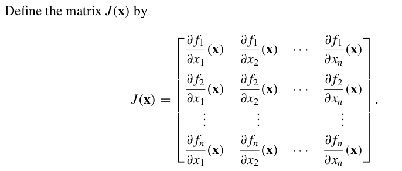
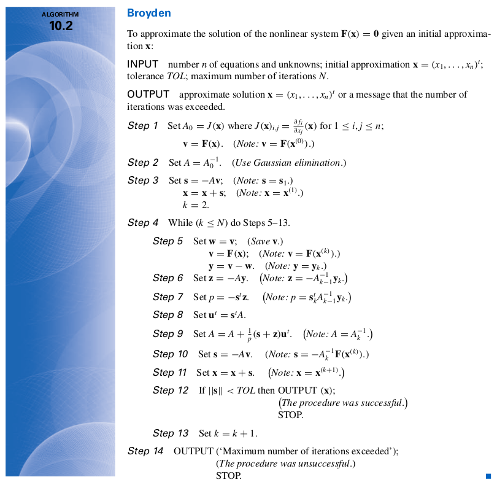

```{r setup, include=FALSE}
knitr::opts_chunk$set(echo = TRUE)

setwd("~/S2 Sains Komputasi ITB/Kuliah/Semester I/Analisis Numerik Lanjut/Tugas Kuliah")

library(dplyr)
library(ggplot2)
library(Ryacas)
options(scipen = 999)
rm(list=ls())
caption = "Digambar dengan R\n20921004@mahasiswa.itb.ac.id"
```

\newpage
\tableofcontents
\newpage
\listoffigures
\newpage


# PENDAHULUAN

## Penulisan Tugas

Di dalam tugas ini disertakan juga _source code_ dan grafik yang diperlukan untuk menjawab soal yang ada.

## Bahasa Pemrograman yang Dipakai

Bahasa pemrograman yang digunakan pada tugas ini adalah __R__ dengan versi __R__ yang digunakan adalah `4.1.1`. Format tugas ini ditulis menggunakan _LaTex_ __R Markdown__ di _software_ __R Studio__. Semua perhitungan numerik (metode Newton dan Broyden) diselesaikan dengan menulis _program_ berdasarkan buku __Numerical Analysis__^[Richard L. Burden dan J. Douglas Faires] dan materi _handout_ perkuliahan yang ada^[Prof. Kuntjoro Adji Sidarto]. Sedangkan untuk menggambar grafik dibuat program tersendiri.

## _Libraries_ __R__ yang Digunakan

Berikut adalah beberapa _libraries_ yang digunakan dalam mengerjakan dan menuliskan tugas ini:

1. `dplyr`: untuk _data carpentry_.
1. `ggplot2`: sebagai visualisasi data (grafik).
1. `matlib`: sebagai dasar perhitungan aljabar (invers matriks).
1. `Ryacas`: digunakan untuk mencari turunan parsial dari fungsi $f(x_1,x_2)$ atau $f(x_1,x_2,x_3)$.

\newpage

# METODE

## Program Menggambar Grafik

### 2 Peubah (Soal 3a dan 3b)

Oleh karena fungsi yang ada pada soal tidak bisa dituliskan secara eksplist menjadi hubungan $y \sim x$, maka grafik dari soal  digambar dengan pendekatan sebagai berikut:

- __STEP 1__ Tentukan selang di sumbu $x$ dan $y$, misalkan $x,y \in [a,b]$. Lalu _generate_ sebanyak-banyaknya titik di $[a,b]$ dengan $\Delta$ yang __kecil__ (kita akan definisikan deltanya). Semua titik yang di-_generate_ dinotasikan sebagai $(x',y')$.
- __STEP 2__ dari semua titik $(x',y')$ tersebut, kita akan hitung nilai hampiran fungsinya $f(x,y)$.
- __STEP 3__ kita hanya akan menggambar $(x',y')$ yang memenuhi $f(x,y) = 0$.

Berikut adalah program yang saya buat di __R__:

```{r,warning=FALSE,message=FALSE}
data_ke_grafik = function(a,b,delta,f){
  # generate selang
  selang = seq(a,b,by = delta)
  # menghitung (x,y) yang memenuhi f(x,y) = 0
  df = 
    # mengeluarkan semua kombinasi yang mungkin dari selang
    expand.grid(selang,selang) %>% 
    as.data.frame() %>% 
    # mengubah nama variabel menjadi x,y
    rename(x = Var1,
           y = Var2) %>%  
    # menghitung nilai f(x,y)
    mutate(f = f(x,y)) %>%
    # hanya mengambil (x,y) yang memenuhi f(x,y) = 0
    filter(round(f,1) == 0) 
  # output berupa data frame yang siap diplot
  return(df)
}
```

Program tersebut berfungsi untuk men-_generate_ titik. Grafik digambar dengan perintah tambahan `ggplot2` di masing-masing soal.

\newpage

### 3 Peubah (Soal 4a dan 4b)

Berbeda dengan soal 3 yang hanya memiliki 2 peubah pada fungsinya. Soal 4 memiliki 3 peubah pada fungsinya. Untuk menggambar grafiknya, saya akan menggunakan pendekatan 2 dimensi saja. Yakni melakukan plot antara $(x_1, x_2+x_3)$. Selain itu, pada soal 4, selang $x_1,x_2,x_3$ sudah ditetapkan.

Oleh karena itu, program di __R__-nya harus dimodifikasi dari bagian `2.1.1` sebagai berikut:

```{r,warning=FALSE,message=FALSE}
data_ke_grafik3d = function(x1_lower,x1_upper, # selang x1
                            x2_lower,x2_upper, # selang x2
                            x3_lower,x3_upper, # selang x3
                            delta,f){
  # generate selang
  selang_x1 = seq(x1_lower,x2_upper,by = delta)
  selang_x2 = seq(x2_lower,x2_upper,by = delta)
  selang_x3 = seq(x3_lower,x3_upper,by = delta)
  
  # menghitung (x1,x2,x3) yang memenuhi f(x1,x2,x3) = 0
  df = 
    # mengeluarkan semua kombinasi yang mungkin dari selang
    expand.grid(selang_x1,selang_x2,selang_x3) %>% 
    as.data.frame() %>% 
    # mengubah nama variabel menjadi x,y
    rename(x1 = Var1,
           x2 = Var2,
           x3 = Var3) %>%  
    # menghitung nilai f(x1,x2,x3)
    mutate(f = f(x1,x2,x3)) %>%
    # hanya mengambil (x1,x2,x3) yang memenuhi f(x1,x2,x3) = 0
    filter(round(f,2) == 0) %>% 
    mutate(x2_x3 = x2 + x3)
  # output berupa data frame yang siap diplot
  return(df)
}
```

Kemudian grafik akan dibuat dengan perintah di `ggplot2`.

\newpage

## Program Metode Newton untuk SPNL

Misalkan suatu sistem persamaan non linear memiliki bentuk sebagai berikut:

$$\begin{matrix}
f_1(x_1,x_2,..,x_n,K) = 0 \\ 
f_2(x_1,x_2,..,x_n,K) = 0 \\
... \\
f_n(x_1,x_2,..,x_n,K) = 0
\end{matrix}$$

dengan $f_i, i=1,2,..,n$ merupakan persamaan non linear.

Penyelesaian dengan metode Newton menggunakan prinsip deret Taylor. Skema iterasi^[Persamaan 10.9 dari buku Numerical Analysis 9th Edition hal. 640] yang akan saya gunakan adalah sebagai berikut:

$$x^{(k+1)} = x^{(k)} - J(x^{(k)})^{-1} F(x^{(k)})$$ 

Dengan $J$ merupakan matriks Jacobi yang didefinisikan sebagai:

```{r out.width="70%",echo=FALSE,fig.align='center',fig.cap="Definisi Matriks Jacobi"}

```

Kelak program yang ditulis akan memanfaatkan skema iterasi tersebut. Oleh karena __R__ bisa melakukan operasi matriks, saya akan memanfaatkan operasi tersebut dalam membuat programnya.

> Langkah yang kritis pada metode ini adalah penentuan titik _initial_ iterasi. Sebisa mungkin kita akan pilih titik _initial_ yang dekat dengan solusi berdasarkan grafik yang ada.

Selain itu, kita perlu pertimbangkan juga persamaan yang ada di matriks Jacobi-nya. Jangan sampai ada pembagian dengan `nol` akibat kita salah memilih titik _initial_.

Metode ini akan dipakai untuk menyelesaikan soal 3a dan 3b.

\newpage
## Program Metode Broyden untuk SPNL

Metode Broyden merupakan metode modifikasi dari metode Newton. Perbedaan mendasar dari metode ini adalah kita menggunakan hampiran matriks Jacobi. Berikut adalah algoritma 10.2 dari buku:

```{r out.width="90%",echo=FALSE,fig.align='center',fig.cap="Definisi Matriks Jacobi"}

```

> Langkah yang kritis pada metode ini adalah penentuan titik _initial_ iterasi. Sebisa mungkin kita akan pilih titik _initial_ yang dekat dengan solusi berdasarkan grafik yang ada.

Metode ini akan dipakai untuk menyelesaikan soal 4a dan 4b.

\newpage

## Norm $\infty$

Secara _default_, __R__ memiliki _function_ khusus untuk menghitung __norm__, yakni dengan perintah `norm()`. Namun perlu diperhatikan bahwa input dari `norm()` adalah berupa matriks. Sedangkan norm yang akan saya gunakan sebagai kriteria penghentian iterasi adalah norm vektor dari $x^{(k)}$.

Berikut adalah __R__ _function_ untuk menghitung norm vektor:

```{r}
# menghitung norm infinity dari vektor v
norm_vec_inf = function(x)max(abs(x))
```

## Mencari Turunan Parsial Fungsi

Untuk mencari turunan parsial dari suatu fungsi peubah banyak, saya menggunakan bantuan `library(Ryacas)`.

\newpage

# _TASK_ 3a

## Soal {-}

Cari aproksimasi solusi dari sistem persamaan non linear berikut:

$$4x_1^2 - 20x_1 + \frac{1}{4} x_2^2 + 8 = 0$$

$$\frac{1}{2}x_1 x_2^2 + 2x_1 - 5x_2 + 8 = 0$$

## Jawab {-}

### Grafik Sistem Persamaan Non Linear {-}

Untuk membantu kita menjawab soal tersebut, pertama-tama kita perlu membuat grafik fungsi dari SPNL tersebut:

```{r,message=FALSE,warning=FALSE,fig.retina=10,fig.align='center',fig.cap="Grafik Soal 3a"}
# initial condition yang dibutuhkan untuk menggambar
a = -10
b = 10
delta = 0.005
# fungsi dari soal
f1 = function(x1,x2){4 * x1^2 - 20* x1 + (1/4) * x2^2 + 8}
f2 = function(x1,x2){(1/2) * x1 * x2^2 + 2 * x1 - 5 * x2 + 8}
# proses generator data ke grafik
# menggunakan program yang dibuat di bagian 2.1.1
df1 = data_ke_grafik(a,b,delta,f1)
df2 = data_ke_grafik(a,b,delta,f2)

# proses menggambar plot
# membuat canvas
plot_soal_3a =
  ggplot() +
  # memplot f1
  geom_point(data = df1,
             aes(x,y),
             size = .1,
             color = "steelblue") +
  # memplot f2
  geom_point(data = df2,
             aes(x,y),
             size = .1,
             color = "darkred") +
  # menampilkan label
  labs(subtitle = "Grafik f1(x1,x2) dan f2(x1,x2)",
       title = "Soal 3a",
       caption = caption)

# menampilkan grafik
plot_soal_3a
```

Jika kita lihat grafik di atas, ada dua titik solusi yang akan kita cari. Oleh karena kita akan gunakan metode Newton, maka diperlukan dua sembarang _initial points_. Diharapkan iterasi dari dua _initial points_ tersebut akan konvergen ke dua titik solusi yang dicari.

\newpage

### Penyelesaian dengan Metode Newton {-}

Kita akan mengambil dua titik _initial_ berikut: $(0,0)$ dan $(2,10)$ secara sembarang. __Perlu diperhatikan bahwa perbedaan initial points yang diambil akan mempengaruhi seberapa banyak iterasi yang diperlukan menuju konvergen ke titik solusi__. 

Berikut adalah grafiknya:

```{r,echo=FALSE,message=FALSE,warning=FALSE,fig.retina=10,fig.align='center',fig.cap="Initial Points Soal 3a"}
# menampilkan grafik
plot_soal_3a +
  geom_point(aes(x = 0,
                 y = 0),
             color = "darkgreen",
             size = 2) +
  geom_point(aes(x = 2,
                 y = 10),
             color = "darkgreen",
             size = 2)
```

Titik hijau adalah _initial points_ yang kita pilih.

Untuk menyelesaikan dengan metode Newton, kita perlu mencari persamaan di matriks Jacobi terlebih dahulu. Untuk membantu kita mencari turunan parsial dari kedua fungsi soal, kita akan gunakan `library(Ryacas)` di __R__ berikut:


```{r}
# f1
f1 = "4*x1^2 - 20*x1 + (1/4)*x2^2 + 8"
# turunan parsial f1 thd x1
f1 %>% y_fn("D(x1)") %>% yac_str()
# turunan parsial f1 thd x2
f1 %>% y_fn("D(x2)") %>% yac_str()
# f2
f2 = "(1/2) * x1 * x2^2 + 2 * x1 - 5 * x2 + 8"
# turunan parsial f2 thd x1
f2 %>% y_fn("D(x1)") %>% yac_str()
# turunan parsial f2 thd x2
f2 %>% y_fn("D(x2)") %>% yac_str()
```

Berikut adalah matriks Jacobi yang sudah kita dapatkan:

$$J(x) = \begin{bmatrix}
8x_1-20 & \frac{x_2}{2} \\
\frac{x_2^2}{2}+2 & x_2 x_1-5 \\
\end{bmatrix}$$

Sekarang kita tinggal melakukan iterasi dengan skema berikut:

$$x^{(k+1)} = x^{(k)} - J(x^{(k)})^{-1} F(x^{(k)})$$ 

#### Titik Pertama {-}

Mari kita coba selesaikan titik pertama terlebih dahulu. 

```{r}
# initial
x0 = c(0,0)

# bikin fungsi F(x1,x2)
F_x_k = function(x){
  f1 = 4 * x[1]^2 - 20* x[1] + (1/4) * x[2]^2 + 8
  f2 = (1/2) * x[1] * x[2]^2 + 2 * x[1] - 5 * x[2] + 8
  xk = c(f1,f2)
  return(xk)
}

# bikin matriks jacobi
jax = function(x){
  a11 = 8*x[1]-20
  a12 = x[2]/2
  a21 = x[2]^2/2+2
  a22 = x[2]*x[1]-5
  J = matrix(c(a11,a12,a21,a22),ncol = 2,byrow = T)
  J_inv = matlib::inv(J)
  return(J_inv)
}

# set toleransi max yang diinginkan
tol_max = 0.000001

# set max iterasi yang diperbolehkan
iter_max = 40

# kita mulai iterasinya
iter = 0
while(norm_vec_inf(F_x_k(x0)) > tol_max && iter <= iter_max){
  xk_new = x0 - jax(x0) %*% F_x_k(x0)
  x0 = xk_new
  iter = iter + 1
  pesan = paste0("Iterasi ke-",iter,
                 " menghasilkan: x1 = ",x0[1],
                 " dan x2 = ",x0[2])
  print(pesan)
}

list("Solusi Final: " = x0,
     "Banyak iterasi: " = iter)

```

Didapatkan pada iterasi ke `4`, kita mendapatkan solusi finalnya, yakni titik `(0.5,2)`.

\newpage

Saya gambarkan kembali ke grafik fungsinya sebagai berikut:

```{r,echo=TRUE,message=FALSE,warning=FALSE,fig.retina=10,fig.align='center',fig.cap="Solusi Pertama dari Soal 3a"}
# menampilkan grafik
plot_soal_3a +
  geom_point(aes(x = 0,
                 y = 0),
             color = "darkgreen",
             size = 2) +
  geom_point(aes(x = 0.5,
                 y = 2.0),
             color = "orange",
             size = 3) 
```

Titik __hijau__ adalah _initial point_ sedangkan titik __oranye__ adalah solusinya.

\newpage

#### Titik Kedua {-}

Mari kita selesaikan titik berikutnya. 

```{r}
# initial
x0 = c(2,10)

# kita mulai iterasinya
iter = 0
while(norm_vec_inf(F_x_k(x0)) > tol_max && iter <= iter_max){
  xk_new = x0 - jax(x0) %*% F_x_k(x0)
  x0 = xk_new
  iter = iter + 1
  pesan = paste0("Iterasi ke-",iter,
                 " menghasilkan: x1 = ",x0[1],
                 " dan x2 = ",x0[2])
  print(pesan)
}

list("Solusi Final: " = x0,
     "Banyak iterasi: " = iter)

```

Didapatkan pada iterasi ke `6`, kita mendapatkan solusi finalnya, yakni titik `(1.096720,6.040933)`.

\newpage

Saya gambarkan kembali ke grafik fungsinya sebagai berikut:

```{r,echo=TRUE,message=FALSE,warning=FALSE,fig.retina=10,fig.align='center',fig.cap="Solusi Kedua dari Soal 3a"}
# menampilkan grafik
plot_soal_3a +
  geom_point(aes(x = 2,
                 y = 10),
             color = "darkgreen",
             size = 2) +
  geom_point(aes(x = 1.096720,
                 y = 6.040933),
             color = "orange",
             size = 3) 
```

Titik __hijau__ adalah _initial point_ sedangkan titik __oranye__ adalah solusinya.

\newpage

## Kesimpulan {-}

Kita dapatkan ada dua solusi dari SPNL ini, yakni:

1. `(0.5,2)`
1. `(1.096720,6.040933)`

Berikut adalah grafiknya:

```{r,echo=FALSE,message=FALSE,warning=FALSE,fig.retina=10,fig.align='center',fig.cap="Solusi Pertama dan Kedua dari Soal 3a"}
# menampilkan grafik
plot_soal_3a +
  geom_point(aes(x = 0.5,
                 y = 2.0),
             color = "orange",
             size = 3) +
  geom_point(aes(x = 1.096720,
                 y = 6.040933),
             color = "orange",
             size = 3) +
  annotate("label",
           x = 0.5, y = -0.5,
           label = "Solusi I\n(0.5,2)") +
  annotate("label",
           x = 1.1, y = 9,
           label = "Solusi II\n(1.096720,6.040934)")
```

---

\newpage

# _TASK_ 3b

## Soal {-}

Cari aproksimasi solusi dari sistem persamaan non linear berikut:

$$\sin{(4\pi x_1 x_2)} - 2 x_2 - x_1 = 0$$

$$(\frac{4 \pi - 1}{4 \pi}) (e^{2x_1} - e) + 4 e x_2^2 - 2 e x_1 = 0$$

## Jawab {-}

### Grafik Sistem Persamaan Non Linear {-}

Untuk membantu kita menjawab soal tersebut, pertama-tama kita perlu membuat grafik fungsi dari SPNL tersebut:

```{r,message=FALSE,warning=FALSE,fig.retina=10,fig.align='center',fig.cap="Grafik Soal 3b"}
# initial condition yang dibutuhkan untuk menggambar
a = -2
b = 2
delta = 0.001
# fungsi dari soal
f1 = function(x1,x2){sin(4*pi*x1*x2) - 2*x2 - x1}
f2 = function(x1,x2){((4*pi - 1)/(4*pi))*(exp(2*x1) - exp(1)) + 4*exp(1)*x2^2 - 2*exp(1)*x1}
# proses generator data ke grafik
# menggunakan program yang dibuat di bagian 2.1.1
df1 = data_ke_grafik(a,b,delta,f1)
df2 = data_ke_grafik(a,b,delta,f2)

# proses menggambar plot
# membuat canvas
plot_soal_3b =
  ggplot() +
  # memplot f1
  geom_point(data = df1,
             aes(x,y),
             size = .1,
             color = "green") +
  # memplot f2
  geom_point(data = df2,
             aes(x,y),
             size = .1,
             color = "lightblue") +
  # menampilkan label
  labs(subtitle = "Grafik f1(x1,x2) dan f2(x1,x2)",
       title = "Soal 3b",
       caption = caption)

# menampilkan grafik
plot_soal_3b
```

Terlihat ada `4` solusi titik dari grafik di atas.

### Penyelesaian dengan Metode Newton {-}

Sama halnya dengan soal sebelumnya, kita perlu mengambil empat titik _initial_ sembarang. Kita akan pilih titik-titik berikut:

1. `(-1,0)`
1. `(0,-0.5)`
1. `(0.5,-0.5)`
1. `(1.5,0.5)`

Berikut adalah grafiknya:

```{r,echo=FALSE,message=FALSE,warning=FALSE,fig.retina=10,fig.align='center',fig.cap="Initial Points Soal 3b"}
# menampilkan grafik
plot_soal_3b +
  geom_point(aes(x = -1,
                 y = 0),
             color = "red",
             size = 2) +
  geom_point(aes(x = 0,
                 y = -0.5),
             color = "red",
             size = 2) +
  geom_point(aes(x = 0.5,
                 y = -0.5),
             color = "red",
             size = 2) +
  geom_point(aes(x = 1.5,
                 y = 0.5),
             color = "red",
             size = 2)
```

Titik merah adalah _initial points_ yang kita pilih.

Untuk menyelesaikan dengan metode Newton, kita perlu mencari persamaan di matriks Jacobi terlebih dahulu. Untuk membantu kita mencari turunan parsial dari kedua fungsi soal, kita akan gunakan `library(Ryacas)` di __R__ berikut:

```{r}
# f1
f1 = "Sin(4*pi*x1*x2) - 2*x2 - x1"
# turunan parsial f1 thd x1
f1 %>% y_fn("D(x1)") %>% yac_str()
# turunan parsial f1 thd x2
f1 %>% y_fn("D(x2)") %>% yac_str()
# f2
f2 = "((4*pi - 1)/(4*pi))*(Exp(2*x1) - Exp(1)) + 4*Exp(1)*x2^2 - 2*Exp(1)*x1"
# turunan parsial f2 thd x1
f2 %>% y_fn("D(x1)") %>% yac_str()
# turunan parsial f2 thd x2
f2 %>% y_fn("D(x2)") %>% yac_str()
```

Berikut adalah matriks Jacobi yang sudah kita dapatkan:

$$J(x) = \begin{bmatrix}
4 \pi x_2 \cos(4 \pi x_1 x_2)-1 & 4 \pi x_1 \cos(4 \pi x_1 x_2)-2 \\
\frac{ e^{(2 x_1)} (4 \pi-1)}{2 \pi}-2e & 4 e 2 x_2 \\
\end{bmatrix}$$

Sekarang kita tinggal melakukan iterasi dengan skema berikut:

$$x^{(k+1)} = x^{(k)} - J(x^{(k)})^{-1} F(x^{(k)})$$ 


#### Titik Pertama {-}

Mari kita coba selesaikan titik pertama terlebih dahulu. 

```{r}
# initial
x0 = c(-1,0)

# bikin fungsi F(x1,x2)
F_x_k = function(x){
  f1 = sin(4*pi*x[1]*x[2]) - 2*x[2] - x[1]
  f2 = ((4*pi - 1)/(4*pi))*(exp(2*x[1]) - exp(1)) + 4*exp(1)*x[2]^2 - 2*exp(1)*x[1]
  xk = c(f1,f2)
  return(xk)
}

# bikin matriks jacobi
jax = function(x){
  a11 = 4*pi*x[2]*cos(4*pi*x[1]*x[2])-1
  a12 = 4*pi*x[1]*cos(4*pi*x[1]*x[2])-2
  a21 = (exp(2*x[1])*(4*pi-1))/(2*pi)-2*exp(1)
  a22 = 4*exp(1)*2*x[2]
  J = matrix(c(a11,a12,a21,a22),ncol = 2,byrow = T)
  J_inv = matlib::inv(J)
  return(J_inv)
}

# set toleransi max yang diinginkan
tol_max = 0.000005

# set max iterasi yang diperbolehkan
iter_max = 20

# kita mulai iterasinya
iter = 0
while(norm_vec_inf(F_x_k(x0)) > tol_max && iter <= iter_max){
  xk_new = x0 - jax(x0) %*% F_x_k(x0)
  x0 = xk_new
  iter = iter + 1
  pesan = paste0("Iterasi ke-",iter,
                 " menghasilkan: x1 = ",x0[1],
                 " dan x2 = ",x0[2])
  print(pesan)
}

list("Solusi Final: " = x0,
     "Banyak iterasi: " = iter)

```

Didapatkan pada iterasi `4` solusi yang didapatkan adalah `(-0.37369822, 0.05626649)`. Berikut jika saya gambarkan dalam grafik:

\newpage

```{r,echo=FALSE,message=FALSE,warning=FALSE,fig.retina=10,fig.align='center',fig.cap="Solusi Pertama Soal 3b"}
# menampilkan grafik
plot_soal_3b +
  geom_point(aes(x = -1,
                 y = 0),
             color = "red",
             size = 2) +
  geom_point(aes(x = -0.37369822,
                 y = 0.05626649),
             color = "black",
             size = 2) 
```

Titik __merah__ adalah _initial point_ sedangkan titik __hitam__ adalah solusi yang didapatkan.

#### Titik Kedua {-}

Mari kita coba selesaikan titik kedua. 

```{r}
# initial
x0 = c(0,-0.5)

# kita mulai iterasinya
iter = 0
while(norm_vec_inf(F_x_k(x0)) > tol_max && iter <= iter_max){
  xk_new = x0 - jax(x0) %*% F_x_k(x0)
  x0 = xk_new
  iter = iter + 1
  pesan = paste0("Iterasi ke-",iter,
                 " menghasilkan: x1 = ",x0[1],
                 " dan x2 = ",x0[2])
  print(pesan)
}

list("Solusi Final: " = x0,
     "Banyak iterasi: " = iter)

```

Didapatkan pada iterasi `4` solusi yang didapatkan adalah `(0.1478392, -0.4361776)`. Berikut jika saya gambarkan dalam grafik:

```{r,echo=FALSE,message=FALSE,warning=FALSE,fig.retina=10,fig.align='center',fig.cap="Solusi Kedua Soal 3b"}
# menampilkan grafik
plot_soal_3b +
  geom_point(aes(x = 0,
                 y = -0.5),
             color = "red",
             size = 2) +
  geom_point(aes(x = 0.1478392,
                 y = -0.4361776),
             color = "black",
             size = 2) 
```

Titik __merah__ adalah _initial point_ sedangkan titik __hitam__ adalah solusi yang didapatkan.

\newpage

#### Titik Ketiga {-}

Mari kita coba selesaikan titik ketiga. 

```{r}
# initial
x0 = c(0.5,-0.5)

# kita mulai iterasinya
iter = 0
while(norm_vec_inf(F_x_k(x0)) > tol_max && iter <= iter_max){
  xk_new = x0 - jax(x0) %*% F_x_k(x0)
  x0 = xk_new
  iter = iter + 1
  pesan = paste0("Iterasi ke-",iter,
                 " menghasilkan: x1 = ",x0[1],
                 " dan x2 = ",x0[2])
  print(pesan)
}

list("Solusi Final: " = x0,
     "Banyak iterasi: " = iter)

```

Didapatkan pada iterasi `3` solusi yang didapatkan adalah `(0.4080957, -0.4926294)`. Berikut jika saya gambarkan dalam grafik:

```{r,echo=FALSE,message=FALSE,warning=FALSE,fig.retina=10,fig.align='center',fig.cap="Solusi Ketiga Soal 3b"}
# menampilkan grafik
plot_soal_3b +
  geom_point(aes(x = 0.5,
                 y = -0.5),
             color = "red",
             size = 2) +
  geom_point(aes(x = 0.4080957,
                 y = -0.4926294),
             color = "black",
             size = 2) 
```

\newpage

#### Titik Keempat {-}

Mari kita coba selesaikan titik keempat. 

```{r}
# initial
x0 = c(1.5,0.5)

# kita mulai iterasinya
iter = 0
while(norm_vec_inf(F_x_k(x0)) > tol_max && iter <= iter_max){
  xk_new = x0 - jax(x0) %*% F_x_k(x0)
  x0 = xk_new
  iter = iter + 1
  pesan = paste0("Iterasi ke-",iter,
                 " menghasilkan: x1 = ",x0[1],
                 " dan x2 = ",x0[2])
  print(pesan)
}

list("Solusi Final: " = x0,
     "Banyak iterasi: " = iter)

```

Didapatkan pada iterasi `11` solusi yang didapatkan adalah `(1.0330715, -0.2799618)`. Berikut jika saya gambarkan dalam grafik:

```{r out.width="80%",echo=FALSE,message=FALSE,warning=FALSE,fig.retina=10,fig.align='center',fig.cap="Solusi Keempat Soal 3b"}
# menampilkan grafik
plot_soal_3b +
  geom_point(aes(x = 1.5,
                 y = 0.5),
             color = "red",
             size = 2) +
  geom_point(aes(x = 1.0330715,
                 y = -0.2799618),
             color = "black",
             size = 2) 
```

\newpage

## Kesimpulan {-}

Kita dapatkan `4` titik solusi SPNL berikut:

1. `(-0.37369822, 0.05626649)`
1. `(0.1478392, -0.4361776)`
1. `(0.4080957, -0.4926294)`
1.  `(1.0330715, -0.2799618)`

Dalam bentuk grafik:

```{r,echo=FALSE,message=FALSE,warning=FALSE,fig.retina=10,fig.align='center',fig.cap="Semua Titik Solusi dari Soal 3b"}
# menampilkan grafik
plot_soal_3b +
  geom_point(aes(x = -0.37369822,
                 y = 0.05626649),
             color = "black",
             size = 2) +
  geom_point(aes(x = 0.1478392,
                 y = -0.4361776),
             color = "black",
             size = 2) +
  geom_point(aes(x = 0.4080957,
                 y = -0.4926294),
             color = "black",
             size = 2) +
  geom_point(aes(x = 1.0330715,
                 y = -0.2799618),
             color = "black",
             size = 2) 
```

---

\newpage

# _TASK_ 4a

## Soal {-}

Aproksimasi solusi dari SPNL berikut ini:

$$3 x_1 - \cos{(x_2 x_3)} - \frac{1}{2} = 0$$

$$4 x_1^2 - 625 x_2^2 + 2 x_2 - 1 = 0$$

$$e^{-x_1 x_2} + 20 x_3 + \frac{10 \pi -3}{3} = 0$$

$$-1 \leq x_1 \leq 1, -1 \leq x_2 \leq 1, -1 \leq x_3 \leq 1$$

## Jawab {-}

### Grafik Sistem Persamaan Non Linear {-}

Untuk membantu kita menjawab soal tersebut, pertama-tama kita perlu membuat grafik fungsi dari SPNL tersebut. Namun karena ada tiga peubah yang terlibat $(x_1,x_2,x_3)$, saya akan buat penyederhanaan dengan membuat grafik sumbu $x_1$ dan sumbu $x_2+x_3$.

Berikut adalah grafiknya:

```{r,message=FALSE,warning=FALSE,fig.retina=10,fig.align='center',fig.cap="Grafik Soal 4a"}
# initial condition yang dibutuhkan untuk menggambar
# selang x1
x1_lower = -1; x1_upper = 1
# selang x2
x2_lower = -1; x2_upper = 1
# selang x3
x3_lower = -1; x3_upper = 1
delta = 0.005

# fungsi dari soal
f1 = function(x1,x2,x3){3 * x1 - cos(x2 * x3) - (1/2)}
f2 = function(x1,x2,x3){4 * x1^2 - 625 * x2^2 + 2 * x2 - 1}
f3 = function(x1,x2,x3){exp(-x1 * x2) + 20 * x3 + (10 * pi - 3)/(3)}

# proses generator data ke grafik
# menggunakan program yang dibuat di bagian 2.1.2
df1 = data_ke_grafik3d(x1_lower,x1_upper,x2_lower,x2_upper,x3_lower,x3_upper,delta,f1)
df2 = data_ke_grafik3d(x1_lower,x1_upper,x2_lower,x2_upper,x3_lower,x3_upper,delta,f2)
df3 = data_ke_grafik3d(x1_lower,x1_upper,x2_lower,x2_upper,x3_lower,x3_upper,delta,f3)

# proses menggambar plot
# membuat canvas
plot_soal_4a =
  ggplot() +
  # memplot f1
  geom_point(data = df1,aes(x1,x2_x3),size = .1,
             color = "steelblue") +
  # memplot f2
  geom_point(data = df2,aes(x1,x2_x3),size = .1,
             color = "darkgreen") +
  # memplot f3
  geom_point(data = df3,aes(x1,x2_x3),size = .1,
             color = "darkred") +
  labs(title = "Grafik Soal 4a",
       subtitle = "f1(x1,x2,x3), f2(x1,x2,x3), dan f3(x1,x2,x3)",
       x = "x1",
       y = "x2 + x3")

# menampilkan grafik
plot_soal_4a
```

\newpage

Dari grafik di atas, kita tidak bisa __menebak__ _initial points_ sebagai bahan iterasi metode Broyden. Kita hanya bisa melihat bahwa titik solusi berada pada selang $x_1 > 0$.

Oleh karena itu, saya akan membuat beberapa titik _random_ untuk menerka di mana saja solusi SPNL tersebut berada.

### Penyelesaian dengan Metode Broyden {-}

Metode Broyden tetap menggunakan matriks Jacobi sebagai langkah iterasinya. Oleh karena itu, kita akan bentuk matriks Jacobinya. Pertama-tama akan saya lakukan turunan parsial sebagai berikut:

```{r}
# f1
f1 = "3 * x1 - Cos(x2 * x3) - (1/2)"
# turunan parsial f1 thd x1
f1 %>% y_fn("D(x1)") %>% yac_str()
# turunan parsial f1 thd x2
f1 %>% y_fn("D(x2)") %>% yac_str()
# turunan parsial f1 thd x3
f1 %>% y_fn("D(x3)") %>% yac_str()

# f2
f2 = "4 * x1^2 - 625 * x2^2 + 2 * x2 - 1"
# turunan parsial f2 thd x1
f2 %>% y_fn("D(x1)") %>% yac_str()
# turunan parsial f2 thd x2
f2 %>% y_fn("D(x2)") %>% yac_str()
# turunan parsial f2 thd x3
f2 %>% y_fn("D(x3)") %>% yac_str()

# f3
f3 = "Exp(-x1 * x2) + 20 * x3 + (10 * pi - 3)/(3)"
# turunan parsial f3 thd x1
f3 %>% y_fn("D(x1)") %>% yac_str()
# turunan parsial f3 thd x2
f3 %>% y_fn("D(x2)") %>% yac_str()
# turunan parsial f3 thd x3
f3 %>% y_fn("D(x3)") %>% yac_str()
```

Berikut adalah matriks Jacobi yang sudah kita dapatkan:

$$J(x) = \begin{bmatrix}
3 & x_3 \sin(x_2 x_3) & x_2 \sin(x_2 x_3)\\
8 x_1 & 2-1250 x_2 & 0 \\
-x_2 e^{-x_1 x_2} & -x_1 e^{-x_1 x_2} & 20
\end{bmatrix}$$

Sekarang kita akan buat program iterasi metode Broyden berdasarkan __algoritma 10.2__.

#### Percobaan Titik _Random_ Pertama {-}

Sebagai percobaan, saya akan coba dekati dengan _initial point_ $(0,1,1)$. Berikut adalah programnya:

```{r}
# initial
x0 = c(0,1,1)

# bikin fungsi F(x1,x2,x3)
F_x_k = function(x){
  f1 = 3 * x[1] - cos(x[2] * x[3]) - (1/2)
  f2 = 4 * x[1]^2 - 625 * x[2]^2 + 2 * x[2] - 1
  f3 = exp(-x[1] * x[2]) + 20 * x[3] + (10 * pi - 3)/(3)
  xk = c(f1,f2,f3)
  return(xk)
}

# set toleransi max yang diinginkan
tol_max = 0.00001

# set max iterasi yang diperbolehkan
iter_max = 30

# kita mulai metode Broyden-nya sesuai dengan algoritma 10.2
# step 1
v = F_x_k(x0)

# step 2
# bikin matriks jacobi
jax = function(x){
  a11 = 3
  a12 = x[3]*sin(x[2]*x[3])
  a13 = x[2]*sin(x[2]*x[3])
  a21 = 8*x[1]
  a22 = 2-1250*x[2]
  a23 = 0
  a31 = -x[2]*exp(-x[1]*x[2])
  a32 = -x[1]*exp(-x[1]*x[2])
  a33 = 20
  J = matrix(c(a11,a12,a13,a21,a22,a23,a31,a32,a33),ncol = 3,byrow = T)
  J_inv = matlib::inv(J)
  return(J_inv)
}
A = jax(x0)

# step 3
s = -A %*% v
x = x0 + s
iter = 2

# step 4  
while(norm_vec_inf(F_x_k(x)) > tol_max && iter <= iter_max){
  # step 5
  w = v
  v = F_x_k(x)
  y = v - w
  # step 6
  z = -A %*% y
  # step 7
  p = t(-s) %*% z
  p = as.numeric(p)
  # step 8
  ut = t(s) %*% A
  # step 9
  A = A + ((s+z)/p) %*% ut
  # step 10
  s = -A %*% v
  # step 11
  x = x + s
  iter = iter + 1
  # output
  pesan = paste(x,collapse = ",")
  pesan = paste0("Iterasi ke- ",iter,": (",pesan,")")
  print(pesan)
}

list("Solusi Final: " = x,
     "Banyak iterasi: " = iter)

```

Ternyata didapatkan pada iterasi ke `18` solusinya adalah `(0.499999532,0.003199951,-0.523518841)`.

Sebelum saya membuat grafiknya kembali, saya akan coba untuk beberapa _initial points_ lainnya, seperti:

\newpage

#### Percobaan Titik _Random_ Kedua {-}

Sebagai percobaan kedua, saya akan coba dekati dengan _initial point_ $(0,0.5,0.5)$. Berikut adalah hasil dari programnya:

```{r,echo=FALSE}
# initial
x0 = c(0,.5,.5)

# kita mulai metode Broyden-nya sesuai dengan algoritma 10.2
# step 1
v = F_x_k(x0)

# step 2
A = jax(x0)

# step 3
s = -A %*% v
x = x0 + s
iter = 2

# step 4  
while(norm_vec_inf(F_x_k(x)) > tol_max && iter <= iter_max){
  # step 5
  w = v
  v = F_x_k(x)
  y = v - w
  # step 6
  z = -A %*% y
  # step 7
  p = t(-s) %*% z
  p = as.numeric(p)
  # step 8
  ut = t(s) %*% A
  # step 9
  A = A + ((s+z)/p) %*% ut
  # step 10
  s = -A %*% v
  # step 11
  x = x + s
  iter = iter + 1
  # output
  pesan = paste(x,collapse = ",")
  pesan = paste0("Iterasi ke- ",iter,": (",pesan,")")
  print(pesan)
}

list("Solusi Final: " = x,
     "Banyak iterasi: " = iter)

```

Ternyata masih didapatkan __solusi yang sama dengan percobaan pertama__.

\newpage

#### Percobaan Titik _Random_ Ketiga {-}

Sebagai percobaan ketiga, saya akan coba dekati dengan _initial point_ $(0,-1,-1)$. Berikut adalah hasil dari programnya:

```{r,echo=FALSE}
# initial
x0 = c(0,-1,-1)

# kita mulai metode Broyden-nya sesuai dengan algoritma 10.2
# step 1
v = F_x_k(x0)

# step 2
A = jax(x0)

# step 3
s = -A %*% v
x = x0 + s
iter = 2

# step 4  
while(norm_vec_inf(F_x_k(x)) > tol_max && iter <= iter_max){
  # step 5
  w = v
  v = F_x_k(x)
  y = v - w
  # step 6
  z = -A %*% y
  # step 7
  p = t(-s) %*% z
  p = as.numeric(p)
  # step 8
  ut = t(s) %*% A
  # step 9
  A = A + ((s+z)/p) %*% ut
  # step 10
  s = -A %*% v
  # step 11
  x = x + s
  iter = iter + 1
  # output
  pesan = paste(x,collapse = ",")
  pesan = paste0("Iterasi ke- ",iter,": (",pesan,")")
  print(pesan)
}

list("Solusi Final: " = x,
     "Banyak iterasi: " = iter)

```

Ternyata masih didapatkan __solusi yang sama dengan percobaan pertama__.

\newpage

#### Percobaan Titik _Random_ Keempat {-}

Sebagai percobaan keempat, saya akan coba dekati dengan _initial point_ $(0,0,0)$. Berikut adalah hasil dari programnya:

```{r,echo=FALSE}
# initial
x0 = c(0,0,0)

# kita mulai metode Broyden-nya sesuai dengan algoritma 10.2
# step 1
v = F_x_k(x0)

# step 2
A = jax(x0)

# step 3
s = -A %*% v
x = x0 + s
iter = 2

# step 4  
while(norm_vec_inf(F_x_k(x)) > tol_max && iter <= iter_max){
  # step 5
  w = v
  v = F_x_k(x)
  y = v - w
  # step 6
  z = -A %*% y
  # step 7
  p = t(-s) %*% z
  p = as.numeric(p)
  # step 8
  ut = t(s) %*% A
  # step 9
  A = A + ((s+z)/p) %*% ut
  # step 10
  s = -A %*% v
  # step 11
  x = x + s
  iter = iter + 1
  # output
  pesan = paste(x,collapse = ",")
  pesan = paste0("Iterasi ke- ",iter,": (",pesan,")")
  print(pesan)
}

list("Solusi Final: " = x,
     "Banyak iterasi: " = iter)

```

Ternyata masih didapatkan __solusi yang sama dengan percobaan pertama__.

\newpage

#### Percobaan Titik _Random_ Kelima {-}

```{r,include=FALSE}
x0 = c(runif(1,-1,1),runif(1,-1,1),runif(1,-1,1))
```

Sebagai percobaan kelima, saya akan coba dekati dengan _initial point_ `r paste0("(",paste(round(x0,2),collapse = ","),")")`. Berikut adalah hasil dari programnya:

```{r,echo=FALSE}
# kita mulai metode Broyden-nya sesuai dengan algoritma 10.2
# step 1
v = F_x_k(x0)

# step 2
A = jax(x0)

# step 3
s = -A %*% v
x = x0 + s
iter = 2

# step 4  
while(norm_vec_inf(F_x_k(x)) > tol_max && iter <= iter_max){
  # step 5
  w = v
  v = F_x_k(x)
  y = v - w
  # step 6
  z = -A %*% y
  # step 7
  p = t(-s) %*% z
  p = as.numeric(p)
  # step 8
  ut = t(s) %*% A
  # step 9
  A = A + ((s+z)/p) %*% ut
  # step 10
  s = -A %*% v
  # step 11
  x = x + s
  iter = iter + 1
  # output
  pesan = paste(x,collapse = ",")
  pesan = paste0("Iterasi ke- ",iter,": (",pesan,")")
  print(pesan)
}

list("Solusi Final: " = x,
     "Banyak iterasi: " = iter)

```

Ternyata masih didapatkan __solusi yang sama dengan percobaan pertama__.

## Kesimpulan {-}

Hanya ada satu solusi dari SPNL tersebut, yakni: `(0.5, 0, -0.5)`.

\newpage

# _TASK_ 4b

## Soal {-}

Aproksimasi solusi dari SPNL berikut ini:

$$x_1^2 + x_2 - 37 = 0$$

$$x_1 - x_2^2 - 5 = 0$$

$$x_1 + x_2 + x_3 - 3 = 0$$

$$-4 \leq x_1 \leq 8$$

$$-2 \leq x_2 \leq 2$$

$$-6 \leq x_3 \leq 0$$

## Jawab {-}

### Grafik Sistem Persamaan Non Linear {-}

Sama dengan soal sebelumnya, kita akan menggunakan pendekatan grafik sumbu $x_1$ dan sumbu $x_2 + x_3$. Berikut adalah grafiknya:

```{r,message=FALSE,warning=FALSE,fig.retina=10,fig.align='center',fig.cap="Grafik Soal 4b"}
# initial condition yang dibutuhkan untuk menggambar
# selang x1
x1_lower = -4; x1_upper = 8
# selang x2
x2_lower = -2; x2_upper = 2
# selang x3
x3_lower = -6; x3_upper = 0
delta = 0.01

# fungsi dari soal
f1 = function(x1,x2,x3){x1^2 + x2 - 37}
f2 = function(x1,x2,x3){x1 - x2^2 - 5}
f3 = function(x1,x2,x3){x1 + x2 + x3 - 3}

# proses generator data ke grafik
# menggunakan program yang dibuat di bagian 2.1.2
df1 = data_ke_grafik(x1_lower,x1_upper,delta,f1)
df2 = data_ke_grafik(x1_lower,x1_upper,delta,f2)
df3 = data_ke_grafik3d(x1_lower,x1_upper,x2_lower,x2_upper,x3_lower,x3_upper,delta,f3)

# proses menggambar plot
# membuat canvas
plot_soal_4b =
  ggplot() +
  # memplot f1
  geom_point(data = df1,aes(x,y),size = .1,
             color = "steelblue") +
  # memplot f2
  geom_point(data = df2,aes(x,y),size = .1,
             color = "darkgreen") +
  # memplot f3
  geom_point(data = df3,aes(x1,x2_x3),size = .1,
             color = "darkred") +
  labs(title = "Grafik Soal 4b",
       subtitle = "f1(x1,x2,x3), f2(x1,x2,x3), dan f3(x1,x2,x3)",
       x = "x1",
       y = "x2 + x3")

# menampilkan grafik
plot_soal_4b
```

\newpage

Ternyata grafik di atas tidak konklusif. Oleh karena itu, kita akan lakukan metode Broyden dengan beberapa titik yang di-_random_ di sekitar domain $x_1,x_2,x_3$.

### Penyelesaian dengan Metode Broyden

Penentuan matriks Jacobi dilakukan sama dengan soal-soal sebelumnya, yakni:

```{r}
# f1
f1 = "x1^2 + x2 - 37"
# turunan parsial f1 thd x1
f1 %>% y_fn("D(x1)") %>% yac_str()
# turunan parsial f1 thd x2
f1 %>% y_fn("D(x2)") %>% yac_str()
# turunan parsial f1 thd x3
f1 %>% y_fn("D(x3)") %>% yac_str()

# f2
f2 = "x1 - x2^2 - 5"
# turunan parsial f2 thd x1
f2 %>% y_fn("D(x1)") %>% yac_str()
# turunan parsial f2 thd x2
f2 %>% y_fn("D(x2)") %>% yac_str()
# turunan parsial f2 thd x3
f2 %>% y_fn("D(x3)") %>% yac_str()

# f3
f3 = "x1 + x2 + x3 - 3"
# turunan parsial f3 thd x1
f3 %>% y_fn("D(x1)") %>% yac_str()
# turunan parsial f3 thd x2
f3 %>% y_fn("D(x2)") %>% yac_str()
# turunan parsial f3 thd x3
f3 %>% y_fn("D(x3)") %>% yac_str()
```

Berikut adalah matriks Jacobi yang sudah kita dapatkan:

$$J(x) = \begin{bmatrix}
2 x_1 & 1 & 0\\
1 & -2x_2 & 0 \\
1 & 1 & 1
\end{bmatrix}$$

Sekarang kita akan buat program iterasi metode Broyden berdasarkan __algoritma 10.2__.

\newpage

#### Percobaan Titik _Random_ Pertama {-}

```{r,include=FALSE}
x0 = c(runif(1,3,8),
       runif(1,-2,2),
       runif(1,-6,0)) %>% round(1)
```

Sebagai percobaan, saya akan coba dekati dengan _initial point_ `r paste0("(",paste(x0,collapse = ","),")")`. Berikut adalah programnya:

```{r}
# bikin fungsi F(x1,x2,x3)
F_x_k = function(x){
  f1 = x[1]^2 + x[2] - 37
  f2 = x[1] - x[2]^2 - 5 
  f3 = x[1] + x[2] + x[3] - 3
  xk = c(f1,f2,f3)
  return(xk)
}

# set toleransi max yang diinginkan
tol_max = 0.00001

# set max iterasi yang diperbolehkan
iter_max = 70

# kita mulai metode Broyden-nya sesuai dengan algoritma 10.2
# step 1
v = F_x_k(x0)

# step 2
# bikin matriks jacobi
jax = function(x){
  a11 = 2*x[1]
  a12 = 1
  a13 = 0
  a21 = 1
  a22 = -2*x[2]
  a23 = 0
  a31 = 1
  a32 = 1
  a33 = 1
  J = matrix(c(a11,a12,a13,a21,a22,a23,a31,a32,a33),ncol = 3,byrow = T)
  J_inv = matlib::inv(J)
  return(J_inv)
}
A = jax(x0)

# step 3
s = -A %*% v
x = x0 + s
iter = 2

# step 4  
while(norm_vec_inf(F_x_k(x)) > tol_max && iter <= iter_max){
  # step 5
  w = v
  v = F_x_k(x)
  y = v - w
  # step 6
  z = -A %*% y
  # step 7
  p = t(-s) %*% z
  p = as.numeric(p)
  # step 8
  ut = t(s) %*% A
  # step 9
  A = A + ((s+z)/p) %*% ut
  # step 10
  s = -A %*% v
  # step 11
  x = x + s
  iter = iter + 1
  # output
  pesan = paste(x,collapse = ",")
  pesan = paste0("Iterasi ke- ",iter,": (",pesan,")")
  print(pesan)
}

if(iter <= iter_max){
  list("Titik initial: " = x0,
       "Solusi Final: " = x,
     "Banyak iterasi: " = iter)
} else if(iter > iter_max){
  list("Titik initial: " = x0,
       "Solusi Final: " = "Tidak Konvergen atau melebihi batas iterasi")
}


```

\newpage

#### Percobaan Titik _Random_ Kedua {-}

Kita bisa mengulang prosedur di atas dengan cara men-generate _random number_ di domain $x_1,x_2,x_3$ sebagai berikut:

```{r,echo=FALSE}
x0 = c(runif(1,3,8),
       runif(1,-2,2),
       runif(1,-6,0)) %>% round(1)

# kita mulai metode Broyden-nya sesuai dengan algoritma 10.2
# step 1
v = F_x_k(x0)

# step 2
A = jax(x0)

# step 3
s = -A %*% v
x = x0 + s
iter = 2

# step 4  
while(norm_vec_inf(F_x_k(x)) > tol_max && iter <= iter_max){
  # step 5
  w = v
  v = F_x_k(x)
  y = v - w
  # step 6
  z = -A %*% y
  # step 7
  p = t(-s) %*% z
  p = as.numeric(p)
  # step 8
  ut = t(s) %*% A
  # step 9
  A = A + ((s+z)/p) %*% ut
  # step 10
  s = -A %*% v
  # step 11
  x = x + s
  iter = iter + 1
  }

if(iter <= iter_max){
  list("Titik initial: " = x0,
       "Solusi Final: " = x,
     "Banyak iterasi: " = iter)
} else if(iter > iter_max){
  list("Titik initial: " = x0,
       "Solusi Final: " = "Tidak Konvergen atau melebihi batas iterasi")
}


```

#### Percobaan Titik _Random_ Ketiga {-}

```{r,echo=FALSE}
x0 = c(runif(1,3,8),
       runif(1,-2,2),
       runif(1,-6,0)) %>% round(1)

# kita mulai metode Broyden-nya sesuai dengan algoritma 10.2
# step 1
v = F_x_k(x0)

# step 2
A = jax(x0)

# step 3
s = -A %*% v
x = x0 + s
iter = 2

# step 4  
while(norm_vec_inf(F_x_k(x)) > tol_max && iter <= iter_max){
  # step 5
  w = v
  v = F_x_k(x)
  y = v - w
  # step 6
  z = -A %*% y
  # step 7
  p = t(-s) %*% z
  p = as.numeric(p)
  # step 8
  ut = t(s) %*% A
  # step 9
  A = A + ((s+z)/p) %*% ut
  # step 10
  s = -A %*% v
  # step 11
  x = x + s
  iter = iter + 1
  }

if(iter <= iter_max){
  list("Titik initial: " = x0,
       "Solusi Final: " = x,
     "Banyak iterasi: " = iter)
} else if(iter > iter_max){
  list("Titik initial: " = x0,
       "Solusi Final: " = "Tidak Konvergen atau melebihi batas iterasi")
}


```

#### Percobaan Titik _Random_ Keempat {-}

```{r,echo=FALSE}
x0 = c(runif(1,3,8),
       runif(1,-2,2),
       runif(1,-6,0)) %>% round(1)

# kita mulai metode Broyden-nya sesuai dengan algoritma 10.2
# step 1
v = F_x_k(x0)

# step 2
A = jax(x0)

# step 3
s = -A %*% v
x = x0 + s
iter = 2

# step 4  
while(norm_vec_inf(F_x_k(x)) > tol_max && iter <= iter_max){
  # step 5
  w = v
  v = F_x_k(x)
  y = v - w
  # step 6
  z = -A %*% y
  # step 7
  p = t(-s) %*% z
  p = as.numeric(p)
  # step 8
  ut = t(s) %*% A
  # step 9
  A = A + ((s+z)/p) %*% ut
  # step 10
  s = -A %*% v
  # step 11
  x = x + s
  iter = iter + 1
  }

if(iter <= iter_max){
  list("Titik initial: " = x0,
       "Solusi Final: " = x,
     "Banyak iterasi: " = iter)
} else if(iter > iter_max){
  list("Titik initial: " = x0,
       "Solusi Final: " = "Tidak Konvergen atau melebihi batas iterasi")
}


```

#### Percobaan Titik _Random_ Kelima {-}

```{r,echo=FALSE}
x0 = c(runif(1,3,8),
       runif(1,-2,2),
       runif(1,-6,0)) %>% round(1)

# kita mulai metode Broyden-nya sesuai dengan algoritma 10.2
# step 1
v = F_x_k(x0)

# step 2
A = jax(x0)

# step 3
s = -A %*% v
x = x0 + s
iter = 2

# step 4  
while(norm_vec_inf(F_x_k(x)) > tol_max && iter <= iter_max){
  # step 5
  w = v
  v = F_x_k(x)
  y = v - w
  # step 6
  z = -A %*% y
  # step 7
  p = t(-s) %*% z
  p = as.numeric(p)
  # step 8
  ut = t(s) %*% A
  # step 9
  A = A + ((s+z)/p) %*% ut
  # step 10
  s = -A %*% v
  # step 11
  x = x + s
  iter = iter + 1
  }

if(iter <= iter_max){
  list("Titik initial: " = x0,
       "Solusi Final: " = x,
     "Banyak iterasi: " = iter)
} else if(iter > iter_max){
  list("Titik initial: " = x0,
       "Solusi Final: " = "Tidak Konvergen atau melebihi batas iterasi")
}


```

#### Percobaan Titik _Random_ Keenam {-}

```{r,echo=FALSE}
x0 = c(runif(1,3,8),
       runif(1,-2,2),
       runif(1,-6,0)) %>% round(1)

# kita mulai metode Broyden-nya sesuai dengan algoritma 10.2
# step 1
v = F_x_k(x0)

# step 2
A = jax(x0)

# step 3
s = -A %*% v
x = x0 + s
iter = 2

# step 4  
while(norm_vec_inf(F_x_k(x)) > tol_max && iter <= iter_max){
  # step 5
  w = v
  v = F_x_k(x)
  y = v - w
  # step 6
  z = -A %*% y
  # step 7
  p = t(-s) %*% z
  p = as.numeric(p)
  # step 8
  ut = t(s) %*% A
  # step 9
  A = A + ((s+z)/p) %*% ut
  # step 10
  s = -A %*% v
  # step 11
  x = x + s
  iter = iter + 1
  }

if(iter <= iter_max){
  list("Titik initial: " = x0,
       "Solusi Final: " = x,
     "Banyak iterasi: " = iter)
} else if(iter > iter_max){
  list("Titik initial: " = x0,
       "Solusi Final: " = "Tidak Konvergen atau melebihi batas iterasi")
}


```


#### Percobaan Titik _Random_ Ketujuh {-}

```{r,echo=FALSE}
x0 = c(runif(1,3,8),
       runif(1,-2,2),
       runif(1,-6,0)) %>% round(1)

# kita mulai metode Broyden-nya sesuai dengan algoritma 10.2
# step 1
v = F_x_k(x0)

# step 2
A = jax(x0)

# step 3
s = -A %*% v
x = x0 + s
iter = 2

# step 4  
while(norm_vec_inf(F_x_k(x)) > tol_max && iter <= iter_max){
  # step 5
  w = v
  v = F_x_k(x)
  y = v - w
  # step 6
  z = -A %*% y
  # step 7
  p = t(-s) %*% z
  p = as.numeric(p)
  # step 8
  ut = t(s) %*% A
  # step 9
  A = A + ((s+z)/p) %*% ut
  # step 10
  s = -A %*% v
  # step 11
  x = x + s
  iter = iter + 1
  }

if(iter <= iter_max){
  list("Titik initial: " = x0,
       "Solusi Final: " = x,
     "Banyak iterasi: " = iter)
} else if(iter > iter_max){
  list("Titik initial: " = x0,
       "Solusi Final: " = "Tidak Konvergen atau melebihi batas iterasi")
}


```


#### Percobaan Titik _Random_ Kedelapan {-}

```{r,echo=FALSE}
x0 = c(runif(1,3,8),
       runif(1,-2,2),
       runif(1,-6,0)) %>% round(1)

# kita mulai metode Broyden-nya sesuai dengan algoritma 10.2
# step 1
v = F_x_k(x0)

# step 2
A = jax(x0)

# step 3
s = -A %*% v
x = x0 + s
iter = 2

# step 4  
while(norm_vec_inf(F_x_k(x)) > tol_max && iter <= iter_max){
  # step 5
  w = v
  v = F_x_k(x)
  y = v - w
  # step 6
  z = -A %*% y
  # step 7
  p = t(-s) %*% z
  p = as.numeric(p)
  # step 8
  ut = t(s) %*% A
  # step 9
  A = A + ((s+z)/p) %*% ut
  # step 10
  s = -A %*% v
  # step 11
  x = x + s
  iter = iter + 1
  }

if(iter <= iter_max){
  list("Titik initial: " = x0,
       "Solusi Final: " = x,
     "Banyak iterasi: " = iter)
} else if(iter > iter_max){
  list("Titik initial: " = x0,
       "Solusi Final: " = "Tidak Konvergen atau melebihi batas iterasi")
}


```

#### Percobaan Titik _Random_ Kesembilan {-}

```{r,echo=FALSE}
x0 = c(runif(1,3,8),
       runif(1,-2,2),
       runif(1,-6,0)) %>% round(1)

# kita mulai metode Broyden-nya sesuai dengan algoritma 10.2
# step 1
v = F_x_k(x0)

# step 2
A = jax(x0)

# step 3
s = -A %*% v
x = x0 + s
iter = 2

# step 4  
while(norm_vec_inf(F_x_k(x)) > tol_max && iter <= iter_max){
  # step 5
  w = v
  v = F_x_k(x)
  y = v - w
  # step 6
  z = -A %*% y
  # step 7
  p = t(-s) %*% z
  p = as.numeric(p)
  # step 8
  ut = t(s) %*% A
  # step 9
  A = A + ((s+z)/p) %*% ut
  # step 10
  s = -A %*% v
  # step 11
  x = x + s
  iter = iter + 1
  }

if(iter <= iter_max){
  list("Titik initial: " = x0,
       "Solusi Final: " = x,
     "Banyak iterasi: " = iter)
} else if(iter > iter_max){
  list("Titik initial: " = x0,
       "Solusi Final: " = "Tidak Konvergen atau melebihi batas iterasi")
}


```


#### Percobaan Titik _Random_ Kesepuluh {-}

```{r,echo=FALSE}
x0 = c(runif(1,3,8),
       runif(1,-2,2),
       runif(1,-6,0)) %>% round(1)

# kita mulai metode Broyden-nya sesuai dengan algoritma 10.2
# step 1
v = F_x_k(x0)

# step 2
A = jax(x0)

# step 3
s = -A %*% v
x = x0 + s
iter = 2

# step 4  
while(norm_vec_inf(F_x_k(x)) > tol_max && iter <= iter_max){
  # step 5
  w = v
  v = F_x_k(x)
  y = v - w
  # step 6
  z = -A %*% y
  # step 7
  p = t(-s) %*% z
  p = as.numeric(p)
  # step 8
  ut = t(s) %*% A
  # step 9
  A = A + ((s+z)/p) %*% ut
  # step 10
  s = -A %*% v
  # step 11
  x = x + s
  iter = iter + 1
  }

if(iter <= iter_max){
  list("Titik initial: " = x0,
       "Solusi Final: " = x,
     "Banyak iterasi: " = iter)
} else if(iter > iter_max){
  list("Titik initial: " = x0,
       "Solusi Final: " = "Tidak Konvergen atau melebihi batas iterasi")
}


```


\newpage

## Kesimpulan {-}

Dari berbagai titik _random_ di atas, hanya ada dua titik solusi pada SPNL ini, yakni:

1. `(6,1,-4)`
1. `(6,-1,-2)`


---

