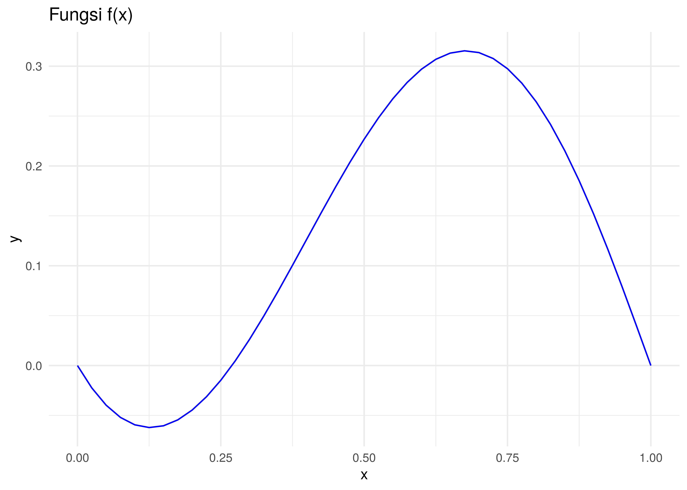

Soal Latihan
================

# SOAL

Temukan akar persamaan berikut:

  
![(x-1) \\tan{x} + x \\sin{\\pi x} = 0, x \\in
\[0,1\]](https://latex.codecogs.com/png.latex?%28x-1%29%20%5Ctan%7Bx%7D%20%2B%20x%20%5Csin%7B%5Cpi%20x%7D%20%3D%200%2C%20x%20%5Cin%20%5B0%2C1%5D
"(x-1) \\tan{x} + x \\sin{\\pi x} = 0, x \\in [0,1]")  

Dengan keakuratan hingga

menggunakan metode *Bisection* dan *Newton-Rhapson*.

# Jawab

Pertama-tama, kita akan gambarkan terlebih dahulu fungsinya di selang
tersebut:



Terlihat dari gambar di atas bahwa akar persamaan terletak di antara
![\[0.25,0.5\]](https://latex.codecogs.com/png.latex?%5B0.25%2C0.5%5D
"[0.25,0.5]").

Pemilihan selang ini menjadi hal terpenting bagi metode *Bisection* agar
hasilnya konvergen.

Mari kita selesaikan:

``` r
# informasi awal
a = 0.25
b = 0.5
iter_max = 100
tol_max = 10^(-5)
i = 0

hasil = data.frame(n = NA,a = NA,b = NA,c = NA)

while(i <= iter_max && (b-a)/2 > tol_max){
  p = a + ((b-a)/2)
  FP = f(p)
  FA = f(a)
  FB = f(b)
  hasil[i,] = list(i,a,b,p)
  if(FA*FP < 0){b = p} else {a = p}
  i = i+1
}

hasil
```

    ##     n         a         b         c
    ## 1   1 0.2500000 0.3750000 0.3125000
    ## 2   2 0.2500000 0.3125000 0.2812500
    ## 3   3 0.2500000 0.2812500 0.2656250
    ## 4   4 0.2656250 0.2812500 0.2734375
    ## 5   5 0.2656250 0.2734375 0.2695312
    ## 6   6 0.2656250 0.2695312 0.2675781
    ## 7   7 0.2675781 0.2695312 0.2685547
    ## 8   8 0.2685547 0.2695312 0.2690430
    ## 9   9 0.2690430 0.2695312 0.2692871
    ## 10 10 0.2692871 0.2695312 0.2694092
    ## 11 11 0.2692871 0.2694092 0.2693481
    ## 12 12 0.2693481 0.2694092 0.2693787
    ## 13 13 0.2693787 0.2694092 0.2693939
