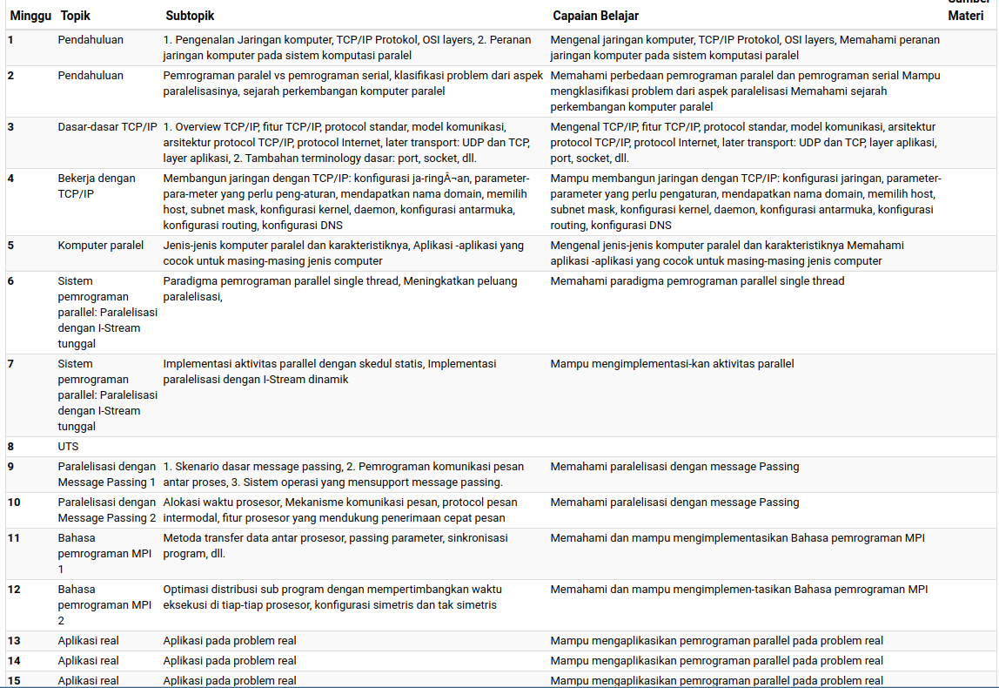

```{r setup, include=FALSE}
knitr::opts_chunk$set(echo = TRUE)
setwd("~/209_ITB/Semester I/Jaringan dan Pengolahan Data Paralel")
library(dplyr)
library(ggplot2)

options(scipen = 999)

rm(list=ls())
```

# SILABUS 

## Keterangan Umum {.tabset}

### Silabus Ringkas	{-}

Pemrosesan dan sistem parallel, integrasi arsitektur, algoritma, bahasa pemograman paralel. Mesin dan komputasi paralel, masalah bagi komputasi paralel, memori terdistribusi, sinkronisasi, data sharing, performansi prosesor paralel, aplikasi pada masalah nyata.

### Silabus Lengkap {-}

Dalam matakuliah ini diperkenalkan pemahaman dasar mengenai aplikasi pemrosesan parallel dan pengembangan sistem parallel. Akan diperkenalkan pula integrasi arsitektur, algoritma, dan bahasa pemograman paralel yang dapat memberikan gambaran mengenai perancangan dan implementasi dari aplikasi paralel. Topik yang dibahas meliputi mesin dan komputasi paralel, masalah-masalah yang potensial untuk dikom-pu¬tasi secara paralel, memori terdistribusi, sinkronisasi dan data sharing, serta performansi prosesor paralel. Selain itu, akan dibahas masalah-masalah nyata dari berbagai bidang sains dan rekayasa yang memerlukan pengolahan data secara paralel beserta karakterisasinya.

### _Outcomes_ {-}

Memahami sistem dan komputasi paralel, dapat mengaplikasikan pada persoalan nyata.

### Panduan Penilaian {-}

```{r}
data.frame(
  ket = c("KUIS DAN TUGAS","PRAKTIKUM","UTS","UAS"),
  persen = c(15,35,25,25)
) %>% 
  mutate(label = paste0(ket,"\n",persen,"%")) %>% 
  ggplot(aes(x = reorder(ket,-persen),
             y = persen)) +
  geom_col(fill = "steelblue",
           color = "black") +
  geom_label(aes(label = label)) +
  labs(title = "Porsi Penliaian Awal Mata Kuliah",
       subtitle = "Analisa Numerik Lanjut",
       caption = "Dibuat dengan R\nikanx101.com") +
  theme_minimal() +
  theme(axis.title = element_blank(),
        axis.text = element_blank()) +
  coord_polar()
```

## Satuan Acara Perkuliahan

```{r out.width="100%",fig.align='center'}

```

## Buku


## Tugas dan Koding

# PERTEMUAN III

Yang penting di Linux Terminal:

1. `touch` utk bikin file
1. `mkdir` bikin folder
1. `nano` utk masuk ke nano text editor
1. `cd` utk masuk ke direktori
1. `less` utk lihat isi file
1. `cp` copy paste file dari directory ke directory lain
1. `locate` untuk menemukan file
1. `man (spasi) perintah` untuk melihat _manual_ perintahnya seperti apa
1. `rm` remove file
1. `rm -d` remove directory
1. `chmod o-r bmi.R` untuk mengubah permission dari suatu file
1. `pwd` _work directory_.

Mode tampilan pada linux

1. bash shell `usermod -s /bin/bash username`
1. shell `usermod -s /bin/sh username`
1. tcsh `usermod -s /bin/tcsh username`
1. csh `usermod -s /bin/csh username`
1. konshell `usermod -s /bin/ksh username`

Hari ini membuat file bash utk kemudian di eksekusi:

```
nano bash1
```

ini si `bash1` adalah:

```
#!bin/bash
mkdir ikang
```

untuk mengubah si bash menjadi _executable_:

```
chmod +x bash1
```

Untuk run-nya silakan:

```
sh bash1
```

perintah `ls -l` bisa untuk melihat apakah suatu _bash_ _executable_ atau tidak.

Kalau _permission denied_, lakukan:

```
chmod 777 bash1
```

# PERTEMUAN MINGGU XXX
17 September 2021

# PERTEMUAN MINGGU XXX
24 September 2021

`/etc/resolve.conf` memberi tahu kernel _server_ nama mana yang harus ditanyakan ketika sebuah program meminta untuk _me-resolve_ alamat IP.

`/etcsysconfig/network-scripts/ifcfg-eth0` konfigurasi jaringan seperti protokol _boot_ (status / dhcp), alamat IP, netmask, alamat jaringan, alamat broadcast.


