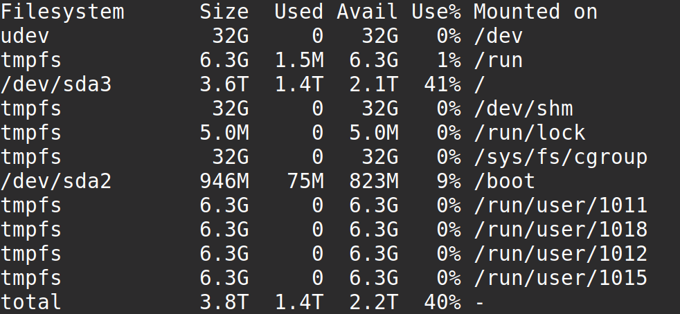

```{r setup, include=FALSE}
knitr::opts_chunk$set(echo = TRUE)
setwd("~/209_ITB/Semester I/Jaringan dan Pengolahan Data Paralel/QUIZ/laporan")
rm(list=ls())
```

# SOAL 1

Jawablah pertanyaan berikut dengan singkat dan jelas!

#### Soal a.

Jelaskan perbedaan antara program yang dijalankan secara serial dan program yang dijalankan secara _parallel_!

#### Jawab

Program yang dijalankan secara serial berarti program tersebut memproses _task_ satu-persatu secara berurut (_sequencial_). Sedangkan program yang dijalankan secara _parallel_ berarti program tersebut bisa memproses _multiple tasks_ dalam satu waktu secara bersamaan menggunakan _processors_ yang berbeda-beda. 

#### Soal b.

Jelaskan dengan singkat perbedaan SISD, SIMD, MISD, dan MIMD!

#### Jawab

___Single Instruction Single Data Stream___ (__SISD__) : suatu komputer yang tidak memiliki cara untuk melakukan paralelisasi terhadap instruksi atau data.

___Single Instruction Multiple Data Stream___ (__SIMD__) : suatu komputer yang mampu memproses banyak aliran data dengan hanya satu instruksi, sehingga operasi yang dilakukan adalah operasi paralel.

___Multiple Instruction Single Data Sream___ (__MISD__) : suatu komputer yang dapat melakukan banyak instruksi terhadap satu aliran data. 

___Multiple Instruction Multiple Data stream___ (__MIMD__) : suatu komputer yang memiliki beberapa prosesor yang bersifat _autonomous_ yang mampu melakukan instruksi yang berbeda pada data yang berbeda. 

#### Soal c.

Jelaskan dengan singkat perbedaan mendasar penggunaan `OpenMP` dan `OpenMPI` untuk paralelisasi!

#### Jawab

Salah satu perbedaan mendasarnya adalah cara menulis kode programnya. Karena `OpenMP` adalah cara pemrograman pada sistem _shared memory_ sedangkan `OpenMPI` adalah cara pemrograman pada sistem _distributed memory_.

#### Soal d.

Sebutkan modul selain `mpi4py` pada _python_ yang dapat digunakan untuk paralelisasi!

#### Jawab

Kita bisa menggunakan `CUDA` dan `OpenCL`.

#### Soal e.

Selain menggunakan paralelisasi dengan `MPI`, kecepatan pemrosesan pada _python_ dapat dilakukan dengan cara apa saja?

#### Jawab

Kita bisa menggunakan prinspi _multi processing_ memanfaatkan operasi _array_ alih-alih melakukan _looping_.

#### Soal f.

Jelaskan dengan singkat perbedaan komunikasi _point-to-point_ dan kolektif pada `MPI`!

#### Jawab

_Point-to-point communication_ adalah bentuk komunikasi pada _message passing_ di mana ada sepasang proses yang saling bekerjasama. Pada `MPI`, secara sederhana dapat digunakan `MPI_Send` atau `MPI_Recv` sebagai definisi proses mengirimkan dan menerima suatu data.

_Collective communication_ adalah bentuk komunikasi antara semua proses dalam sebuah grup proses. Pada `MPI`, secara sederhana dapat digunakan `MPI_Bcast` (broadcast) yang melakukan pengiriman data dari sebuah proses ke semua proses lainnya pada grup atau `MPI_Reduce` untuk melakukan kebalikannya.

\newpage

# SOAL 2

Pertanyaan pada soal ini untuk menguji pemahaman anda tentang _server linux multiprocessor_ dan teknis penggunaannya untuk menyelesaikan perhitungan numerik dengan paralelisasi menggunakan `MPI`.

#### Soal a

Nama host (hostname) server yang digunakan pada kuis ini adalah _______________(1), dengan alamat IP____________(2). Sistem operasi yang digunakan pada server ini adalah________(3) versi______(4). Server ini memiliki motherboard dengan socket sebanyak_______(5) dengan processor sebanyak ____(6) core, ____(7) thread dengan merk dagang________________(8), kecepatan processor__________(9) GHz dan cache_____(10)(MB). Kapasitas total penyimpanan data pada server ini sebesar ______(11) GB dan RAM total sebesar________(12)MB. Program MPI yang digunakan pada server ini untuk menghitung perhitungan numerik secara paralel adalah________(13) dengan modul_______(14) Python versi _________(15)

#### Jawab

1. ubuntu
1. 69.30.233.90
1. Linux Ubuntu
1. 20.04.3 LTS
1. 40 CPUs
1. 10 per socket
1. 2 per core
1. Intel(R) Xeon(R) CPU E5-2660 v2
1. 2.20 GHz
1. L2 cache: 5MB dan L3 cache: 50MB
1. 32 GB di `dev` tapi sepertinya _per user_ mendapatkan _storage_ sebesar `6.3` GB (_screenshoot_ terlampir)
1. 62.9 GB
1. Slurm
1. `mpi4py`
1. 3.8.10

```{r out.width="75%",echo=FALSE,fig.align='center',fig.cap="Screenshoot df -h --total"}

```

#### Soal b.

Secara _default_, _server_ ini belum bisa menjalankan program `MPI`. Apa yang harus dilakukan agar program `MPI` pada _server_ ini dapat dijalankan? 

#### Jawab

Kita harus meng-_install_ `MPI` terlebih dahulu di OS Linux pada _server_ tersebut. Kemudian meng-_install_ _library_ `mpi4py` di Python 3 yang hendak digunakan.

#### Soal c.

Nama program yang digunakan untuk me-_manage_ _resource_ dan mengatur antrian _job_ perhitungan pada _server_ ini adalah _________(1). Buatlah contoh `file.sh` untuk menjalankan perhitungan numerik secara paralel di server ini dengan sistem antrian! Perintah yang digunakan untuk mengeksekusi `file.sh` agar job perhitungan masuk ke sistem antrian adalah_____________(2)

#### Jawab

1. Slurm
1. `sbatch file.sh`

Contoh `file.sh`

```
#!/bin/bash
#SBATCH --nodes=1
#SBATCH --ntasks=1
#SBATCH --cpus-per-task=1
#SBATCH --time=720:00:00
python3 program.py
```