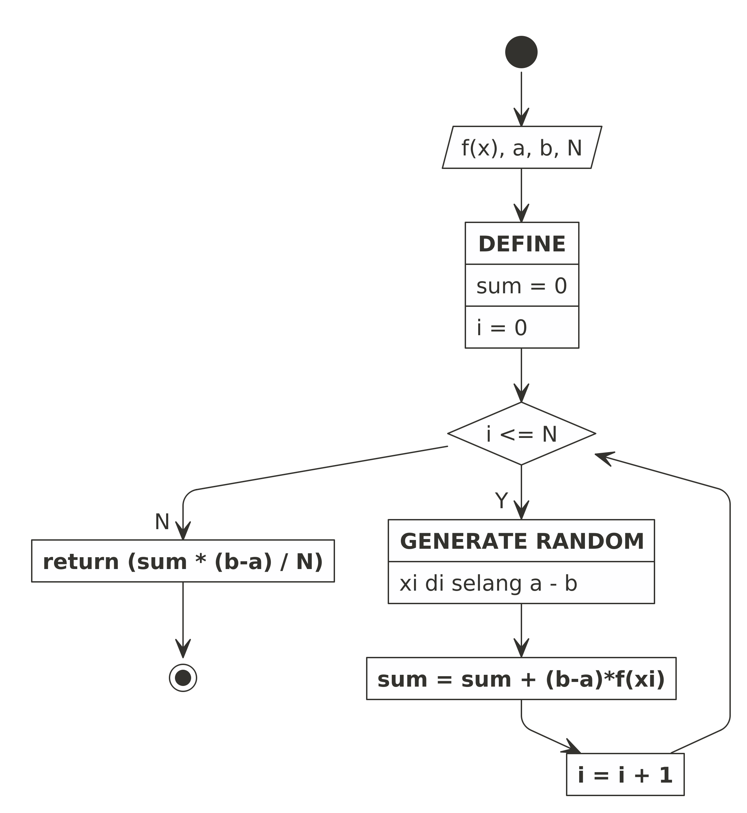

```{r setup, include=FALSE}
knitr::opts_chunk$set(echo = TRUE)

rm(list=ls())
library(dplyr)
library(ggplot2)
```

\newpage
\tableofcontents
\newpage
\listoffigures
\newpage
\listoftables

\newpage

\newpage

# _INTRODUCTION_

## Definisi

_Parallel processing_ adalah metode komputasi untuk menggunakan dua atau lebih _processors_ untuk menjalankan beberapa tugas secara terpisah atau secara keseluruhan. Setiap komputer yang memiliki lebih dari satu _CPUs_ atau memiliki _processor multi cores_ bisa melakukan _parallel processing_ ^[https://searchdatacenter.techtarget.com/definition/parallel-processing].

## Perbedaan _Serial Processing_ dan _Parallel Processing_

Perbedaan mendasar dari _serial processing_ dan _parallel processing_ adalah dari segi bagaimana komputer melakukan proses komputasi. _Serial processing_ berarti komputer melakukan tugasnya secara sekuensial (berurutan) menggunakan satu _processor_. Akibatnya adalah saat melakukan suatu proses yang kompleks, _runtime_ yang diperlukan lebih lama karena _processor_ harus memproses data satu-persatu.

Berbeda halnya dengan _parallel processing_. Tugas yang dilakuan komputer didistribusikan kepada sejumlah _processors_ untuk diolah secara bersamaan. Konsekuensinya adalah _runtime_ komputasi lebih singkat. Namun perlu diperhatikan dengan seksama bahwa tidak semua tugas bisa kita buat paralelisasinya dan cara kita menulis algoritma atau _coding_ harus disesuaikan.

> Kenapa tidak semua tugas bisa diparalelisasi?

Beberapa tugas sekuensial yang tidak bisa dihindari tidak bisa diparalelisasi. 

Sebagai contoh:

1. _Looping_ yang prosesnya tidak saling bergantung bisa diparalelisasi. Misalkan ada suatu fungsi untuk menghitung suatu _array_ bisa diparalelisasi dengan cara memecah _array_ tersebut untuk diproses bersamaan di beberapa _processors_.
1. _Looping_ yang prosesnya saling bergantung tidak bisa diparalelisasi. Misalkan suatu _looping_ ke $i$ nilainya bergantung pada proses _looping_ ke $i-1$.


Berikut adalah ilustrasi perbedaan serial dan _parallel processing_:

```{r,include=FALSE}
nomnoml::nomnoml("#direction:down
                 [Serial]
                 [Parallel]
                 
                 [Serial|
                   [A] -> [B]
                   [B] -> [C]
                   [C] -> [D]
                   ]
                   
                 [Parallel|
                   [A] -> [B]
                   [A] -> [C]
                   [B] -> [D]
                   [C] -> [D]
                   ]
                 ","gbr1.png")
```

```{r out.width="35%",echo=FALSE,fig.align='center',fig.cap="Ilustrasi Perbedaan Serial dan Parallel Processing",fig.retina=10}
knitr::include_graphics("gbr1.png")
```

\newpage

## Cara Kerja _Parallel Processing_

Untuk melakukan _parallel processing_, dibutuhkan _hardware_ dan _software_ yang mendukung hal tersebut. Secara _hardware_ dibutuhkan komputer dengan _multiple cores processors_ atau dibutuhkan beberapa komputer yang digabung menjadi satu kesatuan. Secara _software_ dibutuhkan tidak hanya `Python` tapi juga _middleware_ bernama `Open MPI`. Bagian _hardware_ dan _software_ ini akan dibahas pada bagian selanjutnya.

Pada sistem _parallel processing_ terdiri dari beberapa unit _processors_ dan beberapa unit _memory_. Ada dua teknik berbeda yang digunakan untuk mengakses data di unit _memory_, yaitu: _shared memory address_ dan _message passing_.

Berdasarkan cara mengorganisasikan memori ini komputer bisa dibedakan menjadi _shared memory parallel machine_ dan _distributed memory parallel machine_.

Ada empat model komputasi yang dikenal dalam taksonomi Flynn, yaitu:

1. __SISD__ (_Single Instruction, Single Data_)
1. __SIMD__ (_Single Instruction, Multiple Data_)
1. __MISD__ (_Multiple Instruction, Single Data_)
1. __MIMD__ (_Multiple Instruction, Multiple Data_)

### __SISD__

Komputer ini adalah tipikal komputer konvensional yang hanya memiliki satu _processor_ dan satu instruksi yang dieksekusi secara serial. Komputer jenis ini tidak bisa melakukan _parallel processing_.

```{r,include=FALSE}
nomnoml::nomnoml("
		[Input/Output] <-> [Control\nUnit]
		[Control\nUnit] -> [Proc\nUnit]
		[Proc\nUnit] <-> [Memory\nModul]
		[Memory\nModul] -> [Control\nUnit]
		","sisd.png")

```

```{r out.width="45%",echo=FALSE,fig.align='center',fig.cap="Ilustrasi SISD",fig.retina=10}
knitr::include_graphics("sisd.png")
```

### __SIMD__

Komputer ini memiliki lebih dari satu _processor_ tapi hanya mengeksekusi satu instruksi secara paralel pada data yang berbeda pada level _lock-step_. Contohnya adalah komputer vektor.

```{r,include=FALSE}
nomnoml::nomnoml("
		[Input/Output] <-> [Control\nUnit]
		[Control\nUnit] -> [Proc Unit 1]
		[Control\nUnit] -> [Proc Unit 2]
		[Control\nUnit] -> [Proc Unit n]
		
		[Proc Unit 1] <-> [Memory Modul 1]
		[Proc Unit 2] <-> [Memory Modul 2]
		[Proc Unit n] <-> [Memory Modul n]

		[Memory Modul 1] -> [Control\nUnit]
		[Memory Modul 2] -> [Control\nUnit]
		[Memory Modul n] -> [Control\nUnit]
		",
		"simd.png")
```

```{r out.width="45%",echo=FALSE,fig.align='center',fig.cap="Ilustrasi SIMD",fig.retina=10}
knitr::include_graphics("simd.png")
```

### __MISD__

Komputer jenis ini belum diciptakan karena secara arsitekturnya tidak mudah dipahami. Secara teori komputer ini memiliki satu _processor_ dan mengeksekusi beberapa instruksi secara paralel.

### __MIMD__

Komputer berarsitektur ini paling banyak digunakan untuk membangun _super computer_. Komputer ini memiliki lebih dari satu _processors_ dan mengeksekusi lebih dari satu instruksi secara paralel.

## Tugas Praktikum 

Pada praktikum ini, saya akan mengerjakan:

- Dua buah tugas terkait penyelesaian integral secara numerik memanfaatkan metode dikritisasi nilai tengah (_midpoint_) dan simulasi Monte Carlo.
- Satu buah tugas terkait penjumlahan dan perkalian matriks $n \times n$.

Ketiga tugas tersebut akan diselesaikan menggunakan serial dan _parallel processing_. 

## _Server_ yang Digunakan

Pada praktikum kali ini, saya tidak bisa menggunakan _server_ __HPC__ yang disediakan oleh ITB karena masalah koneksi. Oleh karena itu, saya menggunakan _server_ lain agar bisa menduplikasi apa yang seharusnya dikerjakan di _server_ ITB.

Saya menggunakan _server virtual machine_ milik _Google Cloud_^[https://ikanx101.com/blog/vm-cloud/]. _Server_ ini memiliki _processor_ __Intel Xeon__ __8__ ___cores___. _Hostname_ dari _server_ ini saya beri nama `praktikum`.

_Server_ ini disewa menggunakan _free credit_ yang kita dapatkan saat mengaktifkan layanan _Google Cloud_ menggunakan akun _Google_.

\newpage

Berikut adalah spesifikasinya:

```{r out.width="50%",echo=FALSE,fig.align='center',fig.cap="Spesifikasi Server yang Digunakan",fig.retina=10}
knitr::include_graphics("spek.jpg")
```

\newpage

_Server_ ini bisa diakses menggunakan _command line_ menggunakan `ssh` langsung ke _IP Public_ yang diberikan _Google_.

```{r out.width="65%",echo=FALSE,fig.align='center',fig.cap="Tampilan Awal Setelah Login ssh",fig.retina=10}
knitr::include_graphics("opening.jpg")
```

_Server_ ini berjalan di _operating system_ `Ubuntu Linux 20.04 LTS`.

Berikut adalah tampilan hasil `lscpu`:

```{r out.width="65%",echo=FALSE,fig.align='center',fig.cap="lscpu dari Server",fig.retina=10}
knitr::include_graphics("lscpu.jpg")
```

\newpage

Berikut adalah tampilan hasil `htop`:

```{r out.width="65%",echo=FALSE,fig.align='center',fig.cap="htop dari Server",fig.retina=10}
knitr::include_graphics("htop.jpg")
```

## MPI

Secara _default_ `Python` sudah ter-_install_ di _server_ namun tidak untuk `Open MPI`. Oleh karena itu, salah satu langkah yang perlu dilakukan adalah meng-_install_-nya terlebih dahulu [@mpi]. 

Pada `Ubuntu`, proses instalasinya bisa kita lakukan dengan mengetikkan perintah berikut ini di _command line_:

```
sudo apt install openmpi-bin openmpi-dev openmpi-common openmpi-doc libopenmpi-dev
```

\newpage

Setelah proses instalasi selesai, kita bisa mengecek versi `Open MPI` yang berjalan di _server_ sebagai berikut:

```{r out.width="45%",echo=FALSE,fig.align='center',fig.cap="Versi MPI yang Digunakan",fig.retina=10}
knitr::include_graphics("mpi.jpg")
```

Pada `Python`, saya perlu meng-_install_ _library_ `mpi4py` dengan perintah:

```
sudo apt install python3-mpi4py
``` 

Oleh karena saya menjalankan program `Python` praktikum di _server_ sendiri (tanpa ada _user_ lain), maka saya tidak melakukan instalasi `SLURM`.

# _METHOD_

Pada praktikum ini, kita akan melakukan _parallel processing_ menggunakan `Python` versi `3.8.10` di _server_ berbasis `Linux Ubuntu OS`. Ada beberapa metode _parallel processing_ yang hendak dilakukan, yakni:

1. _Broadcast_,
   - _Broadcast-gather_,
   - _Broadcast-reduce_,
1. _Scatter_,
   - _Scatter-reduce_,
   - _Scatter-gather_,
1. _Gather_,
1. _Reduce_,
1. _Multi-processing_,
1. _Multi-thread_,
1. _Point to point_.

Kemudian semua metode _parallel processing_ ini akan dibandingkan _runtime_-nya dengan _serial processing_.

## Penjelasan Singkat

### _Broadcast_

Merupakan metode komunikasi kolektif di mana satu proses mengirim data yang sama ke proses lainnya.

### _Scatter_

Secara fungsi, _broadcast_ dan _scatter_ hanya memiliki perbedaan pada perintah yang digunakan. Selain itu _scatter_ dapat mengirim potongan data dalam _array_ ke proses yang berbeda. Perlu diperhatikan bahwa jumlah _tasks_ yang dibagikan tidak boleh melebihi julah _processors_.

### _Gather_

Fungsi ini melakukan kebalikan dari _scatter_, yakni dengan mengumpulkan semua data yang diterima.

### _Point to Point_

Operasi _point to point_ (__P2P__) terdiri dari pertukaran pesan antara dua proses. Setiap operasi pengiriman akan disinkronkan secara sempurna dengan operasi penerimaan (_send - receive_).

## Metode Integral Numerik

Ada beberapa metode numerik yang bisa digunakan untuk menghitung suatu integral dari fungsi kontinu. Pada praktikum ini, saya akan menggunakan metode titik tengah dan simulasi Monte Carlo untuk mengerjakan dua soal integral numerik.

### Metode Titik Tengah (_Midpoint_)

Metode titik tengah merupakan salah satu cara perhitungan integral numerik dari fungsi kontinu melalui dikritisasi fungsi [@libre]. Prinsip yang digunakan adalah penjumlahan deret __Riemann__.

#### Definisi

Misalkan $f(x)$ kontinu di selang $[a,b]$. Jika diambil suatu $n$ bilangan bulat positif, kita bisa membagi selang tersebut menjadi partisi-partisi kecil berikut: $\Delta x = \frac{b-a}{n}$. 

Tuliskan $m_i = x_i + \frac{\Delta}{2}$ sebagai titik tengah di partisi ke- $i$, maka: $\int_a^b f(x) dx$ bisa didekati dengan $n \sum_{i=1}^n f(m_i) \Delta x_i$.

### Simulasi Monte Carlo

Berbeda dengan metode titik tengah, ide dasar dari simulasi Monte Carlo adalah dengan melakukan _generating_ sejumlah titik secara _random_ pada selang integral dan menghitung nilai fungsinya^[https://ikanx101.com/blog/integral-tentu/]. Berikut adalah _flowchart_-nya:

```{r out.width="45%",echo=FALSE,fig.align='center',fig.cap="Flowchart Simulasi Monte Carlo untuk Integral Numerik",fig.retina=10}

```

## Menghitung $\pi$

Untuk menghitung nilai $\pi$ pada soal kedua, saya akan menggunakan fungsi berikut:

$$\int_0^1 4 \sqrt{1 - x^2}$$

## Penjumlahan dan Perkalian Matriks

Pada soal ketiga, saya menggunakan matriks berukuran $n \times n$ dengan $n = numCores^2 = 8^2 = 64$. Dengan isi dari matriks $A$ dan $B$ di-_generate_ secara _random_ melalui `numpy`.

# _RESULT AND DISCUSSION_

Pada tugas praktikum ini, kita akan membandingkan _runtime_ antara berbagai metode _parallel processing_ dengan _serial processing_. Perlu saya ingatkan kembali bahwa _server_ _Google Cloud_ yang saya pakai memiliki __8__ ___cores___.

## Soal I

Hitung integral $\int_0^1 x^2 dx$ dengan $n = 10^8$.

### Jawab {-}

Secara analitik, kita bisa hitung bahwa:

$$\int_0^1 x^2 dx = \frac{x^3}{3} |_0^1 = \frac{1}{3} \simeq 0.333333..$$

Berikut adalah program _serial processing_ yang dibuat:

```
import time
# hitung waktu mulai
mulai = time.time()
# bikin fungsi f(x)
def fx (x) :
   return(x**2)
# bikin fungsi untuk integral numerik
def int_numeric (a,b,n):
   # set terlebih dahulu agar tidak error pada tipe variabel
   n = int(n)
   a = float(a)
   b = float(b)
   sum = float(0)
   # hitung selang integrasi diksritisasi
   h = (b-a) / n
   # mulai iterasi untuk menghitung penjumlahan
   for i in range(n):
     xi = a + h/2 + i*h
     sum = sum + fx(xi)
   # kalikan dengan h untuk menjadi full integral
   sum = h * sum
   return(sum) 
# initial condition
a = 0
b = 1
n = 10**8
# hitung soal
nilai = int_numeric(a,b,n)
print("Nilai integral f(x) dx adalah: ",nilai)
# hitung waktu selesai
end = time.time()
waktu = end - mulai
print(waktu)
# selesai
print("DONE")
```

Hasil _runtime_ program di atas adalah `27.43908143043518` detik.

Berikut adalah grafik rekap _runtime_ dari semua _parallel processing_ dan perbandingannya:

```{r,include=FALSE}
rm(list=ls())

metode = c("Serial","Broadcast","Broadcast Gather","Broadcast Reduce",
	   "Gather","Multi Processing","Multi Threading","P2P",
	   "Reduce","Scatter","Scatter Gather","Scatter Reduce")
nilai = c(0.33333333333331167,0.33333333333331167,0.3333333333333456,0.3333333333333455,
	  0.3333333333333456,0.33333333333333925,0.33333333333331167,0.333333333333333,
	  0.3333333333333455,0.33333333333331167,0.3333333333333456,0.3333333333333455)
runtime = c(27.43908143043518,56.21210050582886,6.989081621170044,7.089271306991577,
	    7.081090211868286,7.525770664215088,254.07278299331665,7.182239143,
	    7.1590189933776855,54.73514008522034,7.058984279632568,6.8766655921936035)

rekap = data.frame(metode,
		   nilai = round(as.numeric(nilai),5),
		   runtime = round(as.numeric(runtime),3))
```

```{r,echo=FALSE}
rekap %>% 
  rename(Metode = metode,
	 Nilai = nilai,
	 Runtime = runtime) %>%
  knitr::kable(align = "c",caption = "Rekap Runtime dan Hasil Integral Soal I")
```

\newpage

```{r,echo=FALSE,fig.align='center',fig.cap="Rekap Runtime Soal I",fig.retina=10}
rekap %>%
  ggplot(aes(x = reorder(metode,runtime),
	     y = runtime)) +
  geom_col(fill = "steelblue",
	   width = .7) +
  geom_label(aes(label = round(runtime,3)),size = 1.5) +
  coord_flip() +
  labs(title = "Rekap Runtime Serial vs Parallel Processing",
       subtitle = "dalam detik\nPenyelesaian Soal I",
       caption = "Dibuat oleh 20921004",
       x = "Metode",
       y = "Runtime") +
  theme_minimal() +
  theme(axis.text.x = element_blank())
```

\newpage

## Soal II

Hitung nilai $\pi$ dengan menyelesaikan: $\int_0^1 4 \sqrt{1 - x^2}$ dengan $n = 10^8$.

### Jawab {-}

Perhatikan grafik $f(x) = \sqrt{1 - x^2}, x \in [0,1]$ berikut ini:

```{r,echo=FALSE,fig.align='center',fig.cap="Grafik 1/4 Lingkaran dengan r=1",fig.retina=10}
rm(list=ls())

x = seq(0,1,.005)
y = sqrt(1 - x^2)

data = data.frame(x,y)

data %>%
  ggplot(aes(x,y)) +
  geom_point(color = "steelblue",size = .75) +
  geom_vline(xintercept = 0) +
  geom_hline(yintercept = 0) +
  ylim(-1,2) +
  xlim(-1,2) +
  labs(title = "1/4 Lingkaran dengan r = 1",
       subtitle = "Ilustrasi Soal II",
       caption = "Dibuat oleh 20921004") +
  theme_minimal() +
  theme(axis.text = element_blank(),
	axis.title = element_blank()) +
  coord_equal()
```

Luas area di bawah kurva dikalikan dengan `4` akan menghasilkan hampiran nilai dari $\pi$. Kali ini saya menghitung hampiran tersebut dengan metode _midpoint_ dan simulasi Monte Carlo.

Berikut adalah program serial yang dibuat di `Python`:

```
import time
import random
import math
# bikin fungsi f(x)
def fx (x) :
   return(math.sqrt(1 - x**2) * 4)
# bikin fungsi untuk integral numerik
def int_numeric (a,b,n):
   # set terlebih dahulu agar tidak error pada tipe variabel
   n = int(n)
   a = float(a)
   b = float(b)
   sum = float(0)
   # hitung selang integrasi diksritisasi
   h = (b-a) / n
   # mulai iterasi untuk menghitung penjumlahan
   for i in range(n):
     xi = a + h/2 + i*h
     sum = sum + fx(xi)
   # kalikan dengan h untuk menjadi full integral
   sum = h * sum
   return(sum) 
# bikin fungsi untuk monte carlo
def monte_pi (n):
   n = int(n)
   monte = float(0)
   for i in range(n):
     xi = random.random()
     yi = fx(xi)
     monte = monte + yi
   return(monte/n)

# initial condition
a = 0
b = 1
n = 10**8

# hitung soal dengan midpoint
mulai = time.time()
nilai_1 = int_numeric(a,b,n)
print("Nilai integral f(x) dx adalah: ",nilai_1)
end = time.time()
waktu_1 = end - mulai
print("Waktu yang dibutuhkan dengan midpoint: ",waktu_1)

# hitung soal dengan montecarlo
mulai = time.time()
nilai_2 =  monte_pi(n)
print("Nilai integral f(x) dx adalah: ",nilai_2)
end = time.time()
waktu_2 = end - mulai
print("Waktu yang dibutuhkan dengan monte: ",waktu_2)
```

Dari program serial ini, didapatkan _runtime_ sebagai berikut:

1. Menggunakan metode _midpoint_ selama `37.09915375709534` detik dengan hampiran $\pi \simeq 3.1415926535908407$.
1. Menggunakan simulasi Monte Carlo selama `34.31454539299011` detik dengan hampiran $\pi \simeq 3.141628338857705$.

Berikut adalah grafik rekapan dari semua perhitungan serial dan paralel untuk metode _midpoint_ dan simulasi Monte Carlo:

```{r,include=FALSE}
rm(list=ls())

metode = c("Serial","Serial",
	   "Broadcast","Broadcast",
	   "Broadcast Gather","Broadcast Gather",
	   "Broadcast Reduce","Broadcast Reduce",
	   "Gather","Gather",
	   "Multi Processing","Multi Processing",
	   "Multi Threading","Multi Threading",
	   "P2P","P2P",
	   "Reduce","Reduce",
	   "Scatter","Scatter",
	   "Scatter Gather","Scatter Gather",
	   "Scatter Reduce","Scatter Reduce")

algo = rep(c("Midpoint","Monte Carlo"),12)

nilai = c(3.1415926535908407,3.141628338857705,
	  3.1415926535908407,3.141587559754934,
	  3.141592653590117,25.132540181445272/8,
	  3.1415926535901164,25.13158041365358/8,
	  3.141592653590117,25.131631135260793/8,
	  3.1415926535901084,3.141520140116895,
	  3.1415926535908407,3.1414638257166785,
	  3.149869484774846845,3.1414060525250656,
	  3.1415926535901164,25.130795204732536/8,
	  3.1415926535908407,3.1415577413199105,
	  3.141592653590117,25.132484095298132/8,
	  3.1415926535901164,25.132466741650664/8)
runtime = c(37.09915375709534,34.31454539299011,
	    80.7673327922821,72.39736461639404,
	    10.181049823760986,9.693099021911621,
	    10.260845422744751,9.936588048934937,
	    10.22980284690857,9.260202646255493,
	    10.83942699432373,9.118600368499756,
	    40.60416913032532,33.76176381111145,
	    10.335948376,9.111383716,
	    10.357647895812988,9.344260215759277,
	    81.06670069694519,73.13209247589111,
	    10.334447860717773,9.324422836303711,
	    10.31100606918335,9.365896940231323)

rekap = data.frame(metode,algo,
		   nilai = round(as.numeric(nilai),5),
		   runtime = round(as.numeric(runtime),3))
```

```{r,echo=FALSE}
rekap %>% 
  rename(Metode = metode,
         Algo = algo,
         Nilai = nilai,
	       Runtime = runtime) %>%
  knitr::kable(align = "c",caption = "Rekap Runtime dan Hasil Integral Soal II")
```


\newpage

```{r,echo=FALSE,fig.align='center',fig.cap="Rekap Runtime Soal II",fig.retina=10}
rekap %>%
  ggplot(aes(x = reorder(metode,runtime),
	     y = runtime)) +
  geom_col(aes(fill = algo),
	   width = .7) +
  geom_label(aes(label = round(runtime,3)),size = 1.5) +
  coord_flip() +
  labs(title = "Rekap Runtime Serial vs Parallel Processing",
       subtitle = "dalam detik\nPenyelesaian Soal II",
       caption = "Dibuat oleh 20921004",
       x = "Metode",
       y = "Runtime") +
  theme_minimal() +
  theme(axis.text.x = element_blank(),
        legend.position = "none") +
  facet_wrap(~algo) +
  scale_fill_manual(values = c("steelblue","darkred"))
```


## Soal III

Buatlah program `Python` untuk menyelesaikan persoalan terkait dengan penjumlahan dan perkalian matriks.

### Jawab {-}

Program `Python` ini akan dibuat untuk menyelesaikan matriks $64 \times 64$. Isi dari matriks di-_generate_ secara _random_.

Berikut adalah programnya:

```
import numpy as np
import time

# hitung waktu mulai
mulai = time.time()

# ukuran matriks
n = 64

# penjumlahan dan perkalian
def operasi_matrix (n):
  # membuat matriks 10x10
  a = np.random.randint(n, size = (n,n))
  b = np.random.randint(n, size = (n,n))
  c = np.dot(a,b)
  d = np.add(a,b)
  return(c,d)

hitung = operasi_matrix(n)

# hitung waktu selesai
end = time.time()
waktu = end - mulai
print(waktu)
```

Untuk ukuran matriks $64 \times 64$ diperlukan _runtime_ selama `0.000576019287109375` detik.

Berikut adalah grafik rekap _runtime_ dari semua _parallel processing_ dan perbandingannya:

```{r,include=FALSE}
rm(list=ls())

metode = c("Serial","Broadcast","Broadcast Gather","Broadcast Reduce",
	   "Gather","Multi Processing","Multi Threading","P2P",
	   "Reduce","Scatter","Scatter Gather","Scatter Reduce")
runtime = c(0.000576019287109375,0.002203702926635742,0.01202082633972168,0.033280134201049805,
            0.014339685440063477,0.025571346282958984,0.012070655822753906,0.010933792,
            0.005605220794677734,0.0022110939025878906,0.011840343475341797,0.015759706497192383)

rekap = data.frame(metode,
		               runtime = round(as.numeric(runtime),5))
```

```{r,echo=FALSE}
rekap %>% 
  rename(Metode = metode,
         Runtime = runtime) %>%
  knitr::kable(align = "c",caption = "Rekap Runtime dan Hasil Integral Soal III")
```

\newpage

```{r,echo=FALSE,fig.align='center',fig.cap="Rekap Runtime Soal III",fig.retina=10}
rekap %>%
  ggplot(aes(x = reorder(metode,runtime),
	     y = runtime)) +
  geom_col(fill = "steelblue",
	   width = .7) +
  geom_label(aes(label = round(runtime*10^2,2)),size = 1.5) +
  coord_flip() +
  labs(title = "Rekap Runtime Serial vs Parallel Processing",
       subtitle = "dalam seperseratus detik\nPenyelesaian Soal III",
       caption = "Dibuat oleh 20921004",
       x = "Metode",
       y = "Runtime") +
  theme_minimal() +
  theme(axis.text.x = element_blank()) 
```

\newpage

# _CONCLUSION_

Tidak semua _parallel processing_ menghasilkan _runtime_ yang lebih cepat dibandingkan _serial processing_. Metode seperti _scatter_, _broadcast_, dan _multi threading_ menghasilkan _runtime_ yang relatif lebih lama.

Metode _parallel processing_ yang merupakan gabungan dari dua metode relatif menghasilkan _runtime_ yang sangat cepat.

# _REFERENCES_
