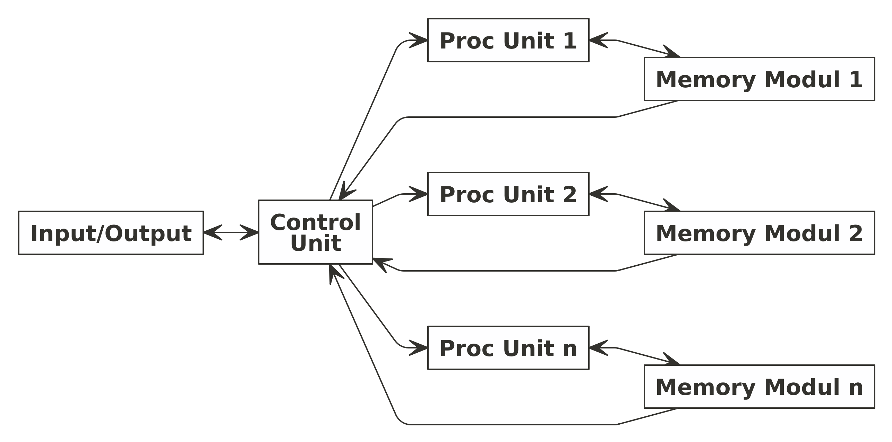

```{r setup, include=FALSE}
knitr::opts_chunk$set(echo = TRUE)

rm(list=ls())
library(dplyr)
library(ggplot2)
```

\newpage
\tableofcontents
\newpage
\listoffigures
\newpage
\listoftables

\newpage

\newpage

# _INTRODUCTION_

## Definisi

_Parallel processing_ adalah metode komputasi untuk menggunakan dua atau lebih _processors_ untuk menjalankan beberapa tugas secara terpisah atau secara keseluruhan. Setiap komputer yang memiliki lebih dari satu _CPUs_ atau memiliki _processor multi cores_ bisa melakukan _parallel processing_ ^[https://searchdatacenter.techtarget.com/definition/parallel-processing].

## Perbedaan _Serial Processing_ dan _Parallel Processing_

Perbedaan mendasar dari _serial processing_ dan _parallel processing_ adalah dari segi bagaimana komputer melakukan proses komputasi. _Serial processing_ berarti komputer melakukan tugasnya secara sekuensial (berurutan) menggunakan satu _processor_. Akibatnya adalah saat melakukan suatu proses yang kompleks, _runtime_ yang diperlukan lebih lama karena _processor_ harus memproses data satu-persatu.

Berbeda halnya dengan _parallel processing_. Tugas yang dilakuan komputer didistribusikan kepada sejumlah _processors_ untuk diolah secara bersamaan. Konsekuensinya adalah _runtime_ komputasi lebih singkat. Namun perlu diperhatikan dengan seksama bahwa tidak semua tugas bisa kita buat paralelisasinya dan cara kita menulis algoritma atau _coding_ harus disesuaikan.

> Kenapa tidak semua tugas bisa diparalelisasi?

Beberapa tugas sekuensial yang tidak bisa dihindari tidak bisa diparalelisasi. 

Sebagai contoh:

1. _Looping_ yang prosesnya tidak saling bergantung bisa diparalelisasi. Misalkan ada suatu fungsi untuk menghitung suatu _array_ bisa diparalelisasi dengan cara memecah _array_ tersebut untuk diproses bersamaan di beberapa _processors_.
1. _Looping_ yang prosesnya saling bergantung tidak bisa diparalelisasi. Misalkan suatu _looping_ ke $i$ nilainya bergantung pada proses _looping_ ke $i-1$.

Berikut adalah ilustrasi perbedaan serial dan _parallel processing_:

```{r,include=FALSE}
nomnoml::nomnoml("#direction:down
                 [Serial]
                 [Parallel]
                 
                 [Serial|
                   [A] -> [B]
                   [B] -> [C]
                   [C] -> [D]
                   ]
                   
                 [Parallel|
                   [A] -> [B]
                   [A] -> [C]
                   [B] -> [D]
                   [C] -> [D]
                   ]
                 ","gbr1.png")
```

\newpage

```{r out.width="30%",echo=FALSE,fig.align='center',fig.cap="Ilustrasi Perbedaan Serial dan Parallel Processing",fig.retina=10}
knitr::include_graphics("gbr1.png")
```

## Cara Kerja _Parallel Processing_

Untuk melakukan _parallel processing_, dibutuhkan _hardware_ dan _software_ yang mendukung hal tersebut. Secara _hardware_ dibutuhkan komputer dengan _multiple cores processors_ atau dibutuhkan beberapa komputer yang digabung menjadi satu kesatuan. Secara _software_ dibutuhkan tidak hanya `Python` tapi juga _middleware_ bernama `open MPI`. Bagian _hardware_ dan _software_ ini akan dibahas pada bagian `METHOD`.

Pada sistem _parallel processing_ terdiri dari beberapa unit _processors_ dan beberapa unit _memory_. Ada dua teknik berbeda yang digunakan untuk mengakses data di unit _memory_, yaitu: _shared memory address_ dan _message passing_.

Berdasarkan cara mengorganisasikan memori ini komputer bisa dibedakan menjadi _shared memory parallel machine_ dan _distributed memory parallel machine_.

Ada empat model komputasi yang dikenal dalam taksonomi Flynn, yaitu:

1. __SISD__ (_Single Instruction, Single Data_)
1. __SIMD__ (_Single Instruction, Multiple Data_)
1. __MISD__ (_Multiple Instruction, Single Data_)
1. __MIMD__ (_Multiple Instruction, Multiple Data_)

### __SISD__

Komputer ini adalah tipikal komputer konvensional yang hanya memiliki satu _processor_ dan satu instruksi yang dieksekusi secara serial. Komputer jenis ini tidak bisa melakukan _parallel processing_.

```{r,include=FALSE}
nomnoml::nomnoml("
		[Input/Output] <-> [Control\nUnit]
		[Control\nUnit] -> [Proc\nUnit]
		[Proc\nUnit] <-> [Memory\nModul]
		[Memory\nModul] -> [Control\nUnit]
		","sisd.png")

```

```{r out.width="30%",echo=FALSE,fig.align='center',fig.cap="Ilustrasi SISD",fig.retina=10}
knitr::include_graphics("sisd.png")
```

### __SIMD__

Komputer ini memiliki lebih dari satu _processor_ tapi hanya mengeksekusi satu isntruksi secara paralel pada data yang berbeda. Contohnya adalah komputer vektor.

```{r,include=FALSE}
nomnoml::nomnoml("
		[Input/Output] <-> [Control\nUnit]
		[Control\nUnit] -> [Proc\nUnit 1]
		[Control\nUnit] -> [Proc\nUnit 2]
		[Control\nUnit] -> [Proc\nUnit n]
		
		[Proc\nUnit 1] <-> [Memory\nModul 1]
		[Proc\nUnit 2] <-> [Memory\nModul 2]
		[Proc\nUnit n] <-> [Memory\nModul n]
		",
		"simd.png")
```

```{r out.width="30%",echo=FALSE,fig.align='center',fig.cap="Ilustrasi SIMD",fig.retina=10}

```

### __MISD__


### __MIMD__


## LINUX


# _METHOD_

Pada praktikum ini, kita akan melakukan _parallel processing_ menggunakan `Python` versi `3.8.10` di komputer berbasis `Linux Ubuntu OS`. Ada beberapa metode _parallel processing_ yang hendak dilakukan, yakni:

1. _Broadcast_,
   1. _Broadcast-gather_,
   1. _Broadcast-reduce_,
1. _Scatter_,
   1. _Scatter-reduce_,
   1. _Scatter-gather_,
1. _Gather_,
1. _Reduce_,
1. _Multi-processing_,
1. _Multi-thread_,
1. _Point-to-point_.

Kemudian semua metode _parallel processing_ ini akan dibandingkan _runtime_-nya dengan _serial processing_.

penjelasan tentang MPI, server google, midpoint, lalu metode monte carlo yang digunakan.

# _RESULT AND DISCUSSION_

## Soal I

## Soal II

Perhitungan $\pi$ menggunakan rumus: $4 \times sqrt{1 - x^2}$

## Soal III

# _CONCLUSION_


lalala [@lieberman]

# _REFERENCES_
