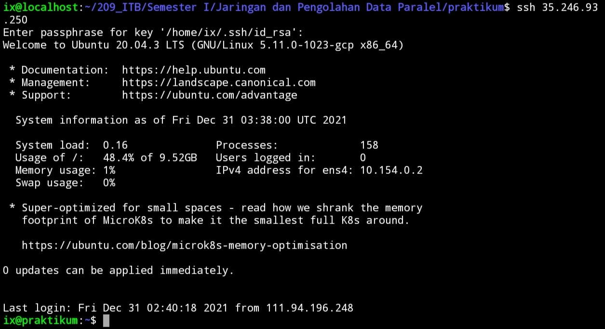

```{r setup, include=FALSE}
knitr::opts_chunk$set(echo = TRUE)

rm(list=ls())
library(dplyr)
library(ggplot2)
```

\newpage
\tableofcontents
\newpage
\listoffigures
\newpage
\listoftables

\newpage

\newpage

# _INTRODUCTION_

## Definisi

_Parallel processing_ adalah metode komputasi untuk menggunakan dua atau lebih _processors_ untuk menjalankan beberapa tugas secara terpisah atau secara keseluruhan. Setiap komputer yang memiliki lebih dari satu _CPUs_ atau memiliki _processor multi cores_ bisa melakukan _parallel processing_ ^[https://searchdatacenter.techtarget.com/definition/parallel-processing].

## Perbedaan _Serial Processing_ dan _Parallel Processing_

Perbedaan mendasar dari _serial processing_ dan _parallel processing_ adalah dari segi bagaimana komputer melakukan proses komputasi. _Serial processing_ berarti komputer melakukan tugasnya secara sekuensial (berurutan) menggunakan satu _processor_. Akibatnya adalah saat melakukan suatu proses yang kompleks, _runtime_ yang diperlukan lebih lama karena _processor_ harus memproses data satu-persatu.

Berbeda halnya dengan _parallel processing_. Tugas yang dilakuan komputer didistribusikan kepada sejumlah _processors_ untuk diolah secara bersamaan. Konsekuensinya adalah _runtime_ komputasi lebih singkat. Namun perlu diperhatikan dengan seksama bahwa tidak semua tugas bisa kita buat paralelisasinya dan cara kita menulis algoritma atau _coding_ harus disesuaikan.

> Kenapa tidak semua tugas bisa diparalelisasi?

Beberapa tugas sekuensial yang tidak bisa dihindari tidak bisa diparalelisasi. 

Sebagai contoh:

1. _Looping_ yang prosesnya tidak saling bergantung bisa diparalelisasi. Misalkan ada suatu fungsi untuk menghitung suatu _array_ bisa diparalelisasi dengan cara memecah _array_ tersebut untuk diproses bersamaan di beberapa _processors_.
1. _Looping_ yang prosesnya saling bergantung tidak bisa diparalelisasi. Misalkan suatu _looping_ ke $i$ nilainya bergantung pada proses _looping_ ke $i-1$.

\newpage

Berikut adalah ilustrasi perbedaan serial dan _parallel processing_:

```{r,include=FALSE}
nomnoml::nomnoml("#direction:down
                 [Serial]
                 [Parallel]
                 
                 [Serial|
                   [A] -> [B]
                   [B] -> [C]
                   [C] -> [D]
                   ]
                   
                 [Parallel|
                   [A] -> [B]
                   [A] -> [C]
                   [B] -> [D]
                   [C] -> [D]
                   ]
                 ","gbr1.png")
```

```{r out.width="35%",echo=FALSE,fig.align='center',fig.cap="Ilustrasi Perbedaan Serial dan Parallel Processing",fig.retina=10}
knitr::include_graphics("gbr1.png")
```

\newpage

## Cara Kerja _Parallel Processing_

Untuk melakukan _parallel processing_, dibutuhkan _hardware_ dan _software_ yang mendukung hal tersebut. Secara _hardware_ dibutuhkan komputer dengan _multiple cores processors_ atau dibutuhkan beberapa komputer yang digabung menjadi satu kesatuan. Secara _software_ dibutuhkan tidak hanya `Python` tapi juga _middleware_ bernama `Open MPI`. Bagian _hardware_ dan _software_ ini akan dibahas pada bagian selanjutnya.

Pada sistem _parallel processing_ terdiri dari beberapa unit _processors_ dan beberapa unit _memory_. Ada dua teknik berbeda yang digunakan untuk mengakses data di unit _memory_, yaitu: _shared memory address_ dan _message passing_.

Berdasarkan cara mengorganisasikan memori ini komputer bisa dibedakan menjadi _shared memory parallel machine_ dan _distributed memory parallel machine_.

Ada empat model komputasi yang dikenal dalam taksonomi Flynn, yaitu:

1. __SISD__ (_Single Instruction, Single Data_)
1. __SIMD__ (_Single Instruction, Multiple Data_)
1. __MISD__ (_Multiple Instruction, Single Data_)
1. __MIMD__ (_Multiple Instruction, Multiple Data_)

### __SISD__

Komputer ini adalah tipikal komputer konvensional yang hanya memiliki satu _processor_ dan satu instruksi yang dieksekusi secara serial. Komputer jenis ini tidak bisa melakukan _parallel processing_.

```{r,include=FALSE}
nomnoml::nomnoml("
		[Input/Output] <-> [Control\nUnit]
		[Control\nUnit] -> [Proc\nUnit]
		[Proc\nUnit] <-> [Memory\nModul]
		[Memory\nModul] -> [Control\nUnit]
		","sisd.png")

```

```{r out.width="45%",echo=FALSE,fig.align='center',fig.cap="Ilustrasi SISD",fig.retina=10}
knitr::include_graphics("sisd.png")
```

### __SIMD__

Komputer ini memiliki lebih dari satu _processor_ tapi hanya mengeksekusi satu instruksi secara paralel pada data yang berbeda pada level _lock-step_. Contohnya adalah komputer vektor.

```{r,include=FALSE}
nomnoml::nomnoml("
		[Input/Output] <-> [Control\nUnit]
		[Control\nUnit] -> [Proc Unit 1]
		[Control\nUnit] -> [Proc Unit 2]
		[Control\nUnit] -> [Proc Unit n]
		
		[Proc Unit 1] <-> [Memory Modul 1]
		[Proc Unit 2] <-> [Memory Modul 2]
		[Proc Unit n] <-> [Memory Modul n]

		[Memory Modul 1] -> [Control\nUnit]
		[Memory Modul 2] -> [Control\nUnit]
		[Memory Modul n] -> [Control\nUnit]
		",
		"simd.png")
```

```{r out.width="45%",echo=FALSE,fig.align='center',fig.cap="Ilustrasi SIMD",fig.retina=10}
knitr::include_graphics("simd.png")
```

### __MISD__

Komputer jenis ini belum diciptakan karena secara arsitekturnya tidak mudah dipahami. Secara teori komputer ini memiliki satu _processor_ dan mengeksekusi beberapa instruksi secara paralel.

### __MIMD__

Komputer berarsitektur ini paling banyak digunakan untuk membangun _super computer_. Komputer ini memiliki lebih dari satu _processors_ dan mengeksekusi lebih dari satu instruksi secara paralel.

## TUGAS PRAKTIKUM 

Pada praktikum ini, saya akan mengerjakan:

- Dua buah tugas terkait penyelesaian integral secara numerik memanfaatkan metode dikritisasi nilai tengah (_midpoint_) dan simulasi Monte Carlo.
- Satu buah tugas terkait penjumlahan dan perkalian matriks $n \times n$.

Ketiga tugas tersebut akan diselesaikan menggunakan serial dan _parallel processing_. 

## _SERVER_ YANG DIGUNAKAN

Pada praktikum kali ini, saya tidak bisa menggunakan _server_ __HPC__ yang disediakan oleh ITB karena masalah koneksi. Oleh karena itu, saya menggunakan _server_ lain agar bisa menduplikasi apa yang seharusnya dikerjakan di _server_ ITB.

Saya menggunakan _server virtual machine_ milik _Google Cloud_^[https://ikanx101.com/blog/vm-cloud/]. _Server_ ini memiliki _processor_ __Intel Xeon__ __8__ ___cores___. _Hostname_ dari _server_ ini saya beri nama `praktikum`.

_Server_ ini disewa menggunakan _free credit_ yang kita dapatkan saat mengaktifkan layanan _Google Cloud_ menggunakan akun _Google_.

\newpage

Berikut adalah spesifikasinya:

```{r out.width="45%",echo=FALSE,fig.align='center',fig.cap="Spesifikasi Server yang Digunakan",fig.retina=10}

```

\newpage

_Server_ ini bisa diakses menggunakan _command line_ menggunakan `ssh` langsung ke _IP Public_ yang diberikan _Google_.

```{r out.width="45%",echo=FALSE,fig.align='center',fig.cap="Tampilan Awal Setelah Login ssh",fig.retina=10}

```

_Server_ ini berjalan di _operating system_ `Ubuntu Linux 20.04 LTS`.

Berikut adalah tampilan hasil `lscpu`:

```{r out.width="45%",echo=FALSE,fig.align='center',fig.cap="lscpu dari Server",fig.retina=10}
knitr::include_graphics("lscpu.jpg")
```

\newpage

Berikut adalah tampilan hasil `htop`:

```{r out.width="45%",echo=FALSE,fig.align='center',fig.cap="htop dari Server",fig.retina=10}
knitr::include_graphics("htop.jpg")
```

## MPI

Secara _default_ `Python` sudah ter-_install_ di _server_ namun tidak untuk `Open MPI`. Oleh karena itu, salah satu langkah yang perlu dilakukan adalah meng-_install_-nya terlebih dahulu^[https://rantahar.github.io/introduction-to-mpi/setup.html]. 

Pada `Ubuntu`, proses instalasinya bisa kita lakukan dengan mengetikkan perintah berikut ini di _command line_:

```
sudo apt install openmpi-bin openmpi-dev openmpi-common openmpi-doc libopenmpi-dev
```

Setelah proses instalasi selesai, kita bisa mengecek versi `Open MPI` yang berjalan di _server_ sebagai berikut:

```{r out.width="45%",echo=FALSE,fig.align='center',fig.cap="Versi MPI yang Digunakan",fig.retina=10}

```

Oleh karena saya menjalankan program `Python` praktikum di _server_ sendiri (tanpa ada _user_ lain), maka saya tidak melakukan instalasi `SLURM`.

\newpage

# _METHOD_

Pada praktikum ini, kita akan melakukan _parallel processing_ menggunakan `Python` versi `3.8.10` di _server_ berbasis `Linux Ubuntu OS`. Ada beberapa metode _parallel processing_ yang hendak dilakukan, yakni:

1. _Broadcast_,
   1. _Broadcast-gather_,
   1. _Broadcast-reduce_,
1. _Scatter_,
   1. _Scatter-reduce_,
   1. _Scatter-gather_,
1. _Gather_,
1. _Reduce_,
1. _Multi-processing_,
1. _Multi-thread_,
1. _Point-to-point_.

Kemudian semua metode _parallel processing_ ini akan dibandingkan _runtime_-nya dengan _serial processing_.

## Metode Integral Numerik

Ada beberapa metode numerik yang bisa digunakan untuk menghitung suatu integral dari fungsi kontinu. Pada praktikum ini, saya akan menggunakan metode titik tengah dan simulasi Monte Carlo untuk mengerjakan dua soal integral numerik.

### Metode Titik Tengah (_Midpoint_)

Metode titik tengah merupakan salah satu cara perhitungan integral numerik dari fungsi kontinu melalui dikritisasi fungsi [@libre]. Prinsip yang digunakan adalah penjumlahan deret __Riemann__.

#### Definisi

Misalkan $f(x)$ kontinu di selang $[a,b]$. Jika diambil suatu $n$ bilangan bulat positif, kita bisa membagi selang tersebut menjadi partisi-partisi kecil berikut: $\Delta x = \frac{b-a}{n}$. 

Tuliskan $m_i = x_i + \frac{\Delta}{2}$ sebagai titik tengah di partisi ke- $i$, maka: $\int_a^b f(x) dx$ bisa didekati dengan $n \sum_{i=1}^n f(x_i^*) \Delta x_i$.

### Simulasi Monte Carlo


# _RESULT AND DISCUSSION_

## Soal I

## Soal II

Perhitungan $\pi$ menggunakan rumus: $4 \times sqrt{1 - x^2}$

## Soal III

# _CONCLUSION_


lalala [@lieberman]

# _REFERENCES_
