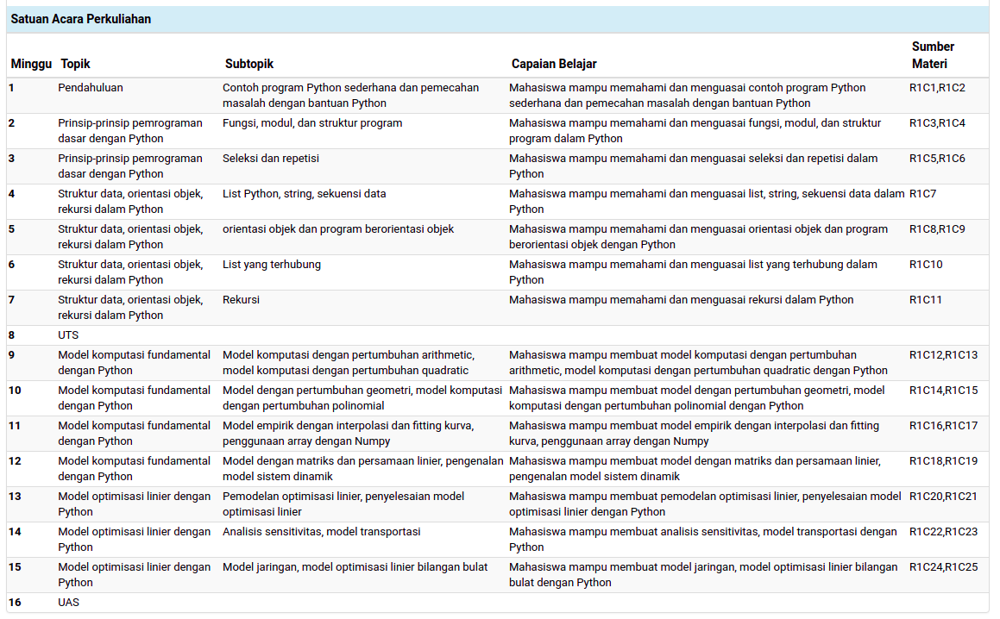
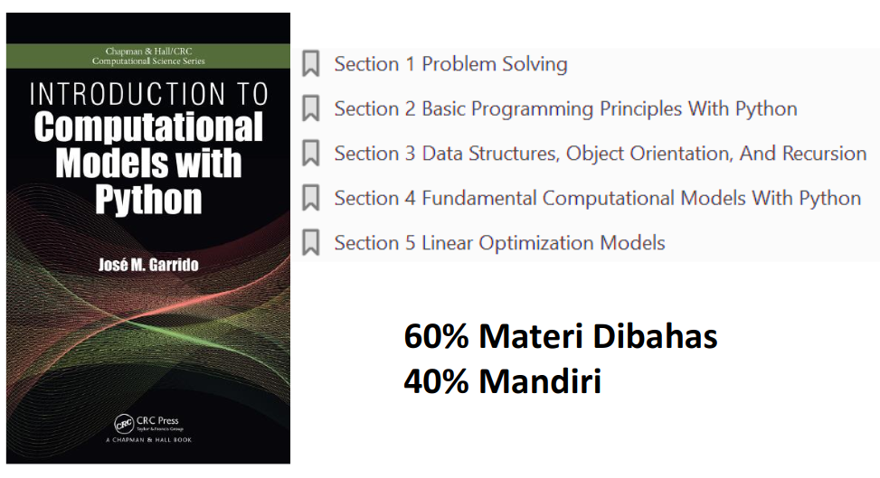
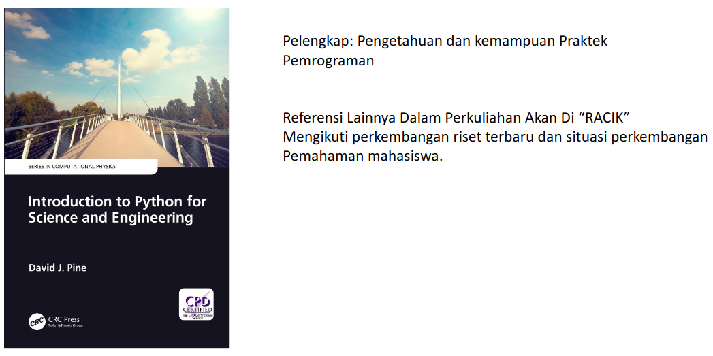
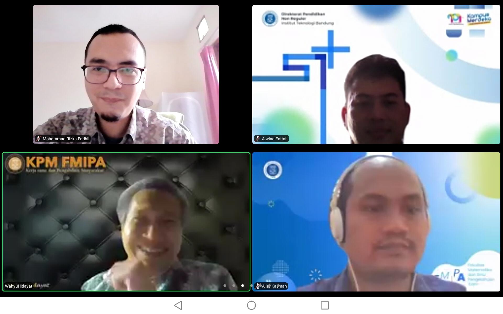
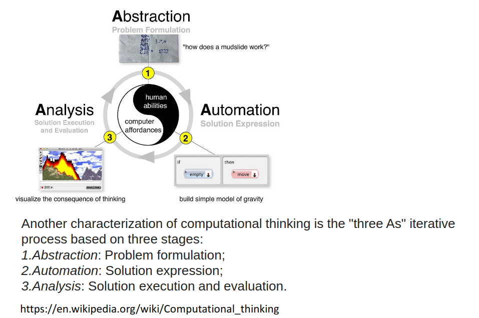
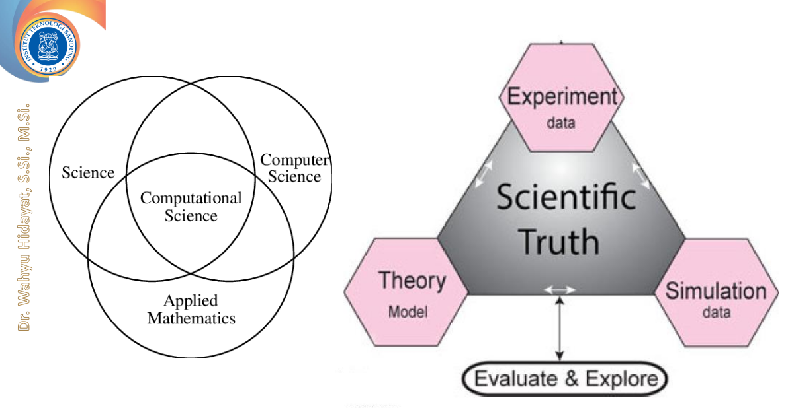
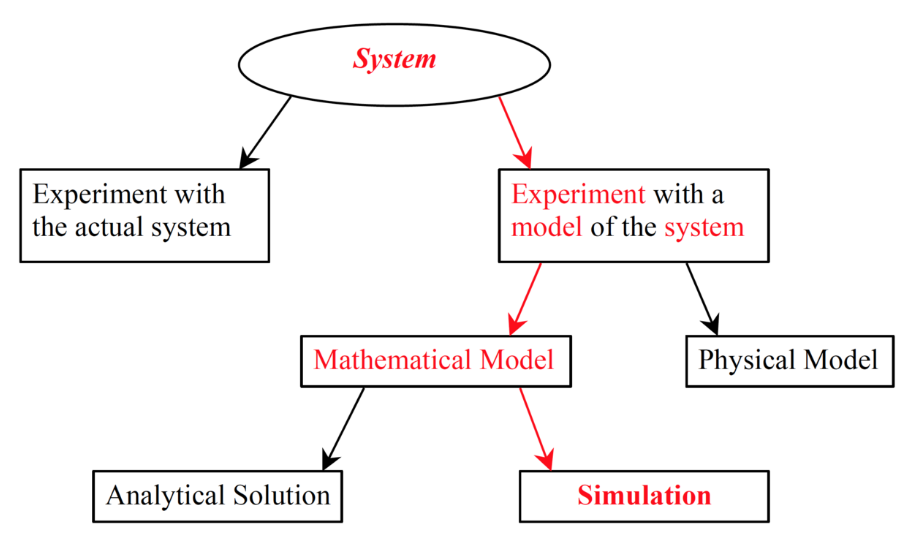

```{r setup, include=FALSE}
knitr::opts_chunk$set(echo = TRUE)
setwd("~/S2 Sains Komputasi ITB/Kuliah/Semester I/Pemrograman dalam Sains")

rm(list=ls())

library(dplyr)
library(ggplot2)
```

# SILABUS {.tabset}

## Keterangan Umum {.tabset}

### Silabus Ringkas	

Kuliah ini dirancang untuk memberikan pemahaman dasar-dasar bahasa pemrograman kepada mahasiswa, khususnya mahasiswa yang tidak memiliki dasar pemrograman.

### Silabus Lengkap

Kuliah ini dirancang untuk memberikan pemahaman dasar-dasar bahasa pemrograman kepada mahasiswa, khususnya mahasiswa yang tidak memiliki dasar pemrograman. Bahasa pemrograman yang akan digunakan dalam kuliah ini adalah bahasa pemrograman Python. Selain dasar-dasar bahasa pemrograman python, kuliah ini juga akan mengaplikasikan bahasa pemrograman Python untuk memodelkan suatu sistem dalam memecahkan permasalahan di bidang sains.

### _Outcomes_

1. Mahasiswa mampu memahami dan menguasai bahasa pemrograman Python.
1. Mahasiswa mampu mengaplikasikan bahasa pemrograman Python untuk membuat model suatu sistem dalam memecahkan permasalahan di bidang sains.

### Panduan Penilaian

```{r}
data.frame(
  ket = c("UTS","UAS","Tugas"),
  persen = c(35,35,30)
) %>% 
  mutate(label = paste0(ket,"\n",persen,"%")) %>% 
  ggplot(aes(x = reorder(ket,-persen),
             y = persen)) +
  geom_col(aes(fill = label),
           color = "black") +
  geom_label(aes(label = label)) +
  labs(title = "Porsi Penliaian Awal Mata Kuliah",
       subtitle = "Pemrograman dalam Sains",
       caption = "Dibuat dengan R\nikanx101.com") +
  theme_minimal() +
  theme(axis.title = element_blank(),
        axis.text = element_blank(),
        legend.position = "none") +
  coord_polar()
```

## Satuan Acara Perkuliahan

```{r out.width="100%",fig.align='center'}

```

## Info Lainnya

Tiga tahun lalu belum ada kuliah ini. Kemudian muncul masalah bahwa mahasiswa S2 tidak memiliki kemampuan algoritma.

## Buku

```{r out.width="100%",fig.align='center'}


```

## Tugas dan Koding

__RBL__ (_Research Based Learning_): Mini _Project Research_ yang dilakukan secara berkelompok, per kelompok mahasiswa terdiri atas 2 orang anggota. Nilai __RBL__ menggantikan salah satu nilai Ujian (UTS atau UAS) yang nilanya paling kecil.

---

# PERTEMUAN MINGGU I 

```{r out.width="50%",fig.align='center',fig.cap="Presensi 24 Agustus 2021"}

```

## _Slides_ Penting

```{r out.width="100%",fig.align='center'}



```

_Mathematical model_ bisa jadi masih gak berbentuk atau belum terjadi sedangkan _physical model_ sudah pasti ada.

## _Useful_

https://towardsdatascience.com/essential-guide-to-translating-between-python-and-r-7cb18b786e5d


