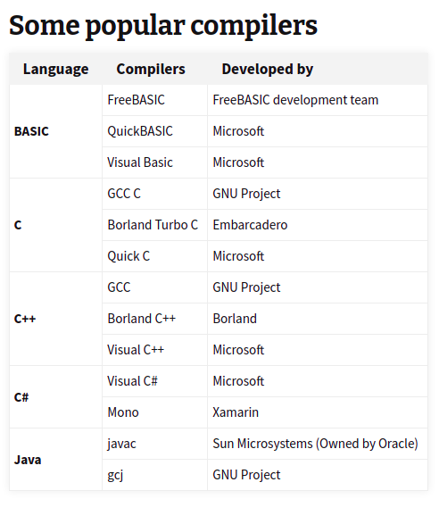

```{r setup, include=FALSE}
knitr::opts_chunk$set(echo = TRUE)
setwd("~/S2 Sains Komputasi ITB/Kuliah/Semester I/Pemrograman dalam Sains/Tugas/Minggu II/Exercise 1 13")
library(dplyr)
library(ggplot2)
```

\newpage
\tableofcontents
\newpage
\listoffigures
\newpage

# SOAL 1.1

> Explain the differences between a computational model and a mathematical model.

## Jawab

Model adalah representasi dari sistem atau masalah. Bisa jadi model hanya berisi bagian tertentu saja dari sistem atau masalah. Suatu model bisa juga lebih sederhana dari masalah sebenarnya asalkan masih relevan dalam beberapa aspek.

_Mathematical model_ adalah formulasi matematis dari suatu permasalahan _real_ sedangkan _computational model_ adalah implementasi model matematika yang bertujuan untuk menyelesaikan permasalahan secara komputasi di komputer.

_Mathematical model_ dituliskan dalam ekspresi matematik sedangkan _computational model_ dituliskan dalam bentuk algoritma.

# SOAL 1.2

> Explain the reason why the concept of abstraction is important in developing computational models.

## Jawab

_Abstraction_ adalah salah satu pilar utama dalam _computational thinking_. Sebelum kita memecahkan suatu masalah secara komputasi, kita perlu mengenal terlebih dahulu permasalahan yang kita temui. Sama halnya dengan melakukan suatu penelitian.

```{r out.width="100%",echo=FALSE,warning=FALSE,message=FALSE,fig.align='center',fig.cap="Flow Melakukan Research"}
knitr::include_graphics("proses riset.png")
```

Salah satu tahap kritis yang paling penting adalah __formulasi masalah__. _Abstraction_ yang baik akan membantu kita memilih elemen esensial dari permasalahan dan memilah mana yang _less importance_.

\newpage
# SOAL 1.3

> Investigate and write a short report on the programming languages used to implement computational models.

## Jawab

Saya akan membahas secara singkat dua _programming languages_ yang familiar bagi saya untuk menjalankan _computational models_, yakni Phyton dan __R__. Keduanya merupakan program _open source_ yang bisa diunduh dan dipakai oleh masyarakat luas. Keduanya juga merupakan _high level programming languages_.

Pada dasarnya Python dan __R__ merupakan program _command line interface_ (__CLI__) yang bisa dijalankan di _multiple_ _operating system_ termasuk di _cloud_ seperti Google Colab^[Menggunakan __R__ di Google Colab. https://ikanx101.com/blog/google-colab/]. Namun ada banyak sekali _integrated development environment_ (__IDE__) yang bisa digunakan.

Baik Python dan __R__ memiliki _packages_ atau _libraries_ yang dikembangkan oleh banyak pihak. _Packages_ tersebut berisi himpunan _function_ dan perintah yang memudahkan komputasi.

Lantas apa saja perbedaannya?

> __R__ is a statistical tool used by academics, engineers and scientists without any programming skills. Python is a production-ready language used in a wide range of industry, research and engineering workflows.^[https://www.ibm.com/cloud/blog/python-vs-r]

> __R__ applications are ideal for visualizing your data in beautiful graphics. In contrast, Python applications are easier to integrate in an engineering environment.

> __R__ programming is better suited for statistical learning, with unmatched libraries for data exploration and experimentation. Python is a better choice for machine learning and large-scale applications, especially for data analysis within web applications.

### Python^[https://www.python.org/] {.unlisted .unnumbered}

Python disebut-sebut sebagai _programming language_ terpopuler dunia saat ini. Python diciptakan oleh Guido van Rossum^[https://en.wikipedia.org/wiki/Guido_van_Rossum], seorang _programmer_ asal Belanda. Bahasa Python dinilai memiliki kesamaan dengan _Perl_, __C__, dan _Java_^[https://en.wikipedia.org/wiki/Python_syntax_and_semantics].

Salah satu ciri khusus pada _script_ Phyton adalah penggunaan _indentation_. Python tidak mengenal penggunaan _bracket_ `{ }` sehingga diganti dengan _indentation_. 

### __R__^[https://cran.r-project.org/] {.unlisted .unnumbered}

__R__ dibuat oleh dua orang _statistician_ Ross Ihaka^[https://en.wikipedia.org/wiki/Ross_Ihaka] and Robert Gentleman^[https://en.wikipedia.org/wiki/Robert_Gentleman_(statistician)]. Oleh karena itu program ini dinamakan __R__, yakni inisial dari nama penemunya.

Salah satu keunggulan __R__ dibandingkan program lainnya adalah keberadaan _portal_ __The R Journal__^[https://journal.r-project.org/], yakni sebuah portal jurnal _open access_ dari berbagai macam _projects_ terkait _statistical computing_.

# SOAL 1.4 

> What is a programming language? Why are they needed?

## Jawab

Otak manusia memiliki keterbatasan dalam hal melakukan komputasi yang kompleks dan repetitif. Oleh karena itu mereka menciptakan alat bantu sehingga mereka bisa menyelesaikan masalah-masalah yang mereka hadapi. Salah satu alat bantu tersebut adalah komputer. Agar komputer bisa mengerjakan apa yang manusia perintahkan, manusia perlu membuat _programming language_ agar manusia dan mesin bisa berinteraksi.

Manusia memberikan kumpulan perintah untuk komputer lakukan komputasi.

# SOAL 1.5 

> Explain why there are many programming languages.

## Jawab

Masing-masing _programming language_ memiliki kelebihan dan kelemahan masing-masing. Hampir tidak ada satu _programming language_ yang __paling cocok__ dengan semua permasalahan komputasi dan tujuan penggunanya. Oleh karena itu ada banyak sekali _programming language_ sehingga pengguna bisa memilih mana yang paling sesuai dengan permasalahan, tujuan, dan preferensinya masing-masing.

\newpage
# SOAL 1.6 

> What are the differences between compilation and interpretation in high-level programming languages?

## Jawab

_Compilation_ berarti proses mengubah bahasa pemrograman menjadi bahasa mesin sehingga bisa dijalankan oleh komputer. 

> Mengubah _high-level language_ ke dalam lo_w-level language_.^[https://codeforwin.org/2017/05/compiler-and-its-need.html]

Salah satu contohnya adalah bahasa pemrograman Pascal yang memungkinkan kita meng-_compile_ algoritma menjadi _excecutable file_ (`.exe`).

Sedangkan _interpretation_ dalam suatu _programming language__ hanya berfungsi untuk mengecek perintah dan melaksanakan perintah yang dimasukkan saat itu saja (saat _software_-nya dipakai).

# SOAL 1.7 

> Explain the purpose of compilation. How many compilers are necessary for a given application? What is the difference between program compilation and program execution? Explain.

## Jawab

Tujuan utama dari _compilation_ adalah agar algoritma yang ada sudah dijadikan bahasa mesin dan dalam _executable files_. Sehingga kita tidak lagi memerlukan (meng-_install_) bahasa pemrograman tersebut ke dalam komputer atau mesin.

_User_ bisa menjalankan langsung algoritma yang ada tanpa harus membuka _interpreter_.

Satu _programming language_ bisa memiliki beberapa _compilers_ tergantung kebutuhan.

\newpage

```{r out.width="50%",echo=FALSE,warning=FALSE,message=FALSE,fig.align='center',fig.cap="Macam-macam Compiler"}

```

Sumber gambar: https://codeforwin.org/2017/05/compiler-and-its-need.html

_Program execution_ dilakukan setelah algoritma dalam suatu _programming language_ ter-_compile_ dan menjadi suatu program. _Program execution_ sudah termasuk ke dalam proses interpretasi tanpa membutuhkan program _compiler_.


# SOAL 1.8 

> What is the real purpose of developing a program? Can we just use a spreadsheet program to solve numerical problems? Explain.

## Jawab

Tujuan pemrograman adalah membuat sekumpulan perintah di komputer sehingga kita bisa menyelesaikan masalah secara otomatis. Pada kasus _numerical problems_, tentu kita bisa menggunakan _spreadsheets_ untuk menyelesaikan permasalahan yang bersifat sederhana. Namun saat masalah yang dihadapi kompleks, tentunya _spreadsheets_ belum cukup untuk bisa dipakai. 

Selain itu, _spreadsheets_ tidak bisa bekerja iteratif secara otomatis. Sehingga masih diperlukan tenaga manusia untuk melakukan komputasi.

Sedangkan dengan membuat algoritma atau _computer codes_, kita bisa menyuruh komputer melakukan itersi secara otomatis. Selain itu ada keuntungan lainnya jika kita melakukan _coding_, yakni _customize-able_ dan _reproducible_.


# SOAL 1.9 

> Explain the differences between data definitions and instructions in a program written in a high-level programming language.

## Jawab

_High-level programming language_ memungkinkan kita memakai bahasa yang lebih mudah untuk berinteraksi dengan komputer. Demikian pula halnya saat kita melakukan:

1. Pendefinisian sesuatu data atau _object_.
    - Pendefinisian biasa dilakukan dengan notasi `=`.
1. Memberikan instruksi atau perintah.
    - Instruksi biasanya menggunakan perintah dalam bahasa Inggris, seperti `for`, `while`, `print`, atau dengan notasi aritmatika seperti `+ - * /`.

\newpage
# SOAL 1.10 

> For developing small programs, is it still necessary to use a software development process? Explain. What are the main advantages in using a process for program development? What are the disadvantages?

## Jawab

Walaupun program yang sedang dibuat merupakan _small programs_, tidak ada salahnya tetap menggunakan _software development process_ yang terdokumentasi dengan baik. Karena dengan adanya dokumentasi yang baik, akan memudahkan kita saat:

1. Melakukan _fine tuning_ atau perbaikan program ke depannya.
1. Melakukan _maintenance_. Terutama saat ada pergantian _developer_ yang terlibat.
1. Menambahkan modul lain ATAU membuat program lain yang memerlukan program kita saat ini sebagai salah satu modul pelengkap.

\center

# == END == {.unlisted .unnumbered}
