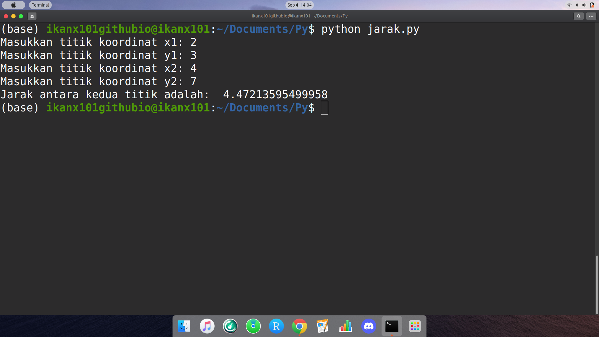
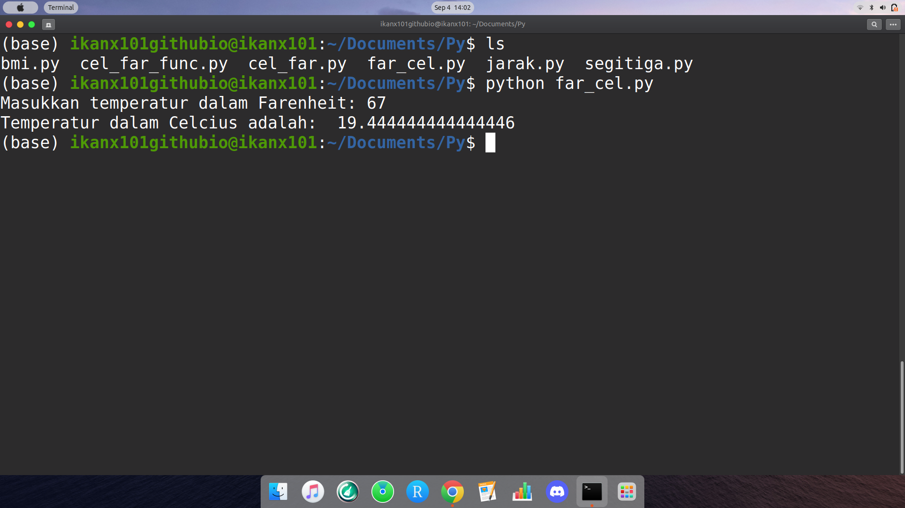
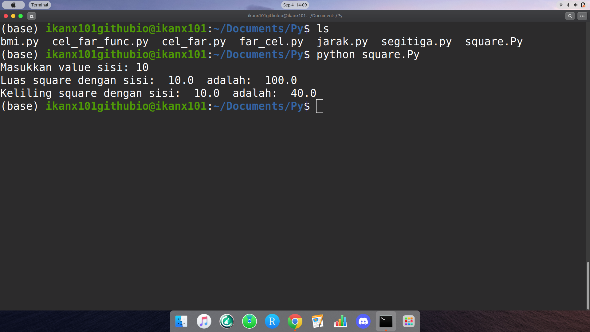
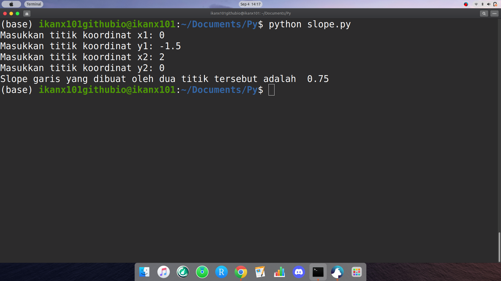

```{r setup, include=FALSE}
knitr::opts_chunk$set(echo = TRUE)
setwd("~/S2 Sains Komputasi ITB/Kuliah/Semester I/Pemrograman dalam Sains/Tugas/Minggu II/Exercise 2 11")
library(dplyr)
library(ggplot2)
```

\newpage
\tableofcontents
\newpage
\listoffigures
\newpage

# SOAL 2.1

> Why are functions defined and used in programs? Explain.

## Jawab

Pada Python, kita bisa membuat _custom function_ sendiri. Gunanya adalah agar _set_ perintah yang biasa kita gunakan berulang bisa menjadi lebih singkat penulisannya.

# SOAL 2.2

> Develop a computational model (with a Python program) that computes the area of a right triangle given values of the altitude and the base.

## Jawab

Luas segitiga siku-siku bisa dihitung dengan rumus berikut:

$$L = \frac{1}{2} at$$

Dengan $a$ adalah alas dan $t$ adalah tinggi. Dalam Phtyon:

```
a = input("Masukkan alas segitiga: ")
t = input("Masukkan tinggi segitiga: ")
a = float(a)
t = float(t)
L = (1/2)*(a*t)
L = round(L,4)
print("Luas segitiganya adalah: ",L)
```

Saya simpan sebagai _file_ bernama `segitiga.py` (terlampir).

\newpage

Berikut jika di-_run_ di _terminal_:

```{r out.width="100%",echo=FALSE,warning=FALSE,message=FALSE,fig.align='center',fig.cap="Run Program Segitiga di Terminal Linux"}
knitr::include_graphics("Screenshot from 2021-09-03 18-02-39.png")
```

\newpage

# SOAL 2.3

> Develop a computational model (with a Python program) that computes the distance between two points in a plane: $P_1$ with coordinates $(x_1,y_1)$, and $P_2$ with coordinates $(x_2 , y_2)$. Use the coordinate values: $(2, 3)$ and $(4, 7)$.

## Jawab

Mari kita lihat terlebih dahulu gambar sebagai berikut:

```{r,echo=FALSE,warning=FALSE,message=FALSE,fig.align='center',fig.cap="Ilustrasi Perhitungan Jarak"}
data = data.frame(x = c(2,4),
                  y = c(3,7))

data %>% 
  ggplot(aes(x,y)) +
  geom_point(size = 5) +
  coord_equal() +
  xlim(0,10) +
  ylim(0,10) +
  geom_line(linetype = 2,
            size = .25,
            color = "darkred") +
  geom_segment(x = 2, xend = 4,
               y = 3, yend = 3,
               color = "steelblue",
               linetype = 2) +
  geom_segment(x = 4, xend = 4,
               y = 3, yend = 7,
               color = "steelblue",
               linetype = 2)

```

Jarak kedua titik bisa dipandang sebagai sisi miring dari segitiga siku-siku yang dibentuk.

\newpage

Secara _simple_, _script_-nya adalah sebagai berikut:

```
x1 = input("Masukkan titik koordinat x1: ")
y1 = input("Masukkan titik koordinat y1: ")
x2 = input("Masukkan titik koordinat x2: ")
y2 = input("Masukkan titik koordinat y2: ")

x1 = int(x1)
x2 = int(x2)
y1 = int(y1)
y2 = int(y2)

del_x = (x1-x2)**2
del_y = (y1-y2)**2

import math
jarak = math.sqrt(del_x + del_y)

print("Jarak antara kedua titik adalah: ",jarak)
```

Saya simpan sebagai _file_ bernama `jarak.py`. Jika saya _run_ di _terminal_ dengan memasukkan titik $(2, 3)$ dan $(4, 7)$, berikut hasilnya:

```{r out.width="100%",echo=FALSE,warning=FALSE,message=FALSE,fig.align='center',fig.cap="Run Program Jarak di Terminal Linux"}

```

\newpage

# SOAL 2.4

> Develop a computational model that computes the temperature in Celsius, given the values of the temperature in Fahrenheit.

## Jawab

Untuk mengkonversi temperatur dari Farenheit ke Celcius, kita akan menggunakan formula sebagai berikut:

$$C = \frac{5}{9} (F - 32)$$

Dalam skrip Python:

```
F = input("Masukkan temperatur dalam Farenheit: ")
F = float(F)
C = (5/9) * (F - 32)
print("Temperatur dalam Celcius adalah: ",C)
```

Saya simpan sebagai _file_ bernama `far_cel.py`. Jika saya _run_ di _terminal_, berikut hasilnya:

```{r out.width="100%",echo=FALSE,warning=FALSE,message=FALSE,fig.align='center',fig.cap="Run Program Konversi Temperatur Terminal Linux"}

```


\newpage

# SOAL 2.5

> Develop a computational model that computes the circumference and area of a square, given the values of its sides.

## Jawab

Untuk menghitung luas dan keliling suatu _square_, kita akan gunakan formula $L = sisi^2$ dan $kll = 4.sisi$. Berikut adalah Python programnya:

```
sisi = input("Masukkan value sisi: ")
sisi = float(sisi)

luas = sisi**2
kll = 4*sisi

print("Luas square dengan sisi: ",sisi," adalah: ",luas)
print("Keliling square dengan sisi: ",sisi," adalah: ",kll)
```

Saya simpan sebagai _file_ bernama `square.py`. Jika saya _run_ di _terminal_, berikut hasilnya:

```{r out.width="100%",echo=FALSE,warning=FALSE,message=FALSE,fig.align='center',fig.cap="Run Program Square Terminal Linux"}

```

\newpage

# SOAL 2.6

> Develop a computational model (with a Python program) that computes the slope of a line between two points in a plane: $P_1$ with coordinates $(x_1 , y_1 )$, and $P_2$ with coordinates $(x_2 , y_2 )$. Use the coordinate values: $(0,- \frac{3}{2})$ and $(2, 0)$.

## Jawab

Untuk menghitung _slope_ atau _gradient_^[https://en.wikipedia.org/wiki/Slope], kita akan gunakan formula: $m = \frac{y_2 - y_1}{x_2 - x_1}$.

Program Python-nya adalah sebagai berikut:

```
x1 = input("Masukkan titik koordinat x1: ")
y1 = input("Masukkan titik koordinat y1: ")
x2 = input("Masukkan titik koordinat x2: ")
y2 = input("Masukkan titik koordinat y2: ")

x1 = float(x1)
x2 = float(x2)
y1 = float(y1)
y2 = float(y2)

atas = y2 - y1
bawah = x2 - x1

m = atas / bawah

print("Slope garis yang dibuat oleh dua titik tersebut adalah ",m)
```

\newpage

```{r,echo=FALSE,warning=FALSE,message=FALSE,fig.align='center',fig.cap="Ilustrasi Perhitungan Slope"}
data = data.frame(x = c(0,2),
                  y = c(-3/2,0))

data %>% 
  ggplot(aes(x,y)) +
  geom_point(size = 5) +
  coord_equal() +
  xlim(-3,3) +
  ylim(-3,3) +
  geom_line(linetype = 2,
            size = .25,
            color = "darkred") 
```

\newpage

Saya simpan sebagai _file_ bernama `slope.py`. Jika saya _run_ di _terminal_, berikut hasilnya:

```{r out.width="100%",echo=FALSE,warning=FALSE,message=FALSE,fig.align='center',fig.cap="Run Program Slope Terminal Linux"}

```

\center
# == END == {.unlisted .unnumbered}
