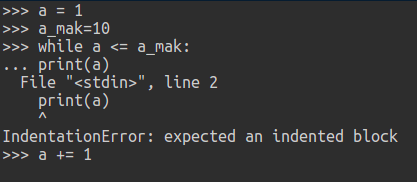
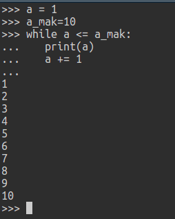
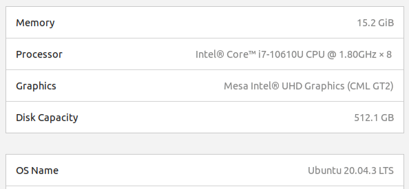
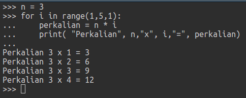
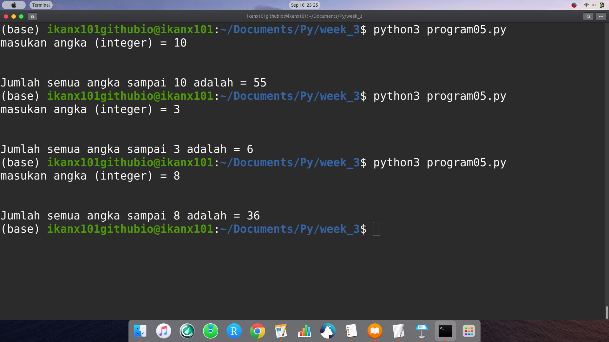
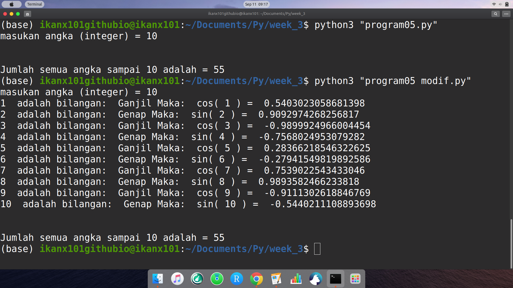
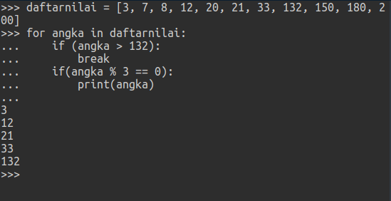

```{r setup, include=FALSE}
knitr::opts_chunk$set(echo = TRUE)
setwd("~/209_ITB/Semester I/Pemrograman dalam Sains/Minggu III")
rm(list=ls())

library(dplyr)
```

# SOAL 1

Eksekusi program _python_ berikut:

```
a = 1
a_mak=10
while a <= a_mak:
print(a)
a += 1
```

_Paste_ tampilan _output_ dari program:

```{r out.width="40%",echo=FALSE,fig.align='center'}

```

Mengapa ada _error_ (jika ada), dan mengapa posisi baris program no 4 dan 5 tidak boleh lurus sejajar (rata kiri) dengan while pada baris program 3, jadi program hanya bisa berjalan dengan baik menghasilkan angka 1 sampai 10 jika seperti di bawah ini:

__Program 01__

```
a = 1
a_mak=10
while a <= a_mak:
   print(a)
   a += 1
```

```{r out.width="40%",echo=FALSE,fig.align='center'}

```

__Jelaskan:__

---

_Python_ tidak mengenal penggunaan _bracket_ `{}` sehingga pada perintah-perintahnya (baik _conditional_, _looping_, definisi _function_) menggunakan _indentation_ sebagai pemisah antara proses yang satu dengan yang lainnya. Pada kasus ini, _indentation_ pada baris __4 dan 5__ bertujuan agar Python melakukan _looping_ perintah-perintah pada baris __4 dan 5__. 

---

\newpage

Buatlah tabel lamanya waktu eksekusi program jika program di modifikasi menjadi:

__Program 02__

```
import math
import time

start = time.time()

a = 1
a_mak=10
while a <=a_mak:
  y = math.sin(a)
  print(a," ",y)
  a += 1
 
time.sleep(1)
end = time.time()
print(f"Program memerlukan waktu {end - start}")
```

Lalu ubahlah nilai `a_mak = 10` diganti ganti nilainya, seperti tabel dibawah ini (isilah bagian dari tabel yang kosong setiap mengeksekusi program setelah mengganti `a_mak`).

```{r,echo=FALSE,message=FALSE,warning=FALSE}
options(scipen = 99)
library(flextable)

run = data.frame(
  No = c(1:6)
) %>% 
  mutate(amax = 10^No)

run$waktu = c(1.001340627670288,
              1.002103328704834,
              1.0129847526550293,
              1.057699203491211,
              1.6413500308990479,
              7.507390975952148
              )

run %>% 
  rename("Nilai a_max=" = amax,
         "Waktu (dalam second)" = waktu) %>% 
  flextable() %>% 
  autofit()

```

\newpage

Tuliskan spek umum komputer yang anda pakai saat mengeksekusi program ini, beri penjelasan terhadap tabel diatas melihat data waktu.

```{r out.width="40%",echo=FALSE,fig.align='center'}

```

Penjelasan terhadap waktu yang diperlukan untuk running:

---

Terlihat bahwa semakin tinggi nilai `a_mak` mengakibatkan _processing time_ semakin lama karena komputer disuruh menghitung $sin(a_i)$ dan mengeluarkan _output_-nya dengan perintah `print()` sebanyak `a_mak` kali.

---

Ubahlah __Program 01__ yaitu program yang menerapkan proses pengulangan (_repetition_) dengan perintah `while()`, untuk mendapatkan keluaran (_output_) yang sama lakukanlah modifikasi dan gunakan `for()`, tulis programnya di bawah ini:

__Program 03__

---

```
a = 1
a_mak=10
for i in range(a,(a_mak + 1),1):
  print(i)
```

---

\newpage

# SOAL 2

Eksekusi program _python_ berikut:

__Program 04__

```
n = 3
for i in range(1,5,1):
    perkalian = n * i
    print( "Perkalian", n,"x", i,"=", perkalian)
```

_Paste_ tampilan _output_ dari program:

```{r out.width="40%",echo=FALSE,fig.align='center'}

```

Beri penjelasan apa fungsi `range(1,5,1)`

---

Membuat _sequence_ angka dari `1` sampai `5-1` dengan jeda sebesar `1`.

---

Apa yang harus diubah jika saya ingin menghasilkan _output_:

```
Perkalian 6 x 1 = 6
Perkalian 6 x 4 = 24
Perkalian 6 x 7 = 42
Perkalian 6 x 10 = 60
Perkalian 6 x 13 = 78
Perkalian 6 x 16 = 96
Perkalian 6 x 19 = 114
```

Tulis modifikasi __Program 04__ menjadi:

```
n = 6
for i in range(1,20,3):
    perkalian = n * i
    print( "Perkalian", n,"x", i,"=", perkalian)
```

# SOAL 3

Eksekusi program python berikut:

__Program 05__

```
jumlah = 0
n = int(input("masukan angka (integer) = "))
for i in range(1, n + 1, 1):
    jumlah += i
print("\n")
print("Jumlah semua angka sampai", n ,"adalah =", jumlah)
```

_Paste_ tampilan _output_ dari program:

```{r out.width="40%",echo=FALSE,fig.align='center'}

```

__Program 05__ adalah program menghitung total penjumlahan semua angka (bilangan bulat) sampai angka `n` (sebagai contoh jika `n=2` maka kita menjumlahkan `1+2=3`). Lakukan modifikasi __Program 05__ dengan menerapkan perintah _selection_ `if else`. Dimana untuk `i` bilangan genap kita ingin `print` (di layar/ada _output_) hasil $y=sin(i)$, sementara untuk `i` bilangan ganjil kita ingin `print` hasil $z=cos(i)$. Lihat juga __Program 02__ sebagai bahan belajar. 

\newpage

Tulis program modifikasi dari __Program 05__ di bawah ini:

---

```
import math
jumlah = 0
n = int(input("masukan angka (integer) = "))
for i in range(1, n + 1, 1):
    jumlah += i
    if i % 2 == 0:
      y = math.sin(i)
      pesan = "Genap"
      fungsi = "sin("
    else:
      y = math.cos(i)
      pesan = "Ganjil"
      fungsi = "cos("
    print(i," adalah bilangan: ",pesan,"Maka: ",fungsi,i,") = ",y)
print("\n")
print("Jumlah semua angka sampai", n ,"adalah =", jumlah)
```

```{r out.width="40%",echo=FALSE,fig.align='center'}

```

---

\newpage

# SOAL 4

Eksekusi program python berikut

__Program 06__

```
daftarnilai = [3, 7, 8, 12, 20, 21, 33, 132, 150, 180, 200]
for angka in daftarnilai:
    if (angka > 132):
        break
    if(angka % 3 == 0):
        print(angka)
```

Jelaskan setiap baris program di atas dengan menganalisis outputnya juga:

```{r out.width="40%",echo=FALSE,fig.align='center'}

```

---

- Baris pertama adalah pendefinisian _array_ berisi angka [3, 7, 8, 12, 20, 21, 33, 132, 150, 180, 200]. Ada 11 elemen dalam _array_ ini.
- Baris kedua adalah melakukan _looping_ sebanyak 11 kali karena memakai `daftarnilai` sebagai basis loopingnya. 
- Pada baris ketiga, ada _if conditional_, yakni saat ditemukan `angka` dari _array_ `daftarnilai` yang melebihi angka 132, proses _looping_ __berhenti__.
- Pada baris kelima, ada _if conditional_, yakni saat `angka` dari _array `daftarnilai` __habis dibagi 3__, ada perintah _print_ `angka` tersebut.

---
