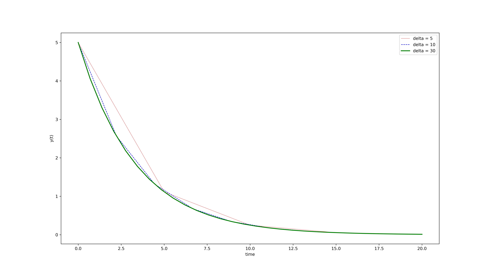
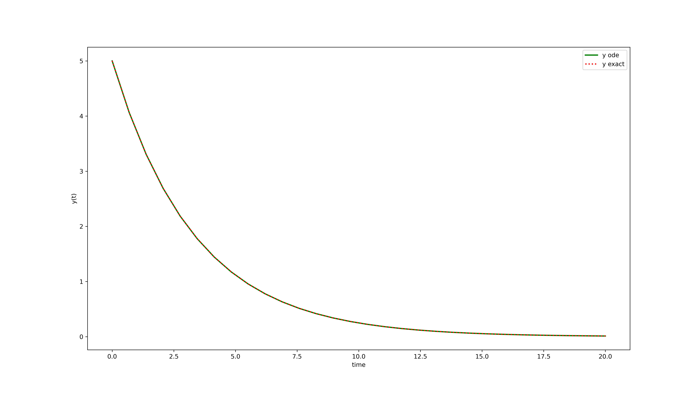
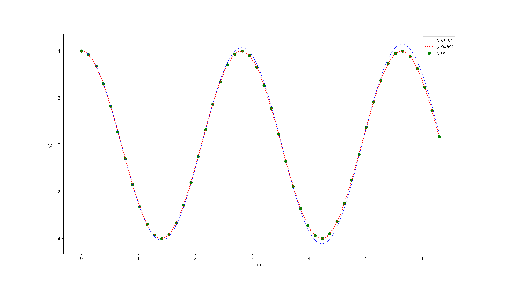
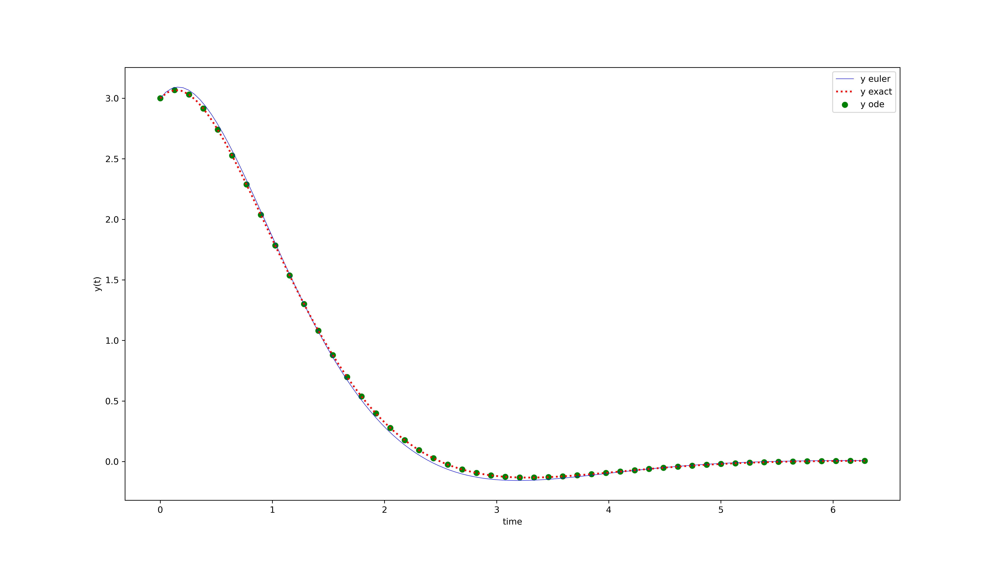

```{r setup, include=FALSE}
knitr::opts_chunk$set(echo = TRUE)
```

# SOAL 1

Selesaikan persamaan diferensial berikut dengan `odeint` pada Python:

$$\frac{dy}{dt} = -k y(t)$$

dengan $k=0.3$ dan $y_0 = 5$. 

- Bandingkan saat kita menggunakan `linspace` dengan banyak titik yang berbeda-beda.
- Bandingkan dengan solusi eksak: $y(t) = y_0 e^{-kt}$.

## JAWAB

Untuk menjawabnya soal yang pertama, saya akan definisikan selang sebagai berikut:

- $\Delta_1 = 5$,
- $\Delta_1 = 10$,
- $\Delta_1 = 20$,

Kita akan buat beberapa $t$ dengan `linspace` yang berbeda-beda selangnya. Berikut adalah perintahnya:

```
import numpy as np
from scipy.integrate import odeint
import matplotlib.pyplot as plt

# initial condition
y0 = 5
k = 0.3

# definisi selang t
delta_1 = 5
delta_2 = 10
delta_3 = 30

# function that returns dy/dt
def model(y,t):
    dydt = -k * y
    return dydt

# time points
t_1 = np.linspace(0,20,delta_1)
t_2 = np.linspace(0,20,delta_2)
t_3 = np.linspace(0,20,delta_3)

# solve ODE
y_1 = odeint(model,y0,t_1)
y_2 = odeint(model,y0,t_2)
y_3 = odeint(model,y0,t_3)

# plot results
plt.figure(figsize = (16,9))
plt.plot(t_1,y_1,color = "red",linewidth=0.5,linestyle="--",label='delta = 5')
plt.plot(t_2,y_2,color = "blue",linewidth=1,linestyle="--",label='delta = 10')
plt.plot(t_3,y_3,color = "green",linewidth=2,linestyle="-",label='delta = 30')
plt.xlabel('time')
plt.ylabel('y(t)')
plt.legend()
plt.savefig('soal_1.png',dpi = 450)
```

Berikut adalah plot hasilnya:

```{r out.width="100%",echo=FALSE,fig.retina=10,fig.align='center',fig.cap="Perbandingan Nilai Delta Terhadap Smoothness Grafik y(t)"}

```

Terlihat bahwa semakin besar $\Delta$ yang diambil, plotnya semakin _smooth_.

Sekarang kita akan bandingkan nilai hasil `odeint` dengan nilai eksaknya. Saya akan bandingkan saat `odeint` di $\Delta=30$ dengan nilai eksakya. Saya akan gunakan perintah sebagai berikut:

```
import numpy as np
from scipy.integrate import odeint
import matplotlib.pyplot as plt

# initial condition
y0 = 5
k = 0.3

# definisi selang t
delta = 30

# function that returns dy/dt
def model(y,t):
    dydt = -k * y
    return dydt

# fungsi solusi eksak
def y(t):
    y = y0*np.exp(-k*t)
    return y

# time points
t = np.linspace(0,20,delta)

# solve ODE
y_ode = odeint(model,y0,t)

# y eksak
y_exact = y(t)

# plot results
plt.figure(figsize = (16,9))
plt.plot(t,y_ode,color = "green",linewidth=2,linestyle="-",label='y ode')
plt.plot(t,y_exact,color = "red",linewidth=2,linestyle="dotted",label='y exact')
plt.xlabel('time')
plt.ylabel('y(t)')
plt.legend()
plt.savefig('soal_1b.png',dpi = 450)
```

Berikut adalah plot-nya:

```{r out.width="100%",echo=FALSE,fig.retina=10,fig.align='center',fig.cap="Perbandingan Hasil odeint dengan Solusi Eksak"}

```

Terlihat bahwa garis hijau dan merah berhimpit sempurna. Kesimpulannya hasil dari `odeint` sudah sama dengan solusi eksak.

\newpage

# SOAL 2

Selesaikan persamaan diferensial berikut dengan `odeint` pada Python:

$$\frac{d^2y}{dt^2} + \frac{k}{m} y(t) = 0$$

dengan kondisi:

- Suatu $k,m$ tertentu. 
- $y(0)$ dan $\frac{dy(0)}{dt}$ tertentu. 

Bandingkan hasil `odeint`, analitik, dan numeriknya!

## JAWAB

Jika kita buat pemisalan berikut:

- $\frac{k}{m} = 5$.
- $y(0) = 4$.
- $\frac{dy(0)}{dt} = 0$.

maka kita dapatkan solusi eksak:

$$y = 4 \cos (\sqrt{5} t)$$


Untuk metode numerik yang saya pilih adalah metode _Euler_. Saya akan tuliskan:

$$y'' + 5 y = 0,y(0) = 4,y'(0) = 0$$

Misalkan:

$$v = y'$$

Sehingga bentuknya menjadi:

$$v' = -5y,y(0)=4,v(0) = 0$$

Misalkan $z_k$ adalah hampiran di $y(t)$ dan $w_k$ adalah hampiran di $v(t)$. Maka:

$$z_{k+1} = z_k + \Delta t w_k, z_0 = 4$$

$$w_{k+1} = w_k + \Delta t (-5 z_k), w_0 = 0$$

Dengan $\Delta t = 0.005$.

Saya akan buat hitung solusinya dan membuat grafik pada selang $[0,2 \pi]$.

```
import numpy as np
from scipy.integrate import odeint
import matplotlib.pyplot as plt

# initial condition
y0 = [4,0]

# definisi selang t
delta_1 = 50
delta_2 = 100

# time points
t_eksak = np.linspace(0,2*np.pi,delta_2)
t_ode = np.linspace(0,2*np.pi,delta_1)

# function that returns dy/dt
def model(y,t):
    return(y[1], - 5*y[0])

# fungsi solusi eksak
def y(t):
    y = 4 * np.cos(np.sqrt(5)*t)
    return y

# solve ODE
y_ode_hit = odeint(model,y0,t_ode)
y_ode = y_ode_hit[:,0]

# y eksak
y_exact = y(t_eksak)

# =============================
# metode euler
a = float(0)
b = float(2*np.pi)
h = float(0.005)
n = int((b-a)/h) 
z = np.zeros(n)
z[0] = 4
w = np.zeros(n)
w[0] = 0
for k in range(0,(n-1)):
  z[k+1] = z[k] + h*w[k]
  w[k+1] = w[k] + h * -5 * z[k]
y_euler = z
t_euler = np.linspace(a,b,n)

# =============================
# plot results
plt.figure(figsize = (16,9))
plt.scatter(t_ode,y_ode,color = "green",label='y ode')
plt.plot(t_euler,y_euler,color = "blue",label='y euler',linewidth=.5,linestyle="-")
plt.plot(t_eksak,y_exact,color = "red",linewidth=2,linestyle="dotted",label='y exact')
plt.xlabel('time')
plt.ylabel('y(t)')
plt.legend()
plt.savefig('soal_2.png',dpi = 450)
```

Berikut adalah plot-nya:

```{r out.width="100%",echo=FALSE,fig.retina=10,fig.align='center',fig.cap="Perbandingan Hasil odeint, Solusi Eksak, dan Solusi Metode Euler"}

```

Dapat dilihat bahwa `odeint` berhimpit dengan nilai eksak (analitisnya). Namun metode _Euler_ menghasilkan _error_ tertentu. Agar lebih akurat, kita bisa memperkecil selang pada metode _Euler_.

\newpage

# SOAL 3

Selesaikan persamaan diferensial berikut dengan `odeint` pada Python:

$$\frac{d^2y}{dt^2} + \frac{k}{m} y(t) = -b \frac{dy}{dt}$$

dengan kondisi:

- Suatu $k,m$ tertentu. 
- $y(0)$ dan $\frac{dy(0)}{dt}$ tertentu. 

Bandingkan hasil `odeint`, analitik, dan numeriknya!

## JAWAB

Jika kita buat pemisalan berikut:

- $\frac{k}{m} = 2$.
- $b = 2$.
- $y(0) = 3$.
- $\frac{dy(0)}{dt} = 1$.

maka kita dapatkan solusi eksak:

$$y = e^{-t} (3 \cos (t) + 4 \sin (t))$$

Untuk metode numerik yang saya pilih adalah metode _Euler_. Saya akan tuliskan:

$$y'' + 2 y' + 2 y = 0,y(0) = 3,y'(0) = 1$$

Misalkan:

$$v = y'$$

Sehingga bentuknya menjadi:

$$v' = -2v - 2 y,y(0) = 3,v(0) = 1$$

Misalkan $z_k$ adalah hampiran di $y(t)$ dan $w_k$ adalah hampiran di $v(t)$. Maka:

$$z_{k+1} = z_k + \Delta t w_k, z_0 = 4$$

$$w_{k+1} = w_k + \Delta t (-2 w_k - 2 z_k), w_0 = 0$$

Dengan $\Delta t = 0.05$.

Saya akan buat hitung solusinya dan membuat grafik pada selang $[0,2 \pi]$.

```
import numpy as np
from scipy.integrate import odeint
import matplotlib.pyplot as plt

# initial condition
y0 = [3,1]

# definisi selang t
delta_1 = 50
delta_2 = 100

# time points
t_eksak = np.linspace(0,2*np.pi,delta_2)
t_ode = np.linspace(0,2*np.pi,delta_1)

# function that returns dy/dt
def model(y,t):
    return(y[1], - 2*y[1] - 2*y[0])

# fungsi solusi eksak
def y(t):
    y = np.exp(-t) * (3*np.cos(t) + 4*np.sin(t))
    return y

# solve ODE
y_ode_hit = odeint(model,y0,t_ode)
y_ode = y_ode_hit[:,0]

# y eksak
y_exact = y(t_eksak)

# =============================
# metode euler
a = float(0)
b = float(2*np.pi)
h = float(0.05)
n = int((b-a)/h) 
z = np.zeros(n)
z[0] = 3
w = np.zeros(n)
w[0] = 1
for k in range(0,(n-1)):
  z[k+1] = z[k] + h*w[k]
  w[k+1] = w[k] + h * ((-2*w[k]) - (2*z[k]))
y_euler = z
t_euler = np.linspace(a,b,n)

# =============================
# plot results
plt.figure(figsize = (16,9))
plt.scatter(t_ode,y_ode,color = "green",label='y ode')
plt.plot(t_euler,y_euler,color = "blue",label='y euler',linewidth=.5,linestyle="-")
plt.plot(t_eksak,y_exact,color = "red",linewidth=2,linestyle="dotted",label='y exact')
plt.xlabel('time')
plt.ylabel('y(t)')
plt.legend()
plt.savefig('soal_3.png',dpi = 450)
```

```{r out.width="100%",echo=FALSE,fig.retina=10,fig.align='center',fig.cap="Perbandingan Hasil odeint, Solusi Eksak, dan Solusi Metode Euler"}

```

Dapat dilihat bahwa `odeint` berhimpit dengan nilai eksak (analitisnya). Namun metode _Euler_ menghasilkan _error_ tertentu. Agar lebih akurat, kita bisa memperkecil selang pada metode _Euler_.


