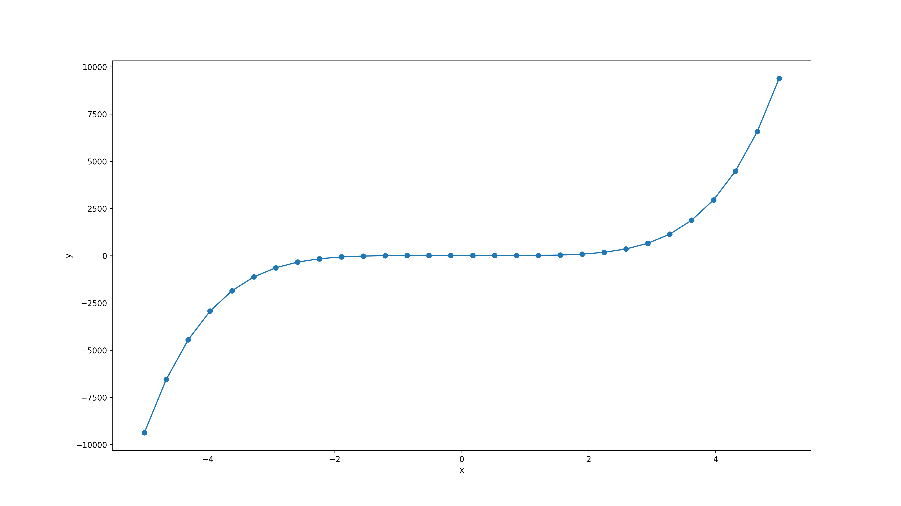
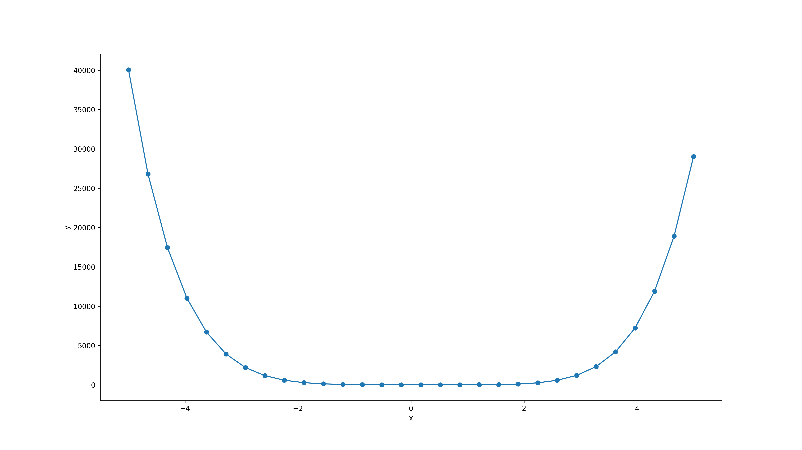

```{r setup, include=FALSE}
knitr::opts_chunk$set(echo = TRUE)

rm(list=ls())
library(dplyr)
library(ggplot2)

gambar_fx = function(f,a,b,delta){
  temp = data.frame(
    x = seq(a,b,by = delta)
  ) %>% 
    mutate(y = f(x)) %>% 
    filter(!is.nan(y))
  subtitle = paste0("Pada selang [",a,",",b,"]")
  caption = "Digambar dengan R\nikanx101.com"
  temp %>% 
    ggplot(aes(x,y)) +
    geom_line(color = "steelblue") +
    theme_minimal() +
    labs(title = "Grafik f(x)",
         subtitle = subtitle,
         caption = caption)
   
}

```

\newpage
\tableofcontents
\newpage
\listoffigures
\newpage

# TASK 1

## Soal

__15.1__ Develop a Python program to evaluate polynomial function $y = x^4 + 4x^2 +7$. Find an appropriate interval of $x$ for which the function evaluation is done and plot the graph.

__15.4__ Develop a Python program to solve the polynomial function $y = x^4 + 4x^2 + 7$.

## Jawab

```{r,include=FALSE,message=FALSE,warning=FALSE,fig.retina = 10,fig.cap = "Gambar 15.1"}
f = function(x){x^4 + 4*x^2 + 7}
a = -5
b = 5
delta = .05
gambar_fx(f,a,b,delta)
```

Untuk menyelesaikan soal ini (menghitung nilai $x$ dan $y=f(x)$ lalu menggambar dan mencari akar), saya akan gunakan program _Python_ berikut ini:

```
# SOAL 15.1

import numpy as np
from numpy.polynomial.polynomial import polyval
from numpy.polynomial.polynomial import polyroots
import matplotlib.pyplot as plt

# pecah data menjadi 30 selang
# initial condition
M = 30     # number of data points
xi = -5.0  # first value of x
xf = 5.0   # final value

# membuat x dan y = f(x)
x = np.linspace(xi, xf, M)

# koefisien polinomial
c = np.array([7,0,4,0,1])
print ("Coefficient list")
print (c)

# menghitung y = f(x)
y = polyval(x, c)

# print (x,y)
# kita bulatkan menjadi 4 angka di belakang koma
print ("Evaluating a polynomial")

# save ke dalam csv
# memberikan nama file
f = open("15_1.csv","w+")

for j in range(M):
     print (j,". x = ",round(x[j],4),"; y = ",round(y[j],4))
     f.write(str(j)+","+str(round(x[j],4))+","+str(round(y[j],4))+"\n")

# save file
f.close()

# mencari akar
r = polyroots(c)
print("The roots: ")
print(r)

# menggambar dan menyimpan plot
plt.figure(figsize = (16,9))
plt.plot(x,y,'o-')
plt.xlabel('x')
plt.ylabel('y')
plt.savefig('15_1.png',dpi = 250)
```

Berikut adalah gambar grafiknya:

```{r out.width = "100%",echo=FALSE,message=FALSE,warning=FALSE,fig.retina = 10,fig.cap = "Gambar 15.1"}
knitr::include_graphics("15_1.png")
```

Berikut adalah nilai $x,y$ dari fungsi di atas:

```{r,echo=FALSE}
data = read.csv("15_1.csv")
colnames(data) = c("j","x[j]","y[j]")
data
```

Dari grafik dan data yang ada, terlihat bahwa $f(x)$ tidak memiliki akar _real_. Sehingga bisa diduga hasil perhitungan _roots_ Python akan menghasilkan akar-akar bilangan kompleks.

Berikut adalah _roots_ dari $y = f(x) = 0$.

```
The roots:
[-0.56822148-1.52409831j -0.56822148+1.52409831j  0.56822148-1.52409831j
  0.56822148+1.52409831j]
```

Dugaan kita terkonfirmasi.

\newpage

# TASK 2

## Soal

__15.2__ Develop a Python program to evaluate the polynomial function $y = 3x^5 + 6$. Find an appropriate interval of $x$ for which the function evaluation is done and plot the graph.

__15.5__ Develop a Python program to solve the polynomial function $y = 3x^5 + 6$.

## Jawab

```{r,include=FALSE,message=FALSE,warning=FALSE,fig.retina = 10,fig.cap = "Gambar 15.2"}
f = function(x){3*x^5 + 6}
a = -5
b = 5
delta = .05
gambar_fx(f,a,b,delta)
```

Untuk menyelesaikan soal ini (menghitung nilai $x$ dan $y=f(x)$ lalu menggambar dan mencari akar), saya akan gunakan program _Python_ berikut ini:

```
# SOAL 15.2

import numpy as np
from numpy.polynomial.polynomial import polyval
from numpy.polynomial.polynomial import polyroots
import matplotlib.pyplot as plt

# pecah data menjadi 30 selang
# initial condition
M = 30     # number of data points
xi = -5.0  # first value of x
xf = 5.0   # final value

# membuat x dan y = f(x)
x = np.linspace(xi, xf, M)

# koefisien polinomial
c = np.array([6,0,0,0,0,3])
print ("Coefficient list")
print (c)

# menghitung y = f(x)
y = polyval(x, c)

# print (x,y)
# kita bulatkan menjadi 4 angka di belakang koma
print ("Evaluating a polynomial")

# save ke dalam csv
# memberikan nama file
f = open("15_2.csv","w+")

for j in range(M):
     print (j,". x = ",round(x[j],4),"; y = ",round(y[j],4))
     f.write(str(j)+","+str(round(x[j],4))+","+str(round(y[j],4))+"\n")

# save file
f.close()

# mencari akar
r = polyroots(c)
print("The roots: ")
print(r)

# menggambar dan menyimpan plot
plt.figure(figsize = (16,9))
plt.plot(x,y,'o-')
plt.xlabel('x')
plt.ylabel('y')
plt.savefig('15_2.png',dpi = 250)
```

Berikut adalah gambar grafiknya:

```{r out.width = "100%",echo=FALSE,message=FALSE,warning=FALSE,fig.retina = 10,fig.cap = "Gambar 15.2"}

```

Berikut adalah nilai $x,y$ dari fungsi di atas:

```{r,echo=FALSE}
data = read.csv("15_2.csv")
colnames(data) = c("j","x[j]","y[j]")
data
```

Berikut adalah _roots_ dari $y = f(x) = 0$.

```
The roots:
[-1.14869835+0.j		
 -0.35496731-1.09247706j 
 -0.35496731+1.09247706j	
 0.92931649-0.67518795j  
 0.92931649+0.67518795j]
```

\newpage

# TASK 3

## Soal

__15.3__ Develop a Python program to evaluate the polynomial function $y = 2x^6 - 1.5x^5 + 5x^4 -6.5x^3 + 6x^2 -3x + 4.5$. Find an appropriate interval of $x$ for which the function evaluation is done and plot the relevant data.

__15.6__ Develop a Python program to solve the polynomial function $y = 2x^6 - 1.5x^5 + 5x^4 -6.5x^3 + 6x^2 -3x + 4.5$.

## Jawab

```{r,include=FALSE,message=FALSE,warning=FALSE,fig.retina = 10,fig.cap = "Gambar 15.3"}
f = function(x){2*x^6 - 1.5*x^5 + 5*x^4 - 6.5*x^3 + 6*x^2 - 3*x + 4.5}
a = -5
b = 5
delta = .05
gambar_fx(f,a,b,delta)
```

Untuk menyelesaikan soal ini (menghitung nilai $x$ dan $y=f(x)$ lalu menggambar dan mencari akar), saya akan gunakan program _Python_ berikut ini:

```
# SOAL 15.3

import numpy as np
from numpy.polynomial.polynomial import polyval
from numpy.polynomial.polynomial import polyroots
import matplotlib.pyplot as plt

# pecah data menjadi 30 selang
# initial condition
M = 30     # number of data points
xi = -5.0  # first value of x
xf = 5.0   # final value

# membuat x dan y = f(x)
x = np.linspace(xi, xf, M)

# koefisien polinomial
c = np.array([4.5,-3,6,-6.5,5,-1.5,2])
print ("Coefficient list")
print (c)

# menghitung y = f(x)
y = polyval(x, c)

# print (x,y)
# kita bulatkan menjadi 4 angka di belakang koma
print ("Evaluating a polynomial")

# save ke dalam csv
# memberikan nama file
f = open("15_3.csv","w+")

for j in range(M):
     print (j,". x = ",round(x[j],4),"; y = ",round(y[j],4))
     f.write(str(j)+","+str(round(x[j],4))+","+str(round(y[j],4))+"\n")

# save file
f.close()

# mencari akar
r = polyroots(c)
print("The roots: ")
print(r)

# menggambar dan menyimpan plot
plt.figure(figsize = (16,9))
plt.plot(x,y,'o-')
plt.xlabel('x')
plt.ylabel('y')
plt.savefig('15_3.png',dpi = 250)
```

Berikut adalah gambar grafiknya:

```{r out.width = "100%",echo=FALSE,message=FALSE,warning=FALSE,fig.retina = 10,fig.cap = "Gambar 15.3"}

```

Berikut adalah nilai $x,y$ dari fungsi di atas:

```{r,echo=FALSE}
data = read.csv("15_3.csv")
colnames(data) = c("j","x[j]","y[j]")
data
```

Dari grafik dan data yang ada, terlihat bahwa $f(x)$ tidak memiliki akar _real_. Sehingga bisa diduga hasil perhitungan _roots_ Python akan menghasilkan akar-akar bilangan kompleks.

Berikut adalah _roots_ dari $y = f(x) = 0$.

```
The roots:
[-0.3149883 -1.44360859j -0.3149883 +1.44360859j -0.23708958-0.88725007j
 -0.23708958+0.88725007j  0.92707788-0.60202496j  0.92707788+0.60202496j]
```

Dugaan kita terkonfirmasi.

\center

# == End == {.unlisted .unnumbered}
