```{r setup, include=FALSE}
knitr::opts_chunk$set(echo = TRUE)
setwd("~/S2 Sains Komputasi ITB/Kuliah/Semester I/Pemrograman dalam Sains/Tugas/Minggu IV")
rm(list=ls())
library(dplyr)
library(ggplot2)
```

\newpage
\tableofcontents
\newpage
\listoffigures
\newpage

# MATPLOTLIB {-}

# CHAPTER I

## Pendahuluan

`matplotlib` adalah salah satu _package_ visualisasi atau grafik yang paling populer di _Python_ saat ini. Sedangkan `numpy` adalah _fundamental package for scientific computing_ di _Python_.

Kombinasi keduanya sering digunakan untuk membuat visualisasi data atau keperluan matematis lainnya. Kali ini kita akan mengeksplorasi bagaimana proses membuat grafik di _Python_.

### Contoh Sederhana Satu _Plot_ {-}

Sebagai contoh, jika kita hendak membuat grafik sederhana dari fungsi berikut ini:

$$f(x) = |\log{x}|, x \in (0,10]$$

Langkah kerja menggunakan _Python_ adalah sebagai berikut:

- __STEP 1__ panggil _packages_ `numpy` dan `matplotlib`.
- __STEP 2__ kita akan generate $x \in (0,10]$ menggunakan `numpy`. Untuk simplifikasi, saya akan buat batas $x$ di $[0.002,10]$.
- __STEP 3__ hitung $f(x) = \log{x}$.
- __STEP 4__ _plot_ garis $x,f(x)$ menggunakan `matplotlib`.

Berikut adalah programnya:

```
# STEP 1
import numpy as np
import matplotlib.pyplot as plt

# STEP 2
X = np.linspace(0.002, 10, 100)

# STEP 3
Y = abs(np.log(X)) 

# STEP 4
plt.plot(X, Y)
plt.show()
```

Jika kita _run_ program tersebut, kita akan dapatkan grafik sebagai berikut:

\pagebreak

```{r out.width="80%",echo=FALSE,warning=FALSE,message=FALSE,fig.align='center',fig.cap="Grafik f(x)"}
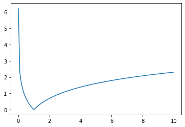
```


_plot_ di atas merupakan plot dengan _default setting_ Python. Kelak akan ditunjukkan caranya agar kita bisa mengubah _settings_ yang ada.

### Contoh Sederhana Dua _Plots_ {-}

Kita juga bisa menggambar dua _plots_ dalam satu _canvas_ menggunakan `matplotlib`.

Misalkan kita hendak menggambar:

$$f(x) = | \log{x} | \\ g(x) = - | \log{x} | \\ x \in (0.002,10]$$

Kita cukup mengulang langkah di atas __dengan syarat membuat dua plot sekaligus__.

```
# STEP 1
import numpy as np
import matplotlib.pyplot as plt

# STEP 2
X = np.linspace(0.002, 10, 100)

# STEP 3
Y1 = abs(np.log(X)) 
Y2 = - abs(np.log(X))

# STEP 4
plt.plot(X, Y1)
plt.plot(X, Y2)
plt.show()
```

Berikut adalah hasilnya:

```{r out.width="80%",echo=FALSE,warning=FALSE,message=FALSE,fig.align='center',fig.cap="Grafik f(x) dan g(x)"}
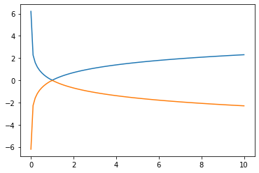
```

\pagebreak

## _Save Plot_

Salah satu perintah yang sering digunakan adalah perintah _save_ hasil grafik ke dalam format `.png` atau `.jpeg`. Meminjam gambar $f(x)$ dari bagian sebelumnya, kita tinggal menambahkan perintah _save_ di akhir baris __STEP 4__.

```
# STEP 1
import numpy as np
import matplotlib.pyplot as plt

# STEP 2
X = np.linspace(0.002, 10, 100)

# STEP 3
Y1 = abs(np.log(X)) 
Y2 = - abs(np.log(X))

# STEP 4
plt.plot(X, Y1)
plt.plot(X, Y2)
plt.show()
plt.savefig("dual_plot.png", dpi=101)
```

Kita bisa memasukkan nilai _dots per inch_ ke dalam perintah tersebut. Semakin tinggi nilainya, semakin bagus gambar yang dihasilkan namun _filesize_-nya akan membesar.

Sebagai contoh, dengan konfigurasi seperti di atas, saya mendapatkan _file_ `dual_plot.png` berukuran `2.4 kB (2,358 bytes)`.

\pagebreak

## Kustomisasi _Plot_

Karena bersifat _coding_, kita bisa melakukan banyak kustomisasi terhada grafik yang hendak ditampilkan. Misalkan kita hendak membuat grafik dari fungsi berikut:

$$f(x) = |x|, x \in [-3,3]$$

```
# STEP 1
import numpy as np
import matplotlib.pyplot as plt

# STEP 2
x = np.linspace(-3, 3, 100)

# STEP 3
y = abs(x) 

# STEP 4
plt.plot(x, y)
plt.show()
```

Berikut adalah hasilnya:

```{r out.width="60%",echo=FALSE,warning=FALSE,message=FALSE,fig.align='center',fig.cap="Grafik |x|"}
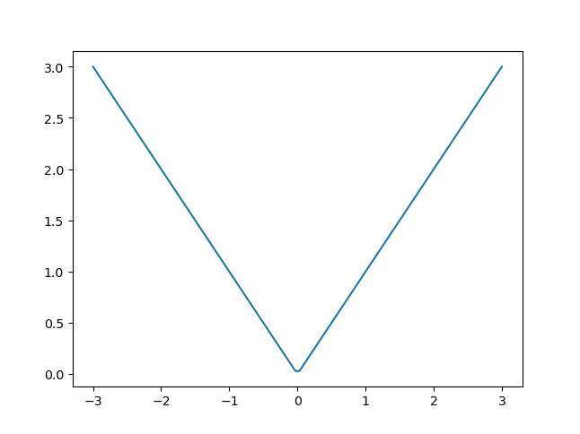
```

\pagebreak

### _Ratio_

Seandainya kita hendak mengubah _ratio_ gambar dan tingkat kualitas gambar yang dihasilkan, kita bisa menambahkan perintah berikut di __STEP 4__:

```
# STEP 1
import numpy as np
import matplotlib.pyplot as plt

# STEP 2
x = np.linspace(-3, 3, 100)

# STEP 3
y = abs(x) 

# STEP 4
plt.figure(figsize=(16, 7), dpi=80)
plt.plot(x, y)
plt.show()
```

Kita akan mendapat gambar yang lebih __lebar__ secara _ratio_.

```{r out.width="60%",echo=FALSE,warning=FALSE,message=FALSE,fig.align='center',fig.cap="Grafik |x|"}
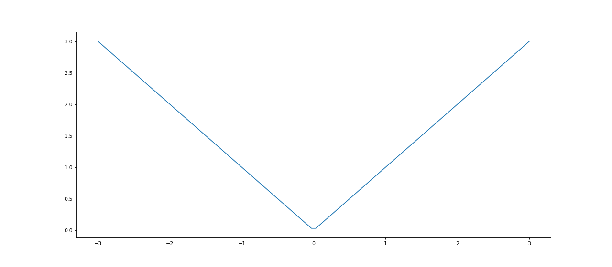
```

\pagebreak

### Memberikan Warna Secara Manual

Kita lihat kembali contoh berikut:

$$f(x) = | \log{x} | \\ g(x) = - | \log{x} | \\ x \in (0.002,10]$$

Jika kita hendak memberikan warna `biru` untuk $f(x)$ dan `merah` untuk $g(x)$, berikut perintahnya: 

```
# STEP 1
import numpy as np
import matplotlib.pyplot as plt

# STEP 2
X = np.linspace(0.002, 10, 100)

# STEP 3
Y1 = abs(np.log(X)) 
Y2 = - abs(np.log(X))

# STEP 4
plt.plot(X, Y1, color="blue", linewidth=2.0, linestyle="-")
plt.plot(X, Y2, color="red", linewidth=1.0, linestyle="--")
plt.show()
```

Kita juga bisa mengubah __ketebalan garis__ dan _linestyle_ pada perintah tersebut. 

```{r out.width="60%",echo=FALSE,warning=FALSE,message=FALSE,fig.align='center',fig.cap="Grafik Ganti Warna Garis"}
knitr::include_graphics("warna.png")
```

\pagebreak

### Memberikan Batas Grafik

Dari grafik sebelumnya, jika kita hendak membuat batas sumbu $y$ hanya boleh berada di selang $[-1,1]$, maka kita tuliskan:

```
# STEP 1
import numpy as np
import matplotlib.pyplot as plt

# STEP 2
X = np.linspace(0.002, 10, 100)

# STEP 3
Y1 = abs(np.log(X)) 
Y2 = - abs(np.log(X))

# STEP 4
plt.plot(X, Y1, color="blue", linewidth=2.0, linestyle="-")
plt.plot(X, Y2, color="red", linewidth=1.0, linestyle="--")
plt.ylim(-1.0, 1.0)
plt.show()
```

```{r out.width="60%",echo=FALSE,warning=FALSE,message=FALSE,fig.align='center',fig.cap="Grafik Ganti Batas sb y"}
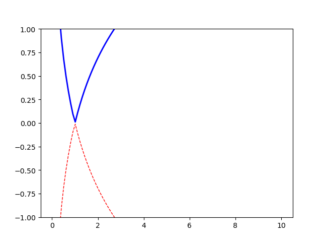
```

\pagebreak

Hal serupa jika kita hendak membatasi sumbu $x$ di selang $[0.5,1.5]$:

```
# STEP 1
import numpy as np
import matplotlib.pyplot as plt

# STEP 2
X = np.linspace(0.002, 10, 100)

# STEP 3
Y1 = abs(np.log(X)) 
Y2 = - abs(np.log(X))

# STEP 4
plt.plot(X, Y1, color="blue", linewidth=2.0, linestyle="-")
plt.plot(X, Y2, color="red", linewidth=1.0, linestyle="--")
plt.xlim(0.5,1.5)
plt.show()
```

```{r out.width="60%",echo=FALSE,warning=FALSE,message=FALSE,fig.align='center',fig.cap="Grafik Ganti Batas sb x"}
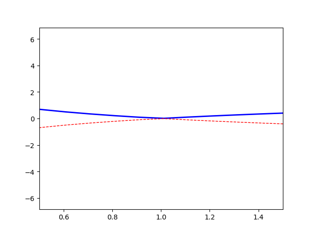
```

\pagebreak

### Mengubah Label Sumbu $x$ dan Sumbu $y$

Misalkan kita hendak melakukan _highlight_ dengan cara menuliskan label sumbu $x$ atau $y$ secara detail, kita bisa lakukan

```
# STEP 1
import numpy as np
import matplotlib.pyplot as plt

# STEP 2
X = np.linspace(0.002, 10, 100)

# STEP 3
Y1 = abs(np.log(X)) 
Y2 = - abs(np.log(X))

# STEP 4
plt.plot(X, Y1, color="blue", linewidth=2.0, linestyle="-")
plt.plot(X, Y2, color="red", linewidth=1.0, linestyle="--")
plt.xticks(np.linspace(5, 10, 5))
plt.show()
```

```{r out.width="60%",echo=FALSE,warning=FALSE,message=FALSE,fig.align='center',fig.cap="Grafik Labelling sb x"}
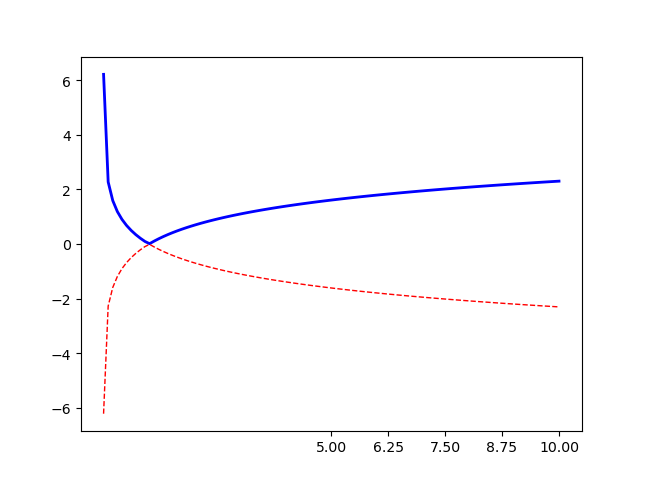
```

\pagebreak

Selain itu, kita juga bisa mengubah bagaimana `matplotlib` menampilkan label sumbu. Misalkan sebagai berikut:

```
# STEP 1
import numpy as np
import matplotlib.pyplot as plt

# STEP 2
X = np.linspace(0.002, 10, 100)

# STEP 3
Y1 = abs(np.log(X)) 
Y2 = - abs(np.log(X))

# STEP 4
plt.plot(X, Y1, color="blue", linewidth=2.0, linestyle="-")
plt.plot(X, Y2, color="red", linewidth=1.0, linestyle="--")

# kustomisasi label di sumbu x
plt.xticks([1,4,8],
           [r'$2/2$', r'$8/2$', r'$16/2$'])

# kustomisasi label di sumbu y
plt.yticks([2,0,-2],
           [r'$4/2$', r'$y = 0$', r'$-4/2$'])

plt.show()
```

\pagebreak

```{r out.width="60%",echo=FALSE,warning=FALSE,message=FALSE,fig.align='center',fig.cap="Grafik Re-labelling sb x dan sb y"}
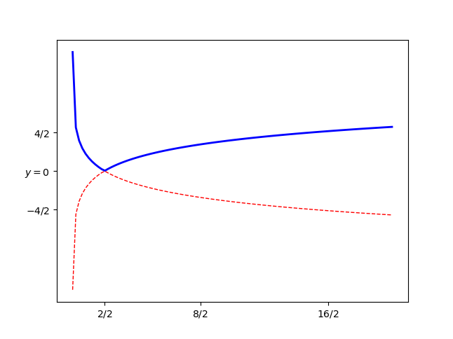
```

### Menambah _Legend_

Salah satu elemen penting dalam grafik adalah _legend_. Kita bisa menambahkan _legend_ dengan `matplotlib` setelah kita memberikan label pada masing-masing grafik.

```
# STEP 1
import numpy as np
import matplotlib.pyplot as plt

# STEP 2
X = np.linspace(0.002, 10, 100)

# STEP 3
Y1 = abs(np.log(X)) 
Y2 = - abs(np.log(X))

# STEP 4
# menambahkan label di masing-masing plot
plt.plot(X, Y1, color="blue", linewidth=2.0, linestyle="-", 
         label = "|log(x)|")
plt.plot(X, Y2, color="red", linewidth=1.0, linestyle="--",
         label = "- |log(x)|")
# menambahkan legend
plt.legend(loc='upper right')

plt.show()
```

Kita bisa mengatur di mana letak _legend_ berada. Sebagai contoh, saya meletakkan _legend_ di kanan atas.

```{r out.width="60%",echo=FALSE,warning=FALSE,message=FALSE,fig.align='center',fig.cap="Menambah Legend Grafik"}
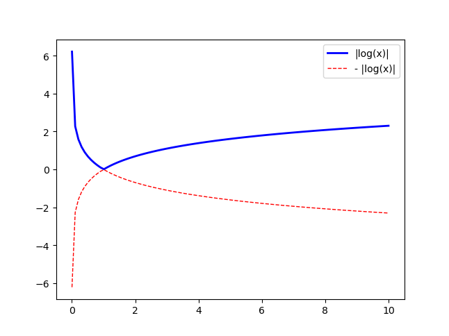
```

### _Annotations_

Pada grafik di atas, kita bisa menambahkan beberapa titik dan label tertentu. Misalkan saya hendak menambahkan titik $x = 2$ pada $f(x)$ dan $g(x)$.

$f(2) =$ `r abs(log(2))` dan $g(2) =$ `r -abs(log(2))`

Maka langkahnya adalah sebagai berikut:

```
# STEP 1
import numpy as np
import matplotlib.pyplot as plt

# STEP 2
X = np.linspace(0.002, 10, 100)

# STEP 3
# menghitung f(2) dan g(2)
x_i = 2
f_x = abs(np.log(x_i))
g_x = - abs(np.log(x_i))

# STEP 3
# menghitung f(x) untuk setiap x
Y1 = abs(np.log(X))

# menggambar f(x)
plt.plot(X, Y1, color="blue", linewidth=2.0, linestyle="-", 
         label = "|log(x)|")

# menambahkan titik (x,f(x)) pada saat x = 2
plt.scatter([x_i, ], [f_x, ], 50, color='black')

# memberikan annotation label di titik (x,f(x)) pada saat x = 2
plt.annotate(r'$| \log{2} | \sim 0.69$', # label yang hendak kita tuliskan
				     # ditulis dalam bentuk LATEX
             xy=(x_i, f_x), # koordinat letak target 
             xycoords='data',
             xytext=(20, 30), # offset penulisan label
             		      # didefinisikan mau berapa jarak x dan y dari target 
             textcoords='offset points', 
             fontsize=10, # fontsize
             arrowprops=dict(arrowstyle="->", connectionstyle="arc3,rad=.2")) # arrow
             
# STEP 4
# menghitung g(x) untuk setiap x
Y2 = - abs(np.log(X))

# menggambar g(x)
plt.plot(X, Y2, color="red", linewidth=1.0, linestyle="--",
         label = "- |log(x)|")

# menambahkan titik (x,g(x)) pada saat x = 2
plt.scatter([x_i, ], [g_x, ], 50, color='black')

# memberikan annotation label di titik (x,g(x)) pada saat x = 2
plt.annotate(r'$- | \log{2} | \sim -0.69$', # label yang hendak kita tuliskan
				     # ditulis dalam bentuk LATEX
             xy=(x_i, g_x), # koordinat letak target 
             xycoords='data',
             xytext=(-20, -30), # offset penulisan label
             		      # didefinisikan mau berapa jarak x dan y dari target 
             textcoords='offset points', 
             fontsize=10, # fontsize
             arrowprops=dict(arrowstyle="->", connectionstyle="arc3,rad=.2")) # arrow
             
             
# STEP 5
# menambahkan legend
plt.legend(loc='upper right')

plt.show()   
```

```{r out.width="60%",echo=FALSE,warning=FALSE,message=FALSE,fig.align='center',fig.cap="Menambah Annotation"}
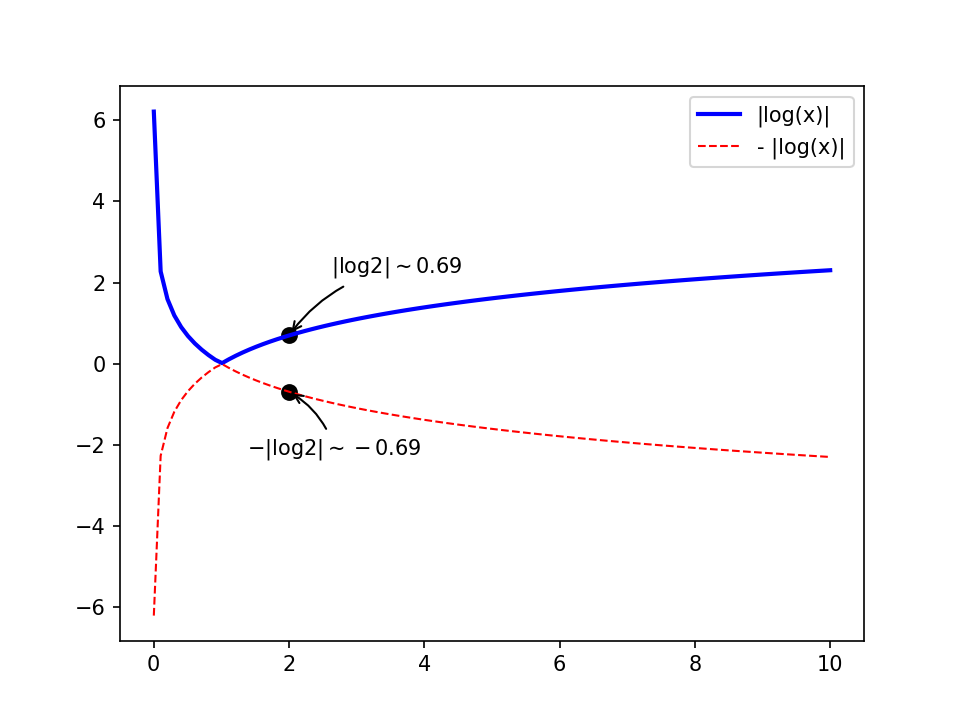
```

\newpage

### _Fill_ Warna di Bawah Kurva

Kita bisa menambahkan warna di bawah kurva sesuai dengan kebutuhan. Misalkan kita hendak menggambar:

$$f(x) = \sin{x}, x \in [-\pi,\pi]$$

Lalu memberi warna "merah" untuk area di bawah kurva $f(x)$. Maka:

```
# STEP 1
import numpy as np
import matplotlib.pyplot as plt

# STEP 2
n = 100
X = np.linspace(-np.pi, np.pi, n)

# STEP 3
Y = np.sin(2 * X)

# STEP 4
# menggambar plot
plt.plot(X, Y, color='blue', alpha=1.00)
# memberikan warna
plt.fill_between(X,Y,
                 color = "red", # warna merah
                 alpha = .4) # alpha adalah tingkat transparansi warna
plt.show()      
```

\newpage

```{r out.width="60%",echo=FALSE,warning=FALSE,message=FALSE,fig.align='center',fig.cap="Memberi Warna di Bawah Kurva"}
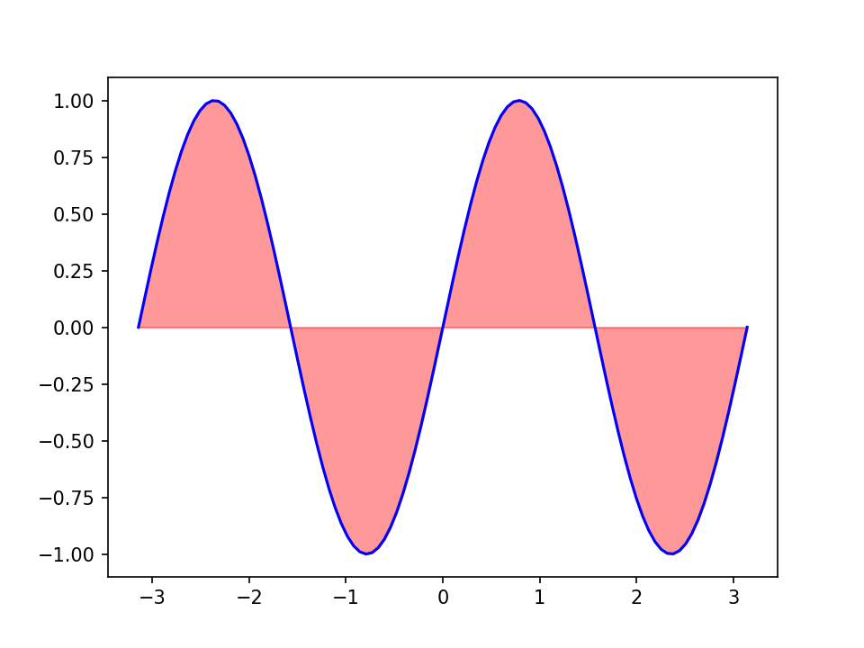
```


\newpage

# BENTUK _PLOTS_ LAIN {-}

# CHAPTER II

## _Scatter Plot_

_Scatter plot_ adalah grafik yang memasangkan titik $(x,y)$ dalam bidang kartesian.

Misalkan saya memiliki data berat badan dan tinggi badan sebagai berikut:

```{r,echo=FALSE,warning=FALSE,message=FALSE}
rm(list=ls())
load("bahan.rda")
data %>% 
  mutate(bmi = berat / (tinggi/100)^2,
         bmi = round(bmi,1)) %>% 
  knitr::kable("simple",align = "c",caption = "Tabel data berat dan tinggi badan")
```

Kita hendak membuat _scatter plot_-nya sebagai berikut:

```{r,include=FALSE}
convert_array = function(berat,vari){
  berat = paste(berat,collapse = ",")
  berat = paste0(vari," = np.array([",berat,"])")
  return(berat)
}
```

```
# STEP 1
import numpy as np
import matplotlib.pyplot as plt

# STEP 2
# memasukkan data berat dan tinggi
berat = np.array([62,54,76,67,63,77,79,57,65,52,
		  64,61,60,55,50,51,75,66,58,68])
tinggi = np.array([178,172,150,160,143,155,147,
		   140,164,171,154,142,174,152,
		   180,169,163,148,162,145])
# menghitung bmi
bmi = berat/(tinggi / 100)**2
# mengelompokkan bmi
kategori = bmi<=20

# STEP 3
# membuat scatter plot
# besar kecilnya titik ditentukan oleh bmi
# warna titik ditentukan oleh kategori bmi
plt.scatter(berat,tinggi,
	    s = bmi*2,
	    c = kategori)

plt.show()
```

```{r out.width="80%",echo=FALSE,warning=FALSE,message=FALSE,fig.align='center',fig.cap="Scatter plot"}
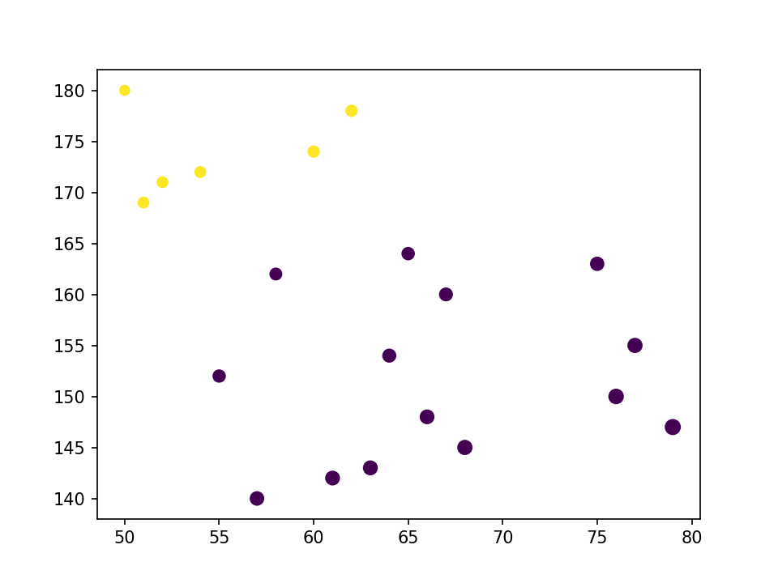
```

\newpage

## _Bar Plot_

Bentuk _plot_ lain yang sering digunakan adalah diagram batang. Misalkan saya memiliki data sebagai berikut:

```{r,echo=FALSE}
data = 
  data %>% 
  mutate(bmi = berat / (tinggi/100)^2,
         kategori = case_when(
           bmi <= 18.5 ~ 1,
           bmi > 18.5 & bmi < 25 ~ 2,
           bmi >= 25 & bmi <= 29 ~ 3,
           bmi > 29 & bmi <= 40 ~ 4,
           bmi > 40 ~ 5
         )
         ) 

data %>% knitr::kable("simple",align = "c",caption = "Tabel data berat dan tinggi badan")
```

Kemudian saya kelompokkan menjadi:

```{r,echo=FALSE,message=FALSE,warning=FALSE}
grup = 
  data %>% 
  group_by(kategori) %>% 
  tally() %>% 
  ungroup()

grup %>% 
  knitr::kable("simple",align = "c",caption = "Pengelompokkan BMI")
```

Bentuk diagram batangnya adalah sebagai berikut:

```
# STEP 1
import numpy as np
import matplotlib.pyplot as plt

# STEP 2
# memasukkan data kategori berat dan tinggi
kat = np.array([1,2,3,4])
# memasukkan banyak orang
banyak_org = np.array([4,5,3,8])

# STEP 3
# menggambar barplot
plt.bar(kat, banyak_org, 
	facecolor='#226fb3', # kode hex warna bisa dicari dengan colorpicker 
	edgecolor='white')
# mengganti label dengan arti dari kategori bmi
plt.xticks([1,2,3,4],
	   ['under','normal','over','obese'])

plt.show()
```

```{r out.width="80%",echo=FALSE,warning=FALSE,message=FALSE,fig.align='center',fig.cap="Bar plot"}
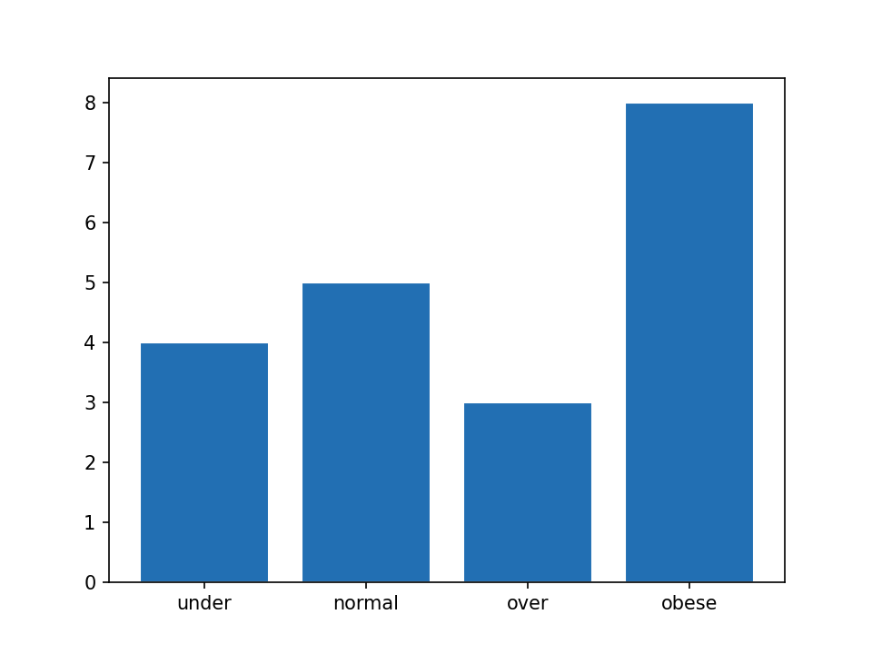
```

\newpage

## _Pie Charts_

Bentuk diagram batang di atas, bisa kita modifikasi menjadi bentuk _pie chart_ sebagai berikut:

```
# STEP 1
import matplotlib.pyplot as plt

# STEP 2
# memasukkan data kategori berat dan tinggi
kat = ['under','normal','over','obese']
# memasukkan banyak orang
banyak_org = [4,5,3,8]

# STEP 3
# menggambar pie chart
plt.pie(banyak_org, 
	labels = kat)

plt.show()
```

```{r out.width="80%",echo=FALSE,warning=FALSE,message=FALSE,fig.align='center',fig.cap="Pie Chart"}
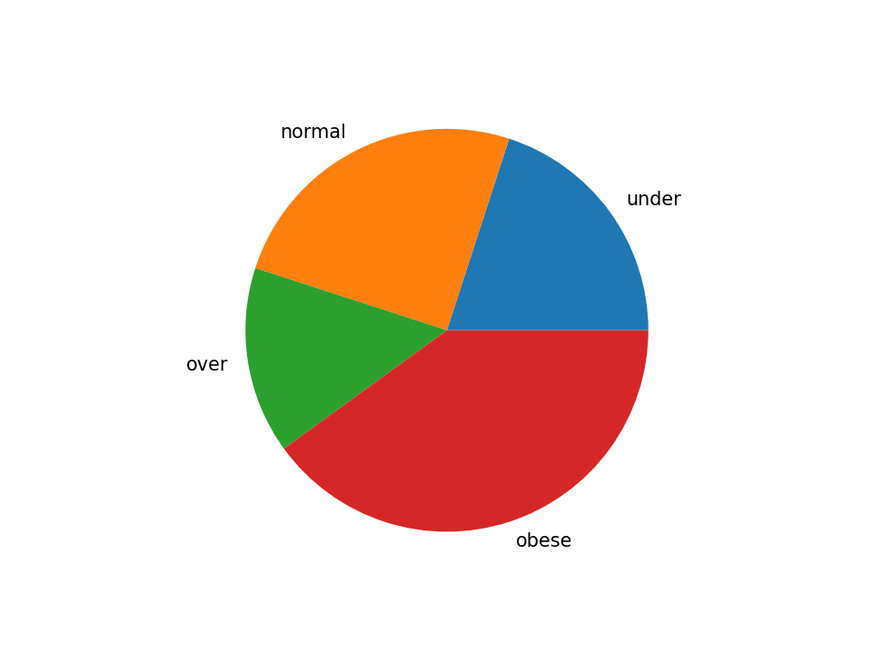
```

\newpage

## _Boxplot_

_Boxplot_ biasa digunakan untuk melihat persebaran data. Mari kita lihat kembali persebaran tinggi badan:

```
# STEP 1
import numpy as np
import matplotlib.pyplot as plt

# STEP 2
# memasukkan data tinggi badan
tinggi_bdn = np.array([178,172,150,160,143,155,147,140,
                      164,171,154,142,174,152,180,169,163,
                      148,162,145])

# STEP 3
# menggambar pie chart
plt.boxplot(tinggi_bdn)
# mengganti label sb x
plt.xticks([1],
	   ['Tinggi Badan'])
plt.show()
```

\newpage
```{r out.width="80%",echo=FALSE,warning=FALSE,message=FALSE,fig.align='center',fig.cap="Boxplot"}
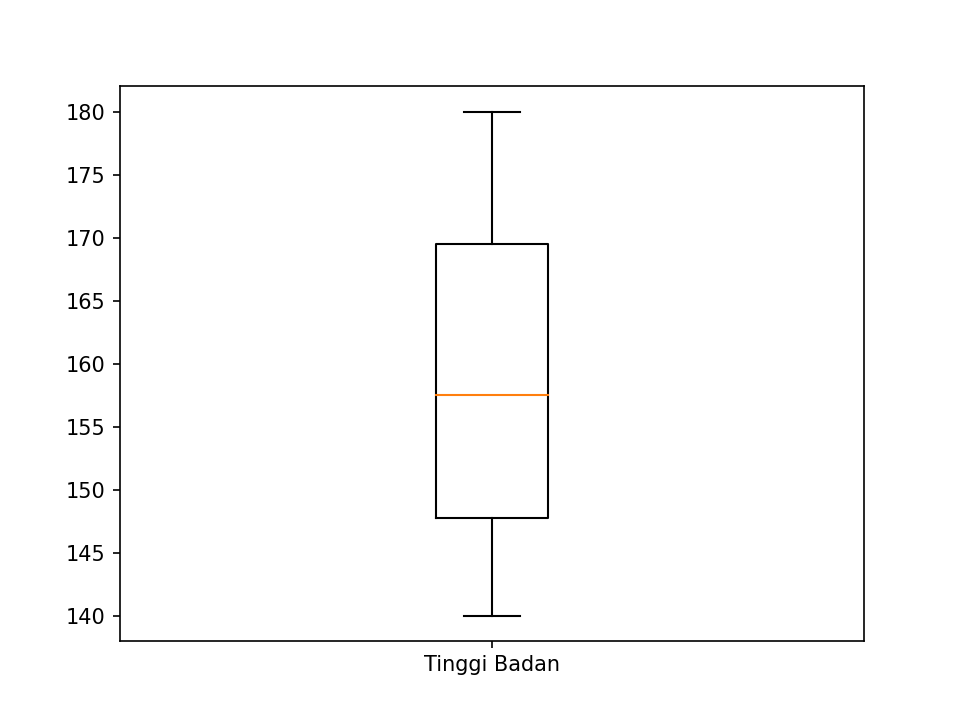
```

\newpage

## _Contour Plot_

_Contour plot_ adalah membuat grafik 3D ke dalam bidang 2D. Sebagai contoh, saya akan membuat grafik dari fungsi _body mass index_ dari contoh sebelumnya.

$$bmi = \frac{bb}{tb^2}$$

Nanti saya akan _plot_ dengan `berat badan` sebagai sumbu x dan `tinggi badan` seagai sumbu y.

```
# STEP 1
import numpy as np
import matplotlib.pyplot as plt

# STEP 2
# membuat fungsi bmi
def bmi(berat,tinggi):
  return berat / (tinggi/100)**2

# STEP 3
# memasukkan semua berat dan tinggi yang mungkin
n = 1000
berat = np.linspace(0, 200, n)
tinggi = np.linspace(80, 250, n)

# STEP 4
# berat menjadi sumbu x
# tingg menjadi sumbu y	   
X, Y = np.meshgrid(berat, tinggi)

# membuat grafik 3d dalam 2d
plt.contourf(X, Y, bmi(X, Y), 8, alpha=.75, cmap=plt.cm.hot)
C = plt.contour(X, Y, bmi(X, Y), 8, colors='black')
plt.clabel(C, inline=1, fontsize=6)

plt.show()
```

\newpage
```{r out.width="80%",echo=FALSE,warning=FALSE,message=FALSE,fig.align='center',fig.cap="Contour Plot"}
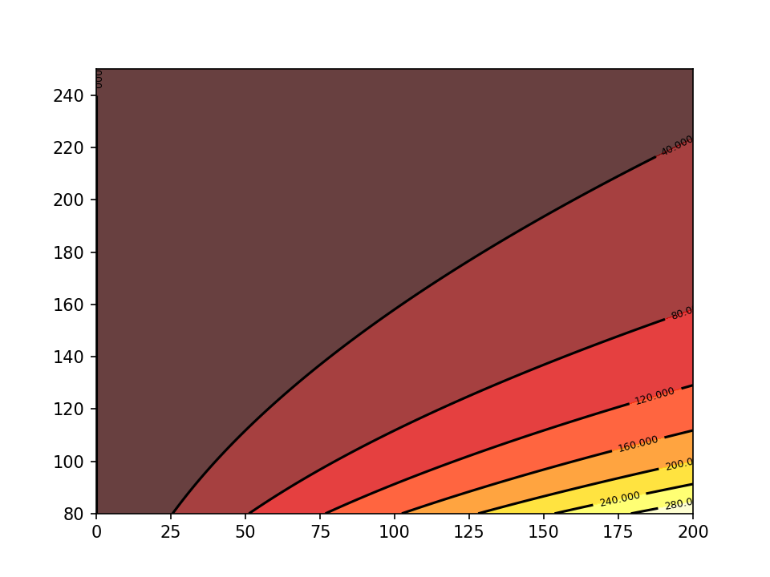
```

\newpage

## 3D Plot

Bentuk dari _contour plot_ `bmi` di atas, bisa kita gambarkan dalam bentuk aslinya di ruang 3D sebagai berikut:

```
# STEP 1
import numpy as np
import matplotlib.pyplot as plt
from mpl_toolkits.mplot3d import Axes3D

# STEP 2
# membuat fungsi bmi
def bmi(berat,tinggi):
  return berat / (tinggi/100)**2

# STEP 3
# membuat axis ruang 3D
fig = plt.figure()
ax = Axes3D(fig)

# STEP 4
# memasukkan semua berat dan tinggi yang mungkin
n = 1000
berat = np.linspace(0, 200, n)
tinggi = np.linspace(80, 250, n)

# STEP 5
# berat menjadi sumbu x
# tinggi menjadi sumbu y	   
X, Y = np.meshgrid(berat, tinggi)
# bmi sebagai sumbu z
Z = bmi(X,Y)

# membuat grafik 3d 
ax.plot_surface(X, Y, Z, cmap='hot')

plt.show()
```

\newpage
```{r out.width="80%",echo=FALSE,warning=FALSE,message=FALSE,fig.align='center',fig.cap="3D Plot"}
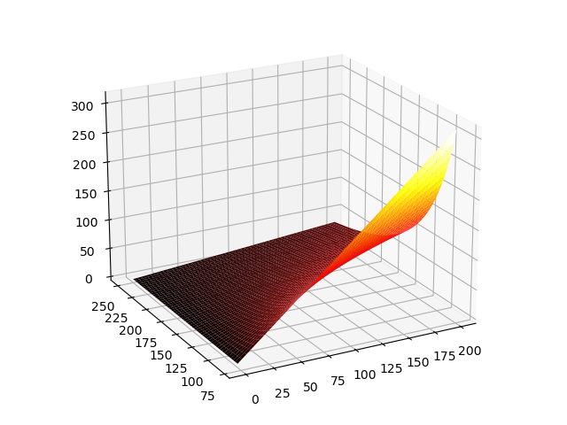
```

# == End == {.unlisted .unnumbered}

