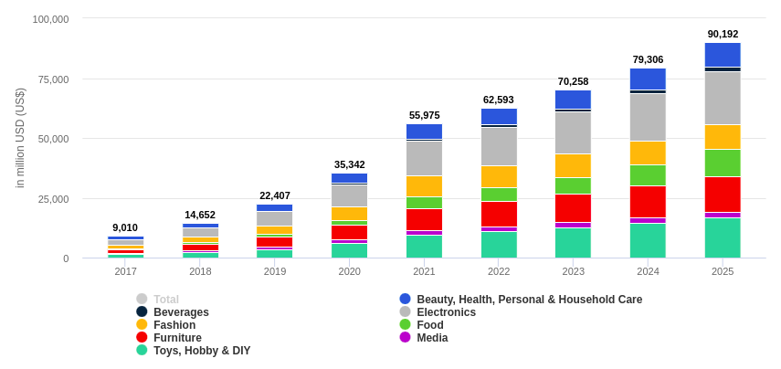
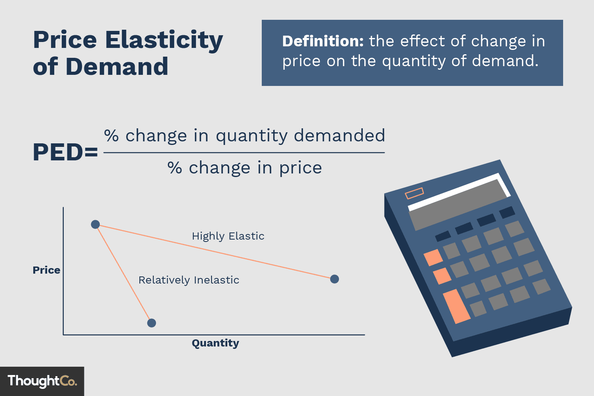
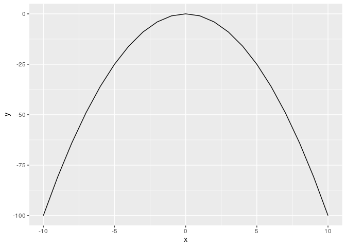

```{r setup, include=FALSE}
knitr::opts_chunk$set(echo = FALSE)
rm(list=ls())

setwd("~/209_ITB/Semester II/Research Method/Tugas Kuliah")
library(dplyr)
library(ggplot2)
```

# PENDAHULUAN

## Latar Belakang Masalah

### Perkembangan Transaksi _Online_

Sebanyak `30 juta` orang Indonesia kini bertransaksi secara _online_, menciptakan _market_ sebesar `Rp 8 triliun`. _Market_ ini bisa terus berkembang hingga `Rp 40 triliun` dalam `5 tahun` ke depan. ^[https://www.mckinsey.com/spContent/digital_archipelago/index.html]

```{r out.width="30%",echo=FALSE,fig.align='center',fig.retina=10,fig.cap="www.mckinsey.com"}

```

### _E-Commerce Revenue_

Statista _market forecast_^[https://www.statista.com/outlook/dmo/ecommerce/indonesia#revenue].

```{r out.width="60%",echo=FALSE,fig.align='center',fig.retina=10,fig.cap="www.statista.com"}

```

### Penambahan Toko dan _Listed Product_

Total UMKM yang memasarkan produknya di _e-commerce_ sebanyak `14.5 juta` UMKM. Jumlahnya belum mencapai setengah dari target yang ditetapkan pada 2023 mendatang, yakni `30 juta` UMKM bergabung di _e-commerce_ ^[https://www.cnnindonesia.com/ekonomi/20210807160341-92-677709/umkm-masuk-e-commerce-di-ri-tambah-65-juta].

### Tipe Diskon di _E-Commerce_

Ada dua skema pemberian diskon yang biasa ada di _e-commerce_, yakni:

1. Diskon dari toko.
1. Diskon dari _e-commerce_.

Potongan diskon ini bertujuan untuk menarik konsumen agar tertarik membeli produk di _e-commerce_ tersebut __pada periode tertentu__. 

Suatu studi di _online retailer di China_ menunjukkan ada pengaruh antara diskon produk dengan _consumer purchase behavior_ seperti _purchase incident_, _purchase quantity_, dan _spending_. Terutama pada rentang persentase diskon tertentu [@cny].

### _Price Elasticity_

Strategi pemberian harga produk adalah salah satu strategi penting bagi setiap perusahaan. Untuk melakukannya, kita bisa membuat model antara _demand - price_ yang disebut dengan _price elasticity_ [@kennethko].

```{r out.width="40%",echo=FALSE,fig.align='center',fig.retina=10,fig.cap="ilustrasi price elasticity"}

```

### _Price Elasticity_

Ilustrasi model regresi linear _price elasticity_^[https://ikanx101.com/blog/blog-posting-regresi/].

```{r out.width="40%",echo=FALSE,fig.align='center',fig.retina=10,fig.cap="ilustrasi price elasticity"}
knitr::include_graphics("ilustrasi_pe.png")
```

### _Price Elasticity_

Dengan memanfaatkan data transaksi yang terjadi, _e-commerce_ bisa membuat model _price elasticity_ untuk setiap produk dan menghitung harga paling optimal yang paling memaksimalkan _revenue_. Perhatikan bahwa _slope_ dari kurva yang dihasilkan harus bernilai negatif.

$$Demand = -e.Price + C$$ 
$$Omset = Demand . Price = -e. Price^2 + C. Price$$

### _Price Elasticity_

```{r out.width="40%",echo=FALSE,fig.align='center',fig.retina=10,fig.cap="ilustrasi kurva $-x^2$"}

```

### Data yang Hasil Perhitungan _Price Elasticity_

Pada periode waktu tertentu, didapatkan `1953` baris data produk berisi detail _budget_ diskon yang dibutuhkan dan _expected profit_. Berikut adalah _sample_ datanya:

```{r,echo=FALSE}
library(readxl)
library(dplyr)

data = read_excel("20201207 Product list.xlsx") %>% janitor::clean_names() %>% filter(cost_benefit > 0)
data %>% 
  select(product_code,brand,burn_3m,cost_benefit) %>% 
  head(7) %>% 
  rename(budget_disc = burn_3m,
         exp_profit = cost_benefit) %>% 
  knitr::kable(caption = "Sample 7 Baris Data")
```

## Masalah yang Dihadapi

### Penentuan Produk

Dari data perhitungan tersebut, masalah yang kemudian dihadapi oleh _e-commerce_ adalah menentukan produk mana saja yang harus diberikan diskon tambahan agar mendapatkan maksimum _expected profit_ dengan keterbatasan total _budget_ diskon sebesar `Rp 200 juta`.

Oleh karena itu, masalah yang dihadapi oleh _e-commerce_ tersebut adalah masalah optimisasi.

## Dasar Teori

### Masalah Optimisasi {.allowframebreaks}

Ada beberapa hal yang perlu diketahui terkait pemodelan dari masalah optimisasi^[Pengantar Riset Operasi dan Optimisasi, KampusX: PO101], yakni:

1. __Variabel__ adalah suatu simbol yang memiliki banyak nilai dan nilainya ingin kita ketahui. Setiap nilai yang mungkin dari suatu variabel muncul akibat suatu kondisi tertentu di sistem.
1. __Parameter__ di suatu model matematika adalah suatu konstanta yang menggambarkan suatu karakteristik dari sistem yang sedang diteliti. Parameter bersifat _fixed_ atau _given_.
1. ___Constraints___ (atau kendala) adalah kondisi atau batasan yang harus dipenuhi. Kendala-kendala ini dapat dituliskan menjadi suatu persamaan atau pertaksamaan. Suatu masalah optimisasi dapat memiliki hanya satu kendala atau banyak kendala.
1. ___Objective function___ adalah satu fungsi (pemetaan dari variabel-varibel keputusan ke suatu nilai di daerah _feasible_) yang nilainya akan kita minimumkan atau kita maksimumkan.

\pagebreak 

Ekspresi matematika dari model optimisasi adalah sebagai berikut:

> Cari $x$ yang meminimumkan $f(x)$ dengan kendala $g(x) = 0, h(x) \leq 0$ dan $x \in D$.

Dari ekspresi tersebut, kita bisa membagi-bagi masalah optimisasi tergantung dari:

1. Tipe variabel yang terlibat.
1. Jenis fungsi yang ada (baik _objective function_ ataupun _constraints_).

[@lieberman]

### _Binary Linear Programming_

Masalah optimisasi yang dihadapi termasuk ke dalam _binary linear programming_.

_Binary programming_ adalah bentuk metode optimisasi di mana variabel yang terlibat merupakan bilangan biner (0,1). Biasanya metode ini dipakai dalam masalah-masalah yang memerlukan prinsip _matching_ antar kondisi (indeks) yang ada.

### Metode Penyelesaian _Binary LP_ {.allowframebreaks}

Metode _simplex_ adalah salah satu metode yang paling umum digunakan dalam menyelesaikan permasalahan _linear programming_. Metode ini dikembangkan oleh seorang profesor matematika bernama George Dantzig^[https://en.wikipedia.org/wiki/George_Dantzig] pada 1947 pasca perang dunia II. Sedangkan nama _simplex_ diusulkan oleh Theodore Motzkin^[https://en.wikipedia.org/wiki/Theodore_Motzkin].

Metode _simplex_ adalah __metode eksak__ yang digunakan untuk menyelesaikan _linear programming_. Metode _simplex_ menggunakan prosedur aljabar[@lieberman]. Namun _underlying concept_ dari metode ini adalah _geometric_. 

Solusi yang dihasilkan merupakan bilangan _real_ atau kontinu. Agar bisa menyelesaikan _binary LP_, membulatkan bilangan solusi _linear programming_ untuk mendapatkan solusi _binary_ dari suatu masalah _MILP_ belum tentu menjamin keoptimalan tercapai. Oleh karena itu, kita akan melakukan pendekatan _constraint relaxation_ [@benoit].

### Metode _Meta Heuristic_

Selain metode _simplex_, dewasa ini ada berbagai algoritma _meta heuristic_ yang bisa digunakan untuk menyelesaikan _binary LP_. 

- Pada studi tahun 2016, _spiral optimization algorithm_ terbukti bisa digunakan untuk menyelesaikan masalah _binary LP_ dengan cara memodifikasi _objective function_ dan _constraints_ yang ada [@kun].
- Pada studi tahun 2021, _artificial bee colony algorithm_ juga bisa digunakan untuk menyelesaikan _vehicle routing problem_ dengan komplikasi _time windows_ [@ilhan]. Masalah VRP merupakan salah satu contoh _real_ dari _binary LP_.

## Rencana Kerja

### Rencana Penelitian

Membuat model optimisasi portofolio diskon produk _e-commerce_ dan membandingkan solusi metode eksak (_simplex_) dengan metode _meta heuristic_ (_ABC_ dan _SOA_).

# _REFERENCES_ {.allowframebreaks}