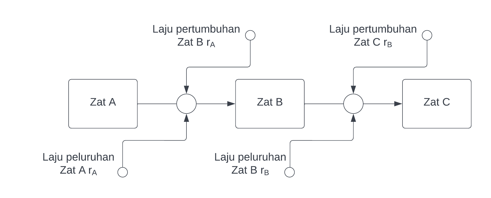

\newpage
\tableofcontents
\newpage
\listoftables
\newpage
\listoffigures
\newpage


```{r,include=FALSE}
rm(list=ls())

library(dplyr)
library(ggplot2)

# setwd("/mnt/chromeos/removable/Workstation/209_ITB/Semester III/Pengantar SK/Project I")
setwd("/cloud/project/Semester III/Pengantar SK/Project I")
```

# Pendahuluan

Sains komputasi adalah disiplin ilmu yang mempelajari penyelesaian berbagai masalah dalam sains melalui pendekatan komputasi. Salah satunya adalah mencari solusi dari persamaan diferensial yang merupakan fungsi kontinu menggunakan pendekatan yang bersifat diskrit. Sebagai pembahasan pada laporan ini, diberikan satu masalah persamaan diferensial berupa _unconstrained growth and decay_ dari suatu permasalahan peluruhan dan pembentukan beberapa zat radioaktif lalu kemudian akan diselesaikan menggunakan metode pendekatan diskrit.

## Masalah

Laju peluruhan suatu zat radioaktif bisa dituliskan dalam persamaan diferensial berikut ini:

$$\frac{dQ}{dt} = -r Q(t)$$

Untuk suatu $r$ bernilai positif (_decay rate_) dan $Q(t)$ adalah fungsi massa zat radioaktif terhadap waktu ($t$). Suatu zat radioaktif bisa luruh membentuk zat radioaktif lainnya membuat rantai reaksi.

Buatlah model rantai reaksi radioaktif yang berisi 3 elemen: dari zat A luruh menjadi zat B dan luruh menjadi zat C!

## Bahasa Pemrograman

Saya menggunakan bahasa pemrograman **R** versi `4.0.4` untuk membuat program dan melakukan simulasi untuk menyelesaikan permasalahan di atas. 

\newpage

# Dasar Teori

## _Unconstrained Growth and Decay_

Model _unconstrained growth and decay_ pada dasarnya merupakan model pertumbuhan atau peluruhan yang laju perubahannya proporsional dengan populasi (kondisi) saat ini. Populasi akan bertumbuh atau berkurang tanpa ada batasan atau hal yang menghalangi perubahannya. Pada masalah yang dihadapi, suatu zat radioaktif akan meluruh mengikuti persamaan diferensial berikut:

$$\frac{dQ}{dt} = -r Q(t)$$

dan akan bertumbuh juga mengikuti persamaan diferensial berikut:

$$\frac{dQ}{dt} = r Q(t)$$

Perbedaannya adalah pada nilai $r$ yang kelak akan digunakan untuk masing-masing zat radioaktif $A$, $B$, dan $C$.

Solusi analitik dari peluruhan adalah: $P = P_0 e^{-rt}$

```{r,echo=FALSE,fig.cap = "Ilustrasi Peluruhan",fig.height=3.5}
rm(list=ls())

r = 0.55
f = function(t){
  P0 * exp(-r * t)
}

t = seq(0,15,by = .05)
P0 = 10
P = f(t)

data.frame(t,P) %>% 
  ggplot(aes(x = t,
             y = P)) +
  geom_line(color = "steelblue") +
  labs(title = "Ilustrasi Peluruhan Tak Terbatas",
       subtitle = "P0 = 10 dan r = -0.55",
       caption = "20921004\nMohammad Rizka Fadhli",
       y = "Populasi - P(t)",
       x = "Waktu - t")
```

\newpage

sedangkan solusi analitik dari pertumbuhan adalah: $P = P_0 e^{rt}$

```{r,echo=FALSE,fig.cap = "Ilustrasi Pertumbuhan",fig.height=3.5}
rm(list=ls())

r = 0.55
f = function(t){
  P0 * exp(r * t)
}

t = seq(0,15,by = .05)
P0 = 10
P = f(t)

data.frame(t,P) %>% 
  ggplot(aes(x = t,
             y = P)) +
  geom_line(color = "steelblue") +
  labs(title = "Ilustrasi Pertumbuhan Tak Terbatas",
       subtitle = "P0 = 10 dan r = 0.55",
       caption = "20921004\nMohammad Rizka Fadhli",
       y = "Populasi - P(t)",
       x = "Waktu - t")
```

## _Finite Difference Equation_

Pendekatan diskrit untuk menyelesaikan persamaan diferensial menggunakan komputer adalah dengan membuat persamaan kontinu di atas menjadi bentuk persamaan beda. Komputer tidak bisa menyelesaikan masalah pada $t$ kontinu, oleh karena itu dibutuhkan pendekatan diskrit berupa laju perubahan pada $\Delta t$ yang relatif kecil. Bentuk umum persamaan beda adalah sebagai berikut:

$$
\text{new value} = \text{old values} + \text{change in value}
$$

Berdasarkan bentuk di atas, saya akan membuat dua algoritma untuk menyelesaikannya, yakni:

## Algoritma Euler

Algoritma Euler untuk menyelesaikan persamaan diferensial adalah sebagai berikut:

```
initialize
  sim_length
  population
  rate
  dt
compute:
  rate_per_step = rate * dt
  num_iter = sim_length / dt
for i: 1 to num_iter do
  population = population + rate_per_step * population
  t = i * dt
  print(t, population)
```

## Algoritma Runge Kutta $4^{th}$

Bentuk umum dari metode Runge Kutta orde 4 adalah sebagai berikut:

$$y_{n+1} = y_n + h \sum_{i=1}^n b_i k_i$$

dimana:

1. $y(t=0)$ diketahui.
1. $k_i$ adalah konstanta yang harus dicari.

Berikut adalah algoritmanya:

\newpage

```
initialize
  f # fungsi persamaan diferensial
  x0
  y0
  h
  sim_length
  rate
  dt

compute:
  num_iter = sim_length / dt
  
for i: 1 to num_iter do
  compute:
    k1 = f(x0,y0)
    k2 = f(x0 + 0.5*h,y0 + 0.5*k1*h)
    k3 = f(x0 + 0.5*h,y0 + 0.5*k2*h)
    k4 = f(x0 + h,y0 + k3*h)
    y0 = y0 + (1/6)*(k1 + 2*k2 + 2*k3 + k4) * h
    x0 = x0 + h
    print(x0,y0)
```

\newpage

# Model Matematika

Untuk membuat model matematika dari permasalahan ini, saya akan membuat diagram dari model sehingga hubungan antara ketiga zat radioaktif tersebut bisa terlihat dengan jelas.

## Diagram Model

Berikut ini adalah diagram model:

```{r out.width = "80%",echo=FALSE,fig.retina = 10,fig.cap = "Diagram Model",fig.align='center'}

```

Zat A akan luruh dengan laju sebesar $r_A$ membentuk zat B dengan laju pertumbuhan sebesar $r_A$ juga. Kemudian zat B akan luruh dengan laju sebesar $r_B$ membentuk zat C dengan laju pertumbuhan sebesar $r_B$ juga. Kemudian zat C akan luruh dengan lajur sebesar $r_C$.

## Persamaan Diferensial

Berdasarkan diagram dan keterangan di atas, kita dapatkan bahwa:

1. Perubahan massa zat A hanya bergantung pada peluruhan saja.
1. Perubahan massa zat B bergantung pada pembentukan dan peluruhan.
1. Perubahan massa zat C bergantung pada pembentukan dan peluruhan.

Dari sini, maka didapatkan sistem persamaan diferensial sebagai berikut:

Model perubahan massa zat A:

$$\frac{dA}{dt} = -r_A A$$

\newpage

Model perubahan massa zat B:

$$\frac{dB}{dt} = r_A A - r_B B$$

Model perubahan massa zat C:

$$\frac{dC}{dt} = r_B B - r_C C$$

## Algoritma Penyelesaian

Berikut adalah algoritma penyelesaian dengan cara mengubah persamaan diferensial menjadi persamaan beda hingga:

```
# definisi dan initial condition
r_a   # rate peluruhan A dan pertumbuhan B
r_b   # rate peluruhan B dan pertumbuhan C
r_c   # rate peluruhan C

q_a   # massa awal zat radioaktif A
q_b   # massa awal zat radioaktif B
q_c   # massa awal zat radioaktif C
t     # waktu awal t = 0

dt           # delta t
iter_length  # panjang iterasi
num_iter = iter_length / dt  # berapa banyak iterasi 

# proses iterasi
for i in 1 to num_iter do
    # peluruhan A dan pertumbuhan B
    rate_1 = r_a * q_a[i-1] * dt

    # peluruhan B dan pertumbuhan C
    rate_2 = r_b * q_b[i-1] * dt

    # peluruhan C
    rate_3 = r_c * q_c[i-1] * dt
    
    # perhitungan massa zat A
    q_a[i] = q_a[i-1] - rate_1
    # perhitungan massa zat B
    q_b[i] = q_b[i-1] + rate_1 - rate_2
    # perhitungan massa zat C
    q_c[i] = q_c[i-1] + rate_2 - rate_3
    # perhitungan massa waktu
    t[i] = t[i-1] + dt

print(t,q_a,q_b,q_c)

```

Algoritma di atas merupakan penerapan metode Euler untuk menyelesaikan sistem persamaan diferensial.

## Program Model Matematika

Pada bagian ini, saya akan membuat dua program untuk menyelesaikan permasalahan ini, yakni:

### Program dengan Metode Euler

```
# INPUT dari user:
  # rate peluruhan A dan pertumbuhan B
  r_a = readline(prompt = "Rate peluruhan A: ") %>% as.numeric()
  # rate peluruhan B dan pertumbuhan C
  r_b = readline(prompt = "Rate peluruhan B: ") %>% as.numeric()
  # rate peluruhan C
  r_c = readline(prompt = "Rate peluruhan C: ") %>% as.numeric()
  # massa awal zat radioaktif A
  qa0 = readline(prompt = "massa awal zat radioaktif A: ") %>% as.numeric()
  # massa awal zat radioaktif B
  qb0 = readline(prompt = "massa awal zat radioaktif B: ") %>% as.numeric()
  # massa awal zat radioaktif C
  qc0 = readline(prompt = "massa awal zat radioaktif C: ") %>% as.numeric()
  # delta t
  dt0 = readline(prompt = "nilai delta t: ") %>% as.numeric()
  # panjang iterasi
  iter_length = readline(prompt = "seberapa panjang iterasi dilakukan: ") %>% as.numeric()


# proses perhitungan dengan metode Euler
q_a = c(qa0)  # array massa zat radioaktif A
q_b = c(qb0)  # array massa zat radioaktif B
q_c = c(qc0)  # array massa zat radioaktif C
t = c(0)      # waktu awal t = 0
dt = c(dt0)
num_iter = iter_length / dt[1]

# proses iterasi
for(i in 2:num_iter){
    # peluruhan A dan pertumbuhan B
    rate_1 = r_a * q_a[i-1] * dt
    # peluruhan B dan pertumbuhan C
    rate_2 = r_b * q_b[i-1] * dt
    # peluruhan C
    rate_3 = r_c * q_c[i-1] * dt
    
    # perhitungan massa zat A
    q_a[i] = q_a[i-1] - rate_1
    # perhitungan massa zat B
    q_b[i] = q_b[i-1] + rate_1 - rate_2
    # perhitungan massa zat C
    q_c[i] = q_c[i-1] + rate_2 - rate_3
    # perhitungan massa waktu
    t[i] = t[i-1] + dt
}

# membuat data output
df = data.frame(t,q_a,q_b,q_c)
# print output pada layar
print(df)
```

### Program dengan Metode Runge Kutta $4^{th}$

# Diskusi

## Simulasi

## Grafik Hasil Simulasi

# Kesimpulan