layout: true

<div class="my-footer"><span>Agent Based Modelling ---- 20921004@mahasiswa.itb.ac.id</span></div>

```{r setup, include=FALSE}
options(htmltools.dir.version = FALSE)

setwd("~/209_ITB/Semester IV/Agent Based Modelling/Tugas/Tugas 1")
```

---
class: middle,center

# PENDAHULUAN

---
class: middle

# PENDAHULUAN

## Latar Belakang

.pull-left[

Digitalisasi yang terjadi dalam beberapa tahun belakangan ini membuat dunia yang kita tinggali menjadi saling terhubung dan kompleks. Model sederhana yang selama ini kita gunakan sudah tidak mampu lagi menjawab permasalahan-permasalah. Oleh karena itu, _Agent Based Modelling_ (__ABM__) diperkenalkan untuk menyelesaikan dan memahami permasalahan kompleks tersebut.

__NetLogo__ adalah salah satu _toolkits_ __ABM__ yang sudah digunakan oleh banyak orang di dunia.

Laporan ini berisi beberapa eksperimen atau percobaan yang dilakukan pada tiga model yang ada pada __NetLogo__.

]

.pull-right[

```{r out.width="70%", echo=FALSE,fig.align='center'}
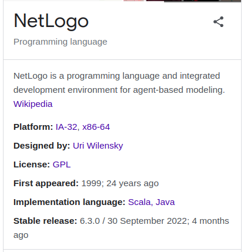
```

]

---
class: middle

# PENDAHULUAN

.pull-left[

## Model __ABM__ yang Dicoba

Ada tiga model __ABM__ yang akan dicoba pada __NetLogo__ kali ini, yaitu:

1. Model _game of life_ atau _cellular automata_,
1. Model _heroes and coward_, dan
1. Model _simple economy_.

## Versi __NetLogo__ yang Digunakan

Kali ini saya akan menggunakan __NetLogo__ versi _web_ yang berada pada _url_: __http://www.netlogoweb.org/__.

]

.pull-right[

```{r out.width="90%", echo=FALSE,fig.align='center'}
knitr::include_graphics("netlogo 2 new.png")
```

]


---
class: middle, center, inverse

# _CELLULAR AUTOMATA 1D_

## Model Pertama

---

class: middle

# _CELLULAR AUTOMATA 1D_

## Penjelasan Singkat

_Cellular automata_ 1 dimensi adalah kondisi _cellular automata_ di mana hanya ada satu dimensi dengan kondisi dari _cell_ hanya `hitam` atau `putih` saja. Kondisi _cell_ pada baris tertentu dipengaruhi oleh kondisi _cell_ pada baris di atasnya dan tetangga terdekatnya (hanya satu _cell_ di sebelah kanan atau kirinya). 

> Ada banyak kombinasi _rules_ yang mendefinisikan kondisi _cells_ pada suatu baris dari _cells_ baris di atasnya.

Sebagai contoh, berikut adalah contoh _rules_ `0` di mana semua kombinasi _cells_ para baris sebelumnya memberikan hasil yang sama pada _cell_ di bawahnya berupa nilai `hitam`.

```{r out.width="70%", echo=FALSE,fig.align='center'}
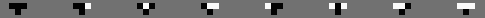
```

Konsekuensi dari _rules_ `0` ini adalah apapun nilai _cells_ di suatu baris, maka baris setelahnya akan bernilai `hitam`.

---

class: middle

# _CELLULAR AUTOMATA 1D_

.pull-left[

## _Rules_ `1`

Berikut adalah _rules_ `1`:

```{r out.width="80%", echo=FALSE,fig.align='center'}
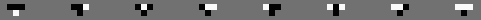
```

Saatnya mencoba dengan _cells_ baris pertama bernilai _random_ dengan cara meng-_input_ _setup random_ pada _density_ sebesar `57%`.

```{r out.width="80%", echo=FALSE,fig.align='center'}
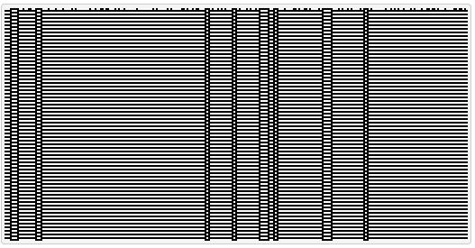
```

Saat _cells_ baris pertama diubah-ubah nilainya, didapatkan hasil yang berbeda juga dari hasil di atas. _Rules_ `1` ini tidak menghasilkan pola yang konvergen ke satu bentuk yang sama.

]

.pull-right[

## _Rules_ `21`

Berikut adalah _rules_ `21`:

```{r out.width="80%", echo=FALSE,fig.align='center'}
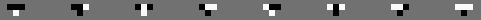
```

Saatnya mencoba dengan _cells_ baris pertama bernilai _random_ dengan cara meng-_input_ _setup random_ pada _density_ sebesar `51%`.

```{r out.width="80%", echo=FALSE,fig.align='center'}
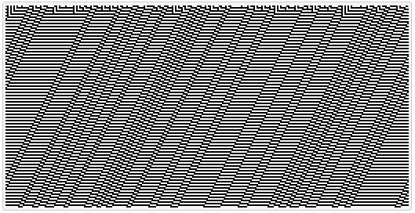
```

Saat _cells_ baris pertama diubah-ubah nilainya, didapatkan hasil yang berbeda juga dari hasil di atas. _Rules_ `21` ini tidak menghasilkan pola yang konvergen ke satu bentuk yang sama.

]

---

class: middle

# _CELLULAR AUTOMATA 1D_

### Apakah ada _rules_ CA 1D yang menghasilkan pola yang konvergen walaupun apapun nilai _cells_ baris awalnya?

---

class: middle

# _CELLULAR AUTOMATA 1D_

## _Rules_ `22`

Berikut adalah pola dari _rules_ `22`:

```{r out.width="80%", echo=FALSE,fig.align='center'}
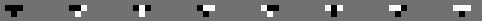
```

Perhatikan saat kita mengganti nilai _density_ menjadi beberapa nilai dan men-_generate_ _cells_ baris awal secara _random_.

.pull-left[

### _Density_ Sebesar `14%`

```{r out.width="80%", echo=FALSE,fig.align='center'}
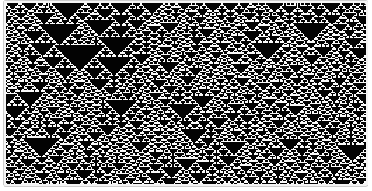
```

]

.pull-right[

### _Density_ Sebesar `51%`

```{r out.width="80%", echo=FALSE,fig.align='center'}
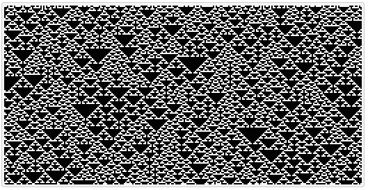
```

]

---

class: middle

# _CELLULAR AUTOMATA 1D_

## _Rules_ `22`

.pull-left[

### _Density_ Sebesar `67%`

```{r out.width="80%", echo=FALSE,fig.align='center'}
knitr::include_graphics("rule 22 density 67.png")
```

]

.pull-right[

### _Density_ Sebesar `74%`

```{r out.width="80%", echo=FALSE,fig.align='center'}
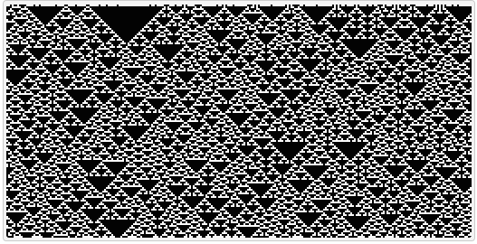
```

]

Pola yang dihasilkan dari berbagai nilai _density_ untuk _cells_ baris pertama adalah hampir mirip dengan pola utama berbentuk segitiga.

Satu hal yang berbeda terjadi jika seluruh _cells_ baris pertama bernilai `hitam` yang menghasilkan keseluruhan baris berikutnya tetap `hitam`.

---
class: middle, center, inverse

# _HEROES AND COWARD_

## Model Kedua

---
class: middle

# _HEROES AND COWARD_

.pull-left[

## Penjelasan Singkat

_Heroes and coward_ adalah suatu permainan yang dilakukan secara beramai-ramai. Setiap pemain diwajibkan memilih secara rahasia satu orang sebagai _friend_ dan satu orang sebagai _enemy_. Kemudian setiap pemain akan diberikan satu kepribadian, yakni di antara _heroes_ atau _coward_.

]

.pull-right[

```{r out.width="70%", echo=FALSE,fig.align='center'}
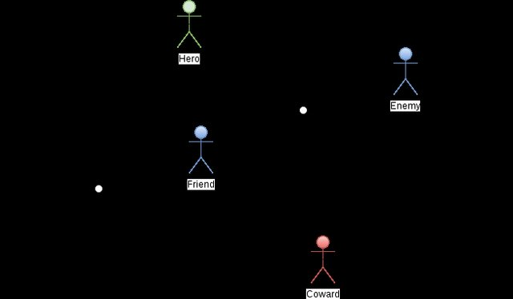
```

]

## Aturan Main

.pull-left[

- Jika pemain memiliki kepribadian _coward_, maka pemain tersebut harus selalu bersembunyi di belakang _friend_ (menjadikan pemain yang dipilih sebagai _friend_ sebagai tameng antara pemain tersebu dengan pemain yang dipilihnya sebagai _enemy_).

]
.pull-right[

- Jika pemain memiliki kepribadian _heroes_, maka pemain tersebut harus berada di depan _friend_ (melindungi pemain yang dipilih sebagai _friend_ dari pemain yang dipilihnya menjadi _enemy_).

]

---
class: middle

# _HEROES AND COWARD_

## Percobaan Pertama

Pada percobaan pertama ini, kita akan men-_generate_ 20 orang pemain yang pada awalnya memiliki posisi secara acak. Kemudian kita buat semua pemain memiliki kepribadian _coward_. Apa yang terjadi saat kita _run_ __NetLogo__?

.pull-left[

### Kondisi Awal

```{r out.width="50%", echo=FALSE,fig.align='center'}
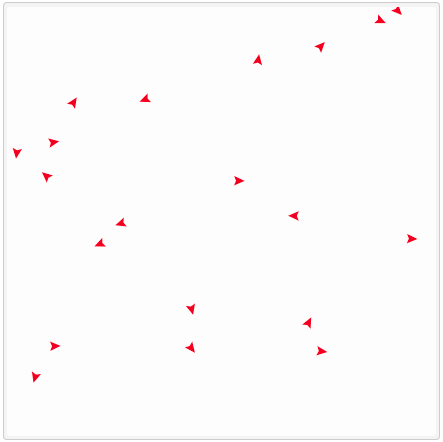
```

]

.pull-right[

### Kondisi Akhir

```{r out.width="50%", echo=FALSE,fig.align='center'}
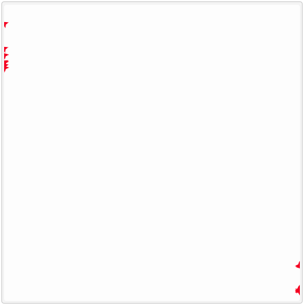
```

]

Jika kita amati pergerakan para pemain sejak __NetLogo__ di-_run_, terlihat jelas bahwa semua pemain melarikan diri satu sama lain ke pojok area permainan. Tengah area permainan menjadi kosong dari pemain karena semua pemain saling menghindar satu sama lain.


---
class: middle

# _HEROES AND COWARD_

## Percobaan Kedua

Pada percobaan kedua ini, kita akan men-_generate_ 20 orang pemain yang pada awalnya memiliki posisi secara acak. Kemudian kita buat semua pemain memiliki kepribadian _heroes_. Apa yang terjadi saat kita _run_ __NetLogo__?

.pull-left[

### Kondisi Awal

```{r out.width="50%", echo=FALSE,fig.align='center'}
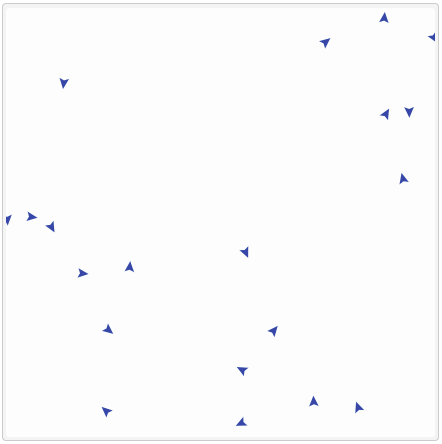
```

]

.pull-right[

### Kondisi Akhir

```{r out.width="50%", echo=FALSE,fig.align='center'}
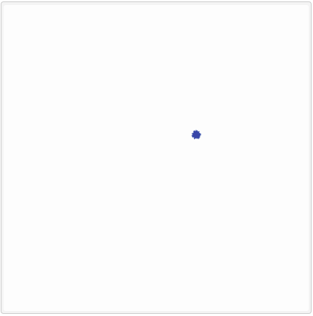
```

]

Jika kita amati pergerakan para pemain sejak __NetLogo__ di-_run_, terlihat jelas bahwa semua pemain berusaha saling melindungi satu sama lain sehingga semuanya akan berkumpul menjadi satu titik di tengah area permainan.


---
class: middle

# _HEROES AND COWARD_

## Percobaan Ketiga

Pada percobaan ketiga ini, kita akan men-_generate_ 50 orang pemain yang pada awalnya memiliki posisi secara acak. Kemudian kita _random_ semua pemain memiliki kepribadian _heroes_ atau _coward_. Apa yang terjadi saat kita _run_ __NetLogo__?

Warna menandakan `merah` adalah pemain _coward_ sedangkan `biru` adalah _heroes_.

.pull-left[

### Kondisi Awal

```{r out.width="50%", echo=FALSE,fig.align='center'}
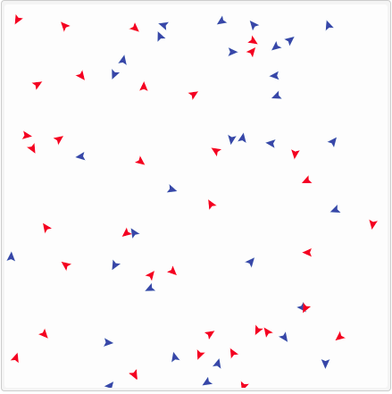
```

]

.pull-right[

### Kondisi Akhir

```{r out.width="50%", echo=FALSE,fig.align='center'}
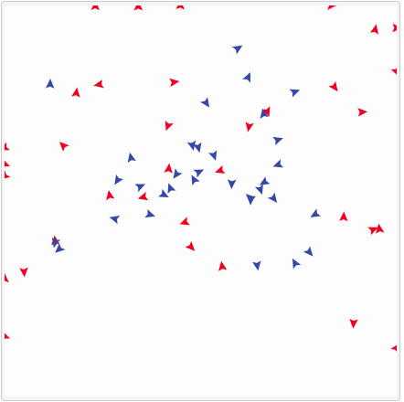
```

]

---
class: middle

# _HEROES AND COWARD_

## Pergerakan Pemain pada Percobaan Ketiga

Jika kita amati, sejak kondisi awal hingga kondisi akhir, para pemain bergerak ke segala arah mencari posisi terbaik sesuai dengan kepribadian yang sesuai dengan mereka miliki.

.pull-left[

Pola akhir yang dibentuk dari semua pemain bisa berbentuk macam-macam. 

- Ada kalanya berbentuk acak seperti pada _slide_ sebelumnya. 
- Bisa juga berbentuk garis lurus di mana semua pemain saling menghindar atau saling melindungi. 
- Atau bisa juga tidak konvergen ke suatu bentuk dan terus bergerak sepanjang waktu tidak berhenti. Hal ini sangat dimungkinkan jika antara setiap pemain saling memiliki _friend_ dan _enemy_ yang berlawanan. Lihat gambar di sebelah kanan. 
    - Misalkan: pemain 1 mengganggap pemain 2 sebagai _friend_, sedangkan pemain 2 mengganggap pemain 1 sebagai _enemy_.

]

.pull-right[

```{r out.width="50%", echo=FALSE,fig.align='center'}
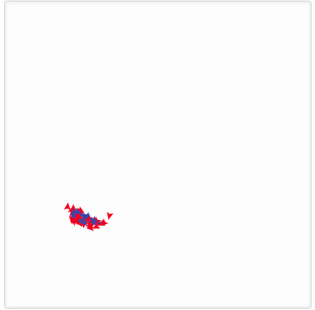
```

Pemain akan terus bergerak tanpa henti.

]

---
class: middle, center, inverse

# _SIMPLE ECONOMY_

## Model Ketiga

---
class: middle

# _SIMPLE ECONOMY_

.pull-left[

## Penjelasan Singkat

Perilaku masyarakat dalam hal ekonomi bisa dimodelkan dengan __ABM__. Sudah banyak ekonom yang mencoba memodelkan hal ini. Kali ini kita akan mencoba model __ABM__ yang berkaitan dengan penyebaran kekayaan.

Misalkan dalam suatu area, ada $n$ orang yang diberi "kekayaan" yang sama (misalkan uang sebesar 100$). Dalam setiap unit waktu, $n$ orang tersebut akan memberikan uangnya ke orang lain secara _random_. Jumlah total uang yang ada adalah tetap, sehingga jika ada pemain yang uangnya sudah habis, pemain tersebut baru akan memiliki uang kembali saat ada pemain lain yang memberikan uangnya kepada pemain tersebut.

> Bagaimana hasil akhir distribusi kekayaan pada area tersebut?

]

.pull-right[

```{r out.width="90%", echo=FALSE,fig.align='center'}
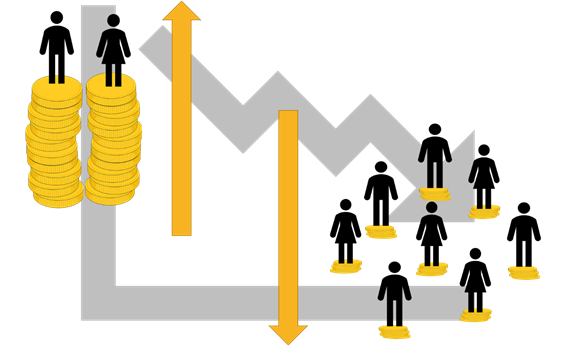
```

]

---
class: middle

# _SIMPLE ECONOMY_

Jika kita perhatikan kembali kondisi ini, setidaknya akan ada dua kemungkinan:

1. Kekayaan akan terdistribusi secara merata kembali.
1. Kekayaan akan terdistribusi tidak merata dan mengikuti suatu distribusi tertentu (mungkin berbentuk_bell curved_ atau bisa jadi berbentuk _pareto_). Artinya akan ada beberapa pemain yang memiliki kekayanan yang lebih dibandingkan pemain lain.

.pull-left[

### Kondisi Awal

Semua pemain memiliki kekayaan yang sama.

```{r out.width="60%", echo=FALSE,fig.align='center'}
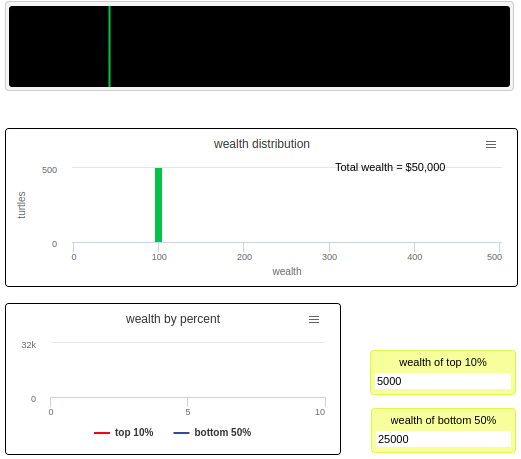
```

]

.pull-right[

### Kondisi Pada Unit Waktu `182`

Semua pemain mulai memiliki kekayaan yang berbeda-beda. Mulai berbentuk _bell curved_.

```{r out.width="60%", echo=FALSE,fig.align='center'}
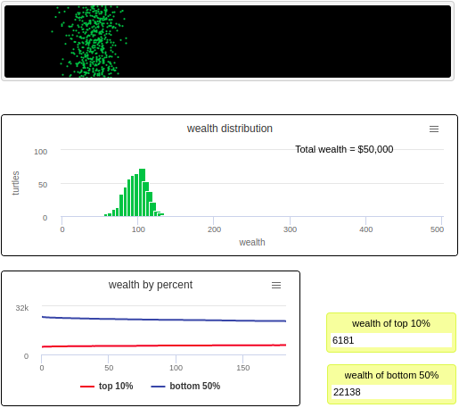
```

]

---
class: middle

# _SIMPLE ECONOMY_

.pull-left[

### Kondisi Pada Unit Waktu `1117`

Distribusinya sudah masih berbentuk _bell curved_.

```{r out.width="60%", echo=FALSE,fig.align='center'}
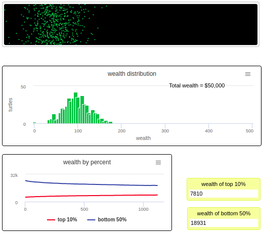
```

]

.pull-right[

### Kondisi Pada Unit Waktu `16347`

Distribusi kekayaan para pemain sudah membentuk distibusi _pareto_, dimana kekayaan ___top 10%___ pemain yang kaya sudah melebihi kekayaan pemain-pemain di ___bottom 50%___.

```{r out.width="60%", echo=FALSE,fig.align='center'}
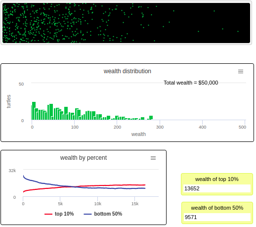
```

]

---
class: middle

# _SIMPLE ECONOMY_

## Kondisi Waktu di Akhir

.pull-left[

```{r out.width="80%", echo=FALSE,fig.align='center'}
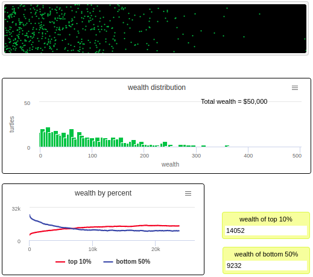
```

]

.pull-right[

### Kesimpulan

Sebuah akhir yang menarik bahwa tidak akan kita dapatkan kekayaan tersebar secara merata. Kekayaan juga tidak tersebar mengikuti _bell curved_. 

> Justru kekayaan tersebar mengikuti distribusi pareto.

Akan selalu ada sekelompok kecil orang yang memiliki total kekayaan yang melebihi total kekayaan mayoritas orang-orang lain. 

]

---
class: middle,center,inverse

# Terima Kasih

_Find me at_ [ikanx101.com](https://ikanx101.com/)
