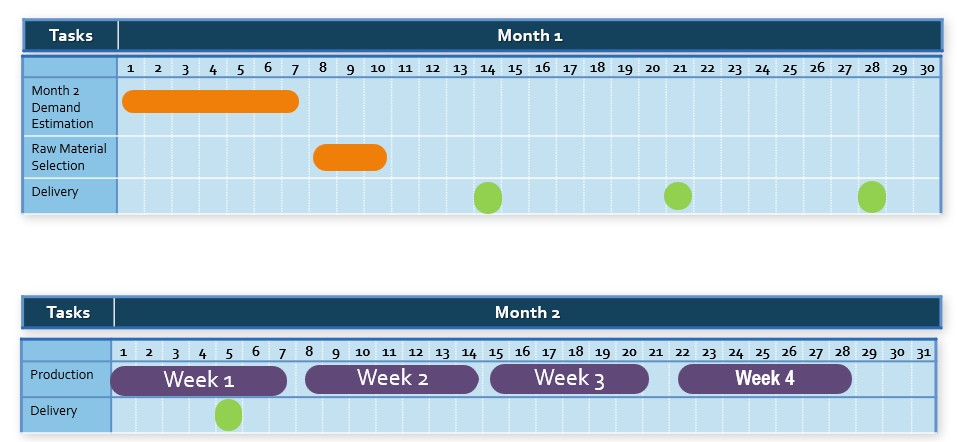
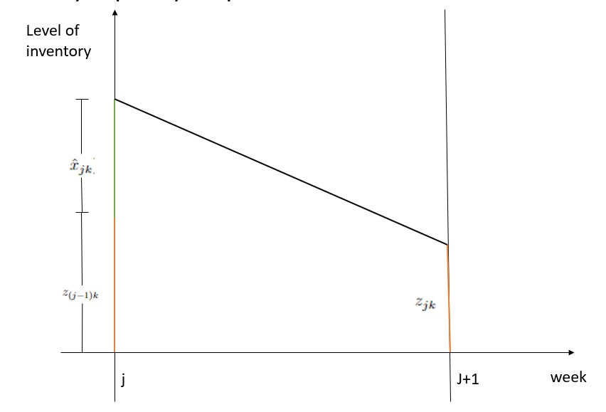

```{r setup,include=FALSE}
setwd("~/209_ITB/Thesis/MethodX/Manuscript")

library(dplyr)
```

# Introduction

This paper concerns the optimization model for supplier selection, order allocation, and raw-material composition in a beverage company that produces a large number of drink powders. There are a number of suppliers that can provide the same key raw material of the drink powders, but the color or some physical characteristics are slightly different so we may assume those raw materials are different. The drink powders produced by this company, which in the remainder of this paper are called items, can be classified into two classes of items. 

- The first class consists of items that can be produced by using exactly a single type of raw material.
- The second class consists of more flexible items, where each item in this class can be produced by using one raw material or by using a composition of a number of raw materials. For each item in this class, we then have a set of possible raw materials. The sets of possible materials may vary from one to the other.

In order to avoid supply disruption, the company decides to use multiple sources for these raw materials. The company has established selection criteria for each raw material, which are based on the estimated one-year total demand of raw materials and  a subjective assessment of whether the raw material cannot be substituted, price, service, and the minimum order required for each purchase. After determining the score for each raw material, the company decided to make contracts or agreements with six suppliers. Each contract stated the unit price price and the minimum order quantity within a year. Based on these contracts, production planning and inventory control of raw materials are carried out.

The estimated total one-year demand for items is obtained from the forecasting process performed yearly.  This forecasting process yields the monthly total demand for items, which is time varying. But at the production level, the company refines the monthly total demand on a monthly basis as a response to some disruptions such as sudden additional requests due to flash sales practices in e-commerce, and others.

Once the demand for items for a month is issued, the company must perform the decision for purchasing the raw materials from some suppliers. This purchase decision from a supplier includes purchase for four serial deliveries one week apart. The first delivery must be no later than 17 days before the following  month's start. The period of 17 days here is the total time required for  the company's internal inspection and preparation of raw materials.

This decision process is a complex one since there are a large number of items that have to be produced which mostly belong to the second class, and the monthly demand may vary. Additionally, the company imposes a production regulation for the second class of items as a result of the multiple-sources policy, which states that each item in the second class must be produced using a composition of at least two types of the corresponding possible raw materials. The decision process must be performed carefully in order to obtain results in the form of:

- which raw materials are purchased along with the delivery size for every four corresponding weeks,
- the composition of raw materials for every item in the second class which has to be produced,

\setlength{\parindent}{0pt} while minimizing the total inventory cost.

\setlength{\parindent}{10pt}

The company developed a decision support system for this monthly decision process, which is developed based on an optimization model. This paper concerns the derivation of the optimization model, which can be categorized as a  multi-product multi-period multi-supplier raw material selection and composition, and order quantity problem.  The multi-product multi-period multi-supplier raw material selection problem has been addressed in a number of articles such as Sambatt, Woarawichai, and Naenna [@a1], but they do not address the minimum one-year order quantity contracts so that their optimization problem is simpler than our optimization problem. In general, our optimization problem is much more complex compared to the one criterion supplier selection studied in an enormous articles such as  Reck & Long [@a2], Monckza & Trecha [@a3], & Porter, and Harding papers. Later, supplier selection research has developed into a problem with multiple criteria, such as criteria for quality of goods, on time delivery, after-sales service, as well as environmental and socio-political criteria for suppliers (see Smytka & Clemens [@a4], Gray [@a5]).  What is interesting is that in general these criteria contradict each other, for example, goods offered at low prices (positive values for the price criteria) may have negative values for on time delivery criteria. The complexity of this issue is compounded by the fact that some criteria are quantitative (price, timeliness of delivery, specification/quality of goods, etc.), but other criteria are qualitative (after-sales service, environmental and socio-political criteria of suppliers).

The paper by Weber Current & Benton [@a6] is a paper at the beginning of this research on multi-criteria supplier selection, which presents research results with four criteria, namely Price, Quality, Delivery and Service (PDQS). This paper together with Hurkens, van der Valk, Wynstra [@a7] introduces the supplier selection problem under the concept of Total Cost Ownership (TCO), a financial analysis tool to examine the direct and indirect costs of a product's production. These direct and indirect costs then become the criteria in the supplier selection process. These papers on TCO include Ferrin & Plank [@a8], Degraeve & Roodhooft [@a9]. Our optimization problem is categorized as a multi-criteria one, where one of the criteria is a new one, i.e the minimum one-year order quantity.  

After the rise of conceptual research on supplier selection with multi-criteria, then we quite easily find a proposal to use the Analytic Hierarchy Process (AHP), a decision-making method when it comes to ranking of many criteria (see Dyer [@a10]), as a method of solving supplier problems. selection. AHP provides a framework for addressing various criteria involving intuitive, rational, qualitative and quantitative aspects. Other papers that discuss the AHP approach to supplier selection solutions include Bard, Belton [@a11], Bhutta & Huq [@a12], Nydick & Hill [@a13]. 

Another method proposed as a solution to the supplier selection problem is an optimization method or mathematical programming as proposed by Degraeve & Roodhooft [@a9], Khalifa & Mohammed Al-Shabi [@a14], and Nispeling [@a15]. A special optimization method, namely multi-objective goal programming, was proposed by Weber & Ellram [@a16]. Multi-objective programming is very suitable to be used to resolve conflicts between existing criteria and the existence of just-in-time scenarios. Meanwhile, Masella &  Rangone [@a17] offer a dynamic programming method as a method of completing this supplier selection, where input variables are set as controls and environmental variables and status variables are set as the internal workings of the organization, and output variables are seen as company performance. Another optimization method used as a solution method is Data Envelopment Analysis (DEA), as proposed in the paper of Pitchipoo, et al. [@a18] and Shahrzad, et al. [@a19].

Apart from these methods, we get the combined use of the two methods above (hybrid method), such as the one proposed by Li, Wong, & Kwong [@a20]  which combines the AHP method and multi-objective programming. Another approach is the metaheuristic method proposed by Alejo-Reyes, et al. [@a21]. We accommodate  all criteria in one objective function, so that our optimization model can be categorized as a mix-integer linear programming. 

This paper is written as follow. After this introduction, we describe the production planning and inventory control in the company in Section 2. After that we derive the optimization model in Section 3. In this section, we discuss the definition of the objective function which expresses all criteria for decision making. Then, in Section 4 we present the result of our numerical experimentation for obtaining the optimal solution. We end this paper by discussing the sensitivity analysis of the decision criteria to the optimal solution which we present in Section 5. 

# Research methodology

## Production Planning and Inventory Control for Raw Materials

As mentioned above, the company deals with six raw material suppliers. The decision process for supplier selection and order allocation is carried out every month based on the results of demand forecasting at the beginning of the year and production performance in the previous month. From this demand forecasting process, the company then makes the purchase and sales agreements with all six suppliers concerning the one-year minimum purchase, unit price, and minimum one-month delivery. The serial process in one calendar year can be seen in figure 1.  At the beginning of a month, the company forecasts the demand for items in the following month.

```{r out.width="80%",fig.align='center',echo=FALSE,fig.cap="One-year production planning and inventory control"}
knitr::include_graphics("production planning and inventory control.jpg")
```

From the estimated monthly demand for items obtained from the yearly forecasting process, we directly can find out the estimated monthly total demand for raw materials in one year. In practice, this one-month estimated demand must be reviewed due to several things, such as production in the previous month experiencing disruptions, sudden additional requests due to flash sales practices in e-commerce, and others. Reviewing the one-month demand and determining the production schedule we call production planning for one month. 

As soon as the production planning is performed, the company performs the decision process for purchasing the raw materials from some suppliers. In the following, we assume that one month can be divided into four weeks (the fourth week may be longer than seven days). This purchase decision covers purchases for four serial deliveries one week apart. The first delivery must be no later than 17 days before the following month's start since the internal inspection and the preparation for the raw materials delivered takes 17 days. Figure 2 in the following illustrates a one-month planning horizon and raw material selection,  and four consecutive delivery points follow it. 


```{r out.width="80%",fig.align='center',echo=FALSE,fig.cap="Decision proccess planning horizon"}

```

\newpage

The decision process considers some parameters for decision making such as: 

- raw materials purchase prices, 
- existing stock of raw materials in the warehouse,
- the minimum one-month delivery  of raw materials(if ordered),
- the minimum one-year purchase of each raw material,
- raw-material flexibility of each item, which is known by the number of raw materials that can be used to produce the item. The larger this number for an item, the more flexible the item,
- and others.

The purchase must also comply with the company's internal policies in the following. 

__Policy 1.__ purchase raw materials from at least two suppliers in order to maintain supply security, 

__Policy 2.__ if an item must be produced by using more than one raw material, the proportions of raw materials used are the same. 

In the following section, we will accommodate all these policies into some constraints of an optimization model that can be regarded as the main engine of the Decision Support System developed by the company in order to achieve an optimal decision in inventory control.  

# Mathematical model of the problem

In this section, we formulate a mathematical model of the decision problem. As described before, we need to make a decision for raw material selection, delivery quantities, and raw material compositions on the four consecutive weeks covered. In the following, we derive a mixed integer linear programming that represent the decision problem. We first present the sets, the parameters, and the decision variables used in the mathematical model. We then present the constraints which represent the production rules and capacity, followed by the discussion concerning the objective function of the optimization model. The integer linear programming is written after that.

## Sets and parameters

- $M = \left\{ 1,2,3,4 \right\}$ as the set of weeks on the supply cycle, 
- $N$ as the number of raw materials, 
- $\mathfrak{N}= \left\{ 1,2,...,N \right\}$ as the set of raw-materials,
- $I$ as the number of items,
- $\mathfrak{I} =  \left\{ 1, 2, ..., I  \right\}$ as the number of items,
- $P \bigcup_{j \in M} P_j$ as the set of items to be produced on the planning horizon, where $P_j$ as the set of items to be produced on week $j$.
- For $i \in \mathfrak{I}, k \in \mathfrak{N}$,

$$f_{ik} = 
\left\{\begin{matrix}
1 & , & \text{if item } i \text{ can be produce by using raw material } k  \\ 
0 & , & \text{otherwise}
\end{matrix}\right. 
$$

- For $j \in M, D_j$ as the set of the total demand on week $j$.
- For $k \in \mathfrak{N}, mo_k$ as the the one-year minimum order quantity of raw material $k$.
- For $k \in \mathfrak{N}, c_k$ as the unit price of raw material $k$.
- For $k \in \mathfrak{N}, \sigma_k$ as the minimum one-month order quantity of raw material $k$, if purchased, 
- For $k \in \mathfrak{N}, z_{0k}$ as the level of inventory of raw material $k$ just before the first delivery on the first week, 
- $ss$ as the  safety stock for each raw material at the end of each week,
- $maxcap$ as the  warehouse capacity, 
- $hc$ as the holding cost per item per week. 

### Decision variables 

Define:

- $\forall k \in N, x_k$ as the amount of raw material $k$ purchased. $x_k = 0$ if raw material $k$ is not purchased, and $\sigma_k \leq x_k \leq D$ otherwise.
- $\forall k \in N$,

$$y_k = 
\left\{\begin{matrix}
0 & , & x_k  \\ 
1 & , & \sigma_k \leq x_k \leq D
\end{matrix}\right. 
$$

- The variables $y_k$ are defined to handle the discontinuity property of the variables $x_k$.
- $\forall j \in M, \forall k \in N, \hat{x}_{jk}$ as the amount of raw material $k$ delivered at the beginning of week $j$.
- $\forall j \in M, \forall i \in P_j, \forall k \in N,$

$$a_{ijk} = 
\left\{\begin{matrix}
1 & , & \text{if item } i \text{ on the week }j \text{ produced by using raw material } k  \\ 
0 & , & \text{otherwise}
\end{matrix}\right. 
$$

- $\forall j \in M, \forall i \in P_j, \forall k \in N, b_{ijk}$ as the proportion of raw material $k$ used to produce item $i$ on the week $j$ if it uses raw material $k$.
- $\forall j \in M, \forall k \in N, z_{jk}$ as the level of inventory raw material $k$ at the end of week $j$. 

### Constraints

The following mathematical expressions are the constraints for our mathematical model. We write these constraints in groups where we give a short explanation in each group the purpose of creating the constraints.

__Constraint I__ are set to handle the discontinuity value of $x_k$. $\forall k \in N,$

\begin{align}
  x_k \leq y_k \space D
\end{align}

\begin{align}
  x_k \geq \sigma_k \space y_k 
\end{align}

__Constraint II__ are set to fulfill the weekly allocation of each type of raw material. $\forall k \in N,$

\begin{align}
  x_k = \sum_{j \in M} \hat{x}_{jk}
\end{align}

__Constraints III__ are set to fulfill the raw-material demand each week. $\forall j \in M,$

\begin{align}
  \sum^{N}_{k=1} \hat{x}_{jk} + \sum^{N}_{k=1} z_{(j-1)k} \geq D_j 
\end{align}

__Constraints IV__ are set to ensure each item in $P^2$ is produced by using at least two raw materials. $\forall j \in M, \forall i \in P^2_j$

\begin{align}
  \sum_{k \in N} a_{ijk} \geq 2
\end{align}

__Constraints V__ concern on the relation among $f_{ik}, a_{ijk}, b_{ijk},$ and $x_{jk}$. $\forall j \in M, i \in P, k \in N$.

\begin{align}
  a_{ijk} \leq f_{ik}
\end{align}

$\forall j \in M, \forall i \in P, \forall k \in N$

\begin{align}
  b_{ijk} \leq f_{ik} a_{ijk}
\end{align}

\begin{align}
  \mu a_{ijk} \leq b_{ijk}
\end{align}

for a small value of $\mu$.

$\forall j \in \hat{M}, \forall i \in P_j,$

\begin{align}
  \sum_{k \in N} b_{ijk} = 1
\end{align}

__Constraints VI__ are set to fulfill the Policy II. $\forall j \in \hat{M}, \forall i \in P^2_j, k_1, k_2 \in N, k_1 \neq k_2,$

\begin{align}
  (1 - a_{ijk_1}) + (1 - a_{ijk_2}) \geq b_{ijk_1} - b_{ijk_2}
\end{align}

\begin{align}
  (1 - a_{ijk_1}) + (1 - a_{ijk_2}) \geq b_{ijk_2} - b_{ijk_1}
\end{align}


__Constraints VII__ are set to ensure that the level of inventory just after raw material delivery does not exceed the maximum capacity. On the beginning of week 1,

\begin{align}
  \sum_{k \in N} (z_{0k} + \hat{x}_{1k} + z_{1k}) - D_1 \leq maxcap
\end{align}

$\forall j \in \left\{ 2,3,4 \right\},$


\begin{align}
  \sum_{k \in N} (z_{(j-1)k} + \hat{x}_{(j-1)k}) - \sum_{i \in P_j} b_{ijk} g_{ik} + z_jk \leq maxcap
\end{align}

$\forall j \in M,$

\begin{align}
  \sum_{k \in N} (z_{(j-1)k} + \hat{x}_{jk}) - \sum_{i \in P_j} b_{ijk} g_{ik} + z_jk \leq maxcap
\end{align}

__Constraints VIII__ are set to ensure that the level of inventory at the end of each week must be greater than or equal to the safety stock. $\forall j \in M, \forall k \in P,$

\begin{align}
  z_{jk} \geq ss
\end{align}

### Objective function

We define the objective function as the sum of the holding cost, the purchase cost, and a function for accommodating the minimum one-year order quantity contracts.

The level of inventory of raw-material $k$ during one week can be seen in figure 3.

\newpage

```{r out.width="70%",fig.align='center',echo=FALSE,fig.cap="Illustration for inventory cost calculation"}

```

So that the holding cost can be given as:

$$
\frac{1}{2} hc \sum_{j \in \mathfrak{M}} \sum_{k \in \mathfrak{N}} (z_{(j-1)k} + z_{jk} + \hat{x}_{jk})
$$

Meanwhile the purchase cost can be given as:

$$
  \sum_{k \in \mathfrak{N}} c_k x_k
$$

We consider another function in the objective function, which is created to accommodate the one-year minimum order quantity contracts. 

Constraints I - VIII concern fulfillment of the minimum one-month order quantity contract, the monthly demand,   warehouse capacity constraint, safety stock constraint, and raw material composition requirements. Meanwhile, the one-year minimum order quantity contract is quite difficult to be expressed as a constraint in the optimization model that has a one-month-long planning horizon. 

Therefore, we accommodate the yearly purchase contract which we represent as a part of the objective function of our optimization problem. To fulfill the one-year minimum order quantity contracts, we define a penalty function:

$$
  - \sum_{k \in \mathfrak{N}} \alpha_k mo_k x_k
$$

where for $k \in \mathfrak{N}, \alpha_k$ is multiplier constants that will be discussed later. By denoting $\bar{x}$ as the vector with elements $x_k$ and $\hat{x}_{jk},$ and $\bar{z}$ as the vector with elements $z_{jk}$ the objective function of our optimization model is then can be written as:

$$
  F(\bar{x},\bar{z}) = \frac{1}{2} hc \sum_{j \in \mathfrak{M}} \sum_{k \in \mathfrak{N}} (z_{(j-1)k} + z_{jk} + \hat{x}_{jk}) + \sum_{k \in \mathfrak{N}} c_k x_k - \sum_{k \in \mathfrak{N}} \alpha_k mo_k x_k
$$

### Optimization model

The optimization model for supplier selection, order allocation, and raw material composition can be written as a mixed integer linear programming: 

$$
\begin{matrix}
\text{minimize} & F(\bar{x},\bar{z}) \\
\text{subject to} & \text{Constraint I-VIII} \\
 & x_k, \hat{x}_{jk}, z_{jk} \in \mathbb{Z}^+, y_k, a_{ijk} \in \left\{0,1 \right\}, 0 \leq b_{ijk} \leq 1
\end{matrix}
$$

where the set of __Constraints I__ up to __Constraints VIII__ are given by equations (1) - (15). 

# Results

In this section, we give an example of the solution of the optimization model we derived in the previous section. In this example, we consider an instant where $N=6$ and $I=51,$ so that we have 2508 decision variables.

## Parameters values

The following tables show the matrix of raw-material flexibility of all items.

```{r,echo=FALSE,message=FALSE,warning=FALSE}
rm(list=ls())

library(readxl)
library(kableExtra)

df = read_excel("~/209_ITB/Thesis/Overleaf Version/data input.xlsx",sheet = "matriks gula x produk")
#df[is.na(df)] = 0
colnames(df)[2:7] = 1:6
df[1:25,] %>% 
  rename(item = code_product) %>% 
  knitr::kable(caption = "the flexibility matrix of items 1-25") %>% 
  kable_styling(latex_options = "hold_position") %>% 
  add_header_above(c(" " = 1,"Raw material" = 6))
```
\pagebreak

```{r,echo=FALSE,message=FALSE,warning=FALSE}
df[26:51,] %>% 
  rename(item = code_product) %>% 
  knitr::kable(caption = "the flexibility matrix of items 26-51") %>% 
  kable_styling(latex_options = "hold_position") %>% 
  add_header_above(c(" " = 1,"Raw material" = 6))
```

Next, we present the instant of the total raw material demands during a planning horizon.

```{r,echo=FALSE,message=FALSE,warning=FALSE}
rm(list=ls())

my_comma = scales::label_comma(accuracy = .1, big.mark = ",", decimal.mark = ".")

df = read_excel("~/209_ITB/Thesis/Overleaf Version/data input.xlsx",sheet = "matriks produk x minggu")
colnames(df)[2:5] = paste0("week ",1:4)

df$`week 1` = my_comma(df$`week 1`)
df$`week 2` = my_comma(df$`week 2`)
df$`week 3` = my_comma(df$`week 3`)
df$`week 4` = my_comma(df$`week 4`)

df[1:11,] %>% 
  rename(item = code_product) %>% 
  knitr::kable(caption = "the flexibility matrix of items 1-11") %>% 
  kable_styling(latex_options = "hold_position") %>% 
  add_header_above(c(" " = 1,"raw -material demand (in kg)" = 4))
```

\newpage

```{r,echo=FALSE,message=FALSE,warning=FALSE}
df[12:51,] %>% 
  rename(item = code_product) %>% 
  knitr::kable(caption = "the flexibility matrix of items 12-51") %>% 
  kable_styling(latex_options = "hold_position") %>% 
  add_header_above(c(" " = 1,"raw-material demand (in kg)" = 4))
```

We can see that items 5 and 36 do not have to be produced during this planning horizon. We also can see that most items have to be produced only in to or three weeks of this planning horizon, with varying demand.

The others parameters values are given in the following table.

\newpage

```{r,echo=FALSE,message=FALSE,warning=FALSE}
rm(list=ls())

my_comma = scales::label_comma(accuracy = .1, big.mark = ",", decimal.mark = ".")

df = read_excel("parameter.xlsx")
df$`1` = my_comma(df$`1`)
df$`2` = my_comma(df$`2`)
df$`3` = my_comma(df$`3`)
df$`4` = my_comma(df$`4`)
df$`5` = my_comma(df$`5`)
df$`6` = my_comma(df$`6`)

df$code_gula[2] = '$\\sigma_k$ (in kg)'
df$code_gula[3] = '$z_{0k}$ (in kg)'
df$code_gula[4] = '$m_{0k}$ (in kg)'
df$code_gula[5] = '$ss$ (in kg)'

colnames(df)[1] = " "

df %>% 
  knitr::kable("latex", align="c", booktabs=TRUE, escape = F,
               caption = "the other parameter's values") %>% 
  kable_styling(latex_options = "hold_position") %>% 
  add_header_above(c(" " = 1,"raw-material" = 6)) %>% 
  footnote(general = c("maxcap (in kg) = 1,427,000"))
```


From Table 2 we know that raw material 4 must be purchased since item 49 and 50 can be produced just by using raw material 4.  The price of raw material 4 is the lowest one. But the minimal one-year order quantity is the second smallest. So that we may guess that on the optimal solution, $x_4$ will have a big value but is not the biggest one among others.

## Optimal solution

We solve the optimization problem by creating computer codes using R language (version 4) where the optimization problem formulation and the solution technique used are referred to dplyr [@dplyr] and ompr [@ompr] libraries. This program runs on a computer with the Linux Ubuntu 20 LTS operating system with an Intel i7 8 Cores processor and 16 GB RAM.

The values of $x_k,k \in \mathfrak{N},$ are given in the second column of Table 6 in the following. The weekly deliveries are given on columns 4 up to 6.  We see that the total one-month order quantity exceeds the minimum one-month order quantity $\sigma_k,$ so that set of Constraints I is satisfied.

```{r,echo=FALSE,message=FALSE,warning=FALSE}
rm(list=ls())

df = data.frame(
  x1 = c(1:6,"Total"),
  x2 = c("192,649","543,385","90,742","56,508","52,958","202,853","1,139,094"),
  x3 = c("6,553","354,839","41,092","33,264","42,608","70,728","549,083"),
  x4 = c("65,295","23,595","26,550","209","10,350","111,075","237,074"),
  x5 = c("81,722","96,122","14,400","18,369","0","0","210,613"),
  x6 = c("39,079","68,829","8,700","4,666","0","21,050","142.324")
)

colnames(df)[1]   = "Raw Material"
colnames(df)[2]   = "Order Qty\n(in kg)"
colnames(df)[3]   = "Week 1"
colnames(df)[4]   = "Week 2"
colnames(df)[5]   = "Week 3"
colnames(df)[6]   = "Week 4"

df %>% 
  knitr::kable("latex",align="c", booktabs=TRUE, escape = F,
               caption = "Total order quantity and weekly deliveries") %>% 
  add_header_above(c(" " = 2,"weekly deliveries (in kg)" = 4)) %>% 
  kable_styling(latex_options = "hold_position")
```

Besides the values $x_k$ above, we also get $\hat{x}_{ijk}, a_{ijk}, b_{ijk}$ and values $z_{jk}$ in the optimal solution. We have checked that set of __Constraints II – V__ are satisfied by this optimal solution. For brevity, we do not present those values here. We just present and discuss some of them, to show that the remaining constraints are satisfied.

Most values of $b_{ijk}$ are $0.5$ which mean most of items are produced by using a composition of two raw materials. The values of $b_{ijk}$ may vary from one week to another week, as illustrated in Table 7. The composition of raw materials for item 46 in week 1is different from the composition in week 2. Furthermore, Table 7 shows us that the proportions of raw materials used for producing an item are the same. We have checked this property through all  for all  and for all  so that we are sure that set of __Constraints VI__ are satisfied.

```{r,echo=FALSE,message=FALSE,warning=FALSE}
rm(list=ls())

my_comma = scales::label_comma(accuracy = .01, big.mark = ",", decimal.mark = ".")

df = data.frame(
  item = c(rep(45,4),rep(46,4)),
  week = c(1:4,1:4),
  x1   = c(0,0.5,0.5,0.5,0.333,0.5,0,0),
  x2   = c(0.5,0.5,0.5,0.5,0.333,0.5,0,0),
  x3   = rep(0,8),
  x4   = c(0.5,0,0,0,0.333,0,0,0),
  x5   = rep(0,8),
  x6   = rep(0,8)
) %>% 
  mutate(x1 = my_comma(x1),
         x2 = my_comma(x2),
         x3 = my_comma(x3),
         x4 = my_comma(x4),
         x5 = my_comma(x5),
         x6 = my_comma(x6))

colnames(df)[3:8] = 1:6

df %>% 
  knitr::kable("latex", align="c", booktabs=TRUE, escape = F,
               caption = "the values of $b_{ijk}$ for $i = 45$ and $i = 46$") %>% 
  kable_styling(latex_options = "hold_position") %>% 
  add_header_above(c(" " = 2,"raw-material" = 6)) 
```

The following table shows the composition of raw materials for items 49 and 50. We can see that these items are produced by using raw material 4, which confirm the flexibility matrix in Table 3.

```{r,echo=FALSE,message=FALSE,warning=FALSE}
rm(list=ls())

my_comma = scales::label_comma(accuracy = 1, big.mark = ",", decimal.mark = ".")

df = data.frame(
  item = c(rep(49,4),rep(50,4)),
  week = c(1:4,1:4),
  x1   = rep(0,8),
  x2   = rep(0,8),
  x3   = rep(0,8),
  x4   = c(0,1,0,0,1,0,1,0),
  x5   = rep(0,8),
  x6   = rep(0,8)
) %>% 
  mutate(x1 = my_comma(x1),
         x2 = my_comma(x2),
         x3 = my_comma(x3),
         x4 = my_comma(x4),
         x5 = my_comma(x5),
         x6 = my_comma(x6))

colnames(df)[3:8] = 1:6

df %>% 
  knitr::kable("latex", align="c", booktabs=TRUE, escape = F,
               caption = "the values of $b_{ijk}$ for $i = 49$ and $i = 50$") %>% 
  kable_styling(latex_options = "hold_position") %>% 
  add_header_above(c(" " = 2,"raw-material" = 6)) 
```

The fulfillment of the safety stock constraint and the maximum capacity constraint (set of __Constraints VII and VIII__) can be seen in the following table.

```{r,echo=FALSE,message=FALSE,warning=FALSE}
rm(list=ls())

df = data.frame(
  raw = 1:6,
  x1  = c("2,501","181,743","2,500","2,500","2,500","2,500"),
  x2  = c("2,501","2,501","2,500","2,501","2,500","2,500"),
  x3  = c("2,500","2,500","2,500","2,501","2,500","2,500"),
  x4  = c(rep("2,500",6))
)

colnames(df)[1]   = "Raw material"
colnames(df)[2:5] = paste0("week ",1:4)

df %>% 
  knitr::kable("latex", align="c", booktabs=TRUE, escape = F,
               caption = "The fulfillment of the safety stock constraint and the maximum capacity constraint (set of Constraints VII and VIII)") %>% 
  kable_styling(latex_options = "hold_position") %>% 
  add_header_above(c(" " = 1,"end-of-week stock (in kg)" = 4)) 
```

# Conclusion and Discussion

In this paper we present mixed-integer linear program (MILP) for raw-material selection and composition, and order allocation problem faced by a beverage company. We performed a number of numerical experimentation to check the optimal solutions for various demands and for various objective functions.  From these experimentation we are sure that our MILP gives the desired optimal solutions. 

It should be noticed that the definition of the objective function which accommodate the minimum one-year order quantity contract yields a balancing of purchase price criteria and the minimum one-year order quantity criteria. In the following table we represent the optimal solutions obtained by using different objective functions. Notice that the total raw materials purchased in all optimal solutions are the same, i.e. 1,139,094 kg. 

Table 10 The different of the optimal solutions obtained by using different objective functions. 

- Objective function 1:

$$
\frac{1}{2} hc \sum_{j \in M} \sum_{k \in \mathfrak{N}} (z_{(j-1)k} + z_{jk} + \hat{x}_{jk})
$$

- Objective function 2:

$$
\frac{1}{2} hc \sum_{j \in M} \sum_{k \in \mathfrak{N}} (z_{(j-1)k} + z_{jk} + \hat{x}_{jk}) + \sum_{k \in \mathfrak{N}} c_k x_k
$$

- Objective function 3:

$$
\frac{1}{2} hc \sum_{j \in M} \sum_{k \in \mathfrak{N}} (z_{(j-1)k} + z_{jk} + \hat{x}_{jk}) + \sum_{k \in \mathfrak{N}} c_k x_k - \sum_{k \in \mathfrak{N}} \alpha_k mo_k x_k
$$

```{r,echo=FALSE,message=FALSE,warning=FALSE}
rm(list=ls())

df = data.frame(
  raw = c(1:6,"Total"),
  x1  = c("276,780","464,388","35,645","214,811","29,400","118,070","1,139,094"),
  x2  = c("363,486","532,404","20,402","60,124","16,888","145,791","1,139,094"),
  x3  = c("192,649","543,385","90,742","56,508","52,958","202,853","1,139,094")
)

colnames(df)[1]   = "Raw material"
colnames(df)[2:4] = paste0("obj function ",1:3)

df %>% 
  knitr::kable("latex", align="c", booktabs=TRUE, escape = F,
               caption = "Optimal solution comparison between different objective functions") %>% 
  kable_styling(latex_options = "hold_position") %>% 
  add_header_above(c(" " = 1,"Optimal solution" = 3)) 
```


From Table 10 we see if we just use the purchase price in the objective function, raw material 4 is purchased with the biggest amount. But since in the distribution of $mo_k$ raw material 4 has the second smallest value, then if we consider this distribution in the objective function, raw material 4 is purchased with a smaller amount.

The last thing to be discussed is the multiplier parameter $\alpha_k$. These parameters should be set as a positive number in early months of the year, when the minimum one-year order quantity contracts are still far away to be fulfilled. As soon as the contract for raw material $k$ is fulfilled, we can set $\alpha_{k=0}$.

# Acknowledment

The research in this paper is  partially funded by the Penelitian Tesis Magister research grant, Ministry of Research and Technology of the Republic of Indonesia.

# References


