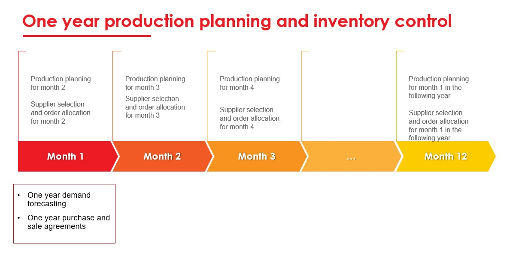
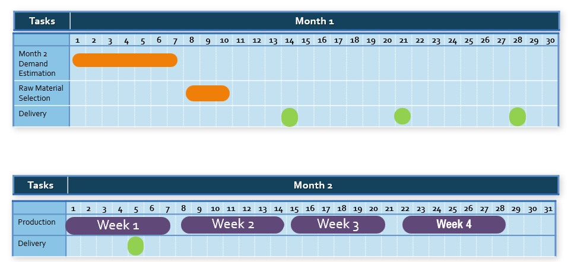
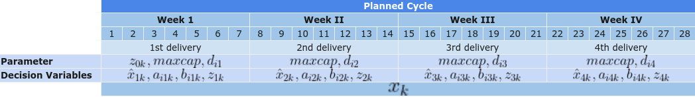
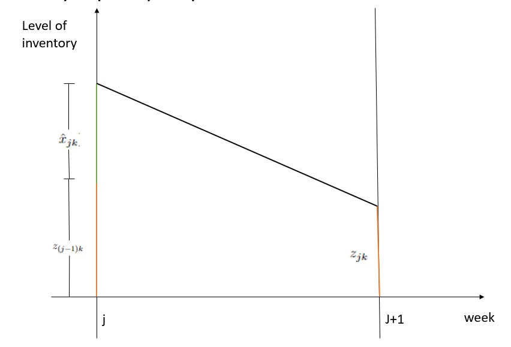

```{r setup, include=FALSE}
library(officedown)
library(ggplot2)
library(officer)
library(tidyverse)
library(palmerpenguins)
```

__Saladin Uttunggadewa__

Faculty of Mathematics and Natural Sciences, Institut Teknologi Bandung, Indonesia, Center for Advance Sciences $4^{th}$ floor, Jalan Ganesha no. 10, Bandung 40132, Indonesia

Phone: +62 838 2021 4441, Email: s_uttunggadewa@math.itb.ac.id

__Mohammad Rizka Fadhli__

Magister of Computational Sciences Program, Institut Teknologi Bandung, Indonesia, Center for Advance Sciences $4^{th}$ floor, Jalan Ganesha no. 10, Bandung 40132, Indonesia

Email: 20921004@mahasiswa.itb.ac.id

__Rieske Hadianti__

Center for Mathematical Modeling and Simulation, Institut Teknologi Bandung, Indonesia, Gedung Labtek III $1^{st}$ floor, Jalan Ganesha no. 10, Bandung 40132, Indonesia

Email: ike.hadianti@gmail.com

__Sri Redjeki Pudjaprasetya__

Faculty of Mathematics and Natural Sciences, Institut Teknologi Bandung, Indonesia, Center for Advance Sciences $4^{th}$ floor, Jalan Ganesha no. 10, Bandung 40132, Indonesia

Email: srpudjap@gmail.com

__ABSTRACT__

This paper concerns the optimization model for 

__KEYWORDS__: inventory control, raw-material selection, mix-integer linear programming

```{r,include=FALSE}
run_pagebreak()
```

```{r,include=FALSE}
#<!---BLOCK_MULTICOL_START--->
```

# Introduction

This paper concerns the optimization model for supplier selection, order allocation, and raw-material composition in a beverage company that produces a large number of drink powders. There are a number of suppliers that can provide the same key raw material of the drink powders, but the colour or some physical characteristics are slightly different so that we may assume those raw materials are different. The drink powders produced by this company, which in the remainder of this paper are called items, can be classified into two classes of items. 

- The first class consists of items that can be produced by using exactly a single type of raw material.
- The second class  consists of more flexible items, where  each item in this class can be produced by using   one raw material or by using a composition of a number of raw materials. For each item in this class we then have a set of possible raw materials. The sets of possible materials may vary one to each other.

 In order to avoid supply disruption,  the company decides to use multiple sources for these raw materials. The company has established selection criteria for each raw material, which are based on a subjective assessment of whether the raw material cannot be substituted, price, service, and the minimum order required for each purchase. After determining the score for each raw material, the company decided to make  contracts or agreements with six suppliers. Each contract stated unit price and  the minimum volume that will be purchased  within a year. Based on these contracts, production planning and inventory control of raw materials is carried out.

Demand forecasting of items are performed  on monthly basis. At the beginning of a month, the company forecasts the demand for items  in the following  month. Once the demand for items is issued, the company must perform the decision for purchasing the raw materials from some suppliers. This purchase decision from a supplier includes purchase for four serial deliveries one week apart. The first delivery must be 
no later than 17 days before the following  month's start. The period of 17 days here is the total time required for  the company's internal inspection and preparation of raw materials.


 This decision process is a complex one since there are a large  number of items that has to produced which mostly belong to the second class, and the monthly demand may vary. Additionally, the company imposes a production regulation for the second class of items as a result of the multiple-sources policy, which states that each item in the second class must be produced using a composition of at least two types of the corresponding possible raw materials. The decision process must be performed carefully in order to obtain  results in the form of:
 
- which raw materials are purchased along with the delivery size for every four corresponding weeks,
- the composition  of raw materials for every item  in the second class  which has to be produced,

while minimize the total inventory cost. 

The company  developed a decision support system for this monthly decision process, which is  developed based on an optimization model.
The optimization model can be categorized as a  multi-product multi-period supplier selection and lot sizing problem. This problem has been addressed in a number of articles such as Sambatt, Woarawichai, and Naenna\cite{Sambatt}. 


The supplier selection problem initially focused on determining suppliers with only one criterion, namely the price of the materials offered. Scientific papers on supplier selection with one criterion include Reck & Long\cite{Reck}, Monckza & Trecha[16], & Porter[23], and Harding[11] papers. But then it was realized that using only one criterion, namely price, did not answer the problem comprehensively. So supplier selection research has developed into a problem with multiple criteria, such as criteria for quality of goods, on time delivery, after-sales service, as well as environmental and socio-political criteria for suppliers (see Smytka & Clemens[27], Gray, Helper & Osborn[9]). . What is interesting is that in general these criteria contradict each other, for example, goods offered at low prices (positive values for the price criteria) may have negative values for on time delivery criteria. The complexity of this issue is compounded by the fact that some criteria are quantitative (price, timeliness of delivery, specification/quality of goods, etc.), but other criteria are qualitative (after sales service, environmental and socio-political criteria of suppliers).

Weber's paper, Current & Benton[29] is a paper at the beginning of this research on multi-criteria supplier selection, which presents research results with four criteria, namely Price, Quality, Delivery and Service (PDQS). This paper together with Hurkens, van der Valk, Wynstra [12] introduces the supplier selection problem under the concept of Total Cost Ownership (TCO), a financial analysis tool to examine the direct and indirect costs of a product's production. These direct and indirect costs then become the criteria in the supplier selection process. These papers on TCO include Ferrin & Plank[8], Degraeve & Roodhooft[5],

After the rise of conceptual research on supplier selection with multi-criteria, then we quite easily find a proposal to use the Analytic Hierarchy Process (AHP), a decision-making method when it comes to ranking of many criteria (see Dyer[6]), as a method of solving supplier problems. selection. AHP provides a framework for addressing various criteria involving intuitive, rational, qualitative and quantitative aspects. Other papers that discuss the AHP approach to supplier selection solutions include Bard[2], Belton[3], Bhutta & Huq[4], Nydick & Hill[20].

Another method proposed as a solution to the supplier selection problem is an optimization method or mathematical programming as proposed by Degraeve and Roodhooft [5], Khalifa & Mohammed Al-Shabi [10], and Nispeling [19]. A special optimization method, namely multi-objective goal programming, was proposed by Weber & Ellram [30]. Multi-objective programming is very suitable to be used to resolve conflicts between existing criteria and the existence of just-in-time scenarios. Meanwhile, Masella & A. Rangone [15] offer a dynamic programming method as a method of completing this supplier selection, where input variables are set as controls and environmental variables and status variables are set as the internal workings of the organization, and output variables are seen as company performance. Another optimization method used as a solution method is Data Envelopment Analysis (DEA), as proposed in the paper of Pitchipoo, et al.[22] and Shahrzad, et al.[26].

Apart from these methods, we get the combined use of the two methods above (hybrid method), such as the one proposed by Li, Wong, & Kwong [13] which combines the AHP method and multi-objective programming. Another approach is the metaheuristic method proposed by Alejo-Reyes, et al.[1]. This heuristic method is likely to be a method that is widely used as a method of solving supplier selection problems considering that the heuristic method has proven to be an effective and efficient method as a method of solving optimization problems, although there is no guarantee this method will provide an optimal solution but it is guaranteed to provide a solution. near optimal'. For supplier selection problems where the procurement division must be able to make decisions quickly, this near optimal solution is often considered sufficient because sometimes decision making has to be done many times due to disturbances from outside the company such as in-time delivery by one supplier.

# Production Planning and Inventory Control for Raw Materials

As mentioned above, the company deals with  six raw material suppliers. The decision process for supplier selection and order allocation is carried out every month based on the results of demand forecasting at the beginning of the year and production performance in the previous month. From this demand forecasting process, the company then makes the purchase and sales agreements with all six suppliers concerning on one-year minimum purchase, unit price, and minimum one month delivery. The serial process in one calendar year can be seen in the following figure.  At the beginning of a month, the company forecasts the demand for items in the following month. 

```{r out.width="20%",echo=FALSE,fig.cap="One year production planning and inventory control",fig.align='center'}

```

From the demand forecasting process, we can find out the estimated demand for each month in one year. In practice, this one-month estimated demand must be reviewed due to several things, such as production in the previous month experiencing disruptions, sudden additional requests due to flash sales practices in e-commerce, and others. Reviewing the one-month demand and determining the production schedule we call production planning for one month.As soon as the production planning is performed, the company performs the decision process for purchasing the raw materials from some suppliers. In the following, we assume that one month can be divided into four weeks (the fourth week may be longer than seven days). This purchase decision covers purchases for four serial deliveries one week apart. The first delivery must be no later than 17 days before the following month's start since the internal inspection and the preparation for the raw materials delivered takes 17 days. Figure \ref{fig:supply_cycle_2} in the following illustrates one-month production planning and raw material selection, and four consecutive delivery points follow it.

```{r out.width="20%",echo=FALSE,fig.cap="Supply cycle",fig.align='center'}

```

The decision process considers some parameters for decision making such as: 

- raw materials prices,
- existing stock of raw materials in the warehouse, 
- minimum one-month delivery  of raw materials(if ordered),
- minimum one-year purchase of each raw material, 
- raw-material flexibility of each item, which is known by the number of raw materials that can be used to produce the item. The larger this number for an item, the more flexible the item.
- and others. 


The purchase must also comply with the company's internal policies in the following.

- __Policy I__. Purchase raw materials from at least two suppliers in order to maintain supply security,
- __Policy II__. If an item must be produced by using more than one raw material, the proportions of raw materials used are the same.

In the following section, we will accommodate all these policies into some constraints of an optimization model that can be regarded as the main engine of the Decision Support System developed by the company in order to achieve an optimal decisions in inventory control. 

# Mathematical  Model of the problem 

In this section, we formulate a mathematical model of the decision problem. As described before, we need to make a decision for raw material selection, delivery quantities, and raw material compositions on the four consecutive weeks covered. In the following, we derive a mixed integer linear programming that represents the decision problem. We first present the sets, the parameters, and the decision variables used in the mathematical model. We then present the constraints which represent the production rules and capacity,  followed by the discussion concerning on the objective function of the optimization model. The integer linear programming is written after that.

## Sets and parameters

Denote by:

- $\mathcal{M} = \{1,2,3,4\}$ as the set of weeks on the supply cycle,
- \(N\) as the number of raw-material types,
- \(\mathcal N = \{1, 2, \cdots, N\} \) as the set of material types,
- \(I\) as the number of items,
- \(\mathcal I = \{1, 2, \cdots, I\}\) as the set of items,
- \(P = P_1 \bigcup P_2 \bigcup P_3 \bigcup P_4, \)
  as the set of items to be produced on the planning horizon, where \(P_j\) as the set of items to be produced on week \(j \in M.\) The raw-material flexibility property makes us may assume that \(P_i = P_i^1 \bigcup P_i^2,\) for \(i \in M,\) where \(P_i^1\) as the sets of items that must be produced by one certain type of raw material, and \(P_i^2\) as the sets of items that have to  be produced by composing at least two types of  raw materials,
- for \(i \in \mathcal I, \, k \in \mathcal N,\)\[f_{ik} = \begin{cases} 1 &, \text{ if item } i \text{ can be produced by using raw-mat } k\\
0 & ,\text{ otherwise,}
\end{cases}\] 
- \(\forall j \in \mathcal M,  \, D_{j}\) as the  total demand of raw materials  on  week \(j\), and let \(D = \sum_{j \in \mathcal M}  D_{j}\),
- \(maxcap\) as the maximum capacity of the raw-material warehouse,
- \(ss\) as the safety stock of the  raw materials at the warehouse,
- $\forall j \in \mathcal{M}, i \in P_j, g_{ik}$ as the tonnage of raw material \(k\)  needed if item \(i\)  produced on the week \(j\), 
- \(\forall k \in \mathcal N, \, r_k\)  is the ratio of the minimum one-year order quantity  of  raw material \(k\) to the total of minimum one-year order quantities,
- $\forall k \in \mathcal{N}, c_k$ as the price of raw material $k$ per ton,
- $\forall k \in \mathcal{N}, \sigma_k$ as the  minimum order quantity of raw material $k$, if it is purchased,
- $\forall k \in \mathcal{N}, z_{0k}$ as the  level of inventory of raw material $k$, just before the first delivery on the first week.


## Decision variables

Define:

- \(\forall k \in \mathcal N , \, x_k \) as the amount of raw material $k$ purchased.\(x_k =0\) if raw material $k$ is not purchased, and  \(\sigma_k \leq x_k \leq D\) otherwise.
- \(\forall k \in \mathcal N ,\)
\[y_k = \left\{\begin{matrix}
0, & x_k = 0 \\ 1, & \sigma_k \leq x_k \leq D
\end{matrix}\right.\] 
The variables \(y_k\) are defined to handle the discontinuity property of the variables \(x_k.\)

- \(\forall j \in \mathcal M,  \forall k \in \mathcal N, \hat{x}_{jk}\), as the amount of raw material $k$ delivered at the beginning of week $j$.

- \(\forall j \in \mathcal M, \forall i \in P_j, \forall k \in \mathcal N\),
$$ a_{ijk} = \left\{\begin{matrix}
1, & \text{ if item } i \text{ on the  week } j \text{ produced by using raw-mat } k \\ 
0, & \text{otherwise}
\end{matrix}$$

- \(\forall j \in \mathcal M, \forall i \in P_j, \forall k \in \mathcal N\), $b_{ijk}$ as the proportion of raw material $k$ used to produce item $i$ on the week $j$ if it uses raw material $k$.

- \(\forall j \in \mathcal M,  \forall k \in \mathcal N\), $z_{jk}$ as the level of inventory raw material $k$ at the end of week $j$.

The following figure illustrates a supply cycle and the parameters and the decision variables associated in each week in the cycle. 

```{r out.width="20%",echo=FALSE,fig.cap="Parameters and Decision Variables Associated per Week",fig.align='center'}

```

## Constraints

The following mathematical expressions are the constraints for our mathematical model. We write these constraints in groups where we give a short explanation in each group the purpose of creating the constraints.

__Constraints I__ are set to handle the discontinuity value of $x_k$. $\forall k \in \mathcal{N}$,

\begin{equation}
     x_k \leq  y_k D (\#eq:1a)
\end{equation}
\begin{equation}
   x_k \geq \sigma_k y_k (\#eq:1b)
\end{equation}

__Constraints II__ are set to fulfill the weekly allocation of each type of raw material. $\forall k \in \mathcal{N}$,

\begin{equation}
    x_k = \sum_{j \in \mathcal{M}} \hat{x}_{jk} (\#eq:2a)
\end{equation}

__Constraints III__ are set to fulfill the raw-material demand each week. $\forall j \in \mathcal{M}$,

\begin{equation}
   \sum_{k=1}^N \hat x_{jk} + \sum_{k=1}^N z_{(j-1)k} \geq  D_{j} (\#eq:3a)
\end{equation}

__Constraints IV__ are set to ensure each item in $P^2$ is produced by using at least two raw materials. $\forall j \in \mathcal{M} \forall i \in P_j^2$,

\begin{equation}
\sum_{k \in \mathcal N} a_{ijk} \geq 2 (\#eq:4a)
\end{equation}

__Constraints V__ concern on  the relation among $f_{ik}, a_{ijk}, b_{ijk}$, and $x_{jk}$. $\forall j \in \mathcal{M}$, $i \in P_j, k \in \mathcal{N}$, 

\begin{equation}
 a_{ijk} \leq f_{ik} (\#eq:5a)
\end{equation}

$\forall j \in \mathcal{M}, \forall i \in P_j, \forall k \in \mathcal{N}$,

\begin{equation}
    b_{ijk} \leq f_{ik} a_{ijk} (\#eq:5b)
\end{equation}

\begin{equation}
 \mu a_{ijk} \leq  b_{ijk} (\#eq:5c)
\end{equation}

for a small value of $\mu$.

$\forall j \in \hat{M}, \forall i \in P_j$,

\begin{equation}
\sum_{k \in \mathcal N} b_{ijk} =1 (\#eq:5d)
\end{equation}

__Constraints VI__ are set to fulfill the Policy II.

$\forall j \in \hat{M}, \forall i \in P_j^2, k_1, k_2 \in \mathcal{N}, k_1 \neq k_2$,

\begin{equation}
  (1- a_{ijk_1}) + (1- a_{ijk_2}) \geq  b_{ijk_1}-b_{ijk_2} (\#eq:6a)
\end{equation}

\begin{equation}
  (1- a_{ijk_1}) + (1- a_{ijk_2}) \geq  b_{ijk_2}-b_{ijk_1} (\#eq:6b)
\end{equation}


__Constraints VII__ are set to ensure that the level of inventory just after raw material delivery does not exceed the maximum capacity.

On the beginning of week 1,

\begin{equation}
\sum_{k \in \mathcal N} (z_{0k} + \hat{x}_{1k} -  + z_{1k}) - D_1\leq maxcap  (\#eq:7a)
\end{equation}

$\forall j \in \{2, 3, 4\}$,

\begin{equation}
    \sum_{k \in \mathcal N} (z_{(j-1)k} + \hat{x}_{(j-1)k}) - \sum_{i \in P_j} b_{ijk} g_{ik} + z_{jk} \leq maxcap  (\#eq:7b)
\end{equation}

$\forall j \in \mathcal{M}$,

\begin{equation}
    \sum_{k \in \mathcal N} (z_{(j-1)k} + \hat{x}_{jk}) - \sum_{i \in P_j} b_{ijk} g_{ik} + z_{jk} \leq maxcap  (\#eq:7c)
\end{equation}

__Constraints VIII__ are set to ensure that the level of inventory at the end of each week must be greater than or equal to the safety stock.

$\forall j \in \mathcal{M},\forall k \in P_j$,

\begin{equation}
    z_{jk}\geq ss (\#eq:8a)
\end{equation}

## Objective function

We define the objective function as the sum of the inventory cost, the purchase cost, and a function for accommodating the minimum one-year order quantity contracts. 

The level of inventory of raw-material \(k\) during one week can be seen in the following figure. 

```{r out.width="20%",echo=FALSE,fig.cap="Level of inventory of raw material k in one week.",fig.align='center'}

```

So that the inventory cost can be given as:

\begin{equation}
    \frac{1}{2} ic\sum_{j \in \mathcal M} \sum_{k \in \mathcal N} (z_{(j-1)k} + z_{jk} + \hat x _{jk}) (\#eq:9a)
\end{equation}

Meanwhile the purchase cost can be given as: 

\begin{equation}
 \sum_{k \in \mathcal N}c_k x_k (\#eq:9b)
\end{equation}

We consider another function in the objective function, which is created to accommodate the one-year minimum order quantity contracts. Constraints I - VIII concern fulfillment of the minimum purchase agreements,   the monthly demand,   warehouse capacity constraint, safety stock constraint, and raw material composition requirements. Meanwhile, the one-year minimum order quantity contract is quite difficult to be expressed as a constraint in the optimization model that has a one-month-long planning horizon. Therefore, we accommodate the yearly purchase contract which we represent as a part of the objective function of our optimization problem. To fulfill the  one-year minimum order quantity contracts, we define a penalty function

\begin{equation}
 \sum_{k \in \mathcal N} \alpha_k mo_k x_k (\#eq:9c)
\end{equation}

where for \(k \in \mathcal N, \, \alpha_k \) is multiplier constants that will be discussed later. 

The objective function of our optimization model is then can be written as:

\begin{equation}
    \frac{1}{2} ic\sum_{j \in \mathcal M} \sum_{k \in \mathcal N} (z_{(j-1)k} + z_{jk} + \hat x _{jk}) + \sum_{k \in \mathcal N}c_k x_k - \sum_{k \in \mathcal N} \alpha _k mo_k x_k (\#eq:9d)
\end{equation}

## Optimization model

The optimization model for supplier selection, order allocation, and raw material composition can be written as a mixed integer linear programming.

\begin{equation}
    \frac{1}{2} ic\sum_{j \in \mathcal M} \sum_{k \in \mathcal N} (z_{(j-1)k} + z_{jk} + \hat x _{jk}) + \sum_{k \in \mathcal N}c_k x_k - \sum_{k \in \mathcal N} \alpha _k mo_k x_k (\#eq:10)
\end{equation}

$$\text{subject to Constraints I - VIII}$$

$$x_k \in \mathbb{Z}^+, \hat{x}_{jk} \geq 0$$

$$y_k, a_{ijk} \in \{ 0,1 \},$$ 

$$0 \leq b_{ijk} \leq 1, 0 \leq z_{jk} \leq maxcap.$$

```{r,include=FALSE}
#<!---BLOCK_MULTICOL_STOP--->
# jangan lupa tinggal dihilangkan saja ya
```
