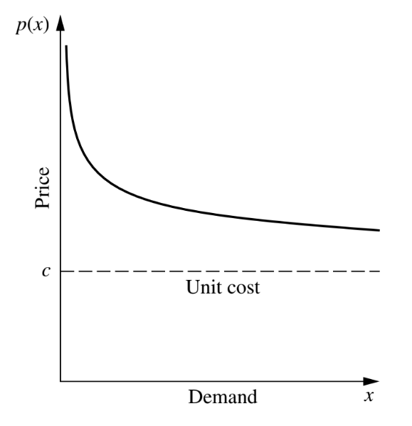

```{r setup, include=FALSE}
knitr::opts_chunk$set(echo = TRUE)
rm(list=ls())
setwd("~/209_ITB/Thesis/Penelitian Mandiri 1 Full")

library(dplyr)
library(ggplot2)
```

\newpage
\tableofcontents
\newpage
\listoffigures
\newpage
\listoftables

\newpage

# UPDATE MINGGU I {.unlisted .unnumbered}

# CHAPTER I

# SEJARAH {-}

## Optimisasi

Optimisasi adalah __proses mencari nilai yang optimal__ dari suatu masalah tertentu. Dalam matematika, optimisasi merujuk pada pencarian nilai minimal atau maksimal dari suatu _fungsi real_^[https://id.wikipedia.org/wiki/Optimisasi]. Notasi matematikanya dapat ditulis sebagai berikut:

Misalkan suatu fungsi $f$ yang memetakan dari himpunan $A$ ke bilangan _real_.

$$f: A \rightarrow \mathbb{R}$$

Cari suatu nilai $x_0 \in A$ sedemikian sehingga:

- $f(x_0) \leq f(x), \forall x \in A$ untuk proses __minimalisasi__.
- $f(x_0) \geq f(x), \forall x \in A$ untuk proses __maksimalisasi__.

Di dalam kalkulus, kita mengetahui salah satu pendekatan optimisasi di fungsi satu variabel bisa didapatkan dari turunan pertama yang bernilai __nol__ (bisa berupa nilai maksimum atau minimum dari fungsi tersebut).

Nilai $x_0 \in [a,b]$ disebut minimum atau maksimum di $f$ unimodal saat memenuhi:

$$\frac{d}{dx}f(x_0) = 0$$

__Pierre De Fermat__ dan __Joseph-Louis Lagrange__ adalah orang-orang yang pertama kali menemukan formula kalkulus untuk mecari nilai optimal. Sementara __Isaac Newton__ dan __Johann C. F.Gauss__ mengusulkan metode iteratif untuk mencari nilai optimal^[https://empowerops.com/en/blogs/2018/12/6/brief-history-of-optimization]. 

Salah satu bentuk optimisasi yakni _linear programming_ dimulai oleh __Leonid Kantorovich__ pada 1939. __Metode Simplex__ merupakan salah satu metode penyelesaian optimisasi yang terkenal, pertama kali diperkenalkan pada 1947 oleh __George Dantzig__ sementara di tahun yang sama _Theory of Duality_ diperkenalkan oleh __John von Neumann__. 

\newpage
__Masalah optimisasi__ adalah masalah matematika yang mewakili masalah nyata (_real_). Dari ekspresi matematika tersebut, ada beberapa hal yang perlu diketahui^[Pengantar Riset Operasi dan Optimisasi, KampusX: PO101], yakni:

1. __Variabel__ adalah suatu simbol yang memiliki banyak nilai dan nilainya ingin kita ketahui. Setiap nilai yang mungkin dari suatu variabel muncul akibat suatu kondisi tertentu di sistem.
1. __Parameter__ di suatu model matematika adalah suatu konstanta yang menggambarkan suatu karakteristik dari sistem yang sedang diteliti. Parameter bersifat _fixed_ atau _given_.
1. ___Constraints___ (atau kendala) adalah kondisi atau batasan yang harus dipenuhi. Kendala-kendala ini dapat dituliskan menjadi suatu persamaan atau pertaksamaan. Suatu masalah optimisasi dapat memiliki hanya satu kendala atau banyak kendala.
1. ___Objective function___ adalah satu fungsi (pemetaan dari variabel-varibel keputusan ke suatu nilai di daerah _feasible_) yang nilainya akan kita minimumkan atau kita maksimumkan.

Ekspresi matematika dari model optimisasi adalah sebagai berikut:

> Cari $x$ yang meminimumkan atau memaksimumkan $f_i(x),\ i=1,..,m$ dengan kendala $g_j(x),\ j=1,..,n$ dan $x \geq 0$.

Dari ekspresi tersebut, kita bisa membagi-bagi masalah optimisasi tergantung dari:

1. Tipe variabel yang terlibat.
1. Jenis fungsi yang ada (baik _objective function_ ataupun _constraint_).

## Riset Operasi

__Riset operasi__ adalah metode antar disiplin ilmu yang digunakan untuk menganalisa masalah nyata dan membuat keputusan untuk kegiatan operasional organisasi atau perusahaan^[Pengantar Riset Operasi dan Optimisasi, KampusX: PO101]. Riset operasi dimulai pada era Perang Dunia II. Oleh karena peperangan, diperlukan suatu cara yang efektif untuk mengalokasikan _resources_ yang ada sehingga pihak militer Inggris dan Amerika Serikat mengumpulkan ilmuwan-ilmuwan untuk mencari pendekatan yang saintifik dalam memecahkan masalah^[Introduction to Operations Research, 7th Edition. Hillier / Lieberman hal. 1].

\newpage

# CHAPTER II
# JENIS-JENIS OPTIMISASI {-}

## Berdasarkan Tipe Variabel

```{r,echo=FALSE,message=FALSE,warning=FALSE,fig.align='center',fig.cap="Optimisasi Berdasarkan Jenis Variabel"}
nomnoml::nomnoml("#direction: down
                 [Optimisasi] -> [Diskrit]
                 [Optimisasi] -> [Kontinu]
                 
                 [Diskrit] -> [Binary\nProgramming]
                 [Diskrit] -> [Integer\nProgramming]
                 [Diskrit] -> [Mixed Integer\nLinear Programming]
                 
                 [Kontinu] -> [Diferensiabel]
                 [Kontinu] -> [Non Diferensiabel]
                 
                 [Diferensiabel] -> [Linear\nProgramming]
                 [Diferensiabel] -> [Non Linear\nProgramming]
                 [Diferensiabel] -> [Quadratic\nProgramming] 
                 
                 [Linear\nProgramming] --> [Mixed Integer\nLinear Programming]
                 ")
```

Masalah optimisasi bisa dibagi dua menjadi dua kategori berdasarkan tipe _variables_ yang terlibat^[Optimization problem. https://en.wikipedia.org/wiki/Optimization_problem], yakni:

1. _Discrete Optimization_: merupakan masalah optimisasi di mana variabel yang terkait merupakan variabel diskrit, seperti _binary_ atau _integer_.
1. _Continuous Optimization_: merupakan masalah optimisasi saat fungsi _objective_ kontinu (termasuk fungsi yang _multimodal_).
    - Sebagaimana yang telah kita pelajari di kalkulus, suatu fungsi kontinu __bisa terdiferensiabel__ atau __tidak terdiferensiabel__ di selang tertentu.
    - Hal ini mengakibatkan pendekatan yang berbeda juga dalam penyelesaian optmisasinya. Pendekatan penyelesaian fungsi yang terdiferensiabel menggunakan _gradient_ kurva fungsi di titik tertentu.

\newpage

## Berdasarkan Karakteristik Masalah

```{r,echo=FALSE,message=FALSE,warning=FALSE,fig.align='center',fig.cap="Optimisasi Berdasarkan Kategori Masalah"}
nomnoml::nomnoml("#direction: down
                 [Optimisasi] -> [Uncertainty]
                 [Optimisasi] -> [Certain|Deterministic]
                 
                 [Uncertainty] -> [Stokastik\nprogramming]
                 [Uncertainty] -> [Robust\noptimization]
                 
                 [Certain] -> [Kontinu]
                 [Certain] -> [Diskrit]
                 ")
```

Selain itu, kita juga bisa membagi masalah optimisasi berdasarkan __kategori masalah__ yang dihadapi sebagai berikut:

1. _Optimization under uncertainty_^[https://neos-guide.org/content/optimization-under-uncertainty]; Pada beberapa kasus di dunia _real_, data dari masalah tidak dapat diketahui secara akurat karena berbagai alasan. Hal ini mungkin terjadi akibat:
    - Kesalahan dalam pengukuran, atau
    - Data melibatkan sesuatu di masa depan yang belum terjadi atau tidak pasti. Contoh: _demand_ produk, harga barang, dan sebagainya.
1. _Deterministic optimization_; 
    - Model deterministik adalah model matematika di mana nilai dari semua parameter dan variabel yang terkandung di dalam model merupakan satu nilai pasti^[Pengantar Riset Operasi dan Optimisasi, KampusX: PO101].
    - Pendekatan deterministik memanfaatkan sifat analitik masalah untuk menghasilkan barisan titik yang konvergen ke solusi optimal^[https://www.hindawi.com/journals/mpe/2012/756023/]. 
    - Semua algoritma perhitungan mengikuti pendekatan matematis yang ketat^[https://link.springer.com/chapter/10.1007/978-3-642-31187-1_4].

\newpage

# CHAPTER III
# PENJELASAN LEBIH LANJUT TERKAIT JENIS OPTIMISASI {-}

## _Optimization Under Uncertainty_

Untuk menyelesaikan masalah _optimization under uncertainty_, ada dua metode yang _frameworks_ digunakan. Yakni:

1. _Stochastic Programming_.
    - Pendekatan yang digunakan adalah menggunakan variabel acak yang memiliki distribusi probabilitas tertentu untuk mengkarakterisasi _uncertainty_ dan mengoptimalkan nilai yang diharapkan dari fungsi tujuan.
1. _Robust Optimization_.
    - Berbeda dengan _stochastic programming_ yang memilih pendekatan probabilistik, _robust optimization_ menggunakan pendekatan basis himpunan _uncertainty_^[https://stanford.edu/class/ee364b/lectures/robust_notes.pdf].

## _Continuous Optimization_

Di dalam _continuous optimization_, variabel di dalam model diperbolehkan berisi semua nilai dalam selang yang diberikan. Berbeda dengan _discrete optimization_ yang biasanya memiliki variabel berisi _binary_ atau _integer_^[https://neos-guide.org/content/continuous-optimization]. 

Oleh karena _continuous optimization_ bekerja pada fungsi yang kontinu, maka optimisasi ini erat dengan teknik-teknik kalkulus. Seperti yang telah dijelaskan pada bagian sebelumnya, fungsi kontinu bisa jadi terdiferensiabel atau tidak terdiferensiabel dalam suatu selang. Hal ini memiliki konsekuensi terkait bagaimana kita menyelesaikan masalah optimisasinya.

Salah satu pembeda masalah optimisasi kontinu dengan masalah kontinu lainnya adalah pada keberadaan _constraints_ di variabelnya, sehingga masalah optimisasi kontinu bisa dikelompokkan menjadi:

1. _Unconstrained optimization_ adalah optimisasi yang __tidak mengandung__ _constraints_ pada _decision variable_-nya. 
1. _Constrained optimization_ adalah optimisasi yang __mengandung__ _constraints_ pada _decision variable_-nya. 

Namun demikian, kita bisa mengubah model matematika dari _constrained optimization_ menjadi _unconstrained optimization_ dengan menambahkan syarat pada fungsi objektifnya.

### _Linear Programming_

_Linear programming_ adalah bentuk metode optimisasi sederhana yang memanfaatkan relasi linear (semua fungsi dan _constraints_ merupakan fungsi linear).

#### Contoh Masalah _Linear Programming_ {-}

Saya memiliki area parkir seluas 1.960 $m^2$. Luas rata-rata untuk mobil berukuran kecil adalah 4 $m^2$ dan mobil besar adalah 20 $m^2$. Daya tampung maksimum hanya 250 kendaraan, biaya parkir mobil kecil adalah Rp 7.000 per jam dan mobil besar adalah Rp 12.000 per jam. Jika dalam 1 jam area parkir saya terisi penuh dan tidak ada kendaraan yang pergi dan datang, maka berapa pendapatan maksimum yang bisa saya dapatkan dari tempat parkir itu?

Dari kasus di atas kita bisa tuliskan model matematikanya sebagai berikut:

Misal $x_1$ adalah mobil kecil dan $x_2$ adalah mobil besar.

$$max(7000x_1 + 12000x_2)$$

Dengan _constraints_: 

$$4 x_1 + 20 x_2 \leq 1960$$

dan

$$x_1 + x_2 \leq 250$$

serta $x_1 \geq 0, x_2 \geq 0$.

### _Non Linear Programming_

Beberapa permasalahan tidak bisa ditulis sebagai fungsi linear, oleh karena itu muncullah permasalahan _non linear programming_. Bentuk dasar pemodelannya sama dengan _linear programming_ tapi ada fungsi yang tidak linear di dalamnya. Sebagai contoh fungsi yang terlibat ada logaritmik atau fungsi trigonometri.

#### Contoh Masalah _Non Linear Programming_ {-}

Suatu perusahaan menjual suatu produk yang memiliki model _price elasticity_ seperti di bawah ini:

```{r out.width="50%",echo=FALSE,message=FALSE,warning=FALSE,fig.align='center',fig.cap="Price Elasticity"}

```

Di mana $p(x)$ adalah harga saat menjual produk sebanyak $x$.

Omset perusahaan tersebut didefinisikan sebagai `terjual x harga`, yakni $x p(x)$. Sedangkan profit adalah omset dikurangi dengan biaya produksi per produk yang terjual.

\newpage
Sehingga didapatkan:

$$P(x) = x p(x) - c x, \text{ dengan c adalah fixed cost}$$

Karena $p(x)$ non linear, maka didapatkan $P(x)$ juga non linear^[Introduction to Operations Research, 7th Edition. Hillier / Lieberman hal. 654].

### _Quadratic Programming_

Lantas apa perbedaan _linear programming_, _non linear programming_ dengan _quadratic programming_?

Perbedaan mencoloknya ada pada perkalian antar variabel pada _objective function_^[Introduction to Operations Research, 7th Edition. Hillier / Lieberman hal. 683]. Misalkan $x_j^2$ atau $x_i x_j \text{, untuk } (i \neq j)$.

## _Discrete Optimization_

Di dalam _discrete programming_, variabel-variabel yang terlibat di dalamnya harus bertipe diskrit. Bisa dalam bentuk _binary_, _integer_, atau kombinasi antara keduanya^[Introduction to Operations Research, 7th Edition. Hillier / Lieberman hal. 576].

### _Integer Programming_

Pada _integer programming_, semua variabel yang terkait __wajib__ berupa _integer_ atau _binary_^[https://neos-guide.org/content/integer-linear-programming].

#### Contoh Masalah _Integer Programming_ {-} 
adalah _nurse schedulling problem_, yakni bagaimana memasangkan perawat tepat ke _shift_ kerja yang tersedia^[https://ikanx101.com/blog/nurse-schedulling/].

### _Mixed Integer Linear Programming_ (__MILP__)

Pada __MILP__, sebagian variabel memiliki tipe _binary_ atau _integer_ dan sebagian lainnya diperbolehkan bertipe kontinu (_real values_)^[https://neos-guide.org/content/integer-linear-programming].

#### Contoh Masalah _Mixed Integer Linear Programming_ {-}
adalah masalah pemilihan produksi yang optimal^[https://ikanx101.com/blog/produk-baru/] di mana ada dua jenis variabel keputusan, yakni numerik dan _binary_.

### _Mixed Integer Non Linear Programming_ (__MINLP__)

Pada __MINLP__, variabel yang terkait bisa berbentuk _integer_ atau _real values_ serta fungsi yang ada berupa non linear^[https://neos-guide.org/content/Mixed-Integer-Nonlinear-Programming].

\newpage
# UPDATE MINGGU II {.unlisted .unnumbered}

\newpage

# CHAPTER IV

# ALGORITMA OPTIMISASI {-}

Pada bagian ini kita akan membahas macam-macam algoritma yang digunakan untuk menyelesaikan masalah optimisasi.

```{r,echo=FALSE,message=FALSE,warning=FALSE,fig.align='center',fig.cap="Algoritma Penyelesaian Optimisasi"}
nomnoml::nomnoml("#direction: down
                 [Algoritma\nOptimisasi] -> [Metode eksak]
                 [Algoritma\nOptimisasi] -> [Metode aproksimasi]
                 
                 [Metode eksak] -> [Iteratif]
                 [Metode eksak] -> [Enumeratif]
                 
                 [Metode aproksimasi] -> [AdHoc\nHeuristic]
                 [Metode aproksimasi] -> [Metaheuristic]
                 ")
```

Secara garis besar ada dua kelompok besar algoritma optimisasi, yakni:

1. _Exact method_,
1. _Approximate method_.

Perbedaan keduanya adalah pada __konsep atau pendekatan apa yang digunakan__ untuk menyelesaikan masalah optimisasi. Kita akan bahas satu-persatu pada bagian selanjutnya.

Dalam beberapa kasus, kita bisa mendapatkan _exact method_ bisa untuk menyelesaikan masalah optimisasi dengan efisien. Namun di kasus lain yang lebih kompleks tidak demikian. Kelemahan utama metode _exact_ adalah pada waktu komputasinya yang relatif lebih lama^[http://hpurnomo.blog.uksw.edu/2012/06/metode-optimisasi.html].

## _Exact Method_

Ciri khas dari _exact method_ adalah metode ini menjamin penyelesaian yang optimal karena menggunakan penyelesaian analitis metode matematika^[https://hindriyanto.wordpress.com/2012/09/26/antara-optimisasi-heuristik-dan-metaheuristik/].

## _Approximate Method_

Ciri khas dari _approximate method_ adalah metode ini tidak menjamin penyelesaian yang optimal karena bersifat _aproksimasi_ atau pendekatan atau hampiran^[https://www.math.unipd.it/~luigi/courses/metmodoc1819/m02.meta.en.partial01.pdf]. Oleh karena itu kita perlu melakukan definisi di awal __seberapa dekat__ nilai __hampiran__ tersebut bisa kita terima.

Metode ini bisa dibagi menjadi dua berdasarkan keterkaitannya dengan suatu masalah, yakni:

1. _Heuristic_, metode ini bersifat _problem dependent_. Artinya metode tersebut hanya bisa dipakai untuk jenis permasalahan tertentu.
    - Contoh: metode _nearest neighborhood_ hanya bisa dipakai untuk menyelesaikan masalah dalam lingkup _travelling salesperson problem_ (__TSP__).
1. _Meta heuristic_, metode ini bersifat _problem independent_. Artinya metode tersebut tidak tergantung dari jenis permasalahan tertentu.
    - Contoh: _genetic algorithm_ bisa dipakai untuk berbagai jenis permasalahan.
    
Namun demikian kedua metode ini bisa saling melengkapi dalam prakteknya.

\newpage
# UPDATE MINGGU III {.unlisted .unnumbered}

\newpage

# CHAPTER V

# _SIMPLEX METHOD_ {-}

## Sejarah

Metode _simplex_ adalah salah satu metode yang paling umum digunakan dalam menyelesaikan permasalahan _linear programming_. Metode ini dikembangkan oleh seorang profesor matematika bernama George Dantzig^[https://en.wikipedia.org/wiki/George_Dantzig] pada 1947 pasca perang dunia II. Sedangkan nama _simplex_ diusulkan oleh Theodore Motzkin^[https://en.wikipedia.org/wiki/Theodore_Motzkin].

## Cara Kerja

Metode _simplex_ menggunakan prosedur aljabar^[Introduction to Operations Research, 7th Edition. Hillier / Lieberman hal. 109]. Namun _underlying concept_ dari metode ini adalah _geometric_.

Jika kita bisa memahami konsep geometrinya, kita bisa mengetahui bagaimana cara kerjanya dan kenapa metode ini sangat efisien.

Saya akan ambil satu contoh masalah optimisasi sederhana untuk memberikan ilustrasi bagaimana cara kerja metode ini.

### Contoh Masalah Optimisasi

Cari $x_1,x2$ yang $\max{(Z = 3x_1 + 5x_2)}$ dengan _constraints_:

$$\begin{matrix}
x1 \leq 4  \\
2x_2 \leq 12 \\
3x_1 + 2x_2 \leq 18 \\
\text{serta } x_1 \geq 0, x_2 \geq 0 \\
\end{matrix}$$

Masalah di atas jika dibuat grafiknya:

\newpage

```{r,echo=FALSE,message=FALSE,warning=FALSE,fig.align='center',fig.cap="Grafik Permasalahan Optimisasi"}
rm(list=ls())
f = function(x1){(18-3*x1)/2}
data.frame(x = 0:6) %>% 
  mutate(y = f(x)) %>% 
  ggplot() +
  geom_line(aes(x,y),
            color = "red") +
  scale_x_continuous(breaks = c(-1:10)) +
  scale_y_continuous(breaks = c(-1:10)) +
  coord_equal() +
  geom_vline(xintercept = 0,
             color = "black",
             size = 1.1) +
  geom_hline(yintercept = 0,
             color = "black",
             size = 1.1) +
  geom_vline(xintercept = 4,
             color = "red") +
  geom_hline(yintercept = 6,
             color = "red") +
  annotate("segment",
           x = 0, xend = 0,
           y = 0, yend = 6,
           color = "red") +
  annotate("segment",
           x = 0, xend = 4,
           y = 0, yend = 0,
           color = "red") +
  annotate("point",x = 0, y = 0,
           color = "darkgreen",
           size = 4) +
  annotate("point",x = 0, y = 6,
           color = "darkgreen",
           size = 4) +
  annotate("point",x = 2, y = 6,
           color = "darkgreen",
           size = 4) +
  annotate("point",x = 4, y = 3,
           color = "darkgreen",
           size = 4) +
  annotate("point",x = 4, y = 0,
           color = "darkgreen",
           size = 4) +
  annotate("point",x = 0, y = 9,
           color = "purple",
           size = 4) +
  annotate("point",x = 4, y = 6,
           color = "purple",
           size = 4) +
  annotate("point",x = 6, y = 0,
           color = "purple",
           size = 4) +
  annotate("text",x = 2, y = 3,
           color = "steelblue",
           label = "Feasible Region") +
  labs(x = "x1",
       y = "x2",
       title = "Grafik dari Permasalahan Optimisasi") 

```

Titik-titik hijau merupakan __beberapa titik__ solusi yang _feasible_ karena berada pada area penerimaan seluruh _constraints_ yang ada. Titik hijau ini menjadi spesial karena berada pada perpotongan 2 garis _constraints_. Selanjutnya titik hijau ini akan didefinisikan sebagai __CPF__ (_corner point feasible_).

> _For a linear programming problem with n decision variables, each of its corner-point solutions lies at the intersection of n constraint boundaries._^[Introduction to Operations Research, 7th Edition. Hillier / Lieberman hal. 110]

Sedangkan titik ungu merupakan titik solusi non _feasible_ karena solusi yang ada tidak berlaku untuk semua _constraints_.

\newpage

```{r,echo=FALSE,warning=FALSE,message=FALSE}
cpf = data.frame(
  `Titik-ke` = 1:5,
  CPF = c("(0, 0)", 
          "(0, 6)", 
          "(2, 6)", 
          "(4, 3)",
          "(4, 0)")
    )

cpf %>% knitr::kable(align = "c",caption = "Titik yang termasuk ke dalam CPF")
```

---

#### _Properties of CPF Solutions_ {-}

Untuk setiap permasalahan _linear programming_ yang memiliki _feasible soultions_ dan _feasible region_ yang terbatas:

> __Property 1__: (a) If there is exactly one optimal solution, then it must be a CPF solution. (b) If there are multiple optimal solutions (and a bounded feasible region), then at least two must be adjacent CPF solutions.

> __Property 2__: There are only a finite number of CPF solutions.

> __Property 3__: If a CPF solution has no adjacent CPF solutions that are better (as measured by Z), then there are no better CPF solutions anywhere. Therefore, such a CPF solution is guaranteed to be an optimal solution (by Property 1), assuming only that the problem possesses at least one optimal solution (guaranteed if the problem possesses feasible solutions and a bounded feasible region).


---

Untuk mulai melakukan metode simplex kita perhatikan kembali grafik di atas. Kita bisa temukan beberapa pasang __CPF__ berbagi _constraint_ yang sama satu sama lain. 

Sebagai contoh:

1. $CPF_1$ dan $CPF_2$ berbagi _constraint_ yang sama, yakni saat $x_1 \geq 0$.
1. $CPF_2$ dan $CPF_3$ berbagi _constraint_ yang sama, yakni saat $x_2 \leq 6$.

Definisi umum:

> _For any linear programming problem with n decision variables, two CPF solutions are_ ___adjacent___ _to each other if they share_ $n-1$ _constraint boundaries._ _The two adjacent CPF solutions are connected by a line segment that lies on these same shared constraint boundaries. Such a line segment is referred to as an_ ___edge___ _of the feasible region._

_Feasible region_ di atas memiliki 5 _edges_ di mana setiap 2 _edges_ memotong / memunculkan __CPF__. Setiap __CPF__ memiliki 2 __CPF__ lainnya yang _adjacent_.

```{r,echo=FALSE,warning=FALSE,message=FALSE}
cpf = data.frame(
  `Titik-ke` = 1:5,
  CPF = c("(0, 0)", 
          "(0, 6)", 
          "(2, 6)", 
          "(4, 3)",
          "(4, 0)"),
  `Adjacent CPF` = c("(0, 6) dan (4, 0)",
                     "(2, 6) dan (0, 0)",
                     "(4, 3) dan (0, 6)",
                     "(4, 0) dan (2, 6)",
                     "(0, 0) dan (4, 3)")
    )

cpf %>% knitr::kable(align = "c",caption = "Adjacent CPF")
```

__CPF__ pada kolom pertama _adjacent_ terhadap dua __CPF__ di kolom setelahnya tapi kedua __CPF__ tersebut tidak saling _adjacent_ satu sama lain.

> ___Optimality test:___ _Consider any linear programming problem that possesses at least one optimal solution. If a CPF solution has no adjacent_ ___CPF___ _solutions that are better (as measured by_ $Z$_), then it must be an optimal solution._

Berdasarkan _optimality test_ tersebut, kita bisa mencari solusi optimal dari __CPF__ dengan cara mengambil __initial CPF__ untuk dites secara rekursif.

```{r,include=FALSE}
rm(list=ls())
Z = function(x1,x2){3*x1 + 5*x2}
```

- __STEP 1__ Pilih _initial_ __CPF__, misal $(0,0)$. Kita akan hitung nilai $Z(0,0)=$ `r Z(0,0)`. Bandingkan dengan _adjacent_ __CPF__-nya, yakni $Z(0,6)=$ `r Z(0,6)` dan $Z(4,0) =$ `r Z(4,0)`.
- __STEP 2__ Oleh karena $Z(0,6)$ memiliki nilai tertinggi, maka kita akan pilih titik ini di iterasi pertama. Kita akan bandingkan terhadap _adjacent_ __CPF__-nya, yakni: $Z(2,6)=$ `r Z(2,6)`. Perhatikan bahwa _adjacent_ __CPF__ $(0,0)$ sudah kita evaluasi pada langkah sebelumnya.
- __STEP 3__ Oleh karena $Z(2,6)$ memiliki nilai tertinggi, maka kita akan pilih titik ini di iterasi kedua. Kita akan bandingkan terhadap _adjacent_ __CPF__-nya, yakni: $Z(4,3)=$ `r Z(4,3)`. Kita dapatkan bahwa titik $(2,6)$ menghasilkan $Z$ tertinggi.

__Kesimpulan__: $(2,6)$ merupakan titik yang bisa memaksimumkan $Z$.


### _Flowchart_ Metode Simplex dari Contoh Masalah

Secara garis besar, _flowchart_ dari metode simplex untuk masalah di atas adalah:

```{r out.width="45%",echo=FALSE,message=FALSE,warning=FALSE,fig.align='center',fig.cap="Algoritma Metode Simplex"}
nomnoml::nomnoml("#direction: down,
                 [<start> start] -> [Cari CPF]
                 [Cari CPF] -> [<input> Set initial CPF]
                 [<input> Set initial CPF] -> [<choice> Optimality Test\nOptimal?]
                 [<choice> Optimality Test\nOptimal?] -> Yes [<end> end]
                 [<choice> Optimality Test\nOptimal?] -> No [Cari adjacent CPF\nTeroptimal]
                 [Cari adjacent CPF\nTeroptimal] -> [<choice> Optimality Test\nOptimal?]
                 ")
```

\newpage

Algoritma di atas akan sangat mudah dilakukan saat kita berhadapan dengan masalah optimisasi dengan 2 _decision variables_ (atau 3 _decision variables_). Pada contoh di atas ada $x_1,x_2$.

> Bagaimana jika masalah yang dihadapi memiliki banyak _decision variables_?

Tentunya kita tidak bisa melakukan analisa secara visual seperti di atas. Namun kita bisa menggunakan bantuan aljabar dan operasi baris elementer untuk menemukan solusi yang optimal.

## Metode Simplex dengan Operasi Matriks

Suatu masalah optimisasi bisa kita tulis dalam bentuk matriks sehingga bisa diselesaikan dengan melakukan _operasi baris elementer_.

### Contoh Penyelesaian Masalah Optimisasi dengan _Simplex_

Cari $x,y$ sehingga $\max{(P = 5x + 4y)}$ dengan _constraints_:

$$\begin{matrix}
3x + 5y \leq 78  \\
4x + y \leq 36 \\
\text{serta } x \geq 0, y \geq 0 \\
\end{matrix}$$

Untuk menyelesaikannya, kita perlu menambahkan $u,w$ sebagai variabel pembantu. Fungsi objectif $P$ juga harus diubah (dipindah sisi namun $P$ tetap positif).

$$\begin{matrix}
3x + 5y + u \leq 78  \\
4x + y + w \leq 36 \\
-5x - 4y + P = 0 \\
\end{matrix}$$

Setelah itu kita buat matriks (dalam hal ini saya akan buatkan tabelnya) sebagai berikut:

```{r,echo=FALSE}
rm(list=ls())
simplex = data.frame(
  x = c(3,4,-5),
  y = c(5,1,-4),
  u = c(1,0,0),
  w = c(0,1,0),
  P = c(0,0,1),
  b = c(78,36,0)
)

simplex %>% knitr::kable("simple",caption = "Initial Condition Bentuk Matriks Simplex")
```

__STEP 1__ Kita akan pilih kolom yang memiliki nilai __negatif terbesar__ pada baris terakhir, yakni kolom $x$. Selanjutnya kita akan pilih baris mana yang akan menjadi pivot dengan cara menghitung rasio $\frac{b}{x}$ untuk semua baris dan memilih baris dengan __rasio terendah__.

```{r,echo=FALSE}
simplex = 
  simplex %>% 
  mutate(rasio = b/x)
simplex %>% knitr::kable("simple",caption = "Pemilihan Baris Pivot")
```

__STEP 2__ Kita akan buat baris 2 kolom $x$ menjadi bernilai `1`, caranya dengan melakukan OBE seperti: $Row_2 = \frac{Row_2}{4}$.

```{r,echo=FALSE}
simplex$rasio = NULL
simplex[2,] = simplex[2,] / 4
simplex %>% knitr::kable("simple",caption = "OBE Iterasi 1")
```

__STEP 3__ Sekarang tujuan kita selanjutnya adalah membuat kolom $x$ baris `1` dan `3` menjadi bernilai __nol__. Caranya adalah:

$$Row_1 = Row_1 - 3 Row_2$$

$$Row_3 = Row_3 + 5 Row_2$$

```{r,echo=FALSE}
simplex[1,] = simplex[1,] - 3*simplex[2,]
simplex[3,] = simplex[3,] + 5*simplex[2,]

simplex %>% knitr::kable("simple",caption = "OBE Iterasi 2")
```

__STEP 4__ Kita akan lakukan hal yang sama pada _step 1_, yakni memilih kolom dengan negatif terbesar. Yakni kolom $y$. Lalu kita akan hitung rasio setiap baris dan akan memilih rasio paling rendah.

```{r,echo=FALSE}
simplex = 
  simplex %>% 
  mutate(rasio = b/y)
simplex %>% knitr::kable("simple",caption = "Pemilihan Baris Pivot Kembali")
```

__STEP 5__ Maka kita akan pilih baris `1` menjadi pivot. Kolom $y$ pada baris `1` harus bernilai `1` sehingga kita harus membuat $Row_1 = \frac{4Row_1}{17}$.

```{r,echo=FALSE}
simplex$rasio = NULL
simplex[1,] = 4*simplex[1,] / 17
simplex %>% knitr::kable("simple",caption = "OBE Iterasi 3")
```

__STEP 6__ Kita akan buat klom $y$ di baris `2` dan `3` menjadi __nol__ dengan cara:

$$Row_2 = Row_2 - \frac{Row_1}{4}$$

$$Row_3 = Row_3 + \frac{11 Row_1}{4}$$


```{r,echo=FALSE}
simplex[2,] = simplex[2,] - simplex[1,] / 4
simplex[3,] = simplex[3,] + (2.75*simplex[1,])

simplex %>% knitr::kable("simple",caption = "OBE Iterasi 4")
```

Dari tabel terakhir di atas, kita bisa menuliskan $x=6,y=12$ dan nilai $\max{(P)}=78$. Bagaimana dengan nilau $u$ dan $w$? Karena tidak ada nlai `1` ditemukan pada kolom variabel tersebut, kita bisa simpulkan bahwa $u=0,w=0$.

## _Post-Optimality Analysis_

_Post-optimality analysis_ adalah analisa yang dilakukan pasca kita telah menemukan _optimal solution_ dari hasil perhitungan. Contohnya kita bisa melakukan __reoptimisasi__.

## _Sensitivity Analysis_

Salah satu proses dalam membuat model optimisasi adalah _parameter estimation_. Ada kalanya perubahan data mengakibatnya berubahnya suatu parameter. _Sensitivity analysis_ bertujuan untuk mengidentifikasi parameter yang sensitif (parameter yang harus dihitung dengan baik untuk menghindari kesalahan saat mencari solusi optimal).

\newpage
# UPDATE MINGGU IV {.unlisted .unnumbered}

\newpage

# CHAPTER VI

# BEBERAPA __R__ _PACKAGES_ YANG DIGUNAKAN UNTUK OPTIMISASI {-}

Untuk menyelesaikan masalah optimisasi menggunakan __R__, ada beberapa _packages_ yang bisa digunakan. Saya akan bahas beberapa _packages_ yang biasa digunakan untuk menyelesaikan masalah optimisasi di __R__, yakni:

1. `ROI` _packages_.
1. `ompr` _packages_.

## `ROI` _Packages_ di __R__ 

`ROI` merupakan singkatan dari __R Optimization Infrastructure__ merupakan salah satu _packages_ yang memberikan infrastruktur untuk menyelesaikan _linear programming_, _quadratic programming_, _conic_, dan _general non linear programming_.

`ROI` dikembangkan oleh __WU Vienna University of Economics and Business__^[https://epub.wu.ac.at/5858/], yakni:

- Kurt Hornik,
- David Meyer,
- Florian Schwendinger,
- Stefan Theussl,
- Diethelm Wuertz.

`ROI` bekerja dengan memanfaatkan berbagai _solver_ (disebut dengan ___plugins___) yang dikembangkan oleh pihak-pihak lain. Dari masalah yang ada, kita __bisa melihat dan menentukan__ _solver_ apa yang bisa kita pakai untuk menyelesaikan permasalahan tersebut.

### `ROI` _Modelling_

_Framework_ untuk menuliskan model optimisasi menggunakan `ROI` adalah sebagai berikut:

#### _Objective Function_ {-}

dimasukkan ke dalam _script_ dengan format tergantung dari masalah yang dihadapi:

1. Jika berupa _linear programming_, _objective function_ akan berupa `vector` numerik.
1. Jika berupa _quadratic programming_, _objective function_ akan berupa `matriks`.

#### _Constraints_ {-}

dalam `ROI` dimasukkan dalam bentuk pisahan berikut:

$$(parameter) + (direction) + (rhs)$$

#### _Bounds_ {-}

atau batas _decision variables_ termasuk tipenya (_integer_ dan _kontinu_).

#### Contoh Penyelesaian _Linear Programming_ I

$$\text{minimize: } 7x_1 + 8x_2$$

$$\text{subject to: } \begin{matrix}
3x_1 + 4x_2 = 9 \\ 2x_1 + x_2 \geq 3 \\ -100 \leq x_1 , x2 \leq 100
\end{matrix}$$

Berikut adalah penyelesaian di __R__:

```{r,message=FALSE,warning=FALSE}
rm(list=ls())

# libraries dan solver yang digunakan
library(ROI)
library(ROI.plugin.glpk)
library(ROI.plugin.qpoases)
library(ROI.plugin.ecos)
library(ROI.plugin.scs)
library(ROI.plugin.alabama)
library(ROI.plugin.lpsolve)

# pendefinisian objective function
obj_func = L_objective(c(7, 8), names=c("x", "y"))
obj_func

# pendefinisian constraints
const = L_constraint(L = rbind(c(3, 4), 
                       c(2, 1)),
                    dir = c("==", ">="), 
                    rhs = c(9, 3)
                    )
const

# pendefinisian bounds
bou = V_bound(li = 1:2, # x dan y
              ui = 1:2, # x dan y
              lb = c(-100, -100), 
              ub = c(100, 100))
bou

# menggabungkan semua komponen
linear_problem = OP(objective = obj_func,
                    constraints = const,
                    bounds = bou)
linear_problem
```

Untuk melihat _solver_ `ROI`, kita akan menggunakan perintah sebagai berikut:

```{r,message=FALSE,warning=FALSE}
ROI_applicable_solvers(linear_problem)

```

Terlihat ada `6` _solvers_ yang bisa dipilih. Proses mencari solusi dilakukan dengan perintah sebagai berikut:

```
ROI_solve(model ROI, solver = "nama solver")
```

Sebagai contoh, saya akan menggunakan _solver_ `glpk`, maka:

```{r,message=FALSE,warning=FALSE}
solusi = ROI_solve(linear_problem,
                   solver = "glpk")
```

Berikut adalah hasilnya:

```{r,message=FALSE,warning=FALSE}
solution(solusi)
```

#### Contoh Penyelesaian _Linear Programming_ II

$$\text{maximize: } 7x_1 + 3x_2 + x_3$$

$$\text{subject to: } \begin{matrix}
6x_1 + 4x_2  + 5x_3 \leq 60 \\ 8x_1 + x_2 + 2x_3 \leq 80 \\ 9x_1 + x_2 + 7x_3 \leq 70 \\ x_1,x_2,x_3 \geq 0
\end{matrix}$$

Berikut adalah penyelesaiannya di __R__:

```{r,message=FALSE,warning=FALSE}
linear_problem_2 = 
  OP(# objective function
     objective = L_objective(c(7, 1, 3), 
                             names = c("x", "y", "z")),
     # constraints
     constraints = L_constraint(L = rbind(c(6, 4, 5), 
                                          c(8, 0, 2), 
                                          c(9, 1, 7)
                                          ),
                                dir = c("<=", "<=", "<="),
                                rhs = c(60, 80, 70)),
     # tidak ada bounds yang perlu diset
     # pengaturan agar memaksimalkan obj function
     maximum = TRUE)

# proses pencarian solusi
# tanpa memanggil solver (default)
solusi_2 = ROI_solve(linear_problem_2)
# output
solution(solusi_2)
```

Perlu diperhatikan pada baris-baris akhir, `linear_problem_2` diselesaikan tanpa kita harus memanggil _solver_ yang ada. `ROI` akan memilihkan _default_ _solver_.

#### Contoh Penyelesaian _Mixed Integer Linear Programming_ 

$$\text{maximize: } 7x_1 + 3x_2 + x_3$$

$$\text{subject to: } \begin{matrix}
6x_1 + 4x_2  + 5x_3 \leq 60 \\ 8x_1 + x_2 + 2x_3 \leq 80 \\ 9x_1 + x_2 + 7x_3 \leq 70 \\ x_3 \geq 0 \\ x_1,x_2 \in \mathbb{Z}_{\geq 0}
\end{matrix}$$

Masalah kali ini adalah perpaduan antara variabel kontinu dan _integer_.

Kita cukup memodifikasi perintah di __R__ untuk mendefinisikan tipe variabel yang terlibat sebagai berikut:


```{r,message=FALSE,warning=FALSE}
mixed_ilp = 
  OP(# objective function
     objective = L_objective(c(7, 1, 3), 
                             names = c("x", "y", "z")),
     # constraints
     constraints = L_constraint(L = rbind(c(6, 4, 5), 
                                          c(8, 0, 2), 
                                          c(9, 1, 7)
                                          ),
                                dir = c("<=", "<=", "<="),
                                rhs = c(60, 80, 70)),
     # tidak ada bounds yang perlu diset
     
     # pendefinisian tipe variabel
     types = c("I","I","C"),
     # pengaturan agar memaksimalkan obj function
     maximum = TRUE)

# proses pencarian solusi
# tanpa memanggil solver (default)
solusi_3 = ROI_solve(mixed_ilp)
# output
solution(solusi_3)
```

### _Conclusion_

Salah satu ciri khas dalam `ROI` adalah _input object_ berupa __matriks__ dan __vektor__.

## `ompr` _Packages_ di __R__ 

Ada satu _packages_ lain di __R__ yang bisa digunakan untuk menyelesaikan masalah optimisasi, yakni bernama `ompr`. _Packages_ `ompr` dibuat oleh __Dirk Schumacher__ pada 2018^[https://www.r-orms.org/].

Salah satu keuntungan dari _library_ ini adalah pengunaan operator _pipe_ ` %>% ` pada perumusan algoritmanya. Sehingga bagi _user_ yang biasa menggunakan prinsip `tidyverse` akan merasa sangat terbantu.

### `ompr` _Modelling_

_Framework_ untuk menuliskan model optimisasi menggunakan `ompr` adalah sebagai berikut:

```
# mulai membangun model
MIPModel() %>% 
  
  # menambah variabel
  add_variable() %>% 
  
  # set objective
  set_objective() %>% 
  
  # menambah constraints
  add_constraint()
```

#### _Decision Variable_ {-} 

harus didefinisikan sejak awal. Ada berapa dan tipenya seperti apa. Kita bisa menggunakan _indexed variables_ untuk menghemat notasi. Berikut adalah contohnya:

```
MIPModel() %>% 

  # menambah variabel integer
  add_variable(x, type = "integer") %>% 
  
  # menambah variabel kontinu
  add_variable(y, type = "continuous") %>% 
  
  # menambah variabel binary integer
  add_variable(z, type = "binary") %>% 
  
  # menambah variabel dengan lower bound
  add_variable(x, lb = 10) %>% 
  
  # menambah variabel dengan upper dan lower bounds
  add_variable(y, lb = 5, ub = 10) %>% 
  
  # menambah 10 variabel berindeks
  add_variable(p[i], i = 1:10)
```

#### _Objective Function_ dan _Constraints_ {-} 

dalam `ompr` bisa dituliskan sebagai fungsi matematika biasa. Bahkan kita bisa menuliskan _summation_ ke dalam algoritmanya. Berikut adalah contohnya:


Misal ada `3` variabel $x_1,x_2,x_3$, dengan _objective function_ $\sum_i x_i$ dengan _constraint_ $\sum_i x_i \leq 7$.

```
MIPModel() %>% 
  add_variable(x[i], i = 1:3) %>% 
  set_objective(sum_expr(x[i], i = 1:3)) %>% 
  add_constraint(sum_expr(x[i], i = 1:3) <= 7)
```

#### Contoh Penyelesaian _Mixed Integer Linear Programming_ 

$$\text{maximize: } 7x_1 + 3x_2 + x_3$$

$$\text{subject to: } \begin{matrix}
6x_1 + 4x_2  + 5x_3 \leq 60 \\ 8x_1 + x_2 + 2x_3 \leq 80 \\ 9x_1 + x_2 + 7x_3 \leq 70 \\ x_3 \geq 0 \\ x_1,x_2 \in \mathbb{Z}_{\geq 0}
\end{matrix}$$

Mari kita tuliskan dalam `ompr` _framework_ berikut:

```{r,message=FALSE,warning=FALSE}
rm(list=ls())

# memanggil libraries
library(dplyr)
library(ompr)
library(ompr.roi)
library(ROI.plugin.glpk)

# membuat model
milp_new = 
  MIPModel() %>% 
  
  # membuat 2 variabel integer
  add_variable(x1,type = "integer",lb = 0) %>% 
  add_variable(x2,type = "integer",lb = 0) %>% 
  
  # membuat 1 variabel kontinu
  add_variable(x3,type = "continuous",lb = 0) %>% 
  
  # set obj function
  set_objective(7*x1 + 3*x2 + x3,
                "max") %>% 
  
  # menuliskan semua constraints
  add_constraint(6*x1 + 4*x2  + 5*x3 <= 60) %>% 
  add_constraint(8*x1 + x2 + 2*x3 <= 80) %>% 
  add_constraint(9*x1 + x2 + 7*x3 <= 70) 

milp_new
```

Mari kita _solve_ modelnya:

```{r,message=FALSE,warning=FALSE}
result = solve_model(milp_new, with_ROI(solver = "glpk", verbose = TRUE))
result
```

Berikut adalah hasilnya:

```{r}
result %>% get_solution(x1)
result %>% get_solution(x2)
result %>% get_solution(x3)
```

### _Conclusion_

Salah satu ciri khas `ompr` adalah penulisannya yang mirip dengan notasi matematika sehingga saat kita memiliki suatu model dengan banyak variabel, kita tidak perlu menginputnya ke dalam bentuk matriks.

\newpage

# UPDATE MINGGU V {.unlisted .unnumbered}

```{r,include=FALSE}
detach("package:ompr", unload = TRUE)
detach("package:ompr.roi", unload = TRUE)
detach("package:ROI", unload = TRUE)
detach("package:ROI.plugin.alabama", unload = TRUE)
detach("package:ROI.plugin.ecos", unload = TRUE)
detach("package:ROI.plugin.glpk", unload = TRUE)
detach("package:ROI.plugin.lpsolve", unload = TRUE)
detach("package:ROI.plugin.qpoases", unload = TRUE)
detach("package:ROI.plugin.scs", unload = TRUE)
```

\newpage

# CHAPTER VII

# __R__ _CODES FOR SIMPLEX METHOD_ {-}

Pada bagian sebelumnya, kita telah membahas bagaimana cara melakukan metode _simplex_ dengan operasi baris elementer. 

> Apakah proses operasi tersebut bisa diformalkan dalam bentuk algoritma atau __R__ _codes_?

Salah satu dari sekian banyak _packages_ yang memiliki _function_ metode _simplex_ yang siap pakai adalah `library(boot)`. Pada bagian ini, kita akan membahas _library_ tersebut.

## `library(boot)`

Fungsi `simplex()` dari `library(boot)` digunakan untuk menyelesaikan masalah optimisasi linear  $ax$ dengan _constraints_ $A_1x \leq b_1$, $A_2x \leq b_2$, $A_3x \leq b_3$, dan $x \geq 0$. Secara _default_, _function_ ini akan mengukur _minimize_. Namun kita bisa mengubahnya menjadi _maximize_.

### Penggunaan 

Penggunaannya adalah sebagai berikut:

```
simplex(a, A1 = NULL, b1 = NULL, A2 = NULL, b2 = NULL, A3 = NULL,
        b3 = NULL, maxi = FALSE, n.iter = n + 2 * m, eps = 1e-10)
```

Dimana:

- `a` = _vector_ yang merupakan koefisien dari _objective function_.
- `A1` = merupakan matriks berisi koefisien dari constraints bertipa $\leq$.
- `b1` = _vector_ pasangan dari matriks `A1`. Harus berisi _non-negative_.
- `A2` = merupakan matriks berisi koefisien dari constraints bertipa $\geq$.
- `b2` = _vector_ pasangan dari matriks `A2`. Harus berisi _non-negative_. Perhatikan bahwa _constraints_ $\geq 0$ secara _default_ sudah masuk.
- `A3` = merupakan matriks berisi koefisien dari constraints bertipa $=$.
- `b3` = _vector_ pasangan dari matriks `A3`. Harus berisi _non-negative_. Perhatikan bahwa _constraints_ $\geq 0$ secara _default_ sudah masuk.
- `maxi` = _logical_, secara _default_ akan mencari _minimize_.

### Catatan Khusus

Penulis _packages_ ini memberikan suatu catatan khusus, yakni:

> _The method employed here is suitable only for relatively small systems._

### Contoh

Saya akan ambil contoh masalah _linear programming_ yang ada di bagian sebelumnya:

$$\text{maximize: } 7x_1 + 3x_2 + x_3$$

$$\text{subject to: } \begin{matrix}
6x_1 + 4x_2  + 5x_3 \leq 60 \\ 8x_1 + x_2 + 2x_3 \leq 80 \\ 9x_1 + x_2 + 7x_3 \leq 70 \\ x_1,x_2,x_3 \geq 0
\end{matrix}$$

```{r}
rm(list=ls())
# panggil library
library(boot)

# set objective function
obj = c(7, 3, 1)
# membuat matriks A1
c1 = c(6, 4, 5)
c2 = c(8, 1, 2)
c3 = c(9, 1, 7)
A1 = rbind(c1,c2,c3)
# membuat rhs dari matriks A1
b1 = c(60, 80, 70)
# solving masalah optimisasi
simplex(a = obj, A1 = A1, b1 = b1,maxi = TRUE)

```

```{r,include=FALSE}
detach("package:boot", unload = TRUE)
```

\newpage

# UPDATE MINGGU VI {.unlisted .unnumbered}

\newpage

# CHAPTER VIII {-}

# INTEGER DAN BINARY PROGRAMMING

Pada bagian ini, kita akan membahas lebih detail terkait _integer_ dan _binary programming_.

## _Integer Programming_

_Integer programming_ adalah bentuk metode optimisasi di mana variabel yang terlibat merupakan bilangan bulat (_integer_). Jika fungsi-fungsi yang terkait merupakan _linear_, maka disebut dengan _integer linear programming_. Sebagai contoh, variabel yang merupakan bilangan bulat adalah banyak orang.

### Contoh _Integer Programming_

#### Jadwal Kebutuhan Tenaga Kesehatan {-}

Suatu rumah sakit membutuhkan tenaga kesehatan setiap harinya dengan spesifikasi berikut:

```{r,echo=FALSE}
rm(list=ls())

nakes = data.frame(
  hari = c('Senin','Selasa','Rabu','Kamis','Jumat','Sabtu','Minggu'),
  min = c(24,22,23,11,16,20,12),
  max = c(29,27,28,16,21,25,17)
)

nakes %>%
  rename("Min Nakes Required" = min,
	 "Max Nakes Required" = max) %>%
  knitr::kable("simple",align = "c",caption = "Tabel Kebutuhan Nakes Harian")
```

Di rumah sakit tersebut berlaku kondisi sebagai berikut:

1. Setiap nakes hanya diperbolehkan bekerja selama 5 hari berturut-turut dan harus libur selama 2 hari berturut-turut.
1. Tidak ada pemberlakuan _shift_ bagi nakes.

Berapa banyak nakes yang harus dipekerjakan oleh rumah sakit tersebut? Bagaimana konfigurasi penjadwalannya?

Untuk memudahkan dalam mencari solusi permasalahan di atas, kita bisa membuat tabel ilustrasi berikut:

```{r,echo=FALSE}
nakes %>%
  mutate(x1 = c('x','x','x','x','x','' , ''),
	 x2 = c('' ,'x','x','x','x','x', ''),
	 x3 = c('' , '','x','x','x','x','x'),
	 x4 = c('x', '', '','x','x','x','x'),
	 x5 = c('x','x', '', '','x','x','x'),
	 x6 = c('x','x','x', '', '','x','x'),
	 x7 = c('x','x','x','x', '', '','x')) %>%
  rename("Min Nakes Required" = min,
	 "Max Nakes Required" = max) %>%
  knitr::kable("simple",align = "c",caption = "Konfigurasi Penjadwalan Nakes")
```

Kolom $x_i, i =1,2,3,4,5,6,7$ menandakan kelompok nakes yang perlu dipekerjaan pada hari-hari tertentu. Setiap nilai $x_i$ tersebut merupakan __bilangan bulat positif__ $x \geq 0, x \in \mathbb{Z}$.

Dari ilustrasi di atas, kita bisa membuat model optimisasinya sebagai berikut:

___Objective Function___

$$\min{ \sum_{i=1}^7 x_i}$$

___Constraints___

- Hari Senin: $24 \leq \sum x_i \leq 29, i \in \{1,4,5,6,7\}$.
- Hari Selasa: $22 \leq \sum x_i \leq 27, i \in \{1,2,5,6,7\}$.
- Hari Rabu: $23 \leq \sum x_i \leq 28, i \in \{1,2,3,6,7\}$.
- Hari Kamis: $11 \leq \sum x_i \leq 16, i \in \{1,2,3,4,7\}$.
- Hari Jumat: $16 \leq \sum x_i \leq 21, i \in \{1,2,3,4,5\}$.
- Hari Sabtu: $20 \leq \sum x_i \leq 25, i \in \{2,3,4,5,6\}$.
- Hari Minggu: $12 \leq \sum x_i \leq 17, i \in \{3,4,5,6,7\}$.

Kita juga perlu perhatikan bahwa $x_i \geq 0, i \in \{1,2,3,4,5,6,7\}$.

Kita akan selesaikan dengan `library(ompr)` di __R__. Berikut adalah skripnya:

```{r,warning=FALSE,message=FALSE}
rm(list=ls())

# memanggil libraries
library(dplyr)
library(ompr)
library(ompr.roi)
library(ROI.plugin.glpk)

# membuat model
integer_prog = 
  MIPModel() %>% 
  # membuat variabel
  add_variable(x[i],
               type = "integer",
               lb = 0,
               i = 1:7) %>% 
  # set fungsi objective
  set_objective(sum_expr(x[i],i = 1:7),"min") %>% 
  # memasukkan constraints
  # senin
  add_constraint(sum_expr(x[i], i = c(1,4,5,6,7)) >= 24) %>% 
  add_constraint(sum_expr(x[i], i = c(1,4,5,6,7)) <= 29) %>% 
  # selasa
  add_constraint(sum_expr(x[i], i = c(1,2,5,6,7)) >= 22) %>% 
  add_constraint(sum_expr(x[i], i = c(1,2,5,6,7)) <= 27) %>% 
  # rabu
  add_constraint(sum_expr(x[i], i = c(1,2,3,6,7)) >= 23) %>% 
  add_constraint(sum_expr(x[i], i = c(1,2,3,6,7)) <= 28) %>% 
  # kamis
  add_constraint(sum_expr(x[i], i = c(1,2,3,4,7)) >= 11) %>% 
  add_constraint(sum_expr(x[i], i = c(1,2,3,4,7)) <= 16) %>% 
  # jumat
  add_constraint(sum_expr(x[i], i = 1:5) >= 16) %>% 
  add_constraint(sum_expr(x[i], i = 1:5) <= 21) %>% 
  # sabtu
  add_constraint(sum_expr(x[i], i = 2:6) >= 20) %>% 
  add_constraint(sum_expr(x[i], i = 2:6) <= 25) %>% 
  # minggu
  add_constraint(sum_expr(x[i], i = 3:7) >= 12) %>% 
  add_constraint(sum_expr(x[i], i = 3:7) <= 17)

integer_prog
hasil = integer_prog %>% solve_model(with_ROI(solver = "glpk",verbose = T))
# solusi yang dihasilkan
hasil$solution
```

Kita telah mendapatkan konfigurasi jadwal nakes yang optimal. 

xxxx

## _Binary Programming_

_Binary programming_ adalah bentuk metode optimisasi di mana variabel yang terlibat merupakan bilangan biner (0,1). Biasanya metode ini dipakai dalam masalah penjadwalan yang memerlukan prinsip _matching_ antar kondisi yang ada.


\newpage

# UPDATE MINGGU VII {.unlisted .unnumbered}

\newpage

# CHAPTER IX {-}

# MIXED INTEGER LINEAR PROGRAMMING


\newpage

# HOMEWORKS {.unlisted .unnumbered}

# UPDATE MINGGU VIII dan IX {.unlisted .unnumbered}
# MILP IN SUPPLIER SELECTION

# UPDATE MINGGU X {.unlisted .unnumbered}
# R CODES INTEGER PROGRAMMING

# UPDATE MINGGU XI {.unlisted .unnumbered}
# R CODES BINARY PROGRAMMING

# UPDATE MINGGU XII - XIII {.unlisted .unnumbered}
# SOLVING SUPPLIER SELECTION PROBLEM
