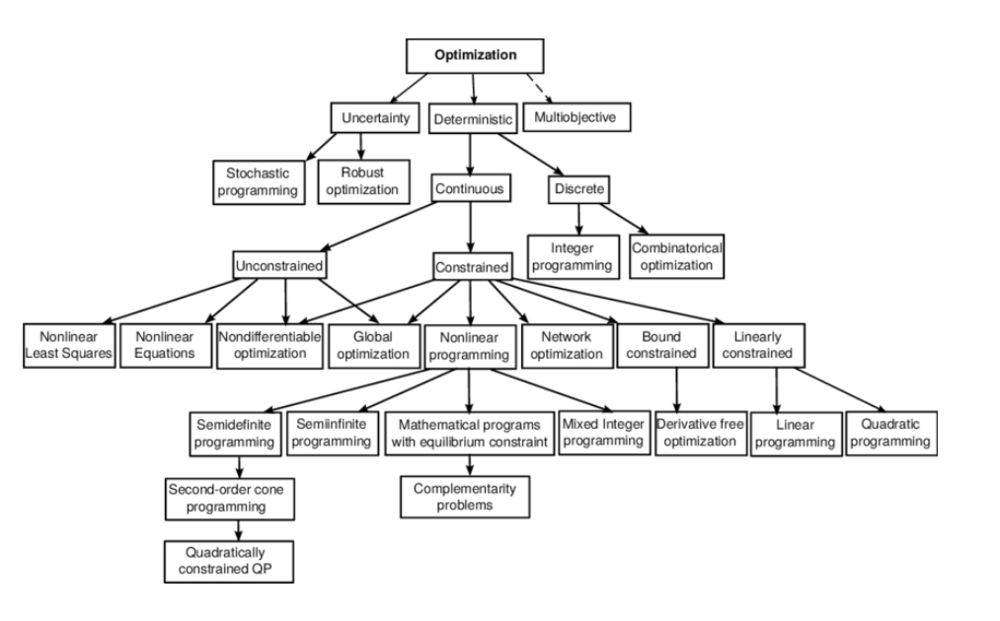

layout: true

<div class="my-footer"><span>Update Minggu III ---- 20921004@mahasiswa.itb.ac.id</span></div>

```{r setup, include=FALSE}
options(htmltools.dir.version = FALSE)
setwd("~/S2 Sains Komputasi ITB/Kuliah/Thesis/Penelitian Mandiri 1/Week III")

```

---
class: middle,inverse

# REKAP MINGGU SEBELUMNYA

## Jenis-Jenis Optimisasi
### Berdasarkan Variabel yang Terlibat: Kontinu dan Diskrit

--

Namun pada _mixed integer linear programming_ (__MILP__) dimungkinkan variabel kontinu dan diskrit bersamaan.

---
class: middle

# CONTOH MASALAH MILP

## _Production Planning_

Suatu pabrik makanan/minuman sedang berencana untuk membuat `3` produk baru yang rencananya akan diproduksi di `2` _plant_ yang berbeda.

```{r,echo=FALSE,message=FALSE,warning=FALSE}
problem = 
data.frame(
  keterangan = c("Plant 1, jam","Plant 2, jam","Profit per ton","Sales Potential per ton"),
  produk_1 = c(3,4,5,7),
  produk_2 = c(4,6,7,5),
  produk_3 = c(2,2,3,9),
  limit_production_time_per_plant_per_day = c(30,40,"","")
)
knitr::kable(problem,align = "c")
```

Masalah timbul saat mereka harus memilih maksimal `2` dari `3` produk baru yang harus diproduksi. Selain itu, mereka juga harus memilih hanya `1` dari `2` _plant_ yang memproduksi produk-produk tersebut.

> Bagaimana cara mereka memilihnya? Lalu berapa ton yang harus diproduksi dari produk yang dipilih tersebut?

---
class: middle

# CONTOH MASALAH MILP

## _Production Planning_

#### Kita harus memilih maksimal `2` produk: _binary integer_.

--

#### Kita harus menentukan berapa ton yang harus di produksi: _continuous_.

--

#### Kita harus memilih `1` _plant_: _binary integer_.

---
# CONTOH MASALAH MILP

## _Optimal Location_: Pemilihan Pool Taxi

```{r out.width="50%",echo=FALSE,warning=FALSE,message=FALSE,fig.align='center'}
knitr::include_graphics("https://raw.githubusercontent.com/ikanx101/ikanx101.github.io/master/_posts/linear%20problem/post%205/post_files/figure-gfm/unnamed-chunk-1-1.png")
```

---
# CONTOH MASALAH MILP

## _Optimal Location_: Pemilihan Pool Taxi

```{r out.width="50%",echo=FALSE,warning=FALSE,message=FALSE,fig.align='center'}
knitr::include_graphics("https://raw.githubusercontent.com/ikanx101/ikanx101.github.io/master/_posts/linear%20problem/post%205/post_files/figure-gfm/unnamed-chunk-4-1.png")
```

---
class: middle,center,inverse

# KENAPA FOKUS PADA _MIXED INTEGER LINEAR PROGRAMMING_?

---
class: middle,center,inverse

# AGENDA HARI INI
## Jenis-Jenis Optimisasi (lanjutan) 
### Mengerucutkan Metode Optimisasi yang Cocok dengan Masalah yang Dihadapi

---

# JENIS-JENIS OPTIMISASI (lanjutan)

```{r out.width="75%",echo=FALSE,message=FALSE,warning=FALSE,fig.align='center'}

```

---
class: middle

# JENIS-JENIS OPTIMISASI (lanjutan)

.pull-left[

## Berdasarkan Masalah yang Dihadapi

1. __Optimization under uncertainty__; Pada beberapa kasus di dunia _real_, data dari masalah tidak dapat diketahui secara akurat karena berbagai alasan. Hal ini mungkin terjadi akibat:
    - Kesalahan dalam pengukuran, atau
    - Data melibatkan sesuatu di masa depan yang belum terjadi atau tidak pasti. Contoh: _demand_ produk, harga barang, dan sebagainya.
1. __Deterministic optimization__; Model deterministik adalah model matematika di mana nilai dari semua parameter dan variabel yang terkandung di dalam model merupakan satu nilai pasti.

]

.pull-right[

## Berdasarkan Keberadaan _Constraint_

Salah satu pembeda masalah optimisasi dengan masalah optimisasi lainnya adalah pada keberadaan _constraints_ di variabelnya.

1. _Unconstrained optimization_ adalah optimisasi yang __tidak mengandung__ _constraints_ pada _decision variable_-nya. 
1. _Constrained optimization_ adalah optimisasi yang __mengandung__ _constraints_ pada _decision variable_-nya. 
]

---
class: middle

# MASALAH YANG DIHADAPI

### Memilih dan menentukan kuantitas _raw material_ yang dibeli.

--

__Constrained optimization__: kapasitas gudang, kapasitas produksi, minimal order, kapasitas pengiriman, dll.

__Deterministic__: parameter dan variabel sudah terukur dengan jelas.

__Mixed Integer Linear Programming__: _matching_ antara raw material, supplier, dan SKU produk merupakan _binary_ sedangkan kuantitasnya merupakan kontinu.

---
# ALGORITMA OPTIMISASI

Secara garis besar ada dua kelompok besar algoritma optimisasi, yakni:

1. _Exact method_,
1. _Approximate method_.

Perbedaan keduanya adalah pada __konsep atau pendekatan apa yang digunakan__ untuk menyelesaikan masalah optimisasi.

Dalam beberapa kasus, kita bisa mendapatkan _exact method_ bisa untuk menyelesaikan masalah optimisasi dengan efisien. Namun di kasus lain yang lebih kompleks tidak demikian. Kelemahan utama metode _exact_ adalah pada waktu komputasinya yang relatif lebih lama.

--

## _Exact Method_

Ciri khas dari _exact method_ adalah metode ini menjamin penyelesaian yang optimal karena menggunakan penyelesaian analitis metode matematika.

--

## _Approximate Method_

Ciri khas dari _approximate method_ adalah metode ini tidak menjamin penyelesaian yang optimal karena bersifat _aproksimasi_ atau pendekatan atau hampiran. Oleh karena itu kita perlu melakukan definisi di awal __seberapa dekat__ nilai __hampiran__ tersebut bisa kita terima.

---
class: middle,center,inverse

# Terima Kasih
## _Feel free to discuss_

_Find me at_ [ikanx101.com](https://ikanx101.com/)

##### _created using Xaringan in R_