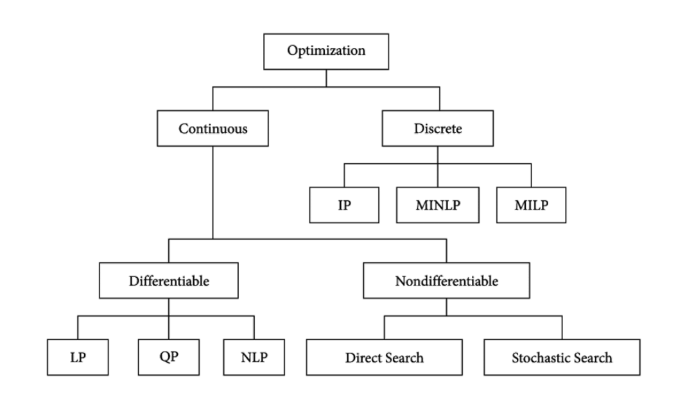

layout: true

<div class="my-footer"><span>Update Minggu I ---- 20921004@mahasiswa.itb.ac.id</span></div>

```{r setup, include=FALSE}
options(htmltools.dir.version = FALSE)
setwd("~/S2 Sains Komputasi ITB/Kuliah/Thesis/Penelitian Mandiri 1/ Week II a")
rm(list=ls())
n_per = 30
min_per = 5

ideal = round(14*3*min_per/n_per,0)

```

---
class: middle,inverse

# REKAP MINGGU SEBELUMNYA

## Rencana Judul Thesis
### Optimisasi Pembelian Raw Material Minuman Serbuk Menggunakan Metode XXX: Studi Kasus PT. XYZ.

---
class: middle,inverse

# REKAP MINGGU SEBELUMNYA

## _Output_ Perkuliahan

### Dokumentasi model-model optimisasi yang relevan dengan penelitian dan _computer codes_ dari metode optimisasi yang dipelajari.
---
class: middle,center,inverse

# AGENDA HARI INI
## Jenis-Jenis Optimisasi

---
# DEFINISI

## Optimisasi 
__Optimisasi__ merupakan salah satu cabang dari __riset operasi__ yang berfokus pada pencarian nilai minimum (atau maksimum) dari suatu variabel keputusan yang dibatasi oleh kendala tertentu (_constraints_) yang merepresentasikan suatu permasalahan _real_. Oleh karena itu, optimisasi erat kaitannya dengan pemodelan matematika.

--

## Riset Operasi
Sedangkan __riset operasi__ adalah metode antar disiplin ilmu yang digunakan untuk menganalisa masalah nyata dan membuat keputusan untuk kegiatan operasional organisasi atau perusahaan.

--

## Masalah Optimisasi
__Masalah optimisasi__ adalah masalah dalam pencarian __solusi terbaik__ dari semua kemungkinan solusi yang _feasible_.

---
# DEFINISI

## Model Optimisasi
Model optimisasi adalah ekspresi matematika dari suatu permasalahan optimisasi. Dari ekspresi matematika tersebut, ada beberapa hal yang perlu diketahui, yakni:

1. __Variabel__ adalah suatu simbol yang memiliki banyak nilai dan nilainya ingin kita ketahui. Setiap nilai yang mungkin dari suatu variabel muncul akibat suatu kondisi tertentu di sistem.
1. __Parameter__ di suatu model matematika adalah suatu konstanta yang menggambarkan suatu karakteristik dari sistem yang sedang diteliti. 
1. ___Constraints___ (atau kendala) adalah kondisi atau batasan yang harus dipenuhi. Kendala-kendala ini dapat dituliskan menjadi suatu persamaan atau pertaksamaan. Suatu masalah optimisasi dapat memiliki hanya satu kendala atau banyak kendala.
1. ___Objective function___ adalah satu fungsi (pemetaan dari variabel-varibel keputusan ke suatu nilai di daerah _feasible_) yang nilainya akan kita minimumkan atau kita maksimumkan.

--

Ekspresi matematika dari model optimisasi adalah sebagai berikut:

Cari $x$ yang meminimumkan atau memaksimumkan $f_i(x),\ i=1,..,m$ dengan kendala $g_j(x),\ j=1,..,n$ dan $x \geq 0$.

Dari ekspresi tersebut, kita bisa membagi-bagi masalah optimisasi tergantung dari:

1. Tipe variabel yang terlibat.
1. Jenis fungsi yang ada (baik _objective function_ ataupun _constraint_).

---
# JENIS-JENIS OPTIMISASI 

Pada bagian ini kita akan membahas jenis-jenis masalah optimisasi.

```{r out.width="75%",echo=FALSE,message=FALSE,warning=FALSE,fig.align='center'}

```

---
class: middle

# JENIS-JENIS OPTIMISASI 

.pull-left[

Masalah optimisasi bisa dibagi dua menjadi dua kategori berdasarkan tipe _variables_ yang terlibat, yakni:

1. _Discrete Optimization_: merupakan masalah optimisasi di mana variabel yang terkait merupakan variabel diskrit, seperti _binary_ atau _integer_.
1. _Continuous Optimization_: merupakan masalah optimisasi di mana nilai optimal ditemukan pada fungsi kontinu (termasuk fungsi yang _multimodal_).
    - Sebagaimana yang telah kita pelajari di kalkulus, suatu fungsi kontinu __bisa terdiferensiabel__ atau __tidak terdiferensiabel__ di selang tertentu.
    - Hal ini mengakibatkan pendekatan yang berbeda juga dalam penyelesaian optmisasinya.
    
]

.pull-right[

```{r out.width="75%",echo=FALSE,message=FALSE,warning=FALSE,fig.align='center'}
nomnoml::nomnoml("#direction:down,
                 [Optimisasi] -> [Variabel]
                 [Variabel] -> [Diskrit]
                 [Variabel] -> [Kontinu]
                 ")
```

]

---
class:middle

# OPTIMISASI KONTINU

## _Linear Programming_

_Linear programming_ adalah bentuk metode optimisasi sederhana yang memanfaatkan relasi linear (semua fungsi dan _constraints_ merupakan fungsi linear).

## _Non Linear Programming_

Beberapa permasalahan tidak bisa ditulis sebagai fungsi linear, oleh karena itu muncullah permasalahan _non linear programming_. Bentuk dasar pemodelannya sama dengan _linear programming_ tapi ada fungsi yang tidak linear di dalamnya. Sebagai contoh fungsi yang terlibat ada logaritmik atau fungsi trigonometri.

---
# LINEAR PROGRAMMING

## Contoh Masalah _Linear Programming_ 

Saya memiliki area parkir seluas 1.960 $m^2$. Luas rata-rata untuk mobil berukuran kecil adalah 4 $m^2$ dan mobil besar adalah 20 $m^2$. Daya tampung maksimum hanya 250 kendaraan, biaya parkir mobil kecil adalah Rp 7.000 per jam dan mobil besar adalah Rp 12.000 per jam. Jika dalam 1 jam area parkir saya terisi penuh dan tidak ada kendaraan yang pergi dan datang, maka berapa pendapatan maksimum yang bisa saya dapatkan dari tempat parkir itu?

--

Dari kasus di atas kita bisa tuliskan model matematikanya sebagai berikut:

Misal $x_1$ adalah mobil kecil dan $x_2$ adalah mobil besar.

$$max(7000x_1 + 12000x_2)$$

--

Dengan _constraints_: 

$$4 x_1 + 20 x_2 \leq 1960$$

--

dan

$$x_1 + x_2 \leq 250$$

--

serta $x_1 \geq 0, x_2 \geq 0$.

---
```{r,echo=FALSE,message=FALSE,warning=FALSE,fig.align='center',fig.retina = 10}
library(dplyr)
library(ggplot2)
f1 = function(x1){(1960 - 4*x1)/20}
f2 = function(x1){250 - x1}

data.frame(x = 0:260) %>% 
  mutate(y1 = f1(x),
         y2 = f2(x)) %>% 
  ggplot() +
  geom_line(aes(x,y1),
            group = 1,
            color = "darkred") +
  geom_line(aes(x,y2),
            group = 1,
            color = "darkgreen") +
  annotate("label",x = 10,y = 115, label = "98 mobil besar\n0 mobil kecil",size = 4) +
  annotate("label",x = 200,y = 75, label = "190 mobil kecil\n60 mobil besar",size = 4) +
  annotate("label",x = 210,y = 10, label = "250 mobil kecil\n0 mobil besar",size = 4) +
  labs(x = "x1",
       y = "x2",
       title = "Grafik Persamaan Linear dari Masalah Optimisasi")
```

---
# NON LINEAR PROGRAMMING
## Contoh Masalah _Non Linear Programming_ 

Suatu perusahaan menjual suatu produk yang memiliki model _price elasticity_ seperti di bawah ini:

```{r out.width="30%",echo=FALSE,message=FALSE,warning=FALSE,fig.align='center'}
knitr::include_graphics("Screenshot from 2021-08-31 18-58-26.png")
```

Di mana $p(x)$ adalah harga saat menjual produk sebanyak $x$.

---
# NON LINEAR PROGRAMMING
## Contoh Masalah _Non Linear Programming_ 

Omset perusahaan tersebut didefinisikan sebagai `terjual x harga`, yakni $x p(x)$. Sedangkan profit adalah omset dikurangi dengan biaya produksi per produk yang terjual.

--

Sehingga didapatkan:

$$P(x) = x p(x) - c x, \text{ dengan c adalah fixed cost}$$

Karena $p(x)$ non linear, maka didapatkan $P(x)$ juga non linear.

---
class: middle

# DISCRETE OPTIMIZATION

## _Integer Programming_

Pada _integer programming_, semua variabel yang terkait __wajib__ berupa _integer_ atau _binary_.

Contoh masalah _Integer Programming_ adalah _nurse schedulling problem_, yakni bagaimana memasangkan perawat tepat ke _shift_ kerja yang tersedia.

---
class: middle

# CONTOH MASALAH INTEGER PROGRAMMING

## Latar Belakang

Di suatu rumah sakit, ada satu lantai berisi kamar rawat inap kelas VIP dengan total ada `r n_per` orang perawat yang ditugaskan di sana. Para perawat bekerja dengan sistem _shift_ dengan peraturan sebagai berikut:

- Terdapat `3` shift kerja yaitu:
    - _day shift_ (8.00 - 16.00), 
    - _evening shift_ (16.00 - 24.00), dan
    - _night shift_ (24.00 - 8.00)
- Pada setiap shift dibutuhkan minimal `r min_per` orang perawat.

Selain itu, terdapat beberapa __aturan kerja__ yang harus dipenuhi, yakni:

1. Setiap perawat dalam satu hari hanya boleh ditugaskan ke dalam satu _shift_.
1. Jika seorang perawat ditugaskan pada _shift_ malam, maka dia tidak dapat ditugaskan di _shift_ pagi di hari berikutnya.
1. Jika seorang perawat ditugaskan dalam `4` hari berturut-turut, maka hari ke-`5` harus diberi libur.
1. Jika seorang perawat ditugaskan pada suatu _shift_ di _weekend_, maka dia tidak dapat ditugaskan di _weekend_ berikutnya.
1. _Workload_ (banyaknya penugasan) setiap perawat harus __sama__.

---
class: middle

# CONTOH MASALAH INTEGER PROGRAMMING

## Di mana letak _integer_-nya?

--

> Salah satu tujuan optimisasi ini adalah memasangkan (_matching_) antara perawat siapa, masuk hari apa di _shift_ yang mana.

--

### _Decision Variable_

Saya definisikan:

$$x_{n,h,s} = \begin{cases} 1,& \text{ jika di perawat ke } n \text{ bekerja di hari } h \text{ pada shift ke }s\\ 0, & \text{ lainnya.}\end{cases}$$

---
class: middle

# CONTINUOUS DAN INTEGER 
## _Mixed Integer Linear Programming_

.pull-left[

### Masalah Optimisasi Lainnya

Ada kalanya kita memiliki masalah yang _decision variables_ lebih dari satu dan merupakan perpaduan antara _integer_, _binary_, dan kontinu.

Ada satu metode lain yang dinamakan _mixed integer linear programming_ (__MILP__).

Contoh masalah yang sering ditemui adalah penentuan _plant_ produksi.


]

.pull-right[

```{r,echo=FALSE}
nomnoml::nomnoml("#direction:down,
                 [Masalah] -> [Variable]
                 [Variable] -> [Kontinu]
                 [Variable] -> [Diskrit]
                 [Diskrit] <-> [Kontinu]
                 ")
```

]

---
class: middle

# CONTOH MASALAH MILP

## _Production Planning_

Suatu pabrik makanan/minuman sedang berencana untuk membuat `3` produk baru yang rencananya akan diproduksi di `2` _plant_ yang berbeda.

```{r,echo=FALSE,message=FALSE,warning=FALSE}
problem = 
data.frame(
  keterangan = c("Plant 1, jam","Plant 2, jam","Profit per ton","Sales Potential per ton"),
  produk_1 = c(3,4,5,7),
  produk_2 = c(4,6,7,5),
  produk_3 = c(2,2,3,9),
  limit_production_time_per_plant_per_day = c(30,40,"","")
)
knitr::kable(problem,align = "c")
```

Masalah timbul saat mereka harus memilih maksimal `2` dari `3` produk baru yang harus diproduksi. Selain itu, mereka juga harus memilih hanya `1` dari `2` _plant_ yang memproduksi produk-produk tersebut.

> Bagaimana cara mereka memilihnya? Lalu berapa ton yang harus diproduksi dari produk yang dipilih tersebut?

---
class: middle

# CONTOH MASALAH MILP

## _Production Planning_

#### Kita harus memilih maksimal `2` produk: _binary integer_.

--

#### Kita harus menentukan berapa ton yang harus di produksi: _continuous_.

--

#### Kita harus memilih `1` _plant_: _binary integer_.

---
class: middle,center,inverse

# NEXT WEEK AGENDA

## Jenis Algoritma: _Exact_ dan Aproksimasi (Numerik)

---
class: middle,center,inverse

# Terima Kasih
## _Feel free to discuss_

_Find me at_ [ikanx101.com](https://ikanx101.com/)

##### _created using Xaringan in R_