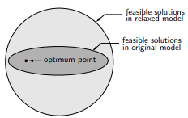

```{r setup, include=FALSE}
knitr::opts_chunk$set(echo = TRUE)
setwd("~/209_ITB/Thesis/Penelitian Mandiri 1 Present/Week_12")

library(dplyr)
library(ggplot2)

rm(list=ls())
```

# PENDAHULUAN

Pada minggu lalu, saya telah menjelaskan bagaimana metode _simplex_ bisa dilakukan secara:

1. Geometris,
1. Transisi geometris ke aljabar,
1. Operasi matriks (_tableau_).

Sebagai pengingat, metode _simplex_ digunakan untuk menyelesaikan masalah _linear programming_. Sedangkan masalah yang saya hadapi (___supplier selection problem___) merupakan masalah _mixed integer linear programming_.

Lantas bagaimana saya bisa menyelesaikannya?

# SOLUSI

## Metode _Branch and Bound_ untuk _MILP_

Metode _simplex_ adalah metode eksak yang digunakan untuk menyelesaikan _linear programming_. Solusi yang dihasilkan merupakan bilangan _real_ atau kontinu. Pada _MILP_, variabel yang terlibat sangat beragam (_integer_, _binary_, dan kontinu). Membulatkan bilangan solusi _linear programming_ untuk mendapatkan solusi _integer_ atau _binary_ dari suatu masalah _MILP_ tidak menjamin keoptimalan tercapai.

Oleh karena itu, kita akan melakukan pendekatan tertentu dari _linear programming_ agar hasilnya bisa digunakan di _MILP_.

### _Relaxation of Discrete Optimization Models_

Salah satu pendekatan yang bisa dilakukan adalah melakukan _constraint relaxation_ [@benoit].

#### Definisi {-}

Model $R$ disebut dengan _constraint relaxation_ dari model $P$ jika:

- Setiap _feasible solution_ dari $P$ juga _feasible_ di $R$.
- $P$ dan $R$ memiliki fungsi objektif yang sama.

#### Contoh {-}

Berikut adalah _original MILP_:

$$\min_{x,y} 7x_1 + x_2 + 3 y_1 + 6y_2$$

$$\text{s.t. } x_1 + 10 x_2 + 2 y_1 + y_2 \geq 100$$

$$y_1 + y_2 \leq 1$$

$$x_1,x_2 \geq 0,y_1,y_2 \in \{0,1\}$$

___Relaxation I___ : _relax constraints RHS_

$$\min_{x,y} 7x_1 + x_2 + 3 y_1 + 6y_2$$

$$\text{s.t. } x_1 + 10 x_2 + 2 y_1 + y_2 \geq 50$$

$$y_1 + y_2 \leq 1$$

$$x_1,x_2 \geq 0,y_1,y_2 \in \{0,1\}$$

___Relaxation II___ : _Drop constraint_

$$\min_{x,y} 7x_1 + x_2 + 3 y_1 + 6y_2$$

$$\text{s.t. } x_1 + 10 x_2 + 2 y_1 + y_2 \geq 100$$

$$x_1,x_2 \geq 0,y_1,y_2 \in \{0,1\}$$

___Relaxation III___ : _remove integrality_

$$\min_{x,y} 7x_1 + x_2 + 3 y_1 + 6y_2$$

$$\text{s.t. } x_1 + 10 x_2 + 2 y_1 + y_2 \geq 100$$

$$y_1 + y_2 \leq 1$$

$$x_1,x_2 \geq 0, 0 \leq y_1,y_2 \leq 1$$

### _Linear Programming Relaxation_

#### Definisi {-}

_LP relaxation_ dari _MILP_ dibentuk dengan memperlakukan variabel diskrit sebagai variabel kontinu sambil mempertahankan semua _constraints_ yang ada [@benoit].

$$y \in \{0,1\} \Rightarrow 0 \leq y \leq 1$$

Oleh karena itu bisa terjadi hal sebagai berikut:

```{r,echo=FALSE,message=FALSE,warning=FALSE,fig.align='center',fig.cap="Solusi LP Relaxation"}

```

Apakah _LP relaxation_ menjamin mendapatkan hasil yang _valid_?

Berikut adalah sifat dari _LP relaxation_:

1. Jika _LP relaxation_ _infeasible_, maka model _MILP_ asalnya juga. 
1. Hasil optimal _LP relaxation_ dari _MILP_ yang bertujuan untuk maksimisasi berada pada _upper bound_.
1. Hasil optimal _LP relaxation_ dari _MILP_ yang bertujuan untuk minimisasi berada pada _lower bound_.
1. Jika suatu solusi optimal _LP relaxation_ ternyata _feasible_, maka solusi tersebut optimal di model _MILP_ asalnya. 

### Algoritma _Branch and Bound_

Algoritma _branch and bounds_ mengkombinasikan beberapa strategi _relaxation_ secara iteratif untuk memilih kemungkinan solusi paling optimal. 

#### Ilustrasi {-}

Perhatikan contoh berikut:

$$\max z = 4 x_1 - x_2$$

$$\text{s.t. } 7 x_1 - 2 x_2 \leq 14$$

$$x_2 \leq 3$$

$$2 x_1 - 2 x_2 \leq 3$$

$$x_1,x_2 \in \mathbb{Z}^+$$

Misalkan $S$ adalah himpunan solusi _feasible_ dari _LP relaxation_ (dibuat suatu _LP relaxation_ dengan $x$ berupa variabel kontinu). Menggunakan metode simplex kita bisa dapatkan $x_1 = 2.857143 , x_2 = 3, z = 8.428571$.

Kita misalkan $z* = - \infty$, karena $x_1$ bukan integer, maka kita akan uat _branch out_ dari variabel ini.

$$S_1 = S \cap \{x:x_1 \leq 2\}$$

$$S_2 = S \cap \{x:x_1 \geq 3\}$$

```{r out.width="60%",echo=FALSE,fig.align='center',fig.retina=10,fig.cap="Branch Out Tahap I"}
nomnoml::nomnoml("[S|z = 8.428571|z*=-inf] -> x1<=2 [S1]
                 [S|z = 8.428571|z*=-inf] -> x1>= 3 [S2]")
```

\newpage

Kita akan evaluasi kembali dengan _LP relaxation_ yang baru.

- Pada $S_1$ kita dapatkan dengan metode _simplex_ solusinya adalah $x_1 = 2, x_2 = 0.5, z = 0.75$. Oleh karena itu, kita akan _branch out_ kembali dengan pemecahan sebagai berikut:

$$S_{11} = S \cap \{x:x_2 = 0\}$$

$$S_{12} = S \cap \{x:x_2 \geq 1\}$$


- Pada $S_2$ kita dapatkan bahwa kondisi $x_1 \geq 3$ membuat model menjadi _infeasible_. Kita akan hentikan _branch out_ dari $S_2$.

```{r out.width="60%",echo=FALSE,fig.align='center',fig.retina=10,fig.cap="Branch Out Tahap II"}
nomnoml::nomnoml("[S|z = 8.428571|z*=-inf] -> x1<=2 [S1]
                 [S|z = 8.428571|z*=-inf] -> x1>= 3 [S2]
                 [S1] -> x2=0 [S11]
                 [S1] -> x2>=1 [S12]
                 ")
```

Kita lakukan kembali _LP relaxation_ pada $S_{11}$ dan $S_{12}$ sebagai berikut:

- Pada $S_{12}$, metode simplex menghasilkan solusi $x_1 = 2, x_2 = 1, z = 7$. Kita akan _update_ nilai $z* = 7$.
- Pada $S_{11}$, metode simplex menghasilkan solusi $x_1 = 1.5, x_2 = 0, z = 6$. Karena $z < z*$, maka tidak ada lagi _branch out_.

#### Kesimpulan {-}

Solusi optimal didapatkan pada $S_{12}$.
