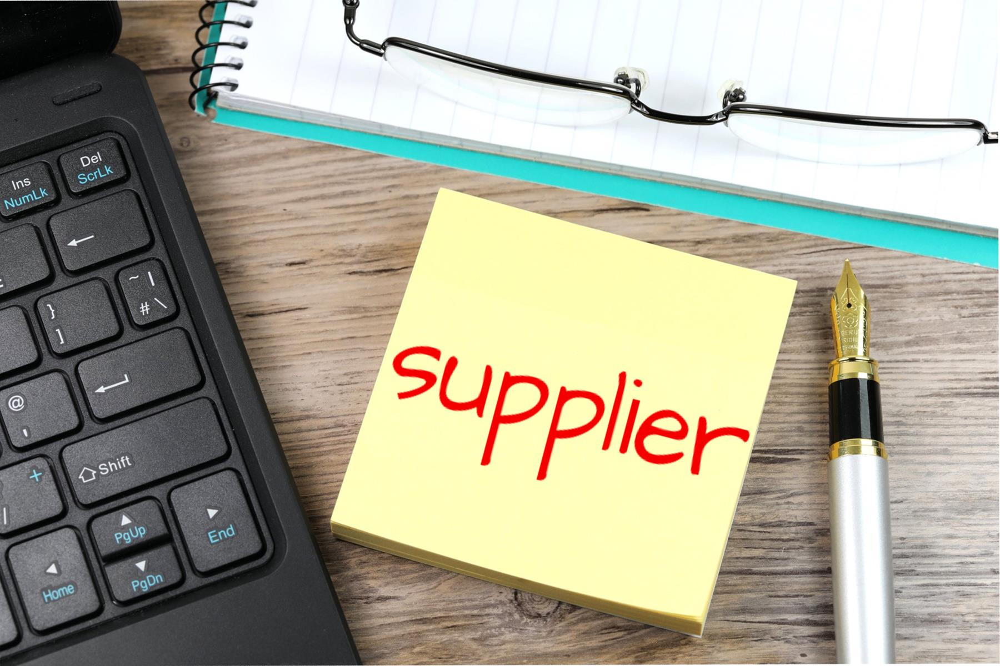

```{r setup, include=FALSE}
knitr::opts_chunk$set(echo = FALSE)
rm(list=ls())
library(dplyr)
```


# BACKGROUND

### Background

```{r out.width="80%",echo=FALSE,fig.align='center',fig.cap="source: www.flickr.com"}

```

### Background

```{r out.width="60%",echo=FALSE,fig.align='center',fig.cap="source: ie.binus.ac.id"}

```

### Background

In practice, companies can use two strategies related to supplier selection, namely: single sourcing and multiple sourcing.

Many factors will make decision-making complex for companies that implement multiple sourcing strategies. For example, price, transaction agreement, quality, quantity, distance, and delivery fee [@masood].

### Background

PT. NF is one of the manufacturing companies in Indonesia that produces 130 types of beverages. Sugar is one of the most frequently used raw materials for all these beverage products. Each of these beverage products can be divided into two groups, namely:

1. Drinks can only be produced with one type of sugar.
2. Drinks can be produced using two or more types of sugar.

For the fulfillment of sugar, NF uses multiple sourcing with an agreement to supply it from six suppliers. Specifications for sugar itself and price per ton vary between suppliers.

### Background

In this study, there are three main problems to be solved, namely:

- Selecting sugar suppliers.
- Determine the number of sugar purchased from a supplier.
- Determine which sugar should be used to produce each product.

The goal is to keep the total expense of purchases to a minimum but still meet the requirements in a certain period.

The output of this research is an optimization model that can solve the above problems.

# PRODUCTION SYSTEM

### Existing Condition

Currently, the selection of suppliers and determining the number of raw material purchases are made manually by considering related data by the PPIC department every week. However, it has not yet distributed the raw materials with products, so it can potentially cause a loss of sales due to the absence of raw materials during production. In addition, this calculation process takes quite a long time.

## Production Series

### Production Series

```{r out.width="75%",echo=FALSE,warning=FALSE,message=FALSE,fig.align='center',fig.cap="Production Circuit Simplification"}
nomnoml::nomnoml("#direction: right
                 [Pre Production] -> [Production]
                 [Production] -> [Post Production]
                 
                 [Pre Production|
                    [Planning] -> [Sales Forecast]
                    [Planning] -> [Production Capacity]
                    [Planning] -> [Labour]
                    [Planning] -> [etc]
                    ]
                 
                 [Production]
                 
                 [Post Production|
                    [Activities] -> [Sales]
                    [Activities] -> [Marketing]
                    ]
                 ")
```

### Production Series

So far, NF orders sugar directly every month with the amount of the order adjusted to:

1. Demand figures or forecasts for each product that uses these sugar.
1. Existing stock of sugar in the raw material warehouse.
1. Minimum order per type of sugar determined by the supplier.

### Production Series

This order must also be adjusted to the existing policies in SCM, such as:

1. Purchase of sugar must come from at least two suppliers to maintain supply security.
1. Purchase of sugar from suppliers must meet NF's portfolio proportion set at the beginning of the year.

## Raw Material Delivery

### Information: Raw Material Delivery 

Delivery of sugar by suppliers is carried out four times a month with the amount according to the following rules:

- The number of sugar for each shipment is flexible according to the existing stock and product demand for the week.
- Delivery and inspection time is 17 days after ordering sugar until the sugar can finally be used for production.

Therefore, planning to buy sugar is done at least a month before the sugar is used.

### Detailed Information {.allowframebreaks}

Saat ini, ada __6__ jenis bahan baku yang bisa dipesan ke __6__ _supplier_ yang berbeda. Informasi lain yang perlu diketahui adalah:

- Terkait produk dan bahan baku:
    - Sebagian kecil dari produk hanya bisa diproduksi dengan __satu jenis bahan baku saja__.
    - Sebagian besar lainnya memungkinkan untuk diproduksi dengan __dua atau lebih jenis bahan baku__. Kebutuhan bahan baku untuk produk pada kelompok ini adalah sama. Ilustrasi sebagai berikut:
        - Produk minuman __A__ bisa diproduksi menggunakan bahan baku $x_1$ sebanyak 1 ton atau $x_2$ sebanyak 1 ton juga.
- Pembelian bahan baku harus memenuhi _minimum order_ yang ditetapkan oleh _supplier_ __tapi__ jika pembelian di atas _minimum order_ harus dilakukan __pembulatan__ (_order volume_ harus berupa _integer_). Misalkan:
    - _Minimum order_ adalah __10 ton__, maka:
        - Boleh membeli __11 ton__.
        - Tidak boleh membeli __10.5 ton__.
- Harga masing-masing jenis bahan baku berbeda. 
- Lama pengiriman hingga bahan baku siap digunakan untuk semua _supplier_ sama.

### Ilustrasi Alur Pengadaan Bahan Baku: Gula

```{r out.width="85%",echo=FALSE,fig.cap="Simplifikasi dari Penggunaan Bahan Baku",fig.align='center'}
knitr::include_graphics("ilustrasi_2.png")
```

## Substitusi Bahan Baku

### Informasi Terkait Substitusi Bahan Baku

Menurut informasi dari _product research and development_, beberapa bahan baku bisa dijadikan substitusi bagi bahan baku yang lain. Hal ini diperbolehkan karena kesamaan karakteristik yang ada pada beberapa bahan baku tersebut. Satu-satunya perbedaan mendasar antar bahan baku adalah warna. Sedangkan derajat rasa dan ukuran partikel sudah disesuaikan dengan standar baku pangan yang ada.

### Case I: Minimal __2 jenis__ bahan baku sebagai _back up_ {.allowframebreaks}

Dalam suatu bulan tertentu, untuk memproduksi produk __A__, __B__, dan __C__ NFI bisa mempertimbangkan untuk menggunakan bahan baku $x_1$, $x_2$, __atau__ $x_3$. Untuk memastikan keamanan pasokan (sebagai _back up_), minimal harus ada dua jenis bahan baku yang harus dibeli. Alternatif pembelian yang bisa dilakukan:

1. Membeli $x_1$ dan $x_2$,
1. Membeli $x_1$ dan $x_3$,
1. Membeli $x_2$ dan $x_3$, atau
1. Membeli $x_1$, $x_2$, dan $x_3$.

### Case II: Unit bahan baku yang digunakan __sama__ {.allowframebreaks}

Dalam suatu bulan tertentu, untuk membuat produk __A__, NFI bisa menggunakan:

1. 100 unit $x_1$ atau,
1. 100 unit $x_2$.

Sedangkan untuk membuat produk __B__, NFI bisa menggunakan:

1. 100 unit $x_2$ atau,
1. 100 unit $x_3$.

Karena minimal harus ada __2 bahan baku yang dipilih__, maka alternatif solusi yang ada adalah:

1. 100 unit $x_1$ dan 100 unit $x_2$.
1. 100 unit $x_1$ dan 100 unit $x_3$.
1. 100 unit $x_2$ dan 100 unit $x_3$.

Selain alternatif di atas, NFI juga diperbolehkan membeli masing-masing 100 unit $x_1, x_2,$ atau $x_3$. Namun hal ini tidak optimal karena membeli lebih banyak dibandingkan kebutuhan.

# DATA YANG DIGUNAKAN

## Data _Input_

Ada beberapa data yang dijadikan _input_ dalam permasalahan ini, yakni:

1. Data spek bahan baku, meliputi: harga (Rupiah per $kg$), _minimum order quantity_ (MOQ dalam $kg$), _leadtime_ pengiriman hingga siap guna (dalam hari), stok terkini (dalam $kg$) untuk masing-masing jenis bahan baku, dan proporsi order tahunan.
1. Data komposisi bahan baku per produk yang diproduksi.
1. Data _demand_ mingguan untuk masing-masing produk (dalam unit _batch_ produksi) termasuk kebutuhan bahan baku per _batch_.

### Spek Bahan Baku 

```{r,echo=FALSE}
prop = runif(6,.5,1)
prop = prop / sum(prop) * 100
data.frame(bahan_baku = paste0("bb_",1:6),
           stok = round(runif(6,0,1) * 100,
                        1),
           min_order = round(runif(6,.5,3) * 1000,
                        0),
           leadtime = 17,
           harga = round(runif(6,100,230),
                        0) * 1000,
           proporsi = round(prop,1)) %>% 
  knitr::kable(caption = "Data Bahan Baku")
```


### Komposisi Bahan Baku per Produk

```{r,echo=FALSE}
baris = 6
df_1 = 
  data.frame(produk = paste0("fg_",1:baris),
           bb_1 = sample(c(0,1),baris,replace = T),
           bb_2 = sample(c(0,1),baris,replace = T),
           bb_3 = sample(c(0,1),baris,replace = T),
           bb_4 = sample(c(0,1),baris,replace = T),
           bb_5 = sample(c(0,1),baris,replace = T),
           bb_6 = sample(c(0,1),baris,replace = T)
           )

df_1[baris + 1,] = list(paste0("fg_",baris + 1),1,0,0,0,0,0)
df_1[baris + 2,] = list(paste0("fg_",baris + 2),0,0,1,0,0,0)
df_1 %>% 
  rowwise() %>% 
  mutate(bb_bisa_digunakan = sum(bb_1,bb_2,bb_3,bb_4,bb_5,bb_6)) %>%
  ungroup() %>% 
  mutate(bb_bisa_digunakan = ifelse(bb_bisa_digunakan == 0,1,bb_bisa_digunakan),
         bb_1 = ifelse(bb_bisa_digunakan == 0,1,bb_1)) %>% 
  knitr::kable(caption = "Contoh Sample Data Komposisi Bahan Baku")
```


### Data _Demand_ Mingguan per Produk 


```{r,echo=FALSE}
data.frame(produk = paste0("fg_",1:8),
           demand_w1 = sample(c(0:10),8,replace = T),
           demand_w2 = sample(c(0:10),8,replace = T),
           demand_w3 = sample(c(0:10),8,replace = T),
           demand_w4 = sample(c(0:10),8,replace = T),
           bb_per_batch = sample(c(40,500,550,341,330,600,700,1000,640),8,replace = T)
           ) %>% 
  knitr::kable(caption = "Contoh Sample Data Demand Mingguan")
```

# PENELITIAN MANDIRI IV: Model Optimisasi

## Pengantar Model Optimisasi

### Pengantar Model Optimisasi

Masalah _supplier selection_, _order allocation_, dan pemasangan bahan baku dengan produk adalah masalah dengan satu kriteria, yaitu total harga pengadaan (pembelian) tetapi ukuran masalahnya lebih besar karena ketiga masalah di atas hanya sebagian dari variabel keputusan. Variabel keputusan lainnya adalah bagaimana distribusi pengiriman dari tiap _supplier_ per minggu. Oleh karena itu, masalah krusial pertama dari penyelesaian masalah ini adalah menurunkan masalah optimisasi yang tepat yang dapat menjadi model dari masalah ini.

Berdasarkan informasi-informasi yang telah didapatkan dari `Penelitian Mandiri III`, berikut adalah model optimisasi dari permasalahan ini.


## Parameter Model

### Parameter yang Diketahui {.allowframebreaks}

Notasikan:

- $M$ sebagai himpunan semua minggu. 
- $P = P_1 \bigcup P_2 \bigcup P_3 \bigcup P_4 \bigcup P_5 \bigcup P_6$ sebagai himpunan produk di semua minggu.
    - $\hat{P}$ sebagai himpunan bagian dari $P$, yakni himpunan produk yang menggunakan minimal dua jenis bahan baku.
    - $\dot{P}$ sebagai himpunan bagian dari $P$, yakni himpunan produk yang menggunakan satu jenis bahan baku saja.
- $G = \{1,2,3,4,5,6\}$ sebagai himpunan bahan baku.
- $D$ sebagai kebutuhan bahan baku di bulan perencanaan, yaitu: _week_ 3 - 6.
- $maxcap$ sebagai kapasitas gudang bahan baku.
- $\forall k \in G, Pr_k$ adalah total proporsi portofolio bahan baku yang ditetapkan dalam setahun (dalam ton).
- $\forall i \in P_j, \space g_{ijk}$ adalah kebutuhan bahan baku (dalam ton) dari produk $i$ pada _week_ $k$.
- $\forall k \in G, \space c_k$ adalah harga bahan baku $k$ per ton.
- $\forall k \in G, \space \epsilon_k$ adalah _minimum order quantity_ dari bahan baku $k$.
- $\forall k \in G, \space \hat{d}_{2k}$ adalah total bahan baku $k$ yang dibutuhkan pada _week_ 2.
- $\forall k \in G, \space Z_{ik}$ adalah stok level bahan baku $k$ di gudang pada akhir _week_ 1.

## Variabel Keputusan

### Variabel I

Definisikan $\forall k \in G, \space x_k$ adalah banyaknya bahan baku $k$ yang dibeli.

Berdasarkan informasi sebelumnya, kita ketahui bahwa $x_k$ bernilai bulat positif dan harus lebih besar atau sama dengan nilai $\epsilon_k$. Kemudian tidak ada kewajiban untuk membeli bahan baku dari seluruh _supplier_. 

Maka kita bisa tuliskan: $x_k = 0$ atau $\epsilon_k \leq x_k \leq maxcap$. Untuk menghindari nilai diskontinu dari $x_k$ ini, definisikan:

$$y_k = \left\{\begin{matrix}
1, & x_k = 0 \\ 0, & \epsilon_k \leq x_k \leq maxcap
\end{matrix}\right.$$

$\forall j \in M  \setminus \{1,6\}, \forall i \in P_j, \forall k \in G$,

### Variabel II 

Definisikan: $\hat{x}_{jk}$ sebagai banyaknya pengiriman bahan baku jenis $k$ di awal _week_ $j$.

$$a_{ijk} = \left\{\begin{matrix}
1, & \text{produk ke } i \text{ di week } j \text{ menggunakan BB } k \\ 
0, & \text{lainnya}
\end{matrix}\right.$$

### Variabel III 

Definisikan: $b_{ijk}$ sebagai proporsi penggunaan bahan baku $k$ dari seluruh kebutuhan bahan baku untuk produk $i$ di _week_ $j$, $\forall j \in M \setminus \{ 1 \}, \forall k \in G$.

### Variabel IV 

Definisikan: $z_{jk}$ sebagai stok level bahan baku $k$ di akhir _week_ $j$.


## Kendala Optimisasi

### Kendala I 

Kendala I adalah penghubung yang benar antara variabel keputusan biner, integer, atau kontinu yang berkaitan:

$$\begin{matrix}
\forall k \in G, &  \\
 & x_k \leq Dy_k \\
 & x_k \geq \epsilon y_k \\
\forall j \in M \setminus \{ 1,2 \}, \forall i \in P_j, \forall k \in G, & \\
 & b_{ijk} \leq a_{ijk} \\
 & b_{ijk} \geq \mu a_{ijk}
\end{matrix}$$

untuk suatu nilai $\mu$ yang kecil.

### Kendala II

Kendala II dibuat agar total bahan baku yang dipesan tidak kurang dari total _demand_ di bulan perencanaan.

$$\sum_{k \in G} x_k \geq D$$

### Kendala III

Kendala III mengatur hubungan antara total pembelian bahan baku dan pengiriman setiap minggu.

$$\begin{matrix}
\forall k \in G, & \\
 & x_k = \sum_{j \in \hat{M}} \hat{x}_{jk}
\end{matrix}$$

### Kendala IV

Kendala IV berfungsi untuk menjaga komposisi bahan baku yang diinginkan.

$$\begin{matrix}
\forall j \in M \setminus \{ 1,2 \}, \space \forall i \in \hat{P}_j, & \\
 & \sum_{k \in G} a_{ijk} \geq 2 \\
 & \sum_{k \in G} b_{ijk} = 1 \\
\forall j \in M \setminus \{ 1,2 \}, \space \forall i \in \dot{P}_j, & \\ 
 & \sum_{k \in G} a_{ijk} = 1 \\
 & \sum_{k \in G} b_{ijk} = 1
\end{matrix}$$

### Kendala V 

Kendala V berfungsi untuk menjaga stok level sesaat setelah pengiriman bahan baku agar tidak melebihi kapasitas gudang.

$$\begin{matrix}
 & \sum_{k \in G} (Z_{1k} + \hat{x}_{1k} - \hat{d}_{2k} + z_{jk}) = maxcap \\
\forall j \in M \setminus \{ 1,2 \} & \\
 & \sum_{k \in G} (z_{(j-1)k} + \hat{x}_{(j-1)k}) - \sum_{i \in P_j} b_{ijk} g_{ijk} + z_{jk} = maxcap
\end{matrix}$$

### Kendala VI

Kendala VI menjaga agar pembelian bahan baku tidak melebihi proporsi portofolio yang sudah ditetapkan dalam setahun.

$$\sum_{k \in G} x_k \leq Pr_k$$


## Fungsi Objektif

Permasalahan yang dihadapi adalah pemilihan _supplier_ dan bahan baku sebagai berikut:

$$\min \sum_{k \in G} c_k x_k$$

$$\begin{matrix}
\text{terhadap kendala I sampai VI dan } \\
x_k = 0 \text{ atau } \epsilon_k \leq x_k \leq maxcap, \space x_k \in \mathbb{Z}^+ \\
y_k \in \{ 0,1 \}, \hat{x}_{jk} \geq 0, a_{ijk} \in \{ 0,1 \} \\
0 \leq b_{ijk} \leq 1 \\
0 \leq z_{jk} \leq maxcap \\
\end{matrix}$$

# THANK YOU

# ABSTRACT

A company can choose a single sourcing and multiple sourcing strategies to supply raw materials in the manufacturing industry. The multiple sourcing strategies are the security of the availability of raw materials, but the determination of suppliers is crucial because there are many factors in decision making such as price, business agreement, quality, quantity, distance, and delivery costs. In this study, we take the case of one of Indonesia's largest beverage manufacturing companies in making an optimization model for supplier selection within a specific period. In addition, the problem of purchasing quantity and installation of raw materials to finished products is also used as a decision variable for which solutions are sought. This optimization problem is a form of mixed integer linear programming.

# REFERENCES

