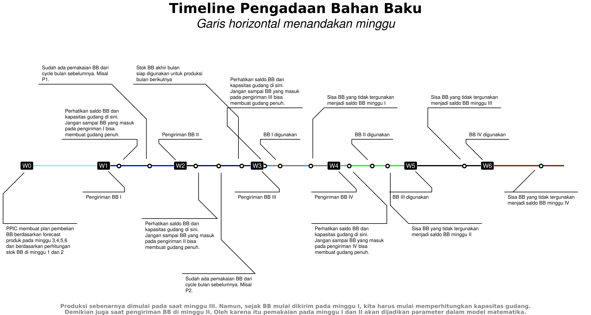

```{r setup, include=FALSE}
knitr::opts_chunk$set(echo = FALSE)
rm(list=ls())
library(dplyr)
```

# LATAR BELAKANG

### Latar Belakang

Semenjak diperkenalkan pertama kali pada tahun 1982, _Supply Chain Management_ (SCM) memegang peranan penting dalam manufaktur sebagai suatu sistem produksi terintegrasi [@webber]. Di dalam SCM, bahan baku dibeli perusahaan dari berbagai _supplier_, dibuat ke dalam suatu produk yang kemudian akan dijual ke pelanggan melalui berbagai _channel_ distribusi.

Dalam mengarungi kompetisi, perusahaan perlu memahami dua faktor kunci, yakni _cost reduction_ dan _product quality_ [@masood]. Kedua faktor ini sangat bergantung pada pemilihan _supplier_ yang tepat. Sehingga proses _supplier selection_ menjadi proses yang krusial dalam setiap perusahaan.

### Latar Belakang

Dalam prakteknya, perusahaan bisa menggunakan dua strategi terkait _supplier selection_, yakni: _single sourcing_ dan _multiple sourcing_. _Single sourcing_ berarti perusahaan hanya membeli bahan baku dari _supplier_ tunggal. Sedangkan _multiple sourcing_ berarti perusahaan bisa membeli bahan baku dari beberapa _supplier_. Strategi _single sourcing_ bisa menaikkan level risiko dari perusahaan sedangkan strategi _multiple sourcing_ menyebabkan _initial cost_ dan _ongoing cost_ yang lebih besar [@sourcing]. Bagi perusahaan yang menerapkan strategi _multiple sourcing_, banyak faktor yang akan membuat kompleks pengambilan keputusan. Misalnya harga, perjanjian transaksi, kualitas, kuantitas, jarak dan biaya pengantaran [@masood].

### Latar Belakang

PT. NFI adalah salah satu perusahaan manufaktur di Indonesia yang memproduksi 130 jenis minuman. Salah satu bahan baku yang paling sering digunakan untuk semua produk minuman tersebut adalah gula. Masing-masing produk minuman tersebut bisa dibagi menjadi dua kelompok, yakni:

1. Minuman yang hanya bisa diproduksi oleh satu jenis bahan baku gula.
1. Minuman yang bisa diproduksi menggunakan dua atau lebih jenis bahan baku gula.

Untuk pemenuhan bahan baku gula, NFI menggunakan prinsip _multiple sourcing_ dengan perjanjian untuk memasoknya dari enam buah _supplier_. Spesifikasi bahan baku gula dan harga perton berbeda-beda antar _supplier_.

### Latar Belakang

Pada penelitian ini, ada tiga masalah utama yang hendak diselesaikan, yakni:

- Memilih _supplier_ bahan baku.
- Menentukan banyaknya bahan baku yang harus dibeli dari suatu _supplier_.
- Menentukan bahan baku mana yang harus digunakan untuk memproduksi setiap produk.

dengan tujuan total biaya pembelian seminim mungkin tetapi memenuhi kebutuhan yang ada pada periode tertentu. Luaran dari penelitian ini adalah suatu model optimisasi yang bisa menyelesaikan permasalahan di atas.


# RENCANA KERJA

### Rencana Judul Thesis

___Optimization and Computational Model for Supplier Selection, Order Allocation, and Incorporating Raw-Material Characteristic: Case Study Beverages Manufacture___

### _Planned Output_

#### Penelitian Mandiri III

_Data collection_ dan dokumentasi _production system_.

#### Penelitian Mandiri IV

Model optimisasi yang telah disempurnakan.

# PENELITIAN MANDIRI III: Dokumentasi Sistem Produksi

### Kondisi yang Ada Saat Ini

Saat ini pemilihan _supplier_ dan penentuan kuantitas pembelian bahan baku dilakukan secara manual dengan mempertimbangkan data-data terkait secara mingguan oleh departemen PPIC (_Production Planning and Inventory Control_). Namun belum sampai ke dalam tahap pemasangan alokasi bahan baku dengan produk sehingga berpotensi menimbulkan _loss sales_ akibat ketiadaan bahan baku saat produksi. Selain itu, proses perhitungan ini memerlukan waktu yang cukup lama.

### Rencana Kerja 

Permasalahan ini bisa dipandang sebagai masalah optimisasi dan dapat dibuat menjadi suatu model optimisasi. Model optimisasi ini kelak akan diimplementasikan pada departemen PPIC sehingga tiga proses utama dalam pemilihan _supplier_ dan bahan baku bisa dilakukan secara cepat dan tepat. Diharapkan proses bisnis menjadi menjadi lebih efisien dan _cost_ yang ada bisa ditekan lebih baik lagi.

## Rangkaian Produksi

### Rangkaian Produksi

```{r out.width="75%",echo=FALSE,warning=FALSE,message=FALSE,fig.align='center',fig.cap="Simplifikasi Rangkaian Produksi"}
nomnoml::nomnoml("#direction: right
                 [Pra Produksi] -> [Produksi]
                 [Produksi] -> [Paska Produksi]
                 
                 [Pra Produksi|
                    [Planning] -> [Forecast Sales]
                    [Planning] -> [Kapasitas Produksi]
                    [Planning] -> [Labour]
                    [Planning] -> [etc]
                    ]
                 
                 [Produksi]
                 
                 [Paska Produksi|
                    [Activity] -> [Sales]
                    [Activity] -> [Marketing]
                    ]
                 ")
```

### Rangkaian Produksi

Dalam rangkaian produksi suatu produk, __NFI__ menggunakan banyak sekali bahan baku tapi ada beberapa bahan baku utama yang paling sering digunakan di berbagai produknya. Selama ini __NFI__ memesan bahan-bahan baku tersebut secara langsung setiap bulannya dengan besarnya pemesanan disesuaikan dengan:

1. Angka _demand_ atau _forecast_ masing-masing produk yang menggunakan bahan-bahan baku tersebut.
1. _Existing stock_ bahan baku yang ada di gudang bahan baku.
1. _Minimum order_ per jenis bahan baku yang ditetapkan _supplier_.

### Rangkaian Produksi

Pemesanan ini juga harus disesuaikan dengan _policy_ yang ada pada __SCM__, seperti:

1. Pembelian bahan baku harus berasal dari minimal 2 _suppliers_ untuk menjaga keamanan pasokan.
1. Pembelian bahan baku dari _supplier_ harus memenuhi proporsi portofolio yang ditetapkan di awal tahun oleh __NFI__.

## Pengiriman Bahan Baku

### Informasi Terkait Pengiriman Bahan Baku 

Pengiriman bahan baku oleh para _supplier_ dilakukan sebanyak 4 kali dalam sebulan dengan jumlah sesuai dengan aturan berikut:

- Banyaknya bahan baku pada setiap pengiriman adalah fleksibel disesuaikan dengan __stok__ ___existing___ dan ___demand___ produk pada minggu tersebut.
- __Waktu pengiriman dan inspeksi__ adalah selama 17 hari setelah pemesanan gula sampai akhirnya gula tersebut dapat digunakan untuk produksi. 

Oleh karena itu, perencanaan pembelian gula dilakukan setidaknya sebulan sebelum gula tersebut akan digunakan.

### Ilustrasi Pengiriman Bahan Baku

Contoh pada suatu bulan tertentu:

- Kebutuhan bahan baku diperkirakan sebesar __400 ton__.
- Stok _existing_ bahan baku di gudang bahan baku ada __50 ton__.
- Maka __NFI__ perlu memesan bahan baku sebesar __350 ton__.
- Pengiriman dilakukan __4 kali__.
    - Pada minggu I, diperkirakan kebutuhan bahan baku ada sebesar __100 ton__. Oleh karena itu, __pengiriman pertama__ adalah sebesar __50 ton__ saja.
    - Pada minggu II, III, dan IV pengiriman bahan baku akan disesuaikan dengan kebutuhan masing-masing (misalkan dibuat proporsional __100 ton__).

Oleh karena itu, kelak pada model optimisasi perlu ada _constraints_ terkait hal ini.

### Ilustrasi Pengiriman Bahan Baku

```{r out.width="80%",echo=FALSE,fig.cap="Simplifikasi dari Penggunaan Bahan Baku",fig.align='center'}
knitr::include_graphics("ilustrasi.png")
```

### Informasi Terkait Jenis Bahan Baku {.allowframebreaks}

Saat ini, ada __6__ jenis bahan baku yang bisa dipesan ke __6__ _supplier_ yang berbeda. Informasi lain yang perlu diketahui adalah:

- Terkait produk dan bahan baku:
    - Sebagian kecil dari produk hanya bisa diproduksi dengan __satu jenis bahan baku saja__.
    - Sebagian besar lainnya memungkinkan untuk diproduksi dengan __dua atau lebih jenis bahan baku__. Kebutuhan bahan baku untuk produk pada kelompok ini adalah sama. Ilustrasi sebagai berikut:
        - Produk minuman __A__ bisa diproduksi menggunakan bahan baku $x_1$ sebanyak 1 ton atau $x_2$ sebanyak 1 ton juga.
- Pembelian bahan baku harus memenuhi _minimum order_ yang ditetapkan oleh _supplier_ __tapi__ jika pembelian di atas _minimum order_ harus dilakukan __pembulatan__ (_order volume_ harus berupa _integer_). Misalkan:
    - _Minimum order_ adalah __10 ton__, maka:
        - Boleh membeli __11 ton__.
        - Tidak boleh membeli __10.5 ton__.
- Harga masing-masing jenis bahan baku berbeda. 
- Lama pengiriman hingga bahan baku siap digunakan untuk semua _supplier_ sama.

### Ilustrasi Alur Pengadaan Bahan Baku: Gula

```{r out.width="85%",echo=FALSE,fig.cap="Simplifikasi dari Penggunaan Bahan Baku",fig.align='center'}

```

## Substitusi Bahan Baku

### Informasi Terkait Substitusi Bahan Baku

Menurut informasi dari _product research and development_, beberapa bahan baku bisa dijadikan substitusi bagi bahan baku yang lain. Hal ini diperbolehkan karena kesamaan karakteristik yang ada pada beberapa bahan baku tersebut. Satu-satunya perbedaan mendasar antar bahan baku adalah warna. Sedangkan derajat rasa dan ukuran partikel sudah disesuaikan dengan standar baku pangan yang ada.

### Case I: Minimal __2 jenis__ bahan baku sebagai _back up_ {.allowframebreaks}

Dalam suatu bulan tertentu, untuk memproduksi produk __A__, __B__, dan __C__ NFI bisa mempertimbangkan untuk menggunakan bahan baku $x_1$, $x_2$, __atau__ $x_3$. Untuk memastikan keamanan pasokan (sebagai _back up_), minimal harus ada dua jenis bahan baku yang harus dibeli. Alternatif pembelian yang bisa dilakukan:

1. Membeli $x_1$ dan $x_2$,
1. Membeli $x_1$ dan $x_3$,
1. Membeli $x_2$ dan $x_3$, atau
1. Membeli $x_1$, $x_2$, dan $x_3$.

### Case II: Unit bahan baku yang digunakan __sama__ {.allowframebreaks}

Dalam suatu bulan tertentu, untuk membuat produk __A__, NFI bisa menggunakan:

1. 100 unit $x_1$ atau,
1. 100 unit $x_2$.

Sedangkan untuk membuat produk __B__, NFI bisa menggunakan:

1. 100 unit $x_2$ atau,
1. 100 unit $x_3$.

Karena minimal harus ada __2 bahan baku yang dipilih__, maka alternatif solusi yang ada adalah:

1. 100 unit $x_1$ dan 100 unit $x_2$.
1. 100 unit $x_1$ dan 100 unit $x_3$.
1. 100 unit $x_2$ dan 100 unit $x_3$.

Selain alternatif di atas, NFI juga diperbolehkan membeli masing-masing 100 unit $x_1, x_2,$ atau $x_3$. Namun hal ini tidak optimal karena membeli lebih banyak dibandingkan kebutuhan.

# DATA YANG DIGUNAKAN

## Data _Input_

Ada beberapa data yang dijadikan _input_ dalam permasalahan ini, yakni:

1. Data spek bahan baku, meliputi: harga (Rupiah per $kg$), _minimum order quantity_ (MOQ dalam $kg$), _leadtime_ pengiriman hingga siap guna (dalam hari), stok terkini (dalam $kg$) untuk masing-masing jenis bahan baku, dan proporsi order tahunan.
1. Data komposisi bahan baku per produk yang diproduksi.
1. Data _demand_ mingguan untuk masing-masing produk (dalam unit _batch_ produksi) termasuk kebutuhan bahan baku per _batch_.

### Spek Bahan Baku 

```{r,echo=FALSE}
prop = runif(6,.5,1)
prop = prop / sum(prop) * 100
data.frame(bahan_baku = paste0("bb_",1:6),
           stok = round(runif(6,0,1) * 100,
                        1),
           min_order = round(runif(6,.5,3) * 1000,
                        0),
           leadtime = 17,
           harga = round(runif(6,100,230),
                        0) * 1000,
           proporsi = round(prop,1)) %>% 
  knitr::kable(caption = "Data Bahan Baku")
```


### Komposisi Bahan Baku per Produk

```{r,echo=FALSE}
baris = 6
df_1 = 
  data.frame(produk = paste0("fg_",1:baris),
           bb_1 = sample(c(0,1),baris,replace = T),
           bb_2 = sample(c(0,1),baris,replace = T),
           bb_3 = sample(c(0,1),baris,replace = T),
           bb_4 = sample(c(0,1),baris,replace = T),
           bb_5 = sample(c(0,1),baris,replace = T),
           bb_6 = sample(c(0,1),baris,replace = T)
           )

df_1[baris + 1,] = list(paste0("fg_",baris + 1),1,0,0,0,0,0)
df_1[baris + 2,] = list(paste0("fg_",baris + 2),0,0,1,0,0,0)
df_1 %>% 
  rowwise() %>% 
  mutate(bb_bisa_digunakan = sum(bb_1,bb_2,bb_3,bb_4,bb_5,bb_6)) %>%
  ungroup() %>% 
  mutate(bb_bisa_digunakan = ifelse(bb_bisa_digunakan == 0,1,bb_bisa_digunakan),
         bb_1 = ifelse(bb_bisa_digunakan == 0,1,bb_1)) %>% 
  knitr::kable(caption = "Contoh Sample Data Komposisi Bahan Baku")
```


### Data _Demand_ Mingguan per Produk 


```{r,echo=FALSE}
data.frame(produk = paste0("fg_",1:8),
           demand_w1 = sample(c(0:10),8,replace = T),
           demand_w2 = sample(c(0:10),8,replace = T),
           demand_w3 = sample(c(0:10),8,replace = T),
           demand_w4 = sample(c(0:10),8,replace = T),
           bb_per_batch = sample(c(40,500,550,341,330,600,700,1000,640),8,replace = T)
           ) %>% 
  knitr::kable(caption = "Contoh Sample Data Demand Mingguan")
```

# PENELITIAN MANDIRI IV: Model Optimisasi

## Pengantar Model Optimisasi

### Pengantar Model Optimisasi

Masalah _supplier selection_, _order allocation_, dan pemasangan bahan baku dengan produk adalah masalah dengan satu kriteria, yaitu total harga pengadaan (pembelian) tetapi ukuran masalahnya lebih besar karena ketiga masalah di atas hanya sebagian dari variabel keputusan. Variabel keputusan lainnya adalah bagaimana distribusi pengiriman dari tiap _supplier_ per minggu. Oleh karena itu, masalah krusial pertama dari penyelesaian masalah ini adalah menurunkan masalah optimisasi yang tepat yang dapat menjadi model dari masalah ini.

Berdasarkan informasi-informasi yang telah didapatkan dari `Penelitian Mandiri III`, berikut adalah model optimisasi dari permasalahan ini.


## Parameter Model

### Parameter yang Diketahui {.allowframebreaks}

Notasikan:

- $M$ sebagai himpunan semua minggu. 
- $P = P_1 \bigcup P_2 \bigcup P_3 \bigcup P_4 \bigcup P_5 \bigcup P_6$ sebagai himpunan produk di semua minggu.
    - $\hat{P}$ sebagai himpunan bagian dari $P$, yakni himpunan produk yang menggunakan minimal dua jenis bahan baku.
    - $\dot{P}$ sebagai himpunan bagian dari $P$, yakni himpunan produk yang menggunakan satu jenis bahan baku saja.
- $G = \{1,2,3,4,5,6\}$ sebagai himpunan bahan baku.
- $D$ sebagai kebutuhan bahan baku di bulan perencanaan, yaitu: _week_ 3 - 6.
- $maxcap$ sebagai kapasitas gudang bahan baku.
- $\forall k \in G, Pr_k$ adalah total proporsi portofolio bahan baku yang ditetapkan dalam setahun (dalam ton).
- $\forall i \in P_j, \space g_{ijk}$ adalah kebutuhan bahan baku (dalam ton) dari produk $i$ pada _week_ $k$.
- $\forall k \in G, \space c_k$ adalah harga bahan baku $k$ per ton.
- $\forall k \in G, \space \epsilon_k$ adalah _minimum order quantity_ dari bahan baku $k$.
- $\forall k \in G, \space \hat{d}_{2k}$ adalah total bahan baku $k$ yang dibutuhkan pada _week_ 2.
- $\forall k \in G, \space Z_{ik}$ adalah stok level bahan baku $k$ di gudang pada akhir _week_ 1.

## Variabel Keputusan

### Variabel I

Definisikan $\forall k \in G, \space x_k$ adalah banyaknya bahan baku $k$ yang dibeli.

Berdasarkan informasi sebelumnya, kita ketahui bahwa $x_k$ bernilai bulat positif dan harus lebih besar atau sama dengan nilai $\epsilon_k$. Kemudian tidak ada kewajiban untuk membeli bahan baku dari seluruh _supplier_. 

Maka kita bisa tuliskan: $x_k = 0$ atau $\epsilon_k \leq x_k \leq maxcap$. Untuk menghindari nilai diskontinu dari $x_k$ ini, definisikan:

$$y_k = \left\{\begin{matrix}
1, & x_k = 0 \\ 0, & \epsilon_k \leq x_k \leq maxcap
\end{matrix}\right.$$

$\forall j \in M  \setminus \{1,6\}, \forall i \in P_j, \forall k \in G$,

### Variabel II 

Definisikan: $\hat{x}_{jk}$ sebagai banyaknya pengiriman bahan baku jenis $k$ di awal _week_ $j$.

$$a_{ijk} = \left\{\begin{matrix}
1, & \text{produk ke } i \text{ di week } j \text{ menggunakan BB } k \\ 
0, & \text{lainnya}
\end{matrix}\right.$$

### Variabel III 

Definisikan: $b_{ijk}$ sebagai proporsi penggunaan bahan baku $k$ dari seluruh kebutuhan bahan baku untuk produk $i$ di _week_ $j$, $\forall j \in M \setminus \{ 1 \}, \forall k \in G$.

### Variabel IV 

Definisikan: $z_{jk}$ sebagai stok level bahan baku $k$ di akhir _week_ $j$.


## Kendala Optimisasi

### Kendala I 

Kendala I adalah penghubung yang benar antara variabel keputusan biner, integer, atau kontinu yang berkaitan:

$$\begin{matrix}
\forall k \in G, &  \\
 & x_k \leq Dy_k \\
 & x_k \geq \epsilon y_k \\
\forall j \in M \setminus \{ 1,2 \}, \forall i \in P_j, \forall k \in G, & \\
 & b_{ijk} \leq a_{ijk} \\
 & b_{ijk} \geq \mu a_{ijk}
\end{matrix}$$

untuk suatu nilai $\mu$ yang kecil.

### Kendala II

Kendala II dibuat agar total bahan baku yang dipesan tidak kurang dari total _demand_ di bulan perencanaan.

$$\sum_{k \in G} x_k \geq D$$

### Kendala III

Kendala III mengatur hubungan antara total pembelian bahan baku dan pengiriman setiap minggu.

$$\begin{matrix}
\forall k \in G, & \\
 & x_k = \sum_{j \in \hat{M}} \hat{x}_{jk}
\end{matrix}$$

### Kendala IV

Kendala IV berfungsi untuk menjaga komposisi bahan baku yang diinginkan.

$$\begin{matrix}
\forall j \in M \setminus \{ 1,2 \}, \space \forall i \in \hat{P}_j, & \\
 & \sum_{k \in G} a_{ijk} \geq 2 \\
 & \sum_{k \in G} b_{ijk} = 1 \\
\forall j \in M \setminus \{ 1,2 \}, \space \forall i \in \dot{P}_j, & \\ 
 & \sum_{k \in G} a_{ijk} = 1 \\
 & \sum_{k \in G} b_{ijk} = 1
\end{matrix}$$

### Kendala V 

Kendala V berfungsi untuk menjaga stok level sesaat setelah pengiriman bahan baku agar tidak melebihi kapasitas gudang.

$$\begin{matrix}
 & \sum_{k \in G} (Z_{1k} + \hat{x}_{1k} - \hat{d}_{2k} + z_{jk}) = maxcap \\
\forall j \in M \setminus \{ 1,2 \} & \\
 & \sum_{k \in G} (z_{(j-1)k} + \hat{x}_{(j-1)k}) - \sum_{i \in P_j} b_{ijk} g_{ijk} + z_{jk} = maxcap
\end{matrix}$$

### Kendala VI

Kendala VI menjaga agar pembelian bahan baku tidak melebihi proporsi portofolio yang sudah ditetapkan dalam setahun.

$$\sum_{k \in G} x_k \leq Pr_k$$


## Fungsi Objektif

Permasalahan yang dihadapi adalah pemilihan _supplier_ dan bahan baku sebagai berikut:

$$\min \sum_{k \in G} c_k x_k$$

$$\begin{matrix}
\text{terhadap kendala I sampai VI dan } \\
x_k = 0 \text{ atau } \epsilon_k \leq x_k \leq maxcap, \space x_k \in \mathbb{Z}^+ \\
y_k \in \{ 0,1 \}, \hat{x}_{jk} \geq 0, a_{ijk} \in \{ 0,1 \} \\
0 \leq b_{ijk} \leq 1 \\
0 \leq z_{jk} \leq maxcap \\
\end{matrix}$$


# REFERENSI