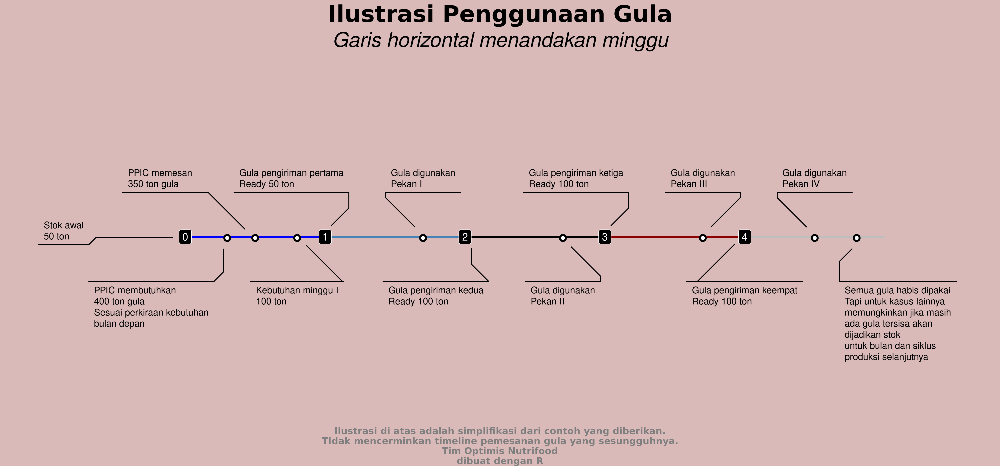

```{r setup, include=FALSE}
knitr::opts_chunk$set(echo = FALSE)
rm(list=ls())
```

# RENCANA KERJA

## Rencana Judul Thesis

### Rencana Judul Thesis

___Optimization and Computational Model for Supplier Selection and Raw-Material Composition: Case Study PT. NFI.___

## Target _Output_

### _Planned Output_

#### Penelitian Mandiri III

_Data collection_ dan dokumentasi _production system_.

#### Penelitian Mandiri IV

Model optimisasi yang telah disempurnakan.


# PENELITIAN MANDIRI III

## Masalah Optimisasi

### Masalah Optimisasi

Penentuan keputusan strategis dalam memilih _supplier_ bahan mentah dan menentukan banyaknya bahan mentah yang harus dibeli dari suatu pemasok agar total biaya pembelian seminim mungkin tetapi memenuhi kebutuhan yang ada.

### Kondisi yang Ada Saat Ini

Saat ini pemilihan _supplier_ dan penentuan kuantitas pembelian _raw material_ dilakukan secara manual dengan mempertimbangkan data-data terkait secara mingguan oleh departemen PPIC (_Production Planning and Inventory Control_). Namun jika ada perubahan _demand_ secara mendadak, proses terseut harus dihitung ulang.

Proses perhitungan ini memerlukan waktu yang cukup lama karena banyak faktor yang mempengaruhi.

### Rencana Kerja 

Model optimisasi ini kelak akan diimplementasikan pada departemen PPIC sehingga proses pemilihan supplier dan penentuan kuantitas pembelian _raw material_ bisa dilakukan secara cepat dan tepat. Diharapkan proses bisnis menjadi menjadi lebih efisien dan _cost_ yang ada bisa ditekan lebih baik lagi.

### _Output_ Lain dari Model Optimisasi

Bahasan dalam optimisasi dapat dikategorikan menjadi:

- Pemodelan masalah nyata menjadi masalah optimisasi.
- Pembahasan karakteristik dari masalah optimisasi dan keberadaan solusi dari masalah optimisasi tersebut.
- Pengembangan dan penggunaan algoritma serta analisis numerik untuk mencari solusi dari masalah tersebut.

## Dokumentasi _Production System_

### Rangkaian Produksi

Dalam rangkaian produksi, __NFI__ menggunakan banyak sekali bahan baku. Namun ada beberapa bahan baku utama yang paling sering digunakan. 

Selama ini __NFI__ memesan bahan-bahan baku tersebut secara __langsung tiap bulannya__ dengan besarnya pemesanan disesuaikan dengan:

1. Angka _demand_ atau _forecast_ masing-masing produk yang menggunakan bahan-bahan baku tersebut.
1. _Existing stock_ bahan baku yang ada di gudang bahan baku.
1. _Minimum order_ per jenis bahan baku yang ditetapkan _supplier_.

### Informasi Terkait Pengiriman Bahan Baku {.allowframebreaks}

Pengiriman bahan baku oleh para _supplier_ dilakukan sebanyak __4__ kali dalam sebulan dengan jumlah  sesuai dengan aturan berikut:

- Banyaknya bahan baku pada __pengiriman pertama__ disesuaikan dengan __stok__ ___existing___ dan ___demand___ produk terkait bahan baku tersebut pada minggu I.
- Sedangkan bahan baku gula pada __pengiriman kedua hingga keempat__ dibuat proporsional.

### Ilustrasi Pengiriman Bahan Baku

Contoh pada suatu bulan tertentu:

- Kebutuhan bahan baku diperkirakan sebesar __400 ton__.
- Stok _existing_ bahan baku di gudang bahan baku ada __50 ton__.
- Maka __NFI__ perlu memesan bahan baku sebesar __350 ton__.
- Pengiriman dilakukan __4 kali__.
    - Pada minggu I, diperkirakan kebutuhan bahan baku ada sebesar __100 ton__. Oleh karena itu, __pengiriman pertama__ adalah sebesar __50 ton__ saja.
    - Pada minggu II, III, dan IV pengiriman gula adalah proporsional sebesar __100 ton__.

Oleh karena itu, kelak pada model matematika perlu ada _constraints_ terkait hal ini.

### Ilustrasi Pengiriman Bahan Baku: Gula

```{r out.width="75%",echo=FALSE,fig.cap="Simplifikasi dari Penggunaan Bahan Baku"}

```

# PENELITIAN MANDIRI IV

## Model Optimisasi

### ___Known Parameter___ {.allowframebreaks}

Langkah pertama yang bisa dilakukan untuk membuat model optimisasi adalah menghitung dan mencari parameter-parameter terkait. Dari _update_ pada penelitian mandiri di atas, kita bisa lihat:

- $I$ sebagai himpunan semua jenis bahan baku.

- $K$ sebagai himpunan semua minggu yang ada dalam rentang masalah.

- $J$ sebagai himpunan semua produk yang menggunakan bahan baku.

- _Existing stock_ per bahan baku $i$ pada awal minggu ke 1. Misalkan saya tulis sebagai berikut:

$$S_{i} \geq 0, \text{untuk } i \in I$$

- _Demand_ bahan baku $i$ pada awal minggu ke 1. Misalkan saya tulis sebagai berikut:

$$D_{i} \geq 0, \text{ untuk } i \in I$$


# _REFERENCES_ {.allowframebreaks}