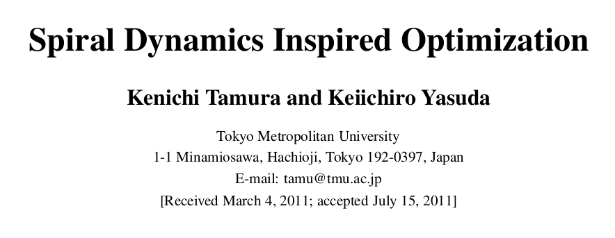
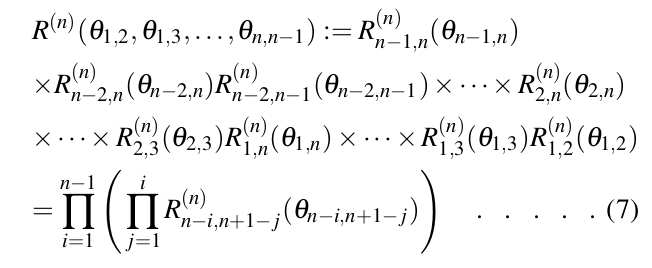
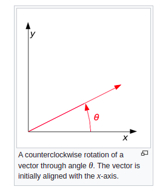
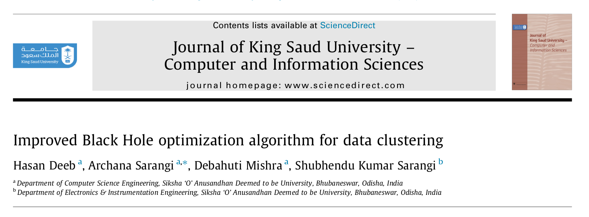

```{r setup, include=FALSE}
knitr::opts_chunk$set(echo = FALSE)
rm(list=ls())
```

# _LITERATURE REVIEW_

## Paper I 

### Metode Eksak

Pada penelitian mandiri I, pada _literature review_ [@lieberman] saya mendapatkan beberapa informasi sebagai berikut:

- Metode _simplex_ adalah metode eksak yang digunakan untuk menyelesaikan _linear programming_. Solusi yang dihasilkan merupakan bilangan _real_ atau kontinu. 
- Pada _MILP_, variabel yang terlibat sangat beragam (_integer_, _binary_, dan kontinu). Membulatkan bilangan solusi _linear programming_ untuk mendapatkan solusi _integer_ atau _binary_ dari suatu masalah _MILP_ tidak menjamin keoptimalan tercapai.

Oleh karena itu, perlu pendekatan tertentu dari _linear programming_ agar hasilnya bisa digunakan di _MILP_. Salah satu pendekatan yang bisa dilakukan adalah melakukan _constraint relaxation_ [@benoit].

### Metode _Meta Heuristic_: SOA untuk MINLP

```{r out.width="50%",echo=FALSE,fig.align="center"}
knitr::include_graphics("literatur 1.png")
```

[@kun]

### _Key Take Points_ {.allowframebreaks}

Salah satu trik yang bisa dilakukan agar SOA bisa menyelesaikan _mixed integer programming_ adalah dengan mengubah _constrained optimization problem_ menjadi _unconstrained optimization problem_ kemudian memanfaatkan _penalty constant_.

Misal suatu permasalahan MILP atau MINLP bisa ditulis secara umum sebagai berikut:

$$\min_{x \in \mathbb{R}^n} f(x)$$

$$\text{subject to: } g_i(x) = 0, i = 1,2,..,M$$

$$\text{and } h_j(x) \leq 0,i = 1,2,..,N$$

$$x = (x_1,x_2,...,x_n)^T \in \mathbb{N}$$

Bentuk di atas bisa kita ubah menjadi:

$$F(x,\alpha,\beta) = f(x) + \sum_{i=1}^M \alpha_i g_i^2(x) + \sum_{j = 1}^N \beta_j (\max{(h_i(x),0)})^2$$

dimana $\alpha,\beta$ merupakan _penalty constant_ yang bisa dibuat sangat besar.

### Permasalahan yang Ditemui pada Paper Ini

SOA relatif mudah untuk dituliskan dalam bentuk algoritma bahasa pemrograman manapun. Tapi ada satu hal yang bisa menjadi batu ganjalan dalam menuliskan algoritmanya. Apa itu? Yaitu pendefinisian matriks rotasi untuk masalah dengan n-dimensi.

Bentuk umum dari matriks rotasi adalah sebagai berikut:

$$R^{(n)} (\theta_{1,2},\theta_{1,3},..,\theta_{n,n-1}) = \prod_{i=1}^{n-1} \left ( \prod_{j=1}^i R^{(n)}_{n-i,n+1-j} (\theta_{n-i,n+1-j}) \right )$$

Apakah ini _cross product_ atau _dot product_?

## Paper II

### SOA

```{r out.width="50%",echo=FALSE,fig.align="center"}

```

[@tamura]

### _Rotation in_ $n-$ _Dimensional Space_

Informasi yang bisa diambil adalah sebagai berikut:

```{r out.width="50%",echo=FALSE,fig.align="center"}

```

### Aljabar Linear: Rotasi pada 2 Dimensi

```{r out.width="30%",echo=FALSE,fig.align="center"}

```

__Rotasi tidak mengubah norm vektor__.

### Konsekuensi

$$R^{(n)} (\theta_{1,2},\theta_{1,3},..,\theta_{n,n-1}) = \prod_{i=1}^{n-1} \left ( \prod_{j=1}^i R^{(n)}_{n-i,n+1-j} (\theta_{n-i,n+1-j}) \right )$$

Menghasilkan matriks rotasi yang tidak mengubah norm vektor.

### _Key Take Points_ {.allowframebreaks}

Pada rotasi pada 3-dimensi, saya temukan bahwa:

$$R^{(3)} = R23 \times R13 \times R12$$

Merupakan matriks yang _preserve norm vector_.

Sedangkan matriks $R^{(3)} = R23 . R13 . R12$ tidak memberikan rotasi tapi hanya memberikan kontraksi.

## Paper III

### Improved Black Hole Optimization Algorithm

```{r out.width="50%",echo=FALSE,fig.align="center"}

```

[@kingsaud]


# _REFERENCES_ {.allowframebreaks}