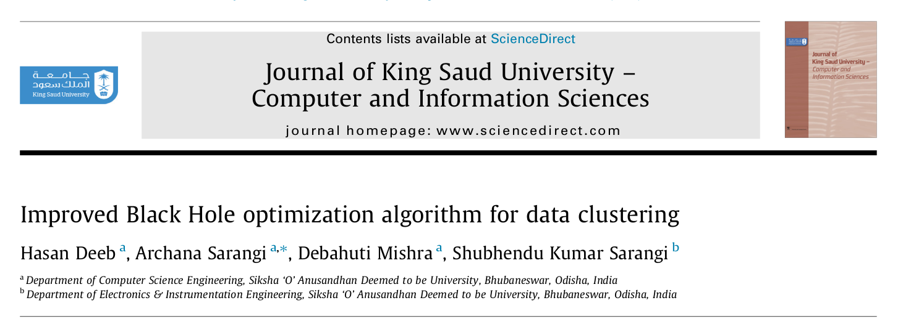

```{r setup, include=FALSE}
knitr::opts_chunk$set(echo = FALSE)
rm(list=ls())
```

# PENDAHULUAN

### Pendahuluan {.allowframebreaks}

Semenjak diperkenalkan pertama kali pada tahun 1982, _Supply Chain Management_ memegang peranan penting dalam manufaktur sebagai suatu sistem produksi terintegrasi [@webber]. Di dalam SCM, bahan baku dibeli perusahaan dari berbagai _supplier_, dibuat ke dalam suatu produk yang kemudian akan dijual ke pelanggan melalui berbagai _channel_ distribusi.

Dalam mengarungi kompetisi, perusahaan perlu memahami dua faktor kunci, yakni _cost reduction_ dan _product quality_ [@masood]. Kedua faktor ini sangat bergantung pada pemilihan _supplier_ yang tepat. Sehingga proses _supplier selection_ menjadi proses yang krusial dalam setiap perusahaan.

Perusahaan bisa menggunakan dua strategi terkait _supplier selection_, yakni: _single sourcing_ dan _multiple sourcing_. _Single sourcing_ berarti perusahaan hanya membeli bahan baku dari _supplier_ tunggal. Sedangkan _multiple sourcing_ berarti perusahaan bisa membeli bahan baku dari beberapa _supplier_. Strategi _single sourcing_ bisa menaikkan level risiko dari perusahaan sedangkan strategi _multiple sourcing_ menyebabkan _initial cost_ dan _ongoing cost_ yang lebih besar [@sourcing].

Bagi perusahaan yang menerapkan strategi _multiple sourcing_, banyak faktor yang akan membuat kompleks pengambilan keputusan. Misalnya harga, perjanjian transaksi, kualitas, kuantitas, jarak dan biaya pengantaran [@masood].

Ada berbagai penelitian yang dilakukan terkait SCM dan optimisasi dalam hal _supplier selection_. Hasan, Shohag, Azeem, dan Paul (2015) melakukan pendekatan _fuzzy model_ menggunakan 10 _input variables_ berupa kriteria-kriteria penilaian _supplier_ kemudian menggunakan _tools_ __MATLAB__ ___fuzzy tool box___ untuk mengevaluasi kinerja _supplier_ agar _profitability_ perusahaan tetap terjaga [@hasan]. 

Pada penelitian ini, kita akan menggunakan studi kasus dari suatu perusahaan manufaktur yang bergerak di bidang makanan dan minuman. Tujuan penelitian ini adalah untuk membuat model optimisasi untuk menyelesaikan tidak hanya _supplier selection_ namun juga sampai level _raw material selection_ dalam setiap periode waktu tertentu. Beberapa penelitian yang terkait dengan topik ini antara lain: 

- Penelitian __TU Delft__ yang dilakukan pada studi kasus perusahaan minyak di China menggunakan _framework Best-Worst Model_ (BWM) untuk menentukan indikator penting untuk memilih _raw material_ dan _supplier_ terbaik [@nispelling].
- Model _supplier selection and order allocation_ berbasis _fuzzy extended analytic hierarchy process_ yang dikombinasikan dengan _multiobjective dynamic linear programming_ dibuat untuk mencari nilai yang optimal untuk pembelian _raw material_ [@zhi].
- Bani dan Jafari (2016) menawarkan suatu model optimisasi untuk menyelesaikan _supplier selection_ dengan kondisi _multiple sourcing_, _multiple criteria_, dan batasan kapasitas. Model ini memiliki cakupan luas karena sudah mempertimbangkan kriteria-kriteria kunci per _raw material_ dan _supplier_. Kemudian model tersebut diselesaikan dengan dua pendekatan, yakni algoritma genetika dan _invasive weed optimization_ [@bani].

Penelitian kali ini menawarkan suatu model komputasi yang bisa digunakan untuk menyelesaikan permasalahan optimisasi pemilihan _raw material_ dan _supplier selection_ dengan _input_ berupa:

1. _Demand_ dari 130 SKU produk jadi dan dalam periode waktu tertentu.
1. Komposisi _raw material_ yang dibutuhkan untuk memproduksi satu unit SKU produk jadi.
1. Data spesifikasi _supplier_ (terkait harga, minimal kuantitas pembelian, kualitas _raw material_, dan waktu pengiriman).

# LATAR BELAKANG

### Topik Permasalahan

__PT. NFI__ adalah salah satu perusahaan _fast moving consumer goods_ (_FMCG_) di Indonesia yang bergerak di bidang makanan dan minuman. Sejak 40 tahun, __NFI__ menawarkan berbagai jenis produk makanan dan minuman sehat kepada masyarakat Indonesia.

Untuk menjalankan produksinya, __NFI__ memiliki tiga _plants_ yang memproduksi produk-produk yang sama (tidak ada perbedaan produk antar _plant_).

Salah satu jenis produk yang menjadi _backbone_ adalah minuman serbuk.

### Topik Permasalahan (lanjutan)

Saat ini, ada 130 SKU minuman serbuk yang diproduksi. Beberapa SKU masuk ke dalam kategori _high demand_ sedangkan beberapa lainnya masuk ke dalam kategori _medium demand_ dan _low demand_.

Salah satu strategi perencanaan yang baik adalah menyelaraskan antara _production_ dan _demand_.

Topik yang diangkat dalam penelitian ini adalah upaya pencegahan ___loss sales___.

### Topik Permasalahan (lanjutan)

```{r out.width="75%",echo=FALSE,fig.align='center'}
nomnoml::nomnoml("#direction: down,
                 [Plan] -> [Realita]
                 
                 [Plan|
                    [Production vs Demand]
                    ]
                    
                 [Realita|
                    [Prod > Demand] -> [Overstock]
                    [Prod = Demand] -> [Ideal]
                    [Prod < Demand] -> [Loss Sales]
                    ]
                 ")
```

### Topik Permasalahan (lanjutan)

Apa penyebab $production < demand$ ?

Ada beberapa kemungkinan:

1. Ketiadaan _raw material_.
1. _Production downtime_.
1. Perubahan _demand_ mendadak.

Di antara ketiga kemungkinan tersebut, kemungkinan pertama __berada pada kontrol kita__ jika direncanakan dengan baik.

### Topik Permasalahan (lanjutan)

Masing-masing produk minuman tersebut memiliki __resep__ yang _unique_, namun ada beberapa komponen _raw material_ digunakan oleh __keseluruhan produk__.

NFI juga menerapkan prinsip ___multi supplier___ untuk menjaga keamanan pasokan dan ketersediaan _raw material_. Akibatnya masing-masing _supplier_ memiliki perbedaan dalam hal:

1. Harga,
1. Minimum order,
1. Durasi pengiriman.
1. Kualitas _raw material_.

### Topik Permasalahan (lanjutan)

__Masalah Optimisasi__

Setelah dilakukan _review_ menyeluruh terhadap prosedur dan tata cara perhitungan serta pemesanan _raw material_, disimpulkan bahwa __ada masalah optimisasi__ yang dihadapi.

Kenapa?

Kuantitas _raw material_ yang hendak dibeli harus disesuaikan dengan:

- Stok existing (sedang dipakai dan belum dipakai),
- Kapasitas gudang bahan baku,
- Demand produk,
- Kapasitas produksi harian,
- Faktor _supplier_ (harga, _min order_, dan durasi pengiriman).
- Kualitas _raw material_.

Secara _bussiness value_, masalah ini perlu diselesaikan dengan baik.

### Rencana Judul Thesis

___Optimization and Computational Model for Supplier Selection and Raw-Material Composition: Case Study PT. NFI.___

# RENCANA KERJA

### _Planned Output_

#### Penelitian Mandiri III

_Data collection_ dan dokumentasi _production system_.

#### Penelitian Mandiri IV

Model optimisasi yang telah disempurnakan.

# _LITERATURE REVIEW_

## Paper I 

### Metode Eksak

Pada penelitian mandiri I, pada _literature review_ [@lieberman] saya mendapatkan beberapa informasi sebagai berikut:

- Metode _simplex_ adalah metode eksak yang digunakan untuk menyelesaikan _linear programming_. Solusi yang dihasilkan merupakan bilangan _real_ atau kontinu. 
- Pada _MILP_, variabel yang terlibat sangat beragam (_integer_, _binary_, dan kontinu). Membulatkan bilangan solusi _linear programming_ untuk mendapatkan solusi _integer_ atau _binary_ dari suatu masalah _MILP_ tidak menjamin keoptimalan tercapai.

Oleh karena itu, perlu pendekatan tertentu dari _linear programming_ agar hasilnya bisa digunakan di _MILP_. Salah satu pendekatan yang bisa dilakukan adalah melakukan _constraint relaxation_ [@benoit].

### Metode _Meta Heuristic_: SOA untuk MINLP

```{r out.width="50%",echo=FALSE,fig.align="center"}

```

[@kun]

### _Key Take Points_ {.allowframebreaks}

Salah satu trik yang bisa dilakukan agar SOA bisa menyelesaikan _mixed integer programming_ adalah dengan mengubah _constrained optimization problem_ menjadi _unconstrained optimization problem_ kemudian memanfaatkan _penalty constant_.

Misal suatu permasalahan MILP atau MINLP bisa ditulis secara umum sebagai berikut:

$$\min_{x \in \mathbb{R}^n} f(x)$$

$$\text{subject to: } g_i(x) = 0, i = 1,2,..,M$$

$$\text{and } h_j(x) \leq 0,i = 1,2,..,N$$

$$x = (x_1,x_2,...,x_n)^T \in \mathbb{N}$$

Bentuk di atas bisa kita ubah menjadi:

$$F(x,\alpha,\beta) = f(x) + \sum_{i=1}^M \alpha_i g_i^2(x) + \sum_{j = 1}^N \beta_j (\max{(h_i(x),0)})^2$$

dimana $\alpha,\beta$ merupakan _penalty constant_ yang bisa dibuat sangat besar.

### Permasalahan yang Ditemui pada Paper Ini

SOA relatif mudah untuk dituliskan dalam bentuk algoritma bahasa pemrograman manapun. Tapi ada satu hal yang bisa menjadi batu ganjalan dalam menuliskan algoritmanya. Apa itu? Yaitu pendefinisian matriks rotasi untuk masalah dengan n-dimensi.

Bentuk umum dari matriks rotasi adalah sebagai berikut:

$$R^{(n)} (\theta_{1,2},\theta_{1,3},..,\theta_{n,n-1}) = \prod_{i=1}^{n-1} \left ( \prod_{j=1}^i R^{(n)}_{n-i,n+1-j} (\theta_{n-i,n+1-j}) \right )$$

Apakah ini _cross product_ atau _dot product_?

## Paper II

### SOA

```{r out.width="50%",echo=FALSE,fig.align="center"}
knitr::include_graphics("literatur 2.png")
```

[@tamura]

### _Rotation in_ $n-$ _Dimensional Space_

Informasi yang bisa diambil adalah sebagai berikut:

```{r out.width="50%",echo=FALSE,fig.align="center"}

```

### Aljabar Linear: Rotasi pada 2 Dimensi

```{r out.width="30%",echo=FALSE,fig.align="center"}
knitr::include_graphics("rotasi 2d.png")
```

__Rotasi tidak mengubah norm vektor__.

### Konsekuensi

$$R^{(n)} (\theta_{1,2},\theta_{1,3},..,\theta_{n,n-1}) = \prod_{i=1}^{n-1} \left ( \prod_{j=1}^i R^{(n)}_{n-i,n+1-j} (\theta_{n-i,n+1-j}) \right )$$

Menghasilkan matriks rotasi yang tidak mengubah norm vektor.

### _Key Take Points_ {.allowframebreaks}

Pada rotasi pada 3-dimensi, saya temukan bahwa:

$$R^{(3)} = R23 \times R13 \times R12$$

Merupakan matriks yang _preserve norm vector_.

Sedangkan matriks $R^{(3)} = R23 . R13 . R12$ tidak memberikan rotasi tapi hanya memberikan kontraksi.

## Paper III

### Improved Black Hole Optimization Algorithm

```{r out.width="50%",echo=FALSE,fig.align="center"}

```

[@kingsaud]

# PENELITIAN MANDIRI III

## Masalah Optimisasi

### Masalah Optimisasi

Penentuan keputusan strategis dalam memilih _supplier_ bahan mentah dan menentukan banyaknya bahan mentah yang harus dibeli dari suatu pemasok agar total biaya pembelian seminim mungkin tetapi memenuhi kebutuhan yang ada.

### Kondisi yang Ada Saat Ini

Saat ini pemilihan _supplier_ dan penentuan kuantitas pembelian _raw material_ dilakukan secara manual dengan mempertimbangkan data-data terkait secara mingguan oleh departemen PPIC (_Production Planning and Inventory Control_). Namun jika ada perubahan _demand_ secara mendadak, proses terseut harus dihitung ulang.

Proses perhitungan ini memerlukan waktu yang cukup lama karena banyak faktor yang mempengaruhi.

### Rencana Kerja 

Model optimisasi ini kelak akan diimplementasikan pada departemen PPIC sehingga proses pemilihan supplier dan penentuan kuantitas pembelian _raw material_ bisa dilakukan secara cepat dan tepat. Diharapkan proses bisnis menjadi menjadi lebih efisien dan _cost_ yang ada bisa ditekan lebih baik lagi.

### _Output_ Lain dari Model Optimisasi

Bahasan dalam optimisasi dapat dikategorikan menjadi:

- Pemodelan masalah nyata menjadi masalah optimisasi.
- Pembahasan karakteristik dari masalah optimisasi dan keberadaan solusi dari masalah optimisasi tersebut.
- Pengembangan dan penggunaan algoritma serta analisis numerik untuk mencari solusi dari masalah tersebut.

## Dokumentasi _Production System_

### Rangkaian Produksi

Dalam rangkaian produksi, __NFI__ menggunakan banyak sekali bahan baku. Namun ada beberapa bahan baku utama yang paling sering digunakan. 

Selama ini __NFI__ memesan bahan-bahan baku tersebut secara __langsung tiap bulannya__ dengan besarnya pemesanan disesuaikan dengan:

1. Angka _demand_ atau _forecast_ masing-masing produk yang menggunakan bahan-bahan baku tersebut.
1. _Existing stock_ bahan baku yang ada di gudang bahan baku.
1. _Minimum order_ per jenis bahan baku yang ditetapkan _supplier_.

### Informasi Terkait Pengiriman Bahan Baku {.allowframebreaks}

Pengiriman bahan baku oleh para _supplier_ dilakukan sebanyak __4__ kali dalam sebulan dengan jumlah  sesuai dengan aturan berikut:

- Banyaknya bahan baku pada __pengiriman pertama__ disesuaikan dengan __stok__ ___existing___ dan ___demand___ produk terkait bahan baku tersebut pada minggu I.
- Sedangkan bahan baku gula pada __pengiriman kedua hingga keempat__ dibuat proporsional.

### Ilustrasi Pengiriman Bahan Baku

Contoh pada suatu bulan tertentu:

- Kebutuhan bahan baku diperkirakan sebesar __400 ton__.
- Stok _existing_ bahan baku di gudang bahan baku ada __50 ton__.
- Maka __NFI__ perlu memesan bahan baku sebesar __350 ton__.
- Pengiriman dilakukan __4 kali__.
    - Pada minggu I, diperkirakan kebutuhan bahan baku ada sebesar __100 ton__. Oleh karena itu, __pengiriman pertama__ adalah sebesar __50 ton__ saja.
    - Pada minggu II, III, dan IV pengiriman gula adalah proporsional sebesar __100 ton__.

Oleh karena itu, kelak pada model matematika perlu ada _constraints_ terkait hal ini.

### Ilustrasi Pengiriman Bahan Baku: Gula

```{r out.width="75%",echo=FALSE,fig.cap="Simplifikasi dari Penggunaan Bahan Baku"}
knitr::include_graphics("ilustrasi.png")
```

# PENELITIAN MANDIRI IV

## Model Optimisasi

### ___Known Parameter___ {.allowframebreaks}

Langkah pertama yang bisa dilakukan untuk membuat model optimisasi adalah menghitung dan mencari parameter-parameter terkait. Dari _update_ pada penelitian mandiri di atas, kita bisa lihat:

- $I$ sebagai himpunan semua jenis bahan baku.

- $K$ sebagai himpunan semua minggu yang ada dalam rentang masalah.

- $J$ sebagai himpunan semua produk yang menggunakan bahan baku.

- _Existing stock_ per bahan baku $i$ pada awal minggu ke 1. Misalkan saya tulis sebagai berikut:

$$S_{i} \geq 0, \text{untuk } i \in I$$

- _Demand_ bahan baku $i$ pada awal minggu ke 1. Misalkan saya tulis sebagai berikut:

$$D_{i} \geq 0, \text{ untuk } i \in I$$


# _REFERENCES_ {.allowframebreaks}