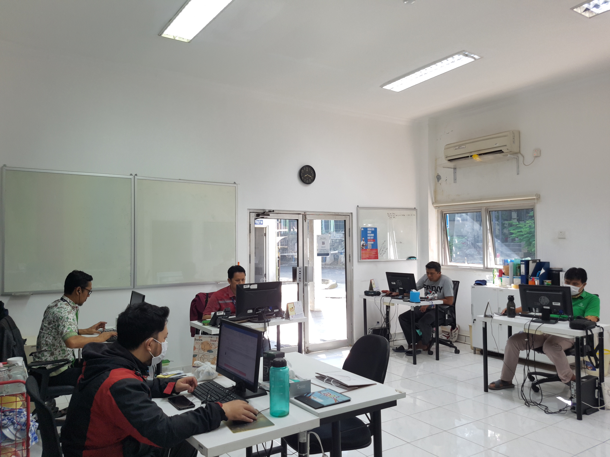
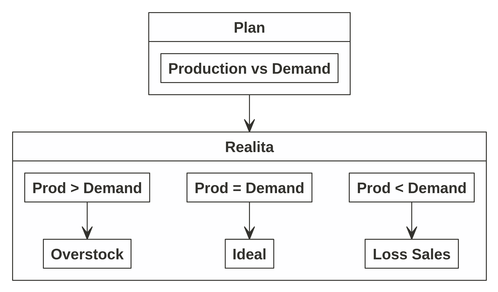
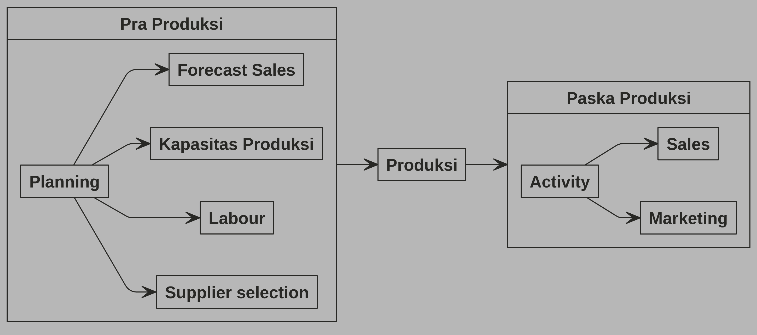
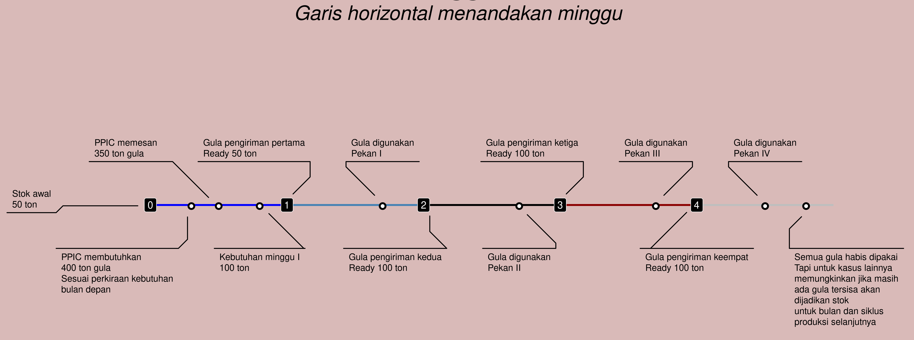

layout: true

<div class="my-footer"><span>Presentasi Proposal Thesis</span></div>

```{r setup, include=FALSE}
options(htmltools.dir.version = FALSE)
setwd("~/209_ITB/Thesis/Proposal Thesis/Present")
# reference:
# https://www.garrickadenbuie.com/blog/xaringan-tip-logo-all-slides/
```

---

class: middle hide

# TERIMA KASIH KEPADA

.pull-left[

# Para Dosen Pembimbing

## ITB

- Ibu Rieske Hadianti
- Bapak Saladin Uttunggadewa
- Ibu Sri Redjeki

Atas bimbingan dan kesabaran selama ini.

## Nutrifood

- Ibu Astri Kurniati

Atas izin yang diberikan untuk mengikuti perkuliahan.

]

.pull-right[

# Dosen Penguji

- Ibu Novry Erwina

Atas waktu dan kesediaannya.

# Kaprodi Sains Komputasi

- Bapak Dwi Irwanto

Atas bantuan dan informasi yang diberikan.

]

---

class: middle

```{r,include=FALSE}
# perkenalkan, saya ....

# mahasiswa mbr prodi sains komputasi angkatan 2021

# saat ini saya juga bekerja di pt nutrifood indonesia, sebuah perusahaan yang bergerak
# di bidang makanan minuman 

# berbeda dengan rekan-rekan mbr yang lain, mereka berasal dari brin sedangkan saya berasal dari swasta
```

.pull-left[

# PERKENALAN

## Mohammad Rizka Fadhli

Mahasiswa pasca sarjana program __MBR__ Prodi Sains Komputasi 2021.

_Market Research Specialist_ di PT. Nutrifood Indonesia.

]

.pull-right[

```{r out.width="60%",echo=FALSE,fig.align='center'}
knitr::include_graphics("logo nutrifood.png")
```

]

---

class: middle,center,inverse

# AGENDA HARI INI
## Penjelasan Mengenai Permasalahan yang Dibahas pada _Thesis_

### Pengembangan _Decision Support System_ untuk Menyelesaikan Masalah Optimisasi pada Pemilihan dan Penentuan Komposisi Bahan Baku untuk Multi-Produk, Multi-Periode, Multi-Supplier, serta Kontrak Pembelian Minimum Selama Satu Tahun

---

class: middle,center

# PENDAHULUAN

---

class: middle

.pull-left[

# PENDAHULUAN
## Latar Belakang

PT. Nutrifood Indonesia (NFI) bergerak di industri makanan dan minuman yang menawarkan berbagai macam jenis produk makanan dan minuman sehat kepada masyarakat, mulai dari _cookies_ hingga minuman serbuk. Untuk menjalankan produksinya, PT. NFI memiliki tiga _plants_ yang memproduksi produk-produk yang sama (tidak ada perbedaan produk antar _plant_).

Salah satu jenis produk yang menjadi _backbone_ adalah minuman serbuk.

]

.pull-right[

```{r out.width="60%",echo=FALSE,fig.align='center'}
knitr::include_graphics("logo nutrifood.png")
```

]

---

class:middle

# PENDAHULUAN

## Latar Belakang

.pull-left[

### _Production Planning and Inventory Control_ (PPIC)

Secara garis besar, pelaksanaan _supply chain management_ (SCM) dilakukan oleh PPIC. 

Departemen PPIC bertugas untuk melakukan perencanaan produksi ketiga _plants_ tersebut. Perencanaan ini juga termasuk tahap:

1. Perencanaan pembelian bahan baku dan bahan kemas.
1. Perencanaan produksi masing-masing SKU produk di _plant_ tertentu.
1. Perencanaan stok _finished goods_ di masing-masing gudang.

> Semua tahap pekerjaan dan pengambilan keputusan saat ini masih dilakukan secara manual dan berdasarkan _best practice_ serta pengalaman _team member_.

]

.pull-right[

```{r,echo=FALSE,fig.align='center'}

```

]

---

class: middle

# PENDAHULUAN

## Latar Belakang

.pull-left[

Padahal salah satu strategi perencanaan yang baik adalah menyelaraskan antara _production_ dan _demand_.

```{r out.width="50%",echo=FALSE,fig.align='center',fig.retina=7}

```

Upaya pencegahan ___loss sales___ menjadi hal yang paling penting.

]

--

.pull-right[

## Apa penyebab $production < demand$ ?

Ada beberapa kemungkinan:

1. Ketiadaan bahan baku.
1. _Production downtime_.
1. Perubahan _demand_ mendadak.

Di antara ketiga kemungkinan tersebut, kemungkinan pertama seharusnya __berada pada kontrol kita__ jika direncanakan dengan baik.

]

--

### Bagaimana melakukan perencanaan pengadaan / pembelian bahan baku yang __baik__?

---

class: middle

```{r, load_refs, include=FALSE, cache=FALSE}
library(RefManageR)
BibOptions(check.entries = FALSE,
           bib.style = "authoryear",
           style = "markdown",
           hyperlink = FALSE,
           dashed = FALSE)
myBib <- ReadBib("./references.bib", check = FALSE)
```

# PENDAHULUAN

## Apa itu SCM?

.pull-left[

Semenjak diperkenalkan pertama kali, SCM memegang peranan penting dalam manufaktur sebagai suatu sistem produksi terintegrasi `r Citep(myBib, "webber")`. Di dalam SCM, bahan baku dibeli perusahaan dari berbagai _supplier_, dibuat ke dalam suatu produk yang kemudian akan dijual ke pelanggan melalui berbagai _channel_ distribusi.

Dalam mengarungi kompetisi perusahaan perlu memahami dua faktor kunci, yakni _cost reduction_ dan _product quality_ `r Citep(myBib, "masood")`. Kedua faktor ini sangat bergantung pada pemilihan _supplier_ yang tepat. Sehingga proses _supplier selection_ menjadi proses yang krusial dalam setiap perusahaan.

]

--

.pull-right[

Dalam prakteknya, perusahaan bisa menggunakan dua strategi terkait _supplier selection_, yakni:

- _Single sourcing_ berarti perusahaan hanya membeli bahan baku dari _supplier_ tunggal. 
- _Multiple sourcing_ berarti perusahaan bisa membeli bahan baku dari beberapa _supplier_. 

Strategi _single sourcing_ bisa menaikkan level risiko dari perusahaan sedangkan strategi _multiple sourcing_ menyebabkan _initial cost_ dan _ongoing cost_ yang lebih besar `r Citep(myBib, "sourcing")`. 

Bagi perusahaan yang menerapkan strategi _multiple sourcing_, banyak faktor yang akan membuat kompleks pengambilan keputusan. Misalnya harga, perjanjian transaksi, kualitas, kuantitas, jarak dan biaya pengantaran.

]

---

class: middle

# PENDAHULUAN
## Masalah

NFI memproduksi $130$ jenis minuman serbuk. Masing-masing produk minuman tersebut memiliki __resep__ yang _unique_, namun ada satu komponen bahan baku yang bisa digunakan oleh __keseluruhan produk__ tersebut.

Untuk pemenuhan bahan baku tersebut, NFI menggunakan prinsip _multiple sourcing_ dengan perjanjian untuk memasoknya dari enam buah _supplier_. Perjanjian kerja sama antar _supplier_ berupa komitmen pembelian sejumlah bahan baku selama setahun ke depan. Spesifikasi bahan baku dan harganya per-ton berbeda-beda antar _supplier_. 

Semua produk minuman tersebut bisa dibagi menjadi dua kelompok, yakni:

1. Minuman yang hanya bisa diproduksi oleh satu jenis bahan baku.
1. Minuman yang bisa diproduksi menggunakan dua atau lebih jenis bahan baku.

--

### Kenapa bisa begitu?

---

class: middle

# MASALAH

## Kondisi Saat Ini

NFI memilih _supplier_ dan menentukan kuantitas pembelian bahan baku secara __manual__ dengan mempertimbangkan data-data terkait secara mingguan oleh departemen PPIC. Namun proses tersebut belum sampai ke dalam tahap mengalokasikan bahan baku yang dibeli tersebut dengan produk yang akan diproduksi kelak sehingga berpotensi menimbulkan _loss sales_ akibat ketiadaan bahan baku saat produksi. Selain itu, proses perhitungan ini memerlukan __waktu yang cukup lama__.

## Masalah Utama _Thesis_

Pada _thesis_ ini, ada tiga masalah utama yang hendak diselesaikan, yakni:

- Memilih _supplier_ bahan baku.
- Menentukan banyaknya bahan baku yang harus dibeli dari suatu _supplier_.
- Menentukan bahan baku mana yang harus digunakan untuk memproduksi setiap produk.

dengan tujuan total biaya pembelian seminim mungkin tetapi memenuhi kebutuhan yang ada pada periode tertentu. 

Kemudian akan dibuat suatu _decision support system_ agar memudahkan proses pekerjaan PPIC.

---

class: middle,center,inverse

# JUDUL THESIS

### Pengembangan _Decision Support System_ untuk Menyelesaikan Masalah Optimisasi pada Pemilihan dan Penentuan Komposisi Bahan Baku untuk Multi-Produk, Multi-Periode, Multi-Supplier, serta Kontrak Pembelian Minimum Selama Satu Tahun

--

# LUARAN THESIS

--

## Model Optimisasi

--

## _Decision Support System_

---

class: middle,center

# MODEL OPTIMISASI

---

class: middle

# MODEL OPTIMISASI

## Masalah Optimisasi

Meminimalkan ongkos pembelian bahan baku dengan tetap mengamankan stok bahan baku agar proses produksi tetap berjalan.

Masalah ini termasuk ke dalam _mixed integer linear programming_ (__MILP__), alasannya:

1. Parameter dan variabel yang terlibat merupakan suatu nilai pasti.
1. Variabel yang terlibat meliputi:
    - _Binary_ karena melibatkan pengambilan keputusan bahan baku dari _supplier_ mana yang harus dipesan.
    - _Integer_ karena melibatkan angka kuantitas bahan baku yang harus dipesan. 
1. Fungsi _objective_ dan _constraints_ masih berupa _linear_.
    - Meminimumkan ongkos pembelian $harga \times tonase$.
    - Kapasitas gudang bahan baku dan rencana produksi produk.
    - Kontrak pembelian selama setahun.
    - dan seterusnya.

---

class: middle,center

# MODEL OPTIMISASI

## Rangkaian Produksi

```{r out.width="60%",echo=FALSE,warning=FALSE,message=FALSE,fig.align='center',fig.cap="Simplifikasi Rangkaian Produksi"}

```

---

class: middle

# MODEL OPTIMISASI

## Rangkaian Produksi

Proses pra produksi seperti _supplier selection_ dan penentuan kuantitas pembelian bahan baku dilakukan setiap bulan sekali, untuk merencanakan produksi di bulan depannya.

.pull-left[

Dalam rangkaian produksi suatu produk, __NFI__ menggunakan banyak sekali bahan baku tapi ada beberapa bahan baku utama yang paling sering digunakan di berbagai produknya. Selama ini __NFI__ memesan bahan-bahan baku tersebut secara langsung setiap bulannya dengan besarnya pemesanan disesuaikan dengan:

1. Angka _demand_ atau _forecast_ masing-masing produk yang menggunakan bahan-bahan baku tersebut.
1. _Existing stock_ bahan baku yang ada di gudang bahan baku.
1. _Minimum order_ per jenis bahan baku yang ditetapkan _supplier_.

]

.pull-right[

Pemesanan ini juga harus disesuaikan dengan _policy_ yang ada pada __SCM__, seperti:

1. Pembelian bahan baku harus berasal dari minimal 2 _suppliers_ untuk menjaga keamanan pasokan.
1. Pembelian bahan baku dari _supplier_ harus memenuhi proporsi portofolio yang ditetapkan di awal tahun oleh __NFI__. Angka ini kelak menjadi patokan berapa tonase minimal yang harus __NFI__ beli kepada masing-masing _supplier_ dalam setahun.

]

---

class: middle

# MODEL OPTIMISASI

## Informasi Terkait Pengiriman Bahan Baku 

Pengiriman bahan baku oleh para _supplier_ dilakukan sebanyak 4 kali dalam sebulan dengan jumlah sesuai dengan aturan berikut:

- Banyaknya bahan baku pada setiap pengiriman adalah fleksibel disesuaikan dengan __stok__ ___existing___ dan ___demand___ produk pada minggu tersebut.
- __Waktu pengiriman dan inspeksi__ adalah selama 17 hari setelah pemesanan bahan baku sampai akhirnya bahan baku tersebut dapat digunakan untuk produksi. 

Oleh karena itu, perencanaan pembelian bahan baku dilakukan setidaknya sebulan sebelum bahan baku tersebut akan digunakan.

---

class: middle

# MODEL OPTIMISASI

## Ilustrasi Pengiriman Bahan Baku

Contoh pada suatu bulan tertentu:

- Kebutuhan bahan baku diperkirakan sebesar __400 ton__.
- Stok _existing_ bahan baku di gudang bahan baku ada __50 ton__.
- Maka __NFI__ perlu memesan bahan baku sebesar __350 ton__.
- Pengiriman dilakukan __4 kali__.
    - Pada minggu I, diperkirakan kebutuhan bahan baku ada sebesar __100 ton__. Oleh karena itu, __pengiriman pertama__ adalah sebesar __50 ton__ saja.
    - Pada minggu II, III, dan IV pengiriman bahan baku akan disesuaikan dengan kebutuhan masing-masing (misalkan dibuat proporsional __100 ton__).

Oleh karena itu, kelak pada model optimisasi perlu ada _constraints_ terkait hal ini.

---

class: middle,center

```{r out.width="80%",echo=FALSE,fig.cap="Simplifikasi dari Penggunaan Bahan Baku",fig.align='center'}

```

---

# MODEL OPTIMISASI

## Informasi Terkait Jenis Bahan Baku 

Saat ini, ada __6__ jenis bahan baku yang bisa dipesan ke __6__ _supplier_ yang berbeda. Informasi lain yang perlu diketahui adalah:

- Terkait produk dan bahan baku:
    - Sebagian kecil dari produk hanya bisa diproduksi dengan __satu jenis bahan baku saja__.
    - Sebagian besar lainnya memungkinkan untuk diproduksi dengan __dua atau lebih jenis bahan baku__. Kebutuhan bahan baku untuk produk pada kelompok ini adalah sama. Ilustrasi sebagai berikut:
        - Produk minuman __A__ bisa diproduksi menggunakan bahan baku $x_1$ sebanyak 1 ton atau $x_2$ sebanyak 1 ton juga.
- Pembelian bahan baku harus memenuhi _minimum order_ yang ditetapkan oleh _supplier_ __tapi__ jika pembelian di atas _minimum order_ harus dilakukan __pembulatan__ (_order volume_ harus berupa _integer_). Misalkan:
    - _Minimum order_ adalah __10 ton__, maka:
        - Boleh membeli __11 ton__.
        - Tidak boleh membeli __10.5 ton__.
- Harga masing-masing jenis bahan baku berbeda. 
- Lama pengiriman hingga bahan baku siap digunakan untuk semua _supplier_ sama.

---
class:middle

## Ilustrasi Alur Pengadaan Bahan Baku

```{r out.width="85%",echo=FALSE,fig.cap="Simplifikasi dari Penggunaan Bahan Baku",fig.align='center'}
knitr::include_graphics("timeline.png")
```

---

class: middle

# MODEL OPTIMISASI

## Informasi Terkait Substitusi Bahan Baku

Menurut informasi dari _product research and development_, beberapa bahan baku bisa dijadikan substitusi bagi bahan baku yang lain. Hal ini diperbolehkan karena kesamaan karakteristik yang ada pada beberapa bahan baku tersebut. Satu-satunya perbedaan mendasar antar bahan baku adalah warna. Sedangkan derajat rasa dan ukuran partikel sudah disesuaikan dengan standar baku pangan yang ada.

---


---

# _REFERENCES_

```{r refs, echo=FALSE, results="asis"}
PrintBibliography(myBib)
```

---

class: middle,center,inverse

# Terima Kasih
## _Feel free to discuss_

_Find me at_ [ikanx101.com](https://ikanx101.com/)

##### _created using Xaringan in R_