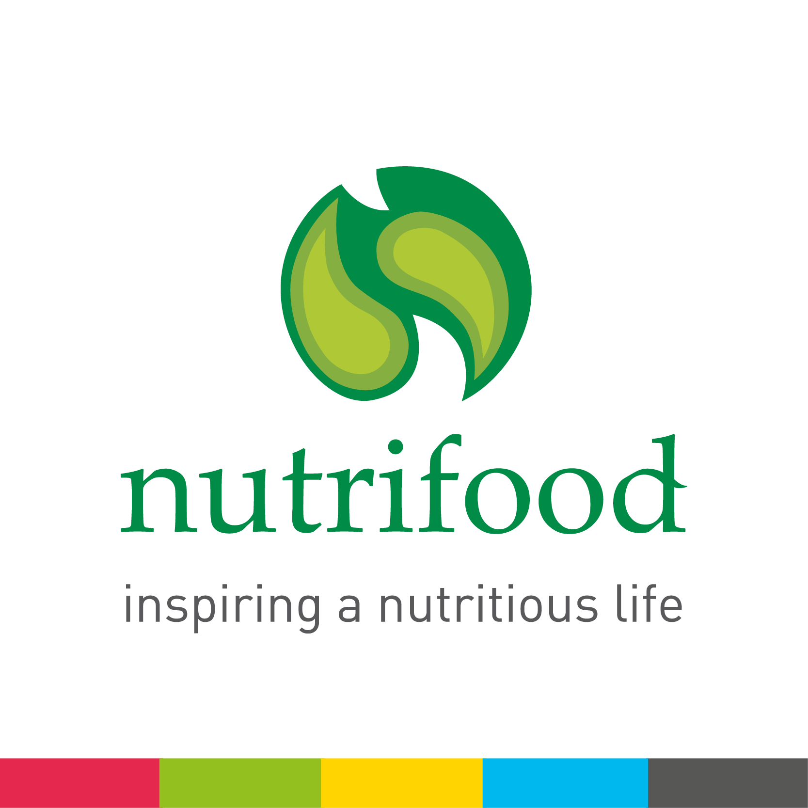

layout: true

<div class="my-footer"><span>Presentasi Proposal Thesis</span></div>

```{r setup, include=FALSE}
options(htmltools.dir.version = FALSE)
setwd("~/209_ITB/Thesis/Proposal Thesis/Present")
# reference:
# https://www.garrickadenbuie.com/blog/xaringan-tip-logo-all-slides/
```

---

class: middle hide

# TERIMA KASIH KEPADA

.pull-left[

# Para Dosen Pembimbing

## ITB

- Ibu Rieske Hadianti
- Bapak Saladin Uttunggadewa
- Ibu Sri Redjeki

Atas bimbingan dan kesabaran selama ini.

## Nutrifood

- Ibu Astri Kurniati

Atas izin yang diberikan untuk mengikuti perkuliahan.

]

.pull-right[

# Dosen Penguji

- Ibu Novry Erwina

Atas waktu dan kesediaannya.

# Kaprodi Sains Komputasi

- Bapak Dwi Irwanto

Atas bantuan dan informasi yang diberikan.

]

---

class: middle

```{r,include=FALSE}
# perkenalkan, saya ....

# mahasiswa mbr prodi sains komputasi angkatan 2021

# saat ini saya juga bekerja di pt nutrifood indonesia, sebuah perusahaan yang bergerak
# di bidang makanan minuman 

# berbeda dengan rekan-rekan mbr yang lain, mereka berasal dari brin sedangkan saya berasal dari swasta
```

.pull-left[

# PERKENALAN

## Mohammad Rizka Fadhli

Mahasiswa pasca sarjana program __MBR__ Prodi Sains Komputasi 2021.

_Market Research Specialist_ di PT. Nutrifood Indonesia.

]

.pull-right[

```{r out.width="60%",echo=FALSE,fig.align='center'}

```

]

---

class: middle,center,inverse

# AGENDA HARI INI
## Penjelasan Mengenai Permasalahan yang Dibahas pada _Thesis_

### Pengembangan _Decision Support System_ untuk Menyelesaikan Masalah Optimisasi pada Pemilihan dan Penentuan Komposisi Bahan Baku untuk Multi-Produk, Multi-Periode, Multi-Supplier, serta Kontrak Pembelian Minimum Selama Satu Tahun

---

class: middle,center

# PENDAHULUAN

---

class: middle

.pull-left[

# PENDAHULUAN
## Latar Belakang

PT. Nutrifood Indonesia (NFI) bergerak di industri makanan dan minuman yang menawarkan berbagai macam jenis produk makanan dan minuman sehat kepada masyarakat, mulai dari _cookies_ hingga minuman serbuk. Untuk menjalankan produksinya, PT. NFI memiliki tiga _plants_ yang memproduksi produk-produk yang sama (tidak ada perbedaan produk antar _plant_).

Salah satu jenis produk yang menjadi _backbone_ adalah minuman serbuk.

]

.pull-right[

```{r out.width="60%",echo=FALSE,fig.align='center'}

```

]

---

class: middle

.pull-left[

# PENDAHULUAN

## Latar Belakang

### _Production Planning and Inventory Control_ (PPIC)

Departemen PPIC bertugas untuk melakukan perencanaan produksi ketiga _plants_ tersebut. Perencanaan ini juga termasuk tahap:

1. Perencanaan pembelian bahan baku dan bahan kemas.
1. Perencanaan produksi masing-masing SKU produk di _plant_ tertentu.
1. Perencanaan stok _finished goods_ di masing-masing gudang.

Secara garis besar, pelaksanaan _supply chain management_ (SCM) dilakukan oleh PPIC.

> Semua tahap pekerjaan dan pengambilan keputusan saat ini masih dilakukan secara manual dan berdasarkan _best practice_ serta pengalaman _team member_.

]

.pull-right[

```{r out.width="60%",echo=FALSE,fig.align='center'}
#
print("Poto PPIC")
```

]

---

class: middle

# PENDAHULUAN

## Latar Belakang

.pull-left[

Padahal salah satu strategi perencanaan yang baik adalah menyelaraskan antara _production_ dan _demand_.

```{r out.width="50%",echo=FALSE,fig.align='center',fig.retina=7}
knitr::include_graphics("prodemand.png")
```

Topik yang diangkat dalam penelitian ini adalah upaya pencegahan ___loss sales___.

]

.pull-right[

> Apa penyebab $production < demand$ ?

Ada beberapa kemungkinan:

1. Ketiadaan _raw material_.
1. _Production downtime_.
1. Perubahan _demand_ mendadak.

Di antara ketiga kemungkinan tersebut, kemungkinan pertama seharusnya __berada pada kontrol kita__ jika direncanakan dengan baik.

]


---

class: middle

```{r, load_refs, include=FALSE, cache=FALSE}
library(RefManageR)
BibOptions(check.entries = FALSE,
           bib.style = "authoryear",
           style = "markdown",
           hyperlink = FALSE,
           dashed = FALSE)
myBib <- ReadBib("./references.bib", check = FALSE)
```

# PENDAHULUAN

## Apa itu SCM?

.pull-left[

Semenjak diperkenalkan pertama kali, SCM memegang peranan penting dalam manufaktur sebagai suatu sistem produksi terintegrasi `r Citep(myBib, "webber")`. Di dalam SCM, bahan baku dibeli perusahaan dari berbagai _supplier_, dibuat ke dalam suatu produk yang kemudian akan dijual ke pelanggan melalui berbagai _channel_ distribusi.

Dalam mengarungi kompetisi perusahaan perlu memahami dua faktor kunci, yakni _cost reduction_ dan _product quality_ `r Citep(myBib, "masood")`. Kedua faktor ini sangat bergantung pada pemilihan _supplier_ yang tepat. Sehingga proses _supplier selection_ menjadi proses yang krusial dalam setiap perusahaan.

]

.pull-right[

Dalam prakteknya, perusahaan bisa menggunakan dua strategi terkait _supplier selection_, yakni:

- _Single sourcing_ berarti perusahaan hanya membeli bahan baku dari _supplier_ tunggal. 
- _Multiple sourcing_ berarti perusahaan bisa membeli bahan baku dari beberapa _supplier_. 

Strategi _single sourcing_ bisa menaikkan level risiko dari perusahaan sedangkan strategi _multiple sourcing_ menyebabkan _initial cost_ dan _ongoing cost_ yang lebih besar `r Citep(myBib, "sourcing")`. 

Bagi perusahaan yang menerapkan strategi _multiple sourcing_, banyak faktor yang akan membuat kompleks pengambilan keputusan. Misalnya harga, perjanjian transaksi, kualitas, kuantitas, jarak dan biaya pengantaran.

]

---

class: middle

# PENDAHULUAN
## Masalah

.pull-left[

Saat ini, ada $130$ SKU minuman serbuk yang diproduksi. Masing-masing produk minuman tersebut memiliki __resep__ yang _unique_, namun ada satu komponen _raw material_ yang bisa digunakan oleh __keseluruhan produk__.

PT. XYZ juga menerapkan prinsip ___multi supplier___ untuk menjaga keamanan pasokan dan ketersediaan _raw material_. Akibatnya masing-masing _supplier_ memiliki perbedaan dalam hal:

1. Harga,
1. Minimum order,
1. Durasi pengiriman.
1. Kualitas _raw material_ per _supplier_.


]

.pull-right[


]


---

class: middle,center

# DASAR TEORI


---

# PENDAHULUAN
## _Deep Dive_ Masalah

.pull-left[


]
.pull-right[

```{r out.width="100%",echo=FALSE,fig.align='center'}
#knitr::include_graphics("images.jpeg")
```

]

---

# PENDAHULUAN
## _Deep Dive_ Masalah

.pull-left[

```{r,echo=FALSE,message=FALSE,warning=FALSE}
#knitr::include_graphics("images-1.jpeg")
```

]
.pull-right[

]

---

# PENDAHULUAN
## Masalah Optimisasi

.pull-left[

```{r,echo=FALSE,message=FALSE,warning=FALSE}
#knitr::include_graphics("optimize.png")
```

]

.pull-right[

Setelah dilakukan _review_ menyeluruh terhadap prosedur dan tata cara perhitungan serta pemesanan _raw material_, disimpulkan bahwa __ada masalah optimisasi__ yang dihadapi.

Kenapa?

Kuantitas _raw material_ yang hendak dibeli harus disesuaikan dengan:

- Stok existing (sedang dipakai dan belum dipakai),
- Demand produk,
- Faktor _supplier_ (harga, _min order_, dan durasi pengiriman).

Secara _bussiness value_, masalah ini perlu diselesaikan dengan baik.

__Catatan:__ Proses _review_ tersebut akan menjadi pembahasan tersendiri pada __Penelitian Mandiri II__.
]

---

class: middle,center

# _Conclusion_
## Rencana Judul Thesis

### Optimisasi Pembelian Raw Material Minuman Serbuk Menggunakan Metode XXX: Studi Kasus PT. XYZ.

__Catatan:__ Pencarian terhadap metode `XXX` yang hendak digunakan akan dibahas pada pertemuan selanjutnya.

---
class: middle,center

# _Conclusion_
## _Output_ Perkuliahan

Dokumentasi model-model optimisasi yang relevan dengan penelitian dan _computer codes_ dari metode optimisasi yang dipelajari.

---

# _References_

```{r refs, echo=FALSE, results="asis"}
PrintBibliography(myBib)
```

---

class: middle,center,inverse

# Terima Kasih
## _Feel free to discuss_

_Find me at_ [ikanx101.com](https://ikanx101.com/)

##### _created using Xaringan in R_