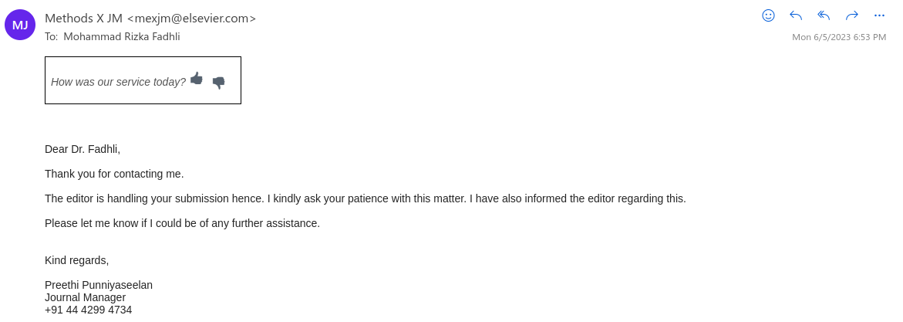
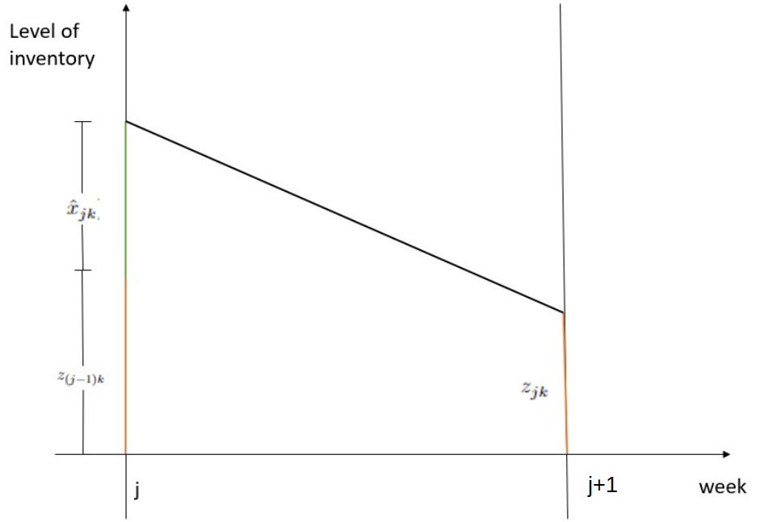

layout: true

<div class="my-footer"><span>Presentasi Tesis</span></div>

```{r setup, include=FALSE}
options(htmltools.dir.version = FALSE)
setwd("~/209_ITB/Thesis/Proposal Thesis/Thesis Final")
# reference:
# https://www.garrickadenbuie.com/blog/xaringan-tip-logo-all-slides/
```

---

class: middle

.pull-left[

# PERKENALAN

## Mohammad Rizka Fadhli

Mahasiswa pasca sarjana program __MBR__ Prodi Sains Komputasi 2021.

_Market Research Specialist_ di PT. Nutrifood Indonesia.

]

.pull-right[

```{r out.width="60%",echo=FALSE,fig.align='center'}

```

]

---

class: middle

# SEKILAS _UPDATE_ SUBMISI JURNAL

```{r out.width="80%",echo=FALSE,fig.align='center'}

```

---

class: middle,center,inverse

# AGENDA HARI INI
## Penjelasan Mengenai Luaran pada _Thesis_

### Pengembangan _Decision Support System_ untuk Menyelesaikan Masalah Optimisasi pada Pemilihan dan Penentuan Komposisi Bahan Baku untuk Multi-Produk, Multi-Periode, Multi-Supplier, serta Kontrak Pembelian Minimum Selama Satu Tahun

---

class: middle,center,inverse

# JUDUL THESIS

### Pengembangan _Decision Support System_ untuk Menyelesaikan Masalah Optimisasi pada Pemilihan dan Penentuan Komposisi Bahan Baku untuk Multi-Produk, Multi-Periode, Multi-Supplier, serta Kontrak Pembelian Minimum Selama Satu Tahun

--

# LUARAN THESIS

--

## Model Optimisasi

--

## _Decision Support System_

---

class: middle,center

# _QUICK RECAP_

### Sebelum masuk ke pembahasan utama

---

class: middle

# _QUICK RECAP_
## Masalah

NFI memproduksi beberapa jenis minuman serbuk. Masing-masing produk minuman tersebut memiliki __resep__ yang _unique_, namun ada satu komponen bahan baku yang bisa digunakan oleh __keseluruhan produk__ tersebut.

Untuk pemenuhan bahan baku tersebut, NFI menggunakan prinsip _multiple sourcing_ dengan perjanjian untuk memasoknya dari enam buah _supplier_. Perjanjian kerja sama antar _supplier_ berupa komitmen pembelian sejumlah bahan baku selama setahun ke depan. Spesifikasi bahan baku dan harganya per-ton berbeda-beda antar _supplier_. 

Semua produk minuman tersebut bisa dibagi menjadi dua kelompok, yakni:

1. Minuman yang hanya bisa diproduksi oleh __satu jenis__ bahan baku.
1. Minuman yang bisa diproduksi menggunakan __dua atau lebih jenis__ bahan baku.

---

class: middle

# _QUICK RECAP_

## Kondisi Saat Ini

NFI memilih _supplier_ dan menentukan kuantitas pembelian bahan baku secara __manual__ dengan mempertimbangkan data-data terkait secara mingguan oleh departemen PPIC. Namun proses tersebut belum sampai ke dalam tahap mengalokasikan bahan baku yang dibeli tersebut dengan produk yang akan diproduksi kelak sehingga berpotensi menimbulkan _loss sales_ akibat ketiadaan bahan baku saat produksi. Selain itu, proses perhitungan ini memerlukan __waktu yang cukup lama__.

## Masalah Utama _Thesis_

Pada _thesis_ ini, ada tiga masalah utama yang hendak diselesaikan, yakni:

- Memilih _supplier_ bahan baku.
- Menentukan banyaknya bahan baku yang harus dibeli dari suatu _supplier_.
- Menentukan bahan baku mana yang harus digunakan untuk memproduksi setiap produk.

dengan tujuan total biaya pembelian seminim mungkin tetapi memenuhi kebutuhan yang ada pada periode tertentu. 

Kemudian akan dibuat suatu _decision support system_ agar memudahkan proses pekerjaan PPIC.

---

class: middle

# _QUICK RECAP_

## _Policies_ Pembelian Bahan Baku

Pembelian ini juga harus disesuaikan dengan _policies_ yang ada pada __SCM__, seperti:

1. Pembelian bahan baku harus berasal dari minimal 2 _suppliers_ untuk menjaga keamanan pasokan.
1. Pembelian bahan baku dari _supplier_ harus memenuhi proporsi portofolio yang ditetapkan di awal tahun oleh __NFI__. Angka ini kelak menjadi patokan berapa tonase minimal yang harus __NFI__ beli kepada masing-masing _supplier_ dalam setahun.

---

class:middle

## Ilustrasi Alur Pembelian Bahan Baku

```{r out.width="85%",echo=FALSE,fig.cap="Simplifikasi dari Penggunaan Bahan Baku",fig.align='center'}
knitr::include_graphics("timeline.png")
```

---
class: middle

# _QUICK RECAP_

## _Remarks_

- Untuk memudahkan pemodelan, indeks minggu yang dipakai adalah $\{ 1,2,3,4 \}$ saja.
- Ada 6 buah pemasok, masing-masing memberikan satu jenis bahan baku. Sehingga kita memiliki 6 jenis bahan baku.
    - Pada model kelak akan dituliskan `bahan baku`, sehingga masalah pemilihan pemasok sama dengan pemilihan bahan baku.


---

class: middle,center

# MODEL OPTIMISASI

---

class: middle

# MODEL OPTIMISASI

## Masalah Optimisasi

Meminimalkan ongkos pembelian bahan baku dengan tetap mengamankan stok bahan baku agar proses produksi tetap berjalan.

Masalah ini termasuk ke dalam _mixed integer linear programming_ (__MILP__).

1. Parameter dan variabel yang terlibat merupakan suatu nilai pasti.
1. Variabel yang terlibat meliputi:
    - _Binary_ karena melibatkan pengambilan keputusan bahan baku dari _supplier_ mana yang harus dipesan.
    - _Integer_ karena melibatkan angka kuantitas bahan baku yang harus dipesan. 
    - _Continuous_ karena melibatkan persentase bahan baku yang hendak dialokasikan ke produksi _finished goods_ per pekan.
1. Fungsi _objective_ dan _constraints_ masih berupa _linear_.
    - Meminimumkan ongkos pembelian `harga x tonase`.
    - Kapasitas gudang bahan baku dan rencana produksi produk.
    - Kontrak pembelian selama setahun.
    - Pemenuhan _demand_ bahan baku per pekan.
    - dan seterusnya.

---

class: middle

# MODEL OPTIMISASI

## Indeks, Himpunan, dan Parameter yang Terlibat

.pull-left[

- $M = \left\{ 1,2,3,4 \right\}$ sebagai himpunan minggu, 
- $N$ sebagai banyaknya bahan baku, 
- $\mathfrak{N}= \left\{ 1,2,...,N \right\}$ sebagai himpunan bahan baku,
- $I$ sebagai banyaknya _item_ (produk jadi),
- $\mathfrak{I} =  \left\{ 1, 2, ..., I  \right\}$ sebagai himpunan _item_,
- $P$ sebagai himpunan _item_ yang hendak diproduksi pada bulan perencanaan,
    - $P^2$ sebagai himpunan _item_ yang bisa diproduksi menggunakan __minimal dua jenis bahan baku__.
- Untuk $j \in M, \space P_j$ sebagai himpunan _item_ yang diproduksi pada minggu ke $j$.
- Untuk $i \in \mathfrak{I}, \space k \in \mathfrak{N}$,

\begin{align}
f_{ik} = 
\left\{\begin{matrix}
1 & , & \text{jika item } i \text{ bisa diproduksi dengan bahan baku } k  \\ 
0 & , & \text{lainnya}
\end{matrix}\right. 
\end{align}


]

.pull-right[

- Untuk $i \in P_j, \space g_{ijk}$ adalah kebutuhan bahan baku $k$ dari item $i$ pada minggu ke $j$.
- Untuk $j \in M, D_j$ sebagai himpunan _demand_ bahan baku pada minggu ke $j$.
- Untuk $k \in \mathfrak{N}, mo_k$ sebagai nilai _one-year minimum order quantity_ untuk bahan baku $k$.
- Untuk $k \in \mathfrak{N}, c_k$ sebagai harga per unit bahan baku $k$.
- Untuk $k \in \mathfrak{N}, \sigma_k$ sebagai _minimum one-month order quantity_ dari bahan baku $k$ jika terjadi pembelian,
- Untuk $k \in \mathfrak{N}, z_{0k}$ sebagai saldo bahan baku $k$ di gudang sebelum pengiriman pada minggu pertama,
- $ss$ sebagai _safety stock_ setiap bahan baku di akhir minggu,
- $maxcap$ sebagai kapasitas gudang bahan baku,
- $hc$ sebagai _holding cost_ bahan baku setiap minggu. 

]

---

class: middle

# MODEL OPTIMISASI

## Variabel Keputusan

Definisikan:

- $\forall k \in N, x_k$ sebagai banyaknya bahan baku $k$ yang dibeli. 
    - $x_k \in \mathbb{Z}^+$, merupakan bilangan bulat.
    - $x_k = 0$ jika bahan baku $k$ tidak dibeli, 
    - $\sigma_k \leq x_k \leq D$ lainnya.
- $\forall k \in N$,

\begin{align}
y_k = 
\left\{\begin{matrix}
0 & , & x_k  \\ 
1 & , & \sigma_k \leq x_k \leq D
\end{matrix}\right. 
\end{align}

- Variabel $y_k$ didefinisikan untuk mengatasi sifat diskontinuitas dari variabel $x_k$.

---

class: middle

# MODEL OPTIMISASI

## Variabel Keputusan (lanjutan)

- $\forall j \in M, \forall k \in N, \hat{x}_{jk}$ sebagai banyaknya bahan baku $k$ yang dikirim pada awal minggu ke $j$.
- $\forall j \in M, \forall i \in P_j, \forall k \in N,$

\begin{align}
a_{ijk} = 
\left\{\begin{matrix}
1 & , & \text{jika item } i \text{ pada minggu }j \text{ diproduksi menggunakan bahan baku } k  \\ 
0 & , & \text{lainnya}
\end{matrix}\right. 
\end{align}

- $\forall j \in M, \forall i \in P_j, \forall k \in N, b_{ijk}$ sebagai proporsi dari bahan baku $k$ yang digunakan untuk memproduksi _item_ $i$ pada minggu ke $j$ (jika bahan baku $k$ digunakan).
- $\forall j \in M, \forall k \in N, z_{jk}$ sebagai saldo dari bahan baku $k$ di akhir minggu ke $j$. 

---

class: middle

# MODEL OPTIMISASI

## _Constraints_

.pull-left[

### _Constraint I_

Dibuat untuk menghubungkan $x_k$ dengan $y_k$ akibat diskontinuitas atau sifat dari $x_k$.  $\forall k \in N,$

\begin{align}
  x_k \leq y_k \space D
\end{align}

\begin{align}
  x_k \geq \sigma_k \space y_k 
\end{align}

### _Constraint II_

Dibuat sebagai penjumlahan total bahan baku $k$ yang dibeli per minggu $j$. $\forall k \in N,$

\begin{align}
  x_k = \sum_{j \in M} \hat{x}_{jk}
\end{align}

]

.pull-right[

### _Constraint III_

Dibuat agar _demand_ bahan baku mingguan terpenuhi. $\forall j \in M,$

\begin{align}
  \sum^{N}_{k=1} \hat{x}_{jk} + \sum^{N}_{k=1} z_{(j-1)k} \geq D_j 
\end{align}

### _Constraint IV_

Dibuat agar setiap _item_ pada $P^2$ diproduksi oleh minimal dua bahan baku. $\forall j \in M, \forall i \in P^2_j$

\begin{align}
  \sum_{k \in N} a_{ijk} \geq 2
\end{align}

]

---

class: middle

# MODEL OPTIMISASI

## _Constraints_

.pull-left[

### _Constraint V_

Dibuat untuk menghubungkan antara variabel $f_{ik}, a_{ijk}, b_{ijk},$ dan $x_{jk}$. $\forall j \in M, i \in P, k \in N$.

\begin{align}
  a_{ijk} \leq f_{ik}
\end{align}

$\forall j \in M, \forall i \in P, \forall k \in N$

\begin{align}
  b_{ijk} \leq f_{ik} a_{ijk}
\end{align}

\begin{align}
  \mu a_{ijk} \leq b_{ijk}
\end{align}

untuk suatu nilai $\mu$ yang kecil.

$\forall j \in \hat{M}, \forall i \in P_j,$

\begin{align}
  \sum_{k \in N} b_{ijk} = 1
\end{align}

]

.pull-right[

### _Constraint VI_

Dibuat agar memenuhi kebijakan pembelian minimal dari dua pemasok (untuk _item_ yang bisa diproduksi menggunakan minimal 2 bahan baku). $\forall j \in \hat{M}, \forall i \in P^2_j, k_1, k_2 \in N, k_1 \neq k_2,$

\begin{align}
  (1 - a_{ijk_1}) + (1 - a_{ijk_2}) \geq b_{ijk_1} - b_{ijk_2}
\end{align}

\begin{align}
  (1 - a_{ijk_1}) + (1 - a_{ijk_2}) \geq b_{ijk_2} - b_{ijk_1}
\end{align}

]

???

## Pada _Constraint V_

Perhatikan bahwa $\hat{M}$ adalah setiap minggu yang sedang direncanakan. 

## Pada _Constraint VI_

Perhatikan bahwa pasangan $k_1$ dan $k_2$ adalah semua kemungkinan yang ada dari 6 bahan baku per item.

---

class: middle

# MODEL OPTIMISASI

## _Constraints_

.pull-left[

### _Constraint VII_

Dibuat agar saldo bahan baku setelah pengiriman tidak akan melebihi kapasitas maksimum gudang.

$\forall j \in M,$

\begin{align}
  \sum_{k \in N} (z_{(j-1)k} + \hat{x}_{jk}) - \sum_{i \in P_j} b_{ijk} g_{ik} + z_jk \leq maxcap
\end{align}

]

.pull-right[

### _Constraint VIII_

Dibuat agar memastikan saldo di akhir minggu $j$ berada di atas atau sama dengan _safety stock_. $\forall j \in M, \forall k \in P,$

\begin{align}
  z_{jk} \geq ss
\end{align}

]

---

class: middle

# MODEL OPTIMISASI

## Fungsi Objektif

Secara sederhana, tujuan utama dari model optimisasi ini adalah meminimumkan _purchase cost_. 

\begin{align}
PC = \sum_{k \in \mathfrak{N}} c_k x_k
\end{align}

--
Namun seiring iterasi pada saat pencarian solusi secara numerik, didapatkan ada dua hal lain yang perlu dipertimbangkan, yakni:

1. _Holding cost_,
    - Secara definisi: _Holding costs are costs associated with storing unsold inventory_.
    - _Holding cost_ digunakan untuk menghindari _excess_ pembelian bahan baku yang tidak langsung terpakai.
    - Manfaat tak langsung: kapasitas gudang bahan baku menjadi terkendali.
--
1. Kriteria pembelian minimum dalam setahun.
    - Diperlukan sehingga perusahaan tidak secara berlebihan membeli bahan baku yang lebih murah langsung di awal tahun. Sehingga tidak mengganggu kontrak kerjasama (portofolio) antara perusahaan dan pemasok.
    - Pendefinisiannya akan dijelaskan kemudian.

---

class: middle

# MODEL OPTIMISASI

## Fungsi Objektif

.pull-left[

### _Holding Cost_

Saldo bahan baku $k$ untuk satu minggu bisa diilustrasikan di grafik berikut.

Sehingga total _holding cost_ dituliskan:

\begin{align}
HC = \frac{1}{2} ic \sum_{j \in \mathfrak{M}} \sum_{k \in \mathfrak{N}} (z_{(j-1)k} + z_{jk} + \hat{x}_{jk})
\end{align}

Untuk suatu nilai $ic$ tertentu.

]

.pull-right[

```{r out.width="80%",fig.align='center',echo=FALSE,fig.cap="Illustration for inventory cost calculation"}

```

]

---

class: middle

# MODEL OPTIMISASI

## Fungsi Objektif

### Kriteria Pembelian Minimum dalam Setahun

_Constraints I - VIII_ berbicara mengenai bagaimana _demand_ bisa dipenuhi tanpa melanggar kondisi-kondisi yang ada. Namun terkait _policy_ kontrak _minimum order quantity_ selama setahun cukup sulit untuk diekspresikan dalam bentuk _constraint_ dalam model yang rentang waktunya adalah satu bulan.

Oleh karena itu _policy_ ini kita akomodir pada fungsi objektif sebagai penalti yang didefinisikan sebagai:

\begin{align}
  {- \sum_{k \in \mathfrak{N}} \alpha_k mo_k x_k}
\end{align}

Untuk suatu nilai $\alpha_k$ tertentu. Kelak akan dibahas lebih lanjut terkait pemilihan nilai $\alpha_k$ pada bagian `VALIDASI`.

---

class: middle

# MODEL OPTIMISASI

## Fungsi Objektif

Dari uraian-uraian sebelumnya, kita bisa tuliskan fungsi objektif untuk model optimisasi ini adalah:

\begin{align}
  F(\bar{x},\bar{z}) = \frac{1}{2} hc \sum_{j \in \mathfrak{M}} \sum_{k \in \mathfrak{N}} (z_{(j-1)k} + z_{jk} + \hat{x}_{jk}) + \sum_{k \in \mathfrak{N}} c_k x_k - \sum_{k \in \mathfrak{N}} \alpha_k mo_k x_k
\end{align}

dengan notasi:

- $\bar{x}$ sebagai vektor dari elemen $x_k$ dan $\hat{x}_{jk}$ 
- $\bar{z}$ sebagai vektor dari elemen $z_{jk}$ 

---

class: middle

# MODEL OPTIMISASI

Model optimisasi untuk pemilihan pemasok, banyaknya pesanan bahan baku mingguan, dan alokasi komposisi bahan baku per _item_ bisa dituliskan sebagai berikut:


\begin{matrix}
\text{minimize} & F(\bar{x},\bar{z}) \\
\text{subject to} & \text{Constraint I-VIII} \\
\text{ } & x_k, \hat{x}_{jk}, z_{jk} \in \mathbb{Z}^+, y_k, a_{ijk} \in \left\{0,1 \right\}, 0 \leq b_{ijk} \leq 1
\end{matrix}

---

class: middle,center

# VALIDASI MODEL

---

class: middle

# VALIDASI MODEL

## Menggunakan Data pada _Business Process_

Pada bagian ini, kita akan berikan satu contoh solusi dari model optimisasi yang telah dituliskan pada bagian sebelumnya. 

Data yang digunakan adalah:

- $N = 6$ bahan baku (atau 6 pemasok).
- $I = 51$ buah _item_.

Sehingga akan ada `2.508` buah variabel keputusan.

???

$x_k$ ada 6

$\hat{x}_{jk}$ ada 24

$y_k$ ada 6

$z_{jk}$ ada 24

$a_{ijk}$ ada 1224

$b_{ijk}$ ada 1224


---

```{r,include=FALSE}
rm(list=ls())

library(readxl)
library(dplyr)
library(kableExtra)
library(formattable)

nama   = "~/209_ITB/Thesis/Overleaf Version/data input.xlsx"
sheets = excel_sheets(nama)

format_money = function(x) {
  paste0("Rp", formatC(as.numeric(x), format="f", digits=0, big.mark=","))
}

format_biasa = function(x) {
  paste0(formatC(as.numeric(x), format="f", digits=0, big.mark=","))
}

# ambilin data
df_1 = read_excel(nama,sheet = sheets[1]) # ambil spek
df_2 = read_excel(nama,sheet = sheets[2]) # ambil matriks gula x produk
df_3 = read_excel(nama,sheet = sheets[3]) # ambil matriks produk x minggu

df_1 = 
  df_1 %>% rename(bahan_baku = code_gula,
                       harga      = harga_gula) %>% 
       select(-multiplicator,-cost_obj_func) %>% 
  mutate(ss = 2500) %>% 
  mutate(mo_k = proporsi /100 * 3000000 * 12) %>% 
  select(-proporsi) %>% 
  relocate(mo_k,.before = ss)

df_1_print = 
  df_1 %>% 
  mutate(stok_akhir_bulan = format_biasa(stok_akhir_bulan),
         min_order        = format_biasa(min_order),
         mo_k             = format_biasa(mo_k),
         ss               = format_biasa(ss),
         harga            = format_money(harga))
  

colnames(df_2)[2:7] = paste0("raw_mat",1:6)

df_2 = imputeTS::na.replace(df_2,0)

```


class:middle

# VALIDASI MODEL

## Data terkait Spesifikasi Bahan Baku

```{r,echo=FALSE,message=FALSE,warning=FALSE}
df_1_print$mo_k <- color_bar("lightgreen")(df_1$mo_k)
df_1_print$harga <- color_bar("lightblue")(df_1$harga)
df_1_print$stok_akhir_bulan <- color_bar("yellow")(df_1$stok_akhir_bulan)
df_1_print$min_order <- color_bar("pink")(df_1$min_order)


kbl(df_1_print, escape = F) %>%
  kable_paper("hover", full_width = F) %>% 
  column_spec(5, width = "3cm") %>%
  add_header_above(c(" " = 1,"Informasi Detail" = 6))
```

---

class:middle

# VALIDASI MODEL

## Komposisi Bahan Baku per Produk

```{r,echo=FALSE,message=FALSE,warning=FALSE}
library(DT)
df_2 %>% 
  DT::datatable(class = "compact", rownames = FALSE, extensions = "Buttons",
                options = list(dom = 'tBp', buttons = c("csv","excel"), 
                               pageLength = 8)) %>% 
  DT::formatRound(1:7, digits = 0)

```

---
class: middle

## Komposisi Bahan Baku per Produk

.pull-left[

```{r,echo=FALSE,fig.retina=7,fig.align='center',fig.cap="Komposisi bahan baku yang diperbolehkan"}
library(ggplot2)
df_2 %>% 
  mutate(tot = raw_mat1 + raw_mat2 + raw_mat3 + raw_mat4 + raw_mat5 + raw_mat6) %>% 
  group_by(tot) %>% 
  tally() %>% 
  ungroup() %>% 
  mutate(persen = n/sum(n) * 100,
         persen = round(persen,1),
         label  = paste0(n," item\n",
                         persen,"%")) %>% 
  mutate(ket = c("Hanya bisa menggunakan 1\nbahan baku saja",
                 paste0("Bisa dengan\n",2:6," bahan baku")),
         ket = factor(ket,
                         level = ket)) %>% 
  ggplot(aes(x = ket,
             y = persen)) +
  geom_col(color = "black",fill = "lightblue") +
  geom_label(aes(y = persen + 5,label = label)) +
  coord_flip() +
  ylim(0,72) +
  theme_minimal() +
  labs(title = "Berapa banyak item yang bisa diproduksi\ndengan ... bahan baku?") +
  theme(axis.title = element_blank(),
        axis.text.x = element_blank(),
        axis.text.y = element_text(size = 10))
```

]

.pull-right[

### Temuan

- Hanya ada __2__ _item_ saja yang bisa diproduksi dengan satu jenis bahan baku. 
- Sedangkan sebagian besar _item_ bisa diproduksi dengan minimal 2 jenis bahan baku.

]
---

class:middle

# VALIDASI MODEL

## Data _Demand_ Mingguan per Produk

```{r,echo=FALSE,message=FALSE,warning=FALSE}
df_3 %>% 
  head(7) %>%
  knitr::kable(caption = "Data kebutuhan bahan baku per produk<br>Sampel 7 produk",
               align = "c") %>% 
  kable_styling(latex_options = "hold_position") %>% 
  add_header_above(c(" " = 1,"Minggu ke-" = 4))
```

---

class:middle

# VALIDASI MODEL

## Data Lain

- _Max capacity_ gudang bahan baku: 1,427,000
- Sisa saldo masing-masing bahan baku yang ada di gudang pada saat pengiriman minggu pertama.
- _Safety stock_ bahan baku, yakni minimal saldo masing-masing bahan baku di akhir minggu.

---


class: middle,center

# _DECISION SUPPORT SYSTEM_

---

class: middle

# _DECISION SUPPORT SYSTEM_

## Definisi

## Kenapa Harus Membuat DSS?

- Sebagai _business user_, tim PPIC membutuhkan _tools_ yang mudah digunakan dan mempercepat produktivitas dalam bekerja. 
- DSS yang dibutuhkan harus berwujud aplikasi dengan _user interface_ yang intuitif bagi mereka.

## Pembuatan DSS

DSS dibuat dengan basis program berbahasa __R__. _Library_ yang dilibatkan untuk menyusun model optimisasi adalah `library(ompr)`.

---

class: middle

# _DECISION SUPPORT SYSTEM_

## Optimisasi dengan __R__

.pull-left[

Untuk menyelesaikan masalah optimisasi menggunakan __R__, ada beberapa _packages_ yang bisa digunakan. Saya akan bahas beberapa _packages_ yang biasa digunakan untuk menyelesaikan masalah optimisasi di __R__, yakni:

1. `ROI` _packages_.
1. `ompr` _packages_.

_Packages_ `ompr` dibuat oleh __Dirk Schumacher__ pada [2018](https://www.r-orms.org/). Salah satu keuntungan dari _library_ ini adalah pengunaan operator _pipe_ ` %>% ` pada perumusan algoritmanya. Sehingga untuk masalah-masalah yang melibatkan pengolahan _dataframe_ (`tidyverse`) akan lebih terbantu.

]

--

.pull-right[

_Framework_ untuk menuliskan model optimisasi menggunakan `ompr` adalah sebagai berikut:

```
# mulai membangun model
MIPModel() %>% 
  
  # menambah variabel
  add_variable() %>% 
  
  # set objective
  set_objective() %>% 
  
  # menambah constraints
  add_constraint()
```

Salah satu ciri khas `ompr` adalah penulisannya yang mirip dengan notasi matematika sehingga saat kita memiliki suatu model dengan banyak variabel, kita tidak perlu menginputnya ke dalam bentuk matriks.

]


---

class: middle,center,inverse

# Terima Kasih
## _Feel free to discuss_


---
