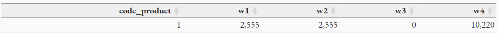
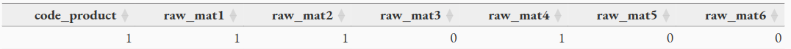
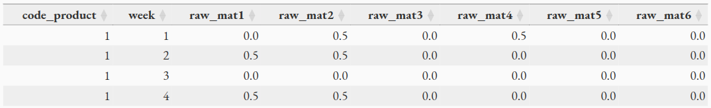
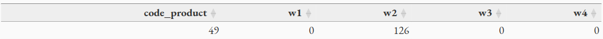
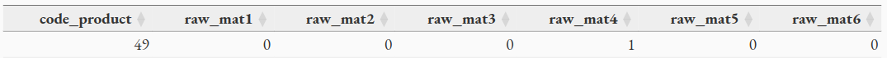
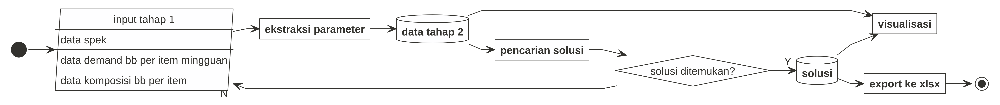

layout: true

<div class="my-footer"><span>Presentasi Tesis</span></div>

```{r setup, include=FALSE}
options(htmltools.dir.version = FALSE)
setwd("~/209_ITB/Thesis/Proposal Thesis/Thesis Final")
# reference:
# https://www.garrickadenbuie.com/blog/xaringan-tip-logo-all-slides/
```

---

class: middle

.pull-left[

# PERKENALAN

## Mohammad Rizka Fadhli

Mahasiswa pasca sarjana program __MBR__ Prodi Sains Komputasi 2021.

_Market Research Specialist_ di PT. Nutrifood Indonesia.

]

.pull-right[

```{r out.width="60%",echo=FALSE,fig.align='center'}
knitr::include_graphics("logo nutrifood.png")
```

]

---

class: middle

# SEKILAS _UPDATE_ SUBMISI JURNAL

```{r out.width="80%",echo=FALSE,fig.align='center'}
knitr::include_graphics("Status.png")
```

---

class: middle,center,inverse

# AGENDA HARI INI
## Penjelasan Mengenai Luaran pada _Thesis_

### Pengembangan _Decision Support System_ untuk Menyelesaikan Masalah Optimisasi pada Pemilihan dan Penentuan Komposisi Bahan Baku untuk Multi-Produk, Multi-Periode, Multi-Supplier, serta Kontrak Pembelian Minimum Selama Satu Tahun

---

class: middle,center,inverse

# JUDUL THESIS

### Pengembangan _Decision Support System_ untuk Menyelesaikan Masalah Optimisasi pada Pemilihan dan Penentuan Komposisi Bahan Baku untuk Multi-Produk, Multi-Periode, Multi-Supplier, serta Kontrak Pembelian Minimum Selama Satu Tahun

--

# LUARAN THESIS

--

## Model Optimisasi

--

## _Decision Support System_

---

class: middle,center

# _QUICK RECAP_

### Sebelum masuk ke pembahasan utama

---

class: middle

# _QUICK RECAP_
## Masalah

NFI memproduksi beberapa jenis minuman serbuk. Masing-masing produk minuman tersebut memiliki __resep__ yang _unique_, namun ada satu komponen bahan baku yang bisa digunakan oleh __keseluruhan produk__ tersebut.

Untuk pemenuhan bahan baku tersebut, NFI menggunakan prinsip _multiple sourcing_ dengan perjanjian untuk memasoknya dari enam buah _supplier_. Perjanjian kerja sama antar _supplier_ berupa komitmen pembelian sejumlah bahan baku selama setahun ke depan. Spesifikasi bahan baku dan harganya per-ton berbeda-beda antar _supplier_. 

Semua produk minuman tersebut bisa dibagi menjadi dua kelompok, yakni:

1. Minuman yang hanya bisa diproduksi oleh __satu jenis__ bahan baku.
1. Minuman yang bisa diproduksi menggunakan __dua atau lebih jenis__ bahan baku.

---

class: middle

# _QUICK RECAP_

## Kondisi Saat Ini

NFI memilih _supplier_ dan menentukan kuantitas pembelian bahan baku secara __manual__ dengan mempertimbangkan data-data terkait secara mingguan oleh departemen PPIC. Namun proses tersebut belum sampai ke dalam tahap mengalokasikan bahan baku yang dibeli tersebut dengan produk yang akan diproduksi kelak sehingga berpotensi menimbulkan _loss sales_ akibat ketiadaan bahan baku saat produksi. Selain itu, proses perhitungan ini memerlukan __waktu yang cukup lama__.

## Masalah Utama _Thesis_

Pada _thesis_ ini, ada tiga masalah utama yang hendak diselesaikan, yakni:

- Memilih _supplier_ bahan baku.
- Menentukan banyaknya bahan baku yang harus dibeli dari suatu _supplier_.
- Menentukan bahan baku mana yang harus digunakan untuk memproduksi setiap produk.

dengan tujuan total biaya pembelian seminim mungkin tetapi memenuhi kebutuhan yang ada pada periode tertentu. 

Kemudian akan dibuat suatu _decision support system_ agar memudahkan proses pekerjaan PPIC.

---

class: middle

# _QUICK RECAP_

## _Policies_ Pembelian Bahan Baku

Pembelian ini juga harus disesuaikan dengan _policies_ yang ada pada __SCM__, seperti:

1. Pembelian bahan baku harus berasal dari minimal 2 _suppliers_ untuk menjaga keamanan pasokan.
1. Pembelian bahan baku dari _supplier_ harus memenuhi proporsi portofolio yang ditetapkan di awal tahun oleh __NFI__. Angka ini kelak menjadi patokan berapa tonase minimal yang harus __NFI__ beli kepada masing-masing _supplier_ dalam setahun.

---

class:middle

## Ilustrasi Alur Pembelian Bahan Baku

```{r out.width="85%",echo=FALSE,fig.cap="Simplifikasi dari Penggunaan Bahan Baku",fig.align='center'}
knitr::include_graphics("timeline.png")
```

---
class: middle

# _QUICK RECAP_

## _Remarks_

- Untuk memudahkan pemodelan, indeks minggu yang dipakai adalah $\{ 1,2,3,4 \}$ saja.
- Ada 6 buah pemasok, masing-masing memberikan satu jenis bahan baku. Sehingga kita memiliki 6 jenis bahan baku.
    - Pada model kelak akan dituliskan `bahan baku`, sehingga masalah pemilihan pemasok sama dengan pemilihan bahan baku.


---

class: middle,center

# MODEL OPTIMISASI

---

class: middle

# MODEL OPTIMISASI

## Masalah Optimisasi

Meminimalkan ongkos pembelian bahan baku dengan tetap mengamankan stok bahan baku agar proses produksi tetap berjalan.

Masalah ini termasuk ke dalam _mixed integer linear programming_ (__MILP__).

1. Parameter dan variabel yang terlibat merupakan suatu nilai pasti.
1. Variabel yang terlibat meliputi:
    - _Binary_ karena melibatkan pengambilan keputusan bahan baku dari _supplier_ mana yang harus dipesan.
    - _Integer_ karena melibatkan angka kuantitas bahan baku yang harus dipesan. 
    - _Continuous_ karena melibatkan persentase bahan baku yang hendak dialokasikan ke produksi _finished goods_ per pekan.
1. Fungsi _objective_ dan _constraints_ masih berupa _linear_.
    - Meminimumkan ongkos pembelian `harga x tonase`.
    - Kapasitas gudang bahan baku dan rencana produksi produk.
    - Kontrak pembelian selama setahun.
    - Pemenuhan _demand_ bahan baku per pekan.
    - dan seterusnya.

---

class: middle

# MODEL OPTIMISASI

## Indeks, Himpunan, dan Parameter yang Terlibat

.pull-left[

- $M = \left\{ 1,2,3,4 \right\}$ sebagai himpunan minggu, 
- $N$ sebagai banyaknya bahan baku, 
- $\mathfrak{N}= \left\{ 1,2,...,N \right\}$ sebagai himpunan bahan baku,
- $I$ sebagai banyaknya _item_ (produk jadi),
- $\mathfrak{I} =  \left\{ 1, 2, ..., I  \right\}$ sebagai himpunan _item_,
- $P$ sebagai himpunan _item_ yang hendak diproduksi pada bulan perencanaan,
    - $P^2$ sebagai himpunan _item_ yang bisa diproduksi menggunakan __minimal dua jenis bahan baku__.
- Untuk $j \in M, \space P_j$ sebagai himpunan _item_ yang diproduksi pada minggu ke $j$.
- Untuk $i \in \mathfrak{I}, \space k \in \mathfrak{N}$,

\begin{align}
f_{ik} = 
\left\{\begin{matrix}
1 & , & \text{jika item } i \text{ bisa diproduksi dengan bahan baku } k  \\ 
0 & , & \text{lainnya}
\end{matrix}\right. 
\end{align}


]

.pull-right[

- Untuk $i \in P_j, \space g_{ijk}$ adalah kebutuhan bahan baku $k$ dari item $i$ pada minggu ke $j$.
- Untuk $j \in M, D_j$ sebagai himpunan _demand_ bahan baku pada minggu ke $j$.
- Untuk $k \in \mathfrak{N}, mo_k$ sebagai nilai _one-year minimum order quantity_ untuk bahan baku $k$.
- Untuk $k \in \mathfrak{N}, c_k$ sebagai harga per unit bahan baku $k$.
- Untuk $k \in \mathfrak{N}, \sigma_k$ sebagai _minimum one-month order quantity_ dari bahan baku $k$ jika terjadi pembelian,
- Untuk $k \in \mathfrak{N}, z_{0k}$ sebagai saldo bahan baku $k$ di gudang sebelum pengiriman pada minggu pertama,
- $ss$ sebagai _safety stock_ setiap bahan baku di akhir minggu,
- $maxcap$ sebagai kapasitas gudang bahan baku,
- $hc$ sebagai _holding cost_ bahan baku setiap minggu. 

]

---

class: middle

# MODEL OPTIMISASI

## Variabel Keputusan

Definisikan:

- $\forall k \in N, x_k$ sebagai banyaknya bahan baku $k$ yang dibeli. 
    - $x_k \in \mathbb{Z}^+$, merupakan bilangan bulat.
    - $x_k = 0$ jika bahan baku $k$ tidak dibeli, 
    - $\sigma_k \leq x_k \leq D$ lainnya.
- $\forall k \in N$,

\begin{align}
y_k = 
\left\{\begin{matrix}
0 & , & x_k  \\ 
1 & , & \sigma_k \leq x_k \leq D
\end{matrix}\right. 
\end{align}

- Variabel $y_k$ didefinisikan untuk mengatasi sifat diskontinuitas dari variabel $x_k$.

---

class: middle

# MODEL OPTIMISASI

## Variabel Keputusan (lanjutan)

- $\forall j \in M, \forall k \in N, \hat{x}_{jk}$ sebagai banyaknya bahan baku $k$ yang dikirim pada awal minggu ke $j$.
- $\forall j \in M, \forall i \in P_j, \forall k \in N,$

\begin{align}
a_{ijk} = 
\left\{\begin{matrix}
1 & , & \text{jika item } i \text{ pada minggu }j \text{ diproduksi menggunakan bahan baku } k  \\ 
0 & , & \text{lainnya}
\end{matrix}\right. 
\end{align}

- $\forall j \in M, \forall i \in P_j, \forall k \in N, b_{ijk}$ sebagai proporsi dari bahan baku $k$ yang digunakan untuk memproduksi _item_ $i$ pada minggu ke $j$ (jika bahan baku $k$ digunakan).
- $\forall j \in M, \forall k \in N, z_{jk}$ sebagai saldo dari bahan baku $k$ di akhir minggu ke $j$. 

---

class: middle

# MODEL OPTIMISASI

## _Constraints_

.pull-left[

### _Constraint I_

Dibuat untuk menghubungkan $x_k$ dengan $y_k$ akibat diskontinuitas atau sifat dari $x_k$.  $\forall k \in N,$

\begin{align}
  x_k \leq y_k \space D
\end{align}

\begin{align}
  x_k \geq \sigma_k \space y_k 
\end{align}

### _Constraint II_

Dibuat sebagai penjumlahan total bahan baku $k$ yang dibeli per minggu $j$. $\forall k \in N,$

\begin{align}
  x_k = \sum_{j \in M} \hat{x}_{jk}
\end{align}

]

.pull-right[

### _Constraint III_

Dibuat agar _demand_ bahan baku mingguan terpenuhi. $\forall j \in M,$

\begin{align}
  \sum^{N}_{k=1} \hat{x}_{jk} + \sum^{N}_{k=1} z_{(j-1)k} \geq D_j 
\end{align}

### _Constraint IV_

Dibuat agar setiap _item_ pada $P^2$ diproduksi oleh minimal dua bahan baku. $\forall j \in M, \forall i \in P^2_j$

\begin{align}
  \sum_{k \in N} a_{ijk} \geq 2
\end{align}

]

---

class: middle

# MODEL OPTIMISASI

## _Constraints_

.pull-left[

### _Constraint V_

Dibuat untuk menghubungkan antara variabel $f_{ik}, a_{ijk}, b_{ijk},$ dan $x_{jk}$. $\forall j \in M, i \in P, k \in N$.

\begin{align}
  a_{ijk} \leq f_{ik}
\end{align}

$\forall j \in M, \forall i \in P, \forall k \in N$

\begin{align}
  b_{ijk} \leq f_{ik} a_{ijk}
\end{align}

\begin{align}
  \mu a_{ijk} \leq b_{ijk}
\end{align}

untuk suatu nilai $\mu$ yang kecil.

$\forall j \in \hat{M}, \forall i \in P_j,$

\begin{align}
  \sum_{k \in N} b_{ijk} = 1
\end{align}

]

.pull-right[

### _Constraint VI_

Dibuat agar memenuhi kebijakan pembelian minimal dari dua pemasok (untuk _item_ yang bisa diproduksi menggunakan minimal 2 bahan baku). $\forall j \in \hat{M}, \forall i \in P^2_j, k_1, k_2 \in N, k_1 \neq k_2,$

\begin{align}
  (1 - a_{ijk_1}) + (1 - a_{ijk_2}) \geq b_{ijk_1} - b_{ijk_2}
\end{align}

\begin{align}
  (1 - a_{ijk_1}) + (1 - a_{ijk_2}) \geq b_{ijk_2} - b_{ijk_1}
\end{align}

]

???

## Pada _Constraint V_

Perhatikan bahwa $\hat{M}$ adalah setiap minggu yang sedang direncanakan. 

## Pada _Constraint VI_

Perhatikan bahwa pasangan $k_1$ dan $k_2$ adalah semua kemungkinan yang ada dari 6 bahan baku per item.

---

class: middle

# MODEL OPTIMISASI

## _Constraints_

.pull-left[

### _Constraint VII_

Dibuat agar saldo bahan baku setelah pengiriman tidak akan melebihi kapasitas maksimum gudang.

$\forall j \in M,$

\begin{align}
  \sum_{k \in N} (z_{(j-1)k} + \hat{x}_{jk}) - \sum_{i \in P_j} b_{ijk} g_{ik} + z_jk \leq maxcap
\end{align}

]

.pull-right[

### _Constraint VIII_

Dibuat agar memastikan saldo di akhir minggu $j$ berada di atas atau sama dengan _safety stock_. $\forall j \in M, \forall k \in P,$

\begin{align}
  z_{jk} \geq ss
\end{align}

]

---

class: middle

# MODEL OPTIMISASI

## Fungsi Objektif

Secara sederhana, tujuan utama dari model optimisasi ini adalah meminimumkan _purchase cost_. 

\begin{align}
PC = \sum_{k \in \mathfrak{N}} c_k x_k
\end{align}

--
Namun seiring iterasi pada saat pencarian solusi secara numerik, didapatkan ada dua hal lain yang perlu dipertimbangkan, yakni:

1. _Holding cost_,
    - Secara definisi: _Holding costs are costs associated with storing unsold inventory_.
    - _Holding cost_ digunakan untuk menghindari _excess_ pembelian bahan baku yang tidak langsung terpakai.
    - Manfaat tak langsung: kapasitas gudang bahan baku menjadi terkendali.
--
1. Kriteria pembelian minimum dalam setahun.
    - Diperlukan sehingga perusahaan tidak secara berlebihan membeli bahan baku yang lebih murah langsung di awal tahun. Sehingga tidak mengganggu kontrak kerjasama (portofolio) antara perusahaan dan pemasok.
    - Pendefinisiannya akan dijelaskan kemudian.

---

class: middle

# MODEL OPTIMISASI

## Fungsi Objektif

.pull-left[

### _Holding Cost_

Saldo bahan baku $k$ untuk satu minggu bisa diilustrasikan di grafik berikut.

Sehingga total _holding cost_ dituliskan:

\begin{align}
HC = \frac{1}{2} ic \sum_{j \in \mathfrak{M}} \sum_{k \in \mathfrak{N}} (z_{(j-1)k} + z_{jk} + \hat{x}_{jk})
\end{align}

Untuk suatu nilai $ic$ tertentu.

]

.pull-right[

```{r out.width="80%",fig.align='center',echo=FALSE,fig.cap="Illustration for inventory cost calculation"}

```

]

---

class: middle

# MODEL OPTIMISASI

## Fungsi Objektif

### Kriteria Pembelian Minimum dalam Setahun

_Constraints I - VIII_ berbicara mengenai bagaimana _demand_ bisa dipenuhi tanpa melanggar kondisi-kondisi yang ada. Namun terkait _policy_ kontrak _minimum order quantity_ selama setahun cukup sulit untuk diekspresikan dalam bentuk _constraint_ dalam model yang rentang waktunya adalah satu bulan.

Oleh karena itu _policy_ ini kita akomodir pada fungsi objektif sebagai penalti yang didefinisikan sebagai:

\begin{align}
  {- \sum_{k \in \mathfrak{N}} \alpha_k mo_k x_k}
\end{align}

Untuk suatu nilai $\alpha_k$ tertentu. Kelak akan dibahas lebih lanjut terkait pemilihan nilai $\alpha_k$ pada bagian `VALIDASI`.

---

class: middle

# MODEL OPTIMISASI

## Fungsi Objektif

Dari uraian-uraian sebelumnya, kita bisa tuliskan fungsi objektif untuk model optimisasi ini adalah:

\begin{align}
  F(\bar{x},\bar{z}) = \frac{1}{2} hc \sum_{j \in \mathfrak{M}} \sum_{k \in \mathfrak{N}} (z_{(j-1)k} + z_{jk} + \hat{x}_{jk}) + \sum_{k \in \mathfrak{N}} c_k x_k - \sum_{k \in \mathfrak{N}} \alpha_k mo_k x_k
\end{align}

dengan notasi:

- $\bar{x}$ sebagai vektor dari elemen $x_k$ dan $\hat{x}_{jk}$ 
- $\bar{z}$ sebagai vektor dari elemen $z_{jk}$ 

---

class: middle

# MODEL OPTIMISASI

Model optimisasi untuk pemilihan pemasok, banyaknya pesanan bahan baku mingguan, dan alokasi komposisi bahan baku per _item_ bisa dituliskan sebagai berikut:


\begin{matrix}
\text{minimize} & F(\bar{x},\bar{z}) \\
\text{subject to} & \text{Constraint I-VIII} \\
\text{ } & x_k, \hat{x}_{jk}, z_{jk} \in \mathbb{Z}^+, y_k, a_{ijk} \in \left\{0,1 \right\}, 0 \leq b_{ijk} \leq 1
\end{matrix}

---

class: middle,center

# VALIDASI MODEL

---

class: middle

# VALIDASI MODEL

## Menggunakan Data pada _Business Process_

Pada bagian ini, kita akan berikan satu contoh solusi dari model optimisasi yang telah dituliskan pada bagian sebelumnya. 

Data yang digunakan adalah:

- $N = 6$ bahan baku (atau 6 pemasok).
- $I = 51$ buah _item_.

Sehingga akan ada `2.508` buah variabel keputusan.

???

$x_k$ ada 6

$\hat{x}_{jk}$ ada 24

$y_k$ ada 6

$z_{jk}$ ada 24

$a_{ijk}$ ada 1224

$b_{ijk}$ ada 1224


---

```{r,include=FALSE}
rm(list=ls())

library(readxl)
library(dplyr)
library(kableExtra)
library(formattable)

nama   = "~/209_ITB/Thesis/Overleaf Version/data input.xlsx"
sheets = excel_sheets(nama)

format_money = function(x) {
  paste0("Rp", formatC(as.numeric(x), format="f", digits=0, big.mark=","))
}

format_biasa = function(x) {
  paste0(formatC(as.numeric(x), format="f", digits=0, big.mark=","))
}

# ambilin data
df_1 = read_excel(nama,sheet = sheets[1]) # ambil spek
df_2 = read_excel(nama,sheet = sheets[2]) # ambil matriks gula x produk
df_3 = read_excel(nama,sheet = sheets[3]) # ambil matriks produk x minggu

df_1 = 
  df_1 %>% rename(bahan_baku = code_gula,
                       harga      = harga_gula) %>% 
       select(-multiplicator,-cost_obj_func) %>% 
  mutate(ss = 2500) %>% 
  mutate(mo_k = proporsi /100 * 3000000 * 12) %>% 
  select(-proporsi) %>% 
  relocate(mo_k,.before = ss)

df_1_print = df_1 

colnames(df_2)[2:7] = paste0("raw_mat",1:6)

df_2 = imputeTS::na.replace(df_2,0)

```


class:middle

# VALIDASI MODEL

## Komposisi Bahan Baku per Produk

```{r,echo=FALSE,message=FALSE,warning=FALSE}
library(DT)
df_2 %>% 
  DT::datatable(class = "compact", rownames = FALSE, extensions = "Buttons",
                options = list(dom = 'tBp', buttons = c("csv","excel"), 
                               pageLength = 8)) %>% 
  DT::formatRound(1:7, digits = 0)

```

???

Kasih unjuk _item_ `49` dan `50` yang merupakan dua _items_ yang hanya bisa dibuat dengan `1` bahan baku saja.

---
class: middle

## Komposisi Bahan Baku per Produk

.pull-left[

```{r,echo=FALSE,fig.retina=7,fig.align='center',fig.cap="Komposisi bahan baku yang diperbolehkan"}
library(ggplot2)
df_2 %>% 
  mutate(tot = raw_mat1 + raw_mat2 + raw_mat3 + raw_mat4 + raw_mat5 + raw_mat6) %>% 
  group_by(tot) %>% 
  tally() %>% 
  ungroup() %>% 
  mutate(persen = n/sum(n) * 100,
         persen = round(persen,1),
         label  = paste0(n," item\n",
                         persen,"%")) %>% 
  mutate(ket = c("Hanya bisa menggunakan 1\nbahan baku saja",
                 paste0("Bisa dengan\n",2:6," bahan baku")),
         ket = factor(ket,
                         level = ket)) %>% 
  ggplot(aes(x = ket,
             y = persen)) +
  geom_col(color = "black",fill = "lightblue") +
  geom_label(aes(y = persen + 5,label = label)) +
  coord_flip() +
  ylim(0,72) +
  theme_minimal() +
  labs(title = "Berapa banyak item yang bisa diproduksi\ndengan ... bahan baku?") +
  theme(axis.title = element_blank(),
        axis.text.x = element_blank(),
        axis.text.y = element_text(size = 10))
```

]

.pull-right[

### Temuan

- Hanya ada __2__ _item_ saja yang bisa diproduksi dengan satu jenis bahan baku. 
- Sedangkan sebagian besar _item_ bisa diproduksi dengan minimal 2 jenis bahan baku.

]
---

class:middle

# VALIDASI MODEL

## Data _Demand_ Mingguan per Produk

Data kebutuhan bahan baku per produk.

```{r,echo=FALSE,message=FALSE,warning=FALSE}
df_3 %>% 
  DT::datatable(class = "compact", rownames = FALSE, extensions = "Buttons",
                options = list(dom = 'tBp', buttons = c("csv","excel"), 
                               pageLength = 8)) %>% 
  DT::formatRound(1:5, digits = 0)
```

???

We can see that items `5` and `36` do not have to be produced during this planning horizon. We also see that most items must be produced within only two or three weeks of this planning horizon, with varying demand. 

> jangan lupa kasih unjuk produk `49` dan `50`

`49` hanya ada di week 2

`50` hany ada di week 1 dan 3

---

class:middle

# VALIDASI MODEL

## Data terkait Spesifikasi Bahan Baku

```{r,echo=FALSE,message=FALSE,warning=FALSE}
df_1_print$mo_k <- color_bar("lightgreen")(df_1$mo_k)
df_1_print$harga <- color_bar("lightblue")(round(df_1$harga,0))
df_1_print$stok_akhir_bulan <- color_bar("yellow")(df_1$stok_akhir_bulan)
df_1_print$min_order <- color_bar("pink")(df_1$min_order)


kbl(df_1_print, escape = F) %>%
  kable_paper("hover", full_width = F) %>% 
  column_spec(5, width = "3cm") %>%
  add_header_above(c(" " = 1,"Informasi Detail" = 6))
```

???

- We know that raw material 4 must be purchased since item 49 and 50 can be produced just by using raw material 4. 
- The price of raw material 4 is the lowest one. But the minimal one-year order quantity is the third smallest. 
    - So that we may guess that the optimal solution, $x_4$ will have immense value but is not the biggest one, among others. 
 
---

class:middle

# VALIDASI MODEL

## Data Lain

_Max capacity_ gudang bahan baku: 1,427,000

---

class:middle

# VALIDASI MODEL

## Pencarian Solusi

Pencarian solusi dilakukan secara numerik dengan membuat program (kode / skrip) di bahasa pemrograman __R__ memanfaatkan _framework_ di `library(ompr)`.

## Pembuatan Program (DSS versi 1.0)

Program dibuat dengan 3 tahapan utama, yakni:

1. __Tahap I__ mengekstrak parameter-parameter dari 3 tabel yang ditunjukkan pada bagian sebelumnya.
    - _Input_ : 3 tabel (termasuk _maxcap_) dalam format file `.xlsx`.
    - _Output_ : parameter-parameter yang dibutuhkan, berupa vektor dan matriks.
1. __Tahap II__ mencari solusi optimal dari model dan _input_ parameter di tahap I.
    - _Input_ : parameter _output_ tahap I.
    - _Output_ : solusi optimal dalam bentuk matriks (hasil keluaran __R__).
1. __Tahap III__ konversi bentuk matriks ke dalam tabel yang mudah dipahami (dalam format `.xlsx`).
    - _Input_ : solusi optimal dari tahap II.
    - _Output_ : tabel dalam _file_ _excel_.

Masing-masing tahapan disimpan dalam skrip terpisah namun dijalankan dalam program yang sama.

---

class: middle

# VALIDASI MODEL

## Solusi Optimal

### Total pemesanan bahan baku dan pengiriman mingguan

```{r,echo=FALSE,message=FALSE,warning=FALSE}
rm(list=ls())

format_biasa = function(x) {
  paste0(formatC(as.numeric(x), format="f", digits=0, big.mark=","))
}

df_dummy = data.frame(
  x1 = c(1:6,"Total"),
  x2 = c(192649,543385,90742,56508,52958,202853,1139094),
  x3 = c(6553,354839,41092,33264,42608,70728,549083),
  x4 = c(65295,23595,26550,209,10350,111075,237074),
  x5 = c(81722,96122,14400,18369,0,0,210613),
  x6 = c(39079,68829,8700,4666,0,21050,142324)
) 

df = data.frame(
  x1 = c(1:6,"Total"),
  x2 = c("192,649","543,385","90,742","56,508","52,958","202,853","1,139,094"),
  x3 = c("6,553","354,839","41,092","33,264","42,608","70,728","549,083"),
  x4 = c("65,295","23,595","26,550","209","10,350","111,075","237,074"),
  x5 = c("81,722","96,122","14,400","18,369","0","0","210,613"),
  x6 = c("39,079","68,829","8,700","4,666","0","21,050","142,324")
) 

df$x2 <- color_bar("lightgreen")(df_dummy$x2)
df$x3 <- color_bar("yellow")(df_dummy$x3)
df$x4 <- color_bar("cyan")(df_dummy$x4)
df$x5 <- color_bar("pink")(df_dummy$x5)
df$x6 <- color_bar("lightblue")(df_dummy$x6)

colnames(df)[1]   = "Bahan Baku"
colnames(df)[2]   = "Order Qty"
colnames(df)[3]   = "Week 1"
colnames(df)[4]   = "Week 2"
colnames(df)[5]   = "Week 3"
colnames(df)[6]   = "Week 4"


kbl(df, escape = F) %>%
  kable_paper("hover", full_width = F) %>% 
  column_spec(5, width = "3cm") %>%
  add_header_above(c("Pemasok" = 1,"Total Pengiriman" = 1,"Pengiriman Mingguan" = 4))

```

Tidak ada pelanggaran terhadap _constraint I_ dan _II_. 

???

_constraint I_: semua $x_k \geq \sigma_k$.

_constraint II_ : $\sum \hat{x}_k = x_k$

---

class: middle

# VALIDASI MODEL

## Solusi Optimal

Perbandingan pengiriman pada minggu $j$, saldo pada minggu $j-1$ dan _demand_ pada minggu $j$.

```{r,echo=FALSE}
rm(list=ls())

data.frame(
  info    = c("Demand","Saldo week j-1","Pengiriman week j","Sisa Saldo"),
  week_1  = c("373,288","18,450","549,083","194,245"),
  week_2  = c("416,316","194,245","237,074","15,002"),
  week_3  = c("210,614","15,002","210,613","15,001"),
  week_4  = c("142,325","15,001","142,324","15,000")
) %>% 
  kbl(escape = F) %>% 
  kable_paper("hover", full_width = F) %>% 
  column_spec(5, width = "3cm") %>% 
  add_header_above(c(" " = 1,"Week j = ..." = 4))
```

Terlihat bahwa tidak ada pelanggaran pada _constraint III_.

???

_constraint III_ dibuat agar _demand_ bahan baku mingguan terpenuhi.


Lalu coba perhatikan bahwa di akhir minggu 4, ada saldo sebanyak 15.000 itu dari mana asalnya?


---

class: middle

# VALIDASI MODEL

## Solusi Optimal

### Saldo bahan baku di akhir minggu

```{r,echo=FALSE,message=FALSE,warning=FALSE}
rm(list=ls())

df = data.frame(
  raw = 1:6,
  x1  = c("2,501","181,743","2,500","2,500","2,500","2,500"),
  x2  = c("2,501","2,501","2,500","2,501","2,500","2,500"),
  x3  = c("2,500","2,500","2,500","2,501","2,500","2,500"),
  x4  = c(rep("2,500",6))
)

colnames(df)[1]   = "Bahan Baku"
colnames(df)[2:5] = paste0("Week ",1:4)

kbl(df, escape = F) %>%
  kable_paper("hover", full_width = F) %>% 
  column_spec(5, width = "3cm") %>%
  add_header_above(c("Pemasok" = 1,"Saldo akhir" = 4))

```

Tidak ada pelanggaran pada _constraint VII_ dan _VIII_.

???

Terlihat angka detail saldo pada slide sebelumnya


---

class: middle

# VALIDASI MODEL

## Solusi Optimal

### Matriks $b_{ijk}$

```{r,echo=FALSE}
rm(list=ls())

df = read_excel("~/209_ITB/Thesis/Overleaf Version/output fungsi ketiga.xlsx",
                sheet = "Proporsi b_ijk",
                skip  = 2)

colnames(df)[3:8] = paste0("raw_mat",1:6)
df %>% 
  rename(code_product = i,
         week         = j) %>% 
  DT::datatable(class = "compact", rownames = FALSE, extensions = "Buttons",
                options = list(dom = 'tBp', buttons = c("csv","excel"), 
                               pageLength = 8)) %>% 
  DT::formatRound(3:8, digits = 1)
```

???

Berikut adalah matriks $b_{ijk}$ yang terbentuk. Mayoritas memang berisi 50% proporsinya. Namun ada juga yang 33% tergantung dari kondisi yang ada.

contoh:

- item 6 dan 25 butuh 5 gula pada week 1


Bagaimana cara membacanya? terangkan dulu


---

### Contoh kasus pada _item_ _i_ = 1

```{r,echo=FALSE,fig.align='center',fig.cap="Data demand bahan baku per $item$ per minggu (parameter yang diketahui)"}

```

```{r,echo=FALSE,fig.align='center',fig.cap="Data bahan baku yang diperbolehkan untuk masing-masing $item$ (parameter yang diketahui)"}

```

```{r,echo=FALSE,fig.align='center',fig.cap="matriks $b_{ijk}$ (hasil solusi optimal)"}

```

---

### Contoh kasus pada _i_ = 49

```{r,echo=FALSE,fig.align='center',fig.cap="Data demand bahan baku per $item$ per minggu (parameter yang diketahui)"}

```

```{r,echo=FALSE,fig.align='center',fig.cap="Data bahan baku yang diperbolehkan untuk masing-masing $item$ (parameter yang diketahui)"}

```

```{r,echo=FALSE}
df %>% 
  filter(i == 49) %>% 
  rename(code_product = i,
         week         = j) %>% 
  DT::datatable(class = "compact", rownames = FALSE, extensions = "Buttons",
                options = list(dom = 'tBp', buttons = c("csv","excel"), 
                               pageLength = 4)) %>% 
  DT::formatRound(3:8, digits = 1)
```

Pengecekan menyeluruh membuktikan bahwa tidak ada pelanggaran terhadap _constraint V_ dan _VI_.

???

_Constraint V_ dibuat untuk menghubungkan antara variabel $f_{ik}, a_{ijk}, b_{ijk},$ dan $x_{jk}$. $\forall j \in M, i \in P, k \in N$.
 

_Constraint VI_ berbicara mengenai policy minimal 2 jenis bahan baku untuk $P^2$

---

class: middle

# VALIDASI MODEL

## Hasil Pengecekan

Hasil pengecekan menyeluruh didapatkan bahwa semua variabel keputusan:

- $x_k$, 
- $\hat{x}_k$, 
- $a_{ijk}$, 
- $b_{ijk}$, dan 
- $z_{jk}$ 

tidak ada yang melanggar _constraints_ dan merupakan solusi optimal.

---

class: middle

# VALIDASI MODEL

## Histori Modifikasi Fungsi Objektif

Pada pembahasan terkait fungsi objektif, telah disebutkan bahwa fungsi objektif saat ini telah memperhitungkan _purchase cost_, _holding cost_, dan kontrak pembelian minimal setahun.

Sebelum mencapai fungsi terakhir, kami telah mencoba beberapa fungsi objektif seperti:

- _Objective function_ 1:

\begin{align}
hc_{j=1} + \sum_{k \in \mathfrak{N}} c_k x_k
\end{align}

- _Objective function_ 2:

\begin{align}
\frac{1}{2} hc \sum_{j \in M} \sum_{k \in \mathfrak{N}} (z_{(j-1)k} + z_{jk} + \hat{x}_{jk}) + \sum_{k \in \mathfrak{N}} c_k x_k
\end{align}

- _Objective function_ 3 (saat ini):

\begin{align}
\frac{1}{2} hc \sum_{j \in M} \sum_{k \in \mathfrak{N}} (z_{(j-1)k} + z_{jk} + \hat{x}_{jk}) + \sum_{k \in \mathfrak{N}} c_k x_k - \sum_{k \in \mathfrak{N}} \alpha_k mo_k x_k
\end{align}

---

class: middle

# VALIDASI MODEL

## Histori Modifikasi Fungsi Objektif (lanjutan)

.pull-left[

Berikut adalah komparasi solusi antar fungsi objektif:

```{r,echo=FALSE,message=FALSE,warning=FALSE}
rm(list=ls())

df = data.frame(
  raw = c(1:6,"Total"),
  x1  = c("276,780","464,388","35,645","214,811","29,400","118,070","1,139,094"),
  x2  = c("363,486","532,404","20,402","60,124","16,888","145,791","1,139,094"),
  x3  = c("192,649","543,385","90,742","56,508","52,958","202,853","1,139,094")
)

colnames(df)[1]   = "Raw material"
colnames(df)[2:4] = paste0("obj function ",1:3)

df %>% 
  knitr::kable("html", align="c", booktabs=TRUE, escape = F,
               caption = "Optimal solution comparison between different objective functions") %>% 
  kable_styling(latex_options = "hold_position") %>% 
  add_header_above(c(" " = 1,"Optimal solution" = 3)) 
```

]

.pull-right[

Dari tabel tersebut, terlihat bahwa jika penggunaan _purchase cost_ dominan, maka bahan baku `4` akan mendapatkan porsi pembelian yang besar. Namun karena kita ketahui bahwa dari $mo_{k=4}$ adalah yang terkecil ketiga, maka sebaiknya pembeliannya haruslah lebih kecil untuk mengakomodir nilai kontrak selama setahun. Sehingga fungsi objektif terakhir memiliki solusi yang terbaik.

Selain itu, $\alpha_k$ harus bernilai positif di setiap bulan perencanaan selama nilai minimum _order_ selama setahun ( $mo_k$ ) masih jauh. Namun saat nilai _order_ tersebut akan habis, kita bisa membuat $\alpha_{k=0}$.

]

???

Urutannya itu 

bahan baku 2 - 1 - 6 - 4 - 3 - 5


$\alpha_k mo_k x_k$ urutannya 2 -1 -6 - 4 - 3 - 5 jadi, seolah-olah aspek ini memaksa agar hasil yang keluar itu tetap ke proporsi awal $mo_k$.

```{r,echo=FALSE}
rm(list=ls())

data.frame(k           = 1:6,
           alfa_mok_xk = c("153,271.21","1,083,727.64","5,880.06","16,681.18","1,525.18","85,441.47"))
```

---
class: middle,center

# _DECISION SUPPORT SYSTEM_

---

class: middle

# _DECISION SUPPORT SYSTEM_

## Kenapa Harus Membuat DSS?

- Sebagai _business user_, tim PPIC membutuhkan _tools_ yang mudah digunakan dan mempercepat produktivitas dalam bekerja. 
- DSS yang dibutuhkan harus berwujud aplikasi dengan _user interface_ yang intuitif bagi mereka.

## Pembuatan DSS

DSS dibuat dengan basis program berbahasa __R__. _Library_ yang dilibatkan untuk menyusun model optimisasi adalah `library(ompr)`.

Penentuan solusi pada bagian sebelumnya adalah menggunakan program __R__ yang membutuhkan _compiler_ __R Studio__. Proses _runtime_ yang dibutuhkan adalah `51.093 detik`.

Program ini disebut sebagai DSS versi 1.0.

---

class: middle

# _DECISION SUPPORT SYSTEM_

## Pengembangan DSS versi 2.0

```{r out.width="80%",echo=FALSE,fig.align='center',fig.cap = "Flowchart DSS"}


```

```{r,include=FALSE}
nomnoml::nomnoml("
                 [<start>start] -> [<input>input tahap 1]
                 
                 [<input>input tahap 1|
                  data spek|
                  data demand bb per item mingguan|
                  data komposisi bb per item]
                 
                 [<input>input tahap 1] -> [ekstraksi parameter]
                 [ekstraksi parameter] -> [<database>data tahap 2]
                 
                 [<database>data tahap 2] -> [visualisasi]
                 
                 [<database>data tahap 2] -> [pencarian solusi]
                 
                 [pencarian solusi] -> [<choice>solusi ditemukan?]
                 
                 [<choice>solusi ditemukan?] -> N [<input>input tahap 1]
                 
                 [<choice>solusi ditemukan?] -> Y [<database>solusi]
                 
                 [<database>solusi] -> [export ke xlsx]
                 [<database>solusi] -> [visualisasi]
                 
                 [export ke xlsx] -> [<end>end]
                 ")

```

???

Cerita ini partnya sains komputasi. terbantu betul saat ambil kuliah perancangan perangkat lunak.

---

class: middle,center,inverse

# Terima Kasih
## _Feel free to discuss_
