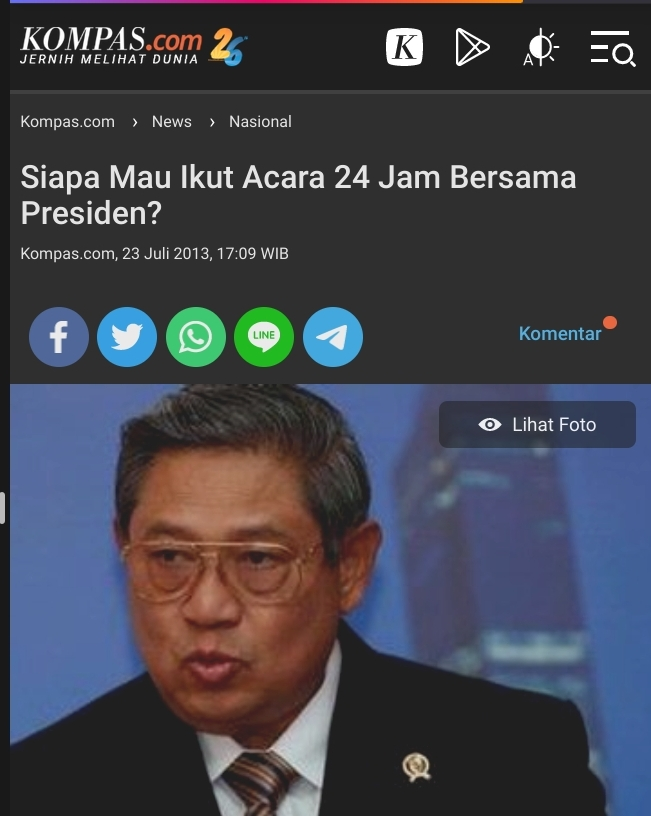

```{r setup, include=FALSE}
rm(list=ls())
library(dplyr)
library(ggplot2)
library(reshape2)
```

\newpage
\tableofcontents
\newpage
\listoffigures
\newpage
\listoftables
\newpage

# SILABUS UMUM

## Tujuan Perkuliahan

Kuliah ___Basic Market Research___ dirancang untuk:

1. Menambah pengetahuan peserta kuliah terhadap _market research_ dan peranannya dalam dunia bisnis sebagai salah satu _decision support system_. Kelak akan dijelaskan pula berbagai jenis _research_ yang lazim digunakan seperti:
	1. _Qualitative research_: _focus group discussion_ (FGD), _In-depth Interview_ (IDI), dan _qualitative observation_.
	1. _Quantitative research_: _surveys_ dan _quantitative observation_.
1. Mengenalkan beberapa studi _market research_ yang lazim dilakukan di dunia bisnis, seperti:
	1. _Market Entry Study_.
	1. _TV Campaign Research_, meliputi _storyline research_, _pre-campaign research_, dan _post-campaign research_.
	1. _Brand Health Research_, meliputi _satisfaction_, _loyalty_, _usership_, _perception_, dan sebagainya.
	1. _Media Habit_.
	1. _Consumer Profile_.
	1. _Service Audit_.
	1. _Retail Audit_.
1. Memberikan pengalaman terhadap mahasiswa untuk merencanakan, menyusun, melakukan, dan membuat laporan suatu _market research_ sederhana. Tahapan-tahapan yang akan dilakukan:
	1. Formulasi masalah:
		- Mengubah _management problem_ menjadi _research problem_.
		- Menggunakan _tools_ seperti _interrelationship diagram_ untuk memisahkan antara `sebab` dan `akibat` dari suatu masalah.
	1. Menuliskan tujuan _research_.
	1. Melakukan _sample design_.
		- Mendefinisikan populasi dan _sample_.
		- Menghitung _sample size_.
		- Menentukan teknik _sampling_ yang hendak digunakan.
	1. Membuat quesioner.
	1. Mengumpulkan data dan melakukan _quality control_.
	1. _Data entry_, _data preparation_, dan _data processing_.
	1. _Analysis_ dan _reporting_.
	1. _Feedbacks_.

_Case studies_ yang akan digunakan sebagai bahan ajar:

1. _Market Entry Study_: Suatu perusahaan _healthy FnB_ _overseas_ hendak masuk ke Indonesia.
1. _TV Campaign_: Bagaimana suatu perusahaan popok bayi membuat dan mengevaluasi iklan TV?
1. _Brand Health_: __Top Brand Index__ dan _customer satisfaction survey_.
1. _Service Audit_: Pengukuran kualitas layanan bank dengan _mystery shopping_.
1. _Retail Audit_: _Telco retail audit_.

_Case study_ yang akan dijadikan tugas melakukan _market research_:

___Mencari tren makanan dan minuman pada suatu segmen konsumen tertentu (misalkan: anak muda kelas menengah ke atas, ibu hamil kelas menengah ke bawah, dan orang tua kelas menengah).___

## _Learning Outcomes_

Rujukan _outcomes_:

C1. Analytical thinking

C2. Process understanding

C3. Research skill

C4. Ability to work in team

C5. Conflict skill

C6. Communication skill

C7. Problem Solving

C8. Decision Making

C9. Research skill 

C10. Technical skill

C11. Media skill

C12. Coding skill

C13. Networking skill

Setelah mengambil kuliah ini, peserta diharapkan:

1. Mengetahui perbedaan masing-masing jenis _research_ dan bisa memasangkannya dengan tujuan dari bisnis (C1, C2, C7, dan C8).
1. Mampu melaksanakan _market research_ dengan tahapan-tahapan yang benar (C3 dan C10).
1. Mampu melakukan _data preparation_ hingga _data analysis_ untuk dijadikan laporan _market research_ (C10, C12, dan C6).

## _Blending Teaching Methods and Modes of Delivery_

```{r,echo=FALSE}
met1 = c("Case-based learning",
	 "Problem-based learning",
	 "Challenge-based learning",
	 "Project-based learning",
	 "Experimental learning",
	 "",
	 "",
	 "")
met2 = c("Team-based learning",
	 "Collaborative team learning",
	 "Team learning",
	 "Lecture",
	 "Online learning",
	 "Debate",
	 "Concept Questions",
	 "Computational Lab Project (Colab)")
metode = data.frame(x1 = c("x","","","x","","","",""),
	            y1 = met1,
		    x2 = c("","","x","x","x","","",""),
		    y2 = met2)
metode %>%
  rename("Metode Pengajaran" = y1,
	 " " = x1,
	 "Cara Penyampaian Materi" = y2,
	 "  " = x2) %>%
  knitr::kable("pipe",caption = "Metode Pembelajaran")
```

## Silabus dan Jadwal Mingguan

```{r,echo=FALSE}
week = 1:15
cara = c(rep("Online learning",9),
	 "Lecture",
	 rep("Online learning",2),
	 rep("Lecture",3))
topik = c("Pendahuluan",
          "Workflow",
          "Market Research Problem",
          "Pengelompokkan Data",
          "Jenis-jenis Riset",
          "Metode Pengumpulan Data Riset Kualitatif",
          "Metode Pengumpulan Data Riset Kuantitatif",
          "Sample Design",
          "Designing Questionnaire",
	  "Tugas",
          "Data Processing",
          "Analisa Data",
          "Melaksanakan Desk Research",
	  "Contoh Projects Market Research",
          "Tugas")
detail = c("Latar belakang kenapa harus melakukan market riset. Strategi perusahaan untuk melakukan atau tidak.",
           "Langkah-langkah melakukan riset atau penelitian. Penjelasan mengenai 3 titik kritis dalam melakukan riset.",
           "Jenis-jenis masalah dalam bisnis.",
           "Jenis-jenis data dalam market riset.",
           "Riset kualitatif vs riset kuantitatif beserta contoh aplikasi dan bagaimana menentukan yang sebaiknya dilakukan.",
           "Berbagai contoh metode pengumpulan data riset kualitatif.",
           "Berbagai contoh metode pengumpulan data riset kuantitatif.",
           "Perkenalan berbagai macam teknik sampling dan menghitung berapa banyak sampel data yang harus diambil.",
           "Berbagai panduan membuat kuesioner riset kuantitatif.",
           "Penugasan dan praktek market riset.",
	   "Tahapan sebelum melakukan analisa: data preparation dan data cleaning.",
           "Contoh analisa deskriptif dalam report market riset.",
           "Pengenalan dan panduan singkat terhadap desk research.",
	   "Beberapa contoh projects market riset di berbagai industri seperti telco, banking, oil and gas, e-commerce, FMCG, retail, property, healthcare, etc.",
	   "Pengumpulan tugas")
silabus = data.frame(week,cara,topik,detail)
silabus %>%
  rename(Minggu = week,
	 "Cara Penyampaian Materi/Kegiatan" = cara,
	 "Topik" = topik,
	 "Sub topik" = detail) %>%
  knitr::kable("pipe",caption = "Silabus Detail")
```

## Prasyarat

Prasyarat peserta kuliah:

1. Para peserta kuliah harus sudah pernah mengikuti kuliah statistika seperti: __Analisa Data__ atau __Statistika
Dasar__.
1. Mampu dan menguasai _tools_ pengolahan data seperti Ms. Excel, SPSS, MiniTab, R, atau Python (minimal salah satu).

## _Assesments_

Penilaian dilakukan berdasarkan tugas yang dilakukan secara berkelompok (2-3 orang per kelompok). Bobot penilaiannya:

- Proposal: 35%.
- Quesioner: 25%.
- _Report_ dan analisa: 40%.

## Buku/_resource_ Tambahan Selain Materi yang Telah Ditulis di LMS

1. E. Chapman, E. M. Feit, _R for Marketing Research and Analytics_, 2nd edition, Springer, 2019.
1. G. James, D. Witten, T. Hastie, R. Tibshirani, _An introduction to Statistical Learning in R_, 2013 (e-book).

\newpage

# PERTEMUAN I {-}

# PENDAHULUAN

## Latar Belakang

Di era _industry 4.0_, __data__ menjadi suatu komoditas utama untuk menjadi yang terdepan di bisnisnya. Namun data saja tidak cukup. Dibutuhkan suatu kemampuan untuk mengkonversi data menjadi _insights_ yang berguna bagi bisnis.

> Setiap perusahaan bisa menjual barang dan/atau menawarkan jasa yang sama kepada konsumen. Pembeda satu perusahaan dengan yang lainnya adalah ___analytics___.^[Competing on Analytics: https://hbr.org/2006/01/competing-on-analytics]

_Analytics_ bisa didefinisikan sebagai kemampuan suatu organisasi (perusahaan) untuk mengeksplorasi dan mengeksploitasi data yang ada di internal dan eksternal organisasinya.

Matematika, statistika, dan _engineering_ adalah _tools_ terbaik untuk kita bisa menganalisa data. Sedangkan __market riset__ adalah salah satu metode terpenting bagi organisasi untuk bisa mendapatkan data eksternal, yakni data dari konsumen atau pelanggannya.

## Strategi Perusahaan Terkait _Market Research_

Walaupun banyak pihak berpendapat bahwa _market research_ adalah bagian yang penting dan tak terpisahkan di bisnis. Namun ada beberapa perusahaan yang berpendapat lain. 

Perusahaan seperti __Apple__ pada masa __Steve Jobs__ tidak melakukan _market research_. Kala itu Steve Jobs berkata:

> "People don't know what they want until you show it to them. That's why I never rely on market research. Our task is to read things that they are not yet on the page."

Sebagai seorang _market researcher_, kita bisa mengambil banyak pelajaran dari perkataan di atas. Steve Jobs merasa _market research_ gagal dalam membaca keinginan konsumen. Perusahaanlah yang harusnya membuat dan menawarkan sesuatu yang baru (sesuatu yang belum ada di pasar) sehingga membuat _trend_ baru.

Hal seperti di atas lazim dilakukan oleh perusahaan yang memiliki orang-orang yang dinilai visioner dan mampu menciptakan tren tersendiri. Namun saat orang-orang tersebut tidak ada, perusahaan tersebut akan kehilangan momennya.

Berbeda dengan __Apple__, perusahaan telekomunikasi asal US bernama __Verizon__ justru mengungkapkan:

> "More than 50% of innovation comes from the voice of the customer."

__Verizon__ bersama dengan banyak perusahaan besar di dunia dan Indonesia tetap menganut pendapat bahwa _market research_ adalah salah satu langkah yang perlu dilakukan agar bisa tetap bersaing di era digital saat ini.

### Cara Pandang Perusahaan Terhadap _Market Research_

Berdasarkan uraian di atas, cara pandang perusahaan bisa berbeda-beda. Sebagian merasa _market research_ sebagai _cost center_ sehingga perusahaan enggan melakukannya. Padahal _market researcher_ yang baik bisa menuntun perusahaan untuk menggunakan metode-metode alternatif yang lebih _cost-friendly_ dan _affordable_.

Sebagian perusahaan lain melihat _market research_ sebagai _cost saver_ dan _investment_. Perusahaan bisa diselamatkan dari __kesalahan dalam mengambil keputusan bisnis__ jika ditopang oleh _insights_ hasil _market research_ yang baik. Oleh karena itu perusahaan-perusahaan tersebut menjadikan _market research_ sebagai bagian penting dalam _cycle_ bisnisnya.

Sebuah penelitian yang dipublikasikan oleh _European Society of Market Research_ (ESOMAR) beberapa tahun yang lalu, menyimpulkan bahwa:

> "Tidak ada korelasi antara ___market research budget___ dengan kualitas ___insights___ yang didapatkan."

Oleh karena itu, anggapan bahwa _market research_ adalah sesuatu yang __pasti mahal__ harus dipertimbangkan kembali. 

Dengan _budget_ yang _affordable_, perusahaan tetap bisa mendapatkan _insights_ yang berguna bagi bisnisnya. Oleh karena itu, kita akan membahas bagaimana menajamkan tujuan dan rumusan _market research_ agar tepat pada bagian-bagian selanjutnya. 

### _Keeping Market Research Agile_

Berdasarkan uraian-uraian di atas, kita bisa membuat _market research_ menjadi _agile_ dan adaptif dengan beberapa tips sebagai berikut:

1. Lakukan _market research_ __jika dan hanya jika__ perusahaan masih ragu dengan keputusan yang akan diambil. Jika perusahaan sudah yakin dan mau menerima konsekuensi dari keputusan yang akan diambil, maka tidak perlu melakukan _market research_.
1. Lakukan _cost-benefit ratio analysis_ dari _project market research_ yang hendak dilakukan. Ukur dan nilai _insights_ yang mungkin akan didapatkan, kemudian bandingkan dengan semua _cost_ yang mungkin muncul. _Cost_ dalam hal ini bukan berarti berupa uang (_budget_) yang dikeluarkan, tapi juga berupa waktu pelaksanaan dan _man power_ (sumber daya manusia).
1. _Keep things simple and manage-able_. Perdalam masalah yang hendak dijawab dengan _market research_. Bedakan informasi _need-to-know_ dengan informasi _nice-to-know_. Bagian ini akan dibahas lebih detail pada bab `pembuatan kuesioner`.
1. Lakukan _desk research_ jika perlu. Di era digital, data bertebaran di mana-mana. Dengan metode pengumpulan data yang tepat, kita bisa melakukan _market research_ yang _insightful_ tanpa harus beranjak dari meja kerja. Bagian ini akan dibahas lebih detail pada bab selanjutnya.

### _Market Research_ dalam Struktur Suatu Perusahaan

Bagi perusahaan-perusahaan yang mengandalkan _market research_, secara struktur dan posisi _market research_ dalam perusahaan, suatu perusahaan bisa dikategorikan menjadi dua:

1. _In House Market Research_, yakni perusahaan yang memiliki tim atau bagian khusus yang mengerjakan _market research_ baik secara utuh atau parsial.
1. _Outsource Market Research_, yakni perusahaan yang tidak memiliki tim atau bagian khusus yang mengerjakan _market research_. Oleh karena itu mereka mengandalkan _market research agency_ untuk melakukan _market research_.

## Komponen _Market Research_

Saat kita berbicara tentang _market research_, setidaknya ada beberapa komponen yang biasa diteliti, yakni:

1. Konsumen, 
1. _Market_ (pasar atau _business to business_), dan
1. _Regulator_ (pemerintah).

_Market research_ erat kaitannya dengan konsumen. Sebelum saya membahas _market research_ lebih jauh, saya akan membahas terlebih dahulu tentang konsumen.

### Konsumen

#### Definisi Konsumen {.unlisted .unnumbered}

Konsumen adalah setiap orang __pemakai barang dan atau jasa__ yang tersedia dalam masyarakat, baik bagi kepentingan __diri sendiri, keluarga, orang lain,__ maupun __mahluk hidup lain__ dan __tidak untuk diperdagangkan__.^[Undang-Undang Perlindungan Konsumen tahun 1999]

Berdasarkan definisi di atas, maka setiap kita adalah seorang konsumen. Jika kita berbicara tentang konsumen, maka tidak lepas dari suatu hal bernama _consumer behavior_. Apa itu _consumer behavior_?

#### Definisi _Consumer Behavior_ {.unlisted .unnumbered}

_The study of the processes involved when individuals/groups:_

1. _Select_,
1. _Purchase_,
1. _Use_, or
1. _Dispose_

_of products, services, ideas, or experiences to satisfy needs and desires_.

Salah satu _challenge_ terbesar yang dihadapi perusahaan adalah bagaimana bisa memahami _consumer behavior_ agar perusahaannya tetap bisa bersaing di _market_. _Market research_ adalah salah satu _tools_ yang bisa dipertimbangkan untuk bisa mendapatkan data-data _consumer behavior_.

Pembahasan lebih lanjut terkait data terkait konsumen akan dibahas pada bagian - bagian selanjutnya.

### _Market_

Bisnis dari suatu perusahaan bisa dibagi menjadi dua berdasarkan jenis konsumennya:

1. Perusahaan yang bergerak di _business to business_, yakni perusahaan yang memiliki konsumen perusahaan lainnya. Sebagai contoh suatu manufaktur yang menjadi _supplier_ produk atau jasa bagi perusahaan lain.
1. Perusahaan yang bergerak di _business to end customer / consumer_, yakni perusahaan yang memiliki konsumen langsung masyarakat luas.

Oleh karena itu cara perusahaan __bermain__ di _market_ berbeda-beda.

Mengetahui apa yang terjadi di _market_ dan akan ke mana _market_ bergerak menjadi salah satu poin penting bagi strategi perusahaan untuk tetap bersaing. _Market research_ bisa juga digunakan untuk melihat bagaimana kondisi _market_. Biasanya metode _market research_ yang dipakai untuk memahami _market_ adalah:

1. _Desk research_ dengan menganalisa data-data publik yang ada di pasar. Contohnya adalah dengan:
   - Melihat dan menganalisa laporan keuangan perusahaan-perusahaan kompetitor (jika perusahaan tersebut termasuk perusahaan __.tbk__)
   - Melihat aktivitas di bursa saham.
   - Melihat dan menganalisa aktivitas di pasar atau _retail_.
   - Melihat dan menganalisa aktivitas di media massa.
1. Wawancara dengan _key person(s)_ dalam _market_ tersebut secara berkala.
   - Jika memungkinkan, kita bisa berdiskusi secara kualitatif kepada orang-orang yang merupakan _key person_ dalam suatu _market_ agar mendapatkan gambaran dan _point of view_ lain dari para ahli tersebut.

### _Regulator_

Komponen terakhir yang tidak kalah penting adalah _regulator_. Sayangnya tidak banyak _market research_ yang _concern_ terhadap komponen ini (cenderung abai). Padahal segala aktivitas di _market_ akan sangat bergantung pada kebijakan-kebijakan yang diambil oleh _regulator_ (dalam hal ini pemerintah / kementrian / lembaga terkait). Tidak jarang suatu hasil temuan _market research_ menjadi sia-sia (tidak _applicable_) karena perubahan regulasi di _market_.

Oleh karena itu, sebaiknya dalam merencanakan suatu _market research project_ kita perlu melakukan proyeksi dan simulasi terhadap regulasi yang berlaku. Jangan sampai saat _market research project_ tersebut berlangsung terjadi perubahan regulasi yang mengakibatkan tujuan utama _project_ tersebut menjadi tidak relevan.

## Bias, Limitasi dan Asumsi

### Bias

Bayangkan jika suatu waktu saya melakukan survey terkait __makanan favorit orang Indonesia__. Caranya adalah dengan menanyakannya kepada orang-orang yang __sedang makan di restoran Padang__. Kira-kira makanan apa saja yang menjadi favorit?

Contoh di atas adalah contoh pelaksanaan survey yang __bias__. Akibatnya jawaban responden akan condong ke makanan Padang saja.

Hal seperti ini harus kita hindari dalam _market research_.

Selain pemilihan area riset, bias juga bisa terjadi akibat urutan pertanyaan yang ditanyakan kepada responden. Hal ini akan dibahas pada pertemuan berikutnya terkait `pembuatan kuesioner`.

### Limitasi

Kita telah pelajari bahwa ada tiga komponen _market research_ dan masing-masing komponen bisa jadi memiliki cakupan yang sangat luas. 

Sebagai contoh, suatu perusahaan minuman teh hendak melakukan _market research_ seputar _usership_ dari konsumen. Mereka menyadari bahwa persaingan tidak hanya berasal dari kompetitor __minuman teh saja__ tapi juga bisa berasal dari minuman jenis lain seperti: minuman soda, minuman buah, susu cair, kopi cair, minuman isotonik, dan lain sebagainya. Akibatnya cakupan riset bisa menjadi sangat luas.

Jika tujuan risetnya memang sudah jelas untuk mendapatkan gambaran yang holistik, maka perusahaan tersebut bisa memutuskan untuk mengevaluasi semua kategori minuman yang mungkin terkait tersebut. Tapi biasanya perusahaan tidak memiliki banyak biaya, waktu, dan tenaga sehingga harus dilakukan __pembatasan__ (limitasi). Alih-alih menanyakan semua kategori minuman, perusahaan tersebut hanya memfokuskan pada kategori teh saja. Limitasi seperti ini lumrah dilakukan oleh perusahaan dengan catatan __setiap limitasi yang dilakukan wajib diinformasikan secara jelas pada saat penulisan metodologi riset di laporan__.

### Asumsi

Sama halnya dengan limitasi, _market research project_ juga tidak bisa lepas dari yang namanya __asumsi__. Kita boleh menambahkan beberapa asumsi pada saat melakukan _market research_ namun ada baiknya asumsi yang dipakai sudah berdasarkan _preliminary analysis_ dari data-data yang sudah dimiliki.

Jangan lupa untuk mencantumkan asumsi apa saja yang dipakai pada __metodologi penelitian di laporan__ _market research_.

## _Discussion_ {.unlisted .unnumbered}

Coba kalian deskripsikan dan jelaskan komponen-komponen yang ada bagi perusahaan-perusahaan berikut ini:

1. Perusahaan hotel,
1. Perusahaan _marketplace_,
1. Perusahaan _retail minimarket_.

\newpage

# PERTEMUAN II {-}

# LANGKAH-LANGKAH MELAKSANAKAN _MARKET RESEARCH_

## _Research Workflow_

Seperti halnya penelitian ilmiah lainnya, merencanakan dan melaksanakan _market research_ mengikuti _workflow_ berikut ini:

```{r out.width = "75%",echo=FALSE,fig.align = "center",fig.cap = "Workflow Market Research"}
knitr::include_graphics("proses riset.png")
```

Dari _workflow_ di atas, setidaknya ada __tiga titik kritis__ yang perlu diperhatikan. Yakni:

1. Formulasi masalah,
1. _Design research_ dan _collect data_
1. Analisa data dan _reporting_.

### Formulasi Masalah

Orang bijak berkata:

> Gagal dalam merencanakan berarti merencanakan kegagalan.

Hal yang sama berlaku di _market research_. Formulasi masalah menjadi hal yang penting karena merupakan titik awal dalam pelaksanaan _market research project_. Saking pentingnya saya membuat satu bagian khusus penjelasan pada pertemuan selanjutnya.

### _Design Research_ dan _Collect Data_

Tujuan utama dari _market research_ adalah menyelesaikan masalah dan menjawab tujuan dari riset. Ada satu _guidance_ penting yang perlu dipahami, yakni:

\newpage

```{r,include=FALSE}
nomnoml::nomnoml("
                 [Masalah] -> [Tujuan]
		 [Tujuan] -> [Data]
		 [Data] -> [Analisa]
		 [Analisa] --> [Masalah]
                 ",
		 "masalah tujuan.png",900,400
		)
```

```{r out.width = "75%",echo=FALSE,fig.align="center",fig.cap = "Flow Memilih Data Primer dan Data Sekunder"}
knitr::include_graphics("masalah tujuan.png")
```

Masalah harus seiring dengan tujuan. Data yang diambil juga harus seiring dengan tujuan. Harmoni ini perlu dijaga saat melakukan _market research_.

Proses kritis _design research_ meliputi:

1. Penentuan jenis riset yang dilakukan,
1. Penentuan target responden dan banyak responden,
1. Menentukan teknik sampling,
1. Membuat kuesioner.

Proses kritis _collect data_ meliputi:

1. Proses survey (memilih area pelaksanaan),
1. Cara bertanya,
1. Cara mendokumentasikan (_entry data_).

Jika proses kritis pertama (formulasi masalah) sudah benar tapi proses kritis yang ini salah, kita wajib memperbaiki _design research_ dan mengulang pelaksanaan _collect data_! Oleh karena itu perhatikan baik-baik semua bagian yang ada pada proses ini.

Secara detail bagian-bagian ini akan dibahas pada pertemuan-pertemuan selanjutnya.

### Analisa Data dan _Reporting_

Jika:

- Proses kritis pertama (formulasi masalah) sudah benar, dan 
- Proses kritis kedua (_design research_ dan _collect data_) sudah benar,

__NAMUN__ pada saat melakukan proses kritis ketiga (analisa data dan _reporting_) salah, kita hanya perlu mengulang analisa tersebut saja.

Pada pertemuan selanjutnya, saya akan jelaskan bagaimana suatu __analisa memiliki__ ___point of view___ yang bisa mengubah alur kesimpulan pada laporan _market research_.

## Perlengkapan _Market Research_

Untuk melakukan _market research_ diperlukan setidaknya dua perlengkapan atau dokumen, seperti:

1. Proposal, dan
1. Kuesioner.

Penjelasan lebih lanjut terkait kuesioner akan di bahas pada pertemuan selanjutnya. 

Pada pertemuan ini saya akan membahas terkait proposal _market research_.

### Membuat Proposal

Sesuai dengan namanya, _proposal_ berarti perencanaan. Salah satu kegunaan _proposal_ yang menurut saya paling penting adalah sebagai _guidelines_ bagi _researchers_ dan _client_ dalam melaksanakan _market research_.

Apa saja isi proposalnya? Setidaknya ada beberapa bagian berikut ini:

1. Latar belakang masalah.
    - Mungkin bagian ini terkesan formalitas saja tapi menurut saya justru ini adalah bagian yang terpenting. Seorang _researcher_ yang baik harus bisa menemukan dan menuliskan masalah yang dihadapinya dengan jelas dan runut.
    - _Market research_ harus bisa menyelesaikan permasalahan yang ada. Oleh karena itu, titik kritis pertama yang harus diselesaikan dengan baik adalah memformulasikan masalah.
1. Tujuan riset.
    - Dari masalah di atas, kita harus menurunkannya menjadi tujuan riset. Kelak kuesioner atau pertanyaan-pertanyaan yang ada harus bisa menjawab tujuan dari riset ini.
1. Metode penelitian.
    - Metode penelitian adalah bagian yang paling seru. 
    - Pada bagian ini, kita harus menentukan metode apa yang hendak kita pakai. 
        - Apakah riset kualitatif? 
        - Ataukah riset kuantitatif?
	- Apa alasan pemilihan metode tersebut. 
    - Sumber data apa yang hendak kita akan gunakan?
        - Apakah data primer?
        - Apakah data sekunder?
    - Siapa target responden kita? Apa saja kriteria responden tersebut?
	- _Gender_,
	- Usia,
	- _Sosial economy status_,
	- dan lainnya.
    - Apa teknik _sampling_ yang digunakan?
	- Apakah secara _random_?
	- Apakah secara _non random_?
    - Berapa banyak responden yang dibutuhkan?
    - Mana saja _coverage_ atau area riset?
1. Dasar teori.
    - Pada bagian ini, kita sebaiknya menjelaskan dasar teori dan rencana analisa yang hendak dilakukan dengan data hasil riset tersebut.
    - Biasanya saya menambahkan:
        - Data sekunder yang bisa menunjang masalah riset. Data sekunder ini bisa berasal dari _previous research_ atau data publik lainnya yang terkait.
        - Teori-teori yang berkaitan dengan riset. Contoh seerhana adalah jika kita hendak melakukan suatu pengukuran tertentu, kita bisa memberikan penjelasan terkait definisi dan cara pengukuran tersebut.
        - _Mock up_ analisa yang hendak dilakukan.
1. _Timeline_.
    - _Timeline_ pelaksanaan riset juga biasa merupakan bagian yang diremehkan padahal ini adalah bagian yang penting juga.
    - Kita harus bisa menjaga agar pelaksanaan riset dilakukan tepat waktu sehingga momen tetap terjaga.
1. _Budget_.
    - Bagian ini biasanya wajib ada pada proposal profesional.
1. _Research team_
    - Bagian ini biasanya wajib ada pada proposal profesional.
    - Di bagian ini perlu dijelaskan siapa saja tenaga ahli yang turut serta dalam _project market research_ tersebut.

## _Discussion_  {.unlisted .unnumbered}

Jelaskan dengan singkat apa yang perlu dilakukan jika pada saat pertengahan proses _fieldwork survey_ kita baru sadar ada satu pertanyaan yang sebenarnya tidak perlu ditanyakan kepada responden!

\newpage

# PERTEMUAN III {-}

# _FORMULATING MARKET RESEARCH PROBLEM_

Sebagaimana yang telah dijelaskan pada pertemuan sebelumnya, formulasi masalah menjadi salah satu titik kritis yang penting di _market research_. Sebagai titik awal pada _workflow_, jika ada kesalahan pada tahap ini otomatis keseluruhan _workflow_ tidak akan bermanfaat sama sekali bagi perusahaan.

## Jenis-Jenis Permasalahan

Dalam dunia _market research_, ada dua jenis permasalahan. Yakni:

1. _Management Problem_ dan
1. _Research Problem_

### _Management Problem_

_Management problem_ berisi _problem statement_ yang bersifat umum (_general_). _Problem statement_ ini biasanya berasal dari pertanyaan atau kendala yang dihadapi oleh _decision maker_ di perusahaan.

Salah satu contoh sederhana dari _management problem_ adalah:

> ___Kenapa sales produk X di area Y pada tahun ini menurun?___

### _Research Problem_

Jika _management problem_ berisi _statement_ yang bersifat _general_, maka _research problem_ berisi _statement_ yang lebih spesifik dan bersifat hipotesis (dugaan). Oleh karena itu dari satu _management problem_ biasanya dihasilkan banyak _research problems_.

Kelak hipotesis tersebut akan menjadi tujuan dilaksanakannya _market research_ untuk kemudian dibuktikan.

Sebagai contoh, dari _management problem_ sebelumnya, kita bisa turunkan _research problem_-nya menjadi sebagai berikut:

1. Mungkin karena harga produk X terlalu mahal.
   - Dari _research problem_ ini kita bisa melakukan _market research_ terkait _pricing analysis and strategy_.
1. Mungkin karena produk X tidak tersedia di toko / warung dekat rumah konsumen.
   - Dari _research problem_ ini kita bisa melakukan _market research_ terkait _distribution: availability and visibility analysis_.
1. Mungkin karena iklannya tidak disukai atau tidak dilihat oleh konsumen.
   - Dari _research problem_ ini kita bisa melakukan _market research_ terkait _media habit_.
1. Mungkin karena produk X tidak disukai atau dipersepsikan tidak baik oleh konsumen.
   - Dari _research problem_ ini kita bisa melakukan _market research_ terkait _consumer usage, habit, perception, and attitude_.
1. Mungkin karena produk X tidak relevan dengan kondisi konsumen saat ini.
   - Dari _research problem_ ini kita bisa melakukan _market research_ terkait _brand health and competitor analysis_.

## Menggali Masalah

Dari uraian sebelumnya, formulasi masalah adalah proses yang sangat amat penting. Oleh karena itu Saya selalu menyarankan agar kita sebagai _market researcher_ menggunakan waktu lebih lama untuk menggali lebih dalam apa masalah yang sebenarnya dihadapi oleh perusahaan. Jangan ragu untuk banyak bertanya ke berbagai _stakeholder_ yang ada. Jangan ragu juga untuk mulai mencari, mengumpulkan, bahwa sampai menganalisa data yang sudah ada untuk kepentingan _preliminary research_.

Kegunaannya adalah untuk menentukan _research problem_ mana yang sebaiknya dilakukan.

> Kita tahu bahwa dari satu _management problem_ bisa menghasilkan banyak _research problem_. Jika kita memiliki __banyak waktu, tenaga, dan biaya__, kita bisa memutuskan untuk melakukan semua _research problem_. Namun pada kenyataannya sumber daya perusahaan terbatas untuk melakukan itu. Akibatnya __minimal satu__ _research problem_ harus dipilih.

Pemilihan tersebut harus berdasarkan _preliminary analysis_ sehingga _market research_ yang dilakukan __benar-benar bisa menjawab__ dengan _firm management problem_.

## _Discussion_  {.unlisted .unnumbered}

Misalkan suatu perusahaan yang bergerak di bidang logistik (_delivery_: mengantarkan paket toko _online_ kepada pelanggan) memiliki _management problem_:

> Bagaimana cara agar menjadi _market leader_ di industri?

Tuliskan sebanyak-banyaknya _research problems_ yang mungkin bisa menjawab _management problem_ tersebut!

\newpage

# PERTEMUAN IV {-}

# JENIS-JENIS DATA DALAM MARKET RESEARCH

## _Consumer's Data_

Jika kita berbicara mengenai data konsumen (data yang berhubungan dengan manusia dan hubungannya dengan _brand_ atau aktivitas _marketing_), setidaknya ada dua jenis data, yakni:

1. Data persepsi,
1. Data _behaviour_ atau _habit_.

### Data Persepsi

Persepsi (dari bahasa latin _perceptio_, _percipio_) adalah tingkatan menyusun, mengenali, dan menafsirkan informasi sensoris guna memberikan gambaran dan pemahaman tentang lingkungan.

Data persepsi merupakan data yang berasal dari pemahaman, ide, atau pendapat pribadi dari konsumen.

__Untuk mendapatkan data ini, cara terbaik yang bisa dilakukan adalah dengan cara survey__ (ditanyakan langsung kepada responden).

### Data _Habit_

_Habit_ atau kebiasaan adalah suatu hal yang lazim, umum, dan yang biasa dilakukan. Menurut Peter Cape (2013):

> ___When you ask people randomly throughout the day what they are doing (behaviour), 30% of the time there will be mismatch between what they are doing and what they are thinking about.___

Oleh karena itu, cara terbaik untuk mendapatkan data ini adalah dengan memanfaatkan sumber data lain seperti jejak digital, data transaksi, dan lainnya.

__Data seperti ini sebaiknya tidak ditanyakan langsung__, jika terpaksa ditanyakan langsung, sebaiknya ada metode untuk melakukan validasi atas jawaban tersebut.


## Jenis Data Berdasarkan Sumbernya

Berdasarkan sumbernya, data bisa dibagi menjadi dua yakni:

1. Data primer,
1. Data sekunder.

```{r out.width = "50%",echo=FALSE,fig.align = "center",fig.cap = "Data Primer dan Sekunder"}
knitr::include_graphics("primer_sekunder.jpg")
```

### Data Primer

Data primer adalah data yang kita dapatkan dari sumber langsung. Contoh sederhananya adalah:

- Data kuesioner hasil wawancara dari responden.
- Data absensi karyawan dari mesin absen.

### Data Sekunder

Data sekunder adalah data yang kita dapatkan dari sumber lain yang sudah pernah diolah sebelumnya. Contoh sederhananya adalah:

- Laporan demografi penduduk hasil sensus BPS.
- Laporan keuangan BUMN tertentu.

### Memilih Data Primer dan Data Sekunder

Satu hal yang sering ditanyakan adalah:

> Kapan kita menggunakan data primer? Kapan kita menggunakan data sekunder?

#### Jawaban  {.unlisted .unnumbered}

Berikut adalah panduan sederhana dalam memilih data primer atau sekunder:

```{r,include=FALSE}
nomnoml::nomnoml("
                 [Masalah] -> [Butuh Data]
                 [Butuh Data] -> [Ada data sekunder?]
                 [Ada data sekunder?] -> [Ada]
                 [Ada data sekunder?] -> [Tidak ada]
                 [Tidak ada] -> [Cari data primer]
                 [Ada] -> [Cek karakteristik]
                 [Cek karakteristik] -> [Masih relevan?]
                 [Masih relevan?] -> [Ya]
                 [Masih relevan?] -> [Tidak]
                 [Tidak] -> [Cari data primer]
                 [Ya] -> [Pakai data sekunder]
                 ",
		 "primer sekunder.png",900,400
		)
```

```{r out.width = "75%",echo=FALSE,fig.align="center",fig.cap = "Flow Memilih Data Primer dan Data Sekunder"}

```

Jika data yang hendak kita cari ada data sekundernya, maka kita akan prioritaskan data sekunder tersebut dengan syarat:

> __Karakteristik data tidak berubah, baik secara waktu dan area__.

Jika memenuhi syarat tersebut, kita diperbolehkan untuk memakai daa sekunder. Tapi jika tidak, mau tidak mau kita harus mencari data primer.

Saya akan berikan ilustrasi sederhana:

> Misalkan pada tahun 2019 lalu saya hendak mencari tahu bagaimana demografi penduduk si kota Bandung. Saya akan gunakan data sensus penduduk dari BPS kota Bandung untuk kemudian saya analisa. 

Perlu diketahui, bahwa sensus terakhir sebelum tahun 2019 adalah tahun 2010 silam. Lantas apakah saya masih boleh menggunakan data yang sudah berusia 9 tahun tersebut?

Jawabannya: __boleh__. Kenapa?

Secara teori, demografi penduduk suatu daerah cenderung stabil perubahannya. Demografi baru akan berubah signifikan jika terjadi:

1. Wabah mematikan,
1. Bencana alam global,
1. Migrasi besar-besaran,
 
Oleh karena tidak ada kejadian seperti di atas, maka kita masih boleh memakai data yang berusia 9 tahun tersebut.

Berbeda kondisinya jika data yang hendak kita cari adalah data yang berkarakteristik dinamis (cepat berubah). Kita tidak bisa mengandalkan data sekunder.

## Jenis Data Berdasarkan Statistika

Secara statistika, kita bisa mengelompokan data berdasarkan tipenya:

- Data kualitatif: adalah data yang tidak bisa dilakukan operasi aritmatika (penjumlahan, pengurangan, pembagian, dan perkalian). Data seperti ini bisa juga disebut sebagai **data kategorik**.
  - **Nominal**; Representasi dari sesuatu. Contoh: data seperti `gender`. Misalkan angka `1` saya tulis sebagai representasi dari `pria` dan `2` sebagai `wanita`.
  - **Ordinal**; Urutan dari data menjadi penting. Contoh: skala *likert*, misalkan angka `1 - 6` sebagai representasi dari tingkat kesukaan atau kesetujuan (sangat suka sampai sangat tidak suka).
- Data kuantitatif: adalah data yang bisa dilakukan operasi aritmatika (penjumlahan, pengurangan, pembagian, dan perkalian). Data seperti ini, kita akan sebut sebagai **data numerik**.
  - **Diskrit**; bilangan bulat (*integer*). Contoh: banyaknya anak, banyaknya karyawan, dll.
  - **Kontinu**; bilangan *real* (mengandung koma). Contoh: tinggi badan, berat badan, dll.

Apa sih gunanya kita mengetahui suatu data termasuk ke dalam kualitatif atau kuantitatif?

> Dengan mengetahui tipe data yang kita miliki, kita bisa dengan lebih baik memahami dan memilih analisa yang tepat bagi data tersebut.

### _From Data to Insights_

Tujuan utama dari _market research_ adalah untuk mendapatkan _insights_.

```{r,include=FALSE}
nomnoml::nomnoml("#direction: right
		[data] -> [berisi informasi]
		[data] -> [tidak berisi informasi]
		[berisi informasi] -> [Kegunaan terhadap bisnis]
		[Kegunaan terhadap bisnis] -> [insights]

		[Kegunaan terhadap bisnis|
		 [nice-to-know]
		 [need-to-know]
		 ]",
		"ikanx2.png",900,400)
```

```{r out.width = "75%",echo=FALSE,fig.align="center",fig.cap = "Alur Data ke Insights"}
knitr::include_graphics("ikanx2.png")
```

Data bisa jadi memiliki atau tidak memiliki informasi apapun. Dari informasi tersebut, kita bisa memilah-milah mana informasi yang:

1. __Need-to-know__, yakni informasi yang diperlukan untuk menyelesaikan masalah.
1. __Nice-to-know__, yakni informasi pendukung (_supporting_) yang didapatkan dari survey.

Keduanya harus kita pahami dan bisa bedakan pada saat membuat kuesioner kelak.

Dari informasi ini, kelak akan diekstrak _insight_.

#### Definisi _Insights_  {.unlisted .unnumbered}

Menurut Laughlin (2015):

> _A non-obvious understanding about your consumers, which if acted upon, has the potential to change their behavior for mutual benefit._

### Dimensi _Insight_

Ada empat dimensi dari _insight_, yakni:

- _Such insight is non-obvious, so it does not normally come from just one source of information_.
   - Menurut saya, ini adalah hal yang menarik. Suatu *insight* harus memiliki **wow-momen**, suatu temuan yang tidak biasa atau tidak terbaca sama sekali pada saat perumusan masalah riset. Di zaman sekarang ini, di mana data dapat diambil dari berbagai macam sumber dapat memperkaya *point of view* untuk mengekstraksi *consumer insight*.
- _True insights need to be action-able_.
   - *Insight* yang baik haruslah __membumi__, dalam artian harus dapat dibuat *action plan*.
- _Consumer insights should be powerful enough that when they are acted upon customers can be persuaded to “change their behavior”_.
- _To be sustainable, the goal of such customer change must be for mutual benefit_.
   - *Mutual benefit* dalam artian memiliki nilai tambah dan keuntungan bagi konsumen dan *brand*.

### Kegunaan _Insight_

Setidaknya ada tiga kegunaan dari _consumer insight_, yakni:

- *Communicate differently*
   - *Consumer insight* dapat digunakan untuk mengubah cara *brand*
berkomunikasi kepada target konsumennya. Contoh konkretnya, suatu *brand* susu kalsium yang identik dengan usia tua mengubah cara berkomunikasinya agar dapat diterima oleh usia muda setelah mendapatkan *insight* bahwa usia muda juga memerlukan kalsium yang sama.
- *New product invention*
   - Tak dapat dipungkiri, di pasar sekarang ini (jika kita perhatikan dan pikirkan dengan seksama) beberapa produk baru lahir akibat dari *consumer insight*.
- *New target market*
   - Ini salah satu kegunaan *consumer insight* yang cukup *powerful* jika *insight* yang diambil dengan sangat baik sekali. *Expanding target market* atau bahkan menangkap *target market* yang sebelumnya tak pernah ada dan potensial akan sangat menguntungkan.

## _Discussion_  {.unlisted .unnumbered}

Perhatikan produk-produk konsumen sehari-hari. Ambil satu _brand_ produk lalu tuliskan contoh kegunaan suatu _insights_ bagi _brand_ tersebut!

\newpage

# PERTEMUAN V {-}
# JENIS-JENIS RISET

_Market research_ yang biasa dilakukan untuk kepentingan bisnis biasanya bisa dibagi menjadi dua kelompok, yakni:

1. Riset Kualitatif, dan
1. Riset Kuantitatif.

## Perbedaan Mendasar

```{r,echo=FALSE}
faktor = c("Cara melakukan analisa","Tipikal pertanyaan","Jumlah sampel responden",
	"Metode analisa","Syarat menjadi interviewer","Output yang dihasilkan")
kualitatif = c("Eksploration: leave the 'how many'","Terbuka","Kecil (n<20)",
	"Non statistical","Special skill required",
	"Kaya insight tapi tidak untuk mengambil keputusan")
kuantitatif = c("Descriptive & hypothesis testing","Tertutup","Besar (n>100)",
	"Statistical","Less need for special skill required",
	"Insight tidak terlalu banyak tapi reasonable dan bisa untuk mengambil keputusan")

beda = data.frame(faktor,kualitatif,kuantitatif)

beda %>% knitr::kable("pipe",caption = "Perbedaan Riset Kualitatif dan Kuantitatif")
```

Riset kualitatif mengutamakan penggalian informasi sebanyak-banyaknya dari responden. Oleh karena itu tidak ada kuesioner yang ketat. Banyaknya responden juga dibatasi karena informasi dari seorang responden saja bisa banyak sekali. _Interviewer_ juga harus seseorang yang pintar dalam bertanya dan menggali hingga mendapatkan jawaban yang sesuai (mendapatkan motivasi sesungguhnya dari responden dalam bertindak atau memilih).

Riset kuantitatif mengutamakan jumlah responden yang banyak karena bersifat statistik (ada pengujian hipotesis atau analisa statistik lain yang digunakan). Oleh karena itu pertanyaan yang ditanyakan harus tertutup (berupa pilihan) agar mempermudah _interviewer_ dalam bertanya.

## Memilih Riset yang Tepat

Jika perusahaan memiliki keluangan dalam hal waktu, tenaga, dan biaya maka mereka bisa mempertimbangkan untuk melakukan riset secara holistik (kualitatif dan kuantitatif secara bersamaan). Adapun langkah-langkah yang biasa dilakukan antara lain:

1. Melakukan _desk research_ terlebih dahulu untuk mengenal kondisi _market_ (kompetitor dan konsumen) serta _regulator_ terkait.
1. Merancang dan melakukan riset kualitatif (bisa berupa __FGD__ atau _indepth-interview_). Kegunaannya adalah untuk menemukan:
   - Parameter-parameter yang hendak dikuantifikasi,
   - Hipotesis yang akan diuji.
1. Hasil riset kualitatif akan dijadikan patokan dasar untuk membuat kuesioner riset kuantitatif (survey).
1. Merancang dan melakukan riset kuantitatif berdasarkan temuan riset kualitatif.

Dengan demikian proses _market research_ yang dilakukan akan _robust_ (kokoh) karena saling menopang satu sama lain.

Namun demikian, tidak semua perusahaan memiliki keluangan tersebut. Oleh karena itu biasanya mereka hanya memilih salah satu di antara riset kualitatif atau kuantitatif tergantung tujuan yang hendak dijawab. Namun demikian, ada baiknya proses _preliminary research_ jangan ditinggalkan sama sekali karena akan sangat berguna untuk menajamkan proses formulasi permasalahan.

## _Discussion_  {.unlisted .unnumbered}

Suatu perusahaan hendak melakukan _market research_ seputar _brand_-nya. Mereka ingin mencari ide jalan cerita untuk iklan TV dari _brand_ tersebut. Menurut Anda, tipe riset apa yang cocok untuk tujuan seperti itu? Jelaskan dengan singkat!

\newpage

# PERTEMUAN VI {-}
# METODE RISET KUALITATIF

Sebagaimana telah dijelaskan pada bagian sebelumnya, tipe riset kualitatif bersifat eksplorasi. Oleh karena itu diperlukan kemampuan khusus bagi _interviewer_ dalam menggali jawaban responden. Untuk melakukan itu, _interviewer_ tidak dibekali dengan kuesioner yang rumit. Biasanya mereka hanya menggunakan _discussion guide_ (DG) berupa beberapa pertanyaan inti yang wajib ditanyakan. Cara bertanya dan cara berkomunikasi dengan responden tentu akan _unique_ di setiap sesi wawancara.

Jumlah sampel responden pada riset ini relatif sedikit $<30$ orang mengingat sifatnya yang eksplorasi. Semakin banyak responden, maka akan semakin banyak juga informasi yang didapatkan.

Setidaknya ada tiga metode riset kualitatif yang sering dilakukan, yakni:

1. _Indepth Interview_,
1. _Focus Group Discussion_, dan
1. _Qualitative Observation_.

## _Indepth Interview_ (IDI)

Sesuai dengan namanya, _indepth interview_ berarti wawancara mendalam. Pada praktiknya, seorang _interviewer_ akan mewawancarai seorang responden dalam durasi waktu tertentu. _Interviewer_ dibekali dengan _discussion guide_ dan harus terus menggali jawaban responden.

> _Kapan seorang _interviewer_ harus stop menggali?_

Sampai jawaban berupa motivasi terdalam responden sudah didapatkan.

Berikut adalah ilustrasinya:

---

### Ilustrasi IDI  {.unlisted .unnumbered}

```{r out.width = "50%",echo=FALSE,fig.align = "center",fig.cap = "Ilustrasi Indepth Interview"}

```

Seorang wanita berusia 35 tahun dengan status menikah sedang mengkonsumsi produk diet tertentu. _Interviewer_ bertujuan untuk mencari tahu motivasi diet wanita tersebut. Jawaban pertama dari wanita tersebut adalah:

> _Saya melakukan diet untuk mendapatkan bentuk tubuh yang ideal kembali_.

_Interviewer_ terus menggali bentuk tubuh seperti apa yang dimaksud dan kenapa harus seperti itu. Setelah bertanya lebih lanjut didapatkan informasi bahwa:

> _Wanita tersebut ingin menyelamatkan rumah tangganya karena suami tertarik dengan wanita lain._

---

_Indepth interview_ adalah salah satu riset kualitatif yang tepat dilakukan jika kita ingin mencari _root of the causes_. IDI memiliki beberapa keuntungan sebagai berikut:

- _Allow freedom to dig deeper_.
- _More private, personal feeling and thoughts_.

Namun demikian karena proses IDI untuk seorang responden biasanya memakan waktu lama, maka __waktu pelaksanaan__ dan __biaya__ menjadi kelemahan dari IDI.

Biasanya dalam satu _market research project_ IDI dibutuhkan 10 - 20 orang untuk diwawancarai.

## _Focus Group Discussion_ (FGD)

Apa itu FGD?

FGD berarti mengumpulkan sekumpulan orang yang _homogen_ (antara 7 - 10 orang) dalam suatu waktu untuk mendiskusikan beberapa topik yang dipandu oleh seorang _moderator_. Berbeda dengan IDI yang bersifat _one on one_, FGD lebih dinamis karena akan ada interaksi dari banyak orang sekaligus.

Oleh karena itu tugas seorang _moderator_ cukup menantang, yakni:

> Membuat setiap orang punya kesempatan yang sama untuk mengutarakan jawaban dan pendapatnya.

Biasanya dalam satu grup akan selalu ada orang yang dominan dan kebalikannya. Maka dari itu jangan sampai __suara si dominan__ menjadi __suara dari grup tersebut__.

FGD memiliki beberapa keuntungan sebagai berikut:

- _Group interaction and dynamics_.
- _Visual records helps researchers to explain interacions_.

Namun keuntungan tersebut juga bisa mengakibatkan beberapa kelemahan seperti:

- _More complex to analyze because of group interactions_.
- _Harder to dig deeper about private issues_.

Biasanya dalam satu _market research projects_ dibutukan FGD sebanyak minimal 2 - 3 grup.

## _Qualitative Observation_

Satu metode lagi yang sering digunakan pada riset kualitatif adalah observasi. Dalam beberapa kesempatan, observasi bisa juga dikategorikan dalam riset kuantitatif tergantung dari data apa yang diambil, cara mengumpulkan datanya, dan seberapa banyak sampel yang diambil.

Observasi berarti mengamati. Dari arti tersebut kita bisa mengartikan bahwa riset tipe ini tidak memperbolehkan adanya interaksi antara _observer_ dengan responden. _Observer_ hanya mengamati dan mencatat apa saja yang terjadi di sekitar responden ada rentang waktu tertentu.

Pada _qualitative observation_, hal yang biasa diamati biasanya adalah _habit_ responden dalam area dan rentang waktu tertentu. Setiap rentetan _event_ tersebut dicatat untuk kemudian di-agregat dengan data dari responden lainnnya lalu dianalisa apakah ada pola (kesamaan) atau perbedaan.

```{r out.width = "50%",echo=FALSE,fig.align = "center",fig.cap = "Ilustrasi Qualitative Observation"}

```

Secara teknis pelaksanaan, _qualitative observation_ memakan waktu yang sangat lama untuk dilakukan per satu orang responden. Karena biasanya pada pengambilan data pertama, responden belum bertindak _natural_ (masih _jaim_) sehingga diperlukan beberapa iterasi hingga responden merasa nyaman tindak-tanduknya diamati.

Keuntungan dari observasi ini adalah:

- Bisa mendapatkan data habit secara utuh.
- Kita bisa melihat bagaimana cara responden mengkonsumsi dan berinteraksi dengan produk-produk tertentu.

Namun kelemahan utamanya adalah di __waktu pelaksanaan__ dan __biaya__ yang dikeluarkan.

Biasanya dalam satu _market research projects_ dibutuhkan sebanyak minimal 10-20 orang responden.

## _Discussion_  {.unlisted .unnumbered}

Suatu perusahaan hendak mencari ide untuk pengembangan produk baru dari nol. Kira-kira dari tiga metode riset kualitatif yang sudah dijelaskan di atas, mana yang lebih tepat digunakan? Jelaskan dengan singkat!

\newpage

# PERTEMUAN VII {-}
# METODE RISET KUANTITATIF

Sebagaimana yang telah dijelaskan pada bagian sebelumnya, riset kuantitatif lebih menekankan pada analisa statistik. Oleh karena itu dibutuhkan sampel responden yang banyak (kelak akan dibahas bagaimana cara menghitung banyak sampel pada pertemuan selanjutnya). Kuesioner yang digunakan juga harus berstruktur rapi dengan tipe pertanyaan tertutup agar mudah dalam menganalisanya.

Biasanya tujuan dan tipe analisa statistika yang digunakan sudah sangat jelas.

Setidaknya ada tiga metode riset kuantitatif yang sering digunakan:

1. _Interview_ (survey).
    - _Phone survey_.
    - _Face to face interview_.
    - _Online survey_.
1. _Quantitative Observation_.
1. _Desk Research_.

## _Interview_

Secara bahasa, _interview_ berarti wawancara. Dalam riset kuantitatif, _interview_ yang dimaksud adalah _survey_ yakni mencari sejumlah banyak orang sebagai responden untuk diwawancarai dengan panduan 
kuesioner yang terstruktur. 

Secara teknis, pelaksanaannya bisa secara langsung (tatap muka - _face to face interview_), melalui telepon (_phone survey_), atau melalui _online survey_. 

Masing-masing memiliki keuntungan dan kekurangannya sendiri. Berikut adalah detailnya:

```{r,echo=FALSE}
interview = c("Phone survey","Face to face","Online survey")
advantages = c("Waktu pelaksanaan relatif cepat.",
	       "Ekspresi dan kejujuran responden bisa terlihat dengan jelas.",
	       "Waktu pelaksanaan sangat cepat.")
disadvantages = c("Peluang kegagalan saat telepon tinggi. Lama interview tidak bisa terlalu lama (maks 5 menit). Ekspresi responden tidak terlihat.",
		  "Waktu pelaksanaan relatif lebih lama.",
		  "Tidak ada jaminan responden yang mengisi sudah sesuai target responden yang diinginkan.")

int_rekap = data.frame(interview,advantages,disadvantages)

int_rekap %>% knitr::kable("pipe",caption = "Perbedaan Metode Interview")
```

## _Quantitative Observation_

Metode observasi juga bisa dimasukkan ke dalam riset kuantitatif jika data yang dikumpulkan banyak dan dibantu dengan kuesioner terstruktur. 

Pada prinsipnya, dalam observasi tidak boleh ada interaksi antara _observer_ dengan responden. Maka pada _quantitative observation_, _observer_ hanya bisa mencatat kejadian saja. Sebagai contoh kita bisa _stay_ di suatu restoran pada saat jam makan siang dan mencatat:

1. Berapa orang yang datang (termasuk waktu kedatangan),
1. Pilihan menu: _dine in_ atau _take away_,
1. Cara pembayaran: _cash_ atau _debit / credit_, dan
1. Menu dipesan.

Dari contoh di atas terlihat bahwa data yang dikumpulkan berbeda dengan data pada _qualitative observation_.

## _Desk Research_

Pembahasan lebih detail tentang _desk research_ akan dijelaskan pada pertemuan selanjutnya.

## _Discussion_  {.unlisted .unnumbered}

Di era pandemi seperti sekarang ini, menurut Anda metode _interview_ seperti apa yang paling sesuai dilakukan?

\newpage

# PERTEMUAN VIII {-}
# _SAMPLE DESIGN_

Salah satu titik kritis dalam melakukan _market research_ adalah pada saat _design research_. Salah satu tahapannya adalah pada saat perencanaan _sample_. Pada pertemuan ini kita akan bahas dua materi terkait _sample_, yakni:

1. Kenapa harus melakukan _sampling_?
1. Teknik _sampling_, dan
1. Jumlah _sample_.

## Alasan Melakukan _Sampling_

Kenapa saya harus melakukan _sampling_?

Dalam _market research_ dan statistika, ada konsep yang disebut dengan __populasi__ dan ___sample___.

```{r out.width = "75%",echo=FALSE,fig.align = "center",fig.cap = "Populasi vs Sampling"}
knitr::include_graphics("sampling.PNG")
```

__Populasi__ adalah keseluruhan orang target responden yang hendak dirisetkan. Sedangkan ___sample___ adalah sebagian kecil dari __populasi__. 

Perlu kita ingatkan kembali bahwa selalu akan ada limitasi dalam hal waktu, tenaga, dan biaya. Oleh karena itu, tidak mungkin bagi kita untuk melakukan wawancara kepada seluruh orang di populasi. 

> Wawancara yang dilakukan kepada seluruh orang di populasi disebut dengan __sensus__.

Oleh karena itu daripada melakukan sensus, kita cukup melakukan survey dengan cara mewawancarai sebagian orang dari populasi. Diharapkan hasil survey sangat representatif kepada hasil sensus. 

> Ekspektasinya adalah _sample_ bisa mewakili populasi.

## Teknik _Sampling_

Ada dua teknik _sampling_ yang biasa dikenal, yakni:

1. _Non probability sampling_, dan
1. _Probability sampling_.

### _Non Probability Sampling_

_Non probability sampling_ berarti teknik _sampling_ tanpa ada pengacakan pada saat pemilihan responden.

Beberapa contohnya adalah:

- _Convenience sampling_
    - Adalah teknik _sampling_ dengan cara memilih responden berdasarkan kedekatannya dan kemudahannya dari _interviewer_.
- _Judgment sampling_
    - Adalah teknik _sampling_ dengan cara memilih responden yang dinilai mampu untuk menjawab pertanyaan _interviewer_.
- _Snowball sampling_
    - Adalah teknik _sampling_ dengan cara _responden get responden_, yakni sistem rekomendasi dari satu responden ke responden lainnya.

### _Probability Sampling_

_Probability sampling_ berarti teknik _sampling_ dengan ada pengacakan pada saat pemilihan responden. Artinya setiap orang di populasi punya peluang yang sama untuk dipilih menjadi responden.

Beberapa contohnya adalah:

- _Simple random sampling_
    - Adalah teknik _sampling_ dengan cara memilih responden dengan cara acak murni.
    - Contoh sederhana adalah memilih 5 orang responden dari 20 orang di populasi dengan cara undian seperti arisan.
- _Systematic sampling_
    - Adalah teknik _sampling_ dengan cara memilih responden dengan cara acak dengan aturan tertentu yang disepakati bersama.
- _Stratified sampling_
    - Adalah teknik _sampling_ dengan cara memilih responden dengan cara acak namun proporsi dalam strata-strata yang ada di dalam _sample_ harus menyerupai proporsi dalam strata-strata di dalam populasi.
    - Contohnya di dalam populasi ada strata-strata seperti:
        - `gender`, dengan proporsi = pria : wanita = 50 : 50.
        - `usia`, dengan proporsi = anak : muda : tua = 30 : 40 : 30.
        - `area domisili`, dengan proporsi = Jakarta : non Jakarta = 70 : 30.
        - `social economy status`, dengan proporsi = midlow : midhigh = 50 : 50. 
    - Jadi pada _sample_, proporsi setiap strata tersebut harus dibuat sama. Namun pada pemilihan respondennya tetap dilakukan secara acak.
- _Cluster sampling_
    - Adalah teknik _sampling_ dengan cara memecah populasi menjadi kelompok-kelompok kecil kemudian secara acak dipilih satu atau beberapa kelompok untuk dijadikan responden.

## Teknik _Sampling_ yang Dipilih

Dalam banyak kasus, _sample_ yang representatif terhadap populasi berasal dari _probability sampling_. Namun ada kalanya kita tidak mungkin mencari _sample_ dengan cara acak. Sebagai contoh beberapa kasus _market research_ memiliki target responden dengan kriteria yang sulit. Oleh karena itu dibutuhkan teknik _sampling_ yang tidak acak.

Sebagai contoh:

> Misalkan suatu _market research project_ memiliki target responden: orang yang keturunan diabetes.

Alih-alih mencari responden secara acak, kita bisa mencari responden dengan cara menemukan komunitas diabetes dan mendapatkan rekomendasi dari komunitas tersebut (_snowball_).

## Jumlah _Sample_

Secara praktis, jumlah sampel minimal untuk pengolahan data adalah `30` baris data. 

---

Bagaimana jika data yang kita miliki tidak mencapai 30 baris data?

> Jika suatu riset tidak memiliki jumlah baris data yang cukup ($n<30$), maka sebaiknya jangan mengambil kesimpulan dan keputusan berdasarkan data tersebut. Data tersebut tetap bisa diolah dengan catatan sebagai __indikasi__ saja.

Alternatif lainnya adalah dengan menggunakan analisa statistika _non parametric_ dengan beberapa catatan tertentu.

---

Untuk lebih tepat kita dapat menggunakan _sample size calculator online_. Salah satunya adalah _calculator_ pada situs berikut ini^[https://www.calculator.net/sample-size-calculator.html] :

\newpage

```{r out.width = "50%",echo=FALSE,fig.align = "center",fig.cap = "Sample Size Calculator Online"}

```

Dari _calculator_ di atas, ada tiga informasi yang harus diketahui dan dimasukkan untuk menghitung berapa banyak _sample_ yang dibutuhkan, apa saja itu?

1. _Population size_; Apakah kita tahu berapa banyak populasi dari target penelitian kita? Bisa jadi kita berhadapan dengan dua kondisi:
    - _Known population_ artinya berapa banyak populasi diketahui dengan pasti dari data sekunder (data publik).
    - _Unknown population_ artinya kita tidak bisa mengetahui dengan pasti berapa banyak populasi dari target responden. Jika kita berhadapan dengan hal seperti ini, ___leave blank___ saja di bagian tersebut. Secara rumus sudah ada perhitungannya sendiri.
2. _Margin of error_; Rentang kesalahan yang bisa diterima (_sample_ vs populasi = survey vs sensus).
3. _Confidence level_; Seberapa yakin survey kita akan menghasilkan hasil yang relatif sama jika dilakukan berulang kali.

Sedangkan bagian __population proportion__ dibiarkan saja tetap berisi `50%`.

---

### Cara Mengartikan CL dan MOE

Misalkan saya telah melakukan penelitian kepada `300` orang diabetes dengan _margin of error_ sebesar `3%` dan _confidence level_ sebesar `80%`. Kemudian saya mendapatkan hasil sebagai berikut:

> `75%` dari responden suka dengan makanan manis.

Bagaimana cara mengartikan _margin of error_ dan _confidence level_?

Jika hasil survey saya __dikembalikan__ ke populasi orang diabetes, maka:

- $75 \pm 3$ % orang diabetes suka dengan makanan manis.
- Jika survey saya diulang `10` kali, maka `8` dari `10` pengulangan tersebut akan menghasilkan $75 \pm 3$ % orang diabetes suka dengan makanan manis.

---

## _Discussion_  {.unlisted .unnumbered}

Misalkan suatu _market research project_ berhadapan dengan _unknown population size_. Kemudia dari hasil perhitungan _sample size calculator_ dibutuhkan `200` orang responden, namun sepanjang perjalanan _fieldwork_ hingga berakhir hanya didapatkan `120` orang responden saja. Berikan penjelasan singkat langkah apa saja yang harus dilakukan?

\newpage

# PERTEMUAN IX {-}
# _DESIGNING QUESTIONNAIRE_

Apakah kamu pernah mendengar istilah:

> ___Garbage in, garbage out!___

Perlu saya ingatkan kembali bahwa tujuan utama dari _market research_ adalah mencari dan mendapatkan _insights_ yang berguna bagi bisnis. Bagaimana kita bisa mendapatkan informasi yang _reliable_ jika data yang didapatkan __kotor__?

Setidaknya ada dua hal yang menyebabkan data yang kita dapatkan __kotor__, yakni:

1. Kuesioner yang buruk,
1. Pelaksanaan _fieldwork_ survey yang buruk.

Kali ini saya hendak membahas tentang bagaimana kita bisa membuat kuesioner survey yang lebih baik. Pembahasan terkait pelaksanaan _fieldwork_ akan saya bahas di kemudian hari. Oke saya mulai ya.

## Kuesioner yang Baik

Kuesioner yang baik adalah kuesioner yang sejalan dengan tujuan survey dan tidak menimbulkan bias pada saat pengisiannya.

Ingat kembali bahwa __masalah__, __tujuan__ dan __data__ dalam _market research_ harus __harmonis__. Ingat kembali bahwa dua jenis informasi dalam _market research_: _nice-to-know_ dan _need-to-know_. Maka dari itu kuesioner yang baik harus bisa mengekstrak informasi _need-to-know_ dari responden.

Biasanya pada saat membuat kuesioner, kita terdorong untuk memasukkan sebanyak-banyaknya pertanyaan ke dalamnya. Namun perlu diperhatikan bahwa tidak semua pertanyaan harus kita masukkan. Sebaiknya kita pilah terlebih dahulu mana saja yang memang diperlukan untuk menjawab tujuan _market research_ dan menyelesaikan masalah yang dihadapi.

## Merancang Kuesioner

Berikut adalah beberapa panduan dasar yang bisa digunakan untuk membuat kuesioner:

### _Identity Bias_

Ada kalanya kita melakukan survey untuk kepentingan _sales marketing_ sehingga harus menanyakan seputar _brand_ tertentu. Ada baiknya kita memperkenalkan diri kita sebagai _independen researcher_ kepada responden. Kalaupun survey dilakukan secara _online_, kita tetap harus memperkenal diri pada bagian depan kuesioner _online_.

Kenapa harus _independen researcher_? Tujuannya adalah untuk menghindari _bias_ yang mungkin muncul akibat identitas. Sebagai contoh:

Anda sedang mewawancarai seorang responden. Di awal wawancara, Anda memperkenalkan diri sebagai orang yang berafiliasi dengan _brand_ tertentu. 

Saat tiba pertanyaan terkait _brand_ tersebut, sebagian responden akan merasa canggung untuk memberikan jawaban atau penilaian yang __jujur__ jika memang dinilai __buruk__.

### Tipe Pertanyaan dan Jawaban

Dalam kuesioner, ada berbagai tipe pertanyaan yang sering digunakan seperti:

- _Single answer_: responden hanya boleh memilih __satu__ jawaban.
- _Multiple answer_: responden boleh memilih __lebih dari satu__ jawaban.
- _Open question_: responden bisa menjawab dengan bebas (tanpa ada pilihan jawaban).
- _Ranking_ atau _order_: responden disuruh untuk mengurukan atau membuat _ranking_ dari pilihan yang ada.

Masing-masing tipe pertanyaan memiliki tujuan dan cara analisa yang berbeda-beda. Pastikan bahwa __informasi yang kita butuhkan sudah sesuai dengan tipe pertanyaan__ yang ditanyakan.

Khusus survey yang dilakukan _online_, ada baiknya beberapa pertanyaan sudah dibuatkan pilihan jawabannya. Contohnya: Saya sering menemukan pertanyaan `kota` asal responden (atau `kabupaten` bahkan sampai level `kecamatan`) dibuat dalam bentuk _open question_. Konsekuensinya adalah __inkonsistensi penulisan jawaban__ yang bermuara pada rumitnya menganalisa karena dibutuhkan _data preparation_ yang lebih lama.

### _Sensitive industry_

Apa yang dimaksud dengan _sensitive industry_? 

Biasanya, kita berharap agar responden yang kita survey adalah masyarakat umum (orang awam) bukan seorang _expert_. Oleh karena itu, kita perlu memastikan tidak ada _expert_ yang diwawancarai.

Contoh paling mudah adalah saat saya hendak melakukan survey terkait _media habit_, saya perlu mem-_filter_ beberapa profesi berikut ini:

- Orang yang bekerja di media massa (TV, radio, media _online_, koran, dll).
- _Selebgram_, _Youtubers_, _TikTokers_, dll.

Contoh lainnya adalah saat saya hendak melakukan survey terkait habit hidup sehat, saya perlu mem-_filter_ beberapa profesi berikut ini:

- Ahli gizi.
- Tenaga kesehatan, seperti dokter, perawat, bidan, dll.
- Atlit, _gym instructor_, dll.

### Pertanyaan Normatif

__Hindari pertanyaan normatif!__

Kita tentu ingin mendapatkan jawaban yang jujur dari responden sehingga bisa mendapatkan gambaran _real_ yang ada di _market_. Oleh karena itu, kita perlu menghindari pertanyaan yang bersifat baik-buruk atau benar-salah.

### Alur Pertanyaan

Mulailah bertanya dari pertanyaan umum untuk menghindari bias akibat _brand_ (sama seperti poin pertama). Kita bisa memulainya dengan pertanyaan terkait kategori dari _brand_ tersebut. Sebagai contoh:
        
- Saat saya hendak melakukan survey terkait _brand_ __Aqua__, saya tidak langsung bertanya terkait _brand_ tersebut.
- Saya akan mulai dengan pertanyaan seputar kategori __air minum dalam kemasan__ atau __air mineral bermerek__.
- Setelah itu baru kita masuk ke pertanyaan _brand_.

Selain itu, _question route_ juga bagian yang penting dalam menyusun pertanyaan di kuesioner. Kita harus pastikan bahwa __responden mendapatkan pertanyaan yang tepat sesuai dengan jawaban yang ia berikan sebelumnya__. Sebagai contoh, saya sering mendapatkan kuesioner dimana semua responden mendapatkan pertanyaan yang serupa padahal jawaban yang diberikan berbeda-beda. Misalkan:

Ada pertanyaan sebagai berikut:

1. Apakah Anda pernah mengkonsumsi produk X?
     - Ya
     - Tidak
1. Bagaimana pendapat anda terhadap produk X?
     - ______________________________________ (_open question_)


Seharusnya responden yang menjawab __tidak__ pada pertanyaan pertama, tidak perlu ditanyakan pertanyaan kedua karena responden tidak pernah mengkonsumsi produk X tersebut. Tapi pada kenyataannya, saya sering mendapatkan survey yang tidak memiliki _routing_ seperti itu.

### Tingkat Kesulitan Pertanyaan

Perhatikan bahwa __kita hanya menanyakan pertanyaan yang bisa dijawab oleh responden__. Kita harus hindari penggunaan istilah-istilah yang tidak dipahami oleh responden. Sebisa mungkin, gunakan istilah dalam Bahasa Indonesia. Jika tidak memungkinkan, siapkan definisi yang bisa mudah dipahami oleh responden.

### Durasi survey

___Siapa sih yang mau diwawancarai lama-lama?___

Oleh karena itu, kita harus pastikan bahwa lamanya wawancara (atau panjangnya kuesioner) tidak terlalu lama. 

Caranya adalah dengan menelaah kembali pertanyaan mana saja yang masuk ke dalam:
    - ___Must-know question___: merupakan pertanyaan inti yang diharapkan bisa menjawab tujuan survey dan permasalahan _real_ yang dihadapi.
    - ___Nice-to-know question___: merupakan pertanyaan pendukung yang bisa memperkaya analisa dari survey.

Kita harus pastikan bahwa semua pertanyaan _must-know_ sudah ter-_cover_. Lalu silakan _pilot_ wawancara terlebih dahulu. Jika masih cukup waktu, silakan tambahkan pertanyaan _nice-to-know_.

Sebenarnya tidak ada limitasi durasi survey yang baku. Semua disesuaikan dengan kebiasaan dan pengalaman. Menurut pengalaman saya, durasi maksimal survey berbeda-beda tergantung cara wawancaranya. Misalkan:
    - Wawancara tatap muka, maksimal 30 - 45 menit.
    - Wawancara _by phone_, maksimal 10 menit.
    - _Online survey_, maksimal 5 menit.

Jika melewati durasi tersebut, saya sering menemukan responden jenuh dan cenderung menjawab _ngasal_ agar cepat selesai.

### Duplikasi responden

Masalah ini sering muncul pada _online survey_. Bagaimana kita memastikan bahwa seorang responden __hanya mengisi satu kuesioner saja__ (tidak mengisi berulang-ulang). Beberapa _online survey tools_ memiliki fitur yang bisa mendeteksi hal ini dengan cara mengaktifkan _cookies to prevent duplicate responses_. Namun cara ini hanya bisa mencegah responden mengisi berulang kali dengan _gadget_ yang sama. Masih ada kemungkinan responden mengisi berulang kali dengan _gadget_ yang berbeda-beda.

## Lakukan _Pilot Interview_

Salah satu _best practice_ yang bisa dilakukan setelah kita selesai membuat kuesioner adalah dengan melakukan _pilot wawancara_. Minimal kita lakukan sebanyak 5-10 kali untuk melihat durasi _interview_, _flow interview_, dan bagaimana respon dari calon responden. Jika kita menemukan durasi terlalu lama, _flow pertanyaan_ membingungkan, atau responden tidak mengerti dengan pertanyaan yang diajukan, maka segera kita revisi kuesioner tersebut.

Lakukan _pilot interview_ berulang-ulang hingga kita dapatkan kuesioner yang sempurna.

## _Discussion_  {.unlisted .unnumbered}

Buat kuesioner sederhana untuk mencari data terkait konsumsi media massa masyarakat kelompok remaja di kota-kota besar di Indonesia!

\newpage

# PERTEMUAN X {-}
# TUGAS I

Pada pertemuan ini, Anda akan mendapatkan tugas untuk:

1. Membuat _market research proposal_,
1. Membuat kuesioner,
1. Melakukan survey (pengumpulan data),
1. Melakukan analisa data hasil survey,
1. Membuat laporan _market research_.

Dari persoalan sebagai berikut:

## _Case Study_

> Misalkan Anda bekerja di perusahaan yang bergerak di bidang makanan dan minuman. Saat pandemi ini, perusahaan Anda sedang mencari tahu tren makanan atau minuman untuk anak muda dengan kelas ekonomi menengah ke atas di kota-kota besar di Indonesia. Oleh karena itu, diperlukan suatu _market research_.

## Pengumpulan Tugas

Pengumpulan tugas ini akan dilakukan pada dua waktu.

### Waktu I

Baik proposal dan kuesioner akan dikumpulkan segera pada pertemuan minggu ini. Keduanya dibuat dalam format `.pdf` dengan syarat:

1. Proposal dalam bentuk _slides_ presentasi mencakup semua hal yang perlu dimasukkan di dalamnya (kecuali bagian _budget_ dan _tim research_). Perhatikan kembali materi terkait _proposal_.
1. Kuesioner terstruktur dalam dokumen biasa.

### Waktu II

Laporan _market research_ akan kemudian dipresentasikan pada akhir perkuliahan ini. Waktu _live session_ tersebut akan diinfokan kemudian.

\newpage

# PERTEMUAN XI {-}
# _DATA PROCESSING_

Perlu kita ingat kembali bahwa riset kuantitatif adalah riset yang memerlukan analisa statistik dan memiliki data yang relatif besar. Oleh karena itu, pada pertemuan ini kita akan fokuskan pembahasan terhadap _data processing_ untuk riset kuantitatif (survey). Analisa dan pengolahan data pada riset kualitatif tidak akan dibahas pada perkuliahan ini karena memerlukan pembahasan yang lebih intens dan _case specific_.

Biasanya data yang telah kita kumpulkan dari _market research_ berupa kuesioner yang sudah terisi tidak bisa langsung dianalisa. Butuh beberapa tahapan sampai data menjadi bersih dan siap dianalisa secara statistika.

## Kualitas dari Suatu Data

> ___Apakah data yang saya sudah bagus?___

Saya sering menemui pertanyaan di atas. Orang yang bisa menjawabnya adalah si _market researcher_-nya sendiri, bukan orang lain!

Ada beberapa parameter yang bisa digunakan untuk membantu menjawab pertanyaan tersebut:

1. Kualitas dari suatu data diukur dari __seberapa bisa data tersebut memenuhi kebutuhan analisis__.
    - Sebagaimana yang telah kita bahas pada pertemuan-pertemuan awal, _market research_ bertujuan untuk menyelesaikan _management problem_. Artinya data yang dikumpulkan harus bisa digunakan untuk mendapatkan _insight(s)_ yang bisa menjawab kebutuhan bisnis.
    - Setelah itu baru dicek secara statistik: apakah ada baris atau pertanyaan yang _blank_ (kosong) atau _extreme values_ (pencilan - khusus data numerik).
1. Data yang bagus biasanya berasal dari _random sampling_.
    - Kecuali untuk target responden yang sulit didapatkan. 
    - Maka diperbolehkan untuk menggunakan teknik _sampling_ yang _non probability_.
1. Untuk data yang diambil secara berulang-ulang (harian, mingguan, bulanan, tahunan, atau lainnya), pastikan bahwa cara pengambilan data dan alat ukur harus sama.
    - Sebagai contoh, jika kita ingin membandingkan _awareness_ beberapa _brands_, pastikan cara pengukurannya sama.

## Tahapan _Data Processing_

Berikut adalah proses yang _proper_ dalam melakukan analisa data:

```{r,include=FALSE,echo=FALSE}
nomnoml::nomnoml("[Raw Data] -> [Entry Data]
                 [Entry Data] -> [Data Preparation|Consistency Check|Structured dan Format Checked]
                 [Data Preparation] -> [Data Cleaning|Empty Cell(s)|Extreme value(s)]
                 [Data Cleaning] -> [Data Analysis]
                 [Data Analysis] -> [Data Visualization|Information|Insights]",
                 "getting.png", 
                 900, 
                 350)
```

```{r out.width = "80%",echo=FALSE,fig.align = "center",fig.cap = "Tahapan Data Processing"}

```

## _Data Entry_

Pada _survey_ tradisional yang menggunakan kuesioner kertas, diperlukan tahapan _data entry_. Pada tahapan ini diperlukan suatu sistem untuk menjaga kualitas data dari kesalahan _entry_ seperti:

1. _Double entry_,
1. Salah _entry_.

Namun pada _online survey_ atau _paperless survey_ (survey menggunakan bantuan _gadget_ sebagai kuesioner), otomatis tidak lagi ada tahapan ini. Kita bisa langsung masuk ke tahapan berikutnya.

Biasanya data survey di-_entry_ ke dalam bentuk tabel __Ms. Excel__ untuk kemudian diolah. Satu kuesioner dari satu orang responden biasanya di-_entry_ ke dalam satu baris data. Sedangkan setiap respon (jawaban dari pertanyaan) di-_entry_ sebagai satu kolom. 

> Misalkan kita memiliki 10 orang responden yang mengisi survey dengan 7 pertanyaan di kuesioner, maka akan ada tabel data sebanyak 10 baris x 7 kolom.

Beberapa _market research software_ lain juga bisa berguna untuk _data entry_ tapi pada kuliah ini saya akan membatasinya pada penggunaan __Ms. Excel__ yang sudah secara umum digunakan.

## _Data Preparation_

Sebelum mulai melakukan analisa dan memahami data, kita harus melakukan proses _data preparation_ yang mencakup _consistency check_.

Hal yang perlu dilakukan adalah melihat konsistensi _content_ dari suatu kolom data yang ada di __Ms. Excel__. Hal yang biasa dicek adalah:

- Konsistensi antara `character` atau `number`.
- Penggunaan tanda baca tertentu seperti: `,` atau `.`.
- Standarisasi penulisan `character` di dalam _cell_.
- _Structured_ dan _format checked_. 

Sebagai contoh perhatikan tabel data di bawah ini:

```{r,echo = FALSE,message = FALSE,warning = FALSE}
nama = randomNames::randomNames(10,gender = "male",which.names = "first")
nama = sample(nama,8,replace = T)
rand_1 = sample(8,3)
rand_2 = c(1:8)[-rand_1]

nama[rand_1] = tolower(nama[rand_1])
nama[rand_2] = toupper(nama[rand_2])

bb_1 = sample(40:80,8)
bb_2 = sample(c(".",","),8,replace = T)
bb_3 = sample(9,8,replace = T)
bb_4 = sample(c("kg"," kg","kilo"," kilogram"," kilo gram"),8,replace = T)
berat_badan = paste0(bb_1,bb_2,bb_3,bb_4)

data.frame(nama,berat_badan) %>%
  knitr::kable("pipe",caption = "Tabel Hasil Data Entry")
```

Perhatikan bahwa:

1. Tata cara penulisan `nama` tidak seragam. Kemudian dengan ditemukannya beberapa nama sama membuat validitas data tersebut menjadi dipertanyakan.
1. Tata cara penulisan `berat_badan` juga membingungkan.
    - Penggunaan `.` dan `,` tidak seragam.
    - Penulisan unit `kilogram` tidak seragam.

Walaupun terkesan hal yang remeh tapi standarisasi penulisan pada saat _data entry_ bisa membantu kita untuk menganaisa data dengan tepat dan cepat. Salah satu _best practice_ yang bisa dilakukan adalah dengan melakukan _recode_, yakni:

1. Mengubah __semua jawaban berupa teks__ menjadi angka,
1. Hanya meng-_entry_ kode angka dari jawaban, atau
1. Hanya meng-_entry_ angka saja tanpa unit.

Sehingga semua data yang dimasukkan ke dalam tabel __Ms. Excel__ adalah berupa angka. Hal ini akan sangat membantu saat melakukan perhitungan seperti: _frequency_, _mean_, _modus_, atau bahkan saat uji hipotesis `dua proporsi`.

## _Data Cleaning_

Dalam suatu _market research_, ada kemungkinan kita akan menemui beberapa pertanyaan pada kuesioner tidak terisi. Bisa jadi karena memang alur pertanyaannya mengharuskan demikian atau karena faktor ketidaksengajaan. Selain itu bisa jadi kita temukan jawaban yang tidak saling konsisten antar pertanyaan. Hal lain yang bisa ditemukan juga adalah jawaban pencilan (_extreme values_).

> Lantas bagaimana kita menghadapi permasalahan seperti ini?

__Jawabannya tidak ada yang baku!__

Kita harus melihat _case by case_ terlebih dahulu. Namun ada beberapa _guidance_ yang bisa dijadikan acuan:

1. Jika data kosong (bolong) atau jawaban responden tidak konsisten diakibatkan oleh alur pertanyaan pada kuesioner, maka kita harus dengan segera merevisi kuesioner tersebut.
1. Jika ada data kosong (bolong), jangan terburu-buru untuk menghapus baris data tersebut! Lakukan beberapa hal berikut ini:
	- Segera konfirmasi ulang terhadap data kosong tersebut. Lakukan pengambilan data ulang jika memungkinkan.
	- Jika tidak bisa, maka kita diperkenankan mengisi kekosongan data yang ada dengan nilai `mean`, `median`, atau `modus` tergantung dari tipe data yang kita miliki.
	- Alternatif lainnya adalah tetap membiarkan data tersebut kosong. Kelak pada saat analisa terkait pertanyaan tersebut, baris data ini tidak diikutsertakan. 

## _Discussion_  {.unlisted .unnumbered}

Misalkan saya memiliki data sebagai berikut ini:

```{r,echo=FALSE}
rm(list=ls())
options(knitr.kable.NA = '')

n = 50
hapus = sample(n,3)
nama = randomNames::randomNames(n,which.names = "first")
gender = sample(c("male","female"),n,replace = T)
berat_badan = runif(n,40,80) %>% round(0)
berat_badan[hapus] = NA
alamat = sample(c("Jakarta","Non Jakarta"),n,replace = T,prob = c(.8,.2))
alamat[hapus] = NA

data.frame(id = 1:n,nama,gender,alamat,berat_badan) %>% 
  knitr::kable("pipe",caption = "Tabel Data Berat Badan")
```

Jawab pertanyaan berikut ini:

1. Apakah yang perlu kita lakukan untuk menghadapi data kosong di atas? 
1. Berapa rata-rata berat badan orang-orang dari data di atas? 
1. Dari mana domisili terbanyak orang-orang tersebut?

\newpage

# PERTEMUAN XII {-}
# ANALISA DATA

Analisa data yang sering digunakan pada _market research_ adalah analisa-analisa sederhana yang ada pada __analisa desriptif__, seperti:

1. Tabulasi frekuensi dan _Cross_ tabulasi frekuensi,
1. Pemusatan data, 
1. Korelasi, dan
1. Uji hipotesis.

_Advance analysis_ lainnya seperti regresi, _factor analysis_, atau _k-means clustering analysis_ tidak akan dibahas secara detail pada perkuliahan ini.

Pada pertemuan kali ini, saya akan menggunakan _software_ __R__ untuk melakukan analisa pengujian hipotesis. Sedangkan untuk tabulasi dan korelasi, rekan-rekan bisa menggunakan _software_ _spreadsheet_ seperti __Ms. Excel__.

## Tabulasi Frekuensi

Tabulasi frekuensi berarti mencacah atau menghitung atau melakukan _tally_ dari suatu data menurut satu atau beberapa variabel sekaligus. 

Tabulasi frekuensi kemudian bisa disajikan dalam bentuk tabel atau grafik sesuai dengan kebutuhan. Sebagai contoh, perhatikan data sebagai berikut ini:

```{r,echo=FALSE}
rm(list=ls())
options(knitr.kable.NA = '')

n = 60
nama = randomNames::randomNames(n,which.names = "first")
gender = sample(c("male","female"),n,replace = T)
alamat = sample(c("Jakarta","Non Jakarta"),n,replace = T,prob = c(.8,.2))
berat_badan = runif(n,40,80) %>% round(1)
tinggi_badan = runif(n,80,100) %>% round(1)
tinggi_badan = tinggi_badan + berat_badan
tingkat_kesukaan = sample(c("Sangat suka","Suka","Tidak suka","Sangat tidak suka"),
                          n,
                          prob = c(.4,.25,.2,.15),
                          replace = T)

df = data.frame(id = 1:n,nama,gender,alamat,berat_badan,tinggi_badan,
                tingkat_kesukaan = factor(tingkat_kesukaan,levels = c("Sangat suka",
                                                                      "Suka",
                                                                      "Tidak suka",
                                                                      "Sangat tidak suka")
                                          )
                ) 

df %>% knitr::kable("pipe",caption = "Tabel Data Hasil Survey")
```

Kita bisa membuat tabulasi frekuensi sebagai berikut:

```{r,echo=FALSE}
df %>% 
  group_by(gender) %>% 
  tally() %>% 
  ungroup() %>% 
  mutate(persen = 100 * n / sum(n),
         persen = round(persen,1),
         persen = paste0(persen,"%")) %>% 
  add_row(gender = "TOTAL",
          n = n,
          persen = "100%") %>% 
  knitr::kable("pipe",caption = "Tabulasi Frekuensi Berdasarkan Gender")

df %>% 
  group_by(alamat) %>% 
  tally() %>% 
  ungroup() %>% 
  mutate(persen = 100 * n / sum(n),
         persen = round(persen,1),
         persen = paste0(persen,"%")) %>% 
  add_row(alamat = "TOTAL",
          n = n,
          persen = "100%") %>% 
  knitr::kable("pipe",caption = "Tabulasi Frekuensi Berdasarkan Alamat")

df %>% 
  group_by(tingkat_kesukaan) %>% 
  tally() %>% 
  ungroup() %>% 
  mutate(persen = 100 * n / sum(n),
         persen = round(persen,1),
         persen = paste0(persen,"%")) %>% 
  add_row(tingkat_kesukaan = "TOTAL",
          n = n,
          persen = "100%") %>% 
  knitr::kable("pipe",caption = "Tabulasi Frekuensi Berdasarkan Tingkat Kesukaan")

df %>% 
  mutate(kelompok_berat = case_when(
    berat_badan <= 60 ~ "Under 60 kg",
    berat_badan > 60 & berat_badan <= 70 ~ "60 - 70 kg",
    berat_badan > 70 ~ "Above 70 kg"
  ),
         kelompok_berat = factor(kelompok_berat,
                                 levels = c("Under 60 kg","60 - 70 kg","Above 70 kg")
                                 )
         ) %>% 
  group_by(kelompok_berat) %>% 
  tally() %>% 
  ungroup() %>% 
  mutate(persen = 100 * n / sum(n),
         persen = round(persen,1),
         persen = paste0(persen,"%")) %>% 
  add_row(kelompok_berat = "TOTAL",
          n = n,
          persen = "100%") %>% 
  knitr::kable("pipe",caption = "Tabulasi Frekuensi Berdasarkan Kelompok Berat Badan")

df %>% 
  mutate(kelompok_tinggi = case_when(
    tinggi_badan <= 160 ~ "Under 160 cm",
    tinggi_badan > 160 & tinggi_badan <= 170 ~ "160 - 170 cm",
    tinggi_badan > 170 ~ "Above 170 cm"
  ),
         kelompok_tinggi = factor(kelompok_tinggi,
                                 levels = c("Under 160 cm","160 - 170 cm","Above 170 cm")
                                 )
         ) %>% 
  group_by(kelompok_tinggi) %>% 
  tally() %>% 
  ungroup() %>% 
  mutate(persen = 100 * n / sum(n),
         persen = round(persen,1),
         persen = paste0(persen,"%")) %>% 
  add_row(kelompok_tinggi = "TOTAL",
          n = n,
          persen = "100%") %>% 
  knitr::kable("pipe",caption = "Tabulasi Frekuensi Berdasarkan Kelompok Tinggi Badan Badan")
```

Selain mencacah, kita bisa menghitung nilai _mean_ dan _median_ dari data numerik yang ada.

```{r,echo=FALSE}
df %>% 
  select(berat_badan,tinggi_badan) %>% 
  summarise_all(mean) %>% 
  ungroup() %>% 
  mutate_all(round) %>% 
  knitr::kable("pipe",caption = "Tabulasi Mean Berat dan Tinggi Badan Badan")

df %>% 
  select(berat_badan,tinggi_badan) %>% 
  summarise_all(median) %>% 
  ungroup() %>% 
  mutate_all(round) %>% 
  knitr::kable("pipe",caption = "Tabulasi Median Berat dan Tinggi Badan Badan")
```

## _Cross_ Tabulasi Frekuensi

_Cross_ tabulasi frekuensi berarti membuat tabulasi frekuensi dari dua variabel atau lebih. Analisa berguna untuk menganalisa silang antara dua variabel. Contohnya sebagai berikut:

```{r,echo=FALSE}
df %>% 
  group_by(gender,alamat) %>% 
  tally() %>% 
  ungroup() %>% 
  reshape2::dcast(gender~alamat,
                  value.var = "n",
                  mean) %>% 
  knitr::kable("pipe",caption = "Cross Tabulasi Frekuensi Berdasarkan Gender dan Alamat")

df %>% 
  group_by(gender,tingkat_kesukaan) %>% 
  tally() %>% 
  ungroup() %>% 
  reshape2::dcast(tingkat_kesukaan~gender,
                  value.var = "n",
                  mean) %>% 
  knitr::kable("pipe",caption = "Cross Tabulasi Frekuensi Berdasarkan Gender dan TIngkat Kesukaan")
```

## Pemusatan Data

Kenapa kita perlu menghitung pemusatan data? 

> __Karena pemusatan data adalah satu nilai yang bisa mewakili keseluruhan data.__

Setidaknya ada tiga ukuran pemusatan data, yakni: _mean_, _median_, dan modus. Masing-masing 

- _Mean_, biasa dikenal dengan rata-rata.
  - Kelebihan: _Useful for other statistical analysis, such as: Annova, T-Test, Z-Test_.
  - Kekurangan: Sangat mudah terpengaruh oleh nilai pencilan.
  
- _Median_, biasa dikenal dengan nilai tengah.
  - Kelebihan: Tidak mudah terpengaruh oleh nilai pencilan.
  - Kekurangan: _Very limited statistical use_.
  
- _Modus_, biasa dikenal dengan nilai yang paling sering muncul.
  - Kelebihan: Tidak mudah terpengaruh oleh nilai pencilan.
  - Kekurangan: _Very limited statistical use_.
  
Perhatikan contoh berikut ini:

__Siapa yang terbaik di antara keduanya?__

```{r out.width = "70%",echo=FALSE,fig.align = "center",fig.cap = "Messi vs Ronaldo"}

```

__Bagaimana interpretasi mean, median, dan modus dari kasus di atas?__

### Mean

_Mean_ atau rata-rata berarti berapa banyak gol yang dicetak permusimnya. Jika kita hitung, nilai rata-rata untuk Messi dan Ronaldo sama-sama `10` gol.

Sehingga dengan menggunakan _mean_, kita tidak bisa menyimpulkan siapa yang terbaik antara keduanya.

### Modus

Modus berarti `data` yang sering muncul. Dari data di atas, kita dapatkan:

- Ronaldo = 10
- Messi = 0

Kesimpulan: Ronaldo lebih baik daripada Messi.

Apa artinya?

> Interpretasi dari modus pada kasus ini adalah __konsistensi__ permainan. Sehingga bisa disimpulkan Ronaldo lebih konsisten dibandingkan Messi.

### Median

Media berarti nilai tengah setelah datanya diurutkan. Dari data di atas, kita dapatkan:

- Ronaldo = 10
- Messi = 12

Kesimpulan: Messi lebih baik daripada Ronaldo.

> Interpretasi dari median pada kasus ini adalah __akselerasi__ atau __ketajaman__.

_Nah_, _median_ cenderung lebih sulit dipahami dibandingkan analisa _mean_ dan modus.

Untuk membantu saya menjelaskan apa “bahasa bola” dari _median_, saya akan berikan analogi cara perhitungan _median_ sebagai suatu lomba balap. Pada saat data diurutkan dari terkecil ke terbesar, bayangkan posisi terkecil sebagai garis _start_ awal balapan dan posisi tengah (median) sebagai garis _finish_.

1. Pada posisi awal:
    - Messi = 0
    - Ronaldo = 8
1. Pada posisi selanjutnya:
    - Messi = 0
    - Ronaldo = 8
1. Di garis finish (median):
    - Messi = 12
    - Ronaldo = 10

Perhatikan animasi berikut ini:

```
kasih animasi
```

## Korelasi

Secara definisi statistika, korelasi adalah:

> __Linear strength and direction__ of a relationship between two variables.

Ada tiga _keywords_ yang penting pada definisi tersebut, yakni:

1. _Variables_, yakni dua variabel yang ingin dicek hubungannya.
2. _Linear Strengh_, menandakan seberapa kuat kedua variabel tersebut secara linear.
3. _Direction_, menandakan arah dari hubungan kedua variabel tersebut.

Ada hal penting yang perlu diperhatikan saat kita hendak melakukan analisa korelasi. Apa itu?

1. Pastikan kedua variabel yang akan kita uji secara logis dapat dihubungkan.
2. Kedua variabel tersebut harus berupa numerik.

Masih ingat dengan tipe-tipe data?

---

- Data kualitatif: adalah data yang tidak bisa dilakukan operasi aritmatika (penjumlahan, pengurangan, pembagian, dan perkalian). Data seperti ini bisa juga disebut sebagai **data kategorik**.
  - **Nominal**; Representasi dari sesuatu. Contoh: data seperti `gender`. Misalkan angka `1` saya tulis sebagai representasi dari `pria` dan `2` sebagai `wanita`.
  - **Ordinal**; Urutan dari data menjadi penting. Contoh: skala *likert*, misalkan angka `1 - 6` sebagai representasi dari tingkat kesukaan atau kesetujuan (sangat suka sampai sangat tidak suka).
- Data kuantitatif: adalah data yang bisa dilakukan operasi aritmatika (penjumlahan, pengurangan, pembagian, dan perkalian). Data seperti ini, kita akan sebut sebagai **data numerik**.
  - **Diskrit**; bilangan bulat (*integer*). Contoh: banyaknya anak, banyaknya karyawan, dll.
  - **Kontinu**; bilangan *real* (mengandung koma). Contoh: tinggi badan, berat badan, dll.

---

Jadi, hanya data kuantitatif saja yang bisa dihitung korelasinya.

Lantas jika saya memiliki data kualitatif, apakah tidak bisa dihitung korelasinya?

> Jawabannya: tetap bisa

Namun tidak menggunakan metode yang selama ini umum digunakan. Karena saat kita berbicara mengenai korelasi, sebenarnya kita hanya membicarakan hubungan dari dua data kuantitatif saja.

Sebagaimana kita ketahui, perhitungan statistik itu ada dua macam. 

Hal ini juga mempengaruhi cara kita menghitung korelasi.

- Pearson, menggunakan parametrik.
- Spearman, menggunakan non parametrik.

Secara _default_, __Ms. Excel__ menggunakan cara perhitungan parametrik (__Pearson__). Oleh karena itu harap kita perhatikan saat kita hendak menghitung korelasi di __Ms. Excel__.

```{r out.width = "70%",echo=FALSE,fig.align = "center",fig.cap = "Statistika Parametrik vs Non Parametrik"}
knitr::include_graphics("paramnon.png")
```


\newpage

### Interpretasi Geometris dari Korelasi

Secara geometris, korelasi bisa digambarkan sebagai seberapa bisa pasangan titik data $(x,y)$ pada _scatterplot_ bisa digambarkan sebagai garis lurus.

Sebagai contoh, dari data `berat_badan` dan `tinggi_badan` pada data yang lalu, kita bisa membuat grafik sebagai berikut:

```{r,echo=FALSE,fig.cap = "Scatterplot berat_badan dan tinggi_badan"}
plt1 = 
  df %>% 
  ggplot(aes(berat_badan,tinggi_badan)) +
  geom_point(color = "steelblue") +
  theme_minimal() +
  labs(title = "Scatterplot berat_badan dan tinggi_badan",
       subtitle = "Data contoh pada pertemuan sebelumnya",
       caption = "ikanx101.com")
plt1
```


Jika kita lihat:

1. Titik-titik tersebut memiliki pola tertentu berupa __garis lurus__, maka nilai korelasinya bisa dikatakan kuat. 
1. Lalu ada hubungan lurus antara `berat_badan` dan `tinggi_badan`, maka nilai korelasinya positif.

Bagaimana cara menghitung nilai korelasinya?

### Menghitung Korelasi Menggunakan __R__

Langkah yang _proper_ dalam menghitung korelasi adalah sebagai berikut:

```
LANGKAH I
  Hipotesis nol: korelasi = 0
  Hipotesis tandingan: korelasi tidak sama dengan 0
LANGKAH II
  Hitung nilai p-value dari korelasi
  Tolak hipotesis nol jika p-value < 0.05
LANGKAH III
  Saat hipotesis nol ditolak, hitung korelasi
```

Berikut adalah cara perhitungannya dengan menggunakan __R__:

```{r}
cor.test(tinggi_badan,berat_badan)
```


```{r,include=FALSE}
test = cor.test(tinggi_badan,berat_badan)
```

Kita dapatkan bahwa $p.value$ sebesar `r test$p.value` $\simeq 0$. Artinya korelasi yang ada antara kedua variabel tidak sama dengan nol (tidak bisa diabaikan). 

Nilai kolerasinya adalah sebesar: `r test$estimate`. Artinya:

1. Korelasinya kuat,
1. Korelasinya positif.

Sehingga __ada kecenderungan saat__ `berat_badan` __meningkat,__ `tinggi_badan` __juga meningkat__.

\newpage

### Korelasi Bukan Kausalitas

Tapi perlu diperhatikan bahwa korelasi tidak berujung pada kausalitas (sebab-akibat). Korelasi hanya mengatakan __kecenderungan__ saja. Jika kita hendak melakukan analisa kausalitas, secara statistik perlu dilakukan analisa regresi.

Perhatikan contoh berikut:

```{r out.width = "70%",echo=FALSE,fig.align = "center",fig.cap = "Korelasi Bukan Kausalitas"}

```

Jika kita lihat data di atas, ada kesamaan pola tahunan antara kedua variabel. Jika dihitung, maka bisa dipastikan korelasi antara `usia miss america` dan `kematian akibat panas` memiliki nilai kuat positif.

Apakah bisa dibilang bahwa kenaikan atau penurunan `usia miss america` menyebabkan kenaikan atau penurunan angka `kematian akibat panas`?

__Tentu tidak__.

Kedua kejadian ini hanya __kebetulan__ semata. Oleh karena itu, perlu diperhatikan bahwa:

> __Lakukan analisa korelasi hanya kepada dua variabel yang secara logis bisa dihubungkan!__

\newpage

## Uji Hipotesis

Bagi rekan-rekan yang pernah mendapatkan mata kuliah analisis data atau statistika dasar, pasti _familiar_ dengan istilah statistika inferensi. Saya mendefinisikannya secara simpel adalah:

> Statistika inferensi adalah sekumpulan metode statistik yang digunakan untuk menganalisa data sample untuk kemudian diambil kesimpulannya secara _general_ ke populasinya.

Dari uraian di atas, setidaknya saya _highlight_ ada tiga _keywords_ mendasar, yakni:

1. Sample,
1. Populasi, dan
1. Mengambil kesimpulan.

Apa itu _sample_? Apa itu populasi? Kita sudah membahasnya pada saat pertemuan sebelumnya.

Statistika inferensi mengambil peranan sebagai alat untuk mengambil keputusan dari data _sample_ untuk di-generalisasi ke level populasi. Statistika inferensi ada banyak jenisnya, mulai dari uji dua proporsi, uji _mean_ satu sample, uji _mean_ dua sample, dan uji _mean_ tiga atau lebih _sample_. Statistika inferensi juga bisa dibedakan menjadi dua, yakni: parametrik dan non parametrik tergantung dari karakteristik data yang kita miliki.

\newpage

```{r out.width = "50%",echo=FALSE,fig.align = "center",fig.cap = "Statistika Inferensi"}
knitr::include_graphics("para non.png")
```

Kita bisa melakukan uji hipotesis untuk mengecek apakah ada perbedaan yang signifikan dari nilai rata-rata tersebut. Langkah-langkah dalam uji hipotesis adalah:

1. Tentukan hipotesis nol dan hipotesis tandingan.
    - Notasi: $H_0$ dan $H_1$.
    - Hipotesis nol adalah hipotesis yang mengandung unsur sama dengan.
1. Hitung statistik uji atau p-value.
    - Kesimpulan: Tolak $H_0$ jika $p.value < 0.05$.
1. Tuliskan kesimpulan dengan kalimat non matematis.

Dalam statistika inferensi, ada dua pendekatan yang bisa ditempuh, yakni:

1. Statistika parametrik. Syarat: data harus berdistribusi normal.
1. Statistika non parametrik. Syarat: data tidak harus berdistribusi normal.

\newpage

### Contoh Uji Rata-Rata Dua _Sample_

Tim _sales_ di kota A sedang melakukan suatu penelitian. Mereka hendak membandingkan jualan harian dari dua produk minuman:

1. Minuman A: rasa pepaya,
1. Minuman B: rasa jambu.

Kedua minuman tersebut memiliki harga, bentuk kemasan (_sachet_), dan gramasi yang sama. 

Untuk itu, mereka mengumpulkan data total sachet terjual dalam sehari selama 60 hari berturut-turut.

Berikut adalah datanya:

```{r,echo=FALSE}
rm(list=ls())
data = data.frame(hari_ke = 1:60,
                  minuman_a = sample(10:20,60,replace = T),
                  minuman_b = sample(15:25,60,replace = T))

knitr::kable(data,align = "c",caption = "Data Rekapan: Total Sachet Terjual Harian")
```

\newpage

Berikut adalah _density plot_ (persebaran data) yang ada:

```{r,echo=FALSE,warning=FALSE,message=FALSE,fig.retina=10,fig.cap="Sebaran Data"}
library(ggridges)
data %>% 
  reshape2::melt(id.vars = "hari_ke") %>% 
  ggplot(aes(x = value,
             y = variable,
             fill = variable)) +
  geom_density_ridges() +
  scale_fill_brewer() +
  labs(x = "Banyak sachet terjual dalam sehari",
       y = "Produk minuman",
       title = "Persebaran Data Sachet Terjual Harian\nDari Dua Minuman Buah",
       subtitle = "Apakah ada perbedaan rata-rata sachet terjual dari dua minuman tersebut?",
       caption = "Contoh Ilustrasi\nDibuat menggunakan R") +
  theme_minimal() +
  theme(legend.position = "none",
        plot.title = element_text(hjust = .5,
                                  face = "bold", 
                                  size = 15),
        plot.subtitle = element_text(hjust = .5,
                                     face = "italic",
                                     size = 10),
        plot.caption = element_text(hjust = .5))
```

```{r,include=FALSE}
hasil = t.test(data$minuman_a,data$minuman_b)
```

Perlu saya ingatkan kembali bahwa __uji mean 2 sample__ ada dua jenis, yakni:

1. Uji untuk dua data berpasangan: dilakukan jika __subjek penelitian sama dan ingin melihat apakah perlakuan yang ada memberikan dampak terhadap perubahan mean data atau tidak__. Contoh: peneliti hendak menguji apakah ada perbedaan nilai _pre test_ dan _post test_ dari suatu kelompok murid dalam mengikuti suatu pelatihan. Pada uji ini, kedua _sample_ wajib memiliki jumlah baris yang sama.
1. Uji untuk data independen: dilakukan jika __dua kelompok sample yang diuji tidak saling berkaitan sama sekali__. Pada uji ini, tidak ada keharusan jumlah baris data dari kedua _sample_ harus sama (bisa berbeda).

Pada kasus ini, kita akan melakukan __uji mean 2 sample__ yang independen.

Untuk melakukannya, ada dua pendekatan:

1. Menggunakan __z-test__: digunakan jika kita mengetahui parameter variansi dari populasi.
1. Menggunakan __t-test__: digunakan jika kita tidak mengetahui parameter variansi dari populasi sehingga variansi populasi akan kita dekati dengan variansi dari _sample_.

Pada kasus ini, kita akan melakukan __uji mean 2 sample__ yang independen menggunakan __t-test__.

Berikut adalah langkah-langkah uji hipotesis:

- Tentukan hipotesis nol dan hipotesis tandingan.
    - Notasi: $H_0$ dan $H_1$
    - Hipotesis nol adalah hipotesis yang mengandung unsur sama dengan.
- Hitung statistik uji atau p-value.
- Kesimpulan: Tolak $H_0$ jika $p_{value} < 0.05$.
    - Kenapa dipilih nilai `0.05`?
    - Nilai tersebut sebenarnya bisa kita ganti tergantung seberapa besar atau kecil akurasi pengujian yang kita lakukan.
    - Nilai `0.05` yang digunakan biasanya lazim dipakai pada banyak kasus.
    - Penjelasan terkait nilai `0.05` atau $\alpha$ atau yang biasa disebut sebagai ___significance level___ bisa rekan-rekan cari di berbagai sumber.
- Tuliskan kesimpulan dengan kalimat non matematis.

Pertama-tama kita tentukan hipotesis nol dan hipotesis tandingan.

- Hipotesis nol pada kasus ini adalah: rata-rata _sachet_ terjual dari minuman A dan minuman B sama (tidak ada perbedaan). Notasi: $\mu_A = \mu_B$.
- Hipotesis tandingan pada kasus ini adalah: rata-rata _sachet_ terjual dari minuman A dan minuman B berbeda. Notasi: $\mu_A \neq \mu_B$.
    
Selanjutnya kita akan hitung _p-value_. Untuk melakukannya, saya akan menggunakan __R__ dengan perintah mudah sebagai berikut:

```{r}
t.test(data$minuman_a,data$minuman_b)
```

Kita dapatkan _p-value_ sebesar `r hasil$p.value`.

Rata-rata _sachet_ terjual dari minuman A adalah: `r round(mean(data$minuman_a),2)`. Sedangkan rata-rata _sachet_ terjual dari minuman B adalah: `r round(mean(data$minuman_b),2)`

Jika dibandingkan dengan nilai `0.05`, maka didapatkan bahwa $p_{value} < 0.05$ sehingga kita __menolak__ $H_0$.

Kesimpulannya:

> Rata-rata sachet terjual dari kedua minuman tersebut berbeda. Minuman B terjual lebih banyak dibandingkan minuman A.

### Uji Beda Dua Proporsi

Contoh di atas adalah contoh pengujian hipotesis untuk data bertipe numerik.

> Bagaimana jika data yang kita miliki adalah data kategorik (kualitatif)?

Sebenarnya ada satu metode statistik yang jarang banget dibicarakan terkait data kategorik, yaitu __uji beda dua proporsi__. Contohnya:

Suatu perusahaan FMCG hendak mengiklankan produknya di TV. Untuk mengetahui di stasiun TV mana mereka harus beriklan, mereka melakukan survey kepada _target market_-nya. Didapatkan data sebagai berikut:

- 45 orang dari 100 orang _target market_ menonton stasiun TV ABC.
- 60 orang dari 125 orang _target market_ menonton stasiun TV XYZ.

Di manakah perusahaan tersebut harus beriklan?

Data di atas sejatinya adalah data berbentuk kategorik (berisi hanya jawaban `YA` atau `TIDAK`) untuk masing-masing stasiun TV. Berikut adalah datanya jika saya tuliskan dalam bentuk tabel.

```{r,echo=FALSE}
dbase = data.frame(stasiun = c(rep("ABC",2),rep("XYZ",2)),
	           nonton = c(rep(c("Ya","Tidak"),2)),
	           n = c(45,100-45,60,125-60)
         	   )

dbase %>% 
  dcast(stasiun~nonton,
        value.var = "n") %>% 
  rename("Stasiun TV" = stasiun) %>% 
  knitr::kable(align = "c")
```

Jika kita hitung dalam bentuk persentase, kita bisa dapatkan grafik sebagai berikut:

```{r,echo=FALSE,fig.align='center',fig.retina=8,fig.cap="Persentase Responden yang Menonton TV"}
dbase %>% 
  group_by(stasiun) %>% 
  mutate(persen = n/sum(n) * 100,
         persen = round(persen,2),
         label = paste0(persen,"%")) %>% 
  ungroup() %>% 
  ggplot(aes(x = stasiun,
             y = persen,
             fill = nonton)) +
  geom_col(position = position_dodge(),
           color = "black",
           width = .7) +
  scale_fill_manual(values = c("darkred","darkgreen")) +
  geom_label(aes(label = label),
             position = position_dodge(width = .6),
             color = "white") +
  labs(title = "Proporsi Nonton vs Tidak per Stasiun Televisi",
       subtitle = "Berdasarkan data yang ada",
       caption = "Grafik dengan R\nikanx101.com",
       fill = "Keterangan",
       x = "Stasiun",
       y = "Persen") +
  theme_minimal() +
  theme(axis.text.y = element_blank())
```

Secara persentase, stasiun `XYZ` ditonton oleh `48%` sedangkan stasiun ABC ditonton oleh `45%`. Sekilas kita bisa saja mengambil keputusan bahwa __perusahaan boleh memasang iklan di stasiun XYZ__. Namun apakah benar proses pengambilan keputusan tersebut secara statistik?

> Persentase yang tinggi __belum cukup__ untuk mengambil kesimpulan. Kita harus cek terlebih dahulu apakah persentase tinggi tersebut __signifikan__ atau tidak.

Untuk melakukannya, kita akan gunakan __uji beda dua proporsi__ dengan langkah-langkah sebagai berikut:

__STEP 1__ Tentukan $H_0$ dan $H_1$.

$H_0$ : proporsi orang yang menonton stasiun TV ABC dan XYZ sama. $P_{ABC} = P_{XYZ}$.

$H_1$ : proporsi orang yang menonton stasiun TV ABC dan XYZ berbeda. $P_{ABC} \neq P_{XYZ}$.

__STEP 2__ Hitung statistik uji. 

Saya akan menghitung $p_{value}$ menggunakan _script_ __R__ sebagai berikut:

```{r}
nonton = c(45,60)
all_resp = c(100,125)
prop.test(nonton,all_resp)
```

Saya dapatkan nilai $p_{value} = 0.7537$.

__STEP 3__ Bandingkan $p_{value}$ dengan nilai $\alpha = 0.05$. 

> Tolak $H_0$ jika $p_{value} < \alpha$.

Karena kita pada kasus ini $p_{value} > \alpha$, maka $H_0$ __tidak ditolak__.

__STEP 4__ Kesimpulan:

> Proporsi responden yang menonton stasiun TV ABC dan XYZ __sama__ (tidak berbeda signifikan).

Artinya kita tidak bisa menyimpulkan stasiun TV mana yang lebih banyak ditonton oleh _target market_.

#### Contoh Lain Uji Beda Dua Proporsi

Misalkan dalam suatu survey, 300 orang responden ditanyakan pertanyaan berikut ini:

---

Seberapa puaskah Anda dengan layanan provider telepon seluler Anda?

1. Sangat Tidak Puas
1. Tidak Puas
1. Puas
1. Sangat Puas

---

Setelah data di-_entry_, kita mendapatkan informasi bahwa:

- 50 orang menjawab `sangat tidak puas`.
- 90 orang menjawab `tidak puas`.
- 60 orang menjawab `puas`.
- 100 orang menjawab `sangat puas`.

Uji beda dua proporsi bisa digunakan dalam kasus ini untuk menentukan apakah responden secara keseluruhan puas atau tidak terhadap layanan provider telepon seluler yang digunakannya. Bagaimana caranya?

Salah satu analisa yang sering dipakai dalam pertanyaan yang bersifat urutan atau skala adalah ___top2boxes vs bottom2boxes___. Jadi kita akan kelompokkan `4` pilihan skala menjadi ___top2___ (`sangat puas` dan `puas`) vs ___bottom2___ (`sangat tidak puas` dan `tidak puas`).

Maka kita dapatkan hasil:

- 140 orang menjawab ___bottom2___.
- 160 orang menjawab ___top2___.

Kita langsung saja menguji perbedaan dari dua proporsi di atas:

```{r}
answer = c(140,160)
all_resp = c(300,300)
prop.test(answer,all_resp)
```

Saya dapatkan nilai $p_{value} = 0.1208$.

Oleh karena $p_{value} > \alpha$, maka $H_0$ __tidak ditolak__. Artinya kedua proporsi responden ini tidak berbeda signifikan.

### Uji Rata-Rata Tiga atau Lebih Kelompok

Jika pada dua materi sebelumnya, kita berhadapan dengan dua kelompok data yang hendak dibandingkan, sekarang kita akan mencari tahu bagaimana membandingkan rata-rata dari tiga atau lebih kelompok data. Perlu diingatkan lagi, karena kita akan membandingkan nilai rata-rata, maka data yang terlibat harus berupa __numerik__.

Contohnya sebagai berikut:

Dalam suatu survey yang dilakukan di 4 kota: Jakarta, Bandung, Surabaya, dan Makassar, didapatkan data durasi menonton televisi dalam sehari sebagai berikut:

```{r,echo=FALSE}
rm(list=ls())

jkt = data.frame(id = paste0("j",1:30), durasi = runif(30,0,7))
bdg = data.frame(id = paste0("b",1:30), durasi = runif(30,1,4))
sby = data.frame(id = paste0("s",1:30), durasi = runif(30,0,5))
mks = data.frame(id = paste0("m",1:30), durasi = runif(30,3,9))

jkt %>% knitr::kable(caption="Data Survey Jakarta")
bdg %>% knitr::kable(caption="Data Survey Bandung")
sby %>% knitr::kable(caption="Data Survey Surabaya")
mks %>% knitr::kable(caption="Data Survey Makassar")

```

Misalkan _researcher_ ingin mengetahui apakah ada perbedaan durasi menonton responden dari keempat kota tersebut?

Untuk melakukan ini, kita bisa menggunakan analisa statistika Annova (untuk parametrik) atau analisa Kruskal Wallis (untuk non parametrik).

Untuk melakukan Annova, setidaknya ada beberapa asumsi yang harus dipenuhi seperti kenormalan dari data dan variansi antar kelompok harus sama. Sedangkan untuk Kruskal Wallis cenderung lebih _loose_ dari prasyarat.

Kali ini saya akan menghitung menggunakan analisa Kruskal Wallis menggunakan __R__ sebagai berikut:

Kita buat terlebih dahulu hipotesis nol dan hipotesis tandingannya:

- $H_0$ tidak ada perbedaan rata-rata durasi menonton televisi di semua kota survey.
- $H_1$ setidaknya ada satu kota yang memiliki rata-rata durasi menonton televisi yang berbeda dengan kota lainnya.

Lalu kita akan ubah tabel di atas menjadi bentuk seperti ini:

```{r,echo=FALSE}
df = data.frame(
	kota = c(rep("jkt",30),rep("bdg",30),rep("sby",30),rep("mks",30)),
	durasi = c(jkt$durasi,bdg$durasi,sby$durasi,mks$durasi)
	)

df %>% knitr::kable(caption = "Data Survey Gabungan")
test = kruskal.test(durasi ~ kota, data = df)
p_val = test$p.value

kesimpulan = ifelse(p_val<0.05,
		    "Tolak H0","H0 tidak ditolak")
```

```{r}
kruskal.test(durasi ~ kota, data = df)
```

Kita temukan nilai $p_{value}$ sebesar `r test$p.value %>% round(4)`. Jika kita bandingkan dengan $\alpha = 0.05$, kita bisa simpulkan: `r kesimpulan`.


\newpage

# PERTEMUAN XIII {-}
# MELAKSANAKAN _DESK RESEARCH_

Pada materi-materi awal, _desk research_ merupakan salah sau metode _market research_ yang mengandalkan data sekunder. Kita bisa mengambil data dari sumber-sumber terpercaya dan melakukan analisa langsung tanpa harus melakukan survey terlebih dahulu.

Beberapa hal kritis yang perlu diperhatikan dalam melakukan _desk research_ masih sama dengan __tiga titik kritis__ dalam melakukan _market research_, yakni:

1. Formulasi masalah.
1. Pengumpulan data.
1. Analisa data.

Namun karena pada _desk research_ kita tidak menyebarkan kuesioner, maka titik berat dari _desk research_ adalah pada saat pengumpulan data. Kita perlu memperhatikan sumber data dan reliabilitas data.

Saya akan berikan beberapa contoh _desk research_ sederhana yang bisa kita lakukan dengan mudah.

## _Price Analysis_ Mobil Bekas

Salah satu _market research project_ yang bisa kita lakukan tanpa harus keluar dari rumah adalah _market analysis_. Salah satu aspek yag bisa dilakukan dalam _market analysis_ adalah analisa harga dari barang-barang yang ada di _market_. 

Salah satu

\newpage

## _Google Trend_ `COVID`

Sebagaimana kita ketahui bersama, Google merupakan _market leader_ dalam situs pencarian di Indonesia dan dunia. Kita bisa mencari data tren pencarian netizen terkait suatu _keyword_ tertentu menggunakan layanan _Google Trends_ berikut: https://trends.google.com/trends/.

Sebagai contoh, saya akan ambil _trend_ pencarian _keyword_ `covid` di Indonesia pada rentang waktu 28 Januari 2022 ke belakang. Kemudian saya ingin menjawab pertanyaan-pertanyaan berikut:

1. Kapan saja terjadi _peak_ pencarian `covid` di Indonesia?
1. _Keyword_ apa lagi terkait `covid` yang sering dicari netizen Indonesia?

### Tren Pencarian _Keyword_ `COVID`

```{r,echo=FALSE,warning=FALSE,message=FALSE,fig.retina=10,fig.cap="Trend Pencarian COVID-19"}
rm(list=ls())
load("trends.rda")
data$interest_over_time %>% 
  mutate(tahun = as.Date(date,"%Y-%m-%d"),
         tahun = lubridate::year(tahun),
         hits = as.numeric(hits)) %>% 
  filter(tahun >= 2020) %>% 
  arrange(date) %>% 
  ggplot(aes(x = date,
             y = hits)) +
  geom_line(color = "steelblue",size = .75) +
  theme_minimal() +
  labs(title = "Tren Pencarian Keyword COVID di Indonesia",
       subtitle = "Sumber data: Google Trends",
       y = "Relative hits",
       x = "Timeline")
```

Kita bisa melihat bahwa ada dua puncak tertinggi pencarian keyword `covid`, yakni pada saat awal-awal pandemi melanda Indonesia di awal 2020 dan pada saat gelombang varian delta di mid 2021.

\newpage

Berikut adalah _related queries_ dari _keyword_ `covid` per 28 Januari 2022:

```{r,echo=FALSE,warning=FALSE,message=FALSE,fig.retina=10,fig.cap="Related Queries Keyword COVID"}
data$related_queries %>%
  mutate(subject = as.numeric(subject)) %>% 
  head(10) %>% 
  ggplot(aes(x = reorder(value,subject),
             y = subject,
             fill = subject)) +
  geom_col(color = "black",
           width = .7) +
  geom_label(aes(label = subject),
             size = 1.75,
             fill = "white") +
  labs(title = "Related Queries pada Keyword COVID",
       subtitle = "sumber data: Google Trends") +
  theme_minimal() +
  theme(axis.title = element_blank(),
        axis.text.x = element_blank(),
        legend.position = "none") +
  coord_flip()
```

\newpage

## Indeks Pembangunan Manusia di Jawa Barat

Salah satu indikator yang biasa digunakan perusahaan untuk memetakan potensi suatu kota / kabupaten adalah `indeks pembangunan manusia`. Kita bisa dengan mudah mendapatkannya di situs resmi BPS Nasional / Provinsi / Kota terkait. Sebagai contoh, saya akan ambil data IPM dari kabupaten dan kota di Jawa Barat pada rentang waktu 2019 hingga 2021 dari sumber berikut ini: https://jabar.bps.go.id/indicator/26/123/1/indeks-pembangunan-manusia.html.

```{r,echo=FALSE}
rm(list=ls())
load("data_jabar.rda")
```

Kita bisa lakukan analisa sederhana sebagai berikut:

### IPM 2021

Berikut adalah IPM per kota dan kabupaten di Jawa Barat. Kemudian kita akan bandingkan dengan nilai IPM Jawa Barat sebagai berikut:

```{r,echo=FALSE,warning=FALSE,message=FALSE,fig.retina=10,fig.cap="IPM Jawa Barat"}
ipm_jabar %>% 
  mutate(color = ifelse(grepl("jawa barat",kota_kab,ignore.case = T),1,0)) %>% 
  ggplot(aes(x = reorder(kota_kab,th_2021),
             y = th_2021,
             fill = factor(color))) +
  geom_col(color = "black",width = .7) +
  geom_label(aes(label = th_2021),size = 1.25) +
  scale_fill_manual(values = c("steelblue","darkgreen")) +
  coord_flip() +
  theme_minimal() +
  labs(title = "Indeks Pembangunan Manusia",
       subtitle = "Kota dan Kabupaten di Jawa Barat") +
  theme(axis.text.x = element_blank(),
        legend.position = "none",
        axis.title = element_blank())
```

Terlihat ada beberapa kota dan kabupaten yang memiliki nilai IPM lebih dari nilai IPM provinsi.

Sekarang kita akan ambil 5 kota dan kabupaten dengan nilai IPM tertinggi dan kita akan lihat _tracking_-nya dari 3 tahun terakhir.

\newpage

### _Tracking_ TOP 5 Kota dan Kabupaten

Berikut adalah _tracking_ 5 kota dengan IPM tertinggi pada 2021 selama 3 tahun terakhir.

```{r,echo=FALSE,warning=FALSE,message=FALSE,fig.retina=10,fig.cap="Tracking IPM Jawa Barat"}
top_5 = ipm_jabar %>% arrange(desc(th_2021)) %>% head(5)
top_5 = top_5$kota_kab
top_5

ipm_jabar %>% 
  filter(kota_kab %in% top_5) %>% 
  melt(id.vars = "kota_kab") %>% 
  mutate(variable = as.character(variable),
         variable = gsub("th_","",variable),
         variable = as.factor(variable)) %>% 
  ggplot(aes(x = variable,y = value,group = kota_kab,color = kota_kab)) +
  geom_line() +
  ggrepel::geom_label_repel(aes(label = value),size = 1.5) +
  theme_minimal() +
  labs(title = "Tracking IPM Top 5 Kota dengan IPM Tertinggi",
       subtitle = "Sumber data BPS Jawa Barat",
       color = "Kota") +
  theme(axis.text.y = element_blank(),
        axis.title = element_blank())
```

\newpage

### _Top Gainer_

Berikutnya kita bisa menghitung `gain`, yakni berapa persen kenaikan nilai IPM dari tahun 2020 ke tahun 2021. Berikut adalah 7 kabupaten dan kota dengan nilai `gain` tertinggi.

```{r,echo=FALSE,warning=FALSE,message=FALSE,fig.retina=10,fig.cap="Top Gainer IPM"}
ipm_jabar %>% 
  mutate(gainer = th_2021 - th_2020) %>% 
  arrange(desc(gainer)) %>% 
  head(7) %>%
  select(-th_2019) %>% 
  rename("peningkatan" = gainer) %>% 
  knitr::kable(caption = "Top 7 Kota Kabupaten dengan Gain Tertinggi")
```


## _Discussion_  {.unlisted .unnumbered}

\newpage

# PERTEMUAN XIV {-}
# CONTOH _MARKET RESEARCH PROJECTS_
## _Discussion_  {.unlisted .unnumbered}

